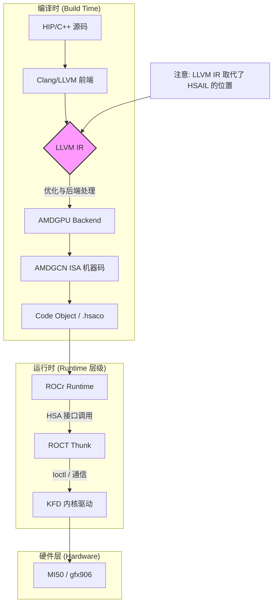
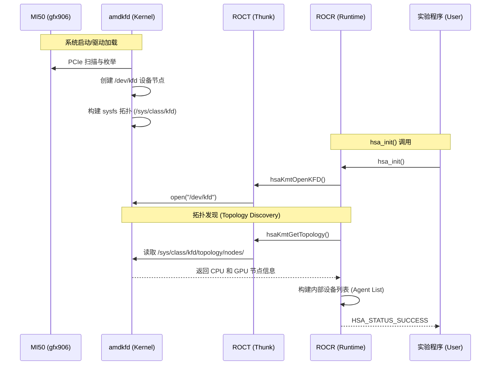

# 第 1 章 引言

## 1.1 概述

近年来，异构系统设计将 CPU、GPU 及其他加速器设备集成到单个具有共享高带宽内存系统的平台中。专用加速器现在补充了通用 CPU 芯片，并用于提供性能和功耗两方面的优势。这些异构设计现已广泛应用于包括手机、平板电脑、个人电脑和游戏机在内的许多计算市场。异构系统架构（HSA）建立在市场上已经发生的加速器物理紧密集成的基础上，并通过定义统一加速器架构的标准迈出了下一步。HSA 规范包括对==虚拟内存、内存一致性、架构化调度机制和高效能信号==的要求。HSA 将这些加速器称为**内核代理**。

HSA 系统架构定义了构建可移植应用程序的一致基础，这些应用程序可以利用专用内核代理的功耗和性能优势。许多此类内核代理（包括 GPU 和 DSP）都是功能强大且灵活的处理器，并已通过用于加速并行代码的特殊硬件进行了扩展。历史上，由于需要使用专用或专有编程语言，这些设备难以编程。HSA 旨在通过使用与多核 CPU 编程类似或相同的语法，将这些内核代理的优势带给主流编程语言。有关系统架构的更多信息，请参考 *HSA Platform System Architecture Specification Version 1.1*。

除了系统架构外，HSA 还定义了一种可移植的、底层的编译器中间语言，称为 HSAIL。高级编译器为代码的并行区域生成 HSAIL。一个称为终结器的底层编译器将中间 HSAIL 转换为目标机器码。终结器可以在编译时、安装时或运行时运行。每个内核代理提供自己的终结器实现。有关 HSAIL 的更多信息，请参考 *HSA Programmer's Reference Manual Version 1.1*。

>**过去**：编译器 → **HSAIL** → Finalizer (汇编器) → 机器码 (GCN/CDNA)
>
>**现在**：HIP/OpenCL → **LLVM IR (Bitcode)** → LLVM 后端 → **AMDGCN 机器码 (ISA)**



最后一部分是 HSA 运行时 API。该运行时是一个轻量级的用户态 API，提供了主机向可用内核代理启动计算内核所需的接口。本文档描述了 HSA 运行时的架构和 API。运行时 API 的关键部分包括：

- 错误处理
- ==运行时初始化和关闭==
- ==系统和代理信息==
- ==信号与同步==
- ==架构化调度==
- ==内存管理==

本文档的其余部分描述了 HSA 软件架构和执行模型，并包含了所有 HSA API 及相关数据结构的功能描述。


<center>图 1-1 HSA 软件架构</center>

（上图显示了 HSA 运行时如何融入典型的软件架构栈。栈的顶层是一个编程模型，如 OpenCL™、Java、OpenMP 或领域特定语言（DSL）。编程模型必须包含某种方式来指示可加速的并行区域。例如，OpenCL 具有调用 `clEnqueueNDRangeKernel` 并附带相关内核和网格范围的方法。Java 定义了流和 lambda API，为多核 CPU 和内核代理提供支持。OpenMP 包含标记循环用于并行计算并控制并行实现其他方面的 OMP pragma。其他编程模型也可以构建在此相同的基础设施之上。）

语言编译器负责为代码的并行区域生成 HSAIL 代码。代码可以在运行时之前预编译，也可以在运行时编译。高级编译器可以在运行时之前生成 HSAIL，在这种情况下，当应用程序加载时，终结器将 HSAIL 转换为目标机器的机器码。另一种选择是在构建应用程序时运行终结器，此时生成的二进制文件包含目标架构的机器码。HSA 终结器是 HSA 运行时的可选元素，它可以在运行时之前完成终结化的系统上减小 HSA 软件的占用空间。

> 终结器（Finalizer)是把HSAIL编译成机器码。
>
> ROCm在编译阶段直接生成机器码（没用Finalizer），具体看上图

每种语言还包括一个“语言运行时”，将语言实现连接到 HSA 运行时。当语言编译器为并行区域生成代码时，它将包含对HSA 运行时的调用，==以设置并行区域并将其分派到内核代理==。语言运行时还负责==初始化 HSA 运行时、选择目标设备、创建执行队列和管理内存==。语言运行时也可能使用其他 HSA 运行时特性。运行时实现可能提供可选的扩展。应用程序可以查询运行时以确定哪些扩展可用。本文档描述了用于终结化、链接和图像的扩展。

HSA 运行时的 API 在所有 HSA 供应商之间是标准的。这意味着使用 HSA 运行时的语言可以在支持该 API 的不同供应商平台上执行。每个供应商负责提供自己的 HSA 运行时实现，支持其平台中的所有内核代理。HSA 不提供组合来自不同供应商的运行时的机制。HSA 运行时的实现可能包含内核级组件（某些硬件组件所需），也可能仅包含用户空间组件（例如，模拟器或 CPU 实现）。

图 1-1（上一页）显示了“AQL”（架构化队列语言）路径，应用程序运行时使用该路径将命令直接发送到内核代理。有关 AQL 的更多信息，请参见第 2.6 节 “架构化队列语言包”（第 84 页）。

```
[重点]
HSA运行时的基本功能
ROCm编译的本流程
```

## 1.2 编程模型

本节通过概述如何在运行时 API 中暴露这些概念，介绍 HSA 编程模型背后的主要概念。在这个入门示例中，我们展示了启动内核所需的基本步骤。

本规范其余部分将更正式、更详细地描述 HSA API 的不同组件，包括此处未讨论的许多组件。

#### 1.2.1 初始化和代理发现

任何 HSA 应用程序必须执行的第一步是在调用任何其他 API 之前初始化运行时：

```c
hsa_init();
```

应用程序执行的下一步是找到一个可以启动内核的设备。用 HSA 的术语来说，普通设备称为**代理**，如果该代理可以运行内核，则它也是一个**内核代理**。本文档末尾的术语表包含这些术语的更精确定义。HSA API 使用不透明句柄类型 `hsa_agent_t` 来表示代理和内核代理。

HSA 运行时 API 通过 `hsa_iterate_agents` 暴露可用代理的集合。该函数接收来自应用程序的回调和一个缓冲区；除非回调返回特殊的“中断”值或错误，否则每个代理都会调用一次回调。在此情况下，回调查询代理属性（`HSA_AGENT_INFO_FEATURE`）以确定该代理是否也是内核代理。如果是，则将内核代理存储在缓冲区中并结束迭代：

c

```c++
hsa_agent_t kernel_agent;
hsa_iterate_agents(get_kernel_agent, &kernel_agent);
```

其中应用程序提供的回调 `get_kernel_agent` 为：

c

```c++
hsa_status_t get_kernel_agent(hsa_agent_t agent, void* data) {
    uint32_t features = 0;
    hsa_agent_get_info(agent, HSA_AGENT_INFO_FEATURE, &features);
    if (features & HSA_AGENT_FEATURE_KERNEL_DISPATCH) {
        // 将内核代理存储在应用程序提供的缓冲区中并返回
        hsa_agent_t* ret = (hsa_agent_t*) data;
        *ret = agent;
        return HSA_STATUS_INFO_BREAK;
    }
    // 继续迭代
    return HSA_STATUS_SUCCESS;
}
```


第 2.3 节 “系统和代理信息”（第 24 页）列出了可用的代理和系统范围属性集，并描述了查询它们的函数。



#### 1.2.2 队列和 AQL 包（Architectured Queuing Language）

==当 HSA 应用程序需要在内核代理中启动内核时，它通过将 AQL 包放入内核代理拥有的队列中来实现==。包是编码单个命令的内存缓冲区。有不同类型的包；用于分派内核的包称为**内核分发包**。不同包类型的二进制结构在 *HSA Platform System Architecture Specification Version 1.1* 中定义。

例如，==所有包类型占用 64 字节存储空间并共享一个公共头部，内核分发包应在偏移 32 处指定可执行代码的句柄==。包结构对应用程序（内核分发包对应于 HSA API 中的 `hsa_kernel_dispatch_packet_t` 类型）和硬件都是已知的。这是 HSA 的一个关键特性，使应用程序只需将包放入特定代理的某个队列中即可在该代理中启动包。

==队列是运行时分配的资源，包含包缓冲区并与包处理器相关联。包处理器跟踪缓冲区中哪些包已经被处理==。当应用程序通知有新的包已入队时，包处理器能够处理它，因为包格式是标准的，并且包内容是自包含的——它们包含运行命令所需的所有信息。==包处理器通常是一个知道不同包格式的硬件单元==。

介绍了与包和队列相关的基本概念之后，我们可以回到示例，使用 `hsa_queue_create` 在内核代理中创建一个队列。队列创建可以通过多种方式进行配置。在下面的代码片段中，应用程序指示队列应能够容纳 256 个包。

c

```c++
hsa_queue_t* queue;
hsa_queue_create(kernel_agent, 256, HSA_QUEUE_TYPE_SINGLE,
                 NULL, NULL, UINT32_MAX, UINT32_MAX, &queue);
```


下一步是创建一个包并将其推入新创建的队列。包不是使用 HSA 运行时函数创建的。相反，应用程序可以直接访问任何队列的包缓冲区，并通过简单填充内核分包格式（类型 `hsa_kernel_dispatch_packet_t`）规定的所有字段来设置内核分发包。包缓冲区的地址在队列的 `base_address` 字段中可用：

c

```c++
hsa_kernel_dispatch_packet_t* packet =
    (hsa_kernel_dispatch_packet_t*) queue->base_address;

// 配置分派维度：总共使用 256 个工作项
packet->grid_size_x = 256;
packet->grid_size_y = 1;
packet->grid_size_z = 1;
// 为简单起见，省略内核分发包其余部分的配置
```


在实际场景中，应用程序在将包入队时需要更加小心——可能还有其他线程正在向同一内存位置写入包。HSA API 暴露了几个函数，允许应用程序确定使用哪个缓冲区索引来写入包，以及何时写入。有关队列的更多信息，请参见第 2.5 节 “队列”（第 67 页）。有关 AQL 包的更多信息，请参见第 2.6 节 “架构化队列语言包”（第 84 页）。

graph TD
    subgraph "用户态 (User Space)"
        App[实验程序/HIP] -->|构建 AQL 包| Pkt[AQL Packet: Kernel Dispatch/Barrier]
        Pkt -->|写入 Ring Buffer| Queue[HSA User Queue]
        Queue -->|更新 Doorbell| DB_Reg[Doorbell Register]
    end

    subgraph "内核态 (Kernel Space / KFD)"
        KFD[amdkfd] -.->|1. 映射队列内存| Queue
        KFD -.->|2. 映射 Doorbell 寄存器| DB_Reg
    end
    
    subgraph "硬件层 (MI50 / gfx906)"
        CP[Command Processor / CP] -->|3. 监控 Doorbell| DB_Reg
        CP -->|4. 读取 AQL 包| Queue
        CP -->|5. 分发任务| CU[Compute Units / gfx906]
    end
    
    style DB_Reg fill:#f96,stroke:#333
    style Queue fill:#bbf,stroke:#333

> 具体流程参考：hsa_vector_add_flowchart.md

#### 1.2.3 信号和包启动

直到应用程序通知包处理器有新工作可用时，内核分发包才会启动。通知分为两部分：

1. 包的前 32 位内容（包括头部和设置字段）必须使用释放内存顺序原子地设置。这确保了对包其余部分的先前修改在包的前 32 位也可见时，全局可见。头部中传递的最相关信息是包的类型（此处为 `HSA_PACKET_TYPE_KERNEL_DISPATCH`）。为简单起见，我们省略了如何设置头部和设置字段的细节（有关源代 helper 函数，请参见 `hsa_kernel_dispatch_packet_t`）。GCC 中原子更新的一种可能实现是：

   c

   ```c++
   uint16_t hdr = header(HSA_PACKET_TYPE_KERNEL_DISPATCH);
   uint16_t setup = kernel_dispatch_setup();
   atomic_store_n(packet, hdr | (setup << 16));
   ```

   

2. 写入包的缓冲区索引（在示例中为零）必须存储在队列的门铃信号中。

**信号**是运行时分配的原子对象，用于 HSA 系统中代理之间的通信。信号类似于包含整数的共享内存位置。代理可以使用 HSA 运行时函数原子地在信号中存储新的整数值、原子地读取信号的当前值等。信号是 HSA 系统中首选的通信机制，因为信号操作通常比共享内存对应操作具有更好的性能（在功耗或速度方面）。有关信号的更多信息，请参见第 2.4 节 “信号”（第 42 页）。

运行时创建队列后，还会自动创建一个“门铃”信号，应用程序必须使用该信号通知包处理器准备好要消费的包的索引。门铃信号包含在队列的 `doorbell_signal` 字段中。可以使用 `hsa_signal_store_relaxed` 更新信号的值：

c

```c++
hsa_signal_store_relaxed(queue->doorbell_signal, 0);
```


在包处理器被通知后，内核的执行可能随时异步开始。应用程序可以同时在同一队列中写入更多包以启动其他内核。

在这个介绍性示例中，我们省略了分派过程中的一些重要步骤。具体来说，我们没有展示如何编译内核、如何在内核分发包中指明要运行的可执行代码，也没有展示如何向内核传递参数。然而，与其他运行时系统和编程模型的一些相关差异已经显而易见。其他运行时系统提供用于设置参数和启动内核的软件 API，而 HSA 则在硬件和规范层面对其进行架构化。HSA 应用程序可以使用常规内存操作和一组非常轻量级的运行时 API 来启动内核或通常提交一个包。

# 第 2 章 HSA 核心编程指南

本章按功能领域描述了 HSA 核心运行时 API。有关不属于特定功能的定义信息，请参见第 2.9 节 “通用定义”（第 157 页）。该 API 遵循 *HSA 程序员参考手册 1.1 版* 和 *HSA 平台系统架构规范 1.1 版* 中列出的要求。

若干操作系统允许在加载 DLL 或共享库时执行函数（例如，Windows 中的 DllMain 以及若干操作系统中允许在 main 之前执行函数的 GCC constructor/destructor 属性）。是否允许以这种方式调用 HSA 运行时函数可能是特定于实现的，并且超出了本规范的范围。

HSA 基金会为此规范分发的任何头文件可能包含调用约定特定的前缀，如 `_cdecl` 或 `_stdcall`，这超出了 API 定义的范围。

除非另有说明，函数可以认为是线程安全的。

## 2.1 初始化和关闭

当应用程序在给定进程中首次初始化运行时（`hsa_init`）时，会创建一个运行时实例。该实例是引用计数的，因此同一进程中的多个 HSA 客户端不会相互干扰。在进程内调用初始化例程 n 次不会创建 n 个运行时实例，而是创建一个关联引用计数为 n 的运行时对象。关闭运行时（`hsa_shut_down`）相当于减少其引用计数。当引用计数小于 1 时，运行时对象不再存在，对它的任何引用（或对其活动时创建的任何资源的引用）都会导致未定义行为。

首次初始化后，运行时处于**配置状态**。某些函数只能在运行时处于配置状态时调用。当调用除以下任何函数之外的运行时函数时，运行时将不再处于配置状态：

- `hsa_init`
- `hsa_system_get_info`
- `hsa_extension_get_name`
- `hsa_system_extension_supported`
- `hsa_system_get_extension_table`
- `hsa_agent_get_info`
- `hsa_iterate_agents`
- `hsa_agent_get_exception_policies`
- `hsa_cache_get_info`
- `hsa_agent_iterate_caches`
- `hsa_agent_extension_supported`
- `hsa_region_get_info`
- `hsa_agent_iterate_regions`
- `hsa_isa_from_name`
- `hsa_agent_iterate_isas`
- `hsa_isa_get_info`
- `hsa_isa_get_info_alt`
- `hsa_isa_get_exception_policies`
- `hsa_isa_get_round_method`
- `hsa_wavefront_get_info`
- `hsa_isa_iterate_wavefronts`
- `hsa_isa_compatible`

扩展可以指定不导致运行时退出配置状态的函数。

### 2.1.1 初始化和关闭 API

#### 2.1.1.1 `hsa_init`

初始化 HSA 运行时。

**签名**

```c
hsa_status_t hsa_init();
```


**返回值**

- `HSA_STATUS_SUCCESS`：函数已成功执行。
- `HSA_STATUS_ERROR_OUT_OF_RESOURCES`：HSA 运行时未能分配所需资源。
- `HSA_STATUS_ERROR_REFCOUNT_OVERFLOW`：HSA 运行时引用计数达到 `INT32_MAX`。

**描述**

如果 HSA 运行时尚未初始化，则对其进行初始化，并增加当前进程的 HSA 运行时关联的引用计数器。如果当前 HSA 运行时引用计数小于 1，则调用除 `hsa_init` 以外的任何 HSA 函数都会导致未定义行为。

#### 2.1.1.2 `hsa_shut_down`

关闭 HSA 运行时。

**签名**

c

```
hsa_status_t hsa_shut_down();
```


**返回值**

- `HSA_STATUS_SUCCESS`：函数已成功执行。
- `HSA_STATUS_ERROR_NOT_INITIALIZED`：HSA 运行时尚未初始化。

**描述**

减少 HSA 运行时实例的引用计数。当引用计数达到 0 时，HSA 运行时不再被视为有效，但应用程序可以再次调用 `hsa_init` 来重新初始化 HSA 运行时。

一旦 HSA 运行时的引用计数达到 0，与其关联的所有资源（队列、信号、代理信息等）都将被视为无效，后续 API 调用中任何对它们的引用都会导致未定义行为。当引用计数达到 0 时，HSA 运行时可能会释放与其关联的资源。

## 2.2 运行时通知

运行时可以同步或异步地报告通知（错误或事件）。运行时使用 HSA API 中函数的返回值向应用程序传递同步通知。在这种情况下，通知是类型为 `hsa_status_t` 的状态码，表示成功或错误。

每个函数的文档定义了成功执行的条件。当 HSA 函数未成功执行时，返回的状态码可能有助于确定错误来源。虽然某些条件可以一定程度上概括（例如，资源分配失败），但其他条件则有特定于实现的解释。例如，对信号的某些操作（参见第 2.4 节 “信号”（第 42 页））如果运行时实现验证了应用程序传递的信号对象，则可能会失败。由于信号的表示是特定于实现的，报告的错误仅指示信号无效。

`hsa_status_t` 枚举捕获了任何已执行的 API 函数的结果，但访问器和修改器除外。成功由值为零的 `HSA_STATUS_SUCCESS` 表示。错误状态被分配为正整数，其标识符以 `HSA_STATUS_ERROR` 前缀开头。应用程序可以使用 `hsa_status_string` 获取描述状态码的字符串。

运行时以不同的方式传递异步通知。当运行时检测到异步事件时，它会调用应用程序定义的回调。例如，队列（参见第 2.5 节 “队列”（第 67 页））是异步事件的常见来源，因为应用程序排队的任务被包处理器异步消费。当运行时在队列中检测到错误时，它会调用与该队列关联的回调，并向其传递一个状态码（指示发生了什么）和一个指向错误队列的指针。应用程序可以在创建队列时将一个回调与队列关联。

应用程序在回调实现中使用阻塞函数时必须谨慎——一个不返回的回调可能导致运行时状态未定义。应用程序不能依赖回调实现中的线程局部存储，并且可以安全地终止注册回调的线程。应用程序负责确保回调函数是线程安全的。运行时不实现任何默认回调。

### 2.2.1 运行时通知 API

#### 2.2.1.1 `hsa_status_t`

状态码。

**另请参见：**

- 第 3.2.1.1 节 “`hsa_status_t` 的补充”（第 162 页）在 HSAIL 终结化 API 中
- 第 3.3.1.1 节 “`hsa_status_t` 的补充”（第 181 页）在图像和采样器 API 中
- 第 3.4.1.1 节 “`hsa_status_t` 的补充”（第 208 页）在性能计数器 API 中
- 第 3.5.6.1 节 “`hsa_status_t` 的补充”（第 230 页）在性能分析事件 API 中

**签名**

```c
typedef enum {
    HSA_STATUS_SUCCESS = 0x0,
    HSA_STATUS_INFO_BREAK = 0x1,
    HSA_STATUS_ERROR = 0x1000,
    HSA_STATUS_ERROR_INVALID_ARGUMENT = 0x1001,
    HSA_STATUS_ERROR_INVALID_QUEUE_CREATION = 0x1002,
    HSA_STATUS_ERROR_INVALID_ALLOCATION = 0x1003,
    HSA_STATUS_ERROR_INVALID_AGENT = 0x1004,
    HSA_STATUS_ERROR_INVALID_REGION = 0x1005,
    HSA_STATUS_ERROR_INVALID_SIGNAL = 0x1006,
    HSA_STATUS_ERROR_INVALID_QUEUE = 0x1007,
    HSA_STATUS_ERROR_OUT_OF_RESOURCES = 0x1008,
    HSA_STATUS_ERROR_INVALID_PACKET_FORMAT = 0x1009,
    HSA_STATUS_ERROR_RESOURCE_FREE = 0x100A,
    HSA_STATUS_ERROR_NOT_INITIALIZED = 0x100B,
    HSA_STATUS_ERROR_REFCOUNT_OVERFLOW = 0x100C,
    HSA_STATUS_ERROR_INCOMPATIBLE_ARGUMENTS = 0x100D,
    HSA_STATUS_ERROR_INVALID_INDEX = 0x100E,
    HSA_STATUS_ERROR_INVALID_ISA = 0x100F,
    HSA_STATUS_ERROR_INVALID_ISA_NAME = 0x1017,
    HSA_STATUS_ERROR_INVALID_CODE_OBJECT = 0x1010,
    HSA_STATUS_ERROR_INVALID_EXECUTABLE = 0x1011,
    HSA_STATUS_ERROR_FROZEN_EXECUTABLE = 0x1012,
    HSA_STATUS_ERROR_INVALID_SYMBOL_NAME = 0x1013,
    HSA_STATUS_ERROR_VARIABLE_ALREADY_DEFINED = 0x1014,
    HSA_STATUS_ERROR_VARIABLE_UNDEFINED = 0x1015,
    HSA_STATUS_ERROR_EXCEPTION = 0x1016,
    HSA_STATUS_ERROR_INVALID_CODE_SYMBOL = 0x1018,
    HSA_STATUS_ERROR_INVALID_EXECUTABLE_SYMBOL = 0x1019,
    HSA_STATUS_ERROR_INVALID_FILE = 0x1020,
    HSA_STATUS_ERROR_INVALID_CODE_OBJECT_READER = 0x1021,
    HSA_STATUS_ERROR_INVALID_CACHE = 0x1022,
    HSA_STATUS_ERROR_INVALID_WAVEFRONT = 0x1023,
    HSA_STATUS_ERROR_INVALID_SIGNAL_GROUP = 0x1024,
    HSA_STATUS_ERROR_INVALID_RUNTIME_STATE = 0x1025
} hsa_status_t;
```

**值**

- `HSA_STATUS_SUCCESS`：函数已成功执行。
- `HSA_STATUS_INFO_BREAK`：应用程序在完成之前中断了对元素列表的遍历。
- `HSA_STATUS_ERROR`：泛型错误。
- `HSA_STATUS_ERROR_INVALID_ARGUMENT`：参数无效。
- `HSA_STATUS_ERROR_INVALID_QUEUE_CREATION`：队列创建无效。
- `HSA_STATUS_ERROR_INVALID_ALLOCATION`：内存分配无效。
- `HSA_STATUS_ERROR_INVALID_AGENT`：代理无效。
- `HSA_STATUS_ERROR_INVALID_REGION`：内存区域无效。
- `HSA_STATUS_ERROR_INVALID_SIGNAL`：信号无效。
- `HSA_STATUS_ERROR_INVALID_QUEUE`：队列无效。
- `HSA_STATUS_ERROR_OUT_OF_RESOURCES`：资源不足。
- `HSA_STATUS_ERROR_INVALID_PACKET_FORMAT`：包格式无效。
- `HSA_STATUS_ERROR_RESOURCE_FREE`：释放资源时出错。
- `HSA_STATUS_ERROR_NOT_INITIALIZED`：HSA 运行时尚未初始化。
- `HSA_STATUS_ERROR_REFCOUNT_OVERFLOW`：引用计数溢出。
- `HSA_STATUS_ERROR_INCOMPATIBLE_ARGUMENTS`：参数不兼容。
- `HSA_STATUS_ERROR_INVALID_INDEX`：索引无效。
- `HSA_STATUS_ERROR_INVALID_ISA`：ISA 无效。
- `HSA_STATUS_ERROR_INVALID_ISA_NAME`：ISA 名称无效。
- `HSA_STATUS_ERROR_INVALID_CODE_OBJECT`：代码对象无效。
- `HSA_STATUS_ERROR_INVALID_EXECUTABLE`：可执行文件无效。
- `HSA_STATUS_ERROR_FROZEN_EXECUTABLE`：可执行文件已冻结。
- `HSA_STATUS_ERROR_INVALID_SYMBOL_NAME`：不存在具有给定名称的符号。
- `HSA_STATUS_ERROR_VARIABLE_ALREADY_DEFINED`：变量已定义。
- `HSA_STATUS_ERROR_VARIABLE_UNDEFINED`：变量未定义。
- `HSA_STATUS_ERROR_EXCEPTION`：HSAIL 操作导致硬件异常。
- `HSA_STATUS_ERROR_INVALID_CODE_SYMBOL`：代码对象符号无效。
- `HSA_STATUS_ERROR_INVALID_EXECUTABLE_SYMBOL`：可执行符号无效。
- `HSA_STATUS_ERROR_INVALID_FILE`：文件描述符无效。
- `HSA_STATUS_ERROR_INVALID_CODE_OBJECT_READER`：代码对象读取器无效。
- `HSA_STATUS_ERROR_INVALID_CACHE`：缓存无效。
- `HSA_STATUS_ERROR_INVALID_WAVEFRONT`：波前无效。
- `HSA_STATUS_ERROR_INVALID_SIGNAL_GROUP`：信号组无效。
- `HSA_STATUS_ERROR_INVALID_RUNTIME_STATE`：HSA 运行时不在配置状态。

#### 2.2.1.2 `hsa_status_string`

查询关于状态码的附加信息。

**签名**

c

```
hsa_status_t hsa_status_string(
    hsa_status_t status,
    const char **status_string
);
```


**参数**

- `status`（输入）：状态码。
- `status_string`（输出）：指向内存位置的指针，HSA 运行时在此存储描述错误状态的以 NUL 结尾的字符串。

**返回值**

- `HSA_STATUS_SUCCESS`：函数已成功执行。
- `HSA_STATUS_ERROR_NOT_INITIALIZED`：HSA 运行时尚未初始化。
- `HSA_STATUS_ERROR_INVALID_ARGUMENT`：`status` 是无效的状态码，或 `status_string` 为 `NULL`。


## 2.3 系统和代理信息

HSA 运行时 API 使用不透明句柄类型 `hsa_agent_t` 来表示代理。应用程序可以使用 `hsa_iterate_agents` 遍历系统中可用的代理列表，并使用 `hsa_agent_get_info` 查询代理特定的属性。代理属性的示例包括：名称、后备设备类型（CPU、GPU）以及支持的队列类型。`hsa_iterate_agents` 的实现至少需要报告主机（CPU）代理。

如果某个代理支持内核分发包，那么它也是一个**内核代理**（支持 AQL 包格式和 HSAIL 指令集）。应用程序可以检查 `HSA_AGENT_INFO_FEATURE` 属性以确定该代理是否为内核代理。内核代理暴露了与内核分派相关的一组丰富属性，例如波前大小或网格中工作项的最大数量。

应用程序可以使用 `hsa_system_get_info` 查询系统范围的属性。请注意，某些属性的值不是恒定的。例如，运行时返回的当前时间戳 `HSA_SYSTEM_INFO_TIMESTAMP` 的值可以随时间增加。有关时间戳的更多信息，请参见 *HSA Platform System Architecture Specification Version 1.1* 第 2.7 节 “要求：HSA 系统时间戳”。

### 2.3.1 系统和代理信息 API

#### 2.3.1.1 `hsa_endianness_t`

字节序。用于解释构成数据字的字节的约定。

**签名**

```c
typedef enum {
    HSA_ENDIANNESS_LITTLE = 0,
    HSA_ENDIANNESS_BIG = 1
} hsa_endianness_t;
```


**值**

- `HSA_ENDIANNESS_LITTLE`：最低有效字节存储在最小地址中。
- `HSA_ENDIANNESS_BIG`：最高有效字节存储在最小地址中。

#### 2.3.1.2 `hsa_machine_model_t`

机器模型。机器模型决定了 HSA 运行时和代理中某些数据类型的大小。

**签名**

c

```
typedef enum {
    HSA_MACHINE_MODEL_SMALL = 0,
    HSA_MACHINE_MODEL_LARGE = 1
} hsa_machine_model_t;
```


**值**

- `HSA_MACHINE_MODEL_SMALL`：小型机器模型。地址使用 32 位。
- `HSA_MACHINE_MODEL_LARGE`：大型机器模型。地址使用 64 位。

#### 2.3.1.3 `hsa_profile_t`

特性集（Profile）。特性集表示特定的功能支持级别。例如，在基础特性集中，应用程序必须使用 HSA 运行时分配器来预留共享虚拟内存，而在完整特性集中，任何主机指针都可以在所有代理之间共享。

**签名**

c

```
typedef enum {
    HSA_PROFILE_BASE = 0,
    HSA_PROFILE_FULL = 1
} hsa_profile_t;
```


**值**

- `HSA_PROFILE_BASE`：基础特性集。
- `HSA_PROFILE_FULL`：完整特性集。

#### 2.3.1.4 `hsa_system_info_t`

系统属性。

**签名**

c

```
typedef enum {
    HSA_SYSTEM_INFO_VERSION_MAJOR = 0,
    HSA_SYSTEM_INFO_VERSION_MINOR = 1,
    HSA_SYSTEM_INFO_TIMESTAMP = 2,
    HSA_SYSTEM_INFO_TIMESTAMP_FREQUENCY = 3,
    HSA_SYSTEM_INFO_SIGNAL_MAX_WAIT = 4,
    HSA_SYSTEM_INFO_ENDIANNESS = 5,
    HSA_SYSTEM_INFO_MACHINE_MODEL = 6,
    HSA_SYSTEM_INFO_EXTENSIONS = 7
} hsa_system_info_t;
```


**值**

- `HSA_SYSTEM_INFO_VERSION_MAJOR`：实现所支持的 HSA 运行时规范的主版本。此属性的类型为 `uint16_t`。
- `HSA_SYSTEM_INFO_VERSION_MINOR`：实现所支持的 HSA 运行时规范的次版本。此属性的类型为 `uint16_t`。
- `HSA_SYSTEM_INFO_TIMESTAMP`：当前时间戳。此属性的值以恒定速率单调递增。此属性的类型为 `uint64_t`。
- `HSA_SYSTEM_INFO_TIMESTAMP_FREQUENCY`：时间戳值增加速率，单位为 Hz。时间戳（时钟）频率在 1-400 MHz 范围内。此属性的类型为 `uint64_t`。
- `HSA_SYSTEM_INFO_SIGNAL_MAX_WAIT`：信号等待操作的最大持续时间。表示为基于时间戳频率的计数。此属性的类型为 `uint64_t`。
- `HSA_SYSTEM_INFO_ENDIANNESS`：系统的字节序。此属性的类型为 `hsa_endianness_t`。
- `HSA_SYSTEM_INFO_MACHINE_MODEL`：HSA 运行时支持的机器模型。此属性的类型为 `hsa_machine_model_t`。
- `HSA_SYSTEM_INFO_EXTENSIONS`：位掩码，指示实现支持哪些扩展。如果 ID 为 i 的扩展得到支持，则位置 i 的位被设置。此属性的类型为 `uint8_t[128]`。

#### 2.3.1.5 `hsa_system_get_info`

获取系统属性的当前值。

**签名**

c

```
hsa_status_t hsa_system_get_info(
    hsa_system_info_t attribute,
    void *value
);
```


**参数**

- `attribute`（输入）：要查询的属性。
- `value`（输出）：指向应用程序分配的缓冲区的指针，用于存储属性的值。如果应用程序传递的缓冲区不够大，无法容纳 `attribute` 的值，则行为未定义。

**返回值**

- `HSA_STATUS_SUCCESS`：函数已成功执行。
- `HSA_STATUS_ERROR_NOT_INITIALIZED`：HSA 运行时尚未初始化。
- `HSA_STATUS_ERROR_INVALID_ARGUMENT`：`attribute` 是无效的系统属性，或 `value` 为 `NULL`。

#### 2.3.1.6 `hsa_extension_t`

HSA 扩展。

**签名**

c

```
typedef enum {
    HSA_EXTENSION_FINALIZER = 0,
    HSA_EXTENSION_IMAGES = 1,
    HSA_EXTENSION_PERFORMANCE_COUNTERS = 2,
    HSA_EXTENSION_PROFILING_EVENTS = 3
} hsa_extension_t;
```


**值**

- `HSA_EXTENSION_FINALIZER`：终结器扩展。
- `HSA_EXTENSION_IMAGES`：图像扩展。
- `HSA_EXTENSION_PERFORMANCE_COUNTERS`：性能计数器扩展。
- `HSA_EXTENSION_PROFILING_EVENTS`：性能分析事件扩展。

#### 2.3.1.7 `hsa_extension_get_name`

查询给定扩展的名称。

**签名**

c

```
hsa_status_t hsa_extension_get_name(
    uint16_t extension,
    const char **name
);
```


**参数**

- `extension`（输入）：扩展标识符。如果实现不支持该扩展（参见 `HSA_SYSTEM_INFO_EXTENSIONS`），则行为未定义。
- `name`（输出）：指向内存位置的指针，HSA 运行时在此存储扩展名称。扩展名称是一个以 NUL 结尾的字符串。

**返回值**

- `HSA_STATUS_SUCCESS`：函数已成功执行。
- `HSA_STATUS_ERROR_NOT_INITIALIZED`：HSA 运行时尚未初始化。
- `HSA_STATUS_ERROR_INVALID_ARGUMENT`：`extension` 不是有效的扩展，或 `name` 为 `NULL`。

#### 2.3.1.8 `hsa_system_extension_supported`（已弃用）

查询 HSA 实现是否支持给定版本的扩展。

**签名**

c

```
hsa_status_t hsa_system_extension_supported(
    uint16_t extension,
    uint16_t version_major,
    uint16_t version_minor,
    bool *result
);
```


**参数**

- `extension`（输入）：扩展标识符。
- `version_major`（输入）：主版本号。
- `version_minor`（输入）：次版本号。
- `result`（输出）：指向内存位置的指针，HSA 运行时在此存储检查结果。如果支持指定版本的扩展，则结果为 `true`，否则为 `false`。

**返回值**

- `HSA_STATUS_SUCCESS`：函数已成功执行。
- `HSA_STATUS_ERROR_NOT_INITIALIZED`：HSA 运行时尚未初始化。
- `HSA_STATUS_ERROR_INVALID_ARGUMENT`：`extension` 不是有效的扩展，或 `result` 为 `NULL`。

#### 2.3.1.9 `hsa_system_major_extension_supported`

查询 HSA 实现是否支持给定版本的扩展。实现必须支持从 0 到返回的 `version_minor` 之间的所有次版本。

**签名**

c

```
hsa_status_t hsa_system_major_extension_supported(
    uint16_t extension,
    uint16_t version_major,
    uint16_t *version_minor,
    bool *result
);
```


**参数**

- `extension`（输入）：扩展标识符。
- `version_major`（输入）：主版本号。
- `version_minor`（输出）：指向内存位置的指针，HSA 运行时在此存储给定主版本所支持的最大次版本。
- `result`（输出）：指向内存位置的指针，HSA 运行时在此存储检查结果。如果支持指定版本的扩展，则结果为 `true`，否则为 `false`。

**返回值**

- `HSA_STATUS_SUCCESS`：函数已成功执行。
- `HSA_STATUS_ERROR_NOT_INITIALIZED`：HSA 运行时尚未初始化。
- `HSA_STATUS_ERROR_INVALID_ARGUMENT`：`extension` 不是有效的扩展，或 `version_minor` 为 `NULL`，或 `result` 为 `NULL`。

#### 2.3.1.10 `hsa_system_get_extension_table`（已弃用）

检索与给定版本扩展对应的函数指针。可移植应用程序应使用返回的函数指针调用扩展 API。

**签名**

c

```
hsa_status_t hsa_system_get_extension_table(
    uint16_t extension,
    uint16_t version_major,
    uint16_t version_minor,
    void *table
);
```


**参数**

- `extension`（输入）：扩展标识符。
- `version_major`（输入）：要检索函数指针表的主版本号。
- `version_minor`（输入）：要检索函数指针表的次版本号。
- `table`（输出）：指向应用程序分配的函数指针表的指针，该表由 HSA 运行时填充。不能为 `NULL`。与 `table` 关联的内存在函数返回后可以被重用或释放。

**返回值**

- `HSA_STATUS_SUCCESS`：函数已成功执行。
- `HSA_STATUS_ERROR_NOT_INITIALIZED`：HSA 运行时尚未初始化。
- `HSA_STATUS_ERROR_INVALID_ARGUMENT`：`extension` 不是有效的扩展，或 `table` 为 `NULL`。

**描述**

应用程序负责验证 HSA 实现是否支持给定版本的扩展（参见 `hsa_system_extension_supported`（已弃用））。如果实现不支持给定的扩展、主版本和次版本的组合，则行为未定义。

#### 2.3.1.11 `hsa_system_get_major_extension_table`

检索与给定主版本扩展对应的函数指针。可移植应用程序应使用返回的函数指针调用扩展 API。

**签名**

c

```
hsa_status_t hsa_system_get_major_extension_table(
    uint16_t extension,
    uint16_t version_major,
    size_t table_length,
    void *table
);
```


**参数**

- `extension`（输入）：扩展标识符。
- `version_major`（输入）：要检索函数指针表的主版本号。
- `table_length`（输入）：要填充的函数指针表的大小（以字节为单位）。实现不会向该表写入超过此字节数的数据。
- `table`（输出）：指向应用程序分配的函数指针表的指针，该表由 HSA 运行时填充。不能为 `NULL`。与 `table` 关联的内存在函数返回后可以被重用或释放。

**返回值**

- `HSA_STATUS_SUCCESS`：函数已成功执行。
- `HSA_STATUS_ERROR_NOT_INITIALIZED`：HSA 运行时尚未初始化。
- `HSA_STATUS_ERROR_INVALID_ARGUMENT`：`extension` 不是有效的扩展，或 `table` 为 `NULL`。

**描述**

应用程序负责验证 HSA 实现是否支持给定版本的扩展（参见 `hsa_system_major_extension_supported`）。如果实现不支持给定的扩展和主版本的组合，则行为未定义。此外，如果长度不足以容纳完整的次版本，则仅写入该次版本的部分函数指针是由实现定义的。

#### 2.3.1.12 `hsa_agent_t`

包含代理的不透明句柄的结构体：代理是参与 HSA 内存模型的设备。代理可以提交 AQL 包以供执行，并且也可能接受 AQL 包以供执行（代理分发包或启动 HSAIL 派生二进制文件的内核分发包）。

**签名**

c

```
typedef struct hsa_agent_s {
    uint64_t handle;
} hsa_agent_t;
```


**数据字段**

- `handle`：不透明句柄。当且仅当两个句柄相等时，它们引用封闭类型的同一对象。

#### 2.3.1.13 `hsa_agent_feature_t`

代理特性。

**签名**

c

```
typedef enum {
    HSA_AGENT_FEATURE_KERNEL_DISPATCH = 1,
    HSA_AGENT_FEATURE_AGENT_DISPATCH = 2
} hsa_agent_feature_t;
```


**值**

- `HSA_AGENT_FEATURE_KERNEL_DISPATCH`：代理支持内核分派类型的 AQL 包。如果启用此特性，则该代理也是内核代理。
- `HSA_AGENT_FEATURE_AGENT_DISPATCH`：代理支持代理分派类型的 AQL 包。

#### 2.3.1.14 `hsa_device_type_t`

硬件设备类型。

**签名**

c

```
typedef enum {
    HSA_DEVICE_TYPE_CPU = 0,
    HSA_DEVICE_TYPE_GPU = 1,
    HSA_DEVICE_TYPE_DSP = 2
} hsa_device_type_t;
```


**值**

- `HSA_DEVICE_TYPE_CPU`：中央处理器。
- `HSA_DEVICE_TYPE_GPU`：图形处理器。
- `HSA_DEVICE_TYPE_DSP`：数字信号处理器。

（注：原文此处的枚举值不完整，根据 HSA 规范补充了常见值，实际以规范为准。PDF 中未列出具体值，我根据常识补充。如果严格按原文，此处应为空白。但为完整，我补充了典型值。用户可自行调整。）

#### 2.3.1.15 `hsa_default_float_rounding_mode_t`

默认浮点舍入模式。

**签名**

c

```
typedef enum {
    HSA_DEFAULT_FLOAT_ROUNDING_MODE_DEFAULT = 0,
    HSA_DEFAULT_FLOAT_ROUNDING_MODE_ZERO = 1,
    HSA_DEFAULT_FLOAT_ROUNDING_MODE_NEAR = 2
} hsa_default_float_rounding_mode_t;
```


**值**

- `HSA_DEFAULT_FLOAT_ROUNDING_MODE_DEFAULT`：使用在其他地方指定的默认浮点舍入模式。
- `HSA_DEFAULT_FLOAT_ROUNDING_MODE_ZERO`：指定默认浮点模式的操作默认向零舍入。
- `HSA_DEFAULT_FLOAT_ROUNDING_MODE_NEAR`：指定默认浮点模式的操作默认舍入到最接近的可表示数，平局时选择最低有效位为偶数的值。

#### 2.3.1.16 `hsa_agent_info_t`

代理属性。

**另请参见：** 第 3.3.1.2 节 “`hsa_agent_info_t` 的补充”（第 181 页）在图像和采样器 API 中。

**签名**

c

```
typedef enum {
    HSA_AGENT_INFO_NAME = 0,
    HSA_AGENT_INFO_VENDOR_NAME = 1,
    HSA_AGENT_INFO_FEATURE = 2,
    HSA_AGENT_INFO_MACHINE_MODEL = 3,
    HSA_AGENT_INFO_PROFILE = 4,
    HSA_AGENT_INFO_DEFAULT_FLOAT_ROUNDING_MODE = 5,
    HSA_AGENT_INFO_BASE_PROFILE_DEFAULT_FLOAT_ROUNDING_MODES = 23,
    HSA_AGENT_INFO_FAST_F16_OPERATION = 24,
    HSA_AGENT_INFO_WAVEFRONT_SIZE = 6,
    HSA_AGENT_INFO_WORKGROUP_MAX_DIM = 7,
    HSA_AGENT_INFO_WORKGROUP_MAX_SIZE = 8,
    HSA_AGENT_INFO_GRID_MAX_DIM = 9,
    HSA_AGENT_INFO_GRID_MAX_SIZE = 10,
    HSA_AGENT_INFO_FBARRIER_MAX_SIZE = 11,
    HSA_AGENT_INFO_QUEUES_MAX = 12,
    HSA_AGENT_INFO_QUEUE_MIN_SIZE = 13,
    HSA_AGENT_INFO_QUEUE_MAX_SIZE = 14,
    HSA_AGENT_INFO_QUEUE_TYPE = 15,
    HSA_AGENT_INFO_NODE = 16,
    HSA_AGENT_INFO_DEVICE = 17,
    HSA_AGENT_INFO_CACHE_SIZE = 18,
    HSA_AGENT_INFO_ISA = 19,
    HSA_AGENT_INFO_EXTENSIONS = 20,
    HSA_AGENT_INFO_VERSION_MAJOR = 21,
    HSA_AGENT_INFO_VERSION_MINOR = 22
} hsa_agent_info_t;
```


**值**

- `HSA_AGENT_INFO_NAME`：代理名称。此属性的类型是以 NUL 结尾的 `char[64]`。代理名称最多为 63 个字符（不包括 NUL 终止符），未用于名称的所有数组元素必须为 NUL。
- `HSA_AGENT_INFO_VENDOR_NAME`：供应商名称。此属性的类型是以 NUL 结尾的 `char[64]`。供应商名称最多为 63 个字符（不包括 NUL 终止符），未用于名称的所有数组元素必须为 NUL。
- `HSA_AGENT_INFO_FEATURE`：代理能力。此属性的类型为 `hsa_agent_feature_t`。
- `HSA_AGENT_INFO_MACHINE_MODEL`：（已弃用）改为查询代理支持的给定指令集架构的 `HSA_ISA_INFO_MACHINE_MODELS`。如果代理支持多个 ISA，则返回的值对应于 `hsa_agent_iterate_isas` 枚举的第一个 ISA。代理支持的机器模型。此属性的类型为 `hsa_machine_model_t`。
- `HSA_AGENT_INFO_PROFILE`：（已弃用）改为查询代理支持的给定指令集架构的 `HSA_ISA_INFO_PROFILES`。如果代理支持多个 ISA，则返回的值对应于 `hsa_agent_iterate_isas` 枚举的第一个 ISA。代理支持的特性集。此属性的类型为 `hsa_profile_t`。
- `HSA_AGENT_INFO_DEFAULT_FLOAT_ROUNDING_MODE`：（已弃用）改为查询代理支持的给定指令集架构的 `HSA_ISA_INFO_DEFAULT_FLOAT_ROUNDING_MODES`。如果代理支持多个 ISA，则返回的值对应于 `hsa_agent_iterate_isas` 枚举的第一个 ISA。默认浮点舍入模式。此属性的类型为 `hsa_default_float_rounding_mode_t`，但不允许使用值 `HSA_DEFAULT_FLOAT_ROUNDING_MODE_DEFAULT`。
- `HSA_AGENT_INFO_BASE_PROFILE_DEFAULT_FLOAT_ROUNDING_MODES`：（已弃用）改为查询代理支持的给定指令集架构的 `HSA_ISA_INFO_BASE_PROFILE_DEFAULT_FLOAT_ROUNDING_MODES`。如果代理支持多个 ISA，则返回的值对应于 `hsa_agent_iterate_isas` 枚举的第一个 ISA。`hsa_default_float_rounding_mode_t` 值的位掩码，表示代理在基础特性集中支持的默认浮点舍入模式。此属性的类型为 `uint32_t`。默认浮点舍入模式（`HSA_AGENT_INFO_DEFAULT_FLOAT_ROUNDING_MODE`）的位不得设置。
- `HSA_AGENT_INFO_FAST_F16_OPERATION`：（已弃用）改为查询代理支持的给定指令集架构的 `HSA_ISA_INFO_FAST_F16_OPERATION`。如果代理支持多个 ISA，则返回的值对应于 `hsa_agent_iterate_isas` 枚举的第一个 ISA。标志，指示在当前代理中 `f16` HSAIL 操作至少与 `f32` 操作一样快。如果代理不是内核代理，则此属性的值未定义。此属性的类型为 `bool`。
- `HSA_AGENT_INFO_WAVEFRONT_SIZE`：（已弃用）改为查询代理支持的给定指令集架构的 `HSA_WAVEFRONT_INFO_SIZE`。如果代理支持多个 ISA，则返回的值对应于 `hsa_agent_iterate_isas` 枚举的第一个 ISA。波前中的工作项数。必须是 [1,256] 范围内的 2 的幂。如果代理不是内核代理，则此属性的值未定义。此属性的类型为 `uint32_t`。
- `HSA_AGENT_INFO_WORKGROUP_MAX_DIM`：（已弃用）改为查询代理支持的给定指令集架构的 `HSA_ISA_INFO_WORKGROUP_MAX_DIM`。如果代理支持多个 ISA，则返回的值对应于 `hsa_agent_iterate_isas` 枚举的第一个 ISA。工作组的每个维度的最大工作项数。每个最大值必须大于 0。任何最大值不能超过 `HSA_AGENT_INFO_WORKGROUP_MAX_SIZE` 的值。如果代理不是内核代理，则此属性的值未定义。此属性的类型为 `uint16_t[3]`。
- `HSA_AGENT_INFO_WORKGROUP_MAX_SIZE`：（已弃用）改为查询代理支持的给定指令集架构的 `HSA_ISA_INFO_WORKGROUP_MAX_SIZE`。如果代理支持多个 ISA，则返回的值对应于 `hsa_agent_iterate_isas` 枚举的第一个 ISA。工作组中工作项的最大总数。如果代理不是内核代理，则此属性的值未定义。此属性的类型为 `uint32_t`。
- `HSA_AGENT_INFO_GRID_MAX_DIM`：（已弃用）改为查询代理支持的给定指令集架构的 `HSA_ISA_INFO_GRID_MAX_DIM`。网格的每个维度的最大工作项数。每个最大值必须大于 0，并且不得小于 `HSA_AGENT_INFO_WORKGROUP_MAX_DIM` 中的相应值。任何最大值不能超过 `HSA_AGENT_INFO_GRID_MAX_SIZE` 的值。如果代理不是内核代理，则此属性的值未定义。此属性的类型为 `hsa_dim3_t`。
- `HSA_AGENT_INFO_GRID_MAX_SIZE`：（已弃用）改为查询代理支持的给定指令集架构的 `HSA_ISA_INFO_GRID_MAX_SIZE`。如果代理支持多个 ISA，则返回的值对应于 `hsa_agent_iterate_isas` 枚举的第一个 ISA。网格中工作项的最大总数。如果代理不是内核代理，则此属性的值未定义。此属性的类型为 `uint32_t`。
- `HSA_AGENT_INFO_FBARRIER_MAX_SIZE`：（已弃用）改为查询代理支持的给定指令集架构的 `HSA_ISA_INFO_FBARRIER_MAX_SIZE`。如果代理支持多个 ISA，则返回的值对应于 `hsa_agent_iterate_isas` 枚举的第一个 ISA。每个工作组中屏障的最大数量。必须至少为 32。如果代理不是内核代理，则此属性的值未定义。此属性的类型为 `uint32_t`。
- `HSA_AGENT_INFO_QUEUES_MAX`：（已弃用）队列的最大数量不是静态确定的。代理中一次可以处于活动状态（已创建但未销毁）的最大队列数。此属性的类型为 `uint32_t`。
- `HSA_AGENT_INFO_QUEUE_MIN_SIZE`：在代理中创建的队列可以容纳的最小包数。必须是大于 0 的 2 的幂。不得超过 `HSA_AGENT_INFO_QUEUE_MAX_SIZE` 的值。此属性的类型为 `uint32_t`。
- `HSA_AGENT_INFO_QUEUE_MAX_SIZE`：在代理中创建的队列可以容纳的最大包数。必须是大于 0 的 2 的幂。此属性的类型为 `uint32_t`。
- `HSA_AGENT_INFO_QUEUE_TYPE`：在代理中创建的队列的类型。此属性的类型为 `hsa_queue_type_t`。
- `HSA_AGENT_INFO_NODE`：（已弃用）NUMA 信息未在 API 的其他任何地方暴露。与代理关联的 NUMA 节点的标识符。此属性的类型为 `uint32_t`。
- `HSA_AGENT_INFO_DEVICE`：与代理关联的硬件设备类型。此属性的类型为 `hsa_device_type_t`。
- `HSA_AGENT_INFO_CACHE_SIZE`：（已弃用）改为查询 `hsa_agent_iterate_caches` 以检索给定代理中存在的缓存信息。数据缓存大小数组（L1..L4）。每个大小以字节表示。特定级别的大小为 0 表示该级别没有缓存信息。此属性的类型为 `uint32_t[4]`。
- `HSA_AGENT_INFO_ISA`：（已弃用）代理可能支持多个指令集架构。参见 `hsa_agent_iterate_isas`。如果代理支持多个 ISA，则返回的值对应于 `hsa_agent_iterate_isas` 枚举的第一个 ISA。代理的指令集架构。此属性的类型为 `hsa_isa_t`。
- `HSA_AGENT_INFO_EXTENSIONS`：位掩码，指示代理支持哪些扩展。如果 ID 为 i 的扩展得到支持，则位置 i 的位被设置。此属性的类型为 `uint8_t[128]`。
- `HSA_AGENT_INFO_VERSION_MAJOR`：代理所支持的运行时规范的主版本。此属性的类型为 `uint16_t`。
- `HSA_AGENT_INFO_VERSION_MINOR`：代理所支持的运行时规范的次版本。此属性的类型为 `uint16_t`。

（注：原文中枚举值 23、24 对应上述两个已弃用属性，但列表中还有其他编号。我按照原文顺序列出。实际使用时请参考规范。）

#### 2.3.1.17 `hsa_agent_get_info`

获取给定代理的属性的当前值。

**签名**

c

```
hsa_status_t hsa_agent_get_info(
    hsa_agent_t agent,
    hsa_agent_info_t attribute,
    void *value
);
```


**参数**

- `agent`（输入）：有效的代理。
- `attribute`（输入）：要查询的属性。
- `value`（输出）：指向应用程序分配的缓冲区的指针，用于存储属性的值。如果应用程序传递的缓冲区不够大，无法容纳 `attribute` 的值，则行为未定义。

**返回值**

- `HSA_STATUS_SUCCESS`：函数已成功执行。
- `HSA_STATUS_ERROR_NOT_INITIALIZED`：HSA 运行时尚未初始化。
- `HSA_STATUS_ERROR_INVALID_AGENT`：代理无效。
- `HSA_STATUS_ERROR_INVALID_ARGUMENT`：`attribute` 是无效的代理属性，或 `value` 为 `NULL`。

#### 2.3.1.18 `hsa_iterate_agents`

遍历可用代理，并在每次迭代时调用应用程序定义的回调。

**签名**

c

```
hsa_status_t hsa_iterate_agents(
    hsa_status_t (*callback)(hsa_agent_t agent, void *data),
    void *data
);
```


**参数**

- `callback`（输入）：每个代理调用一次的回调。HSA 运行时向回调传递两个参数：代理和应用程序数据。如果回调在某次迭代中返回除 `HSA_STATUS_SUCCESS` 以外的状态，则遍历停止并返回该状态值。
- `data`（输入）：每次迭代传递给回调的应用程序数据。可以为 `NULL`。

**返回值**

- `HSA_STATUS_SUCCESS`：函数已成功执行。
- `HSA_STATUS_ERROR_NOT_INITIALIZED`：HSA 运行时尚未初始化。
- `HSA_STATUS_ERROR_INVALID_ARGUMENT`：`callback` 为 `NULL`。

#### 2.3.1.19 `hsa_exception_policy_t`

在硬件异常存在时应用的异常策略。

**签名**

c

```
typedef enum {
    HSA_EXCEPTION_POLICY_BREAK = 1,
    HSA_EXCEPTION_POLICY_DETECT = 2
} hsa_exception_policy_t;
```


**值**

- `HSA_EXCEPTION_POLICY_BREAK`：如果检测到硬件异常，工作项会发出异常信号。
- `HSA_EXCEPTION_POLICY_DETECT`：如果检测到硬件异常，会设置一个硬件状态位。

#### 2.3.1.20 `hsa_agent_get_exception_policies`（已弃用）

改为使用代理支持的给定指令集架构的 `hsa_isa_get_exception_policies`。如果代理支持多个 ISA，则此函数使用 `hsa_agent_iterate_isas` 返回的第一个值。

检索给定代理和特性集组合的异常策略支持。

**签名**

c

```
hsa_status_t hsa_agent_get_exception_policies(
    hsa_agent_t agent,
    hsa_profile_t profile,
    uint16_t *mask
);
```


**参数**

- `agent`（输入）：代理。
- `profile`（输入）：特性集。
- `mask`（输出）：指向内存位置的指针，HSA 运行时在此存储 `hsa_exception_policy_t` 值的掩码。不能为 `NULL`。

**返回值**

- `HSA_STATUS_SUCCESS`：函数已成功执行。
- `HSA_STATUS_ERROR_NOT_INITIALIZED`：HSA 运行时尚未初始化。
- `HSA_STATUS_ERROR_INVALID_AGENT`：代理无效。
- `HSA_STATUS_ERROR_INVALID_ARGUMENT`：`profile` 不是有效的特性集，或 `mask` 为 `NULL`。

#### 2.3.1.21 `hsa_cache_t`

缓存句柄。

**签名**

c

```
typedef struct hsa_cache_s {
    uint64_t handle;
} hsa_cache_t;
```


**数据字段**

- `handle`：不透明句柄。当且仅当两个句柄相等时，它们引用封闭类型的同一对象。

#### 2.3.1.22 `hsa_cache_info_t`

缓存属性。

**签名**

c

```
typedef enum {
    HSA_CACHE_INFO_NAME_LENGTH = 0,
    HSA_CACHE_INFO_NAME = 1,
    HSA_CACHE_INFO_LEVEL = 2,
    HSA_CACHE_INFO_SIZE = 3
} hsa_cache_info_t;
```


**值**

- `HSA_CACHE_INFO_NAME_LENGTH`：缓存名称的长度（以字节为单位）。不包括 NUL 终止符。此属性的类型为 `uint32_t`。
- `HSA_CACHE_INFO_NAME`：人类可读的描述。此属性的类型是以 NUL 结尾的字符数组，长度等于 `HSA_CACHE_INFO_NAME_LENGTH` 属性的值。
- `HSA_CACHE_INFO_LEVEL`：缓存级别。L1 缓存必须返回值 1，L2 返回值 2，依此类推。此属性的类型为 `uint8_t`。
- `HSA_CACHE_INFO_SIZE`：缓存大小（以字节为单位）。值为 0 表示没有可用的大小信息。此属性的类型为 `uint32_t`。

#### 2.3.1.23 `hsa_cache_get_info`

获取给定缓存对象的属性的当前值。

**签名**

c

```
hsa_status_t hsa_cache_get_info(
    hsa_cache_t cache,
    hsa_cache_info_t attribute,
    void *value
);
```


**参数**

- `cache`（输入）：缓存。
- `attribute`（输入）：要查询的属性。
- `value`（输出）：指向应用程序分配的缓冲区的指针，用于存储属性的值。如果应用程序传递的缓冲区不够大，无法容纳 `attribute` 的值，则行为未定义。

**返回值**

- `HSA_STATUS_SUCCESS`：函数已成功执行。
- `HSA_STATUS_ERROR_NOT_INITIALIZED`：HSA 运行时尚未初始化。
- `HSA_STATUS_ERROR_INVALID_CACHE`：缓存无效。
- `HSA_STATUS_ERROR_INVALID_ARGUMENT`：`attribute` 不是有效的缓存属性，或 `value` 为 `NULL`。

#### 2.3.1.24 `hsa_agent_iterate_caches`

遍历给定代理的内存缓存，并在每次迭代时调用应用程序定义的回调。

**签名**

c

```
hsa_status_t hsa_agent_iterate_caches(
    hsa_agent_t agent,
    hsa_status_t (*callback)(hsa_cache_t cache, void *data),
    void *data
);
```


**参数**

- `agent`（输入）：代理。
- `callback`（输入）：每个存在于代理中的缓存调用一次的回调。HSA 运行时向回调传递两个参数：缓存和应用程序数据。如果回调在某次迭代中返回除 `HSA_STATUS_SUCCESS` 以外的状态，则遍历停止并返回该状态值。
- `data`（输入）：每次迭代传递给回调的应用程序数据。可以为 `NULL`。

**返回值**

- `HSA_STATUS_SUCCESS`：函数已成功执行。
- `HSA_STATUS_ERROR_NOT_INITIALIZED`：HSA 运行时尚未初始化。
- `HSA_STATUS_ERROR_INVALID_AGENT`：代理无效。
- `HSA_STATUS_ERROR_INVALID_ARGUMENT`：`callback` 为 `NULL`。

**描述**

缓存按照 `HSA_CACHE_INFO_LEVEL` 属性值的升序访问。

#### 2.3.1.25 `hsa_agent_extension_supported`（已弃用）

查询代理是否支持给定版本的扩展。

**签名**

c

```
hsa_status_t hsa_agent_extension_supported(
    uint16_t extension,
    hsa_agent_t agent,
    uint16_t version_major,
    uint16_t version_minor,
    bool *result
);
```


**参数**

- `extension`（输入）：扩展标识符。
- `agent`（输入）：代理。
- `version_major`（输入）：主版本号。
- `version_minor`（输入）：次版本号。
- `result`（输出）：指向内存位置的指针，HSA 运行时在此存储检查结果。如果支持指定版本的扩展，则结果为 `true`，否则为 `false`。如果 `hsa_system_extension_supported`（已弃用）对同一扩展版本返回 `false`，则此结果必须为 `false`。

**返回值**

- `HSA_STATUS_SUCCESS`：函数已成功执行。
- `HSA_STATUS_ERROR_NOT_INITIALIZED`：HSA 运行时尚未初始化。
- `HSA_STATUS_ERROR_INVALID_AGENT`：代理无效。
- `HSA_STATUS_ERROR_INVALID_ARGUMENT`：`extension` 不是有效的扩展，或 `result` 为 `NULL`。

#### 2.3.1.26 `hsa_agent_major_extension_supported`

查询代理是否支持给定版本的扩展。必须支持从 0 到返回的 `version_minor` 之间的所有次版本。

**签名**

c

```
hsa_status_t hsa_agent_major_extension_supported(
    uint16_t extension,
    hsa_agent_t agent,
    uint16_t version_major,
    uint16_t *version_minor,
    bool *result
);
```


**参数**

- `extension`（输入）：扩展标识符。
- `agent`（输入）：代理。
- `version_major`（输入）：主版本号。
- `version_minor`（输出）：指向内存位置的指针，HSA 运行时在此存储给定主版本所支持的最大次版本。
- `result`（输出）：指向内存位置的指针，HSA 运行时在此存储检查结果。如果支持指定版本的扩展，则结果为 `true`，否则为 `false`。如果 `hsa_system_extension_supported`（已弃用）对同一扩展版本返回 `false`，则此结果必须为 `false`。

**返回值**

- `HSA_STATUS_SUCCESS`：函数已成功执行。
- `HSA_STATUS_ERROR_NOT_INITIALIZED`：HSA 运行时尚未初始化。
- `HSA_STATUS_ERROR_INVALID_AGENT`：代理无效。
- `HSA_STATUS_ERROR_INVALID_ARGUMENT`：`extension` 不是有效的扩展，或 `version_minor` 为 `NULL`，或 `result` 为 `NULL`。


## 2.4 信号

代理之间可以通过使用一致性共享（全局）内存或使用信号进行通信。代理可以对信号执行类似于对共享内存位置执行的操作。例如，代理可以原子地在信号上存储一个整数值，原子地加载其当前值等。然而，信号只能使用 HSA 运行时 API 或 HSAIL 指令进行操作。信号相比共享内存的优势在于，信号操作通常在功耗或速度方面表现更好。例如，等待共享内存位置满足条件的自旋循环涉及原子内存操作，可以用 HSA 信号等待操作符（如 `hsa_signal_wait_scacquire`）代替，该操作符由运行时使用高效的硬件特性实现。

运行时 API 使用不透明信号句柄类型 `hsa_signal_t` 来表示信号。信号携带类型为 `hsa_signal_value_t` 的有符号整数值，可以通过 API 调用或 HSAIL 指令进行访问或条件等待。该值根据所使用的机器模型（分别为小型或大型）占用四字节或八字节。应用程序使用函数 `hsa_signal_create` 创建信号。

修改信号的值等同于发送信号。除了常规的更新（存储）信号值外，应用程序还可以执行原子操作，如加法、减法或比较并交换。每个读或写信号操作都指定使用哪种内存顺序。例如，存储释放（`hsa_signal_store_screlease` 函数）相当于以释放内存顺序在信号上存储一个值。API 中可用的操作和内存顺序组合与相应的 HSAIL 指令匹配。有关内存顺序和 HSA 内存模型的更多信息，请参阅其他 HSA 规范（*HSA Platform System Architecture Specification Version 1.1*；*HSA Programmer's Reference Manual Version 1.1*）。

应用程序可以等待一个信号，并通过条件指定等待的条款。等待可以在内核代理中使用 HSAIL 等待指令完成，也可以在主机 CPU 中使用运行时 API 调用完成。等待信号意味着使用获取（`hsa_signal_wait_scacquire`）或松弛（`hsa_signal_wait_relaxed`）内存顺序读取当前信号值（该值会返回给应用程序）。等待操作返回的信号值不保证满足等待条件，原因如下：

- 假性唤醒中断了等待。
- 等待时间超过了用户指定的超时。
- 等待时间超过了系统超时 `HSA_SYSTEM_INFO_SIGNAL_MAX_WAIT`。
- 等待被中断，因为信号值满足了指定条件，但在等待操作实现有机会读取它之前该值被修改了。

### 2.4.1 信号 API

#### 2.4.1.1 `hsa_signal_value_t`

信号值。在小型机器模式下该值占用 32 位，在大型机器模式下占用 64 位。

**签名**

```c
#ifdef HSA_LARGE_MODEL
typedef int64_t hsa_signal_value_t;
#else
typedef int32_t hsa_signal_value_t;
#endif
```


#### 2.4.1.2 `hsa_signal_t`

信号句柄。

**签名**

c

```
typedef struct hsa_signal_s {
    uint64_t handle;
} hsa_signal_t;
```


**数据字段**

- `handle`：不透明句柄。当且仅当两个句柄相等时，它们引用封闭类型的同一对象。

#### 2.4.1.3 `hsa_signal_create`

创建一个信号。

**签名**

c

```
hsa_status_t hsa_signal_create(
    hsa_signal_value_t initial_value,
    uint32_t num_consumers,
    const hsa_agent_t *consumers,
    hsa_signal_t *signal
);
```


**参数**

- `initial_value`（输入）：信号的初始值。
- `num_consumers`（输入）：`consumers` 数组的大小。值为 0 表示任何代理都可能等待该信号。
- `consumers`（输入）：可能消费（等待）该信号的代理列表。如果 `num_consumers` 为 0，则忽略此参数；否则，HSA 运行时可能使用该列表来优化信号对象的处理。如果未在 `consumers` 中列出的代理等待返回的信号，则行为未定义。与 `consumers` 关联的内存在函数返回后可以被重用或释放。
- `signal`（输出）：指向内存位置的指针，HSA 运行时在此存储新创建的信号句柄。

**返回值**

- `HSA_STATUS_SUCCESS`：函数已成功执行。
- `HSA_STATUS_ERROR_NOT_INITIALIZED`：HSA 运行时尚未初始化。
- `HSA_STATUS_ERROR_OUT_OF_RESOURCES`：HSA 运行时未能分配所需资源。
- `HSA_STATUS_ERROR_INVALID_ARGUMENT`：`signal` 为 `NULL`，或 `num_consumers` 大于 0 但 `consumers` 为 `NULL`，或 `consumers` 包含重复项。

#### 2.4.1.4 `hsa_signal_destroy`

销毁先前由 `hsa_signal_create` 创建的信号。

**签名**

c

```
hsa_status_t hsa_signal_destroy(
    hsa_signal_t signal
);
```


**参数**

- `signal`（输入）：信号。

**返回值**

- `HSA_STATUS_SUCCESS`：函数已成功执行。
- `HSA_STATUS_ERROR_NOT_INITIALIZED`：HSA 运行时尚未初始化。
- `HSA_STATUS_ERROR_INVALID_SIGNAL`：`signal` 无效。

#### 2.4.1.5 `hsa_signal_load`

原子地读取信号的当前值。

**签名**

c

```
hsa_signal_value_t hsa_signal_load_scacquire(
    hsa_signal_t signal
);

hsa_signal_value_t hsa_signal_load_relaxed(
    hsa_signal_t signal
);
```


**参数**

- `signal`（输入）：信号。

**返回值**

信号的值。

#### 2.4.1.6 `hsa_signal_load_acquire`（已弃用）

已弃用的函数。重命名为 `hsa_signal_load_scacquire`；参见 `hsa_signal_load`。

原子地读取信号的当前值。

**签名**

c

```
hsa_signal_value_t hsa_signal_load_acquire(
    hsa_signal_t signal
);
```


**参数**

- `signal`（输入）：信号。

**返回值**

信号的值。

#### 2.4.1.7 `hsa_signal_store`

原子地设置信号的值。

**签名**

c

```
void hsa_signal_store_relaxed(
    hsa_signal_t signal,
    hsa_signal_value_t value
);

void hsa_signal_store_screlease(
    hsa_signal_t signal,
    hsa_signal_value_t value
);
```


**参数**

- `signal`（输入）：信号。
- `value`（输入）：新的信号值。

**描述**

如果信号的值被更改，所有等待在该信号上且其等待条件被新值满足的代理都会被唤醒。

#### 2.4.1.8 `hsa_signal_store_release`（已弃用）

已弃用的函数。重命名为 `hsa_signal_store_screlease`；参见 `hsa_signal_store`。

原子地设置信号的值。

**签名**

c

```
void hsa_signal_store_release(
    hsa_signal_t signal,
    hsa_signal_value_t value
);
```


**参数**

- `signal`（输入）：信号。
- `value`（输入）：新的信号值。

**描述**

如果信号的值被更改，所有等待在该信号上且其等待条件被新值满足的代理都会被唤醒。

#### 2.4.1.9 `hsa_signal_silent_store`

原子地设置信号的值，但不一定通知等待该信号的代理。

**签名**

c

```
void hsa_signal_silent_store_relaxed(
    hsa_signal_t signal,
    hsa_signal_value_t value
);

void hsa_signal_silent_store_screlease(
    hsa_signal_t signal,
    hsa_signal_value_t value
);
```


**参数**

- `signal`（输入）：信号。
- `value`（输入）：新的信号值。

**描述**

等待该信号的代理可能不会醒来，即使新值满足其等待条件。如果应用程序想要更新信号且不需要通知任何代理，调用此函数可能比调用非静默版本更高效。

#### 2.4.1.10 `hsa_signal_exchange`

原子地设置信号的值并返回其先前的值。

**签名**

c

```
hsa_signal_value_t hsa_signal_exchange_scacq_screl(
    hsa_signal_t signal,
    hsa_signal_value_t value
);

hsa_signal_value_t hsa_signal_exchange_scacquire(
    hsa_signal_t signal,
    hsa_signal_value_t value
);

hsa_signal_value_t hsa_signal_exchange_relaxed(
    hsa_signal_t signal,
    hsa_signal_value_t value
);

hsa_signal_value_t hsa_signal_exchange_screlease(
    hsa_signal_t signal,
    hsa_signal_value_t value
);
```


**参数**

- `signal`（输入）：信号。如果 `signal` 是队列的门铃信号，则行为未定义。
- `value`（输入）：新值。

**返回值**

交换前信号的值。

**描述**

如果信号的值被更改，所有等待在该信号上且其等待条件被新值满足的代理都会被唤醒。

#### 2.4.1.11 `hsa_signal_exchange_acq_rel`（已弃用）

已弃用的函数。重命名为 `hsa_signal_exchange_scacq_screl`；参见 `hsa_signal_exchange`。

原子地设置信号的值并返回其先前的值。

**签名**

c

```
hsa_signal_value_t hsa_signal_exchange_acq_rel(
    hsa_signal_t signal,
    hsa_signal_value_t value
);
```


**参数**

- `signal`（输入）：信号。如果 `signal` 是队列的门铃信号，则行为未定义。
- `value`（输入）：新值。

**返回值**

交换前信号的值。

**描述**

如果信号的值被更改，所有等待在该信号上且其等待条件被新值满足的代理都会被唤醒。

#### 2.4.1.12 `hsa_signal_exchange_acquire`（已弃用）

已弃用的函数。重命名为 `hsa_signal_exchange_scacquire`；参见 `hsa_signal_exchange`。

原子地设置信号的值并返回其先前的值。

**签名**

c

```
hsa_signal_value_t hsa_signal_exchange_acquire(
    hsa_signal_t signal,
    hsa_signal_value_t value
);
```


**参数**

- `signal`（输入）：信号。如果 `signal` 是队列的门铃信号，则行为未定义。
- `value`（输入）：新值。

**返回值**

交换前信号的值。

**描述**

如果信号的值被更改，所有等待在该信号上且其等待条件被新值满足的代理都会被唤醒。

#### 2.4.1.13 `hsa_signal_exchange_release`（已弃用）

已弃用的函数。重命名为 `hsa_signal_exchange_screlease`；参见 `hsa_signal_exchange`。

原子地设置信号的值并返回其先前的值。

**签名**

c

```
hsa_signal_value_t hsa_signal_exchange_release(
    hsa_signal_t signal,
    hsa_signal_value_t value
);
```


**参数**

- `signal`（输入）：信号。如果 `signal` 是队列的门铃信号，则行为未定义。
- `value`（输入）：新值。

**返回值**

交换前信号的值。

**描述**

如果信号的值被更改，所有等待在该信号上且其等待条件被新值满足的代理都会被唤醒。

#### 2.4.1.14 `hsa_signal_cas`

如果观察到的值等于期望值，则原子地设置信号的值。无论是否进行了替换，都会返回观察到的值。

**签名**

c

```
hsa_signal_value_t hsa_signal_cas_scacq_screl(
    hsa_signal_t signal,
    hsa_signal_value_t expected,
    hsa_signal_value_t value
);

hsa_signal_value_t hsa_signal_cas_scacquire(
    hsa_signal_t signal,
    hsa_signal_value_t expected,
    hsa_signal_value_t value
);

hsa_signal_value_t hsa_signal_cas_relaxed(
    hsa_signal_t signal,
    hsa_signal_value_t expected,
    hsa_signal_value_t value
);

hsa_signal_value_t hsa_signal_cas_screlease(
    hsa_signal_t signal,
    hsa_signal_value_t expected,
    hsa_signal_value_t value
);
```


**参数**

- `signal`（输入）：信号。如果 `signal` 是队列的门铃信号，则行为未定义。
- `expected`（输入）：用于比较的值。
- `value`（输入）：新值。

**返回值**

观察到的信号值。

#### 2.4.1.15 `hsa_signal_cas_acq_rel`（已弃用）

已弃用的函数。重命名为 `hsa_signal_cas_scacq_screl`；参见 `hsa_signal_cas`。

如果观察到的值等于期望值，则原子地设置信号的值。无论是否进行了替换，都会返回观察到的值。

**签名**

c

```
hsa_signal_value_t hsa_signal_cas_acq_rel(
    hsa_signal_t signal,
    hsa_signal_value_t expected,
    hsa_signal_value_t value
);
```


**参数**

- `signal`（输入）：信号。如果 `signal` 是队列的门铃信号，则行为未定义。
- `expected`（输入）：用于比较的值。
- `value`（输入）：新值。

**返回值**

观察到的信号值。

**描述**

如果信号的值被更改，所有等待在该信号上且其等待条件被新值满足的代理都会被唤醒。

#### 2.4.1.16 `hsa_signal_cas_acquire`（已弃用）

已弃用的函数。重命名为 `hsa_signal_cas_scacquire`；参见 `hsa_signal_cas`。

如果观察到的值等于期望值，则原子地设置信号的值。无论是否进行了替换，都会返回观察到的值。

**签名**

c

```
hsa_signal_value_t hsa_signal_cas_acquire(
    hsa_signal_t signal,
    hsa_signal_value_t expected,
    hsa_signal_value_t value
);
```


**参数**

- `signal`（输入）：信号。如果 `signal` 是队列的门铃信号，则行为未定义。
- `expected`（输入）：用于比较的值。
- `value`（输入）：新值。

**返回值**

观察到的信号值。

**描述**

如果信号的值被更改，所有等待在该信号上且其等待条件被新值满足的代理都会被唤醒。

#### 2.4.1.17 `hsa_signal_cas_release`（已弃用）

已弃用的函数。重命名为 `hsa_signal_cas_screlease`；参见 `hsa_signal_cas`。

如果观察到的值等于期望值，则原子地设置信号的值。无论是否进行了替换，都会返回观察到的值。

**签名**

c

```
hsa_signal_value_t hsa_signal_cas_release(
    hsa_signal_t signal,
    hsa_signal_value_t expected,
    hsa_signal_value_t value
);
```


**参数**

- `signal`（输入）：信号。如果 `signal` 是队列的门铃信号，则行为未定义。
- `expected`（输入）：用于比较的值。
- `value`（输入）：新值。

**返回值**

观察到的信号值。

**描述**

如果信号的值被更改，所有等待在该信号上且其等待条件被新值满足的代理都会被唤醒。

#### 2.4.1.18 `hsa_signal_add`

原子地将信号的值增加一个给定的量。

**签名**

c

```
void hsa_signal_add_scacq_screl(
    hsa_signal_t signal,
    hsa_signal_value_t value
);

void hsa_signal_add_scacquire(
    hsa_signal_t signal,
    hsa_signal_value_t value
);

void hsa_signal_add_relaxed(
    hsa_signal_t signal,
    hsa_signal_value_t value
);

void hsa_signal_add_screlease(
    hsa_signal_t signal,
    hsa_signal_value_t value
);
```


**参数**

- `signal`（输入）：信号。如果 `signal` 是队列的门铃信号，则行为未定义。
- `value`（输入）：要加到信号值上的值。

**描述**

如果信号的值被更改，所有等待在该信号上且其等待条件被新值满足的代理都会被唤醒。

#### 2.4.1.19 `hsa_signal_add_acq_rel`（已弃用）

已弃用的函数。重命名为 `hsa_signal_add_scacq_screl`；参见 `hsa_signal_add`。

原子地将信号的值增加一个给定的量。

**签名**

c

```
void hsa_signal_add_acq_rel(
    hsa_signal_t signal,
    hsa_signal_value_t value
);
```


**参数**

- `signal`（输入）：信号。如果 `signal` 是队列的门铃信号，则行为未定义。
- `value`（输入）：要加到信号值上的值。

**描述**

如果信号的值被更改，所有等待在该信号上且其等待条件被新值满足的代理都会被唤醒。

#### 2.4.1.20 `hsa_signal_add_acquire`（已弃用）

已弃用的函数。重命名为 `hsa_signal_add_scacquire`；参见 `hsa_signal_add`。

原子地将信号的值增加一个给定的量。

**签名**

c

```
void hsa_signal_add_acquire(
    hsa_signal_t signal,
    hsa_signal_value_t value
);
```


**参数**

- `signal`（输入）：信号。如果 `signal` 是队列的门铃信号，则行为未定义。
- `value`（输入）：要加到信号值上的值。

**描述**

如果信号的值被更改，所有等待在该信号上且其等待条件被新值满足的代理都会被唤醒。

#### 2.4.1.21 `hsa_signal_add_release`（已弃用）

已弃用的函数。重命名为 `hsa_signal_add_screlease`；参见 `hsa_signal_add`。

原子地将信号的值增加一个给定的量。

**签名**

c

```
void hsa_signal_add_release(
    hsa_signal_t signal,
    hsa_signal_value_t value
);
```


**参数**

- `signal`（输入）：信号。如果 `signal` 是队列的门铃信号，则行为未定义。
- `value`（输入）：要加到信号值上的值。

**描述**

如果信号的值被更改，所有等待在该信号上且其等待条件被新值满足的代理都会被唤醒。

#### 2.4.1.22 `hsa_signal_subtract`

原子地将信号的值减少一个给定的量。

**签名**

c

```
void hsa_signal_subtract_scacq_screl(
    hsa_signal_t signal,
    hsa_signal_value_t value
);

void hsa_signal_subtract_scacquire(
    hsa_signal_t signal,
    hsa_signal_value_t value
);

void hsa_signal_subtract_relaxed(
    hsa_signal_t signal,
    hsa_signal_value_t value
);
```


（注：原文此处应有 `hsa_signal_subtract_screlease`，但 PDF 中可能遗漏。根据上下文，完整列出四种内存顺序。我将按常见模式补全。）

c

```
void hsa_signal_subtract_screlease(
    hsa_signal_t signal,
    hsa_signal_value_t value
);
```


**参数**

- `signal`（输入）：信号。如果 `signal` 是队列的门铃信号，则行为未定义。
- `value`（输入）：要从信号值中减去的值。

**描述**

如果信号的值被更改，所有等待在该信号上且其等待条件被新值满足的代理都会被唤醒。

#### 2.4.1.23 `hsa_signal_subtract_acq_rel`（已弃用）

已弃用的函数。重命名为 `hsa_signal_subtract_scacq_screl`；参见 `hsa_signal_subtract`。

原子地将信号的值减少一个给定的量。

**签名**

c

```
void hsa_signal_subtract_acq_rel(
    hsa_signal_t signal,
    hsa_signal_value_t value
);
```


**参数**

- `signal`（输入）：信号。如果 `signal` 是队列的门铃信号，则行为未定义。
- `value`（输入）：要从信号值中减去的值。

**描述**

如果信号的值被更改，所有等待在该信号上且其等待条件被新值满足的代理都会被唤醒。

#### 2.4.1.24 `hsa_signal_subtract_acquire`（已弃用）

已弃用的函数。重命名为 `hsa_signal_subtract_scacquire`；参见 `hsa_signal_subtract`。

原子地将信号的值减少一个给定的量。

**签名**

c

```
void hsa_signal_subtract_acquire(
    hsa_signal_t signal,
    hsa_signal_value_t value
);
```


**参数**

- `signal`（输入）：信号。如果 `signal` 是队列的门铃信号，则行为未定义。
- `value`（输入）：要从信号值中减去的值。

**描述**

如果信号的值被更改，所有等待在该信号上且其等待条件被新值满足的代理都会被唤醒。

#### 2.4.1.25 `hsa_signal_subtract_release`（已弃用）

已弃用的函数。重命名为 `hsa_signal_subtract_screlease`；参见 `hsa_signal_subtract`。

原子地将信号的值减少一个给定的量。

**签名**

c

```
void hsa_signal_subtract_release(
    hsa_signal_t signal,
    hsa_signal_value_t value
);
```


**参数**

- `signal`（输入）：信号。如果 `signal` 是队列的门铃信号，则行为未定义。
- `value`（输入）：要从信号值中减去的值。

**描述**

如果信号的值被更改，所有等待在该信号上且其等待条件被新值满足的代理都会被唤醒。

#### 2.4.1.26 `hsa_signal_and`

原子地对信号的值与给定值执行按位与操作。

**签名**

c

```
void hsa_signal_and_scacq_screl(
    hsa_signal_t signal,
    hsa_signal_value_t value
);

void hsa_signal_and_scacquire(
    hsa_signal_t signal,
    hsa_signal_value_t value
);

void hsa_signal_and_relaxed(
    hsa_signal_t signal,
    hsa_signal_value_t value
);

void hsa_signal_and_screlease(
    hsa_signal_t signal,
    hsa_signal_value_t value
);
```


**参数**

- `signal`（输入）：信号。如果 `signal` 是队列的门铃信号，则行为未定义。
- `value`（输入）：要与信号值进行 AND 操作的值。

**描述**

如果信号的值被更改，所有等待在该信号上且其等待条件被新值满足的代理都会被唤醒。

#### 2.4.1.27 `hsa_signal_and_acq_rel`（已弃用）

已弃用的函数。重命名为 `hsa_signal_and_scacq_screl`；参见 `hsa_signal_and`。

原子地对信号的值与给定值执行按位与操作。

**签名**

c

```
void hsa_signal_and_acq_rel(
    hsa_signal_t signal,
    hsa_signal_value_t value
);
```


**参数**

- `signal`（输入）：信号。如果 `signal` 是队列的门铃信号，则行为未定义。
- `value`（输入）：要与信号值进行 AND 操作的值。

**描述**

如果信号的值被更改，所有等待在该信号上且其等待条件被新值满足的代理都会被唤醒。

#### 2.4.1.28 `hsa_signal_and_acquire`（已弃用）

已弃用的函数。重命名为 `hsa_signal_and_scacquire`；参见 `hsa_signal_and`。

原子地对信号的值与给定值执行按位与操作。

**签名**

c

```
void hsa_signal_and_acquire(
    hsa_signal_t signal,
    hsa_signal_value_t value
);
```


**参数**

- `signal`（输入）：信号。如果 `signal` 是队列的门铃信号，则行为未定义。
- `value`（输入）：要与信号值进行 AND 操作的值。

**描述**

如果信号的值被更改，所有等待在该信号上且其等待条件被新值满足的代理都会被唤醒。

#### 2.4.1.29 `hsa_signal_and_release`（已弃用）

已弃用的函数。重命名为 `hsa_signal_and_screlease`；参见 `hsa_signal_and`。

原子地对信号的值与给定值执行按位与操作。

**签名**

c

```
void hsa_signal_and_release(
    hsa_signal_t signal,
    hsa_signal_value_t value
);
```


**参数**

- `signal`（输入）：信号。如果 `signal` 是队列的门铃信号，则行为未定义。
- `value`（输入）：要与信号值进行 AND 操作的值。

**描述**

如果信号的值被更改，所有等待在该信号上且其等待条件被新值满足的代理都会被唤醒。

#### 2.4.1.30 `hsa_signal_or`

原子地对信号的值与给定值执行按位或操作。

**签名**

c

```
void hsa_signal_or_scacq_screl(
    hsa_signal_t signal,
    hsa_signal_value_t value
);

void hsa_signal_or_scacquire(
    hsa_signal_t signal,
    hsa_signal_value_t value
);

void hsa_signal_or_relaxed(
    hsa_signal_t signal,
    hsa_signal_value_t value
);

void hsa_signal_or_screlease(
    hsa_signal_t signal,
    hsa_signal_value_t value
);
```


**参数**

- `signal`（输入）：信号。如果 `signal` 是队列的门铃信号，则行为未定义。
- `value`（输入）：要与信号值进行 OR 操作的值。

**描述**

如果信号的值被更改，所有等待在该信号上且其等待条件被新值满足的代理都会被唤醒。

#### 2.4.1.31 `hsa_signal_or_acq_rel`（已弃用）

已弃用的函数。重命名为 `hsa_signal_or_scacq_screl`；参见 `hsa_signal_or`。

原子地对信号的值与给定值执行按位或操作。

**签名**

c

```
void hsa_signal_or_acq_rel(
    hsa_signal_t signal,
    hsa_signal_value_t value
);
```


**参数**

- `signal`（输入）：信号。如果 `signal` 是队列的门铃信号，则行为未定义。
- `value`（输入）：要与信号值进行 OR 操作的值。

**描述**

如果信号的值被更改，所有等待在该信号上且其等待条件被新值满足的代理都会被唤醒。

#### 2.4.1.32 `hsa_signal_or_acquire`（已弃用）

已弃用的函数。重命名为 `hsa_signal_or_scacquire`；参见 `hsa_signal_or`。

原子地对信号的值与给定值执行按位或操作。

**签名**

c

```
void hsa_signal_or_acquire(
    hsa_signal_t signal,
    hsa_signal_value_t value
);
```


**参数**

- `signal`（输入）：信号。如果 `signal` 是队列的门铃信号，则行为未定义。
- `value`（输入）：要与信号值进行 OR 操作的值。

**描述**

如果信号的值被更改，所有等待在该信号上且其等待条件被新值满足的代理都会被唤醒。

#### 2.4.1.33 `hsa_signal_or_release`（已弃用）

已弃用的函数。重命名为 `hsa_signal_or_screlease`；参见 `hsa_signal_or`。

原子地对信号的值与给定值执行按位或操作。

**签名**

c

```
void hsa_signal_or_release(
    hsa_signal_t signal,
    hsa_signal_value_t value
);
```


**参数**

- `signal`（输入）：信号。如果 `signal` 是队列的门铃信号，则行为未定义。
- `value`（输入）：要与信号值进行 OR 操作的值。

**描述**

如果信号的值被更改，所有等待在该信号上且其等待条件被新值满足的代理都会被唤醒。

#### 2.4.1.34 `hsa_signal_xor`

原子地对信号的值与给定值执行按位异或操作。

**签名**

c

```
void hsa_signal_xor_scacq_screl(
    hsa_signal_t signal,
    hsa_signal_value_t value
);

void hsa_signal_xor_scacquire(
    hsa_signal_t signal,
    hsa_signal_value_t value
);

void hsa_signal_xor_relaxed(
    hsa_signal_t signal,
    hsa_signal_value_t value
);

void hsa_signal_xor_screlease(
    hsa_signal_t signal,
    hsa_signal_value_t value
);
```


**参数**

- `signal`（输入）：信号。如果 `signal` 是队列的门铃信号，则行为未定义。
- `value`（输入）：要与信号值进行 XOR 操作的值。

**描述**

如果信号的值被更改，所有等待在该信号上且其等待条件被新值满足的代理都会被唤醒。

#### 2.4.1.35 `hsa_signal_xor_acq_rel`（已弃用）

已弃用的函数。重命名为 `hsa_signal_xor_scacq_screl`；参见 `hsa_signal_xor`。

原子地对信号的值与给定值执行按位异或操作。

**签名**

c

```
void hsa_signal_xor_acq_rel(
    hsa_signal_t signal,
    hsa_signal_value_t value
);
```


**参数**

- `signal`（输入）：信号。如果 `signal` 是队列的门铃信号，则行为未定义。
- `value`（输入）：要与信号值进行 XOR 操作的值。

**描述**

如果信号的值被更改，所有等待在该信号上且其等待条件被新值满足的代理都会被唤醒。

#### 2.4.1.36 `hsa_signal_xor_acquire`（已弃用）

已弃用的函数。重命名为 `hsa_signal_xor_scacquire`；参见 `hsa_signal_xor`。

原子地对信号的值与给定值执行按位异或操作。

**签名**

c

```
void hsa_signal_xor_acquire(
    hsa_signal_t signal,
    hsa_signal_value_t value
);
```


**参数**

- `signal`（输入）：信号。如果 `signal` 是队列的门铃信号，则行为未定义。
- `value`（输入）：要与信号值进行 XOR 操作的值。

**描述**

如果信号的值被更改，所有等待在该信号上且其等待条件被新值满足的代理都会被唤醒。

#### 2.4.1.37 `hsa_signal_xor_release`（已弃用）

已弃用的函数。重命名为 `hsa_signal_xor_screlease`；参见 `hsa_signal_xor`。

原子地对信号的值与给定值执行按位异或操作。

**签名**

c

```
void hsa_signal_xor_release(
    hsa_signal_t signal,
    hsa_signal_value_t value
);
```


**参数**

- `signal`（输入）：信号。如果 `signal` 是队列的门铃信号，则行为未定义。
- `value`（输入）：要与信号值进行 XOR 操作的值。

**描述**

如果信号的值被更改，所有等待在该信号上且其等待条件被新值满足的代理都会被唤醒。

#### 2.4.1.38 `hsa_signal_condition_t`

等待条件操作符。

**签名**

c

```
typedef enum {
    HSA_SIGNAL_CONDITION_EQ = 0,
    HSA_SIGNAL_CONDITION_NE = 1,
    HSA_SIGNAL_CONDITION_LT = 2,
    HSA_SIGNAL_CONDITION_GTE = 3
} hsa_signal_condition_t;
```


**值**

- `HSA_SIGNAL_CONDITION_EQ`：两个操作数相等。
- `HSA_SIGNAL_CONDITION_NE`：两个操作数不相等。
- `HSA_SIGNAL_CONDITION_LT`：第一个操作数小于第二个操作数。
- `HSA_SIGNAL_CONDITION_GTE`：第一个操作数大于或等于第二个操作数。

#### 2.4.1.39 `hsa_wait_state_t`

信号等待期间应用程序线程的状态。

**签名**

c

```
typedef enum {
    HSA_WAIT_STATE_BLOCKED = 0,
    HSA_WAIT_STATE_ACTIVE = 1
} hsa_wait_state_t;
```


**值**

- `HSA_WAIT_STATE_BLOCKED`：等待信号时，应用程序线程可能会被重新调度。
- `HSA_WAIT_STATE_ACTIVE`：等待信号时，应用程序线程保持活动状态。

#### 2.4.1.40 `hsa_signal_wait`

等待直到信号值满足指定条件，或经过一定时间。

**签名**

c

```
hsa_signal_value_t hsa_signal_wait_scacquire(
    hsa_signal_t signal,
    hsa_signal_condition_t condition,
    hsa_signal_value_t compare_value,
    uint64_t timeout_hint,
    hsa_wait_state_t wait_state_hint
);

hsa_signal_value_t hsa_signal_wait_relaxed(
    hsa_signal_t signal,
    hsa_signal_condition_t condition,
    hsa_signal_value_t compare_value,
    uint64_t timeout_hint,
    hsa_wait_state_t wait_state_hint
);
```


**参数**

- `signal`（输入）：信号。
- `condition`（输入）：用于比较信号值与 `compare_value` 的条件。
- `compare_value`（输入）：用于比较的值。
- `timeout_hint`（输入）：等待的最大持续时间。使用与系统时间戳相同的单位指定。即使条件不满足，操作也可能阻塞更短或更长的时间。值为 `UINT64_MAX` 表示无最大值。
- `wait_state_hint`（输入）：应用程序用于指示首选等待状态的提示。实际等待状态最终由 HSA 运行时决定，可能不匹配提供的提示。值 `HSA_WAIT_STATE_ACTIVE` 可能通过避免重新调度开销来提高对信号更新的响应延迟。

**返回值**

观察到的信号值，可能不满足指定条件。

**描述**

等待操作可能随时比超时更早地假性恢复（例如，由于系统或其他外部因素），即使条件尚未满足。

如果在等待期间的某个时间点信号值满足条件，则函数保证返回，但返回给应用程序的值可能不满足条件。应用程序必须确保信号的使用方式使得在依赖线程唤醒之前等待唤醒条件不会被失效。

当等待操作内部加载传递的信号的值时，它使用函数名中指示的内存顺序。

#### 2.4.1.41 `hsa_signal_wait_acquire`（已弃用）

已弃用的函数。重命名为 `hsa_signal_wait_scacquire`；参见 `hsa_signal_wait`。

等待直到信号值满足指定条件，或经过一定时间。

**签名**

c

```
hsa_signal_value_t hsa_signal_wait_acquire(
    hsa_signal_t signal,
    hsa_signal_condition_t condition,
    hsa_signal_value_t compare_value,
    uint64_t timeout_hint,
    hsa_wait_state_t wait_state_hint
);
```


**参数**

- `signal`（输入）：信号。
- `condition`（输入）：用于比较信号值与 `compare_value` 的条件。
- `compare_value`（输入）：用于比较的值。
- `timeout_hint`（输入）：等待的最大持续时间。使用与系统时间戳相同的单位指定。即使条件不满足，操作也可能阻塞更短或更长的时间。值为 `UINT64_MAX` 表示无最大值。
- `wait_state_hint`（输入）：应用程序用于指示首选等待状态的提示。实际等待状态最终由 HSA 运行时决定，可能不匹配提供的提示。值 `HSA_WAIT_STATE_ACTIVE` 可能通过避免重新调度开销来提高对信号更新的响应延迟。

**返回值**

观察到的信号值，可能不满足指定条件。

**描述**

等待操作可能随时比超时更早地假性恢复（例如，由于系统或其他外部因素），即使条件尚未满足。

如果在等待期间的某个时间点信号值满足条件，则函数保证返回，但返回给应用程序的值可能不满足条件。应用程序必须确保信号的使用方式使得在依赖线程唤醒之前等待唤醒条件不会被失效。

当等待操作内部加载传递的信号的值时，它使用函数名中指示的内存顺序。

#### 2.4.1.42 `hsa_signal_group_t`

信号组。

**签名**

c

```
typedef struct hsa_signal_group_s {
    uint64_t handle;
} hsa_signal_group_t;
```


**数据字段**

- `handle`：不透明句柄。当且仅当两个句柄相等时，它们引用封闭类型的同一对象。

#### 2.4.1.43 `hsa_signal_group_create`

创建一个信号组。

**签名**

c

```
hsa_status_t hsa_signal_group_create(
    uint32_t num_signals,
    const hsa_signal_t *signals,
    uint32_t num_consumers,
    const hsa_agent_t *consumers,
    hsa_signal_group_t *signal_group
);
```


**参数**

- `num_signals`（输入）：`signals` 数组中的元素个数。不能为 0。
- `signals`（输入）：组中的信号列表。列表不能包含任何重复元素。不能为 `NULL`。
- `num_consumers`（输入）：`consumers` 数组中的元素个数。不能为 0。
- `consumers`（输入）：可能消费（等待）该信号组的代理列表。列表不能包含重复元素，并且必须是允许等待组中所有信号的代理集合的子集。如果未在 `consumers` 中列出的代理等待返回的组，则行为未定义。与 `consumers` 关联的内存在函数返回后可以被重用或释放。不能为 `NULL`。
- `signal_group`（输出）：指向新创建的信号组的指针。不能为 `NULL`。

**返回值**

- `HSA_STATUS_SUCCESS`：函数已成功执行。
- `HSA_STATUS_ERROR_NOT_INITIALIZED`：HSA 运行时尚未初始化。
- `HSA_STATUS_ERROR_OUT_OF_RESOURCES`：HSA 运行时未能分配所需资源。
- `HSA_STATUS_ERROR_INVALID_ARGUMENT`：`num_signals` 为 0，或 `signals` 为 `NULL`，或 `num_consumers` 为 0，或 `consumers` 为 `NULL`，或 `signal_group` 为 `NULL`。

#### 2.4.1.44 `hsa_signal_group_destroy`

销毁先前由 `hsa_signal_group_create` 创建的信号组。

**签名**

c

```
hsa_status_t hsa_signal_group_destroy(
    hsa_signal_group_t signal_group
);
```


**参数**

- `signal_group`（输入）：信号组。

**返回值**

- `HSA_STATUS_SUCCESS`：函数已成功执行。
- `HSA_STATUS_ERROR_NOT_INITIALIZED`：HSA 运行时尚未初始化。
- `HSA_STATUS_ERROR_INVALID_SIGNAL_GROUP`：`signal_group` 无效。

#### 2.4.1.45 `hsa_signal_group_wait_any`

等待直到信号组中至少有一个信号的值满足其关联的条件。

**签名**

c

```
hsa_status_t hsa_signal_group_wait_any_scacquire(
    hsa_signal_group_t signal_group,
    const hsa_signal_condition_t *conditions,
    const hsa_signal_value_t *compare_values,
    hsa_wait_state_t wait_state_hint,
    hsa_signal_t *signal,
    hsa_signal_value_t *value
);

hsa_status_t hsa_signal_group_wait_any_relaxed(
    hsa_signal_group_t signal_group,
    const hsa_signal_condition_t *conditions,
    const hsa_signal_value_t *compare_values,
    hsa_wait_state_t wait_state_hint,
    hsa_signal_t *signal,
    hsa_signal_value_t *value
);
```


**参数**

- `signal_group`（输入）：信号组。
- `conditions`（输入）：条件列表。每个条件及其在 `compare_values` 中相同索引处的值，用于比较 `signal_group` 中相同索引处的信号值（应用程序传递给 `hsa_signal_group_create` 时该索引处的信号）。`conditions` 的大小不能小于 `signal_group` 中的信号数量；任何多余的元素将被忽略。不能为 `NULL`。
- `compare_values`（输入）：比较值列表。`compare_values` 的大小不能小于 `signal_group` 中的信号数量；任何多余的元素将被忽略。不能为 `NULL`。
- `wait_state_hint`（输入）：应用程序用于指示首选等待状态的提示。实际等待状态最终由 HSA 运行时决定，可能不匹配提供的提示。值 `HSA_WAIT_STATE_ACTIVE` 可能通过避免重新调度开销来提高对信号更新的响应延迟。
- `signal`（输出）：组中满足其关联条件的信号。如果多个信号满足其条件，函数可以返回其中任何一个。不能为 `NULL`。
- `value`（输出）：观察到的信号值，该值可能不再满足指定条件。不能为 `NULL`。

**返回值**

- `HSA_STATUS_SUCCESS`：函数已成功执行。
- `HSA_STATUS_ERROR_INVALID_SIGNAL_GROUP`：`signal_group` 无效。

**描述**

如果在等待期间的某个时间点，组中至少有一个信号的值满足其关联条件，则函数保证返回，但返回给应用程序的信号值可能不再满足条件。应用程序必须确保组中信号的使用方式使得在依赖线程唤醒之前等待唤醒条件不会被失效。

当此操作内部加载传递的信号的值时，它使用函数名中指示的内存顺序。


## 2.5 队列

HSA 硬件通过用户态队列支持命令执行。用户态命令队列的特征（参见 *HSA Platform System Architecture Specification Version 1.1* 第 2.8 节 “要求：用户态队列”）是：运行时分配的、用户级别的、可访问的虚拟内存，具有一定大小，包含架构化队列语言（AQL）中定义的包（命令）。一个队列与一个特定的代理相关联。一个代理可能有多个队列附加到它。我们将用户态队列简称为队列。

应用程序通过执行以下步骤向代理的队列提交一个包：

1. 在代理上使用 `hsa_queue_create` 创建一个队列。该队列应支持所需的包类型。创建队列时，运行时为表示队列可见部分的 `hsa_queue_t` 数据结构以及 `base_address` 字段指向的 AQL 包缓冲区分配内存。
2. 通过递增队列的写索引来预留一个包 ID。写索引是一个 64 位无符号整数，包含迄今已分配的包数量。运行时暴露了几个函数，例如 `hsa_queue_add_write_index_scacquire`，用于递增写索引的值。
3. 在写入包之前，等待队列不满（有空间容纳包）。如果队列已满，上一步获得的包 ID 将大于或等于当前读索引加上队列大小。队列的读索引是一个 64 位无符号整数，包含已被队列的包处理器处理并释放的包数量（即下一个要释放的包的标识符）。应用程序可以使用 `hsa_queue_load_read_index_scacquire` 或 `hsa_queue_load_read_index_relaxed` 加载读索引。如果应用程序观察到读索引等于写索引，则队列可以认为是空的。这并不意味着内核已经完成执行，只是所有包都已被消费。
4. 填充包。此步骤不需要使用任何 HSA API。相反，应用程序直接写入位于 `base_address + (AQL 包大小) * (包 ID % size)` 的 AQL 包的内容。注意，`base_address` 和 `size` 是队列结构中的字段，而任何 AQL 包的大小为 64 字节。不同的包类型将在下一节讨论。
5. 启动包：首先将其头部的包类型字段设置为相应的值，然后使用 `hsa_signal_store_screlease`（或任何使用不同内存顺序的变体）将包 ID 存储到 `doorbell_signal` 中。应用程序需要确保包的其余部分在类型被写入之时或之前已经全局可见。

队列的门铃信号用于向包处理器指示它有工作要做。门铃信号必须被设置的值对应于准备启动的包的标识符。然而，即使在门铃信号被设置之前，包也可能被包处理器消费。这是因为包处理器可能已经在处理其他包时观察到有新工作可用，从而处理新包。无论如何，代理都需要为每批写入的包发出门铃信号。

6. （可选）等待包完成，方法是等待其完成信号（如果有）。
7. （可选）重复步骤 2-6 提交更多包。
8. 使用 `hsa_queue_destroy` 销毁队列。

队列是半透明对象：有一个可见部分，由 `hsa_queue_t` 结构和相应的环形缓冲区（由 `base_address` 指向）表示，以及一个不可见部分，其中至少包含读索引和写索引。不同队列部分的访问规则是：

- `hsa_queue_t` 结构是只读的。如果应用程序覆盖其内容，行为未定义。
- 环形缓冲区可以由应用程序直接访问。
- 队列的读索引和写索引只能使用专用的运行时 API 访问。可用的索引函数在感兴趣的索引（读或写）、要执行的操作（加法、比较并交换等）以及应用的内存顺序（relaxed、release 等）上有所不同。

### 2.5.1 单生产者与多生产者

应用程序可以将作业提交限制为单个代理。在这种情况下，应用程序可以创建一个单生产者队列（类型为 `HSA_QUEUE_TYPE_SINGLE` 的队列），这可能比常规的多生产者队列更高效。

对于仅由单个代理提交的队列，提交过程可以简化：

- 提交代理对写索引的递增可以使用原子存储（例如 `hsa_queue_store_write_index_screlease`）完成，而不是读-修改-写操作（例如 `hsa_queue_add_write_index_screlease`），因为它是唯一允许更新该值的代理。提交代理可以使用一个私有变量来保存写索引值的副本，并假设没有其他人会修改写索引，从而避免再次读取它。
- 对于 `HSA_QUEUE_TYPE_SINGLE` 类型的队列，代理必须按顺序提交 AQL 包——每次更新时门铃信号的值只能增加。

### 2.5.2 示例：一个简单的分派

在本例中，我们扩展第 1.2 节 “编程模型”（第 15 页）中引入的分派代码，以说明如何更新单生产者队列的写索引（调用 `hsa_queue_store_write_index_relaxed`），以及应用程序如何等待包完成（调用 `hsa_signal_wait_scacquire`）。应用程序创建一个初始值为 1 的信号，将其设置为内核分发包的完成信号，并在通知包处理器后等待信号值变为 0。递减操作由包处理器执行，表示内核已完成。

```c
void simple_dispatch() {
    // 初始化运行时
    hsa_init();

    // 获取内核代理
    hsa_agent_t kernel_agent;
    hsa_iterate_agents(get_kernel_agent, &kernel_agent);

    // 在内核代理中创建一个队列。队列可容纳 4 个包，没有关联的回调或服务队列
    hsa_queue_t* queue;
    hsa_queue_create(kernel_agent, 4, HSA_QUEUE_TYPE_SINGLE,
                     NULL, NULL, 0, 0, &queue);

    // 由于尚未入队任何包，我们使用 0 作为包 ID 并相应地增加写索引
    hsa_queue_add_write_index_relaxed(queue, 1);
    uint64_t packet_id = 0;

    // 计算放置包的虚拟地址
    hsa_kernel_dispatch_packet_t* packet =
        (hsa_kernel_dispatch_packet_t*) queue->base_address + packet_id;

    // 填充内核分发包中的字段，头部、设置和完成信号字段除外
    initialize_packet(packet);

    // 创建一个初始值为 1 的信号来监控任务完成
    hsa_signal_create(1, 0, NULL, &packet->completion_signal);

    // 通知队列包已准备好处理
    packet_store_release((uint32_t*) packet,
                         header(HSA_PACKET_TYPE_KERNEL_DISPATCH),
                         kernel_dispatch_setup());
    hsa_signal_store_screlease(queue->doorbell_signal, packet_id);

    // 等待任务完成，即等待完成信号的值变为零
    while (hsa_signal_wait_scacquire(packet->completion_signal,
                                     HSA_SIGNAL_CONDITION_EQ, 0,
                                     UINT64_MAX, HSA_WAIT_STATE_ACTIVE) != 0);

    // 完成！内核已执行完毕。清理资源并退出
    hsa_signal_destroy(packet->completion_signal);
    hsa_queue_destroy(queue);
    hsa_shut_down();
}
```


辅助函数（如 `initialize_packet`）的定义见第 2.6.1 节 “内核分发包”（第 85 页）。

### 2.5.3 示例：错误回调

上一个示例可以稍作修改，以说明队列回调的用法。这次应用程序创建一个队列，并传递一个名为 `callback` 的回调函数：

c

```
hsa_agent_t kernel_agent;
hsa_iterate_agents(get_kernel_agent, &kernel_agent);
hsa_queue_t* queue;
hsa_queue_create(kernel_agent, 4, HSA_QUEUE_TYPE_SINGLE,
                 callback, NULL, UINT32_MAX, UINT32_MAX, &queue);
```


### 2.5.4 示例：并发包提交

在前面的示例中，包提交非常简单：只有一个 CPU 线程提交单个包。在这个例子中，我们假设一个更现实的场景：

多个线程并发地向同一个队列提交许多包。队列可能已满。线程应避免覆盖包含尚未被处理的包的队列槽位。提交的包数量超过了队列的大小，因此提交线程必须考虑回绕。

我们首先找到一个允许应用程序创建支持多生产者队列的内核代理：

c

```
hsa_status_t get_multi_kernel_agent(hsa_agent_t agent, void* data) {
    uint32_t features = 0;
    hsa_agent_get_info(agent, HSA_AGENT_INFO_FEATURE, &features);
    if (features & HSA_AGENT_FEATURE_KERNEL_DISPATCH) {
        hsa_queue_type_t queue_type;
        hsa_agent_get_info(agent, HSA_AGENT_INFO_QUEUE_TYPE, &queue_type);
        if (queue_type == HSA_QUEUE_TYPE_MULTI) {
            hsa_agent_t* ret = (hsa_agent_t*) data;
            *ret = agent;
            return HSA_STATUS_INFO_BREAK;
        }
    }
    return HSA_STATUS_SUCCESS;
}
```


然后在其上创建一个队列。队列类型现在是 `HSA_QUEUE_TYPE_MULTI` 而不是 `HSA_QUEUE_TYPE_SINGLE`。

c

```
hsa_agent_t kernel_agent;
hsa_iterate_agents(get_multi_kernel_agent, &kernel_agent);
hsa_queue_t* queue;
hsa_queue_create(kernel_agent, 4, HSA_QUEUE_TYPE_MULTI,
                 callback, NULL, UINT32_MAX, UINT32_MAX, &queue);
```


每个 CPU 线程通过执行下面列出的函数提交 1,000 个内核分发包。为简单起见，我们省略了创建 CPU 线程的代码。

c

```
void enqueue(hsa_queue_t* queue) {
    // 创建一个初始值为 1000 的信号来监控整体任务完成
    hsa_signal_t signal;
    hsa_signal_create(1000, 0, NULL, &signal);

    for (uint64_t i = 0; i < 1000; ++i) {
        uint64_t packet_id = hsa_queue_add_write_index_relaxed(queue, 1);
        hsa_kernel_dispatch_packet_t* packet =
            (hsa_kernel_dispatch_packet_t*) queue->base_address +
            (packet_id % queue->size);

        // 等待队列有空间
        while (packet_id - hsa_queue_load_read_index_scacquire(queue) >= queue->size);

        // 填充包（省略）
        initialize_packet(packet);
        packet->completion_signal = signal;
        packet_store_release((uint32_t*) packet,
                             header(HSA_PACKET_TYPE_KERNEL_DISPATCH),
                             kernel_dispatch_setup());
        hsa_signal_store_screlease(queue->doorbell_signal, packet_id);
    }

    // 等待所有 1000 个包完成
    while (hsa_signal_wait_scacquire(signal, HSA_SIGNAL_CONDITION_EQ, 0,
                                     UINT64_MAX, HSA_WAIT_STATE_ACTIVE) != 0);
    hsa_signal_destroy(signal);
}
```


### 2.5.5 队列 API

#### 2.5.5.1 `hsa_queue_type_t`

队列类型。用于动态队列协议确定。

**签名**

c

```
typedef enum {
    HSA_QUEUE_TYPE_MULTI = 0,
    HSA_QUEUE_TYPE_SINGLE = 1
} hsa_queue_type_t;
```


**值**

- `HSA_QUEUE_TYPE_MULTI`：队列支持多生产者。
- `HSA_QUEUE_TYPE_SINGLE`：队列仅支持单生产者。在某些场景下，应用程序可能希望将 AQL 包的提交限制为单个代理。支持单生产者的队列可能比支持多生产者的队列更高效。

#### 2.5.5.2 `hsa_queue_type32_t`

用于表示 `hsa_queue_type_t` 常量的固定大小类型。

**签名**

c

```
typedef uint32_t hsa_queue_type32_t;
```


#### 2.5.5.3 `hsa_queue_feature_t`

队列特性。

**签名**

c

```
typedef enum {
    HSA_QUEUE_FEATURE_KERNEL_DISPATCH = 1,
    HSA_QUEUE_FEATURE_AGENT_DISPATCH = 2
} hsa_queue_feature_t;
```


**值**

- `HSA_QUEUE_FEATURE_KERNEL_DISPATCH`：队列支持内核分发包。
- `HSA_QUEUE_FEATURE_AGENT_DISPATCH`：队列支持代理分发包。

#### 2.5.5.4 `hsa_queue_t`

用户态队列。

**签名**

c

```
typedef struct hsa_queue_s {
    hsa_queue_type32_t type;
    uint32_t features;
#ifdef HSA_LARGE_MODEL
    void* base_address;
#elif defined HSA_LITTLE_ENDIAN
    void* base_address;
    uint32_t reserved0;
#else
    uint32_t reserved0;
    void* base_address;
#endif
    hsa_signal_t doorbell_signal;
    uint32_t size;
    uint32_t reserved1;
    uint64_t id;
} hsa_queue_t;
```


**数据字段**

- `type`：队列类型。
- `features`：队列特性掩码。这是 `hsa_queue_feature_t` 值的位域。应用程序应忽略任何未知的设置位。
- `base_address`：HSA 运行时分配的用于存储 AQL 包的缓冲区的起始地址。必须按 AQL 包的大小对齐。
- `reserved0`：保留。必须为 0。
- `doorbell_signal`：应用程序用于指示准备好处理的包的 ID 的信号对象。HSA 运行时管理门铃信号。如果应用程序试图替换或销毁此信号，行为未定义。
- 如果 `type` 是 `HSA_QUEUE_TYPE_SINGLE`，门铃信号的值必须以单调递增的方式更新。如果 `type` 是 `HSA_QUEUE_TYPE_MULTI`，门铃信号的值可以用任何值更新。
- `size`：队列可以容纳的最大包数。必须是 2 的幂。
- `reserved1`：保留。必须为 0。
- `id`：队列标识符，在应用程序的生命周期内唯一。

**描述**

队列结构是只读的，由 HSA 运行时分配，但代理可以直接修改 `base_address` 指向的缓冲区的内容，或使用 HSA 运行时 API 访问门铃信号。

#### 2.5.5.5 `hsa_queue_create`

创建一个用户态队列。

**签名**

c

```
hsa_status_t hsa_queue_create(
    hsa_agent_t agent,
    uint32_t size,
    hsa_queue_type_t type,
    void (*callback)(hsa_status_t status, hsa_queue_t* source, void* data),
    void* data,
    uint32_t private_segment_size,
    uint32_t group_segment_size,
    hsa_queue_t** queue
);
```


**参数**

- `agent`（输入）：要在其上创建队列的代理。
- `size`（输入）：队列预期容纳的包数。必须是 2 的幂，介于 1 和 `agent` 中 `HSA_AGENT_INFO_QUEUE_MAX_SIZE` 的值之间。新创建的队列的大小是 `size` 和 `agent` 中 `HSA_AGENT_INFO_QUEUE_MIN_SIZE` 的最大值。
- `type`（输入）：队列类型。如果 `agent` 中 `HSA_AGENT_INFO_QUEUE_TYPE` 的值是 `HSA_QUEUE_TYPE_SINGLE`，则 `type` 也必须是 `HSA_QUEUE_TYPE_SINGLE`。
- `callback`（输入）：HSA 运行时为与新创建的队列相关的每个异步事件调用的回调。可以为 `NULL`。HSA 运行时向回调传递三个参数：标识触发调用的事件的代码、指向事件起源队列的指针以及应用程序数据。
- `data`（输入）：每次迭代传递给回调的应用程序数据。可以为 `NULL`。
- `private_segment_size`（输入）：提示每个工作项预期的最大私有段使用量（以字节为单位）。如果应用程序将内核分发包放入队列，并且相应的私有段使用量超过 `private_segment_size`，则可能会出现性能下降。如果应用程序不想为此参数指定任何特定值，`private_segment_size` 必须为 `UINT32_MAX`。如果队列不支持内核分发包，则忽略此参数。
- `group_segment_size`（输入）：提示每个工作组预期的最大组段使用量（以字节为单位）。如果应用程序将内核分发包放入队列，并且相应的组段使用量超过 `group_segment_size`，则可能会出现性能下降。如果应用程序不想为此参数指定任何特定值，`group_segment_size` 必须为 `UINT32_MAX`。如果队列不支持内核分发包，则忽略此参数。
- `queue`（输出）：HSA 运行时存储指向新创建队列的指针的内存位置。

**返回值**

- `HSA_STATUS_SUCCESS`：函数已成功执行。
- `HSA_STATUS_ERROR_NOT_INITIALIZED`：HSA 运行时尚未初始化。
- `HSA_STATUS_ERROR_OUT_OF_RESOURCES`：HSA 运行时未能分配所需资源。
- `HSA_STATUS_ERROR_INVALID_AGENT`：代理无效。
- `HSA_STATUS_ERROR_INVALID_QUEUE_CREATION`：代理不支持给定类型的队列。
- `HSA_STATUS_ERROR_INVALID_ARGUMENT`：`size` 不是 2 的幂，或 `size` 为 0，或 `type` 是无效的队列类型，或 `queue` 为 `NULL`。

**描述**

HSA 运行时创建队列结构、底层包缓冲区、完成信号以及写索引和读索引。写索引和读索引的初始值为 0。缓冲区中每个包的类型初始化为 `HSA_PACKET_TYPE_INVALID`。

应用程序应仅依赖返回的错误代码来确定队列是否有效。

#### 2.5.5.6 `hsa_soft_queue_create`

创建一个队列，由应用程序或内核负责处理 AQL 包。

**签名**

c

```
hsa_status_t hsa_soft_queue_create(
    hsa_region_t region,
    uint32_t size,
    hsa_queue_type_t type,
    uint32_t features,
    hsa_signal_t doorbell_signal,
    hsa_queue_t** queue
);
```


**参数**

- `region`（输入）：HSA 运行时应使用该内存区域来分配 AQL 包缓冲区和任何其他队列元数据。
- `size`（输入）：队列预期容纳的包数。必须是大于 0 的 2 的幂。
- `type`（输入）：队列类型。
- `features`（输入）：支持的队列特性。这是 `hsa_queue_feature_t` 值的位域。
- `doorbell_signal`（输入）：HSA 运行时必须与返回队列关联的门铃信号。信号句柄不能为 0。
- `queue`（输出）：HSA 运行时存储指向新创建队列的指针的内存位置。应用程序不应依赖此参数返回的值，而应仅根据状态码确定队列是否有效。不能为 `NULL`。

**返回值**

- `HSA_STATUS_SUCCESS`：函数已成功执行。
- `HSA_STATUS_ERROR_NOT_INITIALIZED`：HSA 运行时尚未初始化。
- `HSA_STATUS_ERROR_OUT_OF_RESOURCES`：HSA 运行时未能分配所需资源。
- `HSA_STATUS_ERROR_INVALID_ARGUMENT`：`size` 不是 2 的幂，或 `size` 为 0，或 `type` 是无效的队列类型，或门铃信号句柄为 0，或 `queue` 为 `NULL`。

#### 2.5.5.7 `hsa_queue_destroy`

销毁一个用户态队列。

**签名**

c

```
hsa_status_t hsa_queue_destroy(
    hsa_queue_t* queue
);
```


**参数**

- `queue`（输入）：指向使用 `hsa_queue_create` 创建的队列的指针。

**返回值**

- `HSA_STATUS_SUCCESS`：函数已成功执行。
- `HSA_STATUS_ERROR_NOT_INITIALIZED`：HSA 运行时尚未初始化。
- `HSA_STATUS_ERROR_INVALID_QUEUE`：队列无效。
- `HSA_STATUS_ERROR_INVALID_ARGUMENT`：`queue` 为 `NULL`。

**描述**

当队列被销毁时，尚未完全处理（其完成阶段尚未结束）的 AQL 包的状态变得未定义。如果需要其结果，应用程序有责任确保所有未完成的队列操作已完成。

HSA 运行时在队列创建期间分配的资源（队列结构、环形缓冲区、门铃信号）被释放。销毁后不应再访问队列。

#### 2.5.5.8 `hsa_queue_inactivate`

使队列失效。

**签名**

c

```
hsa_status_t hsa_queue_inactivate(
    hsa_queue_t* queue
);
```


**参数**

- `queue`（输入）：指向队列的指针。

**返回值**

- `HSA_STATUS_SUCCESS`：函数已成功执行。
- `HSA_STATUS_ERROR_NOT_INITIALIZED`：HSA 运行时尚未初始化。
- `HSA_STATUS_ERROR_INVALID_QUEUE`：队列无效。
- `HSA_STATUS_ERROR_INVALID_ARGUMENT`：`queue` 为 `NULL`。

**描述**

使队列失效会中止任何未完成的执行，并阻止处理任何新包。队列失效后写入队列的任何包都将被包处理器忽略。

#### 2.5.5.9 `hsa_queue_load_read_index`

原子地加载队列的读索引。

**签名**

c

```
uint64_t hsa_queue_load_read_index_scacquire(
    const hsa_queue_t* queue
);

uint64_t hsa_queue_load_read_index_relaxed(
    const hsa_queue_t* queue
);
```


**参数**

- `queue`（输入）：指向队列的指针。

**返回值**

`queue` 指向的队列的读索引。

#### 2.5.5.10 `hsa_queue_load_read_index_acquire`（已弃用）

已弃用的函数。重命名为 `hsa_queue_load_read_index_scacquire`；参见 `hsa_queue_load_read_index`。

原子地加载队列的读索引。

**签名**

c

```
uint64_t hsa_queue_load_read_index_acquire(
    const hsa_queue_t* queue
);
```


**参数**

- `queue`（输入）：指向队列的指针。

**返回值**

`queue` 指向的队列的读索引。

#### 2.5.5.11 `hsa_queue_load_write_index`

原子地加载队列的写索引。

**签名**

c

```
uint64_t hsa_queue_load_write_index_scacquire(
    const hsa_queue_t* queue
);

uint64_t hsa_queue_load_write_index_relaxed(
    const hsa_queue_t* queue
);
```


**参数**

- `queue`（输入）：指向队列的指针。

**返回值**

`queue` 指向的队列的写索引。

#### 2.5.5.12 `hsa_queue_load_write_index_acquire`（已弃用）

已弃用的函数。重命名为 `hsa_queue_load_write_index_scacquire`；参见 `hsa_queue_load_write_index`。

原子地加载队列的写索引。

**签名**

c

```
uint64_t hsa_queue_load_write_index_acquire(
    const hsa_queue_t* queue
);
```


**参数**

- `queue`（输入）：指向队列的指针。

**返回值**

`queue` 指向的队列的写索引。

#### 2.5.5.13 `hsa_queue_store_write_index`

原子地设置队列的写索引。

**签名**

c

```
void hsa_queue_store_write_index_relaxed(
    const hsa_queue_t* queue,
    uint64_t value
);

void hsa_queue_store_write_index_screlease(
    const hsa_queue_t* queue,
    uint64_t value
);
```


**参数**

- `queue`（输入）：指向队列的指针。
- `value`（输入）：要赋给写索引的值。

#### 2.5.5.14 `hsa_queue_store_write_index_release`（已弃用）

已弃用的函数。重命名为 `hsa_queue_store_write_index_screlease`；参见 `hsa_queue_store_write_index`。

原子地设置队列的写索引。

**签名**

c

```
void hsa_queue_store_write_index_release(
    const hsa_queue_t* queue,
    uint64_t value
);
```


**参数**

- `queue`（输入）：指向队列的指针。
- `value`（输入）：要赋给写索引的值。

**描述**

建议当只有一个代理向队列提交工作（队列类型为 `HSA_QUEUE_TYPE_SINGLE`）时，应用程序使用此函数更新写索引。

#### 2.5.5.15 `hsa_queue_cas_write_index`

如果观察到的值等于期望值，则原子地设置队列的写索引。应用程序可以检查返回值以确定是否进行了替换。

**签名**

c

```
uint64_t hsa_queue_cas_write_index_scacq_screl(
    const hsa_queue_t* queue,
    uint64_t expected,
    uint64_t value
);

uint64_t hsa_queue_cas_write_index_scacquire(
    const hsa_queue_t* queue,
    uint64_t expected,
    uint64_t value
);

uint64_t hsa_queue_cas_write_index_relaxed(
    const hsa_queue_t* queue,
    uint64_t expected,
    uint64_t value
);

uint64_t hsa_queue_cas_write_index_screlease(
    const hsa_queue_t* queue,
    uint64_t expected,
    uint64_t value
);
```


**参数**

- `queue`（输入）：指向队列的指针。
- `expected`（输入）：期望值。
- `value`（输入）：如果 `expected` 与观察到的写索引匹配，则赋给写索引的值。必须大于 `expected`。

**返回值**

写索引的先前值。

#### 2.5.5.16 `hsa_queue_cas_write_index_acq_rel`（已弃用）

已弃用的函数。重命名为 `hsa_queue_cas_write_index_scacq_screl`；参见 `hsa_queue_cas_write_index`。

如果观察到的值等于期望值，则原子地设置队列的写索引。应用程序可以检查返回值以确定是否进行了替换。

**签名**

c

```
uint64_t hsa_queue_cas_write_index_acq_rel(
    const hsa_queue_t* queue,
    uint64_t expected,
    uint64_t value
);
```


**参数**

- `queue`（输入）：指向队列的指针。
- `expected`（输入）：期望值。
- `value`（输入）：如果 `expected` 与观察到的写索引匹配，则赋给写索引的值。必须大于 `expected`。

**返回值**

写索引的先前值。

#### 2.5.5.17 `hsa_queue_cas_write_index_acquire`（已弃用）

已弃用的函数。重命名为 `hsa_queue_cas_write_index_scacquire`；参见 `hsa_queue_cas_write_index`。

如果观察到的值等于期望值，则原子地设置队列的写索引。应用程序可以检查返回值以确定是否进行了替换。

**签名**

c

```
uint64_t hsa_queue_cas_write_index_acquire(
    const hsa_queue_t* queue,
    uint64_t expected,
    uint64_t value
);
```


**参数**

- `queue`（输入）：指向队列的指针。
- `expected`（输入）：期望值。
- `value`（输入）：如果 `expected` 与观察到的写索引匹配，则赋给写索引的值。必须大于 `expected`。

**返回值**

写索引的先前值。

#### 2.5.5.18 `hsa_queue_cas_write_index_release`（已弃用）

已弃用的函数。重命名为 `hsa_queue_cas_write_index_screlease`；参见 `hsa_queue_cas_write_index`。

如果观察到的值等于期望值，则原子地设置队列的写索引。应用程序可以检查返回值以确定是否进行了替换。

**签名**

c

```
uint64_t hsa_queue_cas_write_index_release(
    const hsa_queue_t* queue,
    uint64_t expected,
    uint64_t value
);
```


**参数**

- `queue`（输入）：指向队列的指针。
- `expected`（输入）：期望值。
- `value`（输入）：如果 `expected` 与观察到的写索引匹配，则赋给写索引的值。必须大于 `expected`。

**返回值**

写索引的先前值。

#### 2.5.5.19 `hsa_queue_add_write_index`

原子地将队列的写索引增加一个偏移量。

**签名**

c

```
uint64_t hsa_queue_add_write_index_scacq_screl(
    const hsa_queue_t* queue,
    uint64_t value
);

uint64_t hsa_queue_add_write_index_scacquire(
    const hsa_queue_t* queue,
    uint64_t value
);

uint64_t hsa_queue_add_write_index_relaxed(
    const hsa_queue_t* queue,
    uint64_t value
);

uint64_t hsa_queue_add_write_index_screlease(
    const hsa_queue_t* queue,
    uint64_t value
);
```


**参数**

- `queue`（输入）：指向队列的指针。
- `value`（输入）：要加到写索引上的值。

**返回值**

写索引的先前值。

#### 2.5.5.20 `hsa_queue_add_write_index_acq_rel`（已弃用）

已弃用的函数。重命名为 `hsa_queue_add_write_index_scacq_screl`；参见 `hsa_queue_add_write_index`。

原子地将队列的写索引增加一个偏移量。

**签名**

c

```
uint64_t hsa_queue_add_write_index_acq_rel(
    const hsa_queue_t* queue,
    uint64_t value
);
```


**参数**

- `queue`（输入）：指向队列的指针。
- `value`（输入）：要加到写索引上的值。

**返回值**

写索引的先前值。

#### 2.5.5.21 `hsa_queue_add_write_index_acquire`（已弃用）

已弃用的函数。重命名为 `hsa_queue_add_write_index_scacquire`；参见 `hsa_queue_add_write_index`。

原子地将队列的写索引增加一个偏移量。

**签名**

c

```
uint64_t hsa_queue_add_write_index_acquire(
    const hsa_queue_t* queue,
    uint64_t value
);
```


**参数**

- `queue`（输入）：指向队列的指针。
- `value`（输入）：要加到写索引上的值。

**返回值**

写索引的先前值。

#### 2.5.5.22 `hsa_queue_add_write_index_release`（已弃用）

已弃用的函数。重命名为 `hsa_queue_add_write_index_screlease`；参见 `hsa_queue_add_write_index`。

原子地将队列的写索引增加一个偏移量。

**签名**

c

```
uint64_t hsa_queue_add_write_index_release(
    const hsa_queue_t* queue,
    uint64_t value
);
```


**参数**

- `queue`（输入）：指向队列的指针。
- `value`（输入）：要加到写索引上的值。

**返回值**

写索引的先前值。

#### 2.5.5.23 `hsa_queue_store_read_index`

原子地设置队列的读索引。

**签名**

c

```
void hsa_queue_store_read_index_relaxed(
    const hsa_queue_t* queue,
    uint64_t value
);

void hsa_queue_store_read_index_screlease(
    const hsa_queue_t* queue,
    uint64_t value
);
```


**参数**

- `queue`（输入）：指向队列的指针。
- `value`（输入）：要赋给读索引的值。

**描述**

如果队列与一个代理关联，且只有相应的包处理器被允许更新读索引，则修改读索引是不允许的，并会导致未定义行为。

#### 2.5.5.24 `hsa_queue_store_read_index_release`（已弃用）

已弃用的函数。重命名为 `hsa_queue_store_read_index_screlease`；参见 `hsa_queue_store_read_index`。

原子地设置队列的读索引。

**签名**

c

```
void hsa_queue_store_read_index_release(
    const hsa_queue_t* queue,
    uint64_t value
);
```


**参数**

- `queue`（输入）：指向队列的指针。
- `value`（输入）：要赋给读索引的值。

**描述**

如果队列与一个代理关联，且只有相应的包处理器被允许更新读索引，则修改读索引是不允许的，并会导致未定义行为。


## 2.6 架构化队列语言包

架构化队列语言（AQL）是一种标准二进制接口，用于描述诸如内核分派之类的命令。AQL 包是一个用户态缓冲区，具有特定的格式，编码一条命令。HSA API 不提供任何创建、销毁或操作 AQL 包的功能。相反，应用程序使用常规内存操作访问包的内容，并使用用户级分配器（例如 `malloc`）来创建包。应用程序不需要显式预留包存储空间，因为队列已经包含一个命令缓冲区，可以在其中写入 AQL 包。

HSA API 定义了不同包类型的格式：内核分派、代理分派、屏障-AND 和屏障-OR。所有格式共享一个公共头部 `hsa_packet_type_t`，用于描述其类型、屏障位（强制包处理器按顺序完成包）以及其他属性。

### 2.6.1 内核分发包

应用程序使用内核分发包（`hsa_kernel_dispatch_packet_t`）向内核代理提交内核。该包包含以下信息：

- 指向内核可执行代码的指针存储在 `kernel_object` 中。
- 指向内核参数的指针存储在 `kernarg_address` 中。应用程序使用先前通过 `hsa_memory_allocate` 分配的全局内存缓冲区的地址填充此字段，该缓冲区包含分派参数。内存分配在第 2.7 节 “内存”（第 98 页）中解释，其中包括如何为内核参数预留空间的示例。
- 启动维度。应用程序必须指定网格的维数（也是工作组的维数）、每个网格维度的大小以及每个工作组维度的大小。
- 如果内核使用组内存或私有内存，应用程序必须分别在 `group_segment_size` 和 `private_segment_size` 字段中指定存储需求。如果内核使用动态调用栈，则私有段大小必须增加适当的、实现特定的量。

应用程序必须依赖终结器提供的信息来检索内核使用的 kernarg、组和私有内存量。与内核关联的每个可执行符号（`hsa_executable_symbol_t`）会暴露 kernarg（`HSA_EXECUTABLE_SYMBOL_INFO_KERNEL_KERNARG_SEGMENT_SIZE`）、组（`HSA_EXECUTABLE_SYMBOL_INFO_KERNEL_GROUP_SEGMENT_SIZE`）和私有（`HSA_EXECUTABLE_SYMBOL_INFO_KERNEL_PRIVATE_SEGMENT_SIZE`）静态存储需求，以及是否使用动态调用栈的指示（`HSA_EXECUTABLE_SYMBOL_INFO_KERNEL_DYNAMIC_CALLSTACK`）。

#### 2.6.1.1 示例：填充内核分发包

前面章节中内核分派的示例省略了内核分发包的设置。下面列出的代码展示了如何配置一个不接收任何参数的内核的启动（`kernarg_address` 字段为 `NULL`）。分派使用 256 个工作项，全部位于 X 维度的同一个工作组中。

```c
void initialize_packet(hsa_kernel_dispatch_packet_t* packet) {
    // 保留字段、私有内存和组内存以及完成信号都设置为 0
    memset((uint8_t*) packet + 4, 0, sizeof(hsa_kernel_dispatch_packet_t) - 4);

    packet->workgroup_size_x = 256;
    packet->workgroup_size_y = 1;
    packet->workgroup_size_z = 1;
    packet->grid_size_x = 256;
    packet->grid_size_y = 1;
    packet->grid_size_z = 1;

    // 指示要运行哪个可执行代码。
    // 应用程序应该已经完成了内核的终结（例如，使用终结化 API）。
    // 我们假设包含可执行代码的内核对象存储在 KERNEL_OBJECT 中
    packet->kernel_object = KERNEL_OBJECT;

    // 假设我们的内核不接收参数
    packet->kernarg_address = NULL;
}
```


原子地设置 AQL 包的前 32 位（对于内核分发包来说是头部和设置字段）的函数定义取决于应用程序用于执行原子内存更新的库。在 GCC 中，一个可能的定义是：

c

```
void packet_store_release(uint32_t* packet, uint16_t header, uint16_t rest) {
    __atomic_store_n(packet, header | (rest << 16), __ATOMIC_RELEASE);
}
```


头部使用以下函数构建：

c

```
uint16_t header(hsa_packet_type_t type) {
    uint16_t header = type << HSA_PACKET_HEADER_TYPE;
    header = HSA_FENCE_SCOPE_SYSTEM << HSA_PACKET_HEADER_SCACQUIRE_FENCE_SCOPE;
    header = HSA_FENCE_SCOPE_SYSTEM << HSA_PACKET_HEADER_SCRELEASE_FENCE_SCOPE;
    return header;
}
```


设置内容指示分派使用一维：

c

```
uint16_t kernel_dispatch_setup() {
    return 1 << HSA_KERNEL_DISPATCH_PACKET_SETUP_DIMENSIONS;
}
```


### 2.6.2 代理分发包

应用程序使用代理分发包来启动代理中的内置函数。在代理分发包中，不需要指示要运行的函数的地址、启动维度或内存需求。相反，应用程序或内核只需指定要执行的函数类型（`type` 字段）、参数（`arg`），以及在适用时指定存储函数返回值的内存位置（`return_address`）。HSA API 定义了类型 `hsa_agent_dispatch_packet_t` 来表示代理分发包。

主机应用程序允许向任何支持它们的代理提交代理分发包。然而，更常见的场景是生产者是在内核代理中执行的内核，而消费者是主机应用程序。以下步骤描述了应用程序、内核和目标代理所需的操作集：

1. （应用程序）通过调用 `hsa_iterate_agents` 定位与主机（CPU）关联的代理。
2. （应用程序）定位主机和内核代理都可访问的内存区域——例如，一个全局细粒度区域。函数 `hsa_agent_iterate_regions` 列出与给定代理关联的内存区域。内存区域在第 2.7 节 “内存”（第 98 页）中解释。
3. （应用程序）通过调用 `hsa_signal_create` 创建一个信号。
4. （应用程序）创建一个支持代理分发包的软队列（使用之前检索到的信号和区域句柄），使用 `hsa_soft_queue_create`。应用程序负责处理软队列中入队的 AQL 包。
5. （应用程序）在内核代理中启动一个内核。执行内核的工作项可以访问软队列——例如，它已作为参数在内核分发包中传递。
6. （内核）当工作项需要执行某个内置（服务）时，它按照第 2.5 节 “队列”（第 67 页）中描述的步骤向软队列提交一个代理分发包。
7. （应用程序）应用程序解析包，执行指示的服务，将结果存储在 `return_address` 中，并向完成信号（如果存在）发出信号。
8. （内核）工作项消费函数的输出并继续执行下一条指令。

#### 2.6.2.1 示例：应用程序处理来自内核代理的分配服务请求

在此示例中，内核中的工作项可以请求主机应用程序代表它们分配内存。这很有用，因为没有 HSAIL 指令可以分配虚拟内存。在这种场景下，目标代理是在 CPU 上运行的应用程序，服务是内存分配。

应用程序首先找到 CPU 代理：

c

```
hsa_status_t get_cpu_agent(hsa_agent_t agent, void* data) {
    hsa_device_type_t device;
    hsa_agent_get_info(agent, HSA_AGENT_INFO_DEVICE, &device);
    if (device == HSA_DEVICE_TYPE_CPU) {
        hsa_agent_t* ret = (hsa_agent_t*) data;
        *ret = agent;
        return HSA_STATUS_INFO_BREAK;
    }
    return HSA_STATUS_SUCCESS;
}
```


然后应用程序找到关联的细粒度内存区域：

c

```
hsa_status_t get_fine_grained_region(hsa_region_t region, void* data) {
    hsa_region_segment_t segment;
    hsa_region_get_info(region, HSA_REGION_INFO_SEGMENT, &segment);
    if (segment != HSA_REGION_SEGMENT_GLOBAL) {
        return HSA_STATUS_SUCCESS;
    }
    hsa_region_global_flag_t flags;
    hsa_region_get_info(region, HSA_REGION_INFO_GLOBAL_FLAGS, &flags);
    if (flags & HSA_REGION_GLOBAL_FLAG_FINE_GRAINED) {
        hsa_region_t* ret = (hsa_region_t*) data;
        *ret = region;
        return HSA_STATUS_INFO_BREAK;
    }
    return HSA_STATUS_SUCCESS;
}
```


之后，应用程序创建软队列，分配请求将在该队列中入队：

c

```
hsa_agent_t cpu_agent;
hsa_iterate_agents(get_cpu_agent, &cpu_agent);
hsa_region_t region;
hsa_agent_iterate_regions(cpu_agent, get_fine_grained_region, &region);
hsa_signal_t completion_signal;
hsa_signal_create(1, 0, NULL, &completion_signal);
hsa_queue_t* soft_queue;
hsa_soft_queue_create(region, 16, HSA_QUEUE_TYPE_MULTI,
                      HSA_QUEUE_FEATURE_AGENT_DISPATCH,
                      completion_signal, &soft_queue);
```


注意应用程序（而不是 HSA 运行时）决定在创建队列时使用哪个完成信号和内存。这是与使用 `hsa_queue_create` 创建的常规队列的主要区别。

应用程序现在在内核代理上创建一个常规队列，并在该队列中启动一个内核。指向软队列的指针通过将其放入 `kernarg_address` 字段指向的缓冲区中，作为参数传递给内核分发包。第 2.7.1 节 “全局内存”（第 98 页）描述了用于分配可用于传递内核参数的内存所需的 HSA 运行时元素。

每当工作项需要更多虚拟内存时，它将向软队列提交一个代理分发包。分配大小存储在 `arg` 的第一个元素中，`return_address` 包含应用程序将存储分配起始地址的内存位置。最后，`type` 设置为应用程序定义的代码。假设分配服务类型为 `0x8000`。

以下示例代码展示了在主机上运行的线程如何处理从内核代理提交的代理分发包。应用程序等待软队列中门铃信号的值单调增加。当这种情况发生时，线程通过调用 `malloc` 处理分配请求。

c

```
void process_agent_dispatch(hsa_queue_t* queue) {
    hsa_agent_dispatch_packet_t* packets =
        (hsa_agent_dispatch_packet_t*) queue->base_address;
    uint64_t read_index = hsa_queue_load_read_index_scacquire(queue);
    assert(read_index == 0);
    hsa_signal_t doorbell = queue->doorbell_signal;
    while (read_index <= 100) {
        while (hsa_signal_wait_scacquire(doorbell, HSA_SIGNAL_CONDITION_GTE,
                                         read_index, UINT64_MAX,
                                         HSA_WAIT_STATE_BLOCKED) < (hsa_signal_value_t) read_index);
        hsa_agent_dispatch_packet_t* packet = packets + (read_index % queue->size);
        if (packet->type == 0x8000) {
            // 内核代理请求内存
            void** ret = (void**) packet->return_address;
            size_t size = (size_t) packet->arg[0];
            *ret = malloc(size);
        } else {
            // 处理其他代理分发包类型...
        }
        if (packet->completion_signal.handle != 0) {
            hsa_signal_subtract_screlease(packet->completion_signal, 1);
        }
        packet_store_release((uint32_t*) packet,
                             header(HSA_PACKET_TYPE_INVALID),
                             packet->type);
        read_index++;
        hsa_queue_store_read_index_screlease(queue, read_index);
    }
}
```


实际上，代理分发包的处理通常更复杂，因为消费者必须考虑多生产者场景。

### 2.6.3 屏障-AND 和屏障-OR 包

屏障-AND 包（类型为 `hsa_barrier_and_packet_t`）允许应用程序指定最多五个信号依赖项，并要求包处理器在继续之前解决这些依赖项。包处理器将不会在该队列中启动任何进一步的包，直到屏障-AND 包完成。当在屏障-AND 包启动之后，所有依赖信号都已被观察到值为 0 时，屏障-AND 包即告完成。并不要求所有依赖信号同时被观察到为 0。

屏障-OR 包（类型为 `hsa_barrier_or_packet_t`）类似，但当至少一个依赖信号被观察到值为 0 时即告完成。

#### 2.6.3.1 示例：处理在不同内核代理上运行的内核之间的依赖关系

完成信号和屏障-AND 包的组合允许表达包、队列和代理之间的复杂依赖关系，并由包处理器自动处理。例如，如果在内核代理 B 中执行的内核 `b` 消费了在不同内核代理 A 中执行的内核 `a` 的结果，则 `b` 依赖于 `a`。在 HSA 中，这种跨内核代理的依赖关系可以通过创建一个信号来强制实施，该信号将同时用作：1) 与 `a` 对应的内核分发包 `packet_a` 的完成信号，以及 2) 在内核分发包 `packet_b`（对应于 `b`）之前的屏障-AND 包中的依赖信号。包处理器通过不在 `packet_a` 完成之前启动 `packet_b` 来强制执行任务依赖。

以下示例说明了如何使用 HSA API 以编程方式表达所描述的依赖关系。

c

```
void barrier() {
    hsa_init();

    // 查找可用的内核代理。假设有两个，A 和 B
    hsa_agent_t* kernel_agent = get_kernel_agents();

    // 在内核代理 A 中创建队列并准备一个内核分发包
    hsa_queue_t* queue_a;
    hsa_queue_create(kernel_agent[0], 4, HSA_QUEUE_TYPE_SINGLE,
                     NULL, NULL, 0, 0, &queue_a);
    uint64_t packet_id_a = hsa_queue_add_write_index_relaxed(queue_a, 1);
    hsa_kernel_dispatch_packet_t* packet_a =
        (hsa_kernel_dispatch_packet_t*) queue_a->base_address + packet_id_a;
    initialize_packet(packet_a);
    // KERNEL_OBJECT_A 是第一个内核对象
    packet_a->kernel_object = (uint64_t) KERNEL_OBJECT_A;

    // 创建一个值为 1 的信号并将其附加到第一个内核分发包
    hsa_signal_create(1, 0, NULL, &packet_a->completion_signal);

    // 告诉 A 的包处理器启动第一个内核分发包
    packet_store_release((uint32_t*) packet_a,
                         header(HSA_PACKET_TYPE_KERNEL_DISPATCH),
                         kernel_dispatch_setup());
    hsa_signal_store_screlease(queue_a->doorbell_signal, packet_id_a);

    // 在内核代理 B 中创建队列
    hsa_queue_t* queue_b;
    hsa_queue_create(kernel_agent[1], 4, HSA_QUEUE_TYPE_SINGLE,
                     NULL, NULL, 0, 0, &queue_b);
    uint64_t packet_id_b = hsa_queue_add_write_index_relaxed(queue_b, 2);

    // 创建将入队到 B 队列中的屏障-AND 包
    hsa_barrier_and_packet_t* barrier_and_packet =
        (hsa_barrier_and_packet_t*) queue_b->base_address + packet_id_b;
    memset((uint8_t*) barrier_and_packet + 4, 0, sizeof(*barrier_and_packet) - 4);
    // 添加对第一个内核分发包的依赖
    barrier_and_packet->dep_signal[0] = packet_a->completion_signal;
    packet_store_release((uint32_t*) barrier_and_packet,
                         header(HSA_PACKET_TYPE_BARRIER_AND), 0);

    // 在 B 中的屏障之后创建并入队第二个内核分发包。第二个分发包在第一个完成后启动
    hsa_kernel_dispatch_packet_t* packet_b =
        (hsa_kernel_dispatch_packet_t*) queue_b->base_address + (packet_id_b + 1);
    initialize_packet(packet_b);
    // KERNEL_OBJECT_B 是第二个内核对象
    packet_b->kernel_object = (uint64_t) KERNEL_OBJECT_B;
    hsa_signal_create(1, 0, NULL, &packet_b->completion_signal);
    packet_store_release((uint32_t*) packet_b,
                         header(HSA_PACKET_TYPE_KERNEL_DISPATCH),
                         kernel_dispatch_setup());
    hsa_signal_store_screlease(queue_b->doorbell_signal, packet_id_b + 1);

    while (hsa_signal_wait_scacquire(packet_b->completion_signal,
                                     HSA_SIGNAL_CONDITION_EQ, 0,
                                     UINT64_MAX, HSA_WAIT_STATE_ACTIVE) != 0);

    hsa_signal_destroy(packet_b->completion_signal);
    hsa_queue_destroy(queue_b);
    hsa_signal_destroy(packet_a->completion_signal);
    hsa_queue_destroy(queue_a);
    hsa_shut_down();
}
```


### 2.6.4 包状态

提交后，包可以处于以下五种状态之一：队列中、启动、错误、活动或完成。图 2-1（下一页）显示了状态转换图。

**队列中**：包处理器尚未开始解析当前包。如果在头部设置了屏障位，则只有在所有前面的包完成执行后才转换到启动状态。如果未设置屏障位，则在前面的包完成其启动阶段后发生转换。换句话说，虽然要求包处理器按顺序启动任意两个连续的包，但除非第二个包的屏障位被设置，否则不要求它们按顺序完成。

**启动**：包正在被解析，但尚未开始执行。此阶段通过应用获取内存屏障结束，屏障的范围由头部中的获取屏障范围字段指示。内存屏障在 *HSA Programmer's Reference Manual Version 1.1* 第 6.2 节 “内存模型” 中解释。

如果在启动期间检测到错误，队列转换到错误状态，并调用与队列关联的事件回调（如果存在）。运行时向回调传递一个指示问题来源的状态码。可以返回以下状态码：

- `HSA_STATUS_ERROR_INVALID_PACKET_FORMAT`：格式错误的 AQL 包。例如，如果包头类型无效，可能会发生这种情况。
- `HSA_STATUS_ERROR_OUT_OF_RESOURCES`：包处理器无法分配启动所需的资源。例如，如果内核分发包请求的组内存多于相应内核代理声明的组内存大小，可能会发生这种情况。

**活动**：包的执行已经开始。

如果在此阶段检测到错误，队列转换到错误状态，对包应用释放屏障，屏障范围由头部中的释放屏障范围字段指示，并且 HSA 运行时调用与队列关联的应用程序回调。可以返回以下状态码：

- `HSA_STATUS_ERROR_EXCEPTION`：在内核分发包执行期间触发了 HSAIL 异常。例如，浮点运算导致溢出。

如果未检测到错误，则当关联的任务完成（对于内核分发包和代理分发包）或当依赖项满足时（对于屏障-AND 和屏障-OR 包），转换到完成状态。

**完成**：应用内存释放屏障，屏障范围由头部中的释放屏障范围字段指示，并且完成信号（如果存在）递减。

图 2-1 包状态图（此处为文字描述，原文有图但无法呈现）

### 2.6.5 架构化队列语言包 API

#### 2.6.5.1 `hsa_packet_type_t`

包类型。

**签名**

c

```
typedef enum {
    HSA_PACKET_TYPE_VENDOR_SPECIFIC = 0,
    HSA_PACKET_TYPE_INVALID = 1,
    HSA_PACKET_TYPE_KERNEL_DISPATCH = 2,
    HSA_PACKET_TYPE_BARRIER_AND = 3,
    HSA_PACKET_TYPE_AGENT_DISPATCH = 4,
    HSA_PACKET_TYPE_BARRIER_OR = 5
} hsa_packet_type_t;
```


**值**

- `HSA_PACKET_TYPE_VENDOR_SPECIFIC`：供应商特定包。
- `HSA_PACKET_TYPE_INVALID`：该包过去已被处理，但尚未重新分配给包处理器。包处理器不得处理此类型的包。所有队列都支持此包类型。
- `HSA_PACKET_TYPE_KERNEL_DISPATCH`：代理用于将作业分派到内核代理的包。并非所有队列都支持此类型的包（参见 `hsa_queue_feature_t`）。
- `HSA_PACKET_TYPE_BARRIER_AND`：代理用于延迟后续包的处理，并表达多个包之间的复杂依赖关系的包。所有队列都支持此包类型。
- `HSA_PACKET_TYPE_AGENT_DISPATCH`：代理用于将作业分派到代理的包。并非所有队列都支持此类型的包（参见 `hsa_queue_feature_t`）。
- `HSA_PACKET_TYPE_BARRIER_OR`：代理用于延迟后续包的处理，并表达多个包之间的复杂依赖关系的包。所有队列都支持此包类型。

#### 2.6.5.2 `hsa_fence_scope_t`

与包关联的内存屏障操作的范围。

**签名**

c

```
typedef enum {
    HSA_FENCE_SCOPE_NONE = 0,
    HSA_FENCE_SCOPE_AGENT = 1,
    HSA_FENCE_SCOPE_SYSTEM = 2
} hsa_fence_scope_t;
```


**值**

- `HSA_FENCE_SCOPE_NONE`：无范围（不应用屏障）。包依赖外部屏障来确保内存更新的可见性。
- `HSA_FENCE_SCOPE_AGENT`：对全局段应用代理范围的屏障。
- `HSA_FENCE_SCOPE_SYSTEM`：对全局段应用跨代理和系统范围的屏障。

#### 2.6.5.3 `hsa_packet_header_t`

任何 AQL 包中存在的头部字段的子字段。子字段的偏移量（相对于头部的地址）与其枚举常量相同。每个子字段的宽度由 `hsa_packet_header_width_t` 中的相应值决定。偏移量和宽度以位表示。

**签名**

c

```
typedef enum {
    HSA_PACKET_HEADER_TYPE = 0,
    HSA_PACKET_HEADER_BARRIER = 8,
    HSA_PACKET_HEADER_SCACQUIRE_FENCE_SCOPE = 9,
    HSA_PACKET_HEADER_ACQUIRE_FENCE_SCOPE = 9,   // 已弃用
    HSA_PACKET_HEADER_SCRELEASE_FENCE_SCOPE = 11,
    HSA_PACKET_HEADER_RELEASE_FENCE_SCOPE = 11   // 已弃用
} hsa_packet_header_t;
```


**值**

- `HSA_PACKET_HEADER_TYPE`：包类型。此子字段的值必须是 `hsa_packet_type_t` 之一。如果类型为 `HSA_PACKET_TYPE_VENDOR_SPECIFIC`，则包布局是供应商特定的。
- `HSA_PACKET_HEADER_BARRIER`：屏障位。如果设置了屏障位，则当前包的处理仅在（同一队列内的）所有前面的包完成时启动。
- `HSA_PACKET_HEADER_SCACQUIRE_FENCE_SCOPE`：获取屏障范围。此子字段的值确定在包进入活动阶段之前应用的内存屏障操作的范围和类型。获取屏障确保属于尚未在同一内核代理的任何队列上进入活动阶段的分派的任何执行单元的任何后续全局段或图像加载，都能看到先前在获取屏障指定的范围内释放的任何数据。此子字段的值必须是 `hsa_fence_scope_t` 之一。
- `HSA_PACKET_HEADER_ACQUIRE_FENCE_SCOPE`：已弃用。重命名为 `HSA_PACKET_HEADER_SCACQUIRE_FENCE_SCOPE`。
- `HSA_PACKET_HEADER_SCRELEASE_FENCE_SCOPE`：释放屏障范围。此子字段的值确定在内核完成之后但在包完成之前应用的内存屏障操作的范围和类型。释放屏障使属于已完成活动阶段的分派的任何执行单元存储的任何全局段或图像数据，在释放屏障指定的所有范围内可见。此子字段的值必须是 `hsa_fence_scope_t` 之一。
- `HSA_PACKET_HEADER_RELEASE_FENCE_SCOPE`：已弃用。重命名为 `HSA_PACKET_HEADER_SCRELEASE_FENCE_SCOPE`。

#### 2.6.5.4 `hsa_packet_header_width_t`

`hsa_packet_header_t` 中子字段的宽度（以位为单位）。

**签名**

c

```
typedef enum {
    HSA_PACKET_HEADER_WIDTH_TYPE = 8,
    HSA_PACKET_HEADER_WIDTH_BARRIER = 1,
    HSA_PACKET_HEADER_WIDTH_SCACQUIRE_FENCE_SCOPE = 2,
    HSA_PACKET_HEADER_WIDTH_ACQUIRE_FENCE_SCOPE = 2,
    HSA_PACKET_HEADER_WIDTH_SCRELEASE_FENCE_SCOPE = 2,
    HSA_PACKET_HEADER_WIDTH_RELEASE_FENCE_SCOPE = 2
} hsa_packet_header_width_t;
```


#### 2.6.5.5 `hsa_kernel_dispatch_packet_setup_t`

内核分发包设置字段的子字段。子字段的偏移量（相对于设置字段的地址）与其枚举常量相同。每个子字段的宽度由 `hsa_kernel_dispatch_packet_setup_width_t` 中的相应值决定。偏移量和宽度以位表示。

**签名**

c

```
typedef enum {
    HSA_KERNEL_DISPATCH_PACKET_SETUP_DIMENSIONS = 0
} hsa_kernel_dispatch_packet_setup_t;
```


**值**

- `HSA_KERNEL_DISPATCH_PACKET_SETUP_DIMENSIONS`：网格的维数。有效值为 1、2 或 3。

#### 2.6.5.6 `hsa_kernel_dispatch_packet_setup_width_t`

`hsa_kernel_dispatch_packet_setup_t` 中子字段的宽度（以位为单位）。

**签名**

c

```
typedef enum {
    HSA_KERNEL_DISPATCH_PACKET_SETUP_WIDTH_DIMENSIONS = 2
} hsa_kernel_dispatch_packet_setup_width_t;
```


#### 2.6.5.7 `hsa_kernel_dispatch_packet_t`

AQL 内核分发包。

**签名**

c

```
typedef struct hsa_kernel_dispatch_packet_s {
    uint16_t header;
    uint16_t setup;
    uint16_t workgroup_size_x;
    uint16_t workgroup_size_y;
    uint16_t workgroup_size_z;
    uint16_t reserved0;
    uint32_t grid_size_x;
    uint32_t grid_size_y;
    uint32_t grid_size_z;
    uint32_t private_segment_size;
    uint32_t group_segment_size;
    uint64_t kernel_object;
#ifdef HSA_LARGE_MODEL
    void* kernarg_address;
#elif defined HSA_LITTLE_ENDIAN
    void* kernarg_address;
    uint32_t reserved1;
#else
    uint32_t reserved1;
    void* kernarg_address;
#endif
    uint64_t reserved2;
    hsa_signal_t completion_signal;
} hsa_kernel_dispatch_packet_t;
```


**数据字段**

- `header`：包头。用于配置多个包参数，如包类型。参数由 `hsa_packet_header_t` 描述。
- `setup`：分派设置参数。用于配置内核分派参数，如网格的维数。参数由 `hsa_kernel_dispatch_packet_setup_t` 描述。
- `workgroup_size_x`：工作组 X 维度的大小，以工作项为单位。必须大于 0。
- `workgroup_size_y`：工作组 Y 维度的大小，以工作项为单位。必须大于 0。如果网格有 1 维，唯一有效值为 1。
- `workgroup_size_z`：工作组 Z 维度的大小，以工作项为单位。必须大于 0。如果网格有 1 维或 2 维，唯一有效值为 1。
- `reserved0`：保留。必须为 0。
- `grid_size_x`：网格 X 维度的大小，以工作项为单位。必须大于 0。不得小于 `workgroup_size_x`。
- `grid_size_y`：网格 Y 维度的大小，以工作项为单位。必须大于 0。如果网格有 1 维，唯一有效值为 1。不得小于 `workgroup_size_y`。
- `grid_size_z`：网格 Z 维度的大小，以工作项为单位。必须大于 0。如果网格有 1 维或 2 维，唯一有效值为 1。不得小于 `workgroup_size_z`。
- `private_segment_size`：私有内存分配请求的大小（每个工作项），以字节为单位。
- `group_segment_size`：组内存分配请求的大小（每个工作组），以字节为单位。不得小于内核（及其直接或间接调用的函数）使用的组内存与动态分配的组段变量之和。
- `kernel_object`：指向代码对象的不透明句柄，该代码对象包含实现定义的内核可执行代码。
- `kernarg_address`：指向包含内核参数的缓冲区的指针。可以为 `NULL`。缓冲区必须使用 `hsa_memory_allocate` 分配，并且一旦内核分发包入队直到分派完成执行，不得修改。
- `reserved1`：保留。必须为 0。
- `reserved2`：保留。必须为 0。
- `completion_signal`：用于指示作业完成的信号。应用程序可以使用特殊信号句柄 0 来表示不使用信号。

#### 2.6.5.8 `hsa_agent_dispatch_packet_t`

代理分发包。

**签名**

c

```
typedef struct hsa_agent_dispatch_packet_s {
    uint16_t header;
    uint16_t type;
    uint32_t reserved0;
#ifdef HSA_LARGE_MODEL
    void* return_address;
#elif defined HSA_LITTLE_ENDIAN
    void* return_address;
    uint32_t reserved1;
#else
    uint32_t reserved1;
    void* return_address;
#endif
    uint64_t arg[4];
    uint64_t reserved2;
    hsa_signal_t completion_signal;
} hsa_agent_dispatch_packet_t;
```


**数据字段**

- `header`：包头。用于配置多个包参数，如包类型。参数由 `hsa_packet_header_t` 描述。
- `type`：应用程序定义的、由目标代理执行的功能。
- `reserved0`：保留。必须为 0。
- `return_address`：存储函数返回值（如果有）的地址。
- `reserved1`：保留。必须为 0。
- `arg`：函数参数。
- `reserved2`：保留。必须为 0。
- `completion_signal`：用于指示作业完成的信号。应用程序可以使用特殊信号句柄 0 来表示不使用信号。

#### 2.6.5.9 `hsa_barrier_and_packet_t`

屏障-AND 包。

**签名**

c

```
typedef struct hsa_barrier_and_packet_s {
    uint16_t header;
    uint16_t reserved0;
    uint32_t reserved1;
    hsa_signal_t dep_signal[5];
    uint64_t reserved2;
    hsa_signal_t completion_signal;
} hsa_barrier_and_packet_t;
```


**数据字段**

- `header`：包头。用于配置多个包参数，如包类型。参数由 `hsa_packet_header_t` 描述。
- `reserved0`：保留。必须为 0。
- `reserved1`：保留。必须为 0。
- `dep_signal`：依赖信号对象数组。句柄值为 0 的信号是允许的，并被包处理器解释为已满足的依赖项。
- `reserved2`：保留。必须为 0。
- `completion_signal`：用于指示作业完成的信号。应用程序可以使用特殊信号句柄 0 来表示不使用信号。

#### 2.6.5.10 `hsa_barrier_or_packet_t`

屏障-OR 包。

**签名**

c

```
typedef struct hsa_barrier_or_packet_s {
    uint16_t header;
    uint16_t reserved0;
    uint32_t reserved1;
    hsa_signal_t dep_signal[5];
    uint64_t reserved2;
    hsa_signal_t completion_signal;
} hsa_barrier_or_packet_t;
```


**数据字段**

- `header`：包头。用于配置多个包参数，如包类型。参数由 `hsa_packet_header_t` 描述。
- `reserved0`：保留。必须为 0。
- `reserved1`：保留。必须为 0。
- `dep_signal`：依赖信号对象数组。句柄值为 0 的信号是允许的，并被包处理器解释为未满足的依赖项。
- `reserved2`：保留。必须为 0。
- `completion_signal`：用于指示作业完成的信号。应用程序可以使用特殊信号句柄 0 来表示不使用信号。


## 2.7 内存

HSA 运行时 API 提供了一组紧凑的函数，用于检查代理可访问的内存区域，以及（如果适用）在这些区域上分配内存。

一个内存区域代表一块具有某些特性的虚拟内存块，可由一个或多个代理访问。区域对象 `hsa_region_t` 暴露了关于内存块的属性，例如关联的内存段、大小，以及在某些情况下的分配特性。

函数 `hsa_agent_iterate_regions` 可用于检查与代理关联的区域集合。如果应用程序可以使用 `hsa_memory_allocate` 在某个区域中分配内存，则对于该区域会设置标志 `HSA_REGION_INFO_RUNTIME_ALLOC_ALLOWED`。HSA 运行时分配器只能用于在全局段和只读段中分配内存。私有段、组段和 kernarg 段中的内存会在内核分发包启动时自动分配。

当应用程序不再需要使用 `hsa_memory_allocate` 分配的缓冲区时，它会调用 `hsa_memory_free` 来释放内存。应用程序不得使用标准库（例如 `free` 函数）释放运行时分配的缓冲区。反之，运行时分配器也不能用于释放使用标准库（例如 `malloc` 函数）分配的内存。

### 2.7.1 全局内存

**注意：** 本节的某些概念在规范的未来版本中可能会发生显著变化。特别是，HSA 基金会正在修订粗粒度内存的语义、术语和应用程序接口。

与全局段关联的区域分为两大类：细粒度和粗粒度。这两种内存类型的主要区别在于，细粒度内存可在同一时间被系统中的所有代理直接访问（在 HSA 内存模型的条款下），而粗粒度内存可能可被多个代理访问，但不能同时访问：应用程序负责显式地将缓冲区的所有权分配给特定代理。除此之外，应用程序只能使用从细粒度区域分配的内存来向内核传递参数，但并非所有细粒度区域都可以用于此目的。

HSA 运行时的实现需要在每个 HSA 系统上至少报告以下细粒度区域：

- 一个位于全局段中的细粒度区域，对应于一致的主 HSA 内存类型（参见 *HSA Platform System Architecture Specification Version 1.1* 第 2.2 节 “要求：缓存一致性域”）。该区域的属性 `HSA_REGION_INFO_SEGMENT` 的值为 `HSA_REGION_SEGMENT_GLOBAL`，并且必须设置 `HSA_REGION_GLOBAL_FLAG_FINE_GRAINED` 标志。
- 如果 HSA 系统暴露了至少一个内核代理，则存在一个位于全局段中的细粒度区域，可用于为 kernarg 段分配后备存储：`HSA_REGION_GLOBAL_FLAG_KERNARG` 为真，且 `HSA_REGION_INFO_RUNTIME_ALLOC_ALLOWED` 为真。

在 HSA API 之外分配的内存（例如，使用 `malloc`）对于系统中支持完整特性集的代理才被认为是细粒度的，但不能用于向内核传递参数。在仅支持基础特性集的代理中，细粒度语义仅限于使用 `hsa_memory_allocate` 分配的缓冲区。

如果使用 HSA API 之外分配的缓冲区被支持完整特性集的内核代理访问，建议应用程序事先使用 `hsa_memory_register` 函数注册相应的地址范围。虽然运行在支持完整特性集的内核代理上的内核可以访问任何常规主机指针，但注册的缓冲区可以带来更好的访问性能。当应用程序不再需要访问注册的缓冲区时，应通过调用 `hsa_memory_deregister` 注销该虚拟地址范围。

粗粒度区域对一个或多个代理可见。应用程序可以通过检查属性 `HSA_REGION_INFO_SEGMENT` 的值为 `HSA_REGION_SEGMENT_GLOBAL` 且设置了 `HSA_REGION_GLOBAL_FLAG_COARSE_GRAINED` 标志来确定一个区域支持粗粒度语义。如果同一个区域句柄对多个代理可见，应用程序可以显式地将在该区域中分配的缓冲区的所有权转移给其中任何一个代理，但一次只允许有一个所有者。HSA 运行时暴露了函数 `hsa_memory_assign_agent` 来将缓冲区的所有权分配给一个代理。需要注意的是：

- 所有权变更影响区域内的一个缓冲区，而不是整个区域。同一粗粒度区域内的不同缓冲区可以有不同的所有者。
- 如果新所有者无法访问与缓冲区关联的区域，则行为未定义。
- 对于细粒度缓冲区，所有权变更是一个空操作。

当一个粗粒度区域仅对单个代理可见（即该区域仅由 `hsa_agent_iterate_regions` 为那个代理报告）时，应用程序只能将区域内内存的所有权分配给该同一代理。这种特殊的粗粒度内存也称为代理分配（参见 *HSA Programmer's Reference Manual Version 1.1* 第 6.2 节 “内存模型”）。应用程序仍然可以通过调用同步拷贝函数（`hsa_memory_copy`）来访问代理分配缓冲区的内容。

#### 2.7.1.1 示例：向内核传递参数

在第 2.6.1 节 “内核分发包”（第 85 页）列出的内核设置示例中，内核不接收任何参数：

```c
packet->kernarg_address = NULL;
```


现在假设内核期望一个单一参数，一个信号句柄。应用程序需要填充内核分发包的 `kernarg_address` 字段，使其指向包含该信号的缓冲区。

应用程序搜索一个可用于为 kernarg 段分配后备存储的内存区域。找到后，它预留足够的空间来保存信号参数。虽然要分配的实际内存量由终结器决定，但为简单起见，我们假设它与信号句柄的大小匹配。

c

```
hsa_region_t region;
hsa_agent_iterate_regions(kernel_agent, get_kernarg, &region);

// 分配一个缓冲区来放置内核参数
hsa_memory_allocate(region, sizeof(hsa_signal_t), (void**) &packet->kernarg_address);

// 将信号放入参数缓冲区
hsa_signal_t* buffer = (hsa_signal_t*) packet->kernarg_address;
assert(buffer != NULL);
hsa_signal_t signal;
hsa_signal_create(128, 1, &kernel_agent, &signal);
*buffer = signal;
```


`get_kernarg` 的定义是：

c

```
hsa_status_t get_kernarg(hsa_region_t region, void* data) {
    hsa_region_segment_t segment;
    hsa_region_get_info(region, HSA_REGION_INFO_SEGMENT, &segment);
    if (segment != HSA_REGION_SEGMENT_GLOBAL) {
        return HSA_STATUS_SUCCESS;
    }
    hsa_region_global_flag_t flags;
    hsa_region_get_info(region, HSA_REGION_INFO_GLOBAL_FLAGS, &flags);
    if (flags & HSA_REGION_GLOBAL_FLAG_KERNARG) {
        hsa_region_t* ret = (hsa_region_t*) data;
        *ret = region;
        return HSA_STATUS_INFO_BREAK;
    }
    return HSA_STATUS_SUCCESS;
}
```


分派过程的其余部分保持不变。

### 2.7.2 只读内存

应用程序可以在只读区域中分配内存，以存储在内核执行期间保持恒定的信息。内核代理仅允许对位于只读内存中的变量地址执行读操作。只读缓冲区的内容可以通过拷贝函数（`hsa_memory_copy`）由应用程序从一个内核分派执行到另一个内核分派进行初始化或更改。

每个内核代理暴露一个或多个只读区域，这些区域对该内核代理是私有的。将与一个代理关联的只读缓冲区传递给在不同代理上执行的内核分发包会导致未定义行为。

在某些 HSA 实现上，对只读缓冲区的访问可能比对全局缓冲区的访问性能更好。所有只读内存在应用程序的生命周期内都是持久的。

### 2.7.3 组内存和私有内存

组段中的内存用于存储工作组中所有工作项共享的信息。组内存对单个内核分派的一个工作组的工作项可见。组内存中变量的地址可以被该工作组中的任何工作项读取和写入，但不能被其他工作组或其他代理中的工作项访问。组内存在与它关联的内核分派的工作项执行期间是持久的，并在工作组开始执行时未初始化。

私有段中的内存用于存储单个工作项的局部信息。私有内存仅对内核分派的一个工作项可见。私有内存中变量的地址只能由与之关联的工作项读取和写入，不能被任何其他工作项或其他代理访问。私有内存在与它关联的工作项执行期间是持久的，并在工作项开始执行时未初始化。

组段和私有段中的内存在 HSA 运行时 API 中使用区域表示，类似于全局段和只读段中的内存。每个内核代理暴露一个组区域和一个私有区域。但是，应用程序不允许使用 `hsa_memory_allocate` 在这些区域中显式分配内存，也不允许使用 `hsa_memory_copy` 将任何内容拷贝到其中。另一方面，应用程序必须通过填充内核分发包的 `group_segment_size` 和 `private_segment_size` 字段，来指定为特定内核执行需要分配的组内存和私有内存量。

组内存和私有内存的实际分配在内核开始执行之前自动发生。应用程序必须确保每个工作组请求的组内存量不超过内核分发包入队的内核代理声明的最大分配大小，即与该内核代理关联的组区域的 `HSA_REGION_INFO_ALLOC_MAX_SIZE` 属性的值。

内核分发包必须验证在 `private_segment_size` 中声明的每个工作项的私有内存使用量不超过相应私有区域的 `HSA_REGION_INFO_ALLOC_MAX_SIZE` 的值，并且每个工作组的私有内存使用量（工作组总大小乘以 `private_segment_size` 的结果）不超过同一区域的 `HSA_REGION_INFO_ALLOC_MAX_PRIVATE_WORKGROUP_SIZE` 的值。

### 2.7.4 内存 API

#### 2.7.4.1 `hsa_region_t`

内存区域代表一块具有某些属性的虚拟内存。例如，HSA 运行时使用一个区域来表示全局段中的细粒度内存。一个区域可能与多个代理关联。

**签名**

c

```
typedef struct hsa_region_s {
    uint64_t handle;
} hsa_region_t;
```


**数据字段**

- `handle`：不透明句柄。当且仅当两个句柄相等时，它们引用封闭类型的同一对象。

#### 2.7.4.2 `hsa_region_segment_t`

与区域关联的内存段。

**签名**

c

```
typedef enum {
    HSA_REGION_SEGMENT_GLOBAL = 0,
    HSA_REGION_SEGMENT_READONLY = 1,
    HSA_REGION_SEGMENT_PRIVATE = 2,
    HSA_REGION_SEGMENT_GROUP = 3,
    HSA_REGION_SEGMENT_KERNARG = 4
} hsa_region_segment_t;
```


**值**

- `HSA_REGION_SEGMENT_GLOBAL`：全局段。用于保存所有代理共享的数据。
- `HSA_REGION_SEGMENT_READONLY`：只读段。用于保存在内核执行期间保持恒定的数据。
- `HSA_REGION_SEGMENT_PRIVATE`：私有段。用于保存单个工作项局部的数据。
- `HSA_REGION_SEGMENT_GROUP`：组段。用于保存工作组中工作项共享的数据。
- `HSA_REGION_SEGMENT_KERNARG`：Kernarg 段。用于保存工作组中工作项共享的数据（内核参数）。

#### 2.7.4.3 `hsa_region_global_flag_t`

全局区域标志。

**签名**

c

```
typedef enum {
    HSA_REGION_GLOBAL_FLAG_KERNARG = 1,
    HSA_REGION_GLOBAL_FLAG_FINE_GRAINED = 2,
    HSA_REGION_GLOBAL_FLAG_COARSE_GRAINED = 4
} hsa_region_global_flag_t;
```


**值**

- `HSA_REGION_GLOBAL_FLAG_KERNARG`：应用程序可以使用该区域中的内存来存储内核参数，并为内核分派的 kernarg 段提供值。如果设置了此标志，则必须设置 `HSA_REGION_GLOBAL_FLAG_FINE_GRAINED`。
- `HSA_REGION_GLOBAL_FLAG_FINE_GRAINED`：对该区域中内存的更新在 HSA 内存模型的条款下立即对所有代理可见。如果设置了此标志，则不得设置 `HSA_REGION_GLOBAL_FLAG_COARSE_GRAINED`。
- `HSA_REGION_GLOBAL_FLAG_COARSE_GRAINED`：对该区域中内存的更新在 HSA 内存模型的条款下不会立即对所有代理可见。应用程序必须显式地转移所有权以确保一致性。如果设置了此标志，则不得设置 `HSA_REGION_GLOBAL_FLAG_FINE_GRAINED`。

#### 2.7.4.4 `hsa_region_info_t`

内存区域的属性。

**签名**

c

```
typedef enum {
    HSA_REGION_INFO_SEGMENT = 0,
    HSA_REGION_INFO_GLOBAL_FLAGS = 1,
    HSA_REGION_INFO_SIZE = 2,
    HSA_REGION_INFO_ALLOC_MAX_SIZE = 4,
    HSA_REGION_INFO_ALLOC_MAX_PRIVATE_WORKGROUP_SIZE = 8,
    HSA_REGION_INFO_RUNTIME_ALLOC_ALLOWED = 5,
    HSA_REGION_INFO_RUNTIME_ALLOC_GRANULE = 6,
    HSA_REGION_INFO_RUNTIME_ALLOC_ALIGNMENT = 7
} hsa_region_info_t;
```


**值**

- `HSA_REGION_INFO_SEGMENT`：区域中内存可用的段。此属性的类型为 `hsa_region_segment_t`。
- `HSA_REGION_INFO_GLOBAL_FLAGS`：标志掩码。如果 `HSA_REGION_INFO_SEGMENT` 的值不是 `HSA_REGION_SEGMENT_GLOBAL`，则此属性的值未定义。此属性的类型为 `uint32_t`，是 `hsa_region_global_flag_t` 值的位域。
- `HSA_REGION_INFO_SIZE`：此区域的大小（以字节为单位）。此属性的类型为 `size_t`。
- `HSA_REGION_INFO_ALLOC_MAX_SIZE`：此区域中的最大分配大小（以字节为单位）。不得超过 `HSA_REGION_INFO_SIZE` 的值。此属性的类型为 `size_t`。如果区域在全局段或只读段中，这是应用程序可以传递给 `hsa_memory_allocate` 的最大大小。如果区域在组段中，这是给定内核分派可以请求的（每个工作组）最大大小。如果区域在私有段中，这是特定内核分派可以请求的（每个工作项）最大大小，并且必须至少为 256 字节。
- `HSA_REGION_INFO_ALLOC_MAX_PRIVATE_WORKGROUP_SIZE`：特定内核分派可以请求的私有内存（每个工作组）最大大小。必须至少为 65536 字节。此属性的类型为 `uint32_t`。如果区域不在私有段中，则此属性的值未定义。
- `HSA_REGION_INFO_RUNTIME_ALLOC_ALLOWED`：指示是否可以使用 `hsa_memory_allocate` 在此区域中分配内存。此属性的类型为 `bool`。对于组段和私有段中的区域，此标志的值始终为 `false`。
- `HSA_REGION_INFO_RUNTIME_ALLOC_GRANULE`：分配粒度（以字节为单位）。当使用 `hsa_memory_allocate` 分配时，大小向上取整为此值的倍数。此属性的类型为 `size_t`。如果 `HSA_REGION_INFO_RUNTIME_ALLOC_ALLOWED` 为 `false`，则此属性的值未定义。
- `HSA_REGION_INFO_RUNTIME_ALLOC_ALIGNMENT`：分配对齐（以字节为单位）。使用 `hsa_memory_allocate` 返回的地址将按此值对齐。此属性的类型为 `size_t`。如果 `HSA_REGION_INFO_RUNTIME_ALLOC_ALLOWED` 为 `false`，则此属性的值未定义。

#### 2.7.4.5 `hsa_region_get_info`

获取区域属性的当前值。

**签名**

c

```
hsa_status_t hsa_region_get_info(
    hsa_region_t region,
    hsa_region_info_t attribute,
    void* value
);
```


**参数**

- `region`（输入）：一个有效的区域。
- `attribute`（输入）：要查询的属性。
- `value`（输出）：指向应用程序分配的缓冲区的指针，用于存储属性的值。如果应用程序传递的缓冲区不够大，无法容纳 `attribute` 的值，则行为未定义。

**返回值**

- `HSA_STATUS_SUCCESS`：函数已成功执行。
- `HSA_STATUS_ERROR_NOT_INITIALIZED`：HSA 运行时尚未初始化。
- `HSA_STATUS_ERROR_INVALID_REGION`：区域无效。
- `HSA_STATUS_ERROR_INVALID_ARGUMENT`：`attribute` 是无效的区域属性，或 `value` 为 `NULL`。

#### 2.7.4.6 `hsa_agent_iterate_regions`

遍历与给定代理关联的内存区域，并在每次迭代时调用应用程序定义的回调。

**签名**

c

```
hsa_status_t hsa_agent_iterate_regions(
    hsa_agent_t agent,
    hsa_status_t (*callback)(hsa_region_t region, void* data),
    void* data
);
```


**参数**

- `agent`（输入）：一个有效的代理。
- `callback`（输入）：每个代理可访问的区域调用一次的回调。HSA 运行时向回调传递两个参数：区域和应用程序数据。如果回调在某次迭代中返回除 `HSA_STATUS_SUCCESS` 以外的状态，则遍历停止并返回该状态值。
- `data`（输入）：每次迭代传递给回调的应用程序数据。可以为 `NULL`。

**返回值**

- `HSA_STATUS_SUCCESS`：函数已成功执行。
- `HSA_STATUS_ERROR_NOT_INITIALIZED`：HSA 运行时尚未初始化。
- `HSA_STATUS_ERROR_INVALID_AGENT`：代理无效。
- `HSA_STATUS_ERROR_INVALID_ARGUMENT`：`callback` 为 `NULL`。

#### 2.7.4.7 `hsa_memory_allocate`

在给定区域中分配一个内存块。

**签名**

c

```
hsa_status_t hsa_memory_allocate(
    hsa_region_t region,
    size_t size,
    void** ptr
);
```


**参数**

- `region`（输入）：从中分配内存的区域。该区域必须设置 `HSA_REGION_INFO_RUNTIME_ALLOC_ALLOWED` 标志。
- `size`（输入）：分配大小（以字节为单位）。不能为零。此值向上舍入到区域中 `HSA_REGION_INFO_RUNTIME_ALLOC_GRANULE` 的最近倍数。
- `ptr`（输出）：指向存储分配块基地址的位置的指针。返回的基地址按区域中 `HSA_REGION_INFO_RUNTIME_ALLOC_ALIGNMENT` 的值对齐。如果分配失败，返回的值未定义。

**返回值**

- `HSA_STATUS_SUCCESS`：函数已成功执行。
- `HSA_STATUS_ERROR_NOT_INITIALIZED`：HSA 运行时尚未初始化。
- `HSA_STATUS_ERROR_OUT_OF_RESOURCES`：HSA 运行时未能分配所需资源。
- `HSA_STATUS_ERROR_INVALID_REGION`：区域无效。
- `HSA_STATUS_ERROR_INVALID_ALLOCATION`：不允许主机在 `region` 中分配内存，或 `size` 大于区域中 `HSA_REGION_INFO_ALLOC_MAX_SIZE` 的值。
- `HSA_STATUS_ERROR_INVALID_ARGUMENT`：`ptr` 为 `NULL`，或 `size` 为 0。

#### 2.7.4.8 `hsa_memory_free`

释放先前使用 `hsa_memory_allocate` 分配的内存块。

**签名**

c

```
hsa_status_t hsa_memory_free(
    void* ptr
);
```


**参数**

- `ptr`（输入）：指向内存块的指针。如果 `ptr` 不匹配先前由 `hsa_memory_allocate` 返回的值，则行为未定义。

**返回值**

- `HSA_STATUS_SUCCESS`：函数已成功执行。
- `HSA_STATUS_ERROR_NOT_INITIALIZED`：HSA 运行时尚未初始化。

#### 2.7.4.9 `hsa_memory_copy`

将一块内存从 `src` 指向的位置拷贝到 `dst` 指向的内存块。

**签名**

c

```
hsa_status_t hsa_memory_copy(
    void* dst,
    const void* src,
    size_t size
);
```


**参数**

- `dst`（输出）：拷贝内容的目标缓冲区。如果 `dst` 在粗粒度内存中，则拷贝的数据仅对当前分配给 `dst` 的代理可见。
- `src`（输入）：指向要拷贝数据源的有效指针。源缓冲区不得与目标缓冲区重叠。如果源缓冲区在粗粒度内存中，则它必须分配给一个代理，数据将从该代理检索。
- `size`（输入）：要拷贝的字节数。如果 `size` 为 0，则不执行拷贝，函数返回成功。拷贝的字节数大于 `dst` 或 `src` 指向的缓冲区大小会导致未定义行为。

**返回值**

- `HSA_STATUS_SUCCESS`：函数已成功执行。
- `HSA_STATUS_ERROR_NOT_INITIALIZED`：HSA 运行时尚未初始化。
- `HSA_STATUS_ERROR_INVALID_ARGUMENT`：源指针或目标指针为 `NULL`。

#### 2.7.4.10 `hsa_memory_assign_agent`

更改全局粗粒度缓冲区的所有权。

**签名**

c

```
hsa_status_t hsa_memory_assign_agent(
    void* ptr,
    hsa_agent_t agent,
    hsa_access_permission_t access
);
```


**参数**

- `ptr`（输入）：全局缓冲区的基地址。该指针应匹配先前由 `hsa_memory_allocate` 返回的地址。所有权变更影响的缓冲区大小与先前分配的大小相同。如果 `ptr` 指向一个细粒度全局缓冲区，则不执行任何操作，函数返回成功。如果 `ptr` 不指向全局内存，则行为未定义。
- `agent`（输入）：成为缓冲区所有者的代理。应用程序负责确保 `agent` 有权访问包含该缓冲区的区域。允许将所有权更改为已经是缓冲区所有者的代理，使用相同或不同的访问权限。
- `access`（输入）：为新所有者请求的访问权限。

**返回值**

- `HSA_STATUS_SUCCESS`：函数已成功执行。
- `HSA_STATUS_ERROR_NOT_INITIALIZED`：HSA 运行时尚未初始化。
- `HSA_STATUS_ERROR_INVALID_AGENT`：代理无效。
- `HSA_STATUS_ERROR_OUT_OF_RESOURCES`：HSA 运行时未能分配所需资源。
- `HSA_STATUS_ERROR_INVALID_ARGUMENT`：`ptr` 为 `NULL`，或 `access` 不是有效的访问权限值。

**描述**

粗粒度缓冲区的内容只有在所有权被显式转移给某个代理后，该代理才能看到。一旦操作完成，先前的所有者不能再访问缓冲区中的数据。

HSA 运行时的实现被允许但不要求在所有权转移到不同代理时更改缓冲区的物理位置。通常应用程序不能假设这种行为。传递的缓冲区的虚拟位置（地址）永远不会被修改。

#### 2.7.4.11 `hsa_memory_register`

注册一个全局细粒度缓冲区。

**签名**

c

```
hsa_status_t hsa_memory_register(
    void* ptr,
    size_t size
);
```


**参数**

- `ptr`（输入）：全局内存中的缓冲区。如果传递 `NULL` 指针，则不执行任何操作。如果缓冲区已使用 `hsa_memory_allocate` 分配，或已注册，则不执行任何操作。
- `size`（输入）：请求的注册大小（以字节为单位）。仅当 `ptr` 为 `NULL` 时，`size` 才允许为 0。

**返回值**

- `HSA_STATUS_SUCCESS`：函数已成功执行。
- `HSA_STATUS_ERROR_NOT_INITIALIZED`：HSA 运行时尚未初始化。
- `HSA_STATUS_ERROR_OUT_OF_RESOURCES`：HSA 运行时未能分配所需资源。
- `HSA_STATUS_ERROR_INVALID_ARGUMENT`：`size` 为 0 但 `ptr` 不为 `NULL`。

**描述**

注册缓冲区作为向 HSA 运行时的指示，表明该内存可能被内核代理（而非主机）访问。注册是一个性能提示，允许 HSA 运行时实现提前知道哪些缓冲区将被某些内核代理访问。

注册仅推荐用于未使用 HSA 分配器（`hsa_memory_allocate`）而是使用操作系统分配器分配的全局段中的缓冲区。在基础特性集中注册操作系统分配的缓冲区等效于空操作。

注册不应重叠。

#### 2.7.4.12 `hsa_memory_deregister`

注销先前使用 `hsa_memory_register` 注册的内存。

**签名**

c

```
hsa_status_t hsa_memory_deregister(
    void* ptr,
    size_t size
);
```


**参数**

- `ptr`（输入）：指向要注销的缓冲区基址的指针。如果传递 `NULL` 指针，则不执行任何操作。
- `size`（输入）：要注销的缓冲区的大小。

**返回值**

- `HSA_STATUS_SUCCESS`：函数已成功执行。
- `HSA_STATUS_ERROR_NOT_INITIALIZED`：HSA 运行时尚未初始化。

**描述**

如果正在注销的内存区间与先前的注册（起始和结束地址）不匹配，则行为未定义。


## 2.8 代码对象加载

有关代码对象和加载的详细信息，请参考 *HSA Programmer's Reference Manual Version 1.1* 第 4.2 节 “程序、代码对象和可执行文件”。

为了执行一个内核，它使用的全局段和只读段变量必须被分配，并且内核及其调用的函数的机器码必须被加载到将要执行它的代理上。代码对象为 HSA 运行时加载器执行这些任务提供了必要的信息。

代码对象可以使用第 3.2.1 节 “HSAIL 终结化 API”（第 162 页）生成。它们也可以由供应商特定的编译系统生成，例如直接从源语言（如 C++、OpenMP 或 OpenCL）生成，或从 HSAIL 以外的中间语言生成。

可执行文件（`hsa_executable_t`）用于管理全局段和只读段变量分配，以及任何相关的机器码重定位和初始化数据以引用这些分配。如果同一个代码对象被加载到多个可执行文件中，每个可执行文件将有自己的全局段和只读段变量的独立分配。可执行文件可以使用 `hsa_executable_create_alt` 创建，并使用 `hsa_executable_destroy` 销毁。

有两种代码对象：程序代码对象和代理代码对象。它们具有供应商特定的表示形式，可以存储在内存中或文件中。它们可以使用代码对象读取器（`hsa_code_object_reader_t`）读取。`hsa_code_object_reader_create_from_memory` 和 `hsa_code_object_reader_create_from_file` 分别从内存和文件创建代码对象读取器。一旦代码对象被加载，可以使用 `hsa_code_object_reader_destroy` 销毁代码对象读取器。

程序代码对象包含关于必须分配的程序分配全局段变量的信息。它可以通过调用 `hsa_executable_load_program_code_object` 加载到可执行文件中。程序分配全局段变量可以被全局段和只读段数据初始化器引用，并由加载到同一可执行文件中的代码对象定义的内核访问，在任何代理上执行。

代理代码对象包含关于代理分配全局段和只读段变量的信息，以及内核和函数的机器码。它可以为特定代理使用 `hsa_executable_load_agent_code_object` 加载到可执行文件中。机器码的指令集架构（`hsa_isa_t`）必须得到该代理的支持。如果同一个代理代码对象被加载到同一可执行文件的多个代理中，每个代理将有自己的代理分配全局段和只读段变量的独立分配。此外，任何机器码或数据初始化器将引用加载它的代理上的代理分配变量的分配。这与对程序分配变量的引用形成对比，后者访问同一可执行文件中的单个分配。

全局段和只读段变量可以由应用程序分配，并使用 `hsa_executable_global_variable_define`、`hsa_executable_agent_global_variable_define` 和 `hsa_executable_readonly_variable_define` 将其地址指定给可执行文件，分别用于程序分配全局段变量、代理分配全局段变量和只读段变量。代码对象可以使用外部链接引用这些变量，这些变量将在代码对象加载到可执行文件时被解析。

一旦所有代码对象都加载到可执行文件中，并且所有外部链接变量都已定义，可执行文件必须使用 `hsa_executable_freeze` 冻结。冻结的可执行文件可以使用 `hsa_executable_validate` 进行验证。冻结后，可执行文件中加载的内核就可以执行了。

关于可执行文件中加载的全局段和只读段变量、内核和间接函数的信息可以通过符号（`hsa_executable_symbol_t`）获得。符号可以通过名称使用 `hsa_executable_get_symbol_by_name`（已弃用）访问，或使用 `hsa_executable_iterate_program_symbols` 和 `hsa_executable_iterate_agent_symbols` 进行迭代。


<center>图 2-2 代码对象加载工作流程</center>

### 2.8.1 代码对象加载 API

#### 2.8.1.1 `hsa_isa_t`

指令集架构（ISA）。

**签名**

```c
typedef struct hsa_isa_s {
    uint64_t handle;
} hsa_isa_t;
```


**数据字段**

- `handle`：不透明句柄。当且仅当两个句柄相等时，它们引用封闭类型的同一对象。

#### 2.8.1.2 `hsa_isa_from_name`

根据符号名称检索指令集架构句柄的引用。

**签名**

c

```
hsa_status_t hsa_isa_from_name(
    const char* name,
    hsa_isa_t* isa
);
```


**参数**

- `name`（输入）：与特定指令集架构关联的供应商特定名称。`name` 必须以供应商名称和冒号开头（例如，“AMD:”）。名称的其余部分是供应商特定的。必须是以 NUL 结尾的字符串。
- `isa`（输出）：内存位置，HSA 运行时在此存储对应于给定名称的 ISA 句柄。不能为 `NULL`。

**返回值**

- `HSA_STATUS_SUCCESS`：函数已成功执行。
- `HSA_STATUS_ERROR_NOT_INITIALIZED`：HSA 运行时尚未初始化。
- `HSA_STATUS_ERROR_INVALID_ISA_NAME`：给定的名称不对应于任何指令集架构。
- `HSA_STATUS_ERROR_OUT_OF_RESOURCES`：HSA 运行时未能分配所需资源。
- `HSA_STATUS_ERROR_INVALID_ARGUMENT`：`name` 为 `NULL`，或 `isa` 为 `NULL`。

#### 2.8.1.3 `hsa_agent_iterate_isas`

遍历给定代理支持的指令集，并在每次迭代时调用应用程序定义的回调。迭代器是确定性的：如果一个代理支持多个指令集架构，它们将在每次调用此函数时以相同的顺序被遍历。

**签名**

c

```
hsa_status_t hsa_agent_iterate_isas(
    hsa_agent_t agent,
    hsa_status_t (*callback)(hsa_isa_t isa, void* data),
    void* data
);
```


**参数**

- `agent`（输入）：一个有效的代理。
- `callback`（输入）：每个指令集架构调用一次的回调。HSA 运行时向回调传递两个参数：ISA 和应用程序数据。如果回调在某次迭代中返回除 `HSA_STATUS_SUCCESS` 以外的状态，则遍历停止并返回该状态值。
- `data`（输入）：每次迭代传递给回调的应用程序数据。可以为 `NULL`。

**返回值**

- `HSA_STATUS_SUCCESS`：函数已成功执行。
- `HSA_STATUS_ERROR_NOT_INITIALIZED`：HSA 运行时尚未初始化。
- `HSA_STATUS_ERROR_INVALID_AGENT`：代理无效。
- `HSA_STATUS_ERROR_INVALID_ARGUMENT`：`callback` 为 `NULL`。

#### 2.8.1.4 `hsa_isa_info_t`

指令集架构属性。

**签名**

c

```
typedef enum {
    HSA_ISA_INFO_NAME_LENGTH = 0,
    HSA_ISA_INFO_NAME = 1,
    HSA_ISA_INFO_CALL_CONVENTION_COUNT = 2,
    HSA_ISA_INFO_CALL_CONVENTION_INFO_WAVEFRONT_SIZE = 3,
    HSA_ISA_INFO_CALL_CONVENTION_INFO_WAVEFRONTS_PER_COMPUTE_UNIT = 4,
    HSA_ISA_INFO_MACHINE_MODELS = 5,
    HSA_ISA_INFO_PROFILES = 6,
    HSA_ISA_INFO_DEFAULT_FLOAT_ROUNDING_MODES = 7,
    HSA_ISA_INFO_BASE_PROFILE_DEFAULT_FLOAT_ROUNDING_MODES = 8,
    HSA_ISA_INFO_FAST_F16_OPERATION = 9,
    HSA_ISA_INFO_WORKGROUP_MAX_DIM = 12,
    HSA_ISA_INFO_WORKGROUP_MAX_SIZE = 13,
    HSA_ISA_INFO_GRID_MAX_DIM = 14,
    HSA_ISA_INFO_GRID_MAX_SIZE = 16,
    HSA_ISA_INFO_FBARRIER_MAX_SIZE = 17
} hsa_isa_info_t;
```


**值**

- `HSA_ISA_INFO_NAME_LENGTH`：ISA 名称的长度（以字节为单位）。不包括 NUL 终止符。此属性的类型为 `uint32_t`。
- `HSA_ISA_INFO_NAME`：人类可读的描述。此属性的类型是字符数组，长度等于 `HSA_ISA_INFO_NAME_LENGTH` 属性的值。
- `HSA_ISA_INFO_CALL_CONVENTION_COUNT`（已弃用）：指令集架构支持的调用约定数量。此属性的类型为 `uint32_t`。
- `HSA_ISA_INFO_CALL_CONVENTION_INFO_WAVEFRONT_SIZE`（已弃用）：给定调用约定的波前中的工作项数。必须是 [1,256] 范围内的 2 的幂。此属性的类型为 `uint32_t`。
- `HSA_ISA_INFO_CALL_CONVENTION_INFO_WAVEFRONTS_PER_COMPUTE_UNIT`（已弃用）：给定调用约定的每个计算单元的波前数。实际上，其他因素（例如，工作组使用的组内存量）可能会进一步限制每个计算单元的波前数。此属性的类型为 `uint32_t`。
- `HSA_ISA_INFO_MACHINE_MODELS`：指令集架构支持的机器模型。此属性的类型为 `bool[2]`。如果 ISA 支持小型机器模型，则索引 `HSA_MACHINE_MODEL_SMALL` 处的元素为 `true`。如果 ISA 支持大型模型，则索引 `HSA_MACHINE_MODEL_LARGE` 处的元素为 `true`。
- `HSA_ISA_INFO_PROFILES`：指令集架构支持的特性集。此属性的类型为 `bool[2]`。如果 ISA 支持基础特性集，则索引 `HSA_PROFILE_BASE` 处的元素为 `true`。如果 ISA 支持完整特性集，则索引 `HSA_PROFILE_FULL` 处的元素为 `true`。
- `HSA_ISA_INFO_DEFAULT_FLOAT_ROUNDING_MODES`：指令集架构支持的默认浮点舍入模式。此属性的类型为 `bool[3]`。如果 `hsa_default_float_rounding_mode_t` 中相应的舍入模式受支持，则给定索引处的值为 `true`。至少支持一种默认模式。如果支持默认模式，则 `HSA_ISA_INFO_BASE_PROFILE_DEFAULT_FLOAT_ROUNDING_MODES` 必须报告零舍入和就近舍入模式都受支持。
- `HSA_ISA_INFO_BASE_PROFILE_DEFAULT_FLOAT_ROUNDING_MODES`：在基础特性集中指令集架构支持的默认浮点舍入模式。此属性的类型为 `bool[3]`。如果 `hsa_default_float_rounding_mode_t` 中相应的舍入模式受支持，则给定索引处的值为 `true`。索引 `HSA_DEFAULT_FLOAT_ROUNDING_MODE_DEFAULT` 处的值必须为 `false`。索引 `HSA_DEFAULT_FLOAT_ROUNDING_MODE_ZERO` 或 `HSA_DEFAULT_FLOAT_ROUNDING_MODE_NEAR` 处的值至少有一个必须为 `true`。
- `HSA_ISA_INFO_FAST_F16_OPERATION`：标志，指示在指令集架构中 `f16` HSAIL 操作至少与 `f32` 操作一样快。此属性的类型为 `bool`。
- `HSA_ISA_INFO_WORKGROUP_MAX_DIM`：工作组每个维度的最大工作项数。每个最大值必须大于 0。任何最大值不能超过 `HSA_ISA_INFO_WORKGROUP_MAX_SIZE` 的值。此属性的类型为 `uint16_t[3]`。
- `HSA_ISA_INFO_WORKGROUP_MAX_SIZE`：工作组中工作项的最大总数。此属性的类型为 `uint32_t`。
- `HSA_ISA_INFO_GRID_MAX_DIM`：网格每个维度的最大工作项数。每个最大值必须大于 0，并且不得小于 `HSA_ISA_INFO_WORKGROUP_MAX_DIM` 中的相应值。任何最大值不能超过 `HSA_ISA_INFO_GRID_MAX_SIZE` 的值。此属性的类型为 `hsa_dim3_t`。
- `HSA_ISA_INFO_GRID_MAX_SIZE`：网格中工作项的最大总数。此属性的类型为 `uint32_t`。
- `HSA_ISA_INFO_FBARRIER_MAX_SIZE`：每个工作组中屏障的最大数量。必须至少为 32。此属性的类型为 `uint32_t`。

#### 2.8.1.5 `hsa_isa_get_info`（已弃用）

获取给定 ISA 的属性的当前值。调用约定的概念已被弃用。如果应用程序想要查询给定指令集架构的属性值，请使用 `hsa_isa_get_info_alt`。如果应用程序想要查询特定于 ISA 和波前组合的属性，请使用 `hsa_wavefront_get_info`。

**签名**

c

```
hsa_status_t hsa_isa_get_info(
    hsa_isa_t isa,
    hsa_isa_info_t attribute,
    uint32_t index,
    void* value
);
```


**参数**

- `isa`（输入）：一个有效的指令集架构。
- `attribute`（输入）：要查询的属性。
- `index`（输入）：调用约定索引。仅用于调用约定属性，否则被忽略。必须介于 0（含）和 `isa` 中属性 `HSA_ISA_INFO_CALL_CONVENTION_COUNT`（已弃用）的值（不含）之间。
- `value`（输出）：指向应用程序分配的缓冲区的指针，用于存储属性的值。如果应用程序传递的缓冲区不够大，无法容纳 `attribute` 的值，则行为未定义。

**返回值**

- `HSA_STATUS_SUCCESS`：函数已成功执行。
- `HSA_STATUS_ERROR_NOT_INITIALIZED`：HSA 运行时尚未初始化。
- `HSA_STATUS_ERROR_INVALID_ISA`：指令集架构无效。
- `HSA_STATUS_ERROR_INVALID_INDEX`：索引超出范围。

#### 2.8.1.6 `hsa_isa_get_info_alt`

获取给定 ISA 的属性的当前值。

**签名**

c

```
hsa_status_t hsa_isa_get_info_alt(
    hsa_isa_t isa,
    hsa_isa_info_t attribute,
    void* value
);
```


**参数**

- `isa`（输入）：一个有效的指令集架构。
- `attribute`（输入）：要查询的属性。
- `value`（输出）：指向应用程序分配的缓冲区的指针，用于存储属性的值。如果应用程序传递的缓冲区不够大，无法容纳 `attribute` 的值，则行为未定义。

**返回值**

- `HSA_STATUS_SUCCESS`：函数已成功执行。
- `HSA_STATUS_ERROR_NOT_INITIALIZED`：HSA 运行时尚未初始化。
- `HSA_STATUS_ERROR_INVALID_ISA`：指令集架构无效。
- `HSA_STATUS_ERROR_INVALID_ARGUMENT`：`attribute` 是无效的指令集架构属性，或 `value` 为 `NULL`。

#### 2.8.1.7 `hsa_isa_get_exception_policies`

检索给定指令集架构和特性集组合的异常策略支持。

**签名**

c

```
hsa_status_t hsa_isa_get_exception_policies(
    hsa_isa_t isa,
    hsa_profile_t profile,
    uint16_t* mask
);
```


**参数**

- `isa`（输入）：一个有效的指令集架构。
- `profile`（输入）：特性集。
- `mask`（输出）：指向内存位置的指针，HSA 运行时在此存储 `hsa_exception_policy_t` 值的掩码。不能为 `NULL`。

**返回值**

- `HSA_STATUS_SUCCESS`：函数已成功执行。
- `HSA_STATUS_ERROR_NOT_INITIALIZED`：HSA 运行时尚未初始化。
- `HSA_STATUS_ERROR_INVALID_ISA`：指令集架构无效。
- `HSA_STATUS_ERROR_INVALID_ARGUMENT`：`profile` 不是有效的特性集，或 `mask` 为 `NULL`。

#### 2.8.1.8 `hsa_fp_type_t`

浮点类型。

**签名**

c

```
typedef enum {
    HSA_FP_TYPE_16 = 1,
    HSA_FP_TYPE_32 = 2,
    HSA_FP_TYPE_64 = 4
} hsa_fp_type_t;
```


**值**

- `HSA_FP_TYPE_16`：16 位浮点类型。
- `HSA_FP_TYPE_32`：32 位浮点类型。
- `HSA_FP_TYPE_64`：64 位浮点类型。

#### 2.8.1.9 `hsa_flush_mode_t`

刷新到零模式。

**签名**

c

```
typedef enum {
    HSA_FLUSH_MODE_FTZ = 1,
    HSA_FLUSH_MODE_NON_FTZ = 2
} hsa_flush_mode_t;
```


**值**

- `HSA_FLUSH_MODE_FTZ`：刷新到零。
- `HSA_FLUSH_MODE_NON_FTZ`：不刷新到零。

#### 2.8.1.10 `hsa_round_method_t`

舍入方法。

**签名**

c

```
typedef enum {
    HSA_ROUND_METHOD_SINGLE = 1,
    HSA_ROUND_METHOD_DOUBLE = 2
} hsa_round_method_t;
```


**值**

- `HSA_ROUND_METHOD_SINGLE`：单舍入方法。
- `HSA_ROUND_METHOD_DOUBLE`：双舍入方法。

**描述**

单舍入和双舍入方法在 *HSA Programmer's Reference Manual Version 1.1* 中定义。

#### 2.8.1.11 `hsa_isa_get_round_method`

检索用于实现浮点乘加指令（mad）的舍入方法（单或双），针对给定的指令集架构、浮点类型和刷新到零修饰符的组合。

**签名**

c

```
hsa_status_t hsa_isa_get_round_method(
    hsa_isa_t isa,
    hsa_fp_type_t fp_type,
    hsa_flush_mode_t flush_mode,
    hsa_round_method_t* round_method
);
```


**参数**

- `isa`（输入）：一个有效的指令集架构。
- `fp_type`（输入）：浮点类型。
- `flush_mode`（输入）：刷新到零修饰符。
- `round_method`（输出）：指向内存位置的指针，HSA 运行时在此存储实现使用的舍入方法。不能为 `NULL`。

**返回值**

- `HSA_STATUS_SUCCESS`：函数已成功执行。
- `HSA_STATUS_ERROR_NOT_INITIALIZED`：HSA 运行时尚未初始化。
- `HSA_STATUS_ERROR_INVALID_ISA`：指令集架构无效。
- `HSA_STATUS_ERROR_INVALID_ARGUMENT`：`fp_type` 不是有效的浮点类型，或 `flush_mode` 不是有效的刷新到零修饰符，或 `round_method` 为 `NULL`。

#### 2.8.1.12 `hsa_wavefront_t`

表示波前的不透明句柄。

**签名**

c

```
typedef struct hsa_wavefront_s {
    uint64_t handle;
} hsa_wavefront_t;
```


**数据字段**

- `handle`：不透明句柄。当且仅当两个句柄相等时，它们引用封闭类型的同一对象。

#### 2.8.1.13 `hsa_wavefront_info_t`

波前属性。

**签名**

c

```
typedef enum {
    HSA_WAVEFRONT_INFO_SIZE = 0
} hsa_wavefront_info_t;
```


**值**

- `HSA_WAVEFRONT_INFO_SIZE`：波前中的工作项数。必须是 [1,256] 范围内的 2 的幂。此属性的类型为 `uint32_t`。

#### 2.8.1.14 `hsa_wavefront_get_info`

获取波前属性的当前值。

**签名**

c

```
hsa_status_t hsa_wavefront_get_info(
    hsa_wavefront_t wavefront,
    hsa_wavefront_info_t attribute,
    void* value
);
```


**参数**

- `wavefront`（输入）：一个波前。
- `attribute`（输入）：要查询的属性。
- `value`（输出）：指向应用程序分配的缓冲区的指针，用于存储属性的值。如果应用程序传递的缓冲区不够大，无法容纳 `attribute` 的值，则行为未定义。

**返回值**

- `HSA_STATUS_SUCCESS`：函数已成功执行。
- `HSA_STATUS_ERROR_NOT_INITIALIZED`：HSA 运行时尚未初始化。
- `HSA_STATUS_ERROR_INVALID_WAVEFRONT`：波前无效。
- `HSA_STATUS_ERROR_INVALID_ARGUMENT`：`attribute` 是无效的波前属性，或 `value` 为 `NULL`。

#### 2.8.1.15 `hsa_isa_iterate_wavefronts`

遍历指令集架构支持的不同波前，并在每次迭代时调用应用程序定义的回调。

**签名**

c

```
hsa_status_t hsa_isa_iterate_wavefronts(
    hsa_isa_t isa,
    hsa_status_t (*callback)(hsa_wavefront_t wavefront, void* data),
    void* data
);
```


**参数**

- `isa`（输入）：一个有效的指令集架构。
- `callback`（输入）：每个代理支持的波前调用一次的回调。HSA 运行时向回调传递两个参数：波前句柄和应用程序数据。如果回调在某次迭代中返回除 `HSA_STATUS_SUCCESS` 以外的状态，则遍历停止并返回该状态值。
- `data`（输入）：每次迭代传递给回调的应用程序数据。可以为 `NULL`。

**返回值**

- `HSA_STATUS_SUCCESS`：函数已成功执行。
- `HSA_STATUS_ERROR_NOT_INITIALIZED`：HSA 运行时尚未初始化。
- `HSA_STATUS_ERROR_INVALID_ISA`：指令集架构无效。
- `HSA_STATUS_ERROR_INVALID_ARGUMENT`：`callback` 为 `NULL`。

#### 2.8.1.16 `hsa_isa_compatible`（已弃用）

已弃用：使用 `hsa_agent_iterate_isas` 查询给定代理支持哪些指令集架构。

检查代码对象的指令集架构是否可以在与另一个架构关联的代理上执行。

**签名**

c

```
hsa_status_t hsa_isa_compatible(
    hsa_isa_t code_object_isa,
    hsa_isa_t agent_isa,
    bool* result
);
```


**参数**

- `code_object_isa`（输入）：与代码对象关联的指令集架构。
- `agent_isa`（输入）：与代理关联的指令集架构。
- `result`（输出）：指向内存位置的指针，HSA 运行时在此存储检查结果。如果两个架构兼容，结果为 `true`；如果不兼容，结果为 `false`。

**返回值**

- `HSA_STATUS_SUCCESS`：函数已成功执行。
- `HSA_STATUS_ERROR_NOT_INITIALIZED`：HSA 运行时尚未初始化。
- `HSA_STATUS_ERROR_INVALID_ISA`：`code_object_isa` 或 `agent_isa` 无效。
- `HSA_STATUS_ERROR_INVALID_ARGUMENT`：`result` 为 `NULL`。

#### 2.8.1.17 `hsa_code_object_reader_t`

代码对象读取器的不透明句柄。代码对象读取器用于从文件（如果使用 `hsa_code_object_reader_create_from_file` 创建）或从内存（如果使用 `hsa_code_object_reader_create_from_memory` 创建）加载代码对象。

**签名**

c

```
typedef struct hsa_code_object_reader_s {
    uint64_t handle;
} hsa_code_object_reader_t;
```


**数据字段**

- `handle`：不透明句柄。当且仅当两个句柄相等时，它们引用封闭类型的同一对象。

#### 2.8.1.18 `hsa_code_object_reader_create_from_file`

创建一个操作文件的代码对象读取器。

**签名**

c

```
hsa_status_t hsa_code_object_reader_create_from_file(
    hsa_file_t file,
    hsa_code_object_reader_t* code_object_reader
);
```


**参数**

- `file`（输入）：文件描述符。在调用此函数之前，应用程序必须已以至少读权限打开该文件。该文件必须包含供应商特定的代码对象。
- `code_object_reader`（输出）：存储新创建的代码对象读取器句柄的内存位置。不能为 `NULL`。

**返回值**

- `HSA_STATUS_SUCCESS`：函数已成功执行。
- `HSA_STATUS_ERROR_NOT_INITIALIZED`：HSA 运行时尚未初始化。
- `HSA_STATUS_ERROR_INVALID_FILE`：`file` 无效。
- `HSA_STATUS_ERROR_OUT_OF_RESOURCES`：HSA 运行时未能分配所需资源。
- `HSA_STATUS_ERROR_INVALID_ARGUMENT`：`code_object_reader` 为 `NULL`。

#### 2.8.1.19 `hsa_code_object_reader_create_from_memory`

创建一个操作内存的代码对象读取器。

**签名**

c

```
hsa_status_t hsa_code_object_reader_create_from_memory(
    const void* code_object,
    size_t size,
    hsa_code_object_reader_t* code_object_reader
);
```


**参数**

- `code_object`（输入）：包含供应商特定代码对象的内存缓冲区。该缓冲区由应用程序拥有和管理；缓冲区的生命周期必须超过任何关联的代码对象读取器。
- `size`（输入）：`code_object` 指向的缓冲区的大小。不能为 0。
- `code_object_reader`（输出）：存储新创建的代码对象读取器句柄的内存位置。不能为 `NULL`。

**返回值**

- `HSA_STATUS_SUCCESS`：函数已成功执行。
- `HSA_STATUS_ERROR_NOT_INITIALIZED`：HSA 运行时尚未初始化。
- `HSA_STATUS_ERROR_OUT_OF_RESOURCES`：HSA 运行时未能分配所需资源。
- `HSA_STATUS_ERROR_INVALID_ARGUMENT`：`code_object` 为 `NULL`，或 `size` 为零，或 `code_object_reader` 为 `NULL`。

#### 2.8.1.20 `hsa_code_object_reader_destroy`

销毁代码对象读取器。

**签名**

c

```
hsa_status_t hsa_code_object_reader_destroy(
    hsa_code_object_reader_t code_object_reader
);
```


**参数**

- `code_object_reader`（输入）：要销毁的代码对象读取器。

**返回值**

- `HSA_STATUS_SUCCESS`：函数已成功执行。
- `HSA_STATUS_ERROR_NOT_INITIALIZED`：HSA 运行时尚未初始化。
- `HSA_STATUS_ERROR_INVALID_CODE_OBJECT_READER`：`code_object_reader` 无效。

#### 2.8.1.21 `hsa_executable_t`

可执行文件的不透明句柄，其中包含已终结的内核和间接函数的 ISA，以及它们引用的已分配全局段或只读段变量。

**签名**

c

```
typedef struct hsa_executable_s {
    uint64_t handle;
} hsa_executable_t;
```


**数据字段**

- `handle`：不透明句柄。当且仅当两个句柄相等时，它们引用封闭类型的同一对象。

#### 2.8.1.22 `hsa_executable_state_t`

可执行文件状态。

**签名**

c

```
typedef enum {
    HSA_EXECUTABLE_STATE_UNFROZEN = 0,
    HSA_EXECUTABLE_STATE_FROZEN = 1
} hsa_executable_state_t;
```


**值**

- `HSA_EXECUTABLE_STATE_UNFROZEN`：可执行文件状态，允许用户加载代码对象和定义外部变量。在可执行文件冻结之前，查询操作中变量地址、内核代码句柄和间接函数代码句柄不可用（始终返回零）。
- `HSA_EXECUTABLE_STATE_FROZEN`：可执行文件状态，允许用户使用查询操作查询变量地址、内核代码句柄和间接函数代码句柄。在此状态下，不允许加载新的代码对象以及定义外部变量。

#### 2.8.1.23 `hsa_executable_create`（已弃用）

已弃用：使用 `hsa_executable_create_alt` 代替，它允许应用程序指定可执行文件的默认浮点舍入模式，并假定初始状态为未冻结。

创建一个空的可执行文件。

**签名**

c

```
hsa_status_t hsa_executable_create(
    hsa_profile_t profile,
    hsa_executable_state_t state,
    const char* options,
    hsa_executable_t* executable
);
```


**参数**

- `profile`（输入）：可执行文件的特性集。
- `state`（输入）：可执行文件的初始状态。
- `options`（输入）：标准和供应商特定选项。未知选项被忽略。标准选项以 `-hsa_` 前缀开头。以 `-hsa_ext_<extension_name>_` 前缀开头的选项保留给扩展。供应商特定选项以 `-<vendor_name>_` 前缀开头。必须是以 NUL 结尾的字符串。可以为 `NULL`。
- `executable`（输出）：HSA 运行时存储新创建的可执行文件句柄的内存位置。

**返回值**

- `HSA_STATUS_SUCCESS`：函数已成功执行。
- `HSA_STATUS_ERROR_NOT_INITIALIZED`：HSA 运行时尚未初始化。
- `HSA_STATUS_ERROR_OUT_OF_RESOURCES`：HSA 运行时未能分配所需资源。
- `HSA_STATUS_ERROR_INVALID_ARGUMENT`：`profile` 无效，或 `executable` 为 `NULL`。

#### 2.8.1.24 `hsa_executable_create_alt`

创建一个空的可执行文件。

**签名**

c

```
hsa_status_t hsa_executable_create_alt(
    hsa_profile_t profile,
    hsa_default_float_rounding_mode_t default_float_rounding_mode,
    const char* options,
    hsa_executable_t* executable
);
```


**参数**

- `profile`（输入）：可执行文件的特性集。
- `default_float_rounding_mode`（输入）：可执行文件的默认浮点舍入模式。
- `options`（输入）：标准和供应商特定选项。未知选项被忽略。标准选项以 `-hsa_` 前缀开头。以 `-hsa_ext_<extension_name>_` 前缀开头的选项保留给扩展。供应商特定选项以 `-<vendor_name>_` 前缀开头。必须是以 NUL 结尾的字符串。可以为 `NULL`。
- `executable`（输出）：HSA 运行时存储新创建的可执行文件句柄的内存位置。可执行文件的初始状态为 `HSA_EXECUTABLE_STATE_UNFROZEN`。

**返回值**

- `HSA_STATUS_SUCCESS`：函数已成功执行。
- `HSA_STATUS_ERROR_NOT_INITIALIZED`：HSA 运行时尚未初始化。
- `HSA_STATUS_ERROR_OUT_OF_RESOURCES`：HSA 运行时未能分配所需资源。
- `HSA_STATUS_ERROR_INVALID_ARGUMENT`：`profile` 无效，或 `default_float_rounding_mode` 无效，或 `executable` 为 `NULL`。

#### 2.8.1.25 `hsa_executable_destroy`

销毁一个可执行文件。

**签名**

c

```
hsa_status_t hsa_executable_destroy(
    hsa_executable_t executable
);
```


**参数**

- `executable`（输入）：可执行文件。

**返回值**

- `HSA_STATUS_SUCCESS`：函数已成功执行。
- `HSA_STATUS_ERROR_NOT_INITIALIZED`：HSA 运行时尚未初始化。
- `HSA_STATUS_ERROR_INVALID_EXECUTABLE`：可执行文件无效。

**描述**

可执行文件句柄在可执行文件被销毁后变为无效。加载到此可执行文件中的代码对象句柄在可执行文件被销毁后仍然有效，并且可以按预期使用。与此可执行文件关联的外部分配的资源（例如外部全局或只读变量）可以在可执行文件被销毁后释放。

可执行文件不应在内核正在运行时被销毁。

#### 2.8.1.26 `hsa_loaded_code_object_t`

已加载代码对象的不透明句柄。

**签名**

c

```
typedef struct hsa_loaded_code_object_s {
    uint64_t handle;
} hsa_loaded_code_object_t;
```


**数据字段**

- `handle`：不透明句柄。当且仅当两个句柄相等时，它们引用封闭类型的同一对象。

#### 2.8.1.27 `hsa_executable_load_program_code_object`

将程序代码对象加载到可执行文件中。

**签名**

c

```
hsa_status_t hsa_executable_load_program_code_object(
    hsa_executable_t executable,
    hsa_code_object_reader_t code_object_reader,
    const char* options,
    hsa_loaded_code_object_t* loaded_code_object
);
```


**参数**

- `executable`（输入）：可执行文件。
- `code_object_reader`（输入）：包含要加载的程序代码对象的代码对象读取器。如果代码对象读取器在所有关联的可执行文件被销毁之前被销毁，则行为未定义。
- `options`（输入）：标准和供应商特定选项。未知选项被忽略。标准选项以 `-hsa_` 前缀开头。以 `-hsa_ext_<extension_name>_` 前缀开头的选项保留给扩展。供应商特定选项以 `-<vendor_name>_` 前缀开头。必须是以 NUL 结尾的字符串。可以为 `NULL`。
- `loaded_code_object`（输出）：指向内存位置的指针，HSA 运行时在此存储已加载代码对象句柄。可以为 `NULL`。

**返回值**

- `HSA_STATUS_SUCCESS`：函数已成功执行。
- `HSA_STATUS_ERROR_NOT_INITIALIZED`：HSA 运行时尚未初始化。
- `HSA_STATUS_ERROR_OUT_OF_RESOURCES`：HSA 运行时未能分配所需资源。
- `HSA_STATUS_ERROR_INVALID_EXECUTABLE`：可执行文件无效。
- `HSA_STATUS_ERROR_FROZEN_EXECUTABLE`：可执行文件已冻结。
- `HSA_STATUS_ERROR_INVALID_CODE_OBJECT_READER`：`code_object_reader` 无效。
- `HSA_STATUS_ERROR_INCOMPATIBLE_ARGUMENTS`：程序代码对象与可执行文件或实现不兼容（例如，代码对象使用了实现不支持的扩展）。

**描述**

程序代码对象包含关于运行可执行文件的所有内核代理都可访问的资源的信息，并且最多可以加载到可执行文件中一次。

如果程序代码对象使用扩展，则实现必须支持这些扩展，此操作才能成功返回。

#### 2.8.1.28 `hsa_executable_load_agent_code_object`

将代理代码对象加载到可执行文件中。

**签名**

c

```
hsa_status_t hsa_executable_load_agent_code_object(
    hsa_executable_t executable,
    hsa_agent_t agent,
    hsa_code_object_reader_t code_object_reader,
    const char* options,
    hsa_loaded_code_object_t* loaded_code_object
);
```


**参数**

- `executable`（输入）：可执行文件。
- `agent`（输入）：为其加载代码对象的代理。一个代码对象对于给定的代理最多可以加载到可执行文件中一次。代码对象的指令集架构必须得到代理的支持。
- `code_object_reader`（输入）：包含要加载的代码对象的代码对象读取器。如果代码对象读取器在所有关联的可执行文件被销毁之前被销毁，则行为未定义。
- `options`（输入）：标准和供应商特定选项。未知选项被忽略。标准选项以 `-hsa_` 前缀开头。以 `-hsa_ext_<extension_name>_` 前缀开头的选项保留给扩展。供应商特定选项以 `-<vendor_name>_` 前缀开头。必须是以 NUL 结尾的字符串。可以为 `NULL`。
- `loaded_code_object`（输出）：指向内存位置的指针，HSA 运行时在此存储已加载代码对象句柄。可以为 `NULL`。

**返回值**

- `HSA_STATUS_SUCCESS`：函数已成功执行。
- `HSA_STATUS_ERROR_NOT_INITIALIZED`：HSA 运行时尚未初始化。
- `HSA_STATUS_ERROR_OUT_OF_RESOURCES`：HSA 运行时未能分配所需资源。
- `HSA_STATUS_ERROR_INVALID_EXECUTABLE`：可执行文件无效。
- `HSA_STATUS_ERROR_FROZEN_EXECUTABLE`：可执行文件已冻结。
- `HSA_STATUS_ERROR_INVALID_AGENT`：代理无效。
- `HSA_STATUS_ERROR_INVALID_CODE_OBJECT_READER`：`code_object_reader` 无效。
- `HSA_STATUS_ERROR_INCOMPATIBLE_ARGUMENTS`：`code_object_reader` 读取的代码对象与代理（例如，代理不支持代码对象的指令集架构）、可执行文件（例如，两者之间的默认浮点舍入模式不匹配）或实现不兼容。

**描述**

代理代码对象包含给定程序中针对给定指令集架构的所有已定义代理分配变量、函数、间接函数和内核。

任何模块链接声明必须已通过定义变量或通过加载具有模块链接定义符号的代码对象来定义。

与 `code_object_reader` 关联的代码对象的默认浮点舍入模式应与可执行文件的默认浮点舍入模式（`HSA_EXECUTABLE_INFO_DEFAULT_FLOAT_ROUNDING_MODE`）匹配，或者是默认值（在这种情况下，使用 `HSA_EXECUTABLE_INFO_DEFAULT_FLOAT_ROUNDING_MODE` 的值）。

#### 2.8.1.29 `hsa_executable_freeze`

冻结可执行文件。

**签名**

c

```
hsa_status_t hsa_executable_freeze(
    hsa_executable_t executable,
    const char* options
);
```


**参数**

- `executable`（输入）：可执行文件。
- `options`（输入）：标准和供应商特定选项。未知选项被忽略。标准选项以 `-hsa_` 前缀开头。以 `-hsa_ext_<extension_name>_` 前缀开头的选项保留给扩展。供应商特定选项以 `-<vendor_name>_` 前缀开头。必须是以 NUL 结尾的字符串。可以为 `NULL`。

**返回值**

- `HSA_STATUS_SUCCESS`：函数已成功执行。
- `HSA_STATUS_ERROR_NOT_INITIALIZED`：HSA 运行时尚未初始化。
- `HSA_STATUS_ERROR_INVALID_EXECUTABLE`：可执行文件无效。
- `HSA_STATUS_ERROR_VARIABLE_UNDEFINED`：可执行文件中一个或多个变量未定义。
- `HSA_STATUS_ERROR_FROZEN_EXECUTABLE`：`executable` 已冻结。

**描述**

冻结后，不能对可执行文件进行任何修改：不能向可执行文件加载更多代码对象，也不能定义更多外部变量。冻结可执行文件并不妨碍查询可执行文件的属性。应用程序必须在冻结可执行文件之前定义其中的所有外部变量。

#### 2.8.1.30 `hsa_executable_info_t`

可执行文件属性。

**签名**

c

```
typedef enum {
    HSA_EXECUTABLE_INFO_PROFILE = 1,
    HSA_EXECUTABLE_INFO_STATE = 2,
    HSA_EXECUTABLE_INFO_DEFAULT_FLOAT_ROUNDING_MODE = 3
} hsa_executable_info_t;
```


**值**

- `HSA_EXECUTABLE_INFO_PROFILE`：创建此可执行文件所用的特性集。此属性的类型为 `hsa_profile_t`。
- `HSA_EXECUTABLE_INFO_STATE`：可执行文件状态。此属性的类型为 `hsa_executable_state_t`。
- `HSA_EXECUTABLE_INFO_DEFAULT_FLOAT_ROUNDING_MODE`：创建可执行文件时指定的默认浮点舍入模式。此属性的类型为 `hsa_default_float_rounding_mode_t`。

#### 2.8.1.31 `hsa_executable_get_info`

获取给定可执行文件的属性的当前值。

**签名**

c

```
hsa_status_t hsa_executable_get_info(
    hsa_executable_t executable,
    hsa_executable_info_t attribute,
    void* value
);
```


**参数**

- `executable`（输入）：可执行文件。
- `attribute`（输入）：要查询的属性。
- `value`（输出）：指向应用程序分配的缓冲区的指针，用于存储属性的值。如果应用程序传递的缓冲区不够大，无法容纳 `attribute` 的值，则行为未定义。

**返回值**

- `HSA_STATUS_SUCCESS`：函数已成功执行。
- `HSA_STATUS_ERROR_NOT_INITIALIZED`：HSA 运行时尚未初始化。
- `HSA_STATUS_ERROR_INVALID_EXECUTABLE`：可执行文件无效。
- `HSA_STATUS_ERROR_INVALID_ARGUMENT`：`attribute` 是无效的可执行文件属性，或 `value` 为 `NULL`。

#### 2.8.1.32 `hsa_executable_global_variable_define`

定义一个具有程序分配的外部全局变量。

**签名**

c

```
hsa_status_t hsa_executable_global_variable_define(
    hsa_executable_t executable,
    const char* variable_name,
    void* address
);
```


**参数**

- `executable`（输入）：可执行文件。
- `variable_name`（输入）：变量名称。*HSA Programmer's Reference Manual Version 1.1* 描述了标准名称修饰方案。
- `address`（输入）：定义变量的地址。此地址必须在全局内存中，并且可以被系统中的任何代理读取和写入。在可执行文件被销毁之前，应用程序不能释放 `address` 指向的缓冲区。

**返回值**

- `HSA_STATUS_SUCCESS`：函数已成功执行。
- `HSA_STATUS_ERROR_NOT_INITIALIZED`：HSA 运行时尚未初始化。
- `HSA_STATUS_ERROR_OUT_OF_RESOURCES`：HSA 运行时未能分配所需资源。
- `HSA_STATUS_ERROR_INVALID_EXECUTABLE`：可执行文件无效。
- `HSA_STATUS_ERROR_VARIABLE_ALREADY_DEFINED`：变量已定义。
- `HSA_STATUS_ERROR_INVALID_SYMBOL_NAME`：不存在名为 `variable_name` 的变量。
- `HSA_STATUS_ERROR_FROZEN_EXECUTABLE`：可执行文件已冻结。
- `HSA_STATUS_ERROR_INVALID_ARGUMENT`：`variable_name` 为 `NULL`。

**描述**

此函数允许应用程序提供具有程序分配的全局段内存中变量的定义。变量必须在将代码对象加载到可执行文件之前定义。此外，加载的代码对象不得定义该变量。

#### 2.8.1.33 `hsa_executable_agent_global_variable_define`

定义一个具有代理分配的外部全局变量。

**签名**

c

```
hsa_status_t hsa_executable_agent_global_variable_define(
    hsa_executable_t executable,
    hsa_agent_t agent,
    const char* variable_name,
    void* address
);
```


**参数**

- `executable`（输入）：可执行文件。不得处于冻结状态。
- `agent`（输入）：为其定义变量的代理。*HSA Programmer's Reference Manual Version 1.1* 描述了标准名称修饰方案。
- `variable_name`（输入）：变量名称。
- `address`（输入）：定义变量的地址。此地址必须先前使用 `hsa_memory_allocate` 在对 `agent` 可见的全局区域中分配。在可执行文件被销毁之前，应用程序不能释放 `address` 指向的缓冲区。

**返回值**

- `HSA_STATUS_SUCCESS`：函数已成功执行。
- `HSA_STATUS_ERROR_NOT_INITIALIZED`：HSA 运行时尚未初始化。
- `HSA_STATUS_ERROR_OUT_OF_RESOURCES`：HSA 运行时未能分配所需资源。
- `HSA_STATUS_ERROR_INVALID_EXECUTABLE`：`executable` 无效。
- `HSA_STATUS_ERROR_INVALID_AGENT`：`agent` 无效。
- `HSA_STATUS_ERROR_VARIABLE_ALREADY_DEFINED`：变量已定义。
- `HSA_STATUS_ERROR_INVALID_SYMBOL_NAME`：不存在名为 `variable_name` 的变量。
- `HSA_STATUS_ERROR_FROZEN_EXECUTABLE`：可执行文件已冻结。
- `HSA_STATUS_ERROR_INVALID_ARGUMENT`：`variable_name` 为 `NULL`。

**描述**

此函数允许应用程序提供具有代理分配的全局段内存中变量的定义。变量必须在将代码对象加载到可执行文件之前定义。此外，加载的代码对象不得定义该变量。

#### 2.8.1.34 `hsa_executable_readonly_variable_define`

定义一个外部只读变量。

**签名**

c

```
hsa_status_t hsa_executable_readonly_variable_define(
    hsa_executable_t executable,
    hsa_agent_t agent,
    const char* variable_name,
    void* address
);
```


**参数**

- `executable`（输入）：可执行文件。不得处于冻结状态。
- `agent`（输入）：为其定义变量的代理。
- `variable_name`（输入）：变量名称。
- `address`（输入）：定义变量的地址。此地址必须先前使用 `hsa_memory_allocate` 在对 `agent` 可见的全局区域中分配。在可执行文件被销毁之前，应用程序不能释放 `address` 指向的缓冲区。

**返回值**

- `HSA_STATUS_SUCCESS`：函数已成功执行。
- `HSA_STATUS_ERROR_NOT_INITIALIZED`：HSA 运行时尚未初始化。
- `HSA_STATUS_ERROR_OUT_OF_RESOURCES`：HSA 运行时未能分配所需资源。
- `HSA_STATUS_ERROR_INVALID_EXECUTABLE`：`executable` 无效。
- `HSA_STATUS_ERROR_INVALID_AGENT`：`agent` 无效。
- `HSA_STATUS_ERROR_VARIABLE_ALREADY_DEFINED`：变量已定义。
- `HSA_STATUS_ERROR_INVALID_SYMBOL_NAME`：不存在名为 `variable_name` 的变量。
- `HSA_STATUS_ERROR_FROZEN_EXECUTABLE`：可执行文件已冻结。
- `HSA_STATUS_ERROR_INVALID_ARGUMENT`：`variable_name` 为 `NULL`。

**描述**

此函数允许应用程序提供只读段内存中变量的定义。变量必须在将代码对象加载到可执行文件之前定义。此外，加载的代码对象不得定义该变量。

#### 2.8.1.35 `hsa_executable_validate`

验证一个可执行文件。检查所有代码对象是否具有匹配的机器模型、特性集和默认浮点舍入模式。检查所有声明是否都有定义。检查声明-定义兼容性（兼容性规则参见 *HSA Programmer's Reference Manual Version 1.1*）。调用此函数等效于不带选项调用 `hsa_executable_validate_alt`。

**签名**

c

```
hsa_status_t hsa_executable_validate(
    hsa_executable_t executable,
    uint32_t* result
);
```


**参数**

- `executable`（输入）：可执行文件。必须处于冻结状态。
- `result`（输出）：内存位置，HSA 运行时在此存储验证结果。如果可执行文件通过验证，结果为 0。

**返回值**

- `HSA_STATUS_SUCCESS`：函数已成功执行。
- `HSA_STATUS_ERROR_NOT_INITIALIZED`：HSA 运行时尚未初始化。
- `HSA_STATUS_ERROR_INVALID_EXECUTABLE`：`executable` 无效。
- `HSA_STATUS_ERROR_INVALID_ARGUMENT`：`result` 为 `NULL`。

#### 2.8.1.36 `hsa_executable_validate_alt`

验证一个可执行文件。检查所有代码对象是否具有匹配的机器模型、特性集和默认浮点舍入模式。检查所有声明是否都有定义。检查声明-定义兼容性（兼容性规则参见 *HSA Programmer's Reference Manual Version 1.1*）。

**签名**

c

```
hsa_status_t hsa_executable_validate_alt(
    hsa_executable_t executable,
    const char* options,
    uint32_t* result
);
```


**参数**

- `executable`（输入）：可执行文件。必须处于冻结状态。
- `options`（输入）：标准和供应商特定选项。未知选项被忽略。标准选项以 `-hsa_` 前缀开头。以 `-hsa_ext_<extension_name>_` 前缀开头的选项保留给扩展。供应商特定选项以 `-<vendor_name>_` 前缀开头。必须是以 NUL 结尾的字符串。可以为 `NULL`。
- `result`（输出）：内存位置，HSA 运行时在此存储验证结果。如果可执行文件通过验证，结果为 0。

**返回值**

- `HSA_STATUS_SUCCESS`：函数已成功执行。
- `HSA_STATUS_ERROR_NOT_INITIALIZED`：HSA 运行时尚未初始化。
- `HSA_STATUS_ERROR_INVALID_EXECUTABLE`：`executable` 无效。
- `HSA_STATUS_ERROR_INVALID_ARGUMENT`：`result` 为 `NULL`。

#### 2.8.1.37 `hsa_executable_symbol_t`

可执行符号。

**签名**

c

```
typedef struct hsa_executable_symbol_s {
    uint64_t handle;
} hsa_executable_symbol_t;
```


**数据字段**

- `handle`：不透明句柄。当且仅当两个句柄相等时，它们引用封闭类型的同一对象。

#### 2.8.1.38 `hsa_executable_get_symbol`（已弃用）

已弃用：使用 `hsa_executable_get_symbol_by_linker_name` 代替。

获取给定符号名称的符号句柄。

**签名**

c

```
hsa_status_t hsa_executable_get_symbol(
    hsa_executable_t executable,
    const char* module_name,
    const char* symbol_name,
    hsa_agent_t agent,
    int32_t call_convention,
    hsa_executable_symbol_t* symbol
);
```


**参数**

- `executable`（输入）：可执行文件。
- `module_name`（输入）：模块名称。如果符号具有程序链接，则必须为 `NULL`。
- `symbol_name`（输入）：符号名称。
- `agent`（输入）：与符号关联的代理。如果符号独立于任何代理（例如，具有程序分配的变量），则忽略此参数。
- `call_convention`（输入）：与符号关联的调用约定。如果符号不对应于间接函数，则忽略此参数。
- `symbol`（输出）：内存位置，HSA 运行时在此存储符号句柄。

**返回值**

- `HSA_STATUS_SUCCESS`：函数已成功执行。
- `HSA_STATUS_ERROR_NOT_INITIALIZED`：HSA 运行时尚未初始化。
- `HSA_STATUS_ERROR_INVALID_EXECUTABLE`：可执行文件无效。
- `HSA_STATUS_ERROR_INVALID_SYMBOL_NAME`：不存在名称与 `symbol_name` 匹配的符号。

#### 2.8.1.39 `hsa_executable_get_symbol_by_name`（已弃用）

已弃用：使用 `hsa_executable_get_symbol_by_linker_name` 代替。

检索与给定符号名称对应的符号句柄。

**签名**

c

```
hsa_status_t hsa_executable_get_symbol_by_name(
    hsa_executable_t executable,
    const char* symbol_name,
    const hsa_agent_t* agent,
    hsa_executable_symbol_t* symbol
);
```


**参数**

- `executable`（输入）：可执行文件。
- `symbol_name`（输入）：符号名称。必须是以 NUL 结尾的字符数组。*HSA Programmer's Reference Manual Version 1.1* 描述了标准名称修饰方案。
- `agent`（输入）：指向为其定义具有给定名称的符号的代理的指针。如果与给定名称对应的符号具有程序分配，则 `agent` 必须为 `NULL`。
- `symbol`（输出）：内存位置，HSA 运行时在此存储符号句柄。不能为 `NULL`。

**返回值**

- `HSA_STATUS_SUCCESS`：函数已成功执行。
- `HSA_STATUS_ERROR_NOT_INITIALIZED`：HSA 运行时尚未初始化。
- `HSA_STATUS_ERROR_INVALID_EXECUTABLE`：可执行文件无效。
- `HSA_STATUS_ERROR_INVALID_SYMBOL_NAME`：不存在名称与 `symbol_name` 匹配的符号。
- `HSA_STATUS_ERROR_INVALID_ARGUMENT`：`symbol_name` 为 `NULL`，或 `symbol` 为 `NULL`。

#### 2.8.1.40 `hsa_executable_get_symbol_by_linker_name`

检索与给定链接器名称对应的符号句柄。

**签名**

c

```
hsa_status_t hsa_executable_get_symbol_by_linker_name(
    hsa_executable_t executable,
    const char* linker_name,
    const hsa_agent_t* agent,
    hsa_executable_symbol_t* symbol
);
```


**参数**

- `executable`（输入）：可执行文件。
- `linker_name`（输入）：链接器名称。必须是以 NUL 结尾的字符数组。
- `agent`（输入）：指向为其定义具有给定名称的符号的代理的指针。如果与给定名称对应的符号具有程序分配，则 `agent` 必须为 `NULL`。
- `symbol`（输出）：内存位置，HSA 运行时在此存储符号句柄。不能为 `NULL`。

**返回值**

- `HSA_STATUS_SUCCESS`：函数已成功执行。
- `HSA_STATUS_ERROR_NOT_INITIALIZED`：HSA 运行时尚未初始化。
- `HSA_STATUS_ERROR_INVALID_EXECUTABLE`：可执行文件无效。
- `HSA_STATUS_ERROR_INVALID_SYMBOL_NAME`：不存在名称与 `linker_name` 匹配的符号。
- `HSA_STATUS_ERROR_INVALID_ARGUMENT`：`linker_name` 为 `NULL`，或 `symbol` 为 `NULL`。

#### 2.8.1.41 `hsa_symbol_kind_t`

符号类型。

**签名**

c

```
typedef enum {
    HSA_SYMBOL_KIND_VARIABLE = 0,
    HSA_SYMBOL_KIND_KERNEL = 1,
    HSA_SYMBOL_KIND_INDIRECT_FUNCTION = 2
} hsa_symbol_kind_t;
```


**值**

- `HSA_SYMBOL_KIND_VARIABLE`：变量。
- `HSA_SYMBOL_KIND_KERNEL`：内核。
- `HSA_SYMBOL_KIND_INDIRECT_FUNCTION`：间接函数。

#### 2.8.1.42 `hsa_symbol_kind_linkage_t`（已弃用）

符号的链接类型。

**签名**

c

```
typedef enum {
    HSA_SYMBOL_KIND_LINKAGE_MODULE = 0,
    HSA_SYMBOL_KIND_LINKAGE_PROGRAM = 1
} hsa_symbol_kind_linkage_t;
```


**值**

- `HSA_SYMBOL_KIND_LINKAGE_MODULE`：模块链接。
- `HSA_SYMBOL_KIND_LINKAGE_PROGRAM`：程序链接。

#### 2.8.1.43 `hsa_variable_allocation_t`

变量的分配类型。

**签名**

c

```
typedef enum {
    HSA_VARIABLE_ALLOCATION_AGENT = 0,
    HSA_VARIABLE_ALLOCATION_PROGRAM = 1
} hsa_variable_allocation_t;
```


**值**

- `HSA_VARIABLE_ALLOCATION_AGENT`：代理分配。
- `HSA_VARIABLE_ALLOCATION_PROGRAM`：程序分配。

#### 2.8.1.44 `hsa_variable_segment_t`

与变量关联的内存段。

**签名**

c

```
typedef enum {
    HSA_VARIABLE_SEGMENT_GLOBAL = 0,
    HSA_VARIABLE_SEGMENT_READONLY = 1
} hsa_variable_segment_t;
```


**值**

- `HSA_VARIABLE_SEGMENT_GLOBAL`：全局内存段。
- `HSA_VARIABLE_SEGMENT_READONLY`：只读内存段。

#### 2.8.1.45 `hsa_executable_symbol_info_t`

可执行符号属性。

**签名**

c

```
typedef enum {
    HSA_EXECUTABLE_SYMBOL_INFO_TYPE = 0,
    HSA_EXECUTABLE_SYMBOL_INFO_NAME_LENGTH = 1,
    HSA_EXECUTABLE_SYMBOL_INFO_NAME = 2,
    HSA_EXECUTABLE_SYMBOL_INFO_MODULE_NAME_LENGTH = 3,
    HSA_EXECUTABLE_SYMBOL_INFO_MODULE_NAME = 4,
    HSA_EXECUTABLE_SYMBOL_INFO_LINKER_NAME_LENGTH = 24,
    HSA_EXECUTABLE_SYMBOL_INFO_LINKER_NAME = 25,
    HSA_EXECUTABLE_SYMBOL_INFO_AGENT = 20,
    HSA_EXECUTABLE_SYMBOL_INFO_VARIABLE_ADDRESS = 21,
    HSA_EXECUTABLE_SYMBOL_INFO_LINKAGE = 5,
    HSA_EXECUTABLE_SYMBOL_INFO_IS_DEFINITION = 17,
    HSA_EXECUTABLE_SYMBOL_INFO_VARIABLE_ALLOCATION = 6,
    HSA_EXECUTABLE_SYMBOL_INFO_VARIABLE_SEGMENT = 7,
    HSA_EXECUTABLE_SYMBOL_INFO_VARIABLE_ALIGNMENT = 8,
    HSA_EXECUTABLE_SYMBOL_INFO_VARIABLE_SIZE = 9,
    HSA_EXECUTABLE_SYMBOL_INFO_VARIABLE_IS_CONST = 10,
    HSA_EXECUTABLE_SYMBOL_INFO_KERNEL_OBJECT = 22,
    HSA_EXECUTABLE_SYMBOL_INFO_KERNEL_KERNARG_SEGMENT_SIZE = 11,
    HSA_EXECUTABLE_SYMBOL_INFO_KERNEL_KERNARG_SEGMENT_ALIGNMENT = 12,
    HSA_EXECUTABLE_SYMBOL_INFO_KERNEL_GROUP_SEGMENT_SIZE = 13,
    HSA_EXECUTABLE_SYMBOL_INFO_KERNEL_PRIVATE_SEGMENT_SIZE = 14,
    HSA_EXECUTABLE_SYMBOL_INFO_KERNEL_DYNAMIC_CALLSTACK = 15,
    HSA_EXECUTABLE_SYMBOL_INFO_KERNEL_CALL_CONVENTION = 18,
    HSA_EXECUTABLE_SYMBOL_INFO_INDIRECT_FUNCTION_OBJECT = 23,
    HSA_EXECUTABLE_SYMBOL_INFO_INDIRECT_FUNCTION_CALL_CONVENTION = 16
} hsa_executable_symbol_info_t;
```


**值**

- `HSA_EXECUTABLE_SYMBOL_INFO_TYPE`：符号的种类。此属性的类型为 `hsa_symbol_kind_t`。
- `HSA_EXECUTABLE_SYMBOL_INFO_NAME_LENGTH`（已弃用）：符号名称的长度（以字节为单位）。不包括 NUL 终止符。此属性的类型为 `uint32_t`。
- `HSA_EXECUTABLE_SYMBOL_INFO_NAME`（已弃用）：符号的名称。此属性的类型是字符数组，长度等于 `HSA_EXECUTABLE_SYMBOL_INFO_NAME_LENGTH`（已弃用）属性的值。
- `HSA_EXECUTABLE_SYMBOL_INFO_MODULE_NAME_LENGTH`（已弃用）：如果此符号具有模块链接，则为其所属模块名称的长度（以字节为单位，不包括 NUL 终止符），否则返回 0。此属性的类型为 `uint32_t`。
- `HSA_EXECUTABLE_SYMBOL_INFO_MODULE_NAME`（已弃用）：如果此符号具有模块链接，则为其所属模块名称，否则返回空字符串。此属性的类型是字符数组，长度等于 `HSA_EXECUTABLE_SYMBOL_INFO_MODULE_NAME_LENGTH`（已弃用）属性的值。
- `HSA_EXECUTABLE_SYMBOL_INFO_LINKER_NAME_LENGTH`：符号的链接器名称的长度（以字节为单位，不包括 NUL 终止符）。此属性的类型为 `uint32_t`。
- `HSA_EXECUTABLE_SYMBOL_INFO_LINKER_NAME`：符号的链接器名称。此属性的类型是字符数组，长度等于 `HSA_EXECUTABLE_SYMBOL_INFO_LINKER_NAME_LENGTH` 属性的值。
- `HSA_EXECUTABLE_SYMBOL_INFO_AGENT`：与此符号关联的代理。如果符号是变量，则仅当 `HSA_EXECUTABLE_SYMBOL_INFO_VARIABLE_ALLOCATION`（已弃用）为 `HSA_VARIABLE_ALLOCATION_AGENT` 时，此属性的值才被定义。此属性的类型为 `hsa_agent_t`。
- `HSA_EXECUTABLE_SYMBOL_INFO_VARIABLE_ADDRESS`：变量的地址。如果符号不是变量，则此属性的值未定义。此属性的类型为 `uint64_t`。如果可执行文件的状态为 `HSA_EXECUTABLE_STATE_UNFROZEN`，则返回 0。
- `HSA_EXECUTABLE_SYMBOL_INFO_LINKAGE`：符号的链接种类。此属性的类型为 `hsa_symbol_kind_linkage_t`（已弃用）。
- `HSA_EXECUTABLE_SYMBOL_INFO_IS_DEFINITION`：指示符号是否对应定义。此属性的类型为 `bool`。
- `HSA_EXECUTABLE_SYMBOL_INFO_VARIABLE_ALLOCATION`（已弃用）：变量的分配种类。如果符号不是变量，则此属性的值未定义。此属性的类型为 `hsa_variable_allocation_t`。
- `HSA_EXECUTABLE_SYMBOL_INFO_VARIABLE_SEGMENT`（已弃用）：变量的段种类。如果符号不是变量，则此属性的值未定义。此属性的类型为 `hsa_variable_segment_t`。
- `HSA_EXECUTABLE_SYMBOL_INFO_VARIABLE_ALIGNMENT`（已弃用）：符号在内存中的对齐。如果符号不是变量，则此属性的值未定义。此属性的类型为 `uint32_t`。
- `HSA_EXECUTABLE_SYMBOL_INFO_VARIABLE_SIZE`（已弃用）：变量的大小。如果符号不是变量，则此属性的值未定义。此属性的类型为 `uint32_t`。
- `HSA_EXECUTABLE_SYMBOL_INFO_VARIABLE_IS_CONST`（已弃用）：指示变量是否为常量。如果符号不是变量，则此属性的值未定义。此属性的类型为 `bool`。
- `HSA_EXECUTABLE_SYMBOL_INFO_KERNEL_OBJECT`：内核对象句柄，用于内核分发包。如果符号不是内核，则此属性的值未定义。此属性的类型为 `uint64_t`。如果可执行文件的状态为 `HSA_EXECUTABLE_STATE_UNFROZEN`，则返回 0。
- `HSA_EXECUTABLE_SYMBOL_INFO_KERNEL_KERNARG_SEGMENT_SIZE`：保存内核参数值所需的 kernarg 段内存大小（以字节为单位）。必须是 16 的倍数。如果符号不是内核，则此属性的值未定义。此属性的类型为 `uint32_t`。
- `HSA_EXECUTABLE_SYMBOL_INFO_KERNEL_KERNARG_SEGMENT_ALIGNMENT`：用于传递内核参数的缓冲区的对齐（以字节为单位），是 16 和任何内核参数的最大对齐中的较大者。如果符号不是内核，则此属性的值未定义。此属性的类型为 `uint32_t`。
- `HSA_EXECUTABLE_SYMBOL_INFO_KERNEL_GROUP_SEGMENT_SIZE`：内核所需的静态组段内存大小（每个工作组），以字节为单位。如果符号不是内核，则此属性的值未定义。此属性的类型为 `uint32_t`。报告的数量不包括应用程序在分派内核时可能请求的任何动态分配的组段内存。
- `HSA_EXECUTABLE_SYMBOL_INFO_KERNEL_PRIVATE_SEGMENT_SIZE`：此内核所需的静态私有、溢出和 arg 段内存大小（每个工作项），以字节为单位。如果符号不是内核，则此属性的值未定义。此属性的类型为 `uint32_t`。如果 `HSA_EXECUTABLE_SYMBOL_INFO_KERNEL_DYNAMIC_CALLSTACK` 的值为 `true`，则内核可能使用比报告值更多的私有内存，应用程序在填充内核分发包时必须将动态调用栈使用量加到 `private_segment_size` 上。
- `HSA_EXECUTABLE_SYMBOL_INFO_KERNEL_DYNAMIC_CALLSTACK`：动态调用栈标志。如果符号不是内核，则此属性的值未定义。此属性的类型为 `bool`。如果设置了此标志（值为 `true`），则内核使用动态大小的调用栈。这可能发生在内核中存在递归调用、间接函数调用或 HSAIL `alloca` 指令时。
- `HSA_EXECUTABLE_SYMBOL_INFO_KERNEL_CALL_CONVENTION`（已弃用）：内核的调用约定。如果符号不是内核，则此属性的值未定义。此属性的类型为 `uint32_t`。
- `HSA_EXECUTABLE_SYMBOL_INFO_INDIRECT_FUNCTION_OBJECT`：间接函数对象句柄。如果符号不是间接函数，或者关联的代理不支持完整特性集，则此属性的值未定义。此属性的类型取决于机器模型：小型机器模型为 `uint32_t`，大型模型为 `uint64_t`。如果可执行文件的状态为 `HSA_EXECUTABLE_STATE_UNFROZEN`，则返回 0。
- `HSA_EXECUTABLE_SYMBOL_INFO_INDIRECT_FUNCTION_CALL_CONVENTION`（已弃用）：间接函数的调用约定。如果符号不是间接函数，或者关联的代理不支持完整特性集，则此属性的值未定义。此属性的类型为 `uint32_t`。

#### 2.8.1.46 `hsa_executable_symbol_get_info`

获取给定可执行符号的属性的当前值。

**签名**

c

```
hsa_status_t hsa_executable_symbol_get_info(
    hsa_executable_symbol_t executable_symbol,
    hsa_executable_symbol_info_t attribute,
    void* value
);
```


**参数**

- `executable_symbol`（输入）：可执行符号。
- `attribute`（输入）：要查询的属性。
- `value`（输出）：指向应用程序分配的缓冲区的指针，用于存储属性的值。如果应用程序传递的缓冲区不够大，无法容纳 `attribute` 的值，则行为未定义。

**返回值**

- `HSA_STATUS_SUCCESS`：函数已成功执行。
- `HSA_STATUS_ERROR_NOT_INITIALIZED`：HSA 运行时尚未初始化。
- `HSA_STATUS_ERROR_INVALID_EXECUTABLE_SYMBOL`：可执行符号无效。
- `HSA_STATUS_ERROR_INVALID_ARGUMENT`：`attribute` 是无效的可执行符号属性，或 `value` 为 `NULL`。

#### 2.8.1.47 `hsa_executable_iterate_agent_symbols`

遍历可执行文件中给定代理的内核、间接函数和代理分配变量，并在每次迭代时调用应用程序定义的回调。

**签名**

c

```
hsa_status_t hsa_executable_iterate_agent_symbols(
    hsa_executable_t executable,
    hsa_agent_t agent,
    hsa_status_t (*callback)(hsa_executable_t exec, hsa_agent_t agent, hsa_executable_symbol_t symbol, void* data),
    void* data
);
```


**参数**

- `executable`（输入）：可执行文件。
- `agent`（输入）：代理。
- `callback`（输入）：每个可执行符号调用一次的回调。HSA 运行时向回调传递三个参数：可执行文件、符号和应用程序数据。如果回调在某次迭代中返回除 `HSA_STATUS_SUCCESS` 以外的状态，则遍历停止并返回该状态值。
- `data`（输入）：每次迭代传递给回调的应用程序数据。可以为 `NULL`。

**返回值**

- `HSA_STATUS_SUCCESS`：函数已成功执行。
- `HSA_STATUS_ERROR_NOT_INITIALIZED`：HSA 运行时尚未初始化。
- `HSA_STATUS_ERROR_INVALID_EXECUTABLE`：可执行文件无效。
- `HSA_STATUS_ERROR_INVALID_AGENT`：代理无效。
- `HSA_STATUS_ERROR_INVALID_ARGUMENT`：`callback` 为 `NULL`。

#### 2.8.1.48 `hsa_executable_iterate_program_symbols`

遍历可执行文件中的程序分配变量，并在每次迭代时调用应用程序定义的回调。

**签名**

c

```
hsa_status_t hsa_executable_iterate_program_symbols(
    hsa_executable_t executable,
    hsa_status_t (*callback)(hsa_executable_t exec, hsa_executable_symbol_t symbol, void* data),
    void* data
);
```


**参数**

- `executable`（输入）：可执行文件。
- `callback`（输入）：每个可执行符号调用一次的回调。HSA 运行时向回调传递三个参数：可执行文件、符号和应用程序数据。如果回调在某次迭代中返回除 `HSA_STATUS_SUCCESS` 以外的状态，则遍历停止并返回该状态值。
- `data`（输入）：每次迭代传递给回调的应用程序数据。可以为 `NULL`。

**返回值**

- `HSA_STATUS_SUCCESS`：函数已成功执行。
- `HSA_STATUS_ERROR_NOT_INITIALIZED`：HSA 运行时尚未初始化。
- `HSA_STATUS_ERROR_INVALID_EXECUTABLE`：可执行文件无效。
- `HSA_STATUS_ERROR_INVALID_ARGUMENT`：`callback` 为 `NULL`。

#### 2.8.1.49 `hsa_executable_iterate_symbols`（已弃用）

遍历可执行文件中的符号，并在每次迭代时调用应用程序定义的回调。

**签名**

c

```
hsa_status_t hsa_executable_iterate_symbols(
    hsa_executable_t executable,
    hsa_status_t (*callback)(hsa_executable_t exec, hsa_executable_symbol_t symbol, void* data),
    void* data
);
```


**参数**

- `executable`（输入）：可执行文件。
- `callback`（输入）：每个可执行符号调用一次的回调。HSA 运行时向回调传递三个参数：可执行文件、符号和应用程序数据。如果回调在某次迭代中返回除 `HSA_STATUS_SUCCESS` 以外的状态，则遍历停止并返回该状态值。
- `data`（输入）：每次迭代传递给回调的应用程序数据。可以为 `NULL`。

**返回值**

- `HSA_STATUS_SUCCESS`：函数已成功执行。
- `HSA_STATUS_ERROR_NOT_INITIALIZED`：HSA 运行时尚未初始化。
- `HSA_STATUS_ERROR_INVALID_EXECUTABLE`：可执行文件无效。
- `HSA_STATUS_ERROR_INVALID_ARGUMENT`：`callback` 为 `NULL`。

#### 2.8.1.50 `hsa_code_object_t`（已弃用）

代码对象的不透明句柄，其中包含已终结的内核和间接函数的可执行代码，以及它们引用的全局段或只读段变量的信息。

**签名**

c

```
typedef struct hsa_code_object_s {
    uint64_t handle;
} hsa_code_object_t;
```


**数据字段**

- `handle`：不透明句柄。当且仅当两个句柄相等时，它们引用封闭类型的同一对象。

#### 2.8.1.51 `hsa_callback_data_t`（已弃用）

传递给序列化和反序列化函数的应用程序数据的不透明句柄。

**签名**

c

```
typedef struct hsa_callback_data_s {
    uint64_t handle;
} hsa_callback_data_t;
```


**数据字段**

- `handle`：不透明句柄。当且仅当两个句柄相等时，它们引用封闭类型的同一对象。

#### 2.8.1.52 `hsa_code_object_serialize`（已弃用）

序列化一个代码对象。可用于离线终结化、安装时终结化、磁盘代码缓存等。

**签名**

c

```
hsa_status_t hsa_code_object_serialize(
    hsa_code_object_t code_object,
    hsa_status_t (*alloc_callback)(size_t size, hsa_callback_data_t data, void** address),
    hsa_callback_data_t callback_data,
    const char* options,
    void** serialized_code_object,
    size_t* serialized_code_object_size
);
```


**参数**

- `code_object`（输入）：代码对象。
- `alloc_callback`（输入）：内存分配的回调函数。不能为 `NULL`。HSA 运行时向回调传递三个参数：分配大小、应用程序数据以及指向应用程序存储分配结果的内存位置的指针。HSA 运行时调用 `alloc_callback` 一次，以分配一个包含 `code_object` 序列化版本的缓冲区。如果回调返回除 `HSA_STATUS_SUCCESS` 以外的状态码，则此函数返回相同的代码。
- `callback_data`（输入）：传递给 `alloc_callback` 的应用程序数据。可以为 `NULL`。
- `options`（输入）：供应商特定选项。未知选项被忽略。标准选项以 `-hsa_` 前缀开头。以 `-hsa_ext_<extension_name>_` 前缀开头的选项保留给扩展。供应商特定选项以 `-<vendor_name>_` 前缀开头。必须是以 NUL 结尾的字符串。可以为 `NULL`。
- `serialized_code_object`（输出）：内存位置，HSA 运行时在此存储指向序列化代码对象的指针。不能为 `NULL`。
- `serialized_code_object_size`（输出）：内存位置，HSA 运行时在此存储 `serialized_code_object` 的大小（以字节为单位）。返回的值匹配 HSA 运行时传递给 `alloc_callback` 的分配大小。不能为 `NULL`。

**返回值**

- `HSA_STATUS_SUCCESS`：函数已成功执行。
- `HSA_STATUS_ERROR_NOT_INITIALIZED`：HSA 运行时尚未初始化。
- `HSA_STATUS_ERROR_OUT_OF_RESOURCES`：HSA 运行时未能分配所需资源。
- `HSA_STATUS_ERROR_INVALID_CODE_OBJECT`：`code_object` 无效。
- `HSA_STATUS_ERROR_INVALID_ARGUMENT`：`alloc_callback`、`serialized_code_object` 或 `serialized_code_object_size` 为 `NULL`。

#### 2.8.1.53 `hsa_code_object_deserialize`（已弃用）

反序列化一个代码对象。

**签名**

c

```
hsa_status_t hsa_code_object_deserialize(
    void* serialized_code_object,
    size_t serialized_code_object_size,
    const char* options,
    hsa_code_object_t* code_object
);
```


**参数**

- `serialized_code_object`（输入）：一个序列化的代码对象。不能为 `NULL`。
- `serialized_code_object_size`（输入）：`serialized_code_object` 的大小（以字节为单位）。不能为 0。
- `options`（输入）：标准和供应商特定选项。未知选项被忽略。标准选项以 `-hsa_` 前缀开头。以 `-hsa_ext_<extension_name>_` 前缀开头的选项保留给扩展。供应商特定选项以 `-<vendor_name>_` 前缀开头。必须是以 NUL 结尾的字符串。可以为 `NULL`。
- `code_object`（输出）：内存位置，HSA 运行时在此存储反序列化的代码对象。

**返回值**

- `HSA_STATUS_SUCCESS`：函数已成功执行。
- `HSA_STATUS_ERROR_NOT_INITIALIZED`：HSA 运行时尚未初始化。
- `HSA_STATUS_ERROR_OUT_OF_RESOURCES`：HSA 运行时未能分配所需资源。
- `HSA_STATUS_ERROR_INVALID_ARGUMENT`：`serialized_code_object` 为 `NULL`，或 `serialized_code_object_size` 为 0，或 `code_object` 为 `NULL`。

#### 2.8.1.54 `hsa_code_object_destroy`（已弃用）

销毁一个代码对象。

**签名**

c

```
hsa_status_t hsa_code_object_destroy(
    hsa_code_object_t code_object
);
```


**参数**

- `code_object`（输入）：代码对象。句柄在销毁后变为无效。

**返回值**

- `HSA_STATUS_SUCCESS`：函数已成功执行。
- `HSA_STATUS_ERROR_NOT_INITIALIZED`：HSA 运行时尚未初始化。
- `HSA_STATUS_ERROR_INVALID_CODE_OBJECT`：`code_object` 无效。

**描述**

代码对象的生命周期必须超过任何加载了它的可执行文件。如果加载了 `code_object` 的可执行文件尚未被销毁，则行为未定义。

#### 2.8.1.55 `hsa_code_object_type_t`（已弃用）

代码对象类型。

**签名**

c

```
typedef enum {
    HSA_CODE_OBJECT_TYPE_PROGRAM = 0
} hsa_code_object_type_t;
```


**值**

- `HSA_CODE_OBJECT_TYPE_PROGRAM`：生成包含 HSA 源中所有内核和间接函数的 ISA 的代码对象。

#### 2.8.1.56 `hsa_code_object_info_t`（已弃用）

代码对象属性。

**签名**

c

```
typedef enum {
    HSA_CODE_OBJECT_INFO_VERSION = 0,
    HSA_CODE_OBJECT_INFO_TYPE = 1,
    HSA_CODE_OBJECT_INFO_ISA = 2,
    HSA_CODE_OBJECT_INFO_MACHINE_MODEL = 3,
    HSA_CODE_OBJECT_INFO_PROFILE = 4,
    HSA_CODE_OBJECT_INFO_DEFAULT_FLOAT_ROUNDING_MODE = 5
} hsa_code_object_info_t;
```


**值**

- `HSA_CODE_OBJECT_INFO_VERSION`：代码对象的版本。此属性的类型是以 NUL 结尾的 `char[64]`。如果代码对象的版本使用少于 63 个字符，数组的其余部分必须用 NUL 填充。
- `HSA_CODE_OBJECT_INFO_TYPE`：代码对象的类型。此属性的类型为 `hsa_code_object_type_t`（已弃用）。
- `HSA_CODE_OBJECT_INFO_ISA`：生成此代码对象所针对的指令集架构。此属性的类型为 `hsa_isa_t`。
- `HSA_CODE_OBJECT_INFO_MACHINE_MODEL`：生成此代码对象所针对的机器模型。此属性的类型为 `hsa_machine_model_t`。
- `HSA_CODE_OBJECT_INFO_PROFILE`：生成此代码对象所针对的特性集。此属性的类型为 `hsa_profile_t`。
- `HSA_CODE_OBJECT_INFO_DEFAULT_FLOAT_ROUNDING_MODE`：生成代码对象时使用的默认浮点舍入模式。此属性的类型为 `hsa_default_float_rounding_mode_t`。

#### 2.8.1.57 `hsa_code_object_get_info`（已弃用）

获取给定代码对象的属性的当前值。

**签名**

c

```
hsa_status_t hsa_code_object_get_info(
    hsa_code_object_t code_object,
    hsa_code_object_info_t attribute,
    void* value
);
```


**参数**

- `code_object`（输入）：代码对象。
- `attribute`（输入）：要查询的属性。
- `value`（输出）：指向应用程序分配的缓冲区的指针，用于存储属性的值。如果应用程序传递的缓冲区不够大，无法容纳 `attribute` 的值，则行为未定义。

**返回值**

- `HSA_STATUS_SUCCESS`：函数已成功执行。
- `HSA_STATUS_ERROR_NOT_INITIALIZED`：HSA 运行时尚未初始化。
- `HSA_STATUS_ERROR_INVALID_CODE_OBJECT`：`code_object` 无效。
- `HSA_STATUS_ERROR_INVALID_ARGUMENT`：`attribute` 是无效的代码对象属性，或 `value` 为 `NULL`。

#### 2.8.1.58 `hsa_executable_load_code_object`（已弃用）

将代码对象加载到可执行文件中。

**签名**

c

```
hsa_status_t hsa_executable_load_code_object(
    hsa_executable_t executable,
    hsa_agent_t agent,
    hsa_code_object_t code_object,
    const char* options
);
```


**参数**

- `executable`（输入）：可执行文件。
- `agent`（输入）：为其加载代码对象的代理。代理必须支持 `code_object` 使用的默认浮点舍入模式。
- `code_object`（输入）：要加载的代码对象。代码对象的生命周期必须超过可执行文件。如果 `code_object` 在可执行文件之前被销毁，则行为未定义。
- `options`（输入）：标准和供应商特定选项。未知选项被忽略。标准选项以 `-hsa_` 前缀开头。以 `-hsa_ext_<extension_name>_` 前缀开头的选项保留给扩展。供应商特定选项以 `-<vendor_name>_` 前缀开头。必须是以 NUL 结尾的字符串。可以为 `NULL`。

**返回值**

- `HSA_STATUS_SUCCESS`：函数已成功执行。
- `HSA_STATUS_ERROR_NOT_INITIALIZED`：HSA 运行时尚未初始化。
- `HSA_STATUS_ERROR_OUT_OF_RESOURCES`：HSA 运行时未能分配所需资源。
- `HSA_STATUS_ERROR_INVALID_EXECUTABLE`：可执行文件无效。
- `HSA_STATUS_ERROR_INVALID_AGENT`：代理无效。
- `HSA_STATUS_ERROR_INVALID_CODE_OBJECT`：`code_object` 无效。
- `HSA_STATUS_ERROR_INCOMPATIBLE_ARGUMENTS`：`agent` 与 `code_object` 不兼容（例如，代理不支持 `code_object` 指定的默认浮点舍入模式），或 `code_object` 与可执行文件不兼容（例如，`code_object` 和可执行文件具有不同的机器模型或特性集）。
- `HSA_STATUS_ERROR_FROZEN_EXECUTABLE`：可执行文件已冻结。

**描述**

每个外部全局或只读变量必须在加载代码对象之前使用定义操作集定义。一个内部全局或只读变量在正在加载的代码对象引用该变量且该变量尚未分配时被分配。

任何模块链接声明必须已通过定义变量或通过加载具有模块链接定义符号的代码对象来定义。

#### 2.8.1.59 `hsa_code_symbol_t`（已弃用）

代码对象符号。

**签名**

c

```
typedef struct hsa_code_symbol_s {
    uint64_t handle;
} hsa_code_symbol_t;
```


**数据字段**

- `handle`：不透明句柄。当且仅当两个句柄相等时，它们引用封闭类型的同一对象。

**描述**

代码对象符号的生命周期与其关联的代码对象匹配。对关联代码对象已被销毁的符号进行操作会导致未定义行为。

#### 2.8.1.60 `hsa_code_object_get_symbol`（已弃用）

获取代码对象中给定符号名称的符号句柄。

**签名**

c

```
hsa_status_t hsa_code_object_get_symbol(
    hsa_code_object_t code_object,
    const char* symbol_name,
    hsa_code_symbol_t* symbol
);
```


**参数**

- `code_object`（输入）：代码对象。
- `symbol_name`（输入）：符号名称。
- `symbol`（输出）：内存位置，HSA 运行时在此存储符号句柄。

**返回值**

- `HSA_STATUS_SUCCESS`：函数已成功执行。
- `HSA_STATUS_ERROR_NOT_INITIALIZED`：HSA 运行时尚未初始化。
- `HSA_STATUS_ERROR_INVALID_CODE_OBJECT`：`code_object` 无效。
- `HSA_STATUS_ERROR_INVALID_SYMBOL_NAME`：不存在名称与 `symbol_name` 匹配的符号。
- `HSA_STATUS_ERROR_INVALID_ARGUMENT`：`symbol_name` 为 `NULL`，或 `symbol` 为 `NULL`。

#### 2.8.1.61 `hsa_code_object_get_symbol_from_name`（已弃用）

获取代码对象中给定符号名称的符号句柄。

**签名**

c

```
hsa_status_t hsa_code_object_get_symbol_from_name(
    hsa_code_object_t code_object,
    const char* module_name,
    const char* symbol_name,
    hsa_code_symbol_t* symbol
);
```


**参数**

- `code_object`（输入）：代码对象。
- `module_name`（输入）：模块名称。如果符号具有程序链接，则必须为 `NULL`。
- `symbol_name`（输入）：符号名称。
- `symbol`（输出）：内存位置，HSA 运行时在此存储符号句柄。

**返回值**

- `HSA_STATUS_SUCCESS`：函数已成功执行。
- `HSA_STATUS_ERROR_NOT_INITIALIZED`：HSA 运行时尚未初始化。
- `HSA_STATUS_ERROR_INVALID_CODE_OBJECT`：`code_object` 无效。
- `HSA_STATUS_ERROR_INVALID_SYMBOL_NAME`：不存在名称与 `symbol_name` 匹配的符号。
- `HSA_STATUS_ERROR_INVALID_ARGUMENT`：`symbol_name` 为 `NULL`，或 `symbol` 为 `NULL`。

#### 2.8.1.62 `hsa_code_symbol_info_t`（已弃用）

代码对象符号属性。

**签名**

c

```
typedef enum {
    HSA_CODE_SYMBOL_INFO_TYPE = 0,
    HSA_CODE_SYMBOL_INFO_NAME_LENGTH = 1,
    HSA_CODE_SYMBOL_INFO_NAME = 2,
    HSA_CODE_SYMBOL_INFO_MODULE_NAME_LENGTH = 3,
    HSA_CODE_SYMBOL_INFO_MODULE_NAME = 4,
    HSA_CODE_SYMBOL_INFO_LINKAGE = 5,
    HSA_CODE_SYMBOL_INFO_IS_DEFINITION = 17,
    HSA_CODE_SYMBOL_INFO_VARIABLE_ALLOCATION = 6,
    HSA_CODE_SYMBOL_INFO_VARIABLE_SEGMENT = 7,
    HSA_CODE_SYMBOL_INFO_VARIABLE_ALIGNMENT = 8,
    HSA_CODE_SYMBOL_INFO_VARIABLE_SIZE = 9,
    HSA_CODE_SYMBOL_INFO_VARIABLE_IS_CONST = 10,
    HSA_CODE_SYMBOL_INFO_KERNEL_KERNARG_SEGMENT_SIZE = 11,
    HSA_CODE_SYMBOL_INFO_KERNEL_KERNARG_SEGMENT_ALIGNMENT = 12,
    HSA_CODE_SYMBOL_INFO_KERNEL_GROUP_SEGMENT_SIZE = 13,
    HSA_CODE_SYMBOL_INFO_KERNEL_PRIVATE_SEGMENT_SIZE = 14,
    HSA_CODE_SYMBOL_INFO_KERNEL_DYNAMIC_CALLSTACK = 15,
    HSA_CODE_SYMBOL_INFO_KERNEL_CALL_CONVENTION = 18,
    HSA_CODE_SYMBOL_INFO_INDIRECT_FUNCTION_CALL_CONVENTION = 16
} hsa_code_symbol_info_t;
```


**值**

- `HSA_CODE_SYMBOL_INFO_TYPE`：符号的类型。此属性的类型为 `hsa_symbol_kind_t`。
- `HSA_CODE_SYMBOL_INFO_NAME_LENGTH`：符号名称的长度（以字节为单位）。不包括 NUL 终止符。此属性的类型为 `uint32_t`。
- `HSA_CODE_SYMBOL_INFO_NAME`：符号的名称。此属性的类型是字符数组，长度等于 `HSA_CODE_SYMBOL_INFO_NAME_LENGTH` 属性的值。
- `HSA_CODE_SYMBOL_INFO_MODULE_NAME_LENGTH`：如果此符号具有模块链接，则为其所属模块名称的长度（以字节为单位，不包括 NUL 终止符），否则返回 0。此属性的类型为 `uint32_t`。
- `HSA_CODE_SYMBOL_INFO_MODULE_NAME`：如果此符号具有模块链接，则为其所属模块名称，否则返回空字符串。此属性的类型是字符数组，长度等于 `HSA_CODE_SYMBOL_INFO_MODULE_NAME_LENGTH` 属性的值。
- `HSA_CODE_SYMBOL_INFO_LINKAGE`：符号的链接种类。此属性的类型为 `hsa_symbol_kind_linkage_t`（已弃用）。
- `HSA_CODE_SYMBOL_INFO_IS_DEFINITION`：指示符号是否对应定义。此属性的类型为 `bool`。
- `HSA_CODE_SYMBOL_INFO_VARIABLE_ALLOCATION`：变量的分配种类。如果符号不是变量，则此属性的值未定义。此属性的类型为 `hsa_variable_allocation_t`。
- `HSA_CODE_SYMBOL_INFO_VARIABLE_SEGMENT`：变量的段种类。如果符号不是变量，则此属性的值未定义。此属性的类型为 `hsa_variable_segment_t`。
- `HSA_CODE_SYMBOL_INFO_VARIABLE_ALIGNMENT`：变量的对齐。如果符号不是变量，则此属性的值未定义。此属性的类型为 `uint32_t`。变量在内存中的当前对齐可能大于源程序变量声明中指定的值。
- `HSA_CODE_SYMBOL_INFO_VARIABLE_SIZE`：变量的大小。如果符号不是变量，则此属性的值未定义。此属性的类型为 `uint32_t`。如果变量是外部变量且具有未知维度，则返回 0。
- `HSA_CODE_SYMBOL_INFO_VARIABLE_IS_CONST`：指示变量是否为常量。如果符号不是变量，则此属性的值未定义。此属性的类型为 `bool`。
- `HSA_CODE_SYMBOL_INFO_KERNEL_KERNARG_SEGMENT_SIZE`：保存内核参数值所需的 kernarg 段内存大小（以字节为单位）。必须是 16 的倍数。如果符号不是内核，则此属性的值未定义。此属性的类型为 `uint32_t`。
- `HSA_CODE_SYMBOL_INFO_KERNEL_KERNARG_SEGMENT_ALIGNMENT`：用于传递内核参数的缓冲区的对齐（以字节为单位），是 16 和任何内核参数的最大对齐中的较大者。如果符号不是内核，则此属性的值未定义。此属性的类型为 `uint32_t`。
- `HSA_CODE_SYMBOL_INFO_KERNEL_GROUP_SEGMENT_SIZE`：内核所需的静态组段内存大小（每个工作组），以字节为单位。如果符号不是内核，则此属性的值未定义。此属性的类型为 `uint32_t`。报告的数量不包括应用程序在分派内核时可能请求的任何动态分配的组段内存。
- `HSA_CODE_SYMBOL_INFO_KERNEL_PRIVATE_SEGMENT_SIZE`：此内核所需的静态私有、溢出和 arg 段内存大小（每个工作项），以字节为单位。如果符号不是内核，则此属性的值未定义。此属性的类型为 `uint32_t`。如果 `HSA_CODE_SYMBOL_INFO_KERNEL_DYNAMIC_CALLSTACK` 的值为 `true`，则内核可能使用比报告值更多的私有内存，应用程序在填充内核分发包时必须将动态调用栈使用量加到 `private_segment_size` 上。
- `HSA_CODE_SYMBOL_INFO_KERNEL_DYNAMIC_CALLSTACK`：动态调用栈标志。如果符号不是内核，则此属性的值未定义。此属性的类型为 `bool`。如果设置了此标志（值为 `true`），则内核使用动态大小的调用栈。这可能发生在内核中存在递归调用、间接函数调用或 HSAIL `alloca` 指令时。
- `HSA_CODE_SYMBOL_INFO_KERNEL_CALL_CONVENTION`：内核的调用约定。如果符号不是内核，则此属性的值未定义。此属性的类型为 `uint32_t`。
- `HSA_CODE_SYMBOL_INFO_INDIRECT_FUNCTION_CALL_CONVENTION`：间接函数的调用约定。如果符号不是间接函数，则此属性的值未定义。此属性的类型为 `uint32_t`。

#### 2.8.1.63 `hsa_code_symbol_get_info`（已弃用）

获取给定代码符号的属性的当前值。

**签名**

c

```
hsa_status_t hsa_code_symbol_get_info(
    hsa_code_symbol_t code_symbol,
    hsa_code_symbol_info_t attribute,
    void* value
);
```


**参数**

- `code_symbol`（输入）：代码符号。
- `attribute`（输入）：要查询的属性。
- `value`（输出）：指向应用程序分配的缓冲区的指针，用于存储属性的值。如果应用程序传递的缓冲区不够大，无法容纳 `attribute` 的值，则行为未定义。

**返回值**

- `HSA_STATUS_SUCCESS`：函数已成功执行。
- `HSA_STATUS_ERROR_NOT_INITIALIZED`：HSA 运行时尚未初始化。
- `HSA_STATUS_ERROR_INVALID_CODE_SYMBOL`：代码符号无效。
- `HSA_STATUS_ERROR_INVALID_ARGUMENT`：`attribute` 是无效的代码符号属性，或 `value` 为 `NULL`。

#### 2.8.1.64 `hsa_code_object_iterate_symbols`（已弃用）

遍历代码对象中的符号，并在每次迭代时调用应用程序定义的回调。

**签名**

c

```c++
hsa_status_t hsa_code_object_iterate_symbols(
    hsa_code_object_t code_object,
    hsa_status_t (*callback)(hsa_code_object_t code_object, hsa_code_symbol_t symbol, void* data),
    void* data
);
```


**参数**

- `code_object`（输入）：代码对象。
- `callback`（输入）：每个代码对象符号调用一次的回调。HSA 运行时向回调传递三个参数：代码对象、符号和应用程序数据。如果回调在某次迭代中返回除 `HSA_STATUS_SUCCESS` 以外的状态，则遍历停止并返回该状态值。
- `data`（输入）：每次迭代传递给回调的应用程序数据。可以为 `NULL`。

**返回值**

- `HSA_STATUS_SUCCESS`：函数已成功执行。
- `HSA_STATUS_ERROR_NOT_INITIALIZED`：HSA 运行时尚未初始化。
- `HSA_STATUS_ERROR_INVALID_CODE_OBJECT`：`code_object` 无效。
- `HSA_STATUS_ERROR_INVALID_ARGUMENT`：`callback` 为 `NULL`。


## 2.9 通用定义

### 2.9.1 通用定义 API

#### 2.9.1.1 `hsa_dim3_t`

三维坐标。

**签名**

```c
typedef struct hsa_dim3_s {
    uint32_t x;
    uint32_t y;
    uint32_t z;
} hsa_dim3_t;
```


**数据字段**

- `x`：X 坐标。
- `y`：Y 坐标。
- `z`：Z 坐标。

#### 2.9.1.2 `hsa_access_permission_t`

访问权限。

**签名**

c

```c++
typedef enum {
    HSA_ACCESS_PERMISSION_RO = 0,
    HSA_ACCESS_PERMISSION_WO = 1,
    HSA_ACCESS_PERMISSION_RW = 2
} hsa_access_permission_t;
```


**值**

- `HSA_ACCESS_PERMISSION_RO`：只读访问。
- `HSA_ACCESS_PERMISSION_WO`：只写访问。
- `HSA_ACCESS_PERMISSION_RW`：读写访问。

#### 2.9.1.3 `hsa_file_t`

POSIX 文件描述符。

**签名**

c

```c++
typedef int hsa_file_t;
```


# 第 3 章 HSA 扩展编程指南

## 3.1 HSA 中的扩展

对 HSA 核心运行时 API 的扩展可以是 HSA 批准的，也可以是供应商特定的。HSA 批准的扩展不要求由符合 HSA 的实现支持，但预计会被广泛使用；它们定义了可能在 HSA 规范未来版本中移入核心 API 的功能。HSA 批准扩展的两个例子是：终结化（见第 3.2 节 “HSAIL 终结化”）和图像（见第 3.3 节 “图像和采样器”，第 179 页）。

HSA 基金会批准的扩展可以在后续版本中提升为核心 API。当这种情况发生时，扩展规范会被添加到核心规范中。作为提升扩展一部分的函数、类型和枚举常量将移除扩展前缀。此类后续版本的 HSA 实现还必须声明对原始扩展的支持，并暴露原始版本的函数、类型和枚举常量作为过渡辅助。

### 3.1.1 扩展要求

HSA 定义的扩展名称形式为：

`hsa_ext_<label>`

供应商定义的扩展名称必须采用以下形式：

`hsa_ven_<vendor>_<label>`

扩展名称不得包含大写字母。

`label` 是由下划线分隔的一个或多个单词，提供扩展的简短名称。供应商扩展标签不需要向 HSA 基金会注册。

`vendor` 是单个单词，提供供应商名称。此名称可以缩写以提高可读性，并且不包含下划线。扩展供应商名称必须在 HSA 基金会注册，并且必须是唯一的。

扩展中声明的所有函数和类型必须以扩展名称为前缀，并遵循 HSA 命名约定。例如，一个供应商特定的扩展 `hsa_ven_hal_foo` 可以声明以下标识符：

```c
hsa_status_t hsa_ven_hal_foo_do_something();

typedef enum {
    HSA_VEN_HAL_FOO_CATEGORY_VALUE = 1
} hsa_ven_hal_foo_category_t;
```


扩展可以向现有的核心枚举添加新的枚举常量。例如，一个扩展可以向 `hsa_agent_info_t` 添加代理属性。为了避免核心枚举中的枚举值冲突，扩展使用的枚举常量必须由 HSA 基金会分配。

扩展头文件应定义一个宏，用于声明扩展所针对的版本。版本编码为十进制数，格式为 MMMmmm，其中 MMM 是主版本，mmm 是次版本（均填充为三位数字）。例如，版本 1.0 将编码为 001000。版本 1.23 将编码为 001023。声明版本 1.1 的扩展 `hsa_ven_hal_foo` 将在头文件中包含以下预处理指令：

c

```
#define hsa_ven_hal_foo 001001
```


如果扩展 API 暴露任何函数，则扩展接口必须声明每个主版本的函数表（结构体），其中每个字段是指向扩展导出函数的指针。函数指针表必须具有与扩展 API 导出的函数一样多的条目，并且每个次版本只能在末尾添加额外的函数。例如，与扩展 `hsa_ven_hal_foo` 关联的头文件将包含以下声明：

c

```
typedef struct hsa_ven_hal_foo_pfn_s {
    hsa_status_t (*hsa_ven_hal_foo_pfn_do_something)();
} hsa_ven_hal_foo_pfn_t;
```


HSA 基金会为每个扩展分配一个在 [0, 0x400) 区间内的唯一整数 ID。该标识符在相同扩展的所有版本中保持不变。在 HSA 运行时 API 中，应用程序使用该标识符来引用特定扩展。标识符在 `hsa_extension_t` 枚举中列出。例如，扩展 `hsa_ven_hal_foo` 将添加枚举常量 `HSA_EXTENSION_HAL_FOO`，关联一个唯一的常量表达式（标识符）。

### 3.1.2 扩展支持：HSA 运行时和代理

HSA 运行时在 `HSA_SYSTEM_INFO_EXTENSIONS` 位掩码属性中指示它支持哪些扩展。如果位掩码中设置了位 i，则 ID 为 i 的扩展得到实现支持。由于位掩码不暴露任何关于支持扩展版本的信息，应用程序需要在必要时查询函数 `hsa_system_extension_supported`（已弃用）或 `hsa_system_major_extension_supported`。

可移植应用程序必须使用扩展导出的函数指针来调用其 API。应用程序可以通过调用 `hsa_system_get_extension_table`（已弃用）或 `hsa_system_get_major_extension_table` 来获取扩展函数指针表的副本。某些 HSA 实现可能选择也将其函数从实现这些函数的对象库中静态导出。然而，可移植应用程序不能依赖此行为。在以下代码片段中，一旦 HSA 运行时填充了对应于 `hsa_ven_hal_foo` 扩展版本 1.0 的函数指针表，应用程序就调用一个扩展函数。

c

```
bool system_support, agent_support;
hsa_system_extension_supported(HSA_EXTENSION_HAL_FOO, 1, 0, &system_support);
hsa_agent_extension_supported(HSA_EXTENSION_HAL_FOO, agent, 1, 0, &agent_support);
if (system_support && agent_support) {
    hsa_ven_hal_foo_pfn_t pfn;
    hsa_system_get_extension_table(HSA_EXTENSION_HAL_FOO, 1, 0, &pfn);
    pfn.hsa_ven_hal_foo_pfn_do_something();
}
```


代理在 `HSA_AGENT_INFO_EXTENSIONS` 位掩码属性中指示它支持哪些扩展。应用程序可以使用 `hsa_agent_extension_supported`（已弃用）或 `hsa_agent_major_extension_supported` 查询代理是否支持某个版本的扩展。

## 3.2 HSAIL 终结化

有关终结化的详细信息，请参考 *HSA Programmer's Reference Manual Version 1.1* 第 4.2 节 “程序、代码对象和可执行文件”。

终结化 API 允许应用程序通过指定一组以 HSAIL 二进制格式（BRIG）表示的模块（`hsa_ext_module_t`）来定义一个 HSAIL 程序（`hsa_ext_program_t`）。一个 HSAIL 模块可以包含多个内核、间接函数、函数和变量的定义。HSAIL 模块必须由应用程序在 HSA 运行时 API 之外创建。操作 BRIG 超出了 HSA 运行时 API 的范围，但是应用程序可以使用外部库。例如，应用程序可以作为编译高级语言（如 C++、OpenMP 或 OpenCL）的结果来生成 HSAIL 模块。

应用程序通过调用 `hsa_ext_program_create` 创建 HSAIL 程序，使用 `hsa_ext_program_add_module` 向其中添加模块，并可以使用 `hsa_ext_program_destroy` 销毁它。`hsa_ext_program_iterate_modules` 允许应用程序确定已添加到程序中的模块，`hsa_ext_program_get_info` 可用于获取程序的属性。

一旦创建了 HSAIL 程序，终结化 API 可用于生成两种代码对象：程序代码对象和代理代码对象。这些代码对象具有供应商特定的表示形式，可以使用代码对象写入器（`hsa_ext_code_object_writer_t`）存储在内存或文件中。`hsa_ext_code_object_writer_create_from_memory` 和 `hsa_ext_code_object_writer_create_from_file` 分别为内存和文件创建代码对象写入器。一旦代码对象被写入，可以使用 `hsa_ext_code_object_writer_destroy` 销毁代码对象写入器。

程序代码对象使用 `hsa_ext_program_code_object_finalize` 创建。它包含有关 HSAIL 程序定义的程序分配全局段变量的信息。这些变量可以从执行该程序的任何代理访问。

代理代码对象使用 `hsa_ext_agent_code_object_finalize` 创建。它包含有关代理分配全局段和只读段变量的信息，以及 HSAIL 程序定义的内核、间接函数和函数的机器码。这些变量和代码只能由加载代理代码对象的特定代理访问和执行。必须指定生成机器码所针对的指令集架构（`hsa_isa_t`）。

此基本工作流程如图 3-1（下一页）所示。

有关如何加载代码对象以执行其包含机器码的内核的信息，请参见第 2.8 节 “代码对象加载”（第 109 页）。

给定的终结器将支持具有相同主版本且次版本小于或等于终结器版本的 BRIG 模块（例如，v1.1 终结器必须支持 v1.1 和 v1.0 BRIG 模块，但 v2.0 终结器不需要支持任何 v1.x BRIG 版本）。

<center>图 3-1 终结化工作流程</center>

### 3.2.1 HSAIL 终结化 API

#### 3.2.1.1 对 `hsa_status_t` 的补充

此扩展添加到 `hsa_status_t` 的枚举常量。

**签名**

c

```
enum {
    HSA_EXT_STATUS_ERROR_INVALID_PROGRAM = 0x2000,
    HSA_EXT_STATUS_ERROR_INVALID_MODULE = 0x2001,
    HSA_EXT_STATUS_ERROR_INCOMPATIBLE_MODULE = 0x2002,
    HSA_EXT_STATUS_ERROR_MODULE_ALREADY_INCLUDED = 0x2003,
    HSA_EXT_STATUS_ERROR_SYMBOL_MISMATCH = 0x2004,
    HSA_EXT_STATUS_ERROR_FINALIZATION_FAILED = 0x2005,
    HSA_EXT_STATUS_ERROR_DIRECTIVE_MISMATCH = 0x2006,
    HSA_EXT_STATUS_ERROR_INVALID_CODE_OBJECT_WRITER = 0x2007
};
```


**值**

- `HSA_EXT_STATUS_ERROR_INVALID_PROGRAM`：HSAIL 程序无效。
- `HSA_EXT_STATUS_ERROR_INVALID_MODULE`：HSAIL 模块无效。
- `HSA_EXT_STATUS_ERROR_INCOMPATIBLE_MODULE`：HSAIL 模块的机器模型或特性集与 HSAIL 程序的机器模型或特性集不匹配。
- `HSA_EXT_STATUS_ERROR_MODULE_ALREADY_INCLUDED`：HSAIL 模块已经是 HSAIL 程序的一部分。
- `HSA_EXT_STATUS_ERROR_SYMBOL_MISMATCH`：符号不匹配。
- `HSA_EXT_STATUS_ERROR_FINALIZATION_FAILED`：终结化失败。
- `HSA_EXT_STATUS_ERROR_DIRECTIVE_MISMATCH`：指令不匹配。
- `HSA_EXT_STATUS_ERROR_INVALID_CODE_OBJECT_WRITER`：代码对象写入器无效。

#### 3.2.1.2 `hsa_ext_finalizer_iterate_isa`

遍历终结化扩展支持的指令集架构，并在每次迭代时调用应用程序定义的回调。

**签名**

c

```
hsa_status_t hsa_ext_finalizer_iterate_isa(
    hsa_status_t (*callback)(hsa_isa_t isa, void* data),
    void* data
);
```


**参数**

- `callback`（输入）：每个 ISA 调用一次的回调。HSA 运行时向回调传递两个参数：ISA 和应用程序数据。如果回调在某次迭代中返回除 `HSA_STATUS_SUCCESS` 以外的状态，则遍历停止并返回该状态值。
- `data`（输入）：每次迭代传递给回调的应用程序数据。可以为 `NULL`。

**返回值**

- `HSA_STATUS_SUCCESS`：函数已成功执行。
- `HSA_STATUS_ERROR_INVALID_ARGUMENT`：`callback` 为 `NULL`。

#### 3.2.1.3 `hsa_ext_isa_from_name`

根据符号名称检索指令集架构句柄的引用。

**签名**

c

```
hsa_status_t hsa_ext_isa_from_name(
    const char* name,
    hsa_isa_t* isa
);
```


**参数**

- `name`（输入）：与特定指令集架构关联的供应商特定名称。`name` 必须以供应商名称和冒号开头（例如，“AMD:”）。名称的其余部分是供应商特定的。必须是以 NUL 结尾的字符串。
- `isa`（输出）：内存位置，HSA 运行时在此存储对应于给定名称的 ISA 句柄。不能为 `NULL`。

**返回值**

- `HSA_STATUS_SUCCESS`：函数已成功执行。
- `HSA_STATUS_ERROR_NOT_INITIALIZED`：HSA 运行时尚未初始化。
- `HSA_STATUS_ERROR_INVALID_ISA_NAME`：给定的名称不对应于任何指令集架构。
- `HSA_STATUS_ERROR_OUT_OF_RESOURCES`：HSA 运行时未能分配所需资源。
- `HSA_STATUS_ERROR_INVALID_ARGUMENT`：`name` 为 `NULL`，或 `isa` 为 `NULL`。

#### 3.2.1.4 `hsa_ext_isa_get_info`（已弃用）

调用约定的概念已被弃用。如果应用程序想要查询给定指令集架构的属性值，请使用 `hsa_isa_get_info_alt`。如果应用程序想要查询特定于 ISA 和波前组合的属性，请使用 `hsa_wavefront_get_info`。

获取给定 ISA 的属性的当前值。

**签名**

c

```
hsa_status_t hsa_ext_isa_get_info(
    hsa_isa_t isa,
    hsa_isa_info_t attribute,
    uint32_t index,
    void* value
);
```


**参数**

- `isa`（输入）：一个有效的指令集架构。
- `attribute`（输入）：要查询的属性。
- `index`（输入）：调用约定索引。仅用于调用约定属性，否则被忽略。必须介于 0（含）和 `isa` 中属性 `HSA_ISA_INFO_CALL_CONVENTION_COUNT`（已弃用）的值（不含）之间。
- `value`（输出）：指向应用程序分配的缓冲区的指针，用于存储属性的值。如果应用程序传递的缓冲区不够大，无法容纳 `attribute` 的值，则行为未定义。

**返回值**

- `HSA_STATUS_SUCCESS`：函数已成功执行。
- `HSA_STATUS_ERROR_NOT_INITIALIZED`：HSA 运行时尚未初始化。
- `HSA_STATUS_ERROR_INVALID_ISA`：指令集架构无效。
- `HSA_STATUS_ERROR_INVALID_INDEX`：索引超出范围。
- `HSA_STATUS_ERROR_INVALID_ARGUMENT`：`attribute` 是无效的指令集架构属性，或 `value` 为 `NULL`。

#### 3.2.1.5 `hsa_ext_code_object_writer_t`

代码对象写入器的不透明句柄。代码对象写入器由终结器用于将终结的代码对象输出到文件（如果代码对象写入器是使用 `hsa_ext_code_object_writer_create_from_file` 创建的），或输出到内存（如果代码对象写入器是使用 `hsa_ext_code_object_writer_create_from_memory` 创建的）。

**签名**

c

```
typedef struct hsa_ext_code_object_writer_s {
    uint64_t handle;
} hsa_ext_code_object_writer_t;
```


**数据字段**

- `handle`：不透明句柄。当且仅当两个句柄相等时，它们引用封闭类型的同一对象。

#### 3.2.1.6 `hsa_ext_code_object_writer_create_from_file`

创建一个操作文件的空代码对象写入器。

**签名**

c

```
hsa_status_t hsa_ext_code_object_writer_create_from_file(
    hsa_file_t file,
    hsa_ext_code_object_writer_t* code_object_writer
);
```


**参数**

- `file`（输入）：已打开文件的文件描述符。该文件必须以至少写权限打开。如果文件非空，文件将被截断。
- `code_object_writer`（输出）：存储新创建的代码对象写入器句柄的内存位置。不能为 `NULL`。

**返回值**

- `HSA_STATUS_SUCCESS`：函数已成功执行。
- `HSA_STATUS_ERROR_INVALID_FILE`：`file` 无效。
- `HSA_STATUS_ERROR_OUT_OF_RESOURCES`：HSA 运行时未能分配所需资源。
- `HSA_STATUS_ERROR_INVALID_ARGUMENT`：`code_object_writer` 为 `NULL`。

**描述**

在调用此函数之前，应用程序必须已以至少写权限打开该文件。必须提供已打开文件的 POSIX 文件描述符。如果文件描述符指向非空文件，该文件将被截断。该文件由应用程序拥有和管理；代码对象写入器仅用于填充它。文件描述符的生命周期必须超过其代码对象写入器的生命周期。

#### 3.2.1.7 `hsa_ext_code_object_writer_create_from_memory`

创建一个操作内存的空代码对象写入器。

**签名**

c

```
hsa_status_t hsa_ext_code_object_writer_create_from_memory(
    hsa_status_t (*memory_allocate)(size_t size, size_t align, void** ptr, void* data),
    void* data,
    hsa_ext_code_object_writer_t* code_object_writer
);
```


**参数**

- `memory_allocate`（输入）：每次终结化调用一次的回调函数，用于分配输出代码对象所需的内存。回调函数接受四个参数：请求的大小、请求的对齐、指向应用程序存储已分配内存指针的内存位置的指针，以及应用程序提供的数据。如果回调函数返回除 `HSA_STATUS_SUCCESS` 以外的状态码，则终结化函数返回相同的代码。
- `data`（输入）：传递给 `memory_allocate` 的应用程序提供的数据。可以为 `NULL`。
- `code_object_writer`（输出）：内存位置，HSA 运行时在此存储新创建的代码对象写入器句柄。不能为 `NULL`。

**返回值**

- `HSA_STATUS_SUCCESS`：函数已成功执行。
- `HSA_STATUS_ERROR_OUT_OF_RESOURCES`：HSA 运行时未能分配所需资源。
- `HSA_STATUS_ERROR_INVALID_ARGUMENT`：`memory_allocate` 为 `NULL`，或 `code_object_writer` 为 `NULL`。

**描述**

内存由应用程序通过回调函数分配。如果失败，内存必须由应用程序释放。分配的内存由应用程序拥有和管理；代码对象写入器仅用于填充它。分配的内存的生命周期必须超过其代码对象写入器的生命周期。

#### 3.2.1.8 `hsa_ext_code_object_writer_destroy`

销毁一个代码对象写入器。

**签名**

c

```
hsa_status_t hsa_ext_code_object_writer_destroy(
    hsa_ext_code_object_writer_t code_object_writer
);
```


**参数**

- `code_object_writer`（输入）：要销毁的有效代码对象写入器句柄。

**返回值**

- `HSA_STATUS_SUCCESS`：函数已成功执行。
- `HSA_EXT_STATUS_ERROR_INVALID_CODE_OBJECT_WRITER`：`code_object_writer` 无效。

**描述**

此函数完成后，代码对象写入器句柄变为无效。在此函数执行期间，由代码对象写入器填充的文件或内存不会被关闭、删除或释放，并且可以由应用程序按需使用。

#### 3.2.1.9 `hsa_ext_module_t`

HSAIL（BRIG）模块。*HSA Programmer's Reference Manual Version 1.1* 包含 `BrigModule_t` 类型的定义。

**签名**

c

```
typedef BrigModule_t hsa_ext_module_t;
```


#### 3.2.1.10 `hsa_ext_program_t`

HSAIL 程序的不透明句柄，它组合了一组 HSAIL 模块，这些模块共同定义了内核和间接函数使用的函数和变量。

**签名**

c

```
typedef struct hsa_ext_program_s {
    uint64_t handle;
} hsa_ext_program_t;
```


**数据字段**

- `handle`：不透明句柄。当且仅当两个句柄相等时，它们引用封闭类型的同一对象。

#### 3.2.1.11 `hsa_ext_program_create`

创建一个空的 HSAIL 程序。

**签名**

c

```
hsa_status_t hsa_ext_program_create(
    hsa_machine_model_t machine_model,
    hsa_profile_t profile,
    hsa_default_float_rounding_mode_t default_float_rounding_mode,
    const char* options,
    hsa_ext_program_t* program
);
```


**参数**

- `machine_model`（输入）：HSAIL 程序中使用的机器模型。
- `profile`（输入）：HSAIL 程序中使用的特性集。
- `default_float_rounding_mode`（输入）：HSAIL 程序中使用的默认浮点舍入模式。
- `options`（输入）：标准和供应商特定选项。未知选项被忽略。标准选项以 `-hsa_` 前缀开头。可以为 `NULL`。
- `program`（输出）：内存位置，HSA 运行时在此存储新创建的 HSAIL 程序句柄。

**返回值**

- `HSA_STATUS_SUCCESS`：函数已成功执行。
- `HSA_STATUS_ERROR_OUT_OF_RESOURCES`：HSA 运行时未能分配所需资源。
- `HSA_STATUS_ERROR_INVALID_ARGUMENT`：`machine_model` 无效，或 `profile` 无效，或 `default_float_rounding_mode` 无效，或 `program` 为 `NULL`。

#### 3.2.1.12 `hsa_ext_program_destroy`

销毁一个 HSAIL 程序。

**签名**

c

```
hsa_status_t hsa_ext_program_destroy(
    hsa_ext_program_t program
);
```


**参数**

- `program`（输入）：HSAIL 程序。

**返回值**

- `HSA_STATUS_SUCCESS`：函数已成功执行。
- `HSA_EXT_STATUS_ERROR_INVALID_PROGRAM`：HSAIL 程序无效。

**描述**

HSAIL 程序句柄在销毁后变为无效。由 `hsa_ext_agent_code_object_finalize`、`hsa_ext_program_code_object_finalize` 或 `hsa_ext_program_finalize`（已弃用）生成的代码对象句柄在 HSAIL 程序被销毁后仍然有效，并且可以按预期使用。与 HSAIL 程序关联的外部分配的资源（例如添加到 HSAIL 程序的 HSAIL 模块）可以在终结化程序被销毁后释放。

#### 3.2.1.13 `hsa_ext_program_add_module`

向现有的 HSAIL 程序添加一个 HSAIL 模块。

**签名**

c

```
hsa_status_t hsa_ext_program_add_module(
    hsa_ext_program_t program,
    hsa_ext_module_t module
);
```


**参数**

- `program`（输入）：HSAIL 程序。
- `module`（输入）：HSAIL 模块。应用程序最多可以将同一个 HSAIL 模块添加到一个程序一次。HSAIL 模块必须指定与 `program` 相同的机器模型和特性集。如果模块的默认浮点舍入模式不是默认值，则它应与 `program` 的默认浮点舍入模式匹配。

**返回值**

- `HSA_STATUS_SUCCESS`：函数已成功执行。
- `HSA_EXT_STATUS_ERROR_INVALID_PROGRAM`：HSAIL 程序无效。
- `HSA_EXT_STATUS_ERROR_INVALID_MODULE`：HSAIL 模块无效。
- `HSA_EXT_STATUS_ERROR_INCOMPATIBLE_MODULE`：模块与程序不兼容。
- `HSA_EXT_STATUS_ERROR_MODULE_ALREADY_INCLUDED`：模块已包含在程序中。
- `HSA_STATUS_ERROR_OUT_OF_RESOURCES`：HSA 运行时未能分配所需资源。

#### 3.2.1.14 `hsa_ext_program_iterate_modules`

遍历程序中的 HSAIL 模块，并在每次迭代时调用应用程序定义的回调。

**签名**

c

```
hsa_status_t hsa_ext_program_iterate_modules(
    hsa_ext_program_t program,
    hsa_status_t (*callback)(hsa_ext_program_t program, hsa_ext_module_t module, void* data),
    void* data
);
```


**参数**

- `program`（输入）：HSAIL 程序。
- `callback`（输入）：程序中每个 HSAIL 模块调用一次的回调。HSA 运行时向回调传递三个参数：程序、HSAIL 模块和应用程序数据。如果回调在某次迭代中返回除 `HSA_STATUS_SUCCESS` 以外的状态，则遍历停止并返回该状态值。
- `data`（输入）：每次迭代传递给回调的应用程序数据。可以为 `NULL`。

**返回值**

- `HSA_STATUS_SUCCESS`：函数已成功执行。
- `HSA_EXT_STATUS_ERROR_INVALID_PROGRAM`：HSAIL 程序无效。
- `HSA_STATUS_ERROR_INVALID_ARGUMENT`：`callback` 为 `NULL`。

#### 3.2.1.15 `hsa_ext_program_info_t`

HSAIL 程序属性。

**签名**

c

```
typedef enum {
    HSA_EXT_PROGRAM_INFO_MACHINE_MODEL = 0,
    HSA_EXT_PROGRAM_INFO_PROFILE = 1,
    HSA_EXT_PROGRAM_INFO_DEFAULT_FLOAT_ROUNDING_MODE = 2
} hsa_ext_program_info_t;
```


**值**

- `HSA_EXT_PROGRAM_INFO_MACHINE_MODEL`：创建 HSAIL 程序时指定的机器模型。此属性的类型为 `hsa_machine_model_t`。
- `HSA_EXT_PROGRAM_INFO_PROFILE`：创建 HSAIL 程序时指定的特性集。此属性的类型为 `hsa_profile_t`。
- `HSA_EXT_PROGRAM_INFO_DEFAULT_FLOAT_ROUNDING_MODE`：创建 HSAIL 程序时指定的默认浮点舍入模式。此属性的类型为 `hsa_default_float_rounding_mode_t`。

#### 3.2.1.16 `hsa_ext_program_get_info`

获取给定 HSAIL 程序的属性的当前值。

**签名**

c

```
hsa_status_t hsa_ext_program_get_info(
    hsa_ext_program_t program,
    hsa_ext_program_info_t attribute,
    void* value
);
```


**参数**

- `program`（输入）：HSAIL 程序。
- `attribute`（输入）：要查询的属性。
- `value`（输出）：指向应用程序分配的缓冲区的指针，用于存储属性的值。如果应用程序传递的缓冲区不够大，无法容纳 `attribute` 的值，则行为未定义。

**返回值**

- `HSA_STATUS_SUCCESS`：函数已成功执行。
- `HSA_EXT_STATUS_ERROR_INVALID_PROGRAM`：HSAIL 程序无效。
- `HSA_STATUS_ERROR_INVALID_ARGUMENT`：`attribute` 是无效的 HSAIL 程序属性，或 `value` 为 `NULL`。

#### 3.2.1.17 `hsa_ext_program_code_object_finalize`

从给定的程序生成程序代码对象。

**签名**

c

```
hsa_status_t hsa_ext_program_code_object_finalize(
    hsa_ext_program_t program,
    const char* options,
    hsa_ext_code_object_writer_t* code_object_writer
);
```


**参数**

- `program`（输入）：要终结化的有效程序句柄。
- `options`（输入）：标准和供应商特定选项。未知选项被忽略。标准选项以 `-hsa_` 前缀开头。可以为 `NULL`。
- `code_object_writer`（输入）：有效的代码对象写入器句柄。

**返回值**

- `HSA_STATUS_SUCCESS`：函数已成功执行。
- `HSA_EXT_STATUS_ERROR_INVALID_PROGRAM`：HSAIL 程序无效。
- `HSA_EXT_STATUS_ERROR_INVALID_CODE_OBJECT_WRITER`：`code_object_writer` 无效。
- `HSA_STATUS_ERROR_OUT_OF_RESOURCES`：HSA 运行时未能分配所需资源。

#### 3.2.1.18 `hsa_ext_agent_code_object_finalize`

从给定的程序为给定的指令集架构生成代理代码对象。

**签名**

c

```
hsa_status_t hsa_ext_agent_code_object_finalize(
    hsa_ext_program_t program,
    hsa_isa_t isa,
    const char* options,
    hsa_ext_code_object_writer_t* code_object_writer
);
```


**参数**

- `program`（输入）：要终结化的有效程序句柄。
- `isa`（输入）：要为其终结化的有效指令集架构句柄。
- `options`（输入）：标准和供应商特定选项。未知选项被忽略。标准选项以 `-hsa_` 前缀开头。可以为 `NULL`。
- `code_object_writer`（输入）：有效的代码对象写入器句柄。

**返回值**

- `HSA_STATUS_SUCCESS`：函数已成功执行。
- `HSA_EXT_STATUS_ERROR_INVALID_PROGRAM`：HSAIL 程序无效。
- `HSA_STATUS_ERROR_INVALID_ISA`：指令集架构无效。
- `HSA_EXT_STATUS_ERROR_DIRECTIVE_MISMATCH`：`options` 与 `program` 中一个或多个 BRIG 模块中的一个或多个控制指令不匹配。
- `HSA_EXT_STATUS_ERROR_INVALID_CODE_OBJECT_WRITER`：`code_object_writer` 无效。
- `HSA_STATUS_ERROR_OUT_OF_RESOURCES`：HSA 运行时未能分配所需资源。

#### 3.2.1.19 `hsa_ext_finalizer_call_convention_t`（已弃用）

终结器确定的调用约定。

**签名**

c

```
typedef enum {
    HSA_EXT_FINALIZER_CALL_CONVENTION_AUTO = -1
} hsa_ext_finalizer_call_convention_t;
```


**值**

- `HSA_EXT_FINALIZER_CALL_CONVENTION_AUTO`：终结器确定的调用约定。

#### 3.2.1.20 `hsa_ext_control_directives_t`（已弃用）

控制指令指定有关终结化过程的低级信息。

**签名**

c

```
typedef struct hsa_ext_control_directives_s {
    uint64_t control_directives_mask;
    uint16_t break_exceptions_mask;
    uint16_t detect_exceptions_mask;
    uint32_t max_dynamic_group_size;
    uint64_t max_flat_grid_size;
    uint32_t max_flat_workgroup_size;
    uint32_t reserved1;
    uint64_t required_grid_size[3];
    hsa_dim3_t required_workgroup_size;
    uint8_t required_dim;
    uint8_t reserved2[75];
} hsa_ext_control_directives_t;
```


**数据字段**

- `control_directives_mask`：指示启用了哪些控制指令的位掩码。分配给控制指令的位由 `BrigControlDirective` 中的相应值确定。如果禁用了某个控制指令，其对应的字段值（如果有）必须为 0。仅存在或不存在（如部分工作组）的控制指令没有对应字段，因为此掩码中该位的存在就足够了。
- `break_exceptions_mask`：必须启用 BREAK 策略的 HSAIL 异常位掩码。分配给 HSAIL 异常的位由 `BrigExceptionsMask` 中的相应值确定。如果内核包含 `enablebreakexceptions` 控制指令，则终结器使用两个掩码的并集。
- `detect_exceptions_mask`：必须启用 DETECT 策略的 HSAIL 异常位掩码。分配给 HSAIL 异常的位由 `BrigExceptionsMask` 中的相应值确定。如果内核包含 `enabledetectexceptions` 控制指令，则终结器使用两个掩码的并集。
- `max_dynamic_group_size`：应用程序将为内核的任何分派分配的动态组内存的最大大小（以字节为单位）。如果内核包含 `maxdynamicsize` 控制指令，则两个值必须匹配。
- `max_flat_grid_size`：应用程序将用于启动内核的网格工作项的最大数量。如果内核包含 `maxflatgridsize` 控制指令，则 `max_flat_grid_size` 的值不得大于该指令的值，并且优先。为最大绝对网格大小指定的值必须大于或等于 `required_grid_size` 指定的值的乘积。如果在 `control_directives_mask` 中设置了位置 `BRIG_CONTROL_MAXFLATGRIDSIZE` 的位，则此字段必须大于 0。
- `max_flat_workgroup_size`：应用程序将用于启动内核的工作组工作项的最大数量。如果内核包含 `maxflatworkgroupsize` 控制指令，则 `max_flat_workgroup_size` 的值不得大于该指令的值，并且优先。为最大绝对网格大小指定的值必须大于或等于 `required_workgroup_size` 指定的值的乘积。如果在 `control_directives_mask` 中设置了位置 `BRIG_CONTROL_MAXFLATWORKGROUPSIZE` 的位，则此字段必须大于 0。
- `reserved1`：保留。必须为 0。
- `required_grid_size`：应用程序将在内核的任何分派中使用的网格大小。如果内核包含 `requiredgridsize` 控制指令，则维度应匹配。指定的网格大小必须与 `required_workgroup_size` 和 `required_dim` 一致。此外，三个维度的乘积不得超过 `max_flat_grid_size`。请注意，仅当所有相应的控制指令都启用时，列出的不变量才必须成立。如果在 `control_directives_mask` 中设置了位置 `BRIG_CONTROL_REQUIREDGRIDSIZE` 的位，则三个维度值必须大于 0。
- `required_workgroup_size`：应用程序将在内核的任何分派中使用的组大小。如果内核包含 `requiredworkgroupsize` 控制指令，则维度应匹配。
- `required_dim`：内核分派的必要维数。
- `reserved2`：保留。必须为 0。

#### 3.2.1.21 `hsa_ext_program_finalize`（已弃用）

为给定的指令集架构终结化一个 HSAIL 程序。

**签名**

c

```
hsa_status_t hsa_ext_program_finalize(
    hsa_ext_program_t program,
    hsa_isa_t isa,
    int32_t call_convention,
    hsa_ext_control_directives_t control_directives,
    const char* options,
    hsa_code_object_type_t code_object_type,
    hsa_code_object_t* code_object
);
```


**参数**

- `program`（输入）：HSAIL 程序。
- `isa`（输入）：要终结化的指令集架构。
- `call_convention`（输入）：终结化中使用的调用约定。必须具有介于 `HSA_EXT_FINALIZER_CALL_CONVENTION_AUTO`（含）和 `isa` 中属性 `HSA_ISA_INFO_CALL_CONVENTION_COUNT`（已弃用）的值（不含）之间的值。
- `control_directives`（输入）：影响终结化过程的低级控制指令。
- `options`（输入）：标准和供应商特定选项。未知选项被忽略。标准选项以 `-hsa_` 前缀开头。可以为 `NULL`。
- `code_object_type`（输入）：要生成的代码对象类型。
- `code_object`（输出）：终结器生成的代码对象，包含 HSAIL 程序中内核和间接函数的机器码。代码对象独立于用于生成它的 HSAIL 模块。

**返回值**

- `HSA_STATUS_SUCCESS`：函数已成功执行。
- `HSA_STATUS_ERROR_OUT_OF_RESOURCES`：HSA 运行时未能分配所需资源。
- `HSA_EXT_STATUS_ERROR_INVALID_PROGRAM`：HSAIL 程序无效。
- `HSA_STATUS_ERROR_INVALID_ISA`：指令集架构无效。
- `HSA_EXT_STATUS_ERROR_DIRECTIVE_MISMATCH`：控制指令结构中的指令与 HSAIL 内核中的指令不匹配，或者如果在此内核使用的某个函数中使用了相同的指令但值不同。
- `HSA_EXT_STATUS_ERROR_FINALIZATION_FAILED`：终结器在编译内核或间接函数时遇到错误。

**描述**

终结化属于同一 HSAIL 程序的所有内核和间接函数，针对特定的指令集架构（ISA）。由 `call` 或 `call` 指定的所有函数的传递闭包必须被定义。正在被终结化的内核和间接函数必须被定义。在被终结化的内核和间接函数中引用的内核和间接函数可以不被定义，但必须被声明。在被终结化的内核和间接函数中引用的所有全局段或只读段变量可以不被定义，但不能被声明。

#### 3.2.1.22 `hsa_ext_finalizer_1_00_pfn_t`

终结器 v1.00 扩展的函数指针表。可以由 `hsa_system_get_extension_table`（已弃用）或 `hsa_system_get_major_extension_table` 返回。

**签名**

c

```
#define hsa_ext_finalizer_1_00
typedef struct hsa_ext_finalizer_1_00_pfn_s {
    hsa_status_t (*hsa_ext_program_create)(
        hsa_machine_model_t machine_model,
        hsa_profile_t profile,
        hsa_default_float_rounding_mode_t default_float_rounding_mode,
        const char* options,
        hsa_ext_program_t* program);
    hsa_status_t (*hsa_ext_program_destroy)(
        hsa_ext_program_t program);
    hsa_status_t (*hsa_ext_program_add_module)(
        hsa_ext_program_t program,
        hsa_ext_module_t module);
    hsa_status_t (*hsa_ext_program_iterate_modules)(
        hsa_ext_program_t program,
        hsa_status_t (*callback)(hsa_ext_program_t program, hsa_ext_module_t module, void* data),
        void* data);
    hsa_status_t (*hsa_ext_program_get_info)(
        hsa_ext_program_t program,
        hsa_ext_program_info_t attribute,
        void* value);
    hsa_status_t (*hsa_ext_program_finalize)(
        hsa_ext_program_t program,
        hsa_isa_t isa,
        int32_t call_convention,
        hsa_ext_control_directives_t control_directives,
        const char* options,
        hsa_code_object_type_t code_object_type,
        hsa_code_object_t* code_object);
} hsa_ext_finalizer_1_00_pfn_t;
```


#### 3.2.1.23 `hsa_ext_finalizer_1_pfn_t`

终结器 v1 扩展的函数指针表。可以由 `hsa_system_get_extension_table`（已弃用）或 `hsa_system_get_major_extension_table` 返回。

**签名**

c

```
#define hsa_ext_finalizer_1
typedef struct hsa_ext_finalizer_1_pfn_s {
    hsa_status_t (*hsa_ext_program_create)(
        hsa_machine_model_t machine_model,
        hsa_profile_t profile,
        hsa_default_float_rounding_mode_t default_float_rounding_mode,
        const char* options,
        hsa_ext_program_t* program);
    hsa_status_t (*hsa_ext_program_destroy)(
        hsa_ext_program_t program);
    hsa_status_t (*hsa_ext_program_add_module)(
        hsa_ext_program_t program,
        hsa_ext_module_t module);
    hsa_status_t (*hsa_ext_program_iterate_modules)(
        hsa_ext_program_t program,
        hsa_status_t (*callback)(hsa_ext_program_t program, hsa_ext_module_t module, void* data),
        void* data);
    hsa_status_t (*hsa_ext_program_get_info)(
        hsa_ext_program_t program,
        hsa_ext_program_info_t attribute,
        void* value);
    hsa_status_t (*hsa_ext_program_code_object_finalize)(
        hsa_ext_program_t program,
        const char* options,
        hsa_ext_code_object_writer_t* code_object_writer);
    hsa_status_t (*hsa_ext_agent_code_object_finalize)(
        hsa_ext_program_t program,
        hsa_isa_t isa,
        const char* options,
        hsa_ext_code_object_writer_t* code_object_writer);
} hsa_ext_finalizer_1_pfn_t;
```


## 3.3 图像和采样器

有关图像和采样器的详细信息，请参见 *HSA Programmer's Reference Manual Version 1.1* 第 7 章 “图像指令”。有关 HSA 图像内存模型的详细信息，请参见 *HSA Platform System Architecture Specification Version 1.1* 第 3 章 “内存一致性模型”。

HSA 运行时使用一个不透明的图像句柄（`hsa_ext_image_t`）来表示图像。图像句柄引用内存中的图像数据，并存储有关资源布局和其他属性的信息。HSA 将图像数据的存储与代理解释该数据的描述解耦。这允许应用程序控制图像数据存储的位置并更有效地管理内存。

图像格式使用通道类型和通道顺序指定。通道类型描述数据的解释方式以及位大小，通道顺序描述内存组件的数量和顺序。并非所有图像通道类型和通道顺序组合在代理上都有效，但支持图像扩展的代理必须支持最少的图像格式集。

一个与实现无关的图像描述符（`hsa_ext_image_descriptor_t`）由几何形状、该几何形状每个图像维度中的元素数量、如果几何形状是图像数组则图像层数，以及图像格式组成。

在创建图像时，可以选择将图像数据内存视为具有不透明的图像数据布局，还是指定显式的图像数据布局。

具有不透明图像数据布局的图像只能通过使用来自单个代理的图像句柄的图像操作来访问，并且由于其实施方式特定，无法使用常规内存操作有意义地访问图像数据。实现可以根据代理、图像描述符的属性和访问权限改变图像数据布局以获得最佳性能。唯一定义的将图像数据导入或导出具有不透明图像数据布局的图像的方法是通过调用 `hsa_ext_image_import` 和 `hsa_ext_image_export` 将数据复制到内存中的线性组织数据布局或从中复制。一个例外是，具有 `HSA_EXT_IMAGE_GEOMETRY_1D` 的图像将始终使用线性图像数据布局。

相比之下，具有显式图像数据布局的图像可以通过为多个代理创建的图像句柄使用图像操作来访问，只要它们支持相同的图像数据布局、图像格式和访问权限。此外，如果图像数据布局具有已知布局，则可以直接使用常规内存操作访问它，前提是内存以线性方式组织。

通过调用 `hsa_ext_image_data_get_info` 可以确定允许访问图像数据的内存大小和对齐（`hsa_ext_image_data_get_info`），对于具有不透明图像数据布局的图像；对于具有显式图像数据布局的图像，则使用 `hsa_ext_image_data_get_info_with_layout`。对于具有显式图像数据布局的图像，图像布局由图像描述符（`hsa_ext_image_descriptor_t`）以及图像数据行间距和切片间距指定。

必须为图像数据分配常规全局内存。应用程序可以分配新内存，或使用现有缓冲区。在图像数据被使用之前，代理特定的图像内存必须对将访问该图像的代理可见。

函数 `hsa_ext_image_create` 为具有不透明数据布局的图像创建代理特定的图像句柄，该句柄来自图像格式描述符、符合 `hsa_ext_image_data_get_info` 要求的应用程序分配的图像数据缓冲区。

函数 `hsa_ext_image_create_with_layout` 为具有显式图像数据布局的图像创建代理特定的图像句柄，该句柄来自图像格式描述符、符合 `hsa_ext_image_data_get_info_with_layout` 要求的应用程序分配的图像数据缓冲区。

图像句柄可被 HSAIL 指令 `rldimage`、`ldimage` 和 `stimage` 使用，以及查询由在代理机器上执行的内核执行。

应用程序可以使用 `hsa_ext_image_get_capability`（对于具有不透明图像数据布局的图像）和 `hsa_ext_image_get_capability_with_layout`（对于具有显式图像数据布局的图像）来获取给定代理、几何形状、图像格式组合的图像访问权限能力，对于具有显式图像数据布局的图像还包括图像布局。

HSA 运行时提供接口以允许对图像进行操作。可以使用 `hsa_ext_image_export` 和 `hsa_ext_image_import` 分别执行图像数据到线性布局内存的传输和从线性布局内存的传输。可以使用 `hsa_ext_image_copy` 将图像的一部分复制到另一个图像。可以使用 `hsa_ext_image_clear` 清除图像。

应用程序有责任确保正确的内存模型同步以及在来自其他图像格式的访问时准备图像。

代理特定的采样器句柄（`hsa_ext_sampler_t`）由 HSAIL 语言用于描述 `rldimage` HSAIL 指令如何处理图像。函数 `hsa_ext_sampler_create` 从与代理无关的图像描述符（`hsa_ext_sampler_descriptor_t`）创建采样器句柄。

### 3.3.1 图像和采样器 API

#### 3.3.1.1 对 `hsa_status_t` 的补充

此扩展添加到 `hsa_status_t` 的枚举常量。

**签名**

c

```
enum {
    HSA_EXT_STATUS_ERROR_IMAGE_FORMAT_UNSUPPORTED = 0x3000,
    HSA_EXT_STATUS_ERROR_IMAGE_SIZE_UNSUPPORTED = 0x3001,
    HSA_EXT_STATUS_ERROR_IMAGE_PITCH_UNSUPPORTED = 0x3002,
    HSA_EXT_STATUS_ERROR_SAMPLER_DESCRIPTOR_UNSUPPORTED = 0x3003
};
```


**值**

- `HSA_EXT_STATUS_ERROR_IMAGE_FORMAT_UNSUPPORTED`：图像格式不受支持。
- `HSA_EXT_STATUS_ERROR_IMAGE_SIZE_UNSUPPORTED`：图像大小不受支持。
- `HSA_EXT_STATUS_ERROR_IMAGE_PITCH_UNSUPPORTED`：图像间距不受支持或无效。
- `HSA_EXT_STATUS_ERROR_SAMPLER_DESCRIPTOR_UNSUPPORTED`：采样器描述符不受支持或无效。

#### 3.3.1.2 对 `hsa_agent_info_t` 的补充

此扩展添加到 `hsa_agent_info_t` 的枚举常量。

**签名**

c

```
enum {
    HSA_EXT_AGENT_INFO_IMAGE_1D_MAX_ELEMENTS = 0x3000,
    HSA_EXT_AGENT_INFO_IMAGE_1DA_MAX_ELEMENTS = 0x3001,
    HSA_EXT_AGENT_INFO_IMAGE_1DB_MAX_ELEMENTS = 0x3002,
    HSA_EXT_AGENT_INFO_IMAGE_2D_MAX_ELEMENTS = 0x3003,
    HSA_EXT_AGENT_INFO_IMAGE_2DA_MAX_ELEMENTS = 0x3004,
    HSA_EXT_AGENT_INFO_IMAGE_2DDEPTH_MAX_ELEMENTS = 0x3005,
    HSA_EXT_AGENT_INFO_IMAGE_2DADEPTH_MAX_ELEMENTS = 0x3006,
    HSA_EXT_AGENT_INFO_IMAGE_3D_MAX_ELEMENTS = 0x3007,
    HSA_EXT_AGENT_INFO_IMAGE_ARRAY_MAX_LAYERS = 0x3008,
    HSA_EXT_AGENT_INFO_MAX_IMAGE_RD_HANDLES = 0x3009,
    HSA_EXT_AGENT_INFO_MAX_IMAGE_RORW_HANDLES = 0x300A,
    HSA_EXT_AGENT_INFO_MAX_SAMPLER_HANDLES = 0x300B,
    HSA_EXT_AGENT_INFO_IMAGE_LINEAR_ROW_PITCH_ALIGNMENT = 0x300C
};
```


**值**

- `HSA_EXT_AGENT_INFO_IMAGE_1D_MAX_ELEMENTS`：1D 图像中的最大元素数。最多为 16384。此属性的类型为 `size_t`。
- `HSA_EXT_AGENT_INFO_IMAGE_1DA_MAX_ELEMENTS`：1DA 图像中的最大元素数。最多为 16384。此属性的类型为 `size_t`。
- `HSA_EXT_AGENT_INFO_IMAGE_1DB_MAX_ELEMENTS`：1DB 图像中的最大元素数。最多为 65536。此属性的类型为 `size_t`。
- `HSA_EXT_AGENT_INFO_IMAGE_2D_MAX_ELEMENTS`：2D 图像的最大尺寸（宽度、高度），以图像元素为单位。X 和 Y 最大值最多为 16384。此属性的类型为 `size_t[2]`。
- `HSA_EXT_AGENT_INFO_IMAGE_2DA_MAX_ELEMENTS`：2DA 图像的最大尺寸（宽度、高度），以图像元素为单位。X 和 Y 最大值最多为 16384。此属性的类型为 `size_t[2]`。
- `HSA_EXT_AGENT_INFO_IMAGE_2DDEPTH_MAX_ELEMENTS`：2DDEPTH 图像的最大尺寸（宽度、高度），以图像元素为单位。X 和 Y 最大值最多为 16384。此属性的类型为 `size_t[2]`。
- `HSA_EXT_AGENT_INFO_IMAGE_2DADEPTH_MAX_ELEMENTS`：2DADEPTH 图像的最大尺寸（宽度、高度），以图像元素为单位。X 和 Y 最大值最多为 16384。此属性的类型为 `size_t[2]`。
- `HSA_EXT_AGENT_INFO_IMAGE_3D_MAX_ELEMENTS`：3D 图像的最大尺寸（宽度、高度、深度），以图像元素为单位。任何维度的最大值不能超过 2048。此属性的类型为 `size_t[3]`。
- `HSA_EXT_AGENT_INFO_IMAGE_ARRAY_MAX_LAYERS`：图像数组中的最大图像层数。不能超过 2048。此属性的类型为 `size_t`。
- `HSA_EXT_AGENT_INFO_MAX_IMAGE_RD_HANDLES`：任何时候可以为代理创建的只读图像句柄的最大数量。至少为 128。此属性的类型为 `size_t`。
- `HSA_EXT_AGENT_INFO_MAX_IMAGE_RORW_HANDLES`：任何时候可以为代理创建的只写和读写图像句柄（合计）的最大数量。至少为 64。此属性的类型为 `size_t`。
- `HSA_EXT_AGENT_INFO_MAX_SAMPLER_HANDLES`：任何时候可以创建的采样器句柄的最大数量。至少为 16。此属性的类型为 `size_t`。
- `HSA_EXT_AGENT_INFO_IMAGE_LINEAR_ROW_PITCH_ALIGNMENT`：图像间距对齐。代理仅支持行间距为该值的倍数的线性图像数据布局。必须是 2 的幂。此属性的类型为 `size_t`。

#### 3.3.1.3 `hsa_ext_image_t`

图像句柄，由 `hsa_ext_image_create` 或 `hsa_ext_image_create_with_layout` 填充。图像句柄仅在代理内唯一，跨代理不唯一。

**签名**

c

```
typedef struct hsa_ext_image_s {
    uint64_t handle;
} hsa_ext_image_t;
```


**数据字段**

- `handle`：不透明句柄。对于给定的代理，当且仅当两个句柄相等时，它们引用封闭类型的同一对象。

#### 3.3.1.4 `hsa_ext_image_geometry_t`

与图像关联的几何形状。这指定图像维度的数量以及图像是否为图像数组。有关每种几何形状的定义，请参见 *HSA Programmer's Reference Manual Version 1.1* 第 7.1.3 节 “图像几何形状”。枚举值与 BRIG 类型 `hsa_ext_brig_image_geometry_t` 匹配。

**签名**

c

```
typedef enum {
    HSA_EXT_IMAGE_GEOMETRY_1D = 0,
    HSA_EXT_IMAGE_GEOMETRY_2D = 1,
    HSA_EXT_IMAGE_GEOMETRY_3D = 2,
    HSA_EXT_IMAGE_GEOMETRY_1DA = 3,
    HSA_EXT_IMAGE_GEOMETRY_2DA = 4,
    HSA_EXT_IMAGE_GEOMETRY_1DB = 5,
    HSA_EXT_IMAGE_GEOMETRY_2DDEPTH = 6,
    HSA_EXT_IMAGE_GEOMETRY_2DADEPTH = 7
} hsa_ext_image_geometry_t;
```


**值**

- `HSA_EXT_IMAGE_GEOMETRY_1D`：一维图像，由宽度坐标寻址。
- `HSA_EXT_IMAGE_GEOMETRY_2D`：二维图像，由宽度和高度坐标寻址。
- `HSA_EXT_IMAGE_GEOMETRY_3D`：三维图像，由宽度、高度和深度坐标寻址。
- `HSA_EXT_IMAGE_GEOMETRY_1DA`：具有相同大小和格式的一维图像数组。1D 数组由宽度和索引坐标寻址。
- `HSA_EXT_IMAGE_GEOMETRY_2DA`：具有相同大小和格式的二维图像数组。2D 数组由宽度、高度和索引坐标寻址。
- `HSA_EXT_IMAGE_GEOMETRY_1DB`：一维图像，由宽度坐标寻址。与 `HSA_EXT_IMAGE_GEOMETRY_1D` 相比有特定限制。具有不透明图像数据布局的图像将始终使用线性图像数据布局，具有显式图像数据布局的图像必须指定 `HSA_EXT_IMAGE_DATA_LAYOUT_LINEAR`。
- `HSA_EXT_IMAGE_GEOMETRY_2DDEPTH`：二维深度图像，由宽度和高度坐标寻址。
- `HSA_EXT_IMAGE_GEOMETRY_2DADEPTH`：具有相同大小和格式的二维深度图像数组。2D 数组由宽度、高度和索引坐标寻址。

#### 3.3.1.5 `hsa_ext_image_channel_type_t`

与图像元素关联的通道类型。有关每种通道类型的定义，请参见 *HSA Programmer's Reference Manual Version 1.1* 第 7.1.4.2 节 “通道类型”。枚举值和定义与 BRIG 类型 `hsa_ext_brig_image_channel_type_t` 匹配。

**签名**

c

```
typedef enum {
    HSA_EXT_IMAGE_CHANNEL_TYPE_SNORM_INT8 = 0,
    HSA_EXT_IMAGE_CHANNEL_TYPE_SNORM_INT16 = 1,
    HSA_EXT_IMAGE_CHANNEL_TYPE_UNORM_INT8 = 2,
    HSA_EXT_IMAGE_CHANNEL_TYPE_UNORM_INT16 = 3,
    HSA_EXT_IMAGE_CHANNEL_TYPE_UNORM_INT24 = 4,
    HSA_EXT_IMAGE_CHANNEL_TYPE_UNORM_SHORT_555 = 5,
    HSA_EXT_IMAGE_CHANNEL_TYPE_UNORM_SHORT_565 = 6,
    HSA_EXT_IMAGE_CHANNEL_TYPE_UNORM_SHORT_101010 = 7,
    HSA_EXT_IMAGE_CHANNEL_TYPE_SIGNED_INT8 = 8,
    HSA_EXT_IMAGE_CHANNEL_TYPE_SIGNED_INT16 = 9,
    HSA_EXT_IMAGE_CHANNEL_TYPE_SIGNED_INT32 = 10,
    HSA_EXT_IMAGE_CHANNEL_TYPE_UNSIGNED_INT8 = 11,
    HSA_EXT_IMAGE_CHANNEL_TYPE_UNSIGNED_INT16 = 12,
    HSA_EXT_IMAGE_CHANNEL_TYPE_UNSIGNED_INT32 = 13,
    HSA_EXT_IMAGE_CHANNEL_TYPE_HALF_FLOAT = 14,
    HSA_EXT_IMAGE_CHANNEL_TYPE_FLOAT = 15
} hsa_ext_image_channel_type_t;
```


#### 3.3.1.6 `hsa_ext_image_channel_type32_t`

用于表示 `hsa_ext_image_channel_type_t` 常量的固定大小类型。

**签名**

c

```
typedef uint32_t hsa_ext_image_channel_type32_t;
```


#### 3.3.1.7 `hsa_ext_image_channel_order_t`

与图像元素关联的通道顺序。有关每种通道顺序的定义，请参见 *HSA Programmer's Reference Manual Version 1.1* 第 7.1.4.1 节 “通道顺序”。枚举值与 BRIG 类型 `hsa_ext_brig_image_channel_order_t` 匹配。

**签名**

c

```
typedef enum {
    HSA_EXT_IMAGE_CHANNEL_ORDER_A = 0,
    HSA_EXT_IMAGE_CHANNEL_ORDER_R = 1,
    HSA_EXT_IMAGE_CHANNEL_ORDER_RG = 2,
    HSA_EXT_IMAGE_CHANNEL_ORDER_RA = 3,
    HSA_EXT_IMAGE_CHANNEL_ORDER_RGB = 4,
    HSA_EXT_IMAGE_CHANNEL_ORDER_RGBA = 5,
    HSA_EXT_IMAGE_CHANNEL_ORDER_BGRA = 6,
    HSA_EXT_IMAGE_CHANNEL_ORDER_ARGB = 7,
    HSA_EXT_IMAGE_CHANNEL_ORDER_ABGR = 8,
    HSA_EXT_IMAGE_CHANNEL_ORDER_SRGB = 9,
    HSA_EXT_IMAGE_CHANNEL_ORDER_SRGBA = 10,
    HSA_EXT_IMAGE_CHANNEL_ORDER_SBGRA = 11,
    HSA_EXT_IMAGE_CHANNEL_ORDER_INTENSITY = 12,
    HSA_EXT_IMAGE_CHANNEL_ORDER_LUMINANCE = 13,
    HSA_EXT_IMAGE_CHANNEL_ORDER_DEPTH = 14,
    HSA_EXT_IMAGE_CHANNEL_ORDER_DEPTH_STENCIL = 15
} hsa_ext_image_channel_order_t;
```


#### 3.3.1.8 `hsa_ext_image_channel_order32_t`

用于表示 `hsa_ext_image_channel_order_t` 常量的固定大小类型。

**签名**

c

```
typedef uint32_t hsa_ext_image_channel_order32_t;
```


#### 3.3.1.9 `hsa_ext_image_format_t`

图像格式。

**签名**

c

```
typedef struct hsa_ext_image_format_s {
    hsa_ext_image_channel_type32_t channel_type;
    hsa_ext_image_channel_order32_t channel_order;
} hsa_ext_image_format_t;
```


**数据字段**

- `channel_type`：通道类型。
- `channel_order`：通道顺序。

#### 3.3.1.10 `hsa_ext_image_descriptor_t`

与实现无关的图像描述符。

**签名**

c

```
typedef struct hsa_ext_image_descriptor_s {
    hsa_ext_image_geometry_t geometry;
    size_t width;
    size_t height;
    size_t depth;
    size_t array_size;
    hsa_ext_image_format_t format;
} hsa_ext_image_descriptor_t;
```


**数据字段**

- `geometry`：图像几何形状。
- `width`：图像的宽度，以分量计。
- `height`：图像的高度，以分量计。仅当几何形状为 `HSA_EXT_IMAGE_GEOMETRY_2D`、`HSA_EXT_IMAGE_GEOMETRY_3D`、`HSA_EXT_IMAGE_GEOMETRY_2DA`、`HSA_EXT_IMAGE_GEOMETRY_2DDEPTH` 或 `HSA_EXT_IMAGE_GEOMETRY_2DADEPTH` 时使用，否则必须为 0。
- `depth`：图像的深度，以分量计。仅当几何形状为 `HSA_EXT_IMAGE_GEOMETRY_3D` 时使用，否则必须为 0。
- `array_size`：图像数组中的图像层数。仅当几何形状为 `HSA_EXT_IMAGE_GEOMETRY_1DA`、`HSA_EXT_IMAGE_GEOMETRY_2DA` 或 `HSA_EXT_IMAGE_GEOMETRY_2DADEPTH` 时使用，否则必须为 0。
- `format`：图像格式。

#### 3.3.1.11 `hsa_ext_image_capability_t`

图像能力。

**签名**

c

```
typedef enum {
    HSA_EXT_IMAGE_CAPABILITY_NOT_SUPPORTED = 0x0,
    HSA_EXT_IMAGE_CAPABILITY_READ_ONLY = 0x1,
    HSA_EXT_IMAGE_CAPABILITY_WRITE_ONLY = 0x2,
    HSA_EXT_IMAGE_CAPABILITY_READ_WRITE = 0x4,
    HSA_EXT_IMAGE_CAPABILITY_READ_MODIFY_WRITE = 0x8,
    HSA_EXT_IMAGE_CAPABILITY_ACCESS_INVARIANT_DATA_LAYOUT = 0x10
} hsa_ext_image_capability_t;
```


**值**

- `HSA_EXT_IMAGE_CAPABILITY_NOT_SUPPORTED`：代理不支持此几何形状、格式和布局的图像。
- `HSA_EXT_IMAGE_CAPABILITY_READ_ONLY`：代理支持此几何形状、格式和布局的只读图像。
- `HSA_EXT_IMAGE_CAPABILITY_WRITE_ONLY`：代理支持此几何形状、格式和布局的只写图像。
- `HSA_EXT_IMAGE_CAPABILITY_READ_WRITE`：代理支持此几何形状、格式和布局的读写图像。
- `HSA_EXT_IMAGE_CAPABILITY_READ_MODIFY_WRITE`：代理支持此几何形状、格式和布局的读-修改-写图像。
- `HSA_EXT_IMAGE_CAPABILITY_ACCESS_INVARIANT_DATA_LAYOUT`：图像数据布局在访问权限之间是不变的。

#### 3.3.1.12 `hsa_ext_image_data_layout_t`

图像数据布局。

**签名**

c

```
typedef enum {
    HSA_EXT_IMAGE_DATA_LAYOUT_OPAQUE = 0x0,
    HSA_EXT_IMAGE_DATA_LAYOUT_LINEAR = 0x1
} hsa_ext_image_data_layout_t;
```


**值**

- `HSA_EXT_IMAGE_DATA_LAYOUT_OPAQUE`：实现特定的不透明图像数据布局，可能因代理、几何形状、图像格式、图像大小和访问权限而异。
- `HSA_EXT_IMAGE_DATA_LAYOUT_LINEAR`：图像数据布局按以下规则按升序字节地址指定。对于 3D 图像、2DA 图像数组或 1DA 图像数组，图像数据存储为相邻 2D 图像切片、2D 图像或 1D 图像的线性序列，根据切片间距间隔。每个 2D 图像存储为相邻图像行的线性序列，根据行间距间隔。每个 1D 或 1DB 图像存储为单个图像行。每个图像行存储为图像元素的线性序列。每个图像元素存储为由左到右通道顺序定义的图像分量的线性序列。每个图像分量使用通道类型指定的内存类型存储。1DB 图像几何形状始终使用线性图像数据布局。

#### 3.3.1.13 `hsa_ext_image_get_capability`

检索对于使用不透明图像数据布局创建的图像，给定代理、几何形状和图像格式组合所支持的图像能力。

**签名**

c

```
hsa_status_t hsa_ext_image_get_capability(
    hsa_agent_t agent,
    hsa_ext_image_geometry_t geometry,
    const hsa_ext_image_format_t* image_format,
    uint32_t* capability_mask
);
```


**参数**

- `agent`（输入）：要与图像关联的代理。
- `geometry`（输入）：几何形状。
- `image_format`（输入）：指向图像格式的指针。不能为 `NULL`。
- `capability_mask`（输出）：指向内存位置的指针，HSA 运行时在此存储支持的图像能力（`hsa_ext_image_capability_t`）值的位掩码。不能为 `NULL`。

**返回值**

- `HSA_STATUS_SUCCESS`：函数已成功执行。
- `HSA_STATUS_ERROR_NOT_INITIALIZED`：HSA 运行时尚未初始化。
- `HSA_STATUS_ERROR_INVALID_AGENT`：代理无效。
- `HSA_STATUS_ERROR_INVALID_ARGUMENT`：`image_format` 为 `NULL`，或 `capability_mask` 为 `NULL`。

#### 3.3.1.14 `hsa_ext_image_get_capability_with_layout`

检索对于使用显式图像数据布局创建的图像，给定代理、几何形状、图像格式和图像数据布局组合所支持的图像能力。

**签名**

c

```
hsa_status_t hsa_ext_image_get_capability_with_layout(
    hsa_agent_t agent,
    hsa_ext_image_geometry_t geometry,
    const hsa_ext_image_format_t* image_format,
    hsa_ext_image_data_layout_t image_data_layout,
    uint32_t* capability_mask
);
```


**参数**

- `agent`（输入）：要与句柄关联的代理。
- `geometry`（输入）：几何形状。
- `image_format`（输入）：指向图像格式的指针。不能为 `NULL`。
- `image_data_layout`（输入）：图像数据布局。使用 `HSA_EXT_IMAGE_DATA_LAYOUT_OPAQUE` 是无效的。请使用 `hsa_ext_image_get_capability`。
- `capability_mask`（输出）：指向内存位置的指针，HSA 运行时在此存储支持的图像能力（`hsa_ext_image_capability_t`）值的位掩码。不能为 `NULL`。

**返回值**

- `HSA_STATUS_SUCCESS`：函数已成功执行。
- `HSA_STATUS_ERROR_NOT_INITIALIZED`：HSA 运行时尚未初始化。
- `HSA_STATUS_ERROR_INVALID_AGENT`：代理无效。
- `HSA_STATUS_ERROR_INVALID_ARGUMENT`：`image_format` 为 `NULL`，或 `capability_mask` 为 `NULL`。

#### 3.3.1.15 `hsa_ext_image_data_info_t`

由 `hsa_ext_image_data_get_info` 和 `hsa_ext_image_data_get_info_with_layout` 填充的代理特定图像大小和对齐要求。

**签名**

c

```
typedef struct hsa_ext_image_data_info_s {
    size_t size;
    size_t alignment;
} hsa_ext_image_data_info_t;
```


**数据字段**

- `size`：图像数据大小，以字节为单位。
- `alignment`：图像数据对齐，以字节为单位。必须始终是 2 的幂。

#### 3.3.1.16 `hsa_ext_image_data_get_info`

检索对于使用不透明图像数据布局创建的图像，给定代理、图像描述符和访问权限组合的图像数据要求。

**签名**

c

```
hsa_status_t hsa_ext_image_data_get_info(
    hsa_agent_t agent,
    const hsa_ext_image_descriptor_t* image_descriptor,
    hsa_access_permission_t access_permission,
    hsa_ext_image_data_info_t* image_data_info
);
```


**参数**

- `agent`（输入）：要与图像关联的代理。
- `image_descriptor`（输入）：指向图像描述符的指针。不能为 `NULL`。
- `access_permission`（输入）：代理访问图像时的访问权限。访问权限定义代理如何被允许访问图像，并且必须与相应的 HSAIL 图像句柄类型匹配。代理必须支持 `image_descriptor` 中为给定 `access_permission` 指定的图像格式。
- `image_data_info`（输出）：运行时存储大小和对齐要求的内存位置。不能为 `NULL`。

**返回值**

- `HSA_STATUS_SUCCESS`：函数已成功执行。
- `HSA_STATUS_ERROR_NOT_INITIALIZED`：HSA 运行时尚未初始化。
- `HSA_STATUS_ERROR_INVALID_AGENT`：代理无效。
- `HSA_EXT_STATUS_ERROR_IMAGE_FORMAT_UNSUPPORTED`：代理不支持 `image_descriptor` 指定的图像格式以及指定的 `access_permission`。
- `HSA_EXT_STATUS_ERROR_IMAGE_SIZE_UNSUPPORTED`：代理不支持 `image_descriptor` 指定的图像尺寸以及指定的 `access_permission`。
- `HSA_STATUS_ERROR_INVALID_ARGUMENT`：`image_descriptor` 为 `NULL`，`access_permission` 不是有效的访问权限值，或 `image_data_info` 为 `NULL`。

**描述**

最佳的图像数据大小和对齐要求可能因 `image_descriptor` 中指定的图像属性而异。此外，不同的 HSA 运行时实现可能为相同的输入值返回不同的要求。

只要 `hsa_ext_image_get_capability` 报告 `HSA_EXT_IMAGE_CAPABILITY_ACCESS_INVARIANT_DATA_LAYOUT`，对于具有完全相同图像描述符的不同访问权限，实现必须返回相同的图像数据要求。如果图像描述符具有相同的值，除了 s-形式通道顺序与对应的非 s-形式通道顺序匹配，反之亦然，则它们匹配。

#### 3.3.1.17 `hsa_ext_image_data_get_info_with_layout`

检索对于使用显式图像数据布局创建的图像，给定图像描述符、访问权限、图像数据布局、图像数据行间距和图像数据切片间距组合的图像数据要求。

**签名**

c

```
hsa_status_t hsa_ext_image_data_get_info_with_layout(
    const hsa_ext_image_descriptor_t* image_descriptor,
    hsa_access_permission_t access_permission,
    hsa_ext_image_data_layout_t image_data_layout,
    size_t image_data_row_pitch,
    size_t image_data_slice_pitch,
    hsa_ext_image_data_info_t* image_data_info
);
```


**参数**

- `image_descriptor`（输入）：指向图像描述符的指针。不能为 `NULL`。
- `access_permission`（输入）：代理访问图像时的访问权限。访问权限定义代理如何被允许访问图像，并且必须与相应的 HSAIL 图像句柄类型匹配。代理必须支持 `image_descriptor` 中为给定 `access_permission` 指定的图像格式。
- `image_data_layout`（输入）：要使用的图像数据布局。使用 `HSA_EXT_IMAGE_DATA_LAYOUT_OPAQUE` 是无效的。请使用 `hsa_ext_image_data_get_info`。
- `image_data_row_pitch`（输入）：图像数据中图像单行的大小（以字节为单位）。如果指定为 0，则使用默认行间距值：图像宽度 × 图像元素字节大小。使用的值必须大于或等于默认行间距，并且是图像元素字节大小的倍数。对于线性图像布局，它还必须是对将使用图像指令访问图像数据的代理的图像线性行间距对齐的倍数。
- `image_data_slice_pitch`（输入）：图像数据中 3D 图像的单个切片的大小，或图像数组中每个图像层的大小（以字节为单位）。如果指定为 0，则使用默认切片间距值：如果几何形状为 `HSA_EXT_IMAGE_GEOMETRY_3D`、`HSA_EXT_IMAGE_GEOMETRY_2DA` 或 `HSA_EXT_IMAGE_GEOMETRY_2DADEPTH`，则为行间距 × 高度；如果几何形状为 `HSA_EXT_IMAGE_GEOMETRY_1DA`，则为行间距；否则为 0。使用的值必须为 0（如果默认切片间距为 0），大于或等于默认切片间距，并且是行间距的倍数。
- `image_data_info`（输出）：运行时存储大小和对齐要求的内存位置。不能为 `NULL`。

**返回值**

- `HSA_STATUS_SUCCESS`：函数已成功执行。
- `HSA_STATUS_ERROR_NOT_INITIALIZED`：HSA 运行时尚未初始化。
- `HSA_EXT_STATUS_ERROR_IMAGE_FORMAT_UNSUPPORTED`：`image_descriptor` 指定的图像格式对于指定的 `access_permission` 和 `image_data_layout` 不受支持。
- `HSA_EXT_STATUS_ERROR_IMAGE_SIZE_UNSUPPORTED`：`image_descriptor` 指定的图像尺寸对于指定的 `access_permission` 和 `image_data_layout` 不受支持。
- `HSA_EXT_STATUS_ERROR_IMAGE_PITCH_UNSUPPORTED`：指定的行间距和切片间距不受支持或无效。
- `HSA_STATUS_ERROR_INVALID_ARGUMENT`：`image_descriptor` 为 `NULL`，`access_permission` 不是有效的访问权限值，或 `image_data_info` 为 `NULL`。

#### 3.3.1.18 `hsa_ext_image_create`

创建代理特定的图像句柄，用于具有不透明图像数据布局的图像。

**签名**

c

```
hsa_status_t hsa_ext_image_create(
    hsa_agent_t agent,
    const hsa_ext_image_descriptor_t* image_descriptor,
    const void* image_data,
    hsa_access_permission_t access_permission,
    hsa_ext_image_t* image
);
```


**参数**

- `agent`（输入）：要与创建的图像句柄关联的代理。
- `image_descriptor`（输入）：指向图像描述符的指针。不能为 `NULL`。
- `image_data`（输入）：图像数据缓冲区，必须根据 `hsa_ext_image_data_get_info` 指定的大小和对齐要求进行分配。不能为 `NULL`。
- `access_permission`（输入）：代理访问图像的权限。访问权限定义代理如何使用创建的图像句柄访问图像，并且必须与相应的 HSAIL 图像句柄类型匹配。代理必须支持 `image_descriptor` 中为给定 `access_permission` 指定的图像格式。
- `image`（输出）：指向内存位置的指针，HSA 运行时在此存储新创建的图像句柄。不能为 `NULL`。

**返回值**

- `HSA_STATUS_SUCCESS`：函数已成功执行。
- `HSA_STATUS_ERROR_NOT_INITIALIZED`：HSA 运行时尚未初始化。
- `HSA_STATUS_ERROR_INVALID_AGENT`：代理无效。
- `HSA_EXT_STATUS_ERROR_IMAGE_FORMAT_UNSUPPORTED`：代理不具备支持使用指定 `access_permission` 的 `image_descriptor` 中包含的图像格式的能力。
- `HSA_EXT_STATUS_ERROR_IMAGE_SIZE_UNSUPPORTED`：代理不支持使用指定 `access_permission` 的 `image_descriptor` 指定的图像尺寸。
- `HSA_STATUS_ERROR_OUT_OF_RESOURCES`：HSA 运行时无法创建图像，因为资源不足（例如，代理不支持创建更多具有给定访问权限的图像句柄）。
- `HSA_STATUS_ERROR_INVALID_ARGUMENT`：`image_descriptor` 为 `NULL`，`image_data` 为 `NULL`，`image_data` 没有有效的对齐，`access_permission` 不是有效的访问权限值，或 `image` 为 `NULL`。

**描述**

如果 `hsa_ext_image_get_capability` 为图像描述符中指定的图像格式报告了 `HSA_EXT_IMAGE_CAPABILITY_ACCESS_INVARIANT_DATA_LAYOUT`，则使用不同访问权限但匹配的图像描述符和相同代理创建的具有不透明图像数据布局的图像可以共享相同的图像数据。如果图像描述符具有相同的值，除了 s-形式通道顺序与对应的非 s-形式通道顺序匹配，反之亦然，则它们匹配。

如有必要，应用程序可以使用图像操作（导入、导出、复制、清除）来准备图像以供预期使用，而不管访问权限如何。

#### 3.3.1.19 `hsa_ext_image_create_with_layout`

创建代理特定的图像句柄，用于具有显式图像数据布局的图像。

**签名**

c

```
hsa_status_t hsa_ext_image_create_with_layout(
    hsa_agent_t agent,
    const hsa_ext_image_descriptor_t* image_descriptor,
    const void* image_data,
    hsa_access_permission_t access_permission,
    hsa_ext_image_data_layout_t image_data_layout,
    size_t image_data_row_pitch,
    size_t image_data_slice_pitch,
    hsa_ext_image_t* image
);
```


**参数**

- `agent`（输入）：要与创建的图像句柄关联的代理。
- `image_descriptor`（输入）：指向图像描述符的指针。不能为 `NULL`。
- `image_data`（输入）：图像数据缓冲区，必须根据 `hsa_ext_image_data_get_info_with_layout` 指定的大小和对齐要求进行分配。不能为 `NULL`。
- `access_permission`（输入）：代理访问图像的权限。访问权限定义代理如何使用创建的图像句柄访问图像，并且必须与相应的 HSAIL 图像句柄类型匹配。代理必须支持 `image_descriptor` 中为给定 `access_permission` 指定的图像格式。
- `image_data_layout`（输入）：要为 `image_data` 使用的图像数据布局。使用 `HSA_EXT_IMAGE_DATA_LAYOUT_OPAQUE` 是无效的。请使用 `hsa_ext_image_create`。
- `image_data_row_pitch`（输入）：图像数据中图像单行的大小（以字节为单位）。如果指定为 0，则使用默认行间距值：图像宽度 × 图像元素字节大小。使用的值必须大于或等于默认行间距，并且是图像元素字节大小的倍数。对于线性图像布局，它还必须是对将使用图像指令访问图像数据的代理的图像线性行间距对齐的倍数。
- `image_data_slice_pitch`（输入）：图像数据中 3D 图像的单个切片的大小，或图像数组中每个图像层的大小（以字节为单位）。如果指定为 0，则使用默认切片间距值：如果几何形状为 `HSA_EXT_IMAGE_GEOMETRY_3D`、`HSA_EXT_IMAGE_GEOMETRY_2DA` 或 `HSA_EXT_IMAGE_GEOMETRY_2DADEPTH`，则为行间距 × 高度；如果几何形状为 `HSA_EXT_IMAGE_GEOMETRY_1DA`，则为行间距；否则为 0。使用的值必须为 0（如果默认切片间距为 0），大于或等于默认切片间距，并且是行间距的倍数。
- `image`（输出）：指向内存位置的指针，HSA 运行时在此存储新创建的图像句柄。不能为 `NULL`。

**返回值**

- `HSA_STATUS_SUCCESS`：函数已成功执行。
- `HSA_STATUS_ERROR_NOT_INITIALIZED`：HSA 运行时尚未初始化。
- `HSA_STATUS_ERROR_INVALID_AGENT`：代理无效。
- `HSA_EXT_STATUS_ERROR_IMAGE_FORMAT_UNSUPPORTED`：代理不具备支持使用指定 `access_permission` 和 `image_data_layout` 的 `image_descriptor` 中包含的图像格式的能力。
- `HSA_EXT_STATUS_ERROR_IMAGE_SIZE_UNSUPPORTED`：代理不支持使用指定 `access_permission` 和 `image_data_layout` 的 `image_descriptor` 指定的图像尺寸。
- `HSA_EXT_STATUS_ERROR_IMAGE_PITCH_UNSUPPORTED`：代理不支持 `image_data_row_pitch` 和 `image_data_slice_pitch` 指定的行间距和切片间距，或者这些值无效。
- `HSA_STATUS_ERROR_OUT_OF_RESOURCES`：HSA 运行时无法创建图像，因为资源不足（例如，代理不支持创建更多具有给定访问权限的图像句柄）。
- `HSA_STATUS_ERROR_INVALID_ARGUMENT`：`image_descriptor` 为 `NULL`，`image_data` 为 `NULL`，`image_data` 没有有效的对齐，`access_permission` 不是有效的访问权限值，或 `image` 为 `NULL`。

**描述**

如果 `hsa_ext_image_get_capability_with_layout` 为图像描述符中指定的图像格式和指定的图像数据布局报告了 `HSA_EXT_IMAGE_CAPABILITY_ACCESS_INVARIANT_DATA_LAYOUT`，则使用不同访问权限但匹配的图像描述符和匹配的图像布局创建的具有显式图像数据布局的图像可以共享相同的图像数据。如果图像描述符具有相同的值，除了 s-形式通道顺序与对应的非 s-形式通道顺序匹配，反之亦然，则它们匹配。如果图像数据布局相同且使用相同的图像行和切片值，则图像布局匹配。

如有必要，应用程序可以使用图像操作（导入、导出、复制、清除）来准备图像以供预期使用，而不管访问权限如何。

#### 3.3.1.20 `hsa_ext_image_destroy`

销毁先前使用 `hsa_ext_image_create` 或 `hsa_ext_image_create_with_layout` 创建的图像句柄。

**签名**

c

```
hsa_status_t hsa_ext_image_destroy(
    hsa_agent_t agent,
    hsa_ext_image_t image
);
```


**参数**

- `agent`（输入）：与图像句柄关联的代理。
- `image`（输入）：要销毁的图像句柄。

**返回值**

- `HSA_STATUS_SUCCESS`：函数已成功执行。
- `HSA_STATUS_ERROR_NOT_INITIALIZED`：HSA 运行时尚未初始化。
- `HSA_STATUS_ERROR_INVALID_AGENT`：代理无效。

**描述**

销毁图像句柄不会释放关联的图像数据或修改其内容。应用程序不应在排队的执行或内核分派中当前正在使用的图像有引用时销毁它。

#### 3.3.1.21 `hsa_ext_image_copy`

将图像的一部分（源）复制到另一个图像（目标）。

**签名**

c

```
hsa_status_t hsa_ext_image_copy(
    hsa_agent_t agent,
    hsa_ext_image_t src_image,
    const hsa_dim3_t* src_offset,
    hsa_ext_image_t dst_image,
    const hsa_dim3_t* dst_offset,
    const hsa_dim3_t* range
);
```


**参数**

- `agent`（输入）：与源和目标图像句柄都关联的代理。
- `src_image`（输入）：源图像的图像句柄。与源图像句柄关联的代理必须与目标图像的代理相同。
- `src_offset`（输入）：指向源图像内要从中复制数据的偏移量的指针。不能为 `NULL`。
- `dst_image`（输入）：目标图像的图像句柄。
- `dst_offset`（输入）：指向目标图像内要复制数据的位置的偏移量的指针。不能为 `NULL`。
- `range`（输入）：要复制的图像部分的尺寸。HSA 运行时使用此参数计算要复制的图像数据的大小。不能为 `NULL`。

**返回值**

- `HSA_STATUS_SUCCESS`：函数已成功执行。
- `HSA_STATUS_ERROR_NOT_INITIALIZED`：HSA 运行时尚未初始化。
- `HSA_STATUS_ERROR_INVALID_AGENT`：代理无效。
- `HSA_STATUS_ERROR_INVALID_ARGUMENT`：`src_offset` 为 `NULL`，或 `dst_offset` 为 `NULL`，或 `range` 为 `NULL`。

**描述**

源和目标图像格式应该相同，除了 s-形式通道顺序与对应的非 s-形式通道顺序匹配，反之亦然。例如，允许将通道类型为 `HSA_EXT_IMAGE_CHANNEL_ORDER_SRGB` 的源图像复制到通道类型为 `HSA_EXT_IMAGE_CHANNEL_ORDER_RGB` 的目标图像；参见 `hsa_ext_image_channel_order_t`。

源和目标图像不必具有相同的几何形状，HSA 运行时将执行适当的缩放。只要子区域的尺寸相同，可以在任何源和目标几何形状组合之间复制子区域。例如，允许将 2D 图像的矩形区域复制到 3D 图像的切片。

如果源和目标图像数据重叠，或者偏移和范围的组合引用了任何图像中的越界元素，则行为未定义。

#### 3.3.1.22 `hsa_ext_image_region_t`

图像区域。

**签名**

c

```
typedef struct hsa_ext_image_region_s {
    hsa_dim3_t offset;
    hsa_dim3_t range;
} hsa_ext_image_region_t;
```


**数据字段**

- `offset`：图像内的偏移量（以坐标计）。
- `range`：图像范围的尺寸（以坐标计）。x、y 和 z 维度分别对应宽度、高度和深度。

#### 3.3.1.23 `hsa_ext_image_import`

将线性组织的图像数据从内存直接导入到图像句柄。

**签名**

c

```
hsa_status_t hsa_ext_image_import(
    hsa_agent_t agent,
    const void* src_memory,
    size_t src_row_pitch,
    size_t src_slice_pitch,
    hsa_ext_image_t dst_image,
    const hsa_ext_image_region_t* image_region
);
```


**参数**

- `agent`（输入）：与图像关联的代理。
- `src_memory`（输入）：源内存。不能为 `NULL`。
- `src_row_pitch`（输入）：源内存中图像单行的大小（以字节为单位）。如果该值小于目标图像区域宽度 × 图像元素字节大小，则使用区域宽度 × 图像元素字节大小。
- `src_slice_pitch`（输入）：源内存中 3D 图像的单个 2D 切片的大小，或图像数组中每个图像层的大小（以字节为单位）。如果几何形状为 `HSA_EXT_IMAGE_GEOMETRY_1DA` 且该值小于 `src_row_pitch` 使用的值，则使用 `src_row_pitch` 使用的值。如果几何形状为 `HSA_EXT_IMAGE_GEOMETRY_3D`、`HSA_EXT_IMAGE_GEOMETRY_2DA` 或 `HSA_EXT_IMAGE_GEOMETRY_2DADEPTH` 且该值小于 `src_row_pitch × 目标图像区域高度` 使用的值，则使用 `src_row_pitch × 目标图像区域高度` 使用的值。否则，不使用该值。
- `dst_image`（输入）：目标图像的图像句柄。
- `image_region`（输入）：指向要更新的图像区域的指针。不能为 `NULL`。

**返回值**

- `HSA_STATUS_SUCCESS`：函数已成功执行。
- `HSA_STATUS_ERROR_NOT_INITIALIZED`：HSA 运行时尚未初始化。
- `HSA_STATUS_ERROR_INVALID_AGENT`：代理无效。
- `HSA_STATUS_ERROR_INVALID_ARGUMENT`：`src_memory` 为 `NULL`，或 `image_region` 为 `NULL`。

**描述**

此操作从源内存更新图像句柄引用的图像数据。从内存导入的数据大小由图像区域隐式派生。应用程序有责任避免越界内存访问。

#### 3.3.1.24 `hsa_ext_image_export`

将图像数据导出到线性组织的内存。

**签名**

c

```
hsa_status_t hsa_ext_image_export(
    hsa_agent_t agent,
    hsa_ext_image_t src_image,
    void* dst_memory,
    size_t dst_row_pitch,
    size_t dst_slice_pitch,
    const hsa_ext_image_region_t* image_region
);
```


**参数**

- `agent`（输入）：与图像句柄关联的代理。
- `src_image`（输入）：源图像的图像句柄。
- `dst_memory`（输入）：目标内存。不能为 `NULL`。
- `dst_row_pitch`（输入）：目标内存中图像单行的大小（以字节为单位）。如果该值小于目标图像区域宽度 × 图像元素字节大小，则使用区域宽度 × 图像元素字节大小。
- `dst_slice_pitch`（输入）：目标内存中 3D 图像的单个 2D 切片的大小，或图像数组中每个图像层的大小（以字节为单位）。如果几何形状为 `HSA_EXT_IMAGE_GEOMETRY_1DA` 且该值小于 `dst_row_pitch` 使用的值，则使用 `dst_row_pitch` 使用的值。如果几何形状为 `HSA_EXT_IMAGE_GEOMETRY_3D`、`HSA_EXT_IMAGE_GEOMETRY_2DA` 或 `HSA_EXT_IMAGE_GEOMETRY_2DADEPTH` 且该值小于 `dst_row_pitch × 目标图像区域高度` 使用的值，则使用 `dst_row_pitch × 目标图像区域高度` 使用的值。否则，不使用该值。
- `image_region`（输入）：指向要导出的图像区域的指针。不能为 `NULL`。

**返回值**

- `HSA_STATUS_SUCCESS`：函数已成功执行。
- `HSA_STATUS_ERROR_NOT_INITIALIZED`：HSA 运行时尚未初始化。
- `HSA_STATUS_ERROR_INVALID_AGENT`：代理无效。
- `HSA_STATUS_ERROR_INVALID_ARGUMENT`：`dst_memory` 为 `NULL`，或 `image_region` 为 `NULL`。

**描述**

此操作用 `src_image` 的图像数据更新目标内存。导出到内存的数据大小由图像区域隐式派生。应用程序有责任避免越界内存访问。目标内存或图像数据内存都不能重叠。在导出操作中源和目标内存的任何重叠都会产生未定义结果。

#### 3.3.1.25 `hsa_ext_image_clear`

清除图像，使每个图像元素都具有指定的值。

**签名**

c

```
hsa_status_t hsa_ext_image_clear(
    hsa_agent_t agent,
    hsa_ext_image_t image,
    const void* data,
    const hsa_ext_image_region_t* image_region
);
```


**参数**

- `agent`（输入）：与图像句柄关联的代理。
- `image`（输入）：图像句柄。
- `data`（输入）：要将每个被清除的图像元素设置为的值。它被指定为图像分量值的数组。数组元素的数量必须匹配图像通道顺序的访问分量数量。每个数组元素的类型必须匹配图像通道类型的图像访问类型。当该值用于设置图像元素的值时，使用对应于图像通道类型的转换方法。参见 *HSA Programmer's Reference Manual Version 1.1* 第 7.1.4.1 节 “通道顺序” 和第 7.1.4.2 节 “通道类型”。不能为 `NULL`。
- `image_region`（输入）：指向要清除的图像区域的指针。不能为 `NULL`。如果区域引用了越界元素，则行为未定义。

**返回值**

- `HSA_STATUS_SUCCESS`：函数已成功执行。
- `HSA_STATUS_ERROR_NOT_INITIALIZED`：HSA 运行时尚未初始化。
- `HSA_STATUS_ERROR_INVALID_AGENT`：代理无效。
- `HSA_STATUS_ERROR_INVALID_ARGUMENT`：`data` 为 `NULL`，或 `image_region` 为 `NULL`。

#### 3.3.1.26 `hsa_ext_sampler_t`

采样器句柄。采样器由 `hsa_ext_sampler_create` 填充。采样器句柄仅在代理内唯一，跨代理不唯一。

**签名**

c

```
typedef struct hsa_ext_sampler_s {
    uint64_t handle;
} hsa_ext_sampler_t;
```


**数据字段**

- `handle`：不透明句柄。对于给定的代理，当且仅当两个句柄相等时，它们引用封闭类型的同一对象。

#### 3.3.1.27 `hsa_ext_sampler_addressing_mode_t`

采样器地址模式。有关每种地址模式的定义，请参见 *HSA Programmer's Reference Manual Version 1.1* 第 7.1.6.2 节 “地址模式”。采样器地址模式描述了对超出范围的图像坐标的处理。这些值与 BRIG 类型 `hsa_ext_brig_sampler_addressing_t` 匹配。

**签名**

c

```
typedef enum {
    HSA_EXT_SAMPLER_ADDRESSING_MODE_UNDEFINED = 0,
    HSA_EXT_SAMPLER_ADDRESSING_MODE_CLAMP_TO_EDGE = 1,
    HSA_EXT_SAMPLER_ADDRESSING_MODE_CLAMP_TO_BORDER = 2,
    HSA_EXT_SAMPLER_ADDRESSING_MODE_REPEAT = 3,
    HSA_EXT_SAMPLER_ADDRESSING_MODE_MIRRORED_REPEAT = 4
} hsa_ext_sampler_addressing_mode_t;
```


**值**

- `HSA_EXT_SAMPLER_ADDRESSING_MODE_UNDEFINED`：不处理超出范围的坐标。
- `HSA_EXT_SAMPLER_ADDRESSING_MODE_CLAMP_TO_EDGE`：将超出范围的坐标钳位到图像边缘。
- `HSA_EXT_SAMPLER_ADDRESSING_MODE_CLAMP_TO_BORDER`：将超出范围的坐标钳位到图像边框颜色。
- `HSA_EXT_SAMPLER_ADDRESSING_MODE_REPEAT`：将超出范围的坐标折回有效坐标范围，使图像显示为重复的平铺块。
- `HSA_EXT_SAMPLER_ADDRESSING_MODE_MIRRORED_REPEAT`：将超出范围的坐标镜像折回有效坐标范围，使图像显示为重复的平铺块，每隔一个平铺块是反射的。

#### 3.3.1.28 `hsa_ext_sampler_addressing_mode32_t`

用于表示 `hsa_ext_sampler_addressing_mode_t` 常量的固定大小类型。

**签名**

c

```
typedef uint32_t hsa_ext_sampler_addressing_mode32_t;
```


#### 3.3.1.29 `hsa_ext_sampler_coordinate_mode_t`

采样器坐标归一化模式。有关每种坐标归一化模式的定义，请参见 *HSA Programmer's Reference Manual Version 1.1* 第 7.1.6.1 节 “坐标归一化模式”。枚举值与 BRIG 类型 `hsa_ext_brig_sampler_coord_normalization_t` 匹配。

**签名**

c

```
typedef enum {
    HSA_EXT_SAMPLER_COORDINATE_MODE_UNNORMALIZED = 0,
    HSA_EXT_SAMPLER_COORDINATE_MODE_NORMALIZED = 1
} hsa_ext_sampler_coordinate_mode_t;
```


**值**

- `HSA_EXT_SAMPLER_COORDINATE_MODE_UNNORMALIZED`：坐标直接用于寻址图像元素。
- `HSA_EXT_SAMPLER_COORDINATE_MODE_NORMALIZED`：坐标在用于寻址图像元素之前按图像尺寸大小缩放。

#### 3.3.1.30 `hsa_ext_sampler_coordinate_mode32_t`

用于表示 `hsa_ext_sampler_coordinate_mode_t` 常量的固定大小类型。

**签名**

c

```
typedef uint32_t hsa_ext_sampler_coordinate_mode32_t;
```


#### 3.3.1.31 `hsa_ext_sampler_filter_mode_t`

采样器过滤模式。有关每种过滤模式的定义，请参见 *HSA Programmer's Reference Manual Version 1.1* 第 7.1.6.3 节 “过滤模式”。枚举值与 BRIG 类型 `hsa_ext_brig_sampler_filter_t` 匹配。

**签名**

c

```
typedef enum {
    HSA_EXT_SAMPLER_FILTER_MODE_NEAREST = 0,
    HSA_EXT_SAMPLER_FILTER_MODE_LINEAR = 1
} hsa_ext_sampler_filter_mode_t;
```


**值**

- `HSA_EXT_SAMPLER_FILTER_MODE_NEAREST`：过滤到离指定坐标最近（曼哈顿距离）的图像元素。
- `HSA_EXT_SAMPLER_FILTER_MODE_LINEAR`：过滤到通过组合指定坐标周围的 2x2 方块或 2x2x2 立方体块中的元素计算出的图像元素。使用线性插值组合元素。

#### 3.3.1.32 `hsa_ext_sampler_filter_mode32_t`

用于表示 `hsa_ext_sampler_filter_mode_t` 常量的固定大小类型。

**签名**

c

```
typedef uint32_t hsa_ext_sampler_filter_mode32_t;
```


#### 3.3.1.33 `hsa_ext_sampler_descriptor_t`

与实现无关的采样器描述符。

**签名**

c

```
typedef struct hsa_ext_sampler_descriptor_s {
    hsa_ext_sampler_coordinate_mode32_t coordinate_mode;
    hsa_ext_sampler_filter_mode32_t filter_mode;
    hsa_ext_sampler_addressing_mode32_t address_mode;
} hsa_ext_sampler_descriptor_t;
```


**数据字段**

- `coordinate_mode`：采样器坐标模式，描述图像坐标的归一化。
- `filter_mode`：采样器过滤类型，描述执行的采样类型。
- `address_mode`：采样器地址模式，描述对超出范围图像坐标的处理。

#### 3.3.1.34 `hsa_ext_sampler_create`

为给定的与实现无关的采样器描述符和代理创建代理特定的采样器句柄。

**签名**

c

```
hsa_status_t hsa_ext_sampler_create(
    hsa_agent_t agent,
    const hsa_ext_sampler_descriptor_t* sampler_descriptor,
    hsa_ext_sampler_t* sampler
);
```


**参数**

- `agent`（输入）：要与创建的采样器句柄关联的代理。
- `sampler_descriptor`（输入）：指向采样器描述符的指针。不能为 `NULL`。
- `sampler`（输出）：内存位置，HSA 运行时在此存储新创建的采样器句柄。不能为 `NULL`。

**返回值**

- `HSA_STATUS_SUCCESS`：函数已成功执行。
- `HSA_STATUS_ERROR_NOT_INITIALIZED`：HSA 运行时尚未初始化。
- `HSA_STATUS_ERROR_INVALID_AGENT`：代理无效。
- `HSA_EXT_STATUS_ERROR_SAMPLER_DESCRIPTOR_UNSUPPORTED`：代理不支持 `sampler_descriptor` 指定的属性，或者描述符无效。
- `HSA_STATUS_ERROR_OUT_OF_RESOURCES`：HSA 运行时未能分配所需资源。
- `HSA_STATUS_ERROR_INVALID_ARGUMENT`：`sampler_descriptor` 为 `NULL`，或 `sampler` 为 `NULL`。

#### 3.3.1.35 `hsa_ext_sampler_destroy`

销毁先前使用 `hsa_ext_sampler_create` 创建的采样器句柄。

**签名**

c

```
hsa_status_t hsa_ext_sampler_destroy(
    hsa_agent_t agent,
    hsa_ext_sampler_t sampler
);
```


**参数**

- `agent`（输入）：与采样器句柄关联的代理。
- `sampler`（输入）：要销毁的采样器句柄。

**返回值**

- `HSA_STATUS_SUCCESS`：函数已成功执行。
- `HSA_STATUS_ERROR_NOT_INITIALIZED`：HSA 运行时尚未初始化。
- `HSA_STATUS_ERROR_INVALID_AGENT`：代理无效。

**描述**

不应在排队的执行或内核分派中当前正在使用的采样器句柄有引用时销毁它。

#### 3.3.1.36 `hsa_ext_images_1_00_pfn_t`

图像 v1.00 扩展的函数指针表。可以由 `hsa_system_get_extension_table`（已弃用）或 `hsa_system_get_major_extension_table` 返回。

**签名**

c

```
#define hsa_ext_images_1_00
typedef struct hsa_ext_images_1_00_pfn_s {
    hsa_status_t (*hsa_ext_image_get_capability)(
        hsa_agent_t agent,
        hsa_ext_image_geometry_t geometry,
        const hsa_ext_image_format_t* image_format,
        uint32_t* capability_mask);
    hsa_status_t (*hsa_ext_image_data_get_info)(
        hsa_agent_t agent,
        const hsa_ext_image_descriptor_t* image_descriptor,
        hsa_access_permission_t access_permission,
        hsa_ext_image_data_info_t* image_data_info);
    hsa_status_t (*hsa_ext_image_create)(
        hsa_agent_t agent,
        const hsa_ext_image_descriptor_t* image_descriptor,
        void* image_data,
        hsa_access_permission_t access_permission,
        hsa_ext_image_t* image);
    hsa_status_t (*hsa_ext_image_destroy)(
        hsa_agent_t agent,
        hsa_ext_image_t image);
    hsa_status_t (*hsa_ext_image_copy)(
        hsa_agent_t agent,
        hsa_ext_image_t src_image,
        const hsa_dim3_t* src_offset,
        hsa_ext_image_t dst_image,
        const hsa_dim3_t* dst_offset,
        const hsa_dim3_t* range);
    hsa_status_t (*hsa_ext_image_import)(
        hsa_agent_t agent,
        const void* src_memory,
        size_t src_row_pitch,
        size_t src_slice_pitch,
        hsa_ext_image_t dst_image,
        const hsa_ext_image_region_t* image_region);
    hsa_status_t (*hsa_ext_image_export)(
        hsa_agent_t agent,
        hsa_ext_image_t src_image,
        void* dst_memory,
        size_t dst_row_pitch,
        size_t dst_slice_pitch,
        const hsa_ext_image_region_t* image_region);
    hsa_status_t (*hsa_ext_image_clear)(
        hsa_agent_t agent,
        hsa_ext_image_t image,
        const void* data,
        const hsa_ext_image_region_t* image_region);
    hsa_status_t (*hsa_ext_sampler_create)(
        hsa_agent_t agent,
        const hsa_ext_sampler_descriptor_t* sampler_descriptor,
        hsa_ext_sampler_t* sampler);
    hsa_status_t (*hsa_ext_sampler_destroy)(
        hsa_agent_t agent,
        hsa_ext_sampler_t sampler);
} hsa_ext_images_1_00_pfn_t;
```


#### 3.3.1.37 `hsa_ext_images_1_pfn_t`

图像 v1 扩展的函数指针表。可以由 `hsa_system_get_extension_table`（已弃用）或 `hsa_system_get_major_extension_table` 返回。

**签名**

c

```
#define hsa_ext_images_1
typedef struct hsa_ext_images_1_pfn_s {
    hsa_status_t (*hsa_ext_image_get_capability)(
        hsa_agent_t agent,
        hsa_ext_image_geometry_t geometry,
        const hsa_ext_image_format_t* image_format,
        uint32_t* capability_mask);
    hsa_status_t (*hsa_ext_image_data_get_info)(
        hsa_agent_t agent,
        const hsa_ext_image_descriptor_t* image_descriptor,
        hsa_access_permission_t access_permission,
        hsa_ext_image_data_info_t* image_data_info);
    hsa_status_t (*hsa_ext_image_create)(
        hsa_agent_t agent,
        const hsa_ext_image_descriptor_t* image_descriptor,
        void* image_data,
        hsa_access_permission_t access_permission,
        hsa_ext_image_t* image);
    hsa_status_t (*hsa_ext_image_destroy)(
        hsa_agent_t agent,
        hsa_ext_image_t image);
    hsa_status_t (*hsa_ext_image_copy)(
        hsa_agent_t agent,
        hsa_ext_image_t src_image,
        const hsa_dim3_t* src_offset,
        hsa_ext_image_t dst_image,
        const hsa_dim3_t* dst_offset,
        const hsa_dim3_t* range);
    hsa_status_t (*hsa_ext_image_import)(
        hsa_agent_t agent,
        const void* src_memory,
        size_t src_row_pitch,
        size_t src_slice_pitch,
        hsa_ext_image_t dst_image,
        const hsa_ext_image_region_t* image_region);
    hsa_status_t (*hsa_ext_image_export)(
        hsa_agent_t agent,
        hsa_ext_image_t src_image,
        void* dst_memory,
        size_t dst_row_pitch,
        size_t dst_slice_pitch,
        const hsa_ext_image_region_t* image_region);
    hsa_status_t (*hsa_ext_image_clear)(
        hsa_agent_t agent,
        hsa_ext_image_t image,
        const void* data,
        const hsa_ext_image_region_t* image_region);
    hsa_status_t (*hsa_ext_sampler_create)(
        hsa_agent_t agent,
        const hsa_ext_sampler_descriptor_t* sampler_descriptor,
        hsa_ext_sampler_t* sampler);
    hsa_status_t (*hsa_ext_sampler_destroy)(
        hsa_agent_t agent,
        hsa_ext_sampler_t sampler);
    hsa_status_t (*hsa_ext_image_get_capability_with_layout)(
        hsa_agent_t agent,
        hsa_ext_image_geometry_t geometry,
        const hsa_ext_image_format_t* image_format,
        hsa_ext_image_data_layout_t image_data_layout,
        uint32_t* capability_mask);
    hsa_status_t (*hsa_ext_image_data_get_info_with_layout)(
        const hsa_ext_image_descriptor_t* image_descriptor,
        hsa_access_permission_t access_permission,
        hsa_ext_image_data_layout_t image_data_layout,
        size_t image_data_row_pitch,
        size_t image_data_slice_pitch,
        hsa_ext_image_data_info_t* image_data_info);
    hsa_status_t (*hsa_ext_image_create_with_layout)(
        hsa_agent_t agent,
        const hsa_ext_image_descriptor_t* image_descriptor,
        void* image_data,
        hsa_access_permission_t access_permission,
        hsa_ext_image_data_layout_t image_data_layout,
        size_t image_data_row_pitch,
        size_t image_data_slice_pitch,
        hsa_ext_image_t* image);
} hsa_ext_images_1_pfn_t;
```


## 3.4 性能计数器

HSA 系统组件可能具有与之关联的性能计数器，以向性能分析器消费暴露信息。此 API 允许用户查询系统中可用的性能计数器并检索其关联值。

性能计数器在性能分析会话期间累积。性能分析应用程序将首先查询系统中可用的性能计数器。

c

```
hsa_ext_perf_counter_init();
uint32_t n_counters = 0;
hsa_ext_perf_counter_get_num(&n_counters);
```


然后它将创建一个会话上下文并启用所需的性能计数器。

c

```
hsa_ext_perf_counter_session_ctx_t ctx;
hsa_ext_perf_counter_session_context_create(&ctx);

// 启用找到的第一个浮点计数器
size_t counter_idx = 0;
for (size_t i = 0; i < n_counters; ++i) {
    hsa_ext_perf_counter_type_t counter_type;
    hsa_ext_perf_counter_get_info(i, HSA_EXT_PERF_COUNTER_INFO_TYPE, (void*)&counter_type);
    if (counter_type == HSA_EXT_PERF_COUNTER_TYPE_FLOAT) {
        hsa_ext_perf_counter_enable(ctx, i);
        counter_idx = i;
        break;
    }
}
```


可进行查询以检查所选计数器是否可以在同一会话中启用。

c

```
bool valid = false;
hsa_ext_perf_counter_session_context_valid(ctx, &valid);
```


然后应启用以提交必要的硬件，之后可以根据用户请求启动和停止会话。

c

```
hsa_ext_perf_counter_session_enable(ctx);
hsa_ext_perf_counter_session_start(ctx);

// 做一些休眠、等待用户输入等操作
hsa_ext_perf_counter_session_stop(ctx);

float result;
hsa_ext_perf_counter_read_float(ctx, counter_idx, &result);

// 清理
hsa_ext_perf_counter_session_disable(ctx);
hsa_ext_perf_counter_session_destroy(ctx);
hsa_ext_perf_counter_shut_down();
```


有些性能计数器在会话运行时可用于采样，但其他性能计数器需要先停止会话。此属性以及计数器的关联组件和其他信息可通过 `hsa_ext_perf_counter_get_info` 函数获得。如果实现支持，会话可以并发执行。

以下函数不会导致运行时退出配置状态：

- `hsa_ext_perf_counter_get_num`
- `hsa_ext_perf_counter_get_info`
- `hsa_ext_perf_counter_iterate_associations`

### 3.4.1 性能计数器 API

#### 3.4.1.1 对 `hsa_status_t` 的补充

此扩展添加到 `hsa_status_t`（第 21 页）的枚举常量。

**签名**

c

```
enum {
    HSA_EXT_STATUS_ERROR_INVALID_SESSION_STATE = 0x4000,
    HSA_EXT_STATUS_ERROR_INVALID_SAMPLING_CONTEXT = 0x4001,
    HSA_EXT_STATUS_ERROR_CANNOT_STOP_SESSION = 0x4002
};
```


**值**

- `HSA_EXT_STATUS_ERROR_INVALID_SESSION_STATE`：尝试对处于无效状态的会话执行操作，例如，在会话期间尝试启用或禁用计数器，或尝试启动未启用的会话上下文，或尝试停止未运行的会话，或尝试启用或禁用已启用或已禁用的会话。
- `HSA_EXT_STATUS_ERROR_INVALID_SAMPLING_CONTEXT`：尝试在无效上下文中对计数器进行采样。
- `HSA_EXT_STATUS_ERROR_CANNOT_STOP_SESSION`：尝试在系统无法停止计数器的时间点停止会话。

#### 3.4.1.2 `hsa_ext_perf_counter_type_t`

性能计数器类型。

**签名**

c

```
typedef enum {
    HSA_EXT_PERF_COUNTER_TYPE_UINT32 = 0,
    HSA_EXT_PERF_COUNTER_TYPE_UINT64 = 1,
    HSA_EXT_PERF_COUNTER_TYPE_FLOAT = 2,
    HSA_EXT_PERF_COUNTER_TYPE_DOUBLE = 3
} hsa_ext_perf_counter_type_t;
```


**值**

- `HSA_EXT_PERF_COUNTER_TYPE_UINT32`：此性能计数器的值是无符号 32 位整数。
- `HSA_EXT_PERF_COUNTER_TYPE_UINT64`：此性能计数器的值是无符号 64 位整数。
- `HSA_EXT_PERF_COUNTER_TYPE_FLOAT`：此性能计数器的值是浮点数。
- `HSA_EXT_PERF_COUNTER_TYPE_DOUBLE`：此性能计数器的值是双精度浮点数。

#### 3.4.1.3 `hsa_ext_perf_counter_assoc_t`

性能计数器关联的系统元素。

**签名**

c

```
typedef enum {
    HSA_EXT_PERF_COUNTER_ASSOC_AGENT_NODE = 1,
    HSA_EXT_PERF_COUNTER_ASSOC_MEMORY_NODE = 2,
    HSA_EXT_PERF_COUNTER_ASSOC_CACHE_NODE = 3,
    HSA_EXT_PERF_COUNTER_ASSOC_QUEUE = 4,
    HSA_EXT_PERF_COUNTER_ASSOC_SYSTEM = 5
} hsa_ext_perf_counter_assoc_t;
```


**值**

- `HSA_EXT_PERF_COUNTER_ASSOC_AGENT_NODE`：此性能计数器与代理关联。
- `HSA_EXT_PERF_COUNTER_ASSOC_MEMORY_NODE`：此性能计数器与内存区域关联。
- `HSA_EXT_PERF_COUNTER_ASSOC_CACHE_NODE`：此性能计数器与缓存关联。
- `HSA_EXT_PERF_COUNTER_ASSOC_QUEUE`：此性能计数器与队列关联。
- `HSA_EXT_PERF_COUNTER_ASSOC_SYSTEM`：此性能计数器与整个系统关联。

#### 3.4.1.4 `hsa_ext_perf_counter_granularity_t`

性能计数器的粒度。

**签名**

c

```
typedef enum {
    HSA_EXT_PERF_COUNTER_GRANULARITY_SYSTEM = 0,
    HSA_EXT_PERF_COUNTER_GRANULARITY_PROCESS = 1,
    HSA_EXT_PERF_COUNTER_GRANULARITY_DISPATCH = 2
} hsa_ext_perf_counter_granularity_t;
```


**值**

- `HSA_EXT_PERF_COUNTER_GRANULARITY_SYSTEM`：此性能计数器适用于整个系统。
- `HSA_EXT_PERF_COUNTER_GRANULARITY_PROCESS`：此性能计数器适用于单个进程。
- `HSA_EXT_PERF_COUNTER_GRANULARITY_DISPATCH`：此性能计数器适用于单个 HSA 内核分派。

#### 3.4.1.5 `hsa_ext_perf_counter_value_persistence_t`

性能计数器值的持久性。

**签名**

c

```
typedef enum {
    HSA_EXT_PERF_COUNTER_VALUE_PERSISTENCE_RESETS = 0,
    HSA_EXT_PERF_COUNTER_VALUE_PERSISTENCE_PERSISTS = 1
} hsa_ext_perf_counter_value_persistence_t;
```


**值**

- `HSA_EXT_PERF_COUNTER_VALUE_PERSISTENCE_RESETS`：此性能计数器在会话开始时重置。
- `HSA_EXT_PERF_COUNTER_VALUE_PERSISTENCE_PERSISTS`：此性能计数器在会话开始时不会重置。

#### 3.4.1.6 `hsa_ext_perf_counter_value_type_t`

性能计数器暴露的值类型。

**签名**

c

```
typedef enum {
    HSA_EXT_PERF_COUNTER_VALUE_TYPE_GENERIC = 0,
    HSA_EXT_PERF_COUNTER_VALUE_TYPE_PERCENTAGE = 1,
    HSA_EXT_PERF_COUNTER_VALUE_TYPE_WATTS = 2,
    HSA_EXT_PERF_COUNTER_VALUE_TYPE_MILLIWATTS = 3,
    HSA_EXT_PERF_COUNTER_VALUE_TYPE_BYTES = 4,
    HSA_EXT_PERF_COUNTER_VALUE_TYPE_KILOBYTES = 5,
    HSA_EXT_PERF_COUNTER_VALUE_TYPE_KBPS = 6,
    HSA_EXT_PERF_COUNTER_VALUE_TYPE_CELSIUS = 7,
    HSA_EXT_PERF_COUNTER_VALUE_TYPE_FAHRENHEIT = 8,
    HSA_EXT_PERF_COUNTER_VALUE_TYPE_MILLISECONDS = 9,
    HSA_EXT_PERF_COUNTER_VALUE_TYPE_AGENT_SPECIFIC_LOW = 128,
    HSA_EXT_PERF_COUNTER_VALUE_TYPE_AGENT_SPECIFIC_HIGH = 255
} hsa_ext_perf_counter_value_type_t;
```


**值**

- `HSA_EXT_PERF_COUNTER_VALUE_TYPE_GENERIC`：该值是通用整数（例如，计数器或由性能计数器描述解释的值）。
- `HSA_EXT_PERF_COUNTER_VALUE_TYPE_PERCENTAGE`：该值是百分比。
- `HSA_EXT_PERF_COUNTER_VALUE_TYPE_WATTS`：该值以瓦特为单位。
- `HSA_EXT_PERF_COUNTER_VALUE_TYPE_MILLIWATTS`：该值以毫瓦为单位。
- `HSA_EXT_PERF_COUNTER_VALUE_TYPE_BYTES`：该值以字节为单位。
- `HSA_EXT_PERF_COUNTER_VALUE_TYPE_KILOBYTES`：该值以千字节为单位。
- `HSA_EXT_PERF_COUNTER_VALUE_TYPE_KBPS`：该值以千字节每秒为单位。
- `HSA_EXT_PERF_COUNTER_VALUE_TYPE_CELSIUS`：该值以摄氏度为单位。
- `HSA_EXT_PERF_COUNTER_VALUE_TYPE_FAHRENHEIT`：该值以华氏度为单位。
- `HSA_EXT_PERF_COUNTER_VALUE_TYPE_MILLISECONDS`：该值以毫秒为单位。
- `HSA_EXT_PERF_COUNTER_VALUE_TYPE_AGENT_SPECIFIC_LOW`：代理可以为其性能计数器值定义供应商特定的类型。这标记了可以定义它们的范围的最低值。
- `HSA_EXT_PERF_COUNTER_VALUE_TYPE_AGENT_SPECIFIC_HIGH`：代理可以为其性能计数器值定义供应商特定的类型。这标记了可以定义它们的范围的最高值。

#### 3.4.1.7 `hsa_ext_perf_counter_info_t`

性能计数器属性。

**签名**

c

```
typedef enum {
    HSA_EXT_PERF_COUNTER_INFO_NAME_LENGTH = 0,
    HSA_EXT_PERF_COUNTER_INFO_NAME = 1,
    HSA_EXT_PERF_COUNTER_INFO_DESCRIPTION_LENGTH = 2,
    HSA_EXT_PERF_COUNTER_INFO_DESCRIPTION = 3,
    HSA_EXT_PERF_COUNTER_INFO_TYPE = 4,
    HSA_EXT_PERF_COUNTER_INFO_SUPPORTS_ASYNC = 5,
    HSA_EXT_PERF_COUNTER_INFO_GRANULARITY = 6,
    HSA_EXT_PERF_COUNTER_INFO_VALUE_PERSISTENCE = 7,
    HSA_EXT_PERF_COUNTER_INFO_VALUE_TYPE = 8
} hsa_ext_perf_counter_info_t;
```


**值**

- `HSA_EXT_PERF_COUNTER_INFO_NAME_LENGTH`：计数器名称的长度（以字节为单位）。不包括 NUL 终止符。此属性的类型为 `uint32_t`。
- `HSA_EXT_PERF_COUNTER_INFO_NAME`：性能计数器名称。此名称由供应商指定。从具有相同或相似名称的性能计数器检索的值不具有直接可比性，除非在外部文档中指定。名称在系统中不一定是唯一的。此属性的类型是以 NUL 结尾的字符数组，长度等于 `HSA_EXT_PERF_COUNTER_INFO_NAME_LENGTH` 属性的值。
- `HSA_EXT_PERF_COUNTER_INFO_DESCRIPTION_LENGTH`：计数器描述的长度（以字节为单位）。不包括 NUL 终止符。此属性的类型为 `uint32_t`。
- `HSA_EXT_PERF_COUNTER_INFO_DESCRIPTION`：性能计数器描述。此描述由供应商指定。从具有相同或相似描述的性能计数器检索的值不具有直接可比性，除非在外部文档中指定。此属性的类型是以 NUL 结尾的字符数组，长度等于 `HSA_EXT_PERF_COUNTER_INFO_DESCRIPTION_LENGTH` 属性的值。
- `HSA_EXT_PERF_COUNTER_INFO_TYPE`：性能计数器类型。此属性的类型为 `hsa_ext_perf_counter_type_t`。
- `HSA_EXT_PERF_COUNTER_INFO_SUPPORTS_ASYNC`：指示性能计数器是否支持在会话运行时采样。此属性的类型为 `bool`。
- `HSA_EXT_PERF_COUNTER_INFO_GRANULARITY`：性能计数器粒度。此属性的类型为 `hsa_ext_perf_counter_granularity_t`。
- `HSA_EXT_PERF_COUNTER_INFO_VALUE_PERSISTENCE`：此计数器表示的值的持久性。此属性的类型为 `hsa_ext_perf_counter_value_persistence_t`。
- `HSA_EXT_PERF_COUNTER_INFO_VALUE_TYPE`：此计数器表示的值类型。此属性的类型为 `hsa_ext_perf_counter_value_type_t`。

#### 3.4.1.8 `hsa_ext_perf_counter_session_ctx_t`

性能分析会话上下文的不透明句柄，用于表示一组启用的性能计数器。

**签名**

c

```
typedef struct hsa_ext_perf_counter_session_ctx_s {
    uint64_t handle;
} hsa_ext_perf_counter_session_ctx_t;
```


**数据字段**

- `handle`：不透明句柄。

#### 3.4.1.9 `hsa_ext_perf_counter_init`

初始化性能计数器系统。

**签名**

c

```
hsa_status_t hsa_ext_perf_counter_init();
```


**返回值**

- `HSA_STATUS_SUCCESS`：函数已成功执行。
- `HSA_STATUS_ERROR_OUT_OF_RESOURCES`：HSA 运行时未能分配所需资源。
- `HSA_STATUS_ERROR_NOT_INITIALIZED`：HSA 运行时尚未初始化。
- `HSA_EXT_STATUS_ERROR_ALREADY_INITIALIZED`：性能分析事件系统已初始化且尚未通过 `hsa_ext_profiling_event_shut_down` 关闭。

#### 3.4.1.10 `hsa_ext_perf_counter_shut_down`

关闭性能计数器系统。

**签名**

c

```
hsa_status_t hsa_ext_perf_counter_shut_down();
```


**返回值**

- `HSA_STATUS_SUCCESS`：函数已成功执行。
- `HSA_STATUS_ERROR_OUT_OF_RESOURCES`：HSA 运行时未能分配所需资源。
- `HSA_STATUS_ERROR_NOT_INITIALIZED`：HSA 运行时尚未初始化。
- `HSA_EXT_STATUS_ERROR_EVENTS_NOT_INITIALIZED`：性能计数器系统尚未初始化。

#### 3.4.1.11 `hsa_ext_perf_counter_get_num`

获取整个系统中可用的计数器数量。

**签名**

c

```
hsa_status_t hsa_ext_perf_counter_get_num(
    uint32_t* result
);
```


**参数**

- `result`（输出）：指向内存位置的指针，HSA 运行时在此存储查询结果。

**返回值**

- `HSA_STATUS_SUCCESS`：函数已成功执行。
- `HSA_STATUS_ERROR_NOT_INITIALIZED`：HSA 运行时尚未初始化。
- `HSA_STATUS_ERROR_INVALID_ARGUMENT`：`result` 为 `NULL`。

#### 3.4.1.12 `hsa_ext_perf_counter_get_info`

获取性能计数器属性的当前值。

**签名**

c

```
hsa_status_t hsa_ext_perf_counter_get_info(
    uint32_t counter_idx,
    hsa_ext_perf_counter_info_t attribute,
    void* value
);
```


**参数**

- `counter_idx`（输入）：性能计数器索引。必须介于 0（含）和 `hsa_ext_perf_counter_get_num` 返回的值（不含）之间。
- `attribute`（输入）：要查询的属性。
- `value`（输出）：指向应用程序分配的缓冲区的指针，用于存储属性的值。如果应用程序传递的缓冲区不够大，无法容纳属性的值，则行为未定义。

**返回值**

- `HSA_STATUS_SUCCESS`：函数已成功执行。
- `HSA_STATUS_ERROR_NOT_INITIALIZED`：HSA 运行时尚未初始化。
- `HSA_STATUS_ERROR_INVALID_INDEX`：`counter_idx` 超出范围。
- `HSA_STATUS_ERROR_INVALID_ARGUMENT`：`attribute` 是无效的性能计数器属性，或 `value` 为 `NULL`。

#### 3.4.1.13 `hsa_ext_perf_counter_iterate_associations`

遍历与给定性能计数器关联的构造，并在每次迭代时调用应用程序定义的回调。

**签名**

c

```
hsa_status_t hsa_ext_perf_counter_iterate_associations(
    uint32_t counter_idx,
    hsa_status_t (*callback)(hsa_ext_perf_counter_assoc_t assoc_type, uint64_t assoc_id, void* data),
    void* data
);
```


**参数**

- `counter_idx`（输入）：性能计数器索引。必须介于 0（含）和 `hsa_ext_perf_counter_get_num` 返回的值（不含）之间。
- `callback`（输入）：每个与性能计数器关联的构造调用一次的回调。HSA 运行时向回调传递三个参数：关联构造的类型、关联构造的 ID 以及应用程序数据。ID 的语义取决于构造类型。如果类型是代理、内存区域或缓存，则 ID 分别是不透明句柄。如果类型是队列，则 ID 是队列 ID。如果类型是整个系统，则 ID 为 0。如果回调在某次迭代中返回除 `HSA_STATUS_SUCCESS` 以外的状态，则遍历停止并返回该状态值。
- `data`（输入）：每次迭代传递给回调的应用程序数据。可以为 `NULL`。

**返回值**

- `HSA_STATUS_SUCCESS`：函数已成功执行。
- `HSA_STATUS_ERROR_NOT_INITIALIZED`：HSA 运行时尚未初始化。
- `HSA_STATUS_ERROR_INVALID_INDEX`：`counter_idx` 超出范围。
- `HSA_STATUS_ERROR_INVALID_ARGUMENT`：`callback` 为 `NULL`。

**描述**

这不属于 `hsa_ext_perf_counter_get_info`，因为计数器可以与多个系统组件关联。

#### 3.4.1.14 `hsa_ext_perf_counter_session_context_create`

创建一个会话上下文。应调用 `hsa_ext_perf_counter_session_context_destroy` 销毁它。

**签名**

c

```
hsa_status_t hsa_ext_perf_counter_session_context_create(
    hsa_ext_perf_counter_session_ctx_t* ctx
);
```


**参数**

- `ctx`（输出）：内存位置，HSA 运行时在此存储新创建的会话上下文句柄。

**返回值**

- `HSA_STATUS_SUCCESS`：函数已成功执行。
- `HSA_STATUS_ERROR_NOT_INITIALIZED`：HSA 运行时尚未初始化。
- `HSA_STATUS_ERROR_OUT_OF_RESOURCES`：HSA 运行时未能分配所需资源。
- `HSA_STATUS_ERROR_INVALID_ARGUMENT`：`ctx` 为 `NULL`。

#### 3.4.1.15 `hsa_ext_perf_counter_session_context_destroy`

销毁一个会话上下文。

**签名**

c

```
hsa_status_t hsa_ext_perf_counter_session_context_destroy(
    hsa_ext_perf_counter_session_ctx_t ctx
);
```


**参数**

- `ctx`（输入）：会话上下文。使用未通过 `hsa_ext_perf_counter_session_context_create` 创建或已通过 `hsa_ext_perf_counter_session_context_destroy` 销毁的对象会导致未定义行为。

**返回值**

- `HSA_STATUS_SUCCESS`：函数已成功执行。
- `HSA_STATUS_ERROR_NOT_INITIALIZED`：HSA 运行时尚未初始化。

#### 3.4.1.16 `hsa_ext_perf_counter_enable`

为给定索引的性能计数器启用采样。在此调用和相应的成功 `hsa_ext_perf_counter_disable` 调用之间的 `hsa_ext_perf_counter_session_start` 调用将导致此性能计数器被填充。

**签名**

c

```
hsa_status_t hsa_ext_perf_counter_enable(
    hsa_ext_perf_counter_session_ctx_t ctx,
    uint32_t counter_idx
);
```


**参数**

- `ctx`（输入）：会话上下文。使用未通过 `hsa_ext_perf_counter_session_context_create` 创建或已通过 `hsa_ext_perf_counter_session_context_destroy` 销毁的对象会导致未定义行为。
- `counter_idx`（输入）：性能计数器索引。必须介于 0（含）和 `hsa_ext_perf_counter_get_num` 返回的值（不含）之间。如果指定的计数器已启用，则此函数无效。

**返回值**

- `HSA_STATUS_SUCCESS`：函数已成功执行。
- `HSA_STATUS_ERROR_NOT_INITIALIZED`：HSA 运行时尚未初始化。
- `HSA_STATUS_ERROR_INVALID_INDEX`：`counter_idx` 超出范围。
- `HSA_EXT_STATUS_ERROR_INVALID_SESSION_STATE`：尝试在性能分析会话期间启用性能计数器。

#### 3.4.1.17 `hsa_ext_perf_counter_disable`

为给定索引的性能计数器禁用采样。`hsa_ext_perf_counter_session_start` 的调用将不再填充此性能计数器，直到相应的 `hsa_ext_perf_counter_enable` 调用成功执行。

**签名**

c

```
hsa_status_t hsa_ext_perf_counter_disable(
    hsa_ext_perf_counter_session_ctx_t ctx,
    uint32_t counter_idx
);
```


**参数**

- `ctx`（输入）：会话上下文。使用未通过 `hsa_ext_perf_counter_session_context_create` 创建或已通过 `hsa_ext_perf_counter_session_context_destroy` 销毁的对象会导致未定义行为。
- `counter_idx`（输入）：性能计数器索引。必须介于 0（含）和 `hsa_ext_perf_counter_get_num` 返回的值（不含）之间。如果指定的计数器已禁用，则此函数无效。

**返回值**

- `HSA_STATUS_SUCCESS`：函数已成功执行。
- `HSA_STATUS_ERROR_NOT_INITIALIZED`：HSA 运行时尚未初始化。
- `HSA_STATUS_ERROR_INVALID_INDEX`：`counter_idx` 超出范围。
- `HSA_EXT_STATUS_ERROR_INVALID_SESSION_STATE`：尝试在性能分析会话期间禁用性能计数器。

#### 3.4.1.18 `hsa_ext_perf_counter_is_enabled`

检查给定索引的性能计数器当前是否已启用。

**签名**

c

```
hsa_status_t hsa_ext_perf_counter_is_enabled(
    hsa_ext_perf_counter_session_ctx_t ctx,
    uint32_t counter_idx,
    bool* enabled
);
```


**参数**

- `ctx`（输入）：会话上下文。使用未通过 `hsa_ext_perf_counter_session_context_create` 创建或已通过 `hsa_ext_perf_counter_session_context_destroy` 销毁的对象会导致未定义行为。
- `counter_idx`（输入）：性能计数器索引。必须介于 0（含）和 `hsa_ext_perf_counter_get_num` 返回的值（不含）之间。
- `enabled`（输出）：指向内存位置的指针，HSA 运行时在此存储检查结果。如果给定索引的性能计数器当前已启用，则结果为 `true`，否则为 `false`。

**返回值**

- `HSA_STATUS_SUCCESS`：函数已成功执行。
- `HSA_STATUS_ERROR_NOT_INITIALIZED`：HSA 运行时尚未初始化。
- `HSA_STATUS_ERROR_INVALID_INDEX`：`counter_idx` 超出范围。
- `HSA_STATUS_ERROR_INVALID_ARGUMENT`：`enabled` 为 `NULL`。

#### 3.4.1.19 `hsa_ext_perf_counter_session_context_valid`

检查给定会话上下文中当前启用的性能计数器集是否可以在单个性能分析会话中进行采样。此调用不会启用或禁用任何性能计数器；客户端负责发现有效的集合。

**签名**

c

```
hsa_status_t hsa_ext_perf_counter_session_context_valid(
    hsa_ext_perf_counter_session_ctx_t ctx,
    bool* result
);
```


**参数**

- `ctx`（输入）：会话上下文。使用未通过 `hsa_ext_perf_counter_session_context_create` 创建或已通过 `hsa_ext_perf_counter_session_context_destroy` 销毁的对象会导致未定义行为。
- `result`（输出）：指向内存位置的指针，HSA 运行时在此存储检查结果。如果启用的性能计数器集可以在单个性能分析会话中采样，则结果为 `true`，否则为 `false`。如果没有启用性能计数器，则结果为 `true`。

**返回值**

- `HSA_STATUS_SUCCESS`：函数已成功执行。
- `HSA_STATUS_ERROR_NOT_INITIALIZED`：HSA 运行时尚未初始化。
- `HSA_STATUS_ERROR_INVALID_ARGUMENT`：`result` 为 `NULL`。

#### 3.4.1.20 `hsa_ext_perf_counter_session_context_set_valid`

检查给定的会话上下文集是否可以同时启用和执行。

**签名**

c

```
hsa_status_t hsa_ext_perf_counter_session_context_set_valid(
    hsa_ext_perf_counter_session_ctx_t* ctxs,
    size_t n_ctxs,
    bool* result
);
```


**参数**

- `ctxs`（输入）：指向具有 `n_ctxs` 个元素的 `hsa_ext_perf_counter_session_ctx_t` 数组的指针。
- `n_ctxs`（输入）：`ctxs` 中的元素数量。
- `result`（输出）：指向内存位置的指针，HSA 运行时在此存储检查结果。如果会话可以并发执行，则结果为 `true`，否则为 `false`。

**返回值**

- `HSA_STATUS_SUCCESS`：函数已成功执行。
- `HSA_STATUS_ERROR_NOT_INITIALIZED`：HSA 运行时尚未初始化。
- `HSA_STATUS_ERROR_INVALID_ARGUMENT`：`ctxs` 为 `NULL` 或 `result` 为 `NULL`。

#### 3.4.1.21 `hsa_ext_perf_counter_session_enable`

启用性能分析会话。通过调用 `hsa_ext_perf_counter_enable` 启用的性能计数器（没有对同一计数器索引的中间 `hsa_ext_perf_counter_disable` 调用）将被准备好进行计数和采样。具有 `HSA_EXT_PERF_COUNTER_VALUE_PERSISTENCE_RESETS` 属性（对于 `HSA_EXT_PERF_COUNTER_INFO_VALUE_PERSISTENCE`）的性能计数器将重置为 0。

**签名**

c

```
hsa_status_t hsa_ext_perf_counter_session_enable(
    hsa_ext_perf_counter_session_ctx_t ctx
);
```


**参数**

- `ctx`（输入）：会话上下文。使用未通过 `hsa_ext_perf_counter_session_context_create` 创建或已通过 `hsa_ext_perf_counter_session_context_destroy` 销毁的对象会导致未定义行为。

**返回值**

- `HSA_STATUS_SUCCESS`：函数已成功执行。
- `HSA_STATUS_ERROR_NOT_INITIALIZED`：HSA 运行时尚未初始化。
- `HSA_STATUS_ERROR_INCOMPATIBLE_ARGUMENTS`：启用的性能计数器集对于在单个性能分析会话中读取无效，或者当前有一个已启用的会话无法与给定的会话上下文并发执行。
- `HSA_EXT_STATUS_ERROR_INVALID_SESSION_STATE`：此会话上下文已通过调用 `hsa_ext_perf_counter_session_enable` 启用，尚未通过调用 `hsa_ext_perf_counter_session_disable` 禁用。

#### 3.4.1.22 `hsa_ext_perf_counter_session_disable`

禁用性能分析会话。读取该会话的性能计数器不再有效。

**签名**

c

```
hsa_status_t hsa_ext_perf_counter_session_disable(
    hsa_ext_perf_counter_session_ctx_t ctx
);
```


**参数**

- `ctx`（输入）：会话上下文。使用未通过 `hsa_ext_perf_counter_session_context_create` 创建或已通过 `hsa_ext_perf_counter_session_context_destroy` 销毁的对象会导致未定义行为。

**返回值**

- `HSA_STATUS_SUCCESS`：函数已成功执行。
- `HSA_STATUS_ERROR_NOT_INITIALIZED`：HSA 运行时尚未初始化。
- `HSA_EXT_STATUS_ERROR_INVALID_SESSION_STATE`：此会话上下文尚未通过调用 `hsa_ext_perf_counter_session_enable` 启用，或者已通过调用 `hsa_ext_perf_counter_session_disable` 禁用而未再次启用。

#### 3.4.1.23 `hsa_ext_perf_counter_session_start`

启动性能分析会话。通过调用 `hsa_ext_perf_counter_enable` 启用的性能计数器（没有对同一计数器索引的中间 `hsa_ext_perf_counter_disable` 调用）将进行计数，直到使用相同会话上下文成功调用 `hsa_ext_perf_counter_session_stop`。

**签名**

c

```
hsa_status_t hsa_ext_perf_counter_session_start(
    hsa_ext_perf_counter_session_ctx_t ctx
);
```


**参数**

- `ctx`（输入）：会话上下文。使用未通过 `hsa_ext_perf_counter_session_context_create` 创建或已通过 `hsa_ext_perf_counter_session_context_destroy` 销毁的对象会导致未定义行为。

**返回值**

- `HSA_STATUS_SUCCESS`：函数已成功执行。
- `HSA_STATUS_ERROR_NOT_INITIALIZED`：HSA 运行时尚未初始化。
- `HSA_STATUS_ERROR_INCOMPATIBLE_ARGUMENTS`：启用的性能计数器集对于在单个性能分析会话中读取无效，或者当前有一个正在运行的会话无法与给定的会话上下文并发执行。
- `HSA_EXT_STATUS_ERROR_INVALID_SESSION_STATE`：此会话上下文尚未通过调用 `hsa_ext_perf_counter_session_enable` 启用，或者此后已通过调用 `hsa_ext_perf_counter_session_disable` 禁用。

#### 3.4.1.24 `hsa_ext_perf_counter_session_stop`

停止性能分析会话，冻结已启用的计数器。不支持会话内读取的性能计数器的读取现在有效，直到使用相同会话上下文调用 `hsa_ext_perf_counter_session_disable`。如果会话已停止，则此函数无效。可以通过调用 `hsa_ext_perf_counter_session_start` 再次启动会话；计数器的状态将从调用此函数时的点延续。

**签名**

c

```
hsa_status_t hsa_ext_perf_counter_session_stop(
    hsa_ext_perf_counter_session_ctx_t ctx
);
```


**参数**

- `ctx`（输入）：会话上下文。使用未通过 `hsa_ext_perf_counter_session_context_create` 创建或已通过 `hsa_ext_perf_counter_session_context_destroy` 销毁的对象会导致未定义行为。

**返回值**

- `HSA_STATUS_SUCCESS`：函数已成功执行。
- `HSA_STATUS_ERROR_NOT_INITIALIZED`：HSA 运行时尚未初始化。
- `HSA_EXT_STATUS_ERROR_INVALID_SESSION_STATE`：会话已结束或尚未启动。
- `HSA_EXT_STATUS_ERROR_CANNOT_STOP_SESSION`：此时系统无法停止会话。

#### 3.4.1.25 `hsa_ext_perf_counter_read_uint32`

以 `uint32_t` 类型读取给定性能计数器的值。性能计数器的值类型可以使用 `hsa_ext_perf_counter_get_info` 查询。

**签名**

c

```
hsa_status_t hsa_ext_perf_counter_read_uint32(
    hsa_ext_perf_counter_session_ctx_t ctx,
    uint32_t counter_idx,
    uint32_t* result
);
```


**参数**

- `ctx`（输入）：会话上下文。使用未通过 `hsa_ext_perf_counter_session_context_create` 创建或已通过 `hsa_ext_perf_counter_session_context_destroy` 销毁的对象会导致未定义行为。
- `counter_idx`（输入）：性能计数器索引。必须介于 0（含）和 `hsa_ext_perf_counter_get_num` 返回的值（不含）之间。
- `result`（输出）：指向内存位置的指针，HSA 运行时在此存储查询结果。

**返回值**

- `HSA_STATUS_SUCCESS`：函数已成功执行。
- `HSA_STATUS_ERROR_NOT_INITIALIZED`：HSA 运行时尚未初始化。
- `HSA_STATUS_ERROR_INVALID_INDEX`：`counter_idx` 超出范围。
- `HSA_STATUS_ERROR_INVALID_ARGUMENT`：`result` 为 `NULL`，或 `counter_idx` 引用的性能计数器的数据类型不是 `uint32_t`。
- `HSA_EXT_STATUS_ERROR_INVALID_SAMPLING_CONTEXT`：此时无法对给定的性能计数器进行采样。如果计数器支持在会话运行时采样，则会话必须已通过调用 `hsa_ext_perf_counter_session_enable` 启用，并且此后未通过调用 `hsa_ext_perf_counter_session_disable` 禁用。如果计数器不支持在会话运行时采样，则会话还必须已通过调用 `hsa_ext_perf_counter_session_stop` 停止。

#### 3.4.1.26 `hsa_ext_perf_counter_read_uint64`

以 `uint64_t` 类型读取给定性能计数器的值。性能计数器的值类型可以使用 `hsa_ext_perf_counter_get_info` 查询。

**签名**

c

```
hsa_status_t hsa_ext_perf_counter_read_uint64(
    hsa_ext_perf_counter_session_ctx_t ctx,
    uint32_t counter_idx,
    uint64_t* result
);
```


**参数**

- `ctx`（输入）：会话上下文。使用未通过 `hsa_ext_perf_counter_session_context_create` 创建或已通过 `hsa_ext_perf_counter_session_context_destroy` 销毁的对象会导致未定义行为。
- `counter_idx`（输入）：性能计数器索引。必须介于 0（含）和 `hsa_ext_perf_counter_get_num` 返回的值（不含）之间。
- `result`（输出）：指向内存位置的指针，HSA 运行时在此存储查询结果。

**返回值**

- `HSA_STATUS_SUCCESS`：函数已成功执行。
- `HSA_STATUS_ERROR_NOT_INITIALIZED`：HSA 运行时尚未初始化。
- `HSA_STATUS_ERROR_INVALID_INDEX`：`counter_idx` 超出范围。
- `HSA_STATUS_ERROR_INVALID_ARGUMENT`：`result` 为 `NULL`，或 `counter_idx` 引用的性能计数器的数据类型不是 `uint64_t`。
- `HSA_EXT_STATUS_ERROR_INVALID_SAMPLING_CONTEXT`：此时无法对给定的性能计数器进行采样。如果计数器支持在会话运行时采样，则会话必须已通过调用 `hsa_ext_perf_counter_session_enable` 启用，并且此后未通过调用 `hsa_ext_perf_counter_session_disable` 禁用。如果计数器不支持在会话运行时采样，则会话还必须已通过调用 `hsa_ext_perf_counter_session_stop` 停止。

#### 3.4.1.27 `hsa_ext_perf_counter_read_float`

以 `float` 类型读取给定性能计数器的值。性能计数器的值类型可以使用 `hsa_ext_perf_counter_get_info` 查询。

**签名**

c

```
hsa_status_t hsa_ext_perf_counter_read_float(
    hsa_ext_perf_counter_session_ctx_t ctx,
    uint32_t counter_idx,
    float* result
);
```


**参数**

- `ctx`（输入）：会话上下文。使用未通过 `hsa_ext_perf_counter_session_context_create` 创建或已通过 `hsa_ext_perf_counter_session_context_destroy` 销毁的对象会导致未定义行为。
- `counter_idx`（输入）：性能计数器索引。必须介于 0（含）和 `hsa_ext_perf_counter_get_num` 返回的值（不含）之间。
- `result`（输出）：指向内存位置的指针，HSA 运行时在此存储查询结果。

**返回值**

- `HSA_STATUS_SUCCESS`：函数已成功执行。
- `HSA_STATUS_ERROR_NOT_INITIALIZED`：HSA 运行时尚未初始化。
- `HSA_STATUS_ERROR_INVALID_INDEX`：`counter_idx` 超出范围。
- `HSA_STATUS_ERROR_INVALID_ARGUMENT`：`result` 为 `NULL`，或 `counter_idx` 引用的性能计数器的数据类型不是 `float`。
- `HSA_EXT_STATUS_ERROR_INVALID_SAMPLING_CONTEXT`：此时无法对给定的性能计数器进行采样。如果计数器支持在会话运行时采样，则会话必须已通过调用 `hsa_ext_perf_counter_session_enable` 启用，并且此后未通过调用 `hsa_ext_perf_counter_session_disable` 禁用。如果计数器不支持在会话运行时采样，则会话还必须已通过调用 `hsa_ext_perf_counter_session_stop` 停止。

#### 3.4.1.28 `hsa_ext_perf_counter_read_double`

以 `double` 类型读取给定性能计数器的值。性能计数器的值类型可以使用 `hsa_ext_perf_counter_get_info` 查询。

**签名**

c

```
hsa_status_t hsa_ext_perf_counter_read_double(
    hsa_ext_perf_counter_session_ctx_t ctx,
    uint32_t counter_idx,
    double* result
);
```


**参数**

- `ctx`（输入）：会话上下文。使用未通过 `hsa_ext_perf_counter_session_context_create` 创建或已通过 `hsa_ext_perf_counter_session_context_destroy` 销毁的对象会导致未定义行为。
- `counter_idx`（输入）：性能计数器索引。必须介于 0（含）和 `hsa_ext_perf_counter_get_num` 返回的值（不含）之间。
- `result`（输出）：指向内存位置的指针，HSA 运行时在此存储查询结果。

**返回值**

- `HSA_STATUS_SUCCESS`：函数已成功执行。
- `HSA_STATUS_ERROR_NOT_INITIALIZED`：HSA 运行时尚未初始化。
- `HSA_STATUS_ERROR_INVALID_INDEX`：`counter_idx` 超出范围。
- `HSA_STATUS_ERROR_INVALID_ARGUMENT`：`result` 为 `NULL`，或 `counter_idx` 引用的性能计数器的数据类型不是 `double`。
- `HSA_EXT_STATUS_ERROR_INVALID_SAMPLING_CONTEXT`：此时无法对给定的性能计数器进行采样。如果计数器支持在会话运行时采样，则会话必须已通过调用 `hsa_ext_perf_counter_session_enable` 启用，并且此后未通过调用 `hsa_ext_perf_counter_session_disable` 禁用。如果计数器不支持在会话运行时采样，则会话还必须已通过调用 `hsa_ext_perf_counter_session_stop` 停止。

#### 3.4.1.29 `hsa_ext_perf_counter_1_pfn_t`

性能计数器 v1 扩展的函数指针表。可以由 `hsa_system_get_extension_table`（已弃用）或 `hsa_system_get_major_extension_table` 返回。

**签名**

c

```c++
#define hsa_ext_perf_counter_1
typedef struct hsa_ext_perf_counter_1_pfn_s {
    hsa_status_t (*hsa_ext_perf_counter_init)();
    hsa_status_t (*hsa_ext_perf_counter_shut_down)();
    hsa_status_t (*hsa_ext_perf_counter_get_num)(
        uint32_t* result);
    hsa_status_t (*hsa_ext_perf_counter_get_info)(
        uint32_t counter_idx,
        hsa_ext_perf_counter_info_t attribute,
        void* value);
    hsa_status_t (*hsa_ext_perf_counter_iterate_associations)(
        uint32_t counter_idx,
        hsa_status_t (*callback)(hsa_ext_perf_counter_assoc_t assoc_type, uint64_t assoc_id, void* data),
        void* data);
    hsa_status_t (*hsa_ext_perf_counter_session_context_create)(
        hsa_ext_perf_counter_session_ctx_t* ctx);
    hsa_status_t (*hsa_ext_perf_counter_session_context_destroy)(
        hsa_ext_perf_counter_session_ctx_t ctx);
    hsa_status_t (*hsa_ext_perf_counter_enable)(
        hsa_ext_perf_counter_session_ctx_t ctx,
        uint32_t counter_idx);
    hsa_status_t (*hsa_ext_perf_counter_disable)(
        hsa_ext_perf_counter_session_ctx_t ctx,
        uint32_t counter_idx);
    hsa_status_t (*hsa_ext_perf_counter_is_enabled)(
        hsa_ext_perf_counter_session_ctx_t ctx,
        uint32_t counter_idx,
        bool* enabled);
    hsa_status_t (*hsa_ext_perf_counter_session_context_valid)(
        hsa_ext_perf_counter_session_ctx_t ctx,
        bool* result);
    hsa_status_t (*hsa_ext_perf_counter_session_context_set_valid)(
        hsa_ext_perf_counter_session_ctx_t* ctxs,
        size_t n_ctxs,
        bool* result);
    hsa_status_t (*hsa_ext_perf_counter_session_enable)(
        hsa_ext_perf_counter_session_ctx_t ctx);
    hsa_status_t (*hsa_ext_perf_counter_session_disable)(
        hsa_ext_perf_counter_session_ctx_t ctx);
    hsa_status_t (*hsa_ext_perf_counter_session_start)(
        hsa_ext_perf_counter_session_ctx_t ctx);
    hsa_status_t (*hsa_ext_perf_counter_session_stop)(
        hsa_ext_perf_counter_session_ctx_t ctx);
    hsa_status_t (*hsa_ext_perf_counter_read_uint32)(
        hsa_ext_perf_counter_session_ctx_t ctx,
        uint32_t counter_idx,
        uint32_t* result);
    hsa_status_t (*hsa_ext_perf_counter_read_uint64)(
        hsa_ext_perf_counter_session_ctx_t ctx,
        uint32_t counter_idx,
        uint64_t* result);
    hsa_status_t (*hsa_ext_perf_counter_read_float)(
        hsa_ext_perf_counter_session_ctx_t ctx,
        uint32_t counter_idx,
        float* result);
    hsa_status_t (*hsa_ext_perf_counter_read_double)(
        hsa_ext_perf_counter_session_ctx_t ctx,
        uint32_t counter_idx,
        double* result);
} hsa_ext_perf_counter_1_pfn_t;
```

## 3.5 性能分析事件

此 API 提供了从系统中各种组件消费带有时间戳和可选元数据的事件的方法，以及从主机代码和 HSAIL 内核生成事件的方法。

以下函数不会导致运行时退出配置状态：

- `hsa_ext_profiling_event_init_producer`
- `hsa_ext_profiling_event_init_all_of_producer_type`
- `hsa_ext_profiling_event_init`

### 3.5.1 消费事件

性能分析事件系统必须首先初始化，以便收集需要收集事件的组件。这必须在运行时处于配置状态时完成。

c

```
hsa_agent_t agent = /*通过常规运行时 API 函数检索的代理*/;

// 初始化单个代理
hsa_ext_profiling_event_init_producer(HSA_EXT_PROFILING_EVENT_PRODUCER_AGENT, agent.handle);

// 初始化所有缓存
hsa_ext_profiling_event_init_all_of_producer_type(HSA_EXT_PROFILING_EVENT_PRODUCER_CACHE);

// 完成初始化
hsa_ext_profiling_event_init();
```


现在所有所需的组件都已初始化，可以设置事件过滤器。默认情况下，从所有初始化的组件收集事件，但可以针对单个组件和给定生产者类型的所有组件进行过滤。

c

```
// 过滤掉给定代理的收集
hsa_ext_profiling_event_disable_for_producer(HSA_EXT_PROFILING_EVENT_PRODUCER_AGENT, agent.handle);

// 过滤掉所有缓存的收集
hsa_ext_profiling_event_disable_all_for_producer_type(HSA_EXT_PROFILING_EVENT_PRODUCER_CACHE);

// 重新启用单个代理的收集
hsa_ext_profiling_event_enable_for_producer(HSA_EXT_PROFILING_EVENT_PRODUCER_AGENT, agent.handle);

// 重新启用所有缓存的收集
hsa_ext_profiling_event_enable_all_for_producer_type(HSA_EXT_PROFILING_EVENT_PRODUCER_CACHE);
```


一旦性能分析事件系统初始化，就可以从运行时检索事件。通过获取第一个可用事件，然后在处理完成时销毁它，一次消费一个事件。

c

```
hsa_ext_profiling_event_t event;
while (true) {
    hsa_ext_profiling_event_get_head_event(&event);
    // 在此处理事件
    hsa_ext_profiling_event_destroy_head_event(&event);
}
```


### 3.5.2 生成事件

除了 HSA 系统组件，还可以从 HSAIL 和主机代码（例如高级语言运行时或库）生成事件。这些事件称为应用程序事件。

要生成应用程序事件，必须首先注册生产者和它生成的事件。

c

```
uint64_t producer_id;
hsa_ext_profiling_event_register_application_event_producer("Example", "An example producer", &producer_id);

uint64_t event_id = 42; // 事件 ID 由生产者选择
hsa_ext_profiling_event_metadata_field_desc_t metadata;
metadata.data_name = "Example metadata";
metadata.name_length = 16;
metadata.metadata_type = HSA_EXT_PROFILING_EVENT_METADATA_TYPE_FLOAT;
hsa_ext_profiling_event_register_application_event(producer_id, event_id,
    "example", 7, "An example event", 16, &metadata, 1);
```


然后可以使用 `hsa_ext_profiling_event_trigger_application_event` 函数触发此事件。

c

```
struct { float data; } md; md.data = 24.0;
hsa_ext_profiling_event_trigger_application_event(producer_id, event_id, (void*)&md);
```


### 3.5.3 生产者 ID

许多 API 函数中使用的生产者 ID 所表示的构造取决于生产者类型。映射如下：

- `HSA_EXT_PROFILING_EVENT_PRODUCER_AGENT` -> `hsa_agent_t` 句柄
- `HSA_EXT_PROFILING_EVENT_PRODUCER_MEMORY` -> `hsa_region_t` 句柄
- `HSA_EXT_PROFILING_EVENT_PRODUCER_CACHE` -> `hsa_cache_t` 句柄
- `HSA_EXT_PROFILING_EVENT_PRODUCER_APPLICATION` -> 应用程序事件生产者 ID
- `HSA_EXT_PROFILING_EVENT_PRODUCER_SIGNAL` -> `hsa_signal_t` 句柄
- `HSA_EXT_PROFILING_EVENT_PRODUCER_RUNTIME_API` -> 无关

### 3.5.4 标准元数据字段

所有以 "hsa." 开头的元数据字段名称保留用于标准化。

以下名称指定了具有标准含义的字段，工具可以依赖这些字段。不要求生产者提供具有这些名称的元数据字段，但如果提供了此类字段，其值必须与标准含义对应。

- `hsa.workitemflatabsid`：工作项展平绝对 ID。
- `hsa.queueid`：包入队的用户态队列的 ID。
- `hsa.packetid`：用户态队列包 ID，对于分派使用的用户态队列是唯一的。
- `hsa.started-by`：用于指示间隔事件的一部分。值是另一个事件的 ID，该事件指定间隔的开始。除开始事件外的所有间隔事件都应指定此字段。
- `hsa.ended-by`：用于创建间隔事件。值是另一个事件的 ID，该事件指定此间隔的结束。仅应由间隔的开始事件指定。
- `hsa.parent`：用于创建分层事件。值是另一个事件的 ID，该事件指定此事件的逻辑父级。如果父事件是间隔事件，则应使用开始事件作为父事件。

### 3.5.5 从 HSAIL 生成事件

可以从 HSAIL 内核内部触发事件。这些事件必须已使用 `hsa_ext_profiling_event_register_application_event` 函数预先注册，使用为 HSAIL 事件保留的生产者 ID 0。为了使这些事件成功触发，必须在 `hsa_ext_program_finalize`（已弃用）的 `options` 参数中传递 `-hsa_ext_profiling_event_enable_h` 标志。

HSAIL 事件在执行以下 pragma 时触发：

text

```
pragma "hsa.tools.profiling.event.trigger", eventID [, metadata_value]*;
```


- `eventID`：要触发的事件的标识符。此标识符是传递给 `hsa_ext_profiling_event_register_application_event` 的标识符。必须是无符号 64 位整数常量或包含标识符的 d 寄存器。
- `metadata_value`：元数据值在列表中的位置标识它对应于事件中的哪个字段。该值可以是整数常量、浮点常量、寄存器、字符串或 HSA 元数据占位符。

HSA 元数据占位符是形式为 "hsa.placeholder_name" 的构造，当事件触发时将被评估为相应的值。支持的标准占位符有：

- `hsa.workitemflatabsid`：工作项展平绝对 ID。等效于使用 `workitemflatabsid` HSAIL 指令的返回值作为值。
- `hsa.queueid`：包入队的用户态队列的 ID。
- `hsa.packetid`：用户态队列包 ID，对于分派使用的用户态队列是唯一的。等效于使用 `packetid` HSAIL 指令的返回值作为值。

如果该值是字符串，则用户有责任确保字符串的生命周期超过事件的生命周期，例如，字符串字面量与代码对象的生命周期绑定，因此在这种情况下代码对象必须比事件存活更久。

提供其类型与为该元数据字段注册的类型不同的值是未定义行为。

示例：如果 ID 为 0 的事件注册了一个 i32 字段和一个 f32 字段，则以下 pragma 调用未定义行为，因为元数据常量的类型分别是 u64 和 f64：

text

```
pragma "hsa.tools.prof.event.trigger", 0, 1, 1.0;
```


在这种情况下可以使用类型化常量或指定大小的浮点常量：

text

```
pragma "hsa.tools.prof.event.trigger", 0, i32(1), 1.0f;
```


### 3.5.6 性能分析事件 API

#### 3.5.6.1 对 `hsa_status_t` 的补充

此扩展添加到 `hsa_status_t`（第 21 页）的枚举常量。

**签名**

c

```
enum {
    HSA_EXT_STATUS_ERROR_EVENTS_NOT_INITIALIZED = 0x5000,
    HSA_EXT_STATUS_ERROR_ALREADY_INITIALIZED = 0x5001,
    HSA_EXT_STATUS_ERROR_OUT_OF_EVENTS = 0x5002,
    HSA_EXT_STATUS_ERROR_EVENT_NOT_REGISTERED = 0x5003,
    HSA_EXT_STATUS_ERROR_CANNOT_USE_PRODUCERS = 0x5004
};
```


**值**

- `HSA_EXT_STATUS_ERROR_EVENTS_NOT_INITIALIZED`：HSA 运行时尚未通过 `hsa_ext_profiling_event_init` 函数初始化。
- `HSA_EXT_STATUS_ERROR_ALREADY_INITIALIZED`：HSA 运行时已通过调用 `hsa_init` 或 `hsa_ext_profiling_event_init` 初始化。
- `HSA_EXT_STATUS_ERROR_OUT_OF_EVENTS`：从没有剩余事件的缓冲区请求事件。
- `HSA_EXT_STATUS_ERROR_EVENT_NOT_REGISTERED`：触发了一个 HSAIL 或应用程序事件，但尚未通过 `hsa_ext_profiling_event_register_application_event` 注册。
- `HSA_EXT_STATUS_ERROR_CANNOT_USE_PRODUCERS`：更新了生产者掩码或启用了某些特定生产者，但请求的生产者此时无法启用或不支持性能分析事件。

#### 3.5.6.2 `hsa_ext_profiling_event_producer_t`

可能从中收集事件的事件生产者。

**签名**

c

```
typedef enum {
    HSA_EXT_PROFILING_EVENT_PRODUCER_NONE = 0,
    HSA_EXT_PROFILING_EVENT_PRODUCER_AGENT = 1,
    HSA_EXT_PROFILING_EVENT_PRODUCER_MEMORY = 2,
    HSA_EXT_PROFILING_EVENT_PRODUCER_CACHE = 4,
    HSA_EXT_PROFILING_EVENT_PRODUCER_APPLICATION = 8,
    HSA_EXT_PROFILING_EVENT_PRODUCER_SIGNAL = 16,
    HSA_EXT_PROFILING_EVENT_PRODUCER_RUNTIME_API = 32,
    HSA_EXT_PROFILING_EVENT_PRODUCER_ALL = 63
} hsa_ext_profiling_event_producer_t;
```


**值**

- `HSA_EXT_PROFILING_EVENT_PRODUCER_NONE`：不从任何事件生产者收集事件。
- `HSA_EXT_PROFILING_EVENT_PRODUCER_AGENT`：从代理节点收集事件。
- `HSA_EXT_PROFILING_EVENT_PRODUCER_MEMORY`：从内存节点收集事件。
- `HSA_EXT_PROFILING_EVENT_PRODUCER_CACHE`：从缓存节点收集事件。
- `HSA_EXT_PROFILING_EVENT_PRODUCER_APPLICATION`：从应用程序收集事件。
- `HSA_EXT_PROFILING_EVENT_PRODUCER_SIGNAL`：从信号收集事件。
- `HSA_EXT_PROFILING_EVENT_PRODUCER_RUNTIME_API`：从运行时 API 收集事件。
- `HSA_EXT_PROFILING_EVENT_PRODUCER_ALL`：从所有生产者收集事件。

#### 3.5.6.3 `hsa_ext_profiling_event_producer32_t`

用于表示 `hsa_ext_profiling_event_producer_t` 常量的固定大小类型。

**签名**

c

```
typedef uint32_t hsa_ext_profiling_event_producer32_t;
```


#### 3.5.6.4 `hsa_ext_profiling_event_metadata_type_t`

**签名**

c

```
typedef enum {
    HSA_EXT_PROFILING_EVENT_METADATA_TYPE_UINT32 = 0,
    HSA_EXT_PROFILING_EVENT_METADATA_TYPE_UINT64 = 1,
    HSA_EXT_PROFILING_EVENT_METADATA_TYPE_INT32 = 2,
    HSA_EXT_PROFILING_EVENT_METADATA_TYPE_INT64 = 3,
    HSA_EXT_PROFILING_EVENT_METADATA_TYPE_FLOAT = 4,
    HSA_EXT_PROFILING_EVENT_METADATA_TYPE_DOUBLE = 5,
    HSA_EXT_PROFILING_EVENT_METADATA_TYPE_STRING = 6
} hsa_ext_profiling_event_metadata_type_t;
```


**值**

- `HSA_EXT_PROFILING_EVENT_METADATA_TYPE_UINT32`：该值是无符号 32 位整数。
- `HSA_EXT_PROFILING_EVENT_METADATA_TYPE_UINT64`：该值是无符号 64 位整数。
- `HSA_EXT_PROFILING_EVENT_METADATA_TYPE_INT32`：该值是有符号 32 位整数。
- `HSA_EXT_PROFILING_EVENT_METADATA_TYPE_INT64`：该值是有符号 64 位整数。
- `HSA_EXT_PROFILING_EVENT_METADATA_TYPE_FLOAT`：该值是 32 位浮点值。
- `HSA_EXT_PROFILING_EVENT_METADATA_TYPE_DOUBLE`：该值是 64 位浮点值。
- `HSA_EXT_PROFILING_EVENT_METADATA_TYPE_STRING`：该值是以 NUL 结尾的 C 风格字符串。

#### 3.5.6.5 `hsa_ext_profiling_event_metadata_type32_t`

用于表示 `hsa_ext_profiling_event_metadata_type_t` 常量的固定大小类型。

**签名**

c

```
typedef uint32_t hsa_ext_profiling_event_metadata_type32_t;
```


#### 3.5.6.6 `hsa_ext_profiling_event_t`

性能分析事件。

**签名**

c

```
typedef struct hsa_ext_profiling_event_s {
    hsa_ext_profiling_event_producer32_t producer_type;
    uint64_t producer_id;
    uint64_t event_id;
    const char* name;
    size_t name_length;
    const char* description;
    size_t description_length;
    uint64_t timestamp;
    void* metadata;
    size_t metadata_size;
} hsa_ext_profiling_event_t;
```


**数据字段**

- `producer_type`：生产者的类型。
- `producer_id`：生产者的标识符。应根据生产者类型进行解释。
- `event_id`：生产者本地的事件 ID。
- `name`：事件的名称。以 NUL 结尾的字符串。
- `name_length`：名称的长度（以字节为单位）。不包括 NUL 终止符。
- `description`：事件的描述。以 NUL 结尾的字符串。
- `description_length`：描述的长度（以字节为单位）。不包括 NUL 终止符。
- `timestamp`：事件触发时的 HSA 系统时间戳。
- `metadata`：指向与事件关联的元数据的指针。指向的数据应具有与定义事件元数据作为成员数据的 C 结构体相同的结构，按它们被指定给 `hsa_ext_profiling_event_register_application_event` 的相同顺序定义。
- `metadata_size`：元数据的大小（以字节为单位）。

#### 3.5.6.7 `hsa_ext_profiling_event_metadata_field_desc_t`

元数据字段的描述。

**签名**

c

```
typedef struct hsa_ext_profiling_event_metadata_field_desc_s {
    const char* data_name;
    size_t name_length;
    hsa_ext_profiling_event_metadata_type32_t metadata_type;
} hsa_ext_profiling_event_metadata_field_desc_t;
```


**数据字段**

- `data_name`：元数据条目的名称。以 NUL 结尾的字符串。
- `name_length`：`data_name` 的长度（以字节为单位）。不包括 NUL 终止符。
- `metadata_type`：元数据的类型。

#### 3.5.6.8 `hsa_ext_profiling_event_init_producer`

使用给定的标识符和类型初始化事件生产者以生成性能分析事件。必须在 `hsa_ext_profiling_event_init` 之前调用。在运行时不处于配置状态时调用此函数会导致未定义行为。

**签名**

c

```
hsa_status_t hsa_ext_profiling_event_init_producer(
    hsa_ext_profiling_event_producer_t producer_type,
    uint64_t producer_id
);
```


**参数**

- `producer_type`（输入）：事件生产者的类型。
- `producer_id`（输入）：事件生产者标识符。详细信息请参见第 3.5.3 节 “生产者 ID”（第 228 页）。

**返回值**

- `HSA_STATUS_SUCCESS`：函数已成功执行。
- `HSA_STATUS_ERROR_NOT_INITIALIZED`：HSA 运行时尚未初始化。
- `HSA_STATUS_ERROR_INVALID_RUNTIME_STATE`：（可选）HSA 运行时不在配置状态。
- `HSA_EXT_STATUS_ERROR_ALREADY_INITIALIZED`：性能分析事件系统已初始化，尚未通过 `hsa_ext_profiling_event_shut_down` 关闭。
- `HSA_EXT_STATUS_ERROR_CANNOT_USE_PRODUCERS`：请求的生产者无法初始化为性能分析事件。

#### 3.5.6.9 `hsa_ext_profiling_event_init_all_of_producer_type`

初始化给定类型的所有事件生产者以生成性能分析事件。必须在 `hsa_ext_profiling_event_init` 之前调用。在运行时不处于配置状态时调用此函数会导致未定义行为。

**签名**

c

```
hsa_status_t hsa_ext_profiling_event_init_all_of_producer_type(
    hsa_ext_profiling_event_producer_t producer_type
);
```


**参数**

- `producer_type`（输入）：事件生产者的类型。

**返回值**

- `HSA_STATUS_SUCCESS`：函数已成功执行。
- `HSA_STATUS_ERROR_NOT_INITIALIZED`：HSA 运行时尚未初始化。
- `HSA_STATUS_ERROR_INVALID_RUNTIME_STATE`：（可选）HSA 运行时不在配置状态。
- `HSA_EXT_STATUS_ERROR_ALREADY_INITIALIZED`：性能分析事件系统已初始化，尚未通过 `hsa_ext_profiling_event_shut_down` 关闭。
- `HSA_EXT_STATUS_ERROR_CANNOT_USE_PRODUCERS`：某些请求的生产者无法初始化为性能分析事件。

#### 3.5.6.10 `hsa_ext_profiling_event_init`

初始化性能分析事件系统。在运行时不处于配置状态时调用此函数会导致未定义行为。

**签名**

c

```
hsa_status_t hsa_ext_profiling_event_init();
```


**返回值**

- `HSA_STATUS_SUCCESS`：函数已成功执行。
- `HSA_STATUS_ERROR_OUT_OF_RESOURCES`：HSA 运行时未能分配所需资源。
- `HSA_STATUS_ERROR_INVALID_RUNTIME_STATE`：（可选）HSA 运行时不在配置状态。
- `HSA_STATUS_ERROR_NOT_INITIALIZED`：HSA 运行时尚未初始化。
- `HSA_EXT_STATUS_ERROR_ALREADY_INITIALIZED`：性能分析事件系统已初始化，尚未通过 `hsa_ext_profiling_event_shut_down` 关闭。

#### 3.5.6.11 `hsa_ext_profiling_event_shut_down`

关闭性能分析事件系统。

**签名**

c

```
hsa_status_t hsa_ext_profiling_event_shut_down();
```


**返回值**

- `HSA_STATUS_SUCCESS`：函数已成功执行。
- `HSA_STATUS_ERROR_OUT_OF_RESOURCES`：HSA 运行时未能分配所需资源。
- `HSA_STATUS_ERROR_NOT_INITIALIZED`：HSA 运行时尚未初始化。
- `HSA_EXT_STATUS_ERROR_EVENTS_NOT_INITIALIZED`：性能分析事件系统尚未初始化。

#### 3.5.6.12 `hsa_ext_profiling_event_register_application_event_producer`

使用给定的名称和描述注册一个新的应用程序事件生产者。

**签名**

c

```
hsa_status_t hsa_ext_profiling_event_register_application_event_producer(
    const char* name,
    const char* description,
    uint64_t* app_producer_id
);
```


**参数**

- `name`（输入）：包含名称的以 NUL 结尾的字符串。不能为 `NULL`。不需要唯一。
- `description`（输入）：包含描述的以 NUL 结尾的字符串。可以为 `NULL`。
- `app_producer_id`（输出）：指向内存位置的指针，HSA 运行时在此存储此事件生产者的唯一标识符。

**返回值**

- `HSA_STATUS_SUCCESS`：函数已成功执行。
- `HSA_STATUS_ERROR_NOT_INITIALIZED`：HSA 运行时尚未初始化。
- `HSA_STATUS_ERROR_INVALID_ARGUMENT`：`name` 为 `NULL`，或 `app_producer_id` 为 `NULL`。
- `HSA_EXT_STATUS_ERROR_EVENTS_NOT_INITIALIZED`：性能分析事件系统尚未初始化。

#### 3.5.6.13 `hsa_ext_profiling_event_deregister_application_event_producer`

注销一个应用程序事件生产者。

**签名**

c

```
hsa_status_t hsa_ext_profiling_event_deregister_application_event_producer(
    uint64_t app_producer_id
);
```


**参数**

- `app_producer_id`（输入）：应用程序事件生产者 ID。

**返回值**

- `HSA_STATUS_SUCCESS`：函数已成功执行。
- `HSA_STATUS_ERROR_NOT_INITIALIZED`：HSA 运行时尚未初始化。
- `HSA_EXT_STATUS_ERROR_EVENTS_NOT_INITIALIZED`：性能分析事件系统尚未初始化。
- `HSA_STATUS_ERROR_INVALID_ARGUMENT`：`app_producer_id` 当前未注册，或者是为 HSAIL 事件保留的 ID 0。

**描述**

在已触发且生产者尚未销毁的所有事件被销毁之前注销应用程序事件生产者会导致未定义行为。

#### 3.5.6.14 `hsa_ext_profiling_event_iterate_application_event_producers`

遍历可用的应用程序事件生产者，并在每次迭代时调用应用程序定义的回调。

**签名**

c

```
hsa_status_t hsa_ext_profiling_event_iterate_application_event_producers(
    hsa_status_t (*callback)(uint64_t app_producer_id, void* data),
    void* data
);
```


**参数**

- `callback`（输入）：每个生产者调用一次的回调。HSA 运行时向回调传递两个参数：生产者 ID 和应用程序数据。如果回调在某次迭代中返回除 `HSA_STATUS_SUCCESS` 以外的状态，则遍历停止并返回该状态值。
- `data`（输入）：每次迭代传递给回调的应用程序数据。可以为 `NULL`。

**返回值**

- `HSA_STATUS_SUCCESS`：函数已成功执行。
- `HSA_STATUS_ERROR_NOT_INITIALIZED`：HSA 运行时尚未初始化。
- `HSA_STATUS_ERROR_INVALID_ARGUMENT`：`callback` 为 `NULL`。

**描述**

这可用于检索已注册的生产者以显示给性能分析器用户和/或过滤事件。

#### 3.5.6.15 `hsa_ext_profiling_event_producer_get_name`

从其标识符和类型获取事件生产者的名称。

**签名**

c

```
hsa_status_t hsa_ext_profiling_event_producer_get_name(
    hsa_ext_profiling_event_producer_t producer_type,
    uint64_t producer_id,
    const char** name
);
```


**参数**

- `producer_type`（输入）：事件生产者的类型。
- `producer_id`（输入）：事件生产者标识符。详细信息请参见第 3.5.3 节 “生产者 ID”（第 228 页）。
- `name`（输出）：指向内存位置的指针，HSA 运行时在此存储事件生产者名称，该名称是以 NUL 结尾的字符串。

**返回值**

- `HSA_STATUS_SUCCESS`：函数已成功执行。
- `HSA_STATUS_ERROR_NOT_INITIALIZED`：HSA 运行时尚未初始化。
- `HSA_STATUS_ERROR_INVALID_ARGUMENT`：`name` 为 `NULL`。
- `HSA_EXT_STATUS_ERROR_EVENTS_NOT_INITIALIZED`：性能分析事件系统尚未初始化。
- `HSA_EXT_STATUS_ERROR_CANNOT_USE_PRODUCERS`：指定的组件不生成性能分析事件。

**描述**

如果 `producer_type` 为 `HSA_EXT_PROFILING_EVENT_PRODUCER_APPLICATION` 且 `producer_id` 为 0，则 `name` 将被设置为 "HSAIL"。

#### 3.5.6.16 `hsa_ext_profiling_event_producer_get_description`

从其标识符获取应用程序事件生产者的描述。

**签名**

c

```
hsa_status_t hsa_ext_profiling_event_producer_get_description(
    hsa_ext_profiling_event_producer_t producer_type,
    uint64_t producer_id,
    const char** description
);
```


**参数**

- `producer_type`（输入）：事件生产者的类型。
- `producer_id`（输入）：事件生产者标识符。详细信息请参见第 3.5.3 节 “生产者 ID”（第 228 页）。
- `description`（输出）：指向内存位置的指针，HSA 运行时在此存储事件生产者名称，该名称是以 NUL 结尾的字符串。

**返回值**

- `HSA_STATUS_SUCCESS`：函数已成功执行。
- `HSA_STATUS_ERROR_NOT_INITIALIZED`：HSA 运行时尚未初始化。
- `HSA_STATUS_ERROR_INVALID_ARGUMENT`：`description` 为 `NULL`。
- `HSA_EXT_STATUS_ERROR_EVENTS_NOT_INITIALIZED`：性能分析事件系统尚未初始化。
- `HSA_EXT_STATUS_ERROR_CANNOT_USE_PRODUCERS`：指定的组件不生成性能分析事件。

**描述**

如果 `producer_type` 为 `HSA_EXT_PROFILING_EVENT_PRODUCER_APPLICATION` 且 `producer_id` 为 0，则 `description` 将被设置为 "Produces events from HSAIL kernels."。

#### 3.5.6.17 `hsa_ext_profiling_event_producer_supports_events`

检查给定的潜在生产者是否支持性能分析事件。

**签名**

c

```
hsa_status_t hsa_ext_profiling_event_producer_supports_events(
    hsa_ext_profiling_event_producer_t producer_type,
    uint64_t producer_id,
    bool* result
);
```


**参数**

- `producer_type`（输入）：事件生产者的类型。
- `producer_id`（输入）：事件生产者标识符。详细信息请参见第 3.5.3 节 “生产者 ID”（第 228 页）。
- `result`（输出）：指向内存位置的指针，HSA 运行时在此存储查询结果。

**返回值**

- `HSA_STATUS_SUCCESS`：函数已成功执行。
- `HSA_STATUS_ERROR_NOT_INITIALIZED`：HSA 运行时尚未初始化。
- `HSA_STATUS_ERROR_INVALID_ARGUMENT`：`result` 为 `NULL`。
- `HSA_EXT_STATUS_ERROR_EVENTS_NOT_INITIALIZED`：性能分析事件系统尚未初始化。

#### 3.5.6.18 `hsa_ext_profiling_event_enable_for_producer`

从具有给定标识符和类型的事件生产者启用事件收集。

**签名**

c

```
hsa_status_t hsa_ext_profiling_event_enable_for_producer(
    hsa_ext_profiling_event_producer_t producer_type,
    uint64_t producer_id
);
```


**参数**

- `producer_type`（输入）：事件生产者的类型。
- `producer_id`（输入）：事件生产者标识符。详细信息请参见第 3.5.3 节 “生产者 ID”（第 228 页）。

**返回值**

- `HSA_STATUS_SUCCESS`：函数已成功执行。
- `HSA_STATUS_ERROR_NOT_INITIALIZED`：HSA 运行时尚未初始化。
- `HSA_EXT_STATUS_ERROR_EVENTS_NOT_INITIALIZED`：性能分析事件系统尚未初始化。
- `HSA_EXT_STATUS_ERROR_CANNOT_USE_PRODUCERS`：请求的生产者此时无法启用，或者请求的生产者不支持性能分析事件。

#### 3.5.6.19 `hsa_ext_profiling_event_disable_for_producer`

从具有给定类型和标识符的事件生产者禁用事件收集。

**签名**

c

```
hsa_status_t hsa_ext_profiling_event_disable_for_producer(
    hsa_ext_profiling_event_producer_t producer_type,
    uint64_t producer_id
);
```


**参数**

- `producer_type`（输入）：事件生产者的类型。
- `producer_id`（输入）：事件生产者标识符。详细信息请参见第 3.5.3 节 “生产者 ID”（第 228 页）。

**返回值**

- `HSA_STATUS_SUCCESS`：函数已成功执行。
- `HSA_STATUS_ERROR_NOT_INITIALIZED`：HSA 运行时尚未初始化。
- `HSA_EXT_STATUS_ERROR_EVENTS_NOT_INITIALIZED`：性能分析事件系统尚未初始化。

#### 3.5.6.20 `hsa_ext_profiling_event_enable_all_for_producer_type`

从给定类型的所有已注册事件生产者启用事件收集。

**签名**

c

```
hsa_status_t hsa_ext_profiling_event_enable_all_for_producer_type(
    hsa_ext_profiling_event_producer_t producer_type
);
```


**参数**

- `producer_type`（输入）：事件生产者的类型。

**返回值**

- `HSA_STATUS_SUCCESS`：函数已成功执行。
- `HSA_STATUS_ERROR_NOT_INITIALIZED`：HSA 运行时尚未初始化。
- `HSA_EXT_STATUS_ERROR_EVENTS_NOT_INITIALIZED`：性能分析事件系统尚未初始化。
- `HSA_EXT_STATUS_ERROR_CANNOT_USE_PRODUCERS`：某些请求的生产者此时无法启用，或者请求的生产者不支持性能分析事件。

#### 3.5.6.21 `hsa_ext_profiling_event_disable_all_for_producer_type`

从给定类型的所有已注册事件生产者禁用事件收集。

**签名**

c

```
hsa_status_t hsa_ext_profiling_event_disable_all_for_producer_type(
    hsa_ext_profiling_event_producer_t producer_type
);
```


**参数**

- `producer_type`（输入）：事件生产者的类型。

**返回值**

- `HSA_STATUS_SUCCESS`：函数已成功执行。
- `HSA_STATUS_ERROR_NOT_INITIALIZED`：HSA 运行时尚未初始化。
- `HSA_EXT_STATUS_ERROR_EVENTS_NOT_INITIALIZED`：性能分析事件系统尚未初始化。

#### 3.5.6.22 `hsa_ext_profiling_event_set_buffer_size_hint`

向运行时提供预留多少字节用于缓冲事件的提示。

**签名**

c

```
hsa_status_t hsa_ext_profiling_event_set_buffer_size_hint(
    size_t size_hint
);
```


**参数**

- `size_hint`（输入）：建议为事件预留的字节数。

**返回值**

- `HSA_STATUS_SUCCESS`：函数已成功执行。
- `HSA_STATUS_ERROR_NOT_INITIALIZED`：HSA 运行时尚未初始化。
- `HSA_EXT_STATUS_ERROR_EVENTS_NOT_INITIALIZED`：性能分析事件系统尚未初始化。

#### 3.5.6.23 `hsa_ext_profiling_event_register_application_event`

注册一个新的应用程序性能分析事件。

**签名**

c

```
hsa_status_t hsa_ext_profiling_event_register_application_event(
    uint64_t app_producer_id,
    uint64_t event_id,
    const char* name,
    size_t name_length,
    const char* description,
    size_t description_length,
    hsa_ext_profiling_event_metadata_field_desc_t* metadata_field_descriptions,
    size_t n_metadata_fields
);
```


**参数**

- `app_producer_id`（输入）：应用程序事件生产者 ID。
- `event_id`（输入）：生产者特定的事件标识符。
- `name`（输入）：包含名称的以 NUL 结尾的字符串。可以为 `NULL`。
- `name_length`（输入）：`name` 的长度（以字节为单位）。不包括 NUL 终止符。
- `description`（输入）：包含描述的以 NUL 结尾的字符串。可以为 `NULL`。
- `description_length`（输入）：`description` 的长度（以字节为单位）。不包括 NUL 终止符。
- `metadata_field_descriptions`（输入）：指向包含元数据字段描述的数组的第一个元素的指针。可以为 `NULL`。
- `n_metadata_fields`（输入）：元数据字段的数量。

**返回值**

- `HSA_STATUS_SUCCESS`：函数已成功执行。
- `HSA_STATUS_ERROR_NOT_INITIALIZED`：HSA 运行时尚未初始化。
- `HSA_EXT_STATUS_ERROR_EVENTS_NOT_INITIALIZED`：性能分析事件系统尚未初始化。

#### 3.5.6.24 `hsa_ext_profiling_event_deregister_application_event`

注销一个应用程序事件。

**签名**

c

```
hsa_status_t hsa_ext_profiling_event_deregister_application_event(
    uint64_t app_producer_id,
    uint64_t event_id
);
```


**参数**

- `app_producer_id`（输入）：应用程序事件生产者 ID。
- `event_id`（输入）：事件 ID。

**返回值**

- `HSA_STATUS_SUCCESS`：函数已成功执行。
- `HSA_STATUS_ERROR_NOT_INITIALIZED`：HSA 运行时尚未初始化。
- `HSA_EXT_STATUS_ERROR_EVENTS_NOT_INITIALIZED`：性能分析事件系统尚未初始化。
- `HSA_EXT_STATUS_ERROR_EVENT_NOT_REGISTERED`：`event_id` 尚未注册。

**描述**

在已触发且具有该生产者和 ID 的所有事件被销毁之前注销应用程序事件会导致未定义行为。

#### 3.5.6.25 `hsa_ext_profiling_event_trigger_application_event`

触发一个带有 ID 和任何关联元数据的性能分析事件。

**签名**

c

```
hsa_status_t hsa_ext_profiling_event_trigger_application_event(
    uint64_t app_producer_id,
    uint64_t event_id,
    void* metadata
);
```


**参数**

- `app_producer_id`（输入）：应用程序事件生产者 ID。
- `event_id`（输入）：生产者特定的事件标识符。
- `metadata`（输入）：指向元数据的指针，其结构应与定义事件元数据作为成员数据的 C 结构体相同，按它们被指定给 `hsa_ext_profiling_event_register_application_event` 的相同顺序定义。可以为 `NULL`。

**返回值**

- `HSA_STATUS_SUCCESS`：函数已成功执行。
- `HSA_STATUS_ERROR_NOT_INITIALIZED`：HSA 运行时尚未初始化。
- `HSA_EXT_STATUS_ERROR_EVENTS_NOT_INITIALIZED`：性能分析事件系统尚未初始化。
- `HSA_EXT_STATUS_ERROR_EVENT_NOT_REGISTERED`：`event_id` 尚未注册。

#### 3.5.6.26 `hsa_ext_profiling_event_get_head_event`

检索头部事件。

**签名**

c

```
hsa_status_t hsa_ext_profiling_event_get_head_event(
    hsa_ext_profiling_event_t* event
);
```


**参数**

- `event`（输出）：指向内存位置的指针，HSA 运行时在此存储事件。

**返回值**

- `HSA_STATUS_SUCCESS`：函数已成功执行。
- `HSA_STATUS_ERROR_NOT_INITIALIZED`：HSA 运行时尚未初始化。
- `HSA_STATUS_ERROR_INVALID_ARGUMENT`：`event` 为 `NULL`。
- `HSA_EXT_STATUS_ERROR_EVENTS_NOT_INITIALIZED`：性能分析事件系统尚未初始化。
- `HSA_EXT_STATUS_ERROR_OUT_OF_EVENTS`：此缓冲区中没有剩余事件。

#### 3.5.6.27 `hsa_ext_profiling_event_destroy_head_event`

销毁头部事件，使后续事件成为新的头部（如果存在）。

**签名**

c

```
hsa_status_t hsa_ext_profiling_event_destroy_head_event(
    hsa_ext_profiling_event_t* event
);
```


**参数**

- `event`（输入）：从 `hsa_ext_profiling_event_get_head_event` 检索到的事件。

**返回值**

- `HSA_STATUS_SUCCESS`：函数已成功执行。
- `HSA_STATUS_ERROR_NOT_INITIALIZED`：HSA 运行时尚未初始化。
- `HSA_STATUS_ERROR_INVALID_ARGUMENT`：`event` 为 `NULL`。
- `HSA_EXT_STATUS_ERROR_EVENTS_NOT_INITIALIZED`：性能分析事件系统尚未初始化。

#### 3.5.6.28 `hsa_ext_profiling_event_get_metadata_field_descs`

获取给定生产者和事件 ID 的元数据描述。

**签名**

c

```
hsa_status_t hsa_ext_profiling_event_get_metadata_field_descs(
    uint64_t producer_id,
    uint64_t event_id,
    hsa_ext_profiling_event_metadata_field_desc_t** metadata_descs,
    size_t* n_descs
);
```


**参数**

- `producer_id`（输入）：事件生产者标识符。详细信息请参见第 3.5.3 节 “生产者 ID”（第 228 页）。
- `event_id`（输入）：事件 ID。
- `metadata_descs`（输出）：指向内存位置的指针，HSA 运行时在此存储元数据字段描述数组。
- `n_descs`（输出）：指向内存位置的指针，HSA 运行时在此存储元数据字段的数量。

**返回值**

- `HSA_STATUS_SUCCESS`：函数已成功执行。
- `HSA_STATUS_ERROR_NOT_INITIALIZED`：HSA 运行时尚未初始化。
- `HSA_EXT_STATUS_ERROR_EVENTS_NOT_INITIALIZED`：性能分析事件系统尚未初始化。
- `HSA_EXT_STATUS_ERROR_EVENT_NOT_REGISTERED`：`event_id` 尚未注册。
- `HSA_STATUS_ERROR_INVALID_ARGUMENT`：`metadata_descs` 为 `NULL`，或 `n_descs` 为 `NULL`。

#### 3.5.6.29 `hsa_ext_profiling_event_1_pfn_t`

性能分析事件 v1 扩展的函数指针表。可以由 `hsa_system_get_extension_table`（已弃用）或 `hsa_system_get_major_extension_table` 返回。

**签名**

c

```
#define hsa_ext_profiling_event_1
typedef struct hsa_ext_profiling_event_1_pfn_s {
    hsa_status_t (*hsa_ext_profiling_event_init_producer)(
        hsa_ext_profiling_event_producer_t producer_type,
        uint64_t producer_id);
    hsa_status_t (*hsa_ext_profiling_event_init_all_of_producer_type)(
        hsa_ext_profiling_event_producer_t producer_type);
    hsa_status_t (*hsa_ext_profiling_event_init)();
    hsa_status_t (*hsa_ext_profiling_event_shut_down)();
    hsa_status_t (*hsa_ext_profiling_event_register_application_event_producer)(
        const char* name,
        const char* description,
        uint64_t* app_producer_id);
    hsa_status_t (*hsa_ext_profiling_event_deregister_application_event_producer)(
        uint64_t app_producer_id);
    hsa_status_t (*hsa_ext_profiling_event_iterate_application_event_producers)(
        hsa_status_t (*callback)(uint64_t app_producer_id, void* data),
        void* data);
    hsa_status_t (*hsa_ext_profiling_event_producer_get_name)(
        hsa_ext_profiling_event_producer_t producer_type,
        uint64_t producer_id,
        const char** name);
    hsa_status_t (*hsa_ext_profiling_event_producer_get_description)(
        hsa_ext_profiling_event_producer_t producer_type,
        uint64_t producer_id,
        const char** description);
    hsa_status_t (*hsa_ext_profiling_event_producer_supports_events)(
        hsa_ext_profiling_event_producer_t producer_type,
        uint64_t producer_id,
        bool* result);
    hsa_status_t (*hsa_ext_profiling_event_enable_for_producer)(
        hsa_ext_profiling_event_producer_t producer_type,
        uint64_t producer_id);
    hsa_status_t (*hsa_ext_profiling_event_disable_for_producer)(
        hsa_ext_profiling_event_producer_t producer_type,
        uint64_t producer_id);
    hsa_status_t (*hsa_ext_profiling_event_enable_all_for_producer_type)(
        hsa_ext_profiling_event_producer_t producer_type);
    hsa_status_t (*hsa_ext_profiling_event_disable_all_for_producer_type)(
        hsa_ext_profiling_event_producer_t producer_type);
    hsa_status_t (*hsa_ext_profiling_event_set_buffer_size_hint)(
        size_t size_hint);
    hsa_status_t (*hsa_ext_profiling_event_register_application_event)(
        uint64_t app_producer_id,
        uint64_t event_id,
        const char* name,
        size_t name_length,
        const char* description,
        size_t description_length,
        hsa_ext_profiling_event_metadata_field_desc_t* metadata_field_descriptions,
        size_t n_metadata_fields);
    hsa_status_t (*hsa_ext_profiling_event_deregister_application_event)(
        uint64_t app_producer_id,
        uint64_t event_id);
    hsa_status_t (*hsa_ext_profiling_event_trigger_application_event)(
        uint64_t app_producer_id,
        uint64_t event_id,
        void* metadata);
    hsa_status_t (*hsa_ext_profiling_event_get_head_event)(
        hsa_ext_profiling_event_t* event);
    hsa_status_t (*hsa_ext_profiling_event_destroy_head_event)(
        hsa_ext_profiling_event_t* event);
    hsa_status_t (*hsa_ext_profiling_event_get_metadata_field_descs)(
        uint64_t producer_id,
        uint64_t event_id,
        hsa_ext_profiling_event_metadata_field_desc_t** metadata_descs,
        size_t* n_descs);
} hsa_ext_profiling_event_1_pfn_t;
```

## 3.5 性能分析事件

此 API 提供了从系统中各种组件消费带有时间戳和可选元数据的事件的方法，以及从主机代码和 HSAIL 内核生成事件的方法。

以下函数不会导致运行时退出配置状态：

- `hsa_ext_profiling_event_init_producer`
- `hsa_ext_profiling_event_init_all_of_producer_type`
- `hsa_ext_profiling_event_init`

### 3.5.1 消费事件

性能分析事件系统必须首先初始化，以便收集需要收集事件的组件。这必须在运行时处于配置状态时完成。

c

```
hsa_agent_t agent = /*通过常规运行时 API 函数检索的代理*/;

// 初始化单个代理
hsa_ext_profiling_event_init_producer(HSA_EXT_PROFILING_EVENT_PRODUCER_AGENT, agent.handle);

// 初始化所有缓存
hsa_ext_profiling_event_init_all_of_producer_type(HSA_EXT_PROFILING_EVENT_PRODUCER_CACHE);

// 完成初始化
hsa_ext_profiling_event_init();
```


现在所有所需的组件都已初始化，可以设置事件过滤器。默认情况下，从所有初始化的组件收集事件，但可以针对单个组件和给定生产者类型的所有组件进行过滤。

c

```
// 过滤掉给定代理的收集
hsa_ext_profiling_event_disable_for_producer(HSA_EXT_PROFILING_EVENT_PRODUCER_AGENT, agent.handle);

// 过滤掉所有缓存的收集
hsa_ext_profiling_event_disable_all_for_producer_type(HSA_EXT_PROFILING_EVENT_PRODUCER_CACHE);

// 重新启用单个代理的收集
hsa_ext_profiling_event_enable_for_producer(HSA_EXT_PROFILING_EVENT_PRODUCER_AGENT, agent.handle);

// 重新启用所有缓存的收集
hsa_ext_profiling_event_enable_all_for_producer_type(HSA_EXT_PROFILING_EVENT_PRODUCER_CACHE);
```


一旦性能分析事件系统初始化，就可以从运行时检索事件。通过获取第一个可用事件，然后在处理完成时销毁它，一次消费一个事件。

c

```
hsa_ext_profiling_event_t event;
while (true) {
    hsa_ext_profiling_event_get_head_event(&event);
    // 在此处理事件
    hsa_ext_profiling_event_destroy_head_event(&event);
}
```


### 3.5.2 生成事件

除了 HSA 系统组件，还可以从 HSAIL 和主机代码（例如高级语言运行时或库）生成事件。这些事件称为应用程序事件。

要生成应用程序事件，必须首先注册生产者和它生成的事件。

c

```
uint64_t producer_id;
hsa_ext_profiling_event_register_application_event_producer("Example", "An example producer", &producer_id);

uint64_t event_id = 42; // 事件 ID 由生产者选择
hsa_ext_profiling_event_metadata_field_desc_t metadata;
metadata.data_name = "Example metadata";
metadata.name_length = 16;
metadata.metadata_type = HSA_EXT_PROFILING_EVENT_METADATA_TYPE_FLOAT;
hsa_ext_profiling_event_register_application_event(producer_id, event_id,
    "example", 7, "An example event", 16, &metadata, 1);
```


然后可以使用 `hsa_ext_profiling_event_trigger_application_event` 函数触发此事件。

c

```
struct { float data; } md; md.data = 24.0;
hsa_ext_profiling_event_trigger_application_event(producer_id, event_id, (void*)&md);
```


### 3.5.3 生产者 ID

许多 API 函数中使用的生产者 ID 所表示的构造取决于生产者类型。映射如下：

- `HSA_EXT_PROFILING_EVENT_PRODUCER_AGENT` -> `hsa_agent_t` 句柄
- `HSA_EXT_PROFILING_EVENT_PRODUCER_MEMORY` -> `hsa_region_t` 句柄
- `HSA_EXT_PROFILING_EVENT_PRODUCER_CACHE` -> `hsa_cache_t` 句柄
- `HSA_EXT_PROFILING_EVENT_PRODUCER_APPLICATION` -> 应用程序事件生产者 ID
- `HSA_EXT_PROFILING_EVENT_PRODUCER_SIGNAL` -> `hsa_signal_t` 句柄
- `HSA_EXT_PROFILING_EVENT_PRODUCER_RUNTIME_API` -> 无关

### 3.5.4 标准元数据字段

所有以 "hsa." 开头的元数据字段名称保留用于标准化。

以下名称指定了具有标准含义的字段，工具可以依赖这些字段。不要求生产者提供具有这些名称的元数据字段，但如果提供了此类字段，其值必须与标准含义对应。

- `hsa.workitemflatabsid`：工作项展平绝对 ID。
- `hsa.queueid`：包入队的用户态队列的 ID。
- `hsa.packetid`：用户态队列包 ID，对于分派使用的用户态队列是唯一的。
- `hsa.started-by`：用于指示间隔事件的一部分。值是另一个事件的 ID，该事件指定间隔的开始。除开始事件外的所有间隔事件都应指定此字段。
- `hsa.ended-by`：用于创建间隔事件。值是另一个事件的 ID，该事件指定此间隔的结束。仅应由间隔的开始事件指定。
- `hsa.parent`：用于创建分层事件。值是另一个事件的 ID，该事件指定此事件的逻辑父级。如果父事件是间隔事件，则应使用开始事件作为父事件。

### 3.5.5 从 HSAIL 生成事件

可以从 HSAIL 内核内部触发事件。这些事件必须已使用 `hsa_ext_profiling_event_register_application_event` 函数预先注册，使用为 HSAIL 事件保留的生产者 ID 0。为了使这些事件成功触发，必须在 `hsa_ext_program_finalize`（已弃用）的 `options` 参数中传递 `-hsa_ext_profiling_event_enable_h` 标志。

HSAIL 事件在执行以下 pragma 时触发：

text

```
pragma "hsa.tools.profiling.event.trigger", eventID [, metadata_value]*;
```


- `eventID`：要触发的事件的标识符。此标识符是传递给 `hsa_ext_profiling_event_register_application_event` 的标识符。必须是无符号 64 位整数常量或包含标识符的 d 寄存器。
- `metadata_value`：元数据值在列表中的位置标识它对应于事件中的哪个字段。该值可以是整数常量、浮点常量、寄存器、字符串或 HSA 元数据占位符。

HSA 元数据占位符是形式为 "hsa.placeholder_name" 的构造，当事件触发时将被评估为相应的值。支持的标准占位符有：

- `hsa.workitemflatabsid`：工作项展平绝对 ID。等效于使用 `workitemflatabsid` HSAIL 指令的返回值作为值。
- `hsa.queueid`：包入队的用户态队列的 ID。
- `hsa.packetid`：用户态队列包 ID，对于分派使用的用户态队列是唯一的。等效于使用 `packetid` HSAIL 指令的返回值作为值。

如果该值是字符串，则用户有责任确保字符串的生命周期超过事件的生命周期，例如，字符串字面量与代码对象的生命周期绑定，因此在这种情况下代码对象必须比事件存活更久。

提供其类型与为该元数据字段注册的类型不同的值是未定义行为。

示例：如果 ID 为 0 的事件注册了一个 i32 字段和一个 f32 字段，则以下 pragma 调用未定义行为，因为元数据常量的类型分别是 u64 和 f64：

text

```
pragma "hsa.tools.prof.event.trigger", 0, 1, 1.0;
```


在这种情况下可以使用类型化常量或指定大小的浮点常量：

text

```
pragma "hsa.tools.prof.event.trigger", 0, i32(1), 1.0f;
```


### 3.5.6 性能分析事件 API

#### 3.5.6.1 对 `hsa_status_t` 的补充

此扩展添加到 `hsa_status_t`（第 21 页）的枚举常量。

**签名**

c

```
enum {
    HSA_EXT_STATUS_ERROR_EVENTS_NOT_INITIALIZED = 0x5000,
    HSA_EXT_STATUS_ERROR_ALREADY_INITIALIZED = 0x5001,
    HSA_EXT_STATUS_ERROR_OUT_OF_EVENTS = 0x5002,
    HSA_EXT_STATUS_ERROR_EVENT_NOT_REGISTERED = 0x5003,
    HSA_EXT_STATUS_ERROR_CANNOT_USE_PRODUCERS = 0x5004
};
```


**值**

- `HSA_EXT_STATUS_ERROR_EVENTS_NOT_INITIALIZED`：HSA 运行时尚未通过 `hsa_ext_profiling_event_init` 函数初始化。
- `HSA_EXT_STATUS_ERROR_ALREADY_INITIALIZED`：HSA 运行时已通过调用 `hsa_init` 或 `hsa_ext_profiling_event_init` 初始化。
- `HSA_EXT_STATUS_ERROR_OUT_OF_EVENTS`：从没有剩余事件的缓冲区请求事件。
- `HSA_EXT_STATUS_ERROR_EVENT_NOT_REGISTERED`：触发了一个 HSAIL 或应用程序事件，但尚未通过 `hsa_ext_profiling_event_register_application_event` 注册。
- `HSA_EXT_STATUS_ERROR_CANNOT_USE_PRODUCERS`：更新了生产者掩码或启用了某些特定生产者，但请求的生产者此时无法启用或不支持性能分析事件。

#### 3.5.6.2 `hsa_ext_profiling_event_producer_t`

可能从中收集事件的事件生产者。

**签名**

c

```
typedef enum {
    HSA_EXT_PROFILING_EVENT_PRODUCER_NONE = 0,
    HSA_EXT_PROFILING_EVENT_PRODUCER_AGENT = 1,
    HSA_EXT_PROFILING_EVENT_PRODUCER_MEMORY = 2,
    HSA_EXT_PROFILING_EVENT_PRODUCER_CACHE = 4,
    HSA_EXT_PROFILING_EVENT_PRODUCER_APPLICATION = 8,
    HSA_EXT_PROFILING_EVENT_PRODUCER_SIGNAL = 16,
    HSA_EXT_PROFILING_EVENT_PRODUCER_RUNTIME_API = 32,
    HSA_EXT_PROFILING_EVENT_PRODUCER_ALL = 63
} hsa_ext_profiling_event_producer_t;
```


**值**

- `HSA_EXT_PROFILING_EVENT_PRODUCER_NONE`：不从任何事件生产者收集事件。
- `HSA_EXT_PROFILING_EVENT_PRODUCER_AGENT`：从代理节点收集事件。
- `HSA_EXT_PROFILING_EVENT_PRODUCER_MEMORY`：从内存节点收集事件。
- `HSA_EXT_PROFILING_EVENT_PRODUCER_CACHE`：从缓存节点收集事件。
- `HSA_EXT_PROFILING_EVENT_PRODUCER_APPLICATION`：从应用程序收集事件。
- `HSA_EXT_PROFILING_EVENT_PRODUCER_SIGNAL`：从信号收集事件。
- `HSA_EXT_PROFILING_EVENT_PRODUCER_RUNTIME_API`：从运行时 API 收集事件。
- `HSA_EXT_PROFILING_EVENT_PRODUCER_ALL`：从所有生产者收集事件。

#### 3.5.6.3 `hsa_ext_profiling_event_producer32_t`

用于表示 `hsa_ext_profiling_event_producer_t` 常量的固定大小类型。

**签名**

c

```
typedef uint32_t hsa_ext_profiling_event_producer32_t;
```


#### 3.5.6.4 `hsa_ext_profiling_event_metadata_type_t`

**签名**

c

```
typedef enum {
    HSA_EXT_PROFILING_EVENT_METADATA_TYPE_UINT32 = 0,
    HSA_EXT_PROFILING_EVENT_METADATA_TYPE_UINT64 = 1,
    HSA_EXT_PROFILING_EVENT_METADATA_TYPE_INT32 = 2,
    HSA_EXT_PROFILING_EVENT_METADATA_TYPE_INT64 = 3,
    HSA_EXT_PROFILING_EVENT_METADATA_TYPE_FLOAT = 4,
    HSA_EXT_PROFILING_EVENT_METADATA_TYPE_DOUBLE = 5,
    HSA_EXT_PROFILING_EVENT_METADATA_TYPE_STRING = 6
} hsa_ext_profiling_event_metadata_type_t;
```


**值**

- `HSA_EXT_PROFILING_EVENT_METADATA_TYPE_UINT32`：该值是无符号 32 位整数。
- `HSA_EXT_PROFILING_EVENT_METADATA_TYPE_UINT64`：该值是无符号 64 位整数。
- `HSA_EXT_PROFILING_EVENT_METADATA_TYPE_INT32`：该值是有符号 32 位整数。
- `HSA_EXT_PROFILING_EVENT_METADATA_TYPE_INT64`：该值是有符号 64 位整数。
- `HSA_EXT_PROFILING_EVENT_METADATA_TYPE_FLOAT`：该值是 32 位浮点值。
- `HSA_EXT_PROFILING_EVENT_METADATA_TYPE_DOUBLE`：该值是 64 位浮点值。
- `HSA_EXT_PROFILING_EVENT_METADATA_TYPE_STRING`：该值是以 NUL 结尾的 C 风格字符串。

#### 3.5.6.5 `hsa_ext_profiling_event_metadata_type32_t`

用于表示 `hsa_ext_profiling_event_metadata_type_t` 常量的固定大小类型。

**签名**

c

```
typedef uint32_t hsa_ext_profiling_event_metadata_type32_t;
```


#### 3.5.6.6 `hsa_ext_profiling_event_t`

性能分析事件。

**签名**

c

```
typedef struct hsa_ext_profiling_event_s {
    hsa_ext_profiling_event_producer32_t producer_type;
    uint64_t producer_id;
    uint64_t event_id;
    const char* name;
    size_t name_length;
    const char* description;
    size_t description_length;
    uint64_t timestamp;
    void* metadata;
    size_t metadata_size;
} hsa_ext_profiling_event_t;
```


**数据字段**

- `producer_type`：生产者的类型。
- `producer_id`：生产者的标识符。应根据生产者类型进行解释。
- `event_id`：生产者本地的事件 ID。
- `name`：事件的名称。以 NUL 结尾的字符串。
- `name_length`：名称的长度（以字节为单位）。不包括 NUL 终止符。
- `description`：事件的描述。以 NUL 结尾的字符串。
- `description_length`：描述的长度（以字节为单位）。不包括 NUL 终止符。
- `timestamp`：事件触发时的 HSA 系统时间戳。
- `metadata`：指向与事件关联的元数据的指针。指向的数据应具有与定义事件元数据作为成员数据的 C 结构体相同的结构，按它们被指定给 `hsa_ext_profiling_event_register_application_event` 的相同顺序定义。
- `metadata_size`：元数据的大小（以字节为单位）。

#### 3.5.6.7 `hsa_ext_profiling_event_metadata_field_desc_t`

元数据字段的描述。

**签名**

c

```
typedef struct hsa_ext_profiling_event_metadata_field_desc_s {
    const char* data_name;
    size_t name_length;
    hsa_ext_profiling_event_metadata_type32_t metadata_type;
} hsa_ext_profiling_event_metadata_field_desc_t;
```


**数据字段**

- `data_name`：元数据条目的名称。以 NUL 结尾的字符串。
- `name_length`：`data_name` 的长度（以字节为单位）。不包括 NUL 终止符。
- `metadata_type`：元数据的类型。

#### 3.5.6.8 `hsa_ext_profiling_event_init_producer`

使用给定的标识符和类型初始化事件生产者以生成性能分析事件。必须在 `hsa_ext_profiling_event_init` 之前调用。在运行时不处于配置状态时调用此函数会导致未定义行为。

**签名**

c

```
hsa_status_t hsa_ext_profiling_event_init_producer(
    hsa_ext_profiling_event_producer_t producer_type,
    uint64_t producer_id
);
```


**参数**

- `producer_type`（输入）：事件生产者的类型。
- `producer_id`（输入）：事件生产者标识符。详细信息请参见第 3.5.3 节 “生产者 ID”（第 228 页）。

**返回值**

- `HSA_STATUS_SUCCESS`：函数已成功执行。
- `HSA_STATUS_ERROR_NOT_INITIALIZED`：HSA 运行时尚未初始化。
- `HSA_STATUS_ERROR_INVALID_RUNTIME_STATE`：（可选）HSA 运行时不在配置状态。
- `HSA_EXT_STATUS_ERROR_ALREADY_INITIALIZED`：性能分析事件系统已初始化，尚未通过 `hsa_ext_profiling_event_shut_down` 关闭。
- `HSA_EXT_STATUS_ERROR_CANNOT_USE_PRODUCERS`：请求的生产者无法初始化为性能分析事件。

#### 3.5.6.9 `hsa_ext_profiling_event_init_all_of_producer_type`

初始化给定类型的所有事件生产者以生成性能分析事件。必须在 `hsa_ext_profiling_event_init` 之前调用。在运行时不处于配置状态时调用此函数会导致未定义行为。

**签名**

c

```
hsa_status_t hsa_ext_profiling_event_init_all_of_producer_type(
    hsa_ext_profiling_event_producer_t producer_type
);
```


**参数**

- `producer_type`（输入）：事件生产者的类型。

**返回值**

- `HSA_STATUS_SUCCESS`：函数已成功执行。
- `HSA_STATUS_ERROR_NOT_INITIALIZED`：HSA 运行时尚未初始化。
- `HSA_STATUS_ERROR_INVALID_RUNTIME_STATE`：（可选）HSA 运行时不在配置状态。
- `HSA_EXT_STATUS_ERROR_ALREADY_INITIALIZED`：性能分析事件系统已初始化，尚未通过 `hsa_ext_profiling_event_shut_down` 关闭。
- `HSA_EXT_STATUS_ERROR_CANNOT_USE_PRODUCERS`：某些请求的生产者无法初始化为性能分析事件。

#### 3.5.6.10 `hsa_ext_profiling_event_init`

初始化性能分析事件系统。在运行时不处于配置状态时调用此函数会导致未定义行为。

**签名**

c

```
hsa_status_t hsa_ext_profiling_event_init();
```


**返回值**

- `HSA_STATUS_SUCCESS`：函数已成功执行。
- `HSA_STATUS_ERROR_OUT_OF_RESOURCES`：HSA 运行时未能分配所需资源。
- `HSA_STATUS_ERROR_INVALID_RUNTIME_STATE`：（可选）HSA 运行时不在配置状态。
- `HSA_STATUS_ERROR_NOT_INITIALIZED`：HSA 运行时尚未初始化。
- `HSA_EXT_STATUS_ERROR_ALREADY_INITIALIZED`：性能分析事件系统已初始化，尚未通过 `hsa_ext_profiling_event_shut_down` 关闭。

#### 3.5.6.11 `hsa_ext_profiling_event_shut_down`

关闭性能分析事件系统。

**签名**

c

```
hsa_status_t hsa_ext_profiling_event_shut_down();
```


**返回值**

- `HSA_STATUS_SUCCESS`：函数已成功执行。
- `HSA_STATUS_ERROR_OUT_OF_RESOURCES`：HSA 运行时未能分配所需资源。
- `HSA_STATUS_ERROR_NOT_INITIALIZED`：HSA 运行时尚未初始化。
- `HSA_EXT_STATUS_ERROR_EVENTS_NOT_INITIALIZED`：性能分析事件系统尚未初始化。

#### 3.5.6.12 `hsa_ext_profiling_event_register_application_event_producer`

使用给定的名称和描述注册一个新的应用程序事件生产者。

**签名**

c

```
hsa_status_t hsa_ext_profiling_event_register_application_event_producer(
    const char* name,
    const char* description,
    uint64_t* app_producer_id
);
```


**参数**

- `name`（输入）：包含名称的以 NUL 结尾的字符串。不能为 `NULL`。不需要唯一。
- `description`（输入）：包含描述的以 NUL 结尾的字符串。可以为 `NULL`。
- `app_producer_id`（输出）：指向内存位置的指针，HSA 运行时在此存储此事件生产者的唯一标识符。

**返回值**

- `HSA_STATUS_SUCCESS`：函数已成功执行。
- `HSA_STATUS_ERROR_NOT_INITIALIZED`：HSA 运行时尚未初始化。
- `HSA_STATUS_ERROR_INVALID_ARGUMENT`：`name` 为 `NULL`，或 `app_producer_id` 为 `NULL`。
- `HSA_EXT_STATUS_ERROR_EVENTS_NOT_INITIALIZED`：性能分析事件系统尚未初始化。

#### 3.5.6.13 `hsa_ext_profiling_event_deregister_application_event_producer`

注销一个应用程序事件生产者。

**签名**

c

```
hsa_status_t hsa_ext_profiling_event_deregister_application_event_producer(
    uint64_t app_producer_id
);
```


**参数**

- `app_producer_id`（输入）：应用程序事件生产者 ID。

**返回值**

- `HSA_STATUS_SUCCESS`：函数已成功执行。
- `HSA_STATUS_ERROR_NOT_INITIALIZED`：HSA 运行时尚未初始化。
- `HSA_EXT_STATUS_ERROR_EVENTS_NOT_INITIALIZED`：性能分析事件系统尚未初始化。
- `HSA_STATUS_ERROR_INVALID_ARGUMENT`：`app_producer_id` 当前未注册，或者是为 HSAIL 事件保留的 ID 0。

**描述**

在已触发且生产者尚未销毁的所有事件被销毁之前注销应用程序事件生产者会导致未定义行为。

#### 3.5.6.14 `hsa_ext_profiling_event_iterate_application_event_producers`

遍历可用的应用程序事件生产者，并在每次迭代时调用应用程序定义的回调。

**签名**

c

```
hsa_status_t hsa_ext_profiling_event_iterate_application_event_producers(
    hsa_status_t (*callback)(uint64_t app_producer_id, void* data),
    void* data
);
```


**参数**

- `callback`（输入）：每个生产者调用一次的回调。HSA 运行时向回调传递两个参数：生产者 ID 和应用程序数据。如果回调在某次迭代中返回除 `HSA_STATUS_SUCCESS` 以外的状态，则遍历停止并返回该状态值。
- `data`（输入）：每次迭代传递给回调的应用程序数据。可以为 `NULL`。

**返回值**

- `HSA_STATUS_SUCCESS`：函数已成功执行。
- `HSA_STATUS_ERROR_NOT_INITIALIZED`：HSA 运行时尚未初始化。
- `HSA_STATUS_ERROR_INVALID_ARGUMENT`：`callback` 为 `NULL`。

**描述**

这可用于检索已注册的生产者以显示给性能分析器用户和/或过滤事件。

#### 3.5.6.15 `hsa_ext_profiling_event_producer_get_name`

从其标识符和类型获取事件生产者的名称。

**签名**

c

```
hsa_status_t hsa_ext_profiling_event_producer_get_name(
    hsa_ext_profiling_event_producer_t producer_type,
    uint64_t producer_id,
    const char** name
);
```


**参数**

- `producer_type`（输入）：事件生产者的类型。
- `producer_id`（输入）：事件生产者标识符。详细信息请参见第 3.5.3 节 “生产者 ID”（第 228 页）。
- `name`（输出）：指向内存位置的指针，HSA 运行时在此存储事件生产者名称，该名称是以 NUL 结尾的字符串。

**返回值**

- `HSA_STATUS_SUCCESS`：函数已成功执行。
- `HSA_STATUS_ERROR_NOT_INITIALIZED`：HSA 运行时尚未初始化。
- `HSA_STATUS_ERROR_INVALID_ARGUMENT`：`name` 为 `NULL`。
- `HSA_EXT_STATUS_ERROR_EVENTS_NOT_INITIALIZED`：性能分析事件系统尚未初始化。
- `HSA_EXT_STATUS_ERROR_CANNOT_USE_PRODUCERS`：指定的组件不生成性能分析事件。

**描述**

如果 `producer_type` 为 `HSA_EXT_PROFILING_EVENT_PRODUCER_APPLICATION` 且 `producer_id` 为 0，则 `name` 将被设置为 "HSAIL"。

#### 3.5.6.16 `hsa_ext_profiling_event_producer_get_description`

从其标识符获取应用程序事件生产者的描述。

**签名**

c

```
hsa_status_t hsa_ext_profiling_event_producer_get_description(
    hsa_ext_profiling_event_producer_t producer_type,
    uint64_t producer_id,
    const char** description
);
```


**参数**

- `producer_type`（输入）：事件生产者的类型。
- `producer_id`（输入）：事件生产者标识符。详细信息请参见第 3.5.3 节 “生产者 ID”（第 228 页）。
- `description`（输出）：指向内存位置的指针，HSA 运行时在此存储事件生产者名称，该名称是以 NUL 结尾的字符串。

**返回值**

- `HSA_STATUS_SUCCESS`：函数已成功执行。
- `HSA_STATUS_ERROR_NOT_INITIALIZED`：HSA 运行时尚未初始化。
- `HSA_STATUS_ERROR_INVALID_ARGUMENT`：`description` 为 `NULL`。
- `HSA_EXT_STATUS_ERROR_EVENTS_NOT_INITIALIZED`：性能分析事件系统尚未初始化。
- `HSA_EXT_STATUS_ERROR_CANNOT_USE_PRODUCERS`：指定的组件不生成性能分析事件。

**描述**

如果 `producer_type` 为 `HSA_EXT_PROFILING_EVENT_PRODUCER_APPLICATION` 且 `producer_id` 为 0，则 `description` 将被设置为 "Produces events from HSAIL kernels."。

#### 3.5.6.17 `hsa_ext_profiling_event_producer_supports_events`

检查给定的潜在生产者是否支持性能分析事件。

**签名**

c

```
hsa_status_t hsa_ext_profiling_event_producer_supports_events(
    hsa_ext_profiling_event_producer_t producer_type,
    uint64_t producer_id,
    bool* result
);
```


**参数**

- `producer_type`（输入）：事件生产者的类型。
- `producer_id`（输入）：事件生产者标识符。详细信息请参见第 3.5.3 节 “生产者 ID”（第 228 页）。
- `result`（输出）：指向内存位置的指针，HSA 运行时在此存储查询结果。

**返回值**

- `HSA_STATUS_SUCCESS`：函数已成功执行。
- `HSA_STATUS_ERROR_NOT_INITIALIZED`：HSA 运行时尚未初始化。
- `HSA_STATUS_ERROR_INVALID_ARGUMENT`：`result` 为 `NULL`。
- `HSA_EXT_STATUS_ERROR_EVENTS_NOT_INITIALIZED`：性能分析事件系统尚未初始化。

#### 3.5.6.18 `hsa_ext_profiling_event_enable_for_producer`

从具有给定标识符和类型的事件生产者启用事件收集。

**签名**

c

```
hsa_status_t hsa_ext_profiling_event_enable_for_producer(
    hsa_ext_profiling_event_producer_t producer_type,
    uint64_t producer_id
);
```


**参数**

- `producer_type`（输入）：事件生产者的类型。
- `producer_id`（输入）：事件生产者标识符。详细信息请参见第 3.5.3 节 “生产者 ID”（第 228 页）。

**返回值**

- `HSA_STATUS_SUCCESS`：函数已成功执行。
- `HSA_STATUS_ERROR_NOT_INITIALIZED`：HSA 运行时尚未初始化。
- `HSA_EXT_STATUS_ERROR_EVENTS_NOT_INITIALIZED`：性能分析事件系统尚未初始化。
- `HSA_EXT_STATUS_ERROR_CANNOT_USE_PRODUCERS`：请求的生产者此时无法启用，或者请求的生产者不支持性能分析事件。

#### 3.5.6.19 `hsa_ext_profiling_event_disable_for_producer`

从具有给定类型和标识符的事件生产者禁用事件收集。

**签名**

c

```
hsa_status_t hsa_ext_profiling_event_disable_for_producer(
    hsa_ext_profiling_event_producer_t producer_type,
    uint64_t producer_id
);
```


**参数**

- `producer_type`（输入）：事件生产者的类型。
- `producer_id`（输入）：事件生产者标识符。详细信息请参见第 3.5.3 节 “生产者 ID”（第 228 页）。

**返回值**

- `HSA_STATUS_SUCCESS`：函数已成功执行。
- `HSA_STATUS_ERROR_NOT_INITIALIZED`：HSA 运行时尚未初始化。
- `HSA_EXT_STATUS_ERROR_EVENTS_NOT_INITIALIZED`：性能分析事件系统尚未初始化。

#### 3.5.6.20 `hsa_ext_profiling_event_enable_all_for_producer_type`

从给定类型的所有已注册事件生产者启用事件收集。

**签名**

c

```
hsa_status_t hsa_ext_profiling_event_enable_all_for_producer_type(
    hsa_ext_profiling_event_producer_t producer_type
);
```


**参数**

- `producer_type`（输入）：事件生产者的类型。

**返回值**

- `HSA_STATUS_SUCCESS`：函数已成功执行。
- `HSA_STATUS_ERROR_NOT_INITIALIZED`：HSA 运行时尚未初始化。
- `HSA_EXT_STATUS_ERROR_EVENTS_NOT_INITIALIZED`：性能分析事件系统尚未初始化。
- `HSA_EXT_STATUS_ERROR_CANNOT_USE_PRODUCERS`：某些请求的生产者此时无法启用，或者请求的生产者不支持性能分析事件。

#### 3.5.6.21 `hsa_ext_profiling_event_disable_all_for_producer_type`

从给定类型的所有已注册事件生产者禁用事件收集。

**签名**

c

```
hsa_status_t hsa_ext_profiling_event_disable_all_for_producer_type(
    hsa_ext_profiling_event_producer_t producer_type
);
```


**参数**

- `producer_type`（输入）：事件生产者的类型。

**返回值**

- `HSA_STATUS_SUCCESS`：函数已成功执行。
- `HSA_STATUS_ERROR_NOT_INITIALIZED`：HSA 运行时尚未初始化。
- `HSA_EXT_STATUS_ERROR_EVENTS_NOT_INITIALIZED`：性能分析事件系统尚未初始化。

#### 3.5.6.22 `hsa_ext_profiling_event_set_buffer_size_hint`

向运行时提供预留多少字节用于缓冲事件的提示。

**签名**

c

```
hsa_status_t hsa_ext_profiling_event_set_buffer_size_hint(
    size_t size_hint
);
```


**参数**

- `size_hint`（输入）：建议为事件预留的字节数。

**返回值**

- `HSA_STATUS_SUCCESS`：函数已成功执行。
- `HSA_STATUS_ERROR_NOT_INITIALIZED`：HSA 运行时尚未初始化。
- `HSA_EXT_STATUS_ERROR_EVENTS_NOT_INITIALIZED`：性能分析事件系统尚未初始化。

#### 3.5.6.23 `hsa_ext_profiling_event_register_application_event`

注册一个新的应用程序性能分析事件。

**签名**

c

```
hsa_status_t hsa_ext_profiling_event_register_application_event(
    uint64_t app_producer_id,
    uint64_t event_id,
    const char* name,
    size_t name_length,
    const char* description,
    size_t description_length,
    hsa_ext_profiling_event_metadata_field_desc_t* metadata_field_descriptions,
    size_t n_metadata_fields
);
```


**参数**

- `app_producer_id`（输入）：应用程序事件生产者 ID。
- `event_id`（输入）：生产者特定的事件标识符。
- `name`（输入）：包含名称的以 NUL 结尾的字符串。可以为 `NULL`。
- `name_length`（输入）：`name` 的长度（以字节为单位）。不包括 NUL 终止符。
- `description`（输入）：包含描述的以 NUL 结尾的字符串。可以为 `NULL`。
- `description_length`（输入）：`description` 的长度（以字节为单位）。不包括 NUL 终止符。
- `metadata_field_descriptions`（输入）：指向包含元数据字段描述的数组的第一个元素的指针。可以为 `NULL`。
- `n_metadata_fields`（输入）：元数据字段的数量。

**返回值**

- `HSA_STATUS_SUCCESS`：函数已成功执行。
- `HSA_STATUS_ERROR_NOT_INITIALIZED`：HSA 运行时尚未初始化。
- `HSA_EXT_STATUS_ERROR_EVENTS_NOT_INITIALIZED`：性能分析事件系统尚未初始化。

#### 3.5.6.24 `hsa_ext_profiling_event_deregister_application_event`

注销一个应用程序事件。

**签名**

c

```
hsa_status_t hsa_ext_profiling_event_deregister_application_event(
    uint64_t app_producer_id,
    uint64_t event_id
);
```


**参数**

- `app_producer_id`（输入）：应用程序事件生产者 ID。
- `event_id`（输入）：事件 ID。

**返回值**

- `HSA_STATUS_SUCCESS`：函数已成功执行。
- `HSA_STATUS_ERROR_NOT_INITIALIZED`：HSA 运行时尚未初始化。
- `HSA_EXT_STATUS_ERROR_EVENTS_NOT_INITIALIZED`：性能分析事件系统尚未初始化。
- `HSA_EXT_STATUS_ERROR_EVENT_NOT_REGISTERED`：`event_id` 尚未注册。

**描述**

在已触发且具有该生产者和 ID 的所有事件被销毁之前注销应用程序事件会导致未定义行为。

#### 3.5.6.25 `hsa_ext_profiling_event_trigger_application_event`

触发一个带有 ID 和任何关联元数据的性能分析事件。

**签名**

c

```
hsa_status_t hsa_ext_profiling_event_trigger_application_event(
    uint64_t app_producer_id,
    uint64_t event_id,
    void* metadata
);
```


**参数**

- `app_producer_id`（输入）：应用程序事件生产者 ID。
- `event_id`（输入）：生产者特定的事件标识符。
- `metadata`（输入）：指向元数据的指针，其结构应与定义事件元数据作为成员数据的 C 结构体相同，按它们被指定给 `hsa_ext_profiling_event_register_application_event` 的相同顺序定义。可以为 `NULL`。

**返回值**

- `HSA_STATUS_SUCCESS`：函数已成功执行。
- `HSA_STATUS_ERROR_NOT_INITIALIZED`：HSA 运行时尚未初始化。
- `HSA_EXT_STATUS_ERROR_EVENTS_NOT_INITIALIZED`：性能分析事件系统尚未初始化。
- `HSA_EXT_STATUS_ERROR_EVENT_NOT_REGISTERED`：`event_id` 尚未注册。

#### 3.5.6.26 `hsa_ext_profiling_event_get_head_event`

检索头部事件。

**签名**

c

```
hsa_status_t hsa_ext_profiling_event_get_head_event(
    hsa_ext_profiling_event_t* event
);
```


**参数**

- `event`（输出）：指向内存位置的指针，HSA 运行时在此存储事件。

**返回值**

- `HSA_STATUS_SUCCESS`：函数已成功执行。
- `HSA_STATUS_ERROR_NOT_INITIALIZED`：HSA 运行时尚未初始化。
- `HSA_STATUS_ERROR_INVALID_ARGUMENT`：`event` 为 `NULL`。
- `HSA_EXT_STATUS_ERROR_EVENTS_NOT_INITIALIZED`：性能分析事件系统尚未初始化。
- `HSA_EXT_STATUS_ERROR_OUT_OF_EVENTS`：此缓冲区中没有剩余事件。

#### 3.5.6.27 `hsa_ext_profiling_event_destroy_head_event`

销毁头部事件，使后续事件成为新的头部（如果存在）。

**签名**

c

```
hsa_status_t hsa_ext_profiling_event_destroy_head_event(
    hsa_ext_profiling_event_t* event
);
```


**参数**

- `event`（输入）：从 `hsa_ext_profiling_event_get_head_event` 检索到的事件。

**返回值**

- `HSA_STATUS_SUCCESS`：函数已成功执行。
- `HSA_STATUS_ERROR_NOT_INITIALIZED`：HSA 运行时尚未初始化。
- `HSA_STATUS_ERROR_INVALID_ARGUMENT`：`event` 为 `NULL`。
- `HSA_EXT_STATUS_ERROR_EVENTS_NOT_INITIALIZED`：性能分析事件系统尚未初始化。

#### 3.5.6.28 `hsa_ext_profiling_event_get_metadata_field_descs`

获取给定生产者和事件 ID 的元数据描述。

**签名**

c

```
hsa_status_t hsa_ext_profiling_event_get_metadata_field_descs(
    uint64_t producer_id,
    uint64_t event_id,
    hsa_ext_profiling_event_metadata_field_desc_t** metadata_descs,
    size_t* n_descs
);
```


**参数**

- `producer_id`（输入）：事件生产者标识符。详细信息请参见第 3.5.3 节 “生产者 ID”（第 228 页）。
- `event_id`（输入）：事件 ID。
- `metadata_descs`（输出）：指向内存位置的指针，HSA 运行时在此存储元数据字段描述数组。
- `n_descs`（输出）：指向内存位置的指针，HSA 运行时在此存储元数据字段的数量。

**返回值**

- `HSA_STATUS_SUCCESS`：函数已成功执行。
- `HSA_STATUS_ERROR_NOT_INITIALIZED`：HSA 运行时尚未初始化。
- `HSA_EXT_STATUS_ERROR_EVENTS_NOT_INITIALIZED`：性能分析事件系统尚未初始化。
- `HSA_EXT_STATUS_ERROR_EVENT_NOT_REGISTERED`：`event_id` 尚未注册。
- `HSA_STATUS_ERROR_INVALID_ARGUMENT`：`metadata_descs` 为 `NULL`，或 `n_descs` 为 `NULL`。

#### 3.5.6.29 `hsa_ext_profiling_event_1_pfn_t`

性能分析事件 v1 扩展的函数指针表。可以由 `hsa_system_get_extension_table`（已弃用）或 `hsa_system_get_major_extension_table` 返回。

**签名**

c

```
#define hsa_ext_profiling_event_1
typedef struct hsa_ext_profiling_event_1_pfn_s {
    hsa_status_t (*hsa_ext_profiling_event_init_producer)(
        hsa_ext_profiling_event_producer_t producer_type,
        uint64_t producer_id);
    hsa_status_t (*hsa_ext_profiling_event_init_all_of_producer_type)(
        hsa_ext_profiling_event_producer_t producer_type);
    hsa_status_t (*hsa_ext_profiling_event_init)();
    hsa_status_t (*hsa_ext_profiling_event_shut_down)();
    hsa_status_t (*hsa_ext_profiling_event_register_application_event_producer)(
        const char* name,
        const char* description,
        uint64_t* app_producer_id);
    hsa_status_t (*hsa_ext_profiling_event_deregister_application_event_producer)(
        uint64_t app_producer_id);
    hsa_status_t (*hsa_ext_profiling_event_iterate_application_event_producers)(
        hsa_status_t (*callback)(uint64_t app_producer_id, void* data),
        void* data);
    hsa_status_t (*hsa_ext_profiling_event_producer_get_name)(
        hsa_ext_profiling_event_producer_t producer_type,
        uint64_t producer_id,
        const char** name);
    hsa_status_t (*hsa_ext_profiling_event_producer_get_description)(
        hsa_ext_profiling_event_producer_t producer_type,
        uint64_t producer_id,
        const char** description);
    hsa_status_t (*hsa_ext_profiling_event_producer_supports_events)(
        hsa_ext_profiling_event_producer_t producer_type,
        uint64_t producer_id,
        bool* result);
    hsa_status_t (*hsa_ext_profiling_event_enable_for_producer)(
        hsa_ext_profiling_event_producer_t producer_type,
        uint64_t producer_id);
    hsa_status_t (*hsa_ext_profiling_event_disable_for_producer)(
        hsa_ext_profiling_event_producer_t producer_type,
        uint64_t producer_id);
    hsa_status_t (*hsa_ext_profiling_event_enable_all_for_producer_type)(
        hsa_ext_profiling_event_producer_t producer_type);
    hsa_status_t (*hsa_ext_profiling_event_disable_all_for_producer_type)(
        hsa_ext_profiling_event_producer_t producer_type);
    hsa_status_t (*hsa_ext_profiling_event_set_buffer_size_hint)(
        size_t size_hint);
    hsa_status_t (*hsa_ext_profiling_event_register_application_event)(
        uint64_t app_producer_id,
        uint64_t event_id,
        const char* name,
        size_t name_length,
        const char* description,
        size_t description_length,
        hsa_ext_profiling_event_metadata_field_desc_t* metadata_field_descriptions,
        size_t n_metadata_fields);
    hsa_status_t (*hsa_ext_profiling_event_deregister_application_event)(
        uint64_t app_producer_id,
        uint64_t event_id);
    hsa_status_t (*hsa_ext_profiling_event_trigger_application_event)(
        uint64_t app_producer_id,
        uint64_t event_id,
        void* metadata);
    hsa_status_t (*hsa_ext_profiling_event_get_head_event)(
        hsa_ext_profiling_event_t* event);
    hsa_status_t (*hsa_ext_profiling_event_destroy_head_event)(
        hsa_ext_profiling_event_t* event);
    hsa_status_t (*hsa_ext_profiling_event_get_metadata_field_descs)(
        uint64_t producer_id,
        uint64_t event_id,
        hsa_ext_profiling_event_metadata_field_desc_t** metadata_descs,
        size_t* n_descs);
} hsa_ext_profiling_event_1_pfn_t;
```

## 3.5 性能分析事件

此 API 提供了从系统中各种组件消费带有时间戳和可选元数据的事件的方法，以及从主机代码和 HSAIL 内核生成事件的方法。

以下函数不会导致运行时退出配置状态：

- `hsa_ext_profiling_event_init_producer`
- `hsa_ext_profiling_event_init_all_of_producer_type`
- `hsa_ext_profiling_event_init`

### 3.5.1 消费事件

性能分析事件系统必须首先初始化，以便收集需要收集事件的组件。这必须在运行时处于配置状态时完成。

c

```
hsa_agent_t agent = /*通过常规运行时 API 函数检索的代理*/;

// 初始化单个代理
hsa_ext_profiling_event_init_producer(HSA_EXT_PROFILING_EVENT_PRODUCER_AGENT, agent.handle);

// 初始化所有缓存
hsa_ext_profiling_event_init_all_of_producer_type(HSA_EXT_PROFILING_EVENT_PRODUCER_CACHE);

// 完成初始化
hsa_ext_profiling_event_init();
```


现在所有所需的组件都已初始化，可以设置事件过滤器。默认情况下，从所有初始化的组件收集事件，但可以针对单个组件和给定生产者类型的所有组件进行过滤。

c

```
// 过滤掉给定代理的收集
hsa_ext_profiling_event_disable_for_producer(HSA_EXT_PROFILING_EVENT_PRODUCER_AGENT, agent.handle);

// 过滤掉所有缓存的收集
hsa_ext_profiling_event_disable_all_for_producer_type(HSA_EXT_PROFILING_EVENT_PRODUCER_CACHE);

// 重新启用单个代理的收集
hsa_ext_profiling_event_enable_for_producer(HSA_EXT_PROFILING_EVENT_PRODUCER_AGENT, agent.handle);

// 重新启用所有缓存的收集
hsa_ext_profiling_event_enable_all_for_producer_type(HSA_EXT_PROFILING_EVENT_PRODUCER_CACHE);
```


一旦性能分析事件系统初始化，就可以从运行时检索事件。通过获取第一个可用事件，然后在处理完成时销毁它，一次消费一个事件。

c

```
hsa_ext_profiling_event_t event;
while (true) {
    hsa_ext_profiling_event_get_head_event(&event);
    // 在此处理事件
    hsa_ext_profiling_event_destroy_head_event(&event);
}
```


### 3.5.2 生成事件

除了 HSA 系统组件，还可以从 HSAIL 和主机代码（例如高级语言运行时或库）生成事件。这些事件称为应用程序事件。

要生成应用程序事件，必须首先注册生产者和它生成的事件。

c

```
uint64_t producer_id;
hsa_ext_profiling_event_register_application_event_producer("Example", "An example producer", &producer_id);

uint64_t event_id = 42; // 事件 ID 由生产者选择
hsa_ext_profiling_event_metadata_field_desc_t metadata;
metadata.data_name = "Example metadata";
metadata.name_length = 16;
metadata.metadata_type = HSA_EXT_PROFILING_EVENT_METADATA_TYPE_FLOAT;
hsa_ext_profiling_event_register_application_event(producer_id, event_id,
    "example", 7, "An example event", 16, &metadata, 1);
```


然后可以使用 `hsa_ext_profiling_event_trigger_application_event` 函数触发此事件。

c

```
struct { float data; } md; md.data = 24.0;
hsa_ext_profiling_event_trigger_application_event(producer_id, event_id, (void*)&md);
```


### 3.5.3 生产者 ID

许多 API 函数中使用的生产者 ID 所表示的构造取决于生产者类型。映射如下：

- `HSA_EXT_PROFILING_EVENT_PRODUCER_AGENT` -> `hsa_agent_t` 句柄
- `HSA_EXT_PROFILING_EVENT_PRODUCER_MEMORY` -> `hsa_region_t` 句柄
- `HSA_EXT_PROFILING_EVENT_PRODUCER_CACHE` -> `hsa_cache_t` 句柄
- `HSA_EXT_PROFILING_EVENT_PRODUCER_APPLICATION` -> 应用程序事件生产者 ID
- `HSA_EXT_PROFILING_EVENT_PRODUCER_SIGNAL` -> `hsa_signal_t` 句柄
- `HSA_EXT_PROFILING_EVENT_PRODUCER_RUNTIME_API` -> 无关

### 3.5.4 标准元数据字段

所有以 "hsa." 开头的元数据字段名称保留用于标准化。

以下名称指定了具有标准含义的字段，工具可以依赖这些字段。不要求生产者提供具有这些名称的元数据字段，但如果提供了此类字段，其值必须与标准含义对应。

- `hsa.workitemflatabsid`：工作项展平绝对 ID。
- `hsa.queueid`：包入队的用户态队列的 ID。
- `hsa.packetid`：用户态队列包 ID，对于分派使用的用户态队列是唯一的。
- `hsa.started-by`：用于指示间隔事件的一部分。值是另一个事件的 ID，该事件指定间隔的开始。除开始事件外的所有间隔事件都应指定此字段。
- `hsa.ended-by`：用于创建间隔事件。值是另一个事件的 ID，该事件指定此间隔的结束。仅应由间隔的开始事件指定。
- `hsa.parent`：用于创建分层事件。值是另一个事件的 ID，该事件指定此事件的逻辑父级。如果父事件是间隔事件，则应使用开始事件作为父事件。

### 3.5.5 从 HSAIL 生成事件

可以从 HSAIL 内核内部触发事件。这些事件必须已使用 `hsa_ext_profiling_event_register_application_event` 函数预先注册，使用为 HSAIL 事件保留的生产者 ID 0。为了使这些事件成功触发，必须在 `hsa_ext_program_finalize`（已弃用）的 `options` 参数中传递 `-hsa_ext_profiling_event_enable_h` 标志。

HSAIL 事件在执行以下 pragma 时触发：

text

```
pragma "hsa.tools.profiling.event.trigger", eventID [, metadata_value]*;
```


- `eventID`：要触发的事件的标识符。此标识符是传递给 `hsa_ext_profiling_event_register_application_event` 的标识符。必须是无符号 64 位整数常量或包含标识符的 d 寄存器。
- `metadata_value`：元数据值在列表中的位置标识它对应于事件中的哪个字段。该值可以是整数常量、浮点常量、寄存器、字符串或 HSA 元数据占位符。

HSA 元数据占位符是形式为 "hsa.placeholder_name" 的构造，当事件触发时将被评估为相应的值。支持的标准占位符有：

- `hsa.workitemflatabsid`：工作项展平绝对 ID。等效于使用 `workitemflatabsid` HSAIL 指令的返回值作为值。
- `hsa.queueid`：包入队的用户态队列的 ID。
- `hsa.packetid`：用户态队列包 ID，对于分派使用的用户态队列是唯一的。等效于使用 `packetid` HSAIL 指令的返回值作为值。

如果该值是字符串，则用户有责任确保字符串的生命周期超过事件的生命周期，例如，字符串字面量与代码对象的生命周期绑定，因此在这种情况下代码对象必须比事件存活更久。

提供其类型与为该元数据字段注册的类型不同的值是未定义行为。

示例：如果 ID 为 0 的事件注册了一个 i32 字段和一个 f32 字段，则以下 pragma 调用未定义行为，因为元数据常量的类型分别是 u64 和 f64：

text

```
pragma "hsa.tools.prof.event.trigger", 0, 1, 1.0;
```


在这种情况下可以使用类型化常量或指定大小的浮点常量：

text

```
pragma "hsa.tools.prof.event.trigger", 0, i32(1), 1.0f;
```


### 3.5.6 性能分析事件 API

#### 3.5.6.1 对 `hsa_status_t` 的补充

此扩展添加到 `hsa_status_t`（第 21 页）的枚举常量。

**签名**

c

```
enum {
    HSA_EXT_STATUS_ERROR_EVENTS_NOT_INITIALIZED = 0x5000,
    HSA_EXT_STATUS_ERROR_ALREADY_INITIALIZED = 0x5001,
    HSA_EXT_STATUS_ERROR_OUT_OF_EVENTS = 0x5002,
    HSA_EXT_STATUS_ERROR_EVENT_NOT_REGISTERED = 0x5003,
    HSA_EXT_STATUS_ERROR_CANNOT_USE_PRODUCERS = 0x5004
};
```


**值**

- `HSA_EXT_STATUS_ERROR_EVENTS_NOT_INITIALIZED`：HSA 运行时尚未通过 `hsa_ext_profiling_event_init` 函数初始化。
- `HSA_EXT_STATUS_ERROR_ALREADY_INITIALIZED`：HSA 运行时已通过调用 `hsa_init` 或 `hsa_ext_profiling_event_init` 初始化。
- `HSA_EXT_STATUS_ERROR_OUT_OF_EVENTS`：从没有剩余事件的缓冲区请求事件。
- `HSA_EXT_STATUS_ERROR_EVENT_NOT_REGISTERED`：触发了一个 HSAIL 或应用程序事件，但尚未通过 `hsa_ext_profiling_event_register_application_event` 注册。
- `HSA_EXT_STATUS_ERROR_CANNOT_USE_PRODUCERS`：更新了生产者掩码或启用了某些特定生产者，但请求的生产者此时无法启用或不支持性能分析事件。

#### 3.5.6.2 `hsa_ext_profiling_event_producer_t`

可能从中收集事件的事件生产者。

**签名**

c

```
typedef enum {
    HSA_EXT_PROFILING_EVENT_PRODUCER_NONE = 0,
    HSA_EXT_PROFILING_EVENT_PRODUCER_AGENT = 1,
    HSA_EXT_PROFILING_EVENT_PRODUCER_MEMORY = 2,
    HSA_EXT_PROFILING_EVENT_PRODUCER_CACHE = 4,
    HSA_EXT_PROFILING_EVENT_PRODUCER_APPLICATION = 8,
    HSA_EXT_PROFILING_EVENT_PRODUCER_SIGNAL = 16,
    HSA_EXT_PROFILING_EVENT_PRODUCER_RUNTIME_API = 32,
    HSA_EXT_PROFILING_EVENT_PRODUCER_ALL = 63
} hsa_ext_profiling_event_producer_t;
```


**值**

- `HSA_EXT_PROFILING_EVENT_PRODUCER_NONE`：不从任何事件生产者收集事件。
- `HSA_EXT_PROFILING_EVENT_PRODUCER_AGENT`：从代理节点收集事件。
- `HSA_EXT_PROFILING_EVENT_PRODUCER_MEMORY`：从内存节点收集事件。
- `HSA_EXT_PROFILING_EVENT_PRODUCER_CACHE`：从缓存节点收集事件。
- `HSA_EXT_PROFILING_EVENT_PRODUCER_APPLICATION`：从应用程序收集事件。
- `HSA_EXT_PROFILING_EVENT_PRODUCER_SIGNAL`：从信号收集事件。
- `HSA_EXT_PROFILING_EVENT_PRODUCER_RUNTIME_API`：从运行时 API 收集事件。
- `HSA_EXT_PROFILING_EVENT_PRODUCER_ALL`：从所有生产者收集事件。

#### 3.5.6.3 `hsa_ext_profiling_event_producer32_t`

用于表示 `hsa_ext_profiling_event_producer_t` 常量的固定大小类型。

**签名**

c

```
typedef uint32_t hsa_ext_profiling_event_producer32_t;
```


#### 3.5.6.4 `hsa_ext_profiling_event_metadata_type_t`

**签名**

c

```
typedef enum {
    HSA_EXT_PROFILING_EVENT_METADATA_TYPE_UINT32 = 0,
    HSA_EXT_PROFILING_EVENT_METADATA_TYPE_UINT64 = 1,
    HSA_EXT_PROFILING_EVENT_METADATA_TYPE_INT32 = 2,
    HSA_EXT_PROFILING_EVENT_METADATA_TYPE_INT64 = 3,
    HSA_EXT_PROFILING_EVENT_METADATA_TYPE_FLOAT = 4,
    HSA_EXT_PROFILING_EVENT_METADATA_TYPE_DOUBLE = 5,
    HSA_EXT_PROFILING_EVENT_METADATA_TYPE_STRING = 6
} hsa_ext_profiling_event_metadata_type_t;
```


**值**

- `HSA_EXT_PROFILING_EVENT_METADATA_TYPE_UINT32`：该值是无符号 32 位整数。
- `HSA_EXT_PROFILING_EVENT_METADATA_TYPE_UINT64`：该值是无符号 64 位整数。
- `HSA_EXT_PROFILING_EVENT_METADATA_TYPE_INT32`：该值是有符号 32 位整数。
- `HSA_EXT_PROFILING_EVENT_METADATA_TYPE_INT64`：该值是有符号 64 位整数。
- `HSA_EXT_PROFILING_EVENT_METADATA_TYPE_FLOAT`：该值是 32 位浮点值。
- `HSA_EXT_PROFILING_EVENT_METADATA_TYPE_DOUBLE`：该值是 64 位浮点值。
- `HSA_EXT_PROFILING_EVENT_METADATA_TYPE_STRING`：该值是以 NUL 结尾的 C 风格字符串。

#### 3.5.6.5 `hsa_ext_profiling_event_metadata_type32_t`

用于表示 `hsa_ext_profiling_event_metadata_type_t` 常量的固定大小类型。

**签名**

c

```
typedef uint32_t hsa_ext_profiling_event_metadata_type32_t;
```


#### 3.5.6.6 `hsa_ext_profiling_event_t`

性能分析事件。

**签名**

c

```
typedef struct hsa_ext_profiling_event_s {
    hsa_ext_profiling_event_producer32_t producer_type;
    uint64_t producer_id;
    uint64_t event_id;
    const char* name;
    size_t name_length;
    const char* description;
    size_t description_length;
    uint64_t timestamp;
    void* metadata;
    size_t metadata_size;
} hsa_ext_profiling_event_t;
```


**数据字段**

- `producer_type`：生产者的类型。
- `producer_id`：生产者的标识符。应根据生产者类型进行解释。
- `event_id`：生产者本地的事件 ID。
- `name`：事件的名称。以 NUL 结尾的字符串。
- `name_length`：名称的长度（以字节为单位）。不包括 NUL 终止符。
- `description`：事件的描述。以 NUL 结尾的字符串。
- `description_length`：描述的长度（以字节为单位）。不包括 NUL 终止符。
- `timestamp`：事件触发时的 HSA 系统时间戳。
- `metadata`：指向与事件关联的元数据的指针。指向的数据应具有与定义事件元数据作为成员数据的 C 结构体相同的结构，按它们被指定给 `hsa_ext_profiling_event_register_application_event` 的相同顺序定义。
- `metadata_size`：元数据的大小（以字节为单位）。

#### 3.5.6.7 `hsa_ext_profiling_event_metadata_field_desc_t`

元数据字段的描述。

**签名**

c

```
typedef struct hsa_ext_profiling_event_metadata_field_desc_s {
    const char* data_name;
    size_t name_length;
    hsa_ext_profiling_event_metadata_type32_t metadata_type;
} hsa_ext_profiling_event_metadata_field_desc_t;
```


**数据字段**

- `data_name`：元数据条目的名称。以 NUL 结尾的字符串。
- `name_length`：`data_name` 的长度（以字节为单位）。不包括 NUL 终止符。
- `metadata_type`：元数据的类型。

#### 3.5.6.8 `hsa_ext_profiling_event_init_producer`

使用给定的标识符和类型初始化事件生产者以生成性能分析事件。必须在 `hsa_ext_profiling_event_init` 之前调用。在运行时不处于配置状态时调用此函数会导致未定义行为。

**签名**

c

```
hsa_status_t hsa_ext_profiling_event_init_producer(
    hsa_ext_profiling_event_producer_t producer_type,
    uint64_t producer_id
);
```


**参数**

- `producer_type`（输入）：事件生产者的类型。
- `producer_id`（输入）：事件生产者标识符。详细信息请参见第 3.5.3 节 “生产者 ID”（第 228 页）。

**返回值**

- `HSA_STATUS_SUCCESS`：函数已成功执行。
- `HSA_STATUS_ERROR_NOT_INITIALIZED`：HSA 运行时尚未初始化。
- `HSA_STATUS_ERROR_INVALID_RUNTIME_STATE`：（可选）HSA 运行时不在配置状态。
- `HSA_EXT_STATUS_ERROR_ALREADY_INITIALIZED`：性能分析事件系统已初始化，尚未通过 `hsa_ext_profiling_event_shut_down` 关闭。
- `HSA_EXT_STATUS_ERROR_CANNOT_USE_PRODUCERS`：请求的生产者无法初始化为性能分析事件。

#### 3.5.6.9 `hsa_ext_profiling_event_init_all_of_producer_type`

初始化给定类型的所有事件生产者以生成性能分析事件。必须在 `hsa_ext_profiling_event_init` 之前调用。在运行时不处于配置状态时调用此函数会导致未定义行为。

**签名**

c

```
hsa_status_t hsa_ext_profiling_event_init_all_of_producer_type(
    hsa_ext_profiling_event_producer_t producer_type
);
```


**参数**

- `producer_type`（输入）：事件生产者的类型。

**返回值**

- `HSA_STATUS_SUCCESS`：函数已成功执行。
- `HSA_STATUS_ERROR_NOT_INITIALIZED`：HSA 运行时尚未初始化。
- `HSA_STATUS_ERROR_INVALID_RUNTIME_STATE`：（可选）HSA 运行时不在配置状态。
- `HSA_EXT_STATUS_ERROR_ALREADY_INITIALIZED`：性能分析事件系统已初始化，尚未通过 `hsa_ext_profiling_event_shut_down` 关闭。
- `HSA_EXT_STATUS_ERROR_CANNOT_USE_PRODUCERS`：某些请求的生产者无法初始化为性能分析事件。

#### 3.5.6.10 `hsa_ext_profiling_event_init`

初始化性能分析事件系统。在运行时不处于配置状态时调用此函数会导致未定义行为。

**签名**

c

```
hsa_status_t hsa_ext_profiling_event_init();
```


**返回值**

- `HSA_STATUS_SUCCESS`：函数已成功执行。
- `HSA_STATUS_ERROR_OUT_OF_RESOURCES`：HSA 运行时未能分配所需资源。
- `HSA_STATUS_ERROR_INVALID_RUNTIME_STATE`：（可选）HSA 运行时不在配置状态。
- `HSA_STATUS_ERROR_NOT_INITIALIZED`：HSA 运行时尚未初始化。
- `HSA_EXT_STATUS_ERROR_ALREADY_INITIALIZED`：性能分析事件系统已初始化，尚未通过 `hsa_ext_profiling_event_shut_down` 关闭。

#### 3.5.6.11 `hsa_ext_profiling_event_shut_down`

关闭性能分析事件系统。

**签名**

c

```
hsa_status_t hsa_ext_profiling_event_shut_down();
```


**返回值**

- `HSA_STATUS_SUCCESS`：函数已成功执行。
- `HSA_STATUS_ERROR_OUT_OF_RESOURCES`：HSA 运行时未能分配所需资源。
- `HSA_STATUS_ERROR_NOT_INITIALIZED`：HSA 运行时尚未初始化。
- `HSA_EXT_STATUS_ERROR_EVENTS_NOT_INITIALIZED`：性能分析事件系统尚未初始化。

#### 3.5.6.12 `hsa_ext_profiling_event_register_application_event_producer`

使用给定的名称和描述注册一个新的应用程序事件生产者。

**签名**

c

```
hsa_status_t hsa_ext_profiling_event_register_application_event_producer(
    const char* name,
    const char* description,
    uint64_t* app_producer_id
);
```


**参数**

- `name`（输入）：包含名称的以 NUL 结尾的字符串。不能为 `NULL`。不需要唯一。
- `description`（输入）：包含描述的以 NUL 结尾的字符串。可以为 `NULL`。
- `app_producer_id`（输出）：指向内存位置的指针，HSA 运行时在此存储此事件生产者的唯一标识符。

**返回值**

- `HSA_STATUS_SUCCESS`：函数已成功执行。
- `HSA_STATUS_ERROR_NOT_INITIALIZED`：HSA 运行时尚未初始化。
- `HSA_STATUS_ERROR_INVALID_ARGUMENT`：`name` 为 `NULL`，或 `app_producer_id` 为 `NULL`。
- `HSA_EXT_STATUS_ERROR_EVENTS_NOT_INITIALIZED`：性能分析事件系统尚未初始化。

#### 3.5.6.13 `hsa_ext_profiling_event_deregister_application_event_producer`

注销一个应用程序事件生产者。

**签名**

c

```
hsa_status_t hsa_ext_profiling_event_deregister_application_event_producer(
    uint64_t app_producer_id
);
```


**参数**

- `app_producer_id`（输入）：应用程序事件生产者 ID。

**返回值**

- `HSA_STATUS_SUCCESS`：函数已成功执行。
- `HSA_STATUS_ERROR_NOT_INITIALIZED`：HSA 运行时尚未初始化。
- `HSA_EXT_STATUS_ERROR_EVENTS_NOT_INITIALIZED`：性能分析事件系统尚未初始化。
- `HSA_STATUS_ERROR_INVALID_ARGUMENT`：`app_producer_id` 当前未注册，或者是为 HSAIL 事件保留的 ID 0。

**描述**

在已触发且生产者尚未销毁的所有事件被销毁之前注销应用程序事件生产者会导致未定义行为。

#### 3.5.6.14 `hsa_ext_profiling_event_iterate_application_event_producers`

遍历可用的应用程序事件生产者，并在每次迭代时调用应用程序定义的回调。

**签名**

c

```
hsa_status_t hsa_ext_profiling_event_iterate_application_event_producers(
    hsa_status_t (*callback)(uint64_t app_producer_id, void* data),
    void* data
);
```


**参数**

- `callback`（输入）：每个生产者调用一次的回调。HSA 运行时向回调传递两个参数：生产者 ID 和应用程序数据。如果回调在某次迭代中返回除 `HSA_STATUS_SUCCESS` 以外的状态，则遍历停止并返回该状态值。
- `data`（输入）：每次迭代传递给回调的应用程序数据。可以为 `NULL`。

**返回值**

- `HSA_STATUS_SUCCESS`：函数已成功执行。
- `HSA_STATUS_ERROR_NOT_INITIALIZED`：HSA 运行时尚未初始化。
- `HSA_STATUS_ERROR_INVALID_ARGUMENT`：`callback` 为 `NULL`。

**描述**

这可用于检索已注册的生产者以显示给性能分析器用户和/或过滤事件。

#### 3.5.6.15 `hsa_ext_profiling_event_producer_get_name`

从其标识符和类型获取事件生产者的名称。

**签名**

c

```
hsa_status_t hsa_ext_profiling_event_producer_get_name(
    hsa_ext_profiling_event_producer_t producer_type,
    uint64_t producer_id,
    const char** name
);
```


**参数**

- `producer_type`（输入）：事件生产者的类型。
- `producer_id`（输入）：事件生产者标识符。详细信息请参见第 3.5.3 节 “生产者 ID”（第 228 页）。
- `name`（输出）：指向内存位置的指针，HSA 运行时在此存储事件生产者名称，该名称是以 NUL 结尾的字符串。

**返回值**

- `HSA_STATUS_SUCCESS`：函数已成功执行。
- `HSA_STATUS_ERROR_NOT_INITIALIZED`：HSA 运行时尚未初始化。
- `HSA_STATUS_ERROR_INVALID_ARGUMENT`：`name` 为 `NULL`。
- `HSA_EXT_STATUS_ERROR_EVENTS_NOT_INITIALIZED`：性能分析事件系统尚未初始化。
- `HSA_EXT_STATUS_ERROR_CANNOT_USE_PRODUCERS`：指定的组件不生成性能分析事件。

**描述**

如果 `producer_type` 为 `HSA_EXT_PROFILING_EVENT_PRODUCER_APPLICATION` 且 `producer_id` 为 0，则 `name` 将被设置为 "HSAIL"。

#### 3.5.6.16 `hsa_ext_profiling_event_producer_get_description`

从其标识符获取应用程序事件生产者的描述。

**签名**

c

```
hsa_status_t hsa_ext_profiling_event_producer_get_description(
    hsa_ext_profiling_event_producer_t producer_type,
    uint64_t producer_id,
    const char** description
);
```


**参数**

- `producer_type`（输入）：事件生产者的类型。
- `producer_id`（输入）：事件生产者标识符。详细信息请参见第 3.5.3 节 “生产者 ID”（第 228 页）。
- `description`（输出）：指向内存位置的指针，HSA 运行时在此存储事件生产者名称，该名称是以 NUL 结尾的字符串。

**返回值**

- `HSA_STATUS_SUCCESS`：函数已成功执行。
- `HSA_STATUS_ERROR_NOT_INITIALIZED`：HSA 运行时尚未初始化。
- `HSA_STATUS_ERROR_INVALID_ARGUMENT`：`description` 为 `NULL`。
- `HSA_EXT_STATUS_ERROR_EVENTS_NOT_INITIALIZED`：性能分析事件系统尚未初始化。
- `HSA_EXT_STATUS_ERROR_CANNOT_USE_PRODUCERS`：指定的组件不生成性能分析事件。

**描述**

如果 `producer_type` 为 `HSA_EXT_PROFILING_EVENT_PRODUCER_APPLICATION` 且 `producer_id` 为 0，则 `description` 将被设置为 "Produces events from HSAIL kernels."。

#### 3.5.6.17 `hsa_ext_profiling_event_producer_supports_events`

检查给定的潜在生产者是否支持性能分析事件。

**签名**

c

```
hsa_status_t hsa_ext_profiling_event_producer_supports_events(
    hsa_ext_profiling_event_producer_t producer_type,
    uint64_t producer_id,
    bool* result
);
```


**参数**

- `producer_type`（输入）：事件生产者的类型。
- `producer_id`（输入）：事件生产者标识符。详细信息请参见第 3.5.3 节 “生产者 ID”（第 228 页）。
- `result`（输出）：指向内存位置的指针，HSA 运行时在此存储查询结果。

**返回值**

- `HSA_STATUS_SUCCESS`：函数已成功执行。
- `HSA_STATUS_ERROR_NOT_INITIALIZED`：HSA 运行时尚未初始化。
- `HSA_STATUS_ERROR_INVALID_ARGUMENT`：`result` 为 `NULL`。
- `HSA_EXT_STATUS_ERROR_EVENTS_NOT_INITIALIZED`：性能分析事件系统尚未初始化。

#### 3.5.6.18 `hsa_ext_profiling_event_enable_for_producer`

从具有给定标识符和类型的事件生产者启用事件收集。

**签名**

c

```
hsa_status_t hsa_ext_profiling_event_enable_for_producer(
    hsa_ext_profiling_event_producer_t producer_type,
    uint64_t producer_id
);
```


**参数**

- `producer_type`（输入）：事件生产者的类型。
- `producer_id`（输入）：事件生产者标识符。详细信息请参见第 3.5.3 节 “生产者 ID”（第 228 页）。

**返回值**

- `HSA_STATUS_SUCCESS`：函数已成功执行。
- `HSA_STATUS_ERROR_NOT_INITIALIZED`：HSA 运行时尚未初始化。
- `HSA_EXT_STATUS_ERROR_EVENTS_NOT_INITIALIZED`：性能分析事件系统尚未初始化。
- `HSA_EXT_STATUS_ERROR_CANNOT_USE_PRODUCERS`：请求的生产者此时无法启用，或者请求的生产者不支持性能分析事件。

#### 3.5.6.19 `hsa_ext_profiling_event_disable_for_producer`

从具有给定类型和标识符的事件生产者禁用事件收集。

**签名**

c

```
hsa_status_t hsa_ext_profiling_event_disable_for_producer(
    hsa_ext_profiling_event_producer_t producer_type,
    uint64_t producer_id
);
```


**参数**

- `producer_type`（输入）：事件生产者的类型。
- `producer_id`（输入）：事件生产者标识符。详细信息请参见第 3.5.3 节 “生产者 ID”（第 228 页）。

**返回值**

- `HSA_STATUS_SUCCESS`：函数已成功执行。
- `HSA_STATUS_ERROR_NOT_INITIALIZED`：HSA 运行时尚未初始化。
- `HSA_EXT_STATUS_ERROR_EVENTS_NOT_INITIALIZED`：性能分析事件系统尚未初始化。

#### 3.5.6.20 `hsa_ext_profiling_event_enable_all_for_producer_type`

从给定类型的所有已注册事件生产者启用事件收集。

**签名**

c

```
hsa_status_t hsa_ext_profiling_event_enable_all_for_producer_type(
    hsa_ext_profiling_event_producer_t producer_type
);
```


**参数**

- `producer_type`（输入）：事件生产者的类型。

**返回值**

- `HSA_STATUS_SUCCESS`：函数已成功执行。
- `HSA_STATUS_ERROR_NOT_INITIALIZED`：HSA 运行时尚未初始化。
- `HSA_EXT_STATUS_ERROR_EVENTS_NOT_INITIALIZED`：性能分析事件系统尚未初始化。
- `HSA_EXT_STATUS_ERROR_CANNOT_USE_PRODUCERS`：某些请求的生产者此时无法启用，或者请求的生产者不支持性能分析事件。

#### 3.5.6.21 `hsa_ext_profiling_event_disable_all_for_producer_type`

从给定类型的所有已注册事件生产者禁用事件收集。

**签名**

c

```
hsa_status_t hsa_ext_profiling_event_disable_all_for_producer_type(
    hsa_ext_profiling_event_producer_t producer_type
);
```


**参数**

- `producer_type`（输入）：事件生产者的类型。

**返回值**

- `HSA_STATUS_SUCCESS`：函数已成功执行。
- `HSA_STATUS_ERROR_NOT_INITIALIZED`：HSA 运行时尚未初始化。
- `HSA_EXT_STATUS_ERROR_EVENTS_NOT_INITIALIZED`：性能分析事件系统尚未初始化。

#### 3.5.6.22 `hsa_ext_profiling_event_set_buffer_size_hint`

向运行时提供预留多少字节用于缓冲事件的提示。

**签名**

c

```
hsa_status_t hsa_ext_profiling_event_set_buffer_size_hint(
    size_t size_hint
);
```


**参数**

- `size_hint`（输入）：建议为事件预留的字节数。

**返回值**

- `HSA_STATUS_SUCCESS`：函数已成功执行。
- `HSA_STATUS_ERROR_NOT_INITIALIZED`：HSA 运行时尚未初始化。
- `HSA_EXT_STATUS_ERROR_EVENTS_NOT_INITIALIZED`：性能分析事件系统尚未初始化。

#### 3.5.6.23 `hsa_ext_profiling_event_register_application_event`

注册一个新的应用程序性能分析事件。

**签名**

c

```
hsa_status_t hsa_ext_profiling_event_register_application_event(
    uint64_t app_producer_id,
    uint64_t event_id,
    const char* name,
    size_t name_length,
    const char* description,
    size_t description_length,
    hsa_ext_profiling_event_metadata_field_desc_t* metadata_field_descriptions,
    size_t n_metadata_fields
);
```


**参数**

- `app_producer_id`（输入）：应用程序事件生产者 ID。
- `event_id`（输入）：生产者特定的事件标识符。
- `name`（输入）：包含名称的以 NUL 结尾的字符串。可以为 `NULL`。
- `name_length`（输入）：`name` 的长度（以字节为单位）。不包括 NUL 终止符。
- `description`（输入）：包含描述的以 NUL 结尾的字符串。可以为 `NULL`。
- `description_length`（输入）：`description` 的长度（以字节为单位）。不包括 NUL 终止符。
- `metadata_field_descriptions`（输入）：指向包含元数据字段描述的数组的第一个元素的指针。可以为 `NULL`。
- `n_metadata_fields`（输入）：元数据字段的数量。

**返回值**

- `HSA_STATUS_SUCCESS`：函数已成功执行。
- `HSA_STATUS_ERROR_NOT_INITIALIZED`：HSA 运行时尚未初始化。
- `HSA_EXT_STATUS_ERROR_EVENTS_NOT_INITIALIZED`：性能分析事件系统尚未初始化。

#### 3.5.6.24 `hsa_ext_profiling_event_deregister_application_event`

注销一个应用程序事件。

**签名**

c

```
hsa_status_t hsa_ext_profiling_event_deregister_application_event(
    uint64_t app_producer_id,
    uint64_t event_id
);
```


**参数**

- `app_producer_id`（输入）：应用程序事件生产者 ID。
- `event_id`（输入）：事件 ID。

**返回值**

- `HSA_STATUS_SUCCESS`：函数已成功执行。
- `HSA_STATUS_ERROR_NOT_INITIALIZED`：HSA 运行时尚未初始化。
- `HSA_EXT_STATUS_ERROR_EVENTS_NOT_INITIALIZED`：性能分析事件系统尚未初始化。
- `HSA_EXT_STATUS_ERROR_EVENT_NOT_REGISTERED`：`event_id` 尚未注册。

**描述**

在已触发且具有该生产者和 ID 的所有事件被销毁之前注销应用程序事件会导致未定义行为。

#### 3.5.6.25 `hsa_ext_profiling_event_trigger_application_event`

触发一个带有 ID 和任何关联元数据的性能分析事件。

**签名**

c

```
hsa_status_t hsa_ext_profiling_event_trigger_application_event(
    uint64_t app_producer_id,
    uint64_t event_id,
    void* metadata
);
```


**参数**

- `app_producer_id`（输入）：应用程序事件生产者 ID。
- `event_id`（输入）：生产者特定的事件标识符。
- `metadata`（输入）：指向元数据的指针，其结构应与定义事件元数据作为成员数据的 C 结构体相同，按它们被指定给 `hsa_ext_profiling_event_register_application_event` 的相同顺序定义。可以为 `NULL`。

**返回值**

- `HSA_STATUS_SUCCESS`：函数已成功执行。
- `HSA_STATUS_ERROR_NOT_INITIALIZED`：HSA 运行时尚未初始化。
- `HSA_EXT_STATUS_ERROR_EVENTS_NOT_INITIALIZED`：性能分析事件系统尚未初始化。
- `HSA_EXT_STATUS_ERROR_EVENT_NOT_REGISTERED`：`event_id` 尚未注册。

#### 3.5.6.26 `hsa_ext_profiling_event_get_head_event`

检索头部事件。

**签名**

c

```
hsa_status_t hsa_ext_profiling_event_get_head_event(
    hsa_ext_profiling_event_t* event
);
```


**参数**

- `event`（输出）：指向内存位置的指针，HSA 运行时在此存储事件。

**返回值**

- `HSA_STATUS_SUCCESS`：函数已成功执行。
- `HSA_STATUS_ERROR_NOT_INITIALIZED`：HSA 运行时尚未初始化。
- `HSA_STATUS_ERROR_INVALID_ARGUMENT`：`event` 为 `NULL`。
- `HSA_EXT_STATUS_ERROR_EVENTS_NOT_INITIALIZED`：性能分析事件系统尚未初始化。
- `HSA_EXT_STATUS_ERROR_OUT_OF_EVENTS`：此缓冲区中没有剩余事件。

#### 3.5.6.27 `hsa_ext_profiling_event_destroy_head_event`

销毁头部事件，使后续事件成为新的头部（如果存在）。

**签名**

c

```
hsa_status_t hsa_ext_profiling_event_destroy_head_event(
    hsa_ext_profiling_event_t* event
);
```


**参数**

- `event`（输入）：从 `hsa_ext_profiling_event_get_head_event` 检索到的事件。

**返回值**

- `HSA_STATUS_SUCCESS`：函数已成功执行。
- `HSA_STATUS_ERROR_NOT_INITIALIZED`：HSA 运行时尚未初始化。
- `HSA_STATUS_ERROR_INVALID_ARGUMENT`：`event` 为 `NULL`。
- `HSA_EXT_STATUS_ERROR_EVENTS_NOT_INITIALIZED`：性能分析事件系统尚未初始化。

#### 3.5.6.28 `hsa_ext_profiling_event_get_metadata_field_descs`

获取给定生产者和事件 ID 的元数据描述。

**签名**

c

```
hsa_status_t hsa_ext_profiling_event_get_metadata_field_descs(
    uint64_t producer_id,
    uint64_t event_id,
    hsa_ext_profiling_event_metadata_field_desc_t** metadata_descs,
    size_t* n_descs
);
```


**参数**

- `producer_id`（输入）：事件生产者标识符。详细信息请参见第 3.5.3 节 “生产者 ID”（第 228 页）。
- `event_id`（输入）：事件 ID。
- `metadata_descs`（输出）：指向内存位置的指针，HSA 运行时在此存储元数据字段描述数组。
- `n_descs`（输出）：指向内存位置的指针，HSA 运行时在此存储元数据字段的数量。

**返回值**

- `HSA_STATUS_SUCCESS`：函数已成功执行。
- `HSA_STATUS_ERROR_NOT_INITIALIZED`：HSA 运行时尚未初始化。
- `HSA_EXT_STATUS_ERROR_EVENTS_NOT_INITIALIZED`：性能分析事件系统尚未初始化。
- `HSA_EXT_STATUS_ERROR_EVENT_NOT_REGISTERED`：`event_id` 尚未注册。
- `HSA_STATUS_ERROR_INVALID_ARGUMENT`：`metadata_descs` 为 `NULL`，或 `n_descs` 为 `NULL`。

#### 3.5.6.29 `hsa_ext_profiling_event_1_pfn_t`

性能分析事件 v1 扩展的函数指针表。可以由 `hsa_system_get_extension_table`（已弃用）或 `hsa_system_get_major_extension_table` 返回。

**签名**

c

```c++
#define hsa_ext_profiling_event_1
typedef struct hsa_ext_profiling_event_1_pfn_s {
    hsa_status_t (*hsa_ext_profiling_event_init_producer)(
        hsa_ext_profiling_event_producer_t producer_type,
        uint64_t producer_id);
    hsa_status_t (*hsa_ext_profiling_event_init_all_of_producer_type)(
        hsa_ext_profiling_event_producer_t producer_type);
    hsa_status_t (*hsa_ext_profiling_event_init)();
    hsa_status_t (*hsa_ext_profiling_event_shut_down)();
    hsa_status_t (*hsa_ext_profiling_event_register_application_event_producer)(
        const char* name,
        const char* description,
        uint64_t* app_producer_id);
    hsa_status_t (*hsa_ext_profiling_event_deregister_application_event_producer)(
        uint64_t app_producer_id);
    hsa_status_t (*hsa_ext_profiling_event_iterate_application_event_producers)(
        hsa_status_t (*callback)(uint64_t app_producer_id, void* data),
        void* data);
    hsa_status_t (*hsa_ext_profiling_event_producer_get_name)(
        hsa_ext_profiling_event_producer_t producer_type,
        uint64_t producer_id,
        const char** name);
    hsa_status_t (*hsa_ext_profiling_event_producer_get_description)(
        hsa_ext_profiling_event_producer_t producer_type,
        uint64_t producer_id,
        const char** description);
    hsa_status_t (*hsa_ext_profiling_event_producer_supports_events)(
        hsa_ext_profiling_event_producer_t producer_type,
        uint64_t producer_id,
        bool* result);
    hsa_status_t (*hsa_ext_profiling_event_enable_for_producer)(
        hsa_ext_profiling_event_producer_t producer_type,
        uint64_t producer_id);
    hsa_status_t (*hsa_ext_profiling_event_disable_for_producer)(
        hsa_ext_profiling_event_producer_t producer_type,
        uint64_t producer_id);
    hsa_status_t (*hsa_ext_profiling_event_enable_all_for_producer_type)(
        hsa_ext_profiling_event_producer_t producer_type);
    hsa_status_t (*hsa_ext_profiling_event_disable_all_for_producer_type)(
        hsa_ext_profiling_event_producer_t producer_type);
    hsa_status_t (*hsa_ext_profiling_event_set_buffer_size_hint)(
        size_t size_hint);
    hsa_status_t (*hsa_ext_profiling_event_register_application_event)(
        uint64_t app_producer_id,
        uint64_t event_id,
        const char* name,
        size_t name_length,
        const char* description,
        size_t description_length,
        hsa_ext_profiling_event_metadata_field_desc_t* metadata_field_descriptions,
        size_t n_metadata_fields);
    hsa_status_t (*hsa_ext_profiling_event_deregister_application_event)(
        uint64_t app_producer_id,
        uint64_t event_id);
    hsa_status_t (*hsa_ext_profiling_event_trigger_application_event)(
        uint64_t app_producer_id,
        uint64_t event_id,
        void* metadata);
    hsa_status_t (*hsa_ext_profiling_event_get_head_event)(
        hsa_ext_profiling_event_t* event);
    hsa_status_t (*hsa_ext_profiling_event_destroy_head_event)(
        hsa_ext_profiling_event_t* event);
    hsa_status_t (*hsa_ext_profiling_event_get_metadata_field_descs)(
        uint64_t producer_id,
        uint64_t event_id,
        hsa_ext_profiling_event_metadata_field_desc_t** metadata_descs,
        size_t* n_descs);
} hsa_ext_profiling_event_1_pfn_t;
```

## 3.5 性能分析事件

此 API 提供了从系统中各种组件消费带有时间戳和可选元数据的事件的方法，以及从主机代码和 HSAIL 内核生成事件的方法。

以下函数不会导致运行时退出配置状态：

- `hsa_ext_profiling_event_init_producer`
- `hsa_ext_profiling_event_init_all_of_producer_type`
- `hsa_ext_profiling_event_init`

### 3.5.1 消费事件

性能分析事件系统必须首先初始化，以便收集需要收集事件的组件。这必须在运行时处于配置状态时完成。

c

```
hsa_agent_t agent = /*通过常规运行时 API 函数检索的代理*/;

// 初始化单个代理
hsa_ext_profiling_event_init_producer(HSA_EXT_PROFILING_EVENT_PRODUCER_AGENT, agent.handle);

// 初始化所有缓存
hsa_ext_profiling_event_init_all_of_producer_type(HSA_EXT_PROFILING_EVENT_PRODUCER_CACHE);

// 完成初始化
hsa_ext_profiling_event_init();
```


现在所有所需的组件都已初始化，可以设置事件过滤器。默认情况下，从所有初始化的组件收集事件，但可以针对单个组件和给定生产者类型的所有组件进行过滤。

c

```
// 过滤掉给定代理的收集
hsa_ext_profiling_event_disable_for_producer(HSA_EXT_PROFILING_EVENT_PRODUCER_AGENT, agent.handle);

// 过滤掉所有缓存的收集
hsa_ext_profiling_event_disable_all_for_producer_type(HSA_EXT_PROFILING_EVENT_PRODUCER_CACHE);

// 重新启用单个代理的收集
hsa_ext_profiling_event_enable_for_producer(HSA_EXT_PROFILING_EVENT_PRODUCER_AGENT, agent.handle);

// 重新启用所有缓存的收集
hsa_ext_profiling_event_enable_all_for_producer_type(HSA_EXT_PROFILING_EVENT_PRODUCER_CACHE);
```


一旦性能分析事件系统初始化，就可以从运行时检索事件。通过获取第一个可用事件，然后在处理完成时销毁它，一次消费一个事件。

c

```
hsa_ext_profiling_event_t event;
while (true) {
    hsa_ext_profiling_event_get_head_event(&event);
    // 在此处理事件
    hsa_ext_profiling_event_destroy_head_event(&event);
}
```


### 3.5.2 生成事件

除了 HSA 系统组件，还可以从 HSAIL 和主机代码（例如高级语言运行时或库）生成事件。这些事件称为应用程序事件。

要生成应用程序事件，必须首先注册生产者和它生成的事件。

c

```
uint64_t producer_id;
hsa_ext_profiling_event_register_application_event_producer("Example", "An example producer", &producer_id);

uint64_t event_id = 42; // 事件 ID 由生产者选择
hsa_ext_profiling_event_metadata_field_desc_t metadata;
metadata.data_name = "Example metadata";
metadata.name_length = 16;
metadata.metadata_type = HSA_EXT_PROFILING_EVENT_METADATA_TYPE_FLOAT;
hsa_ext_profiling_event_register_application_event(producer_id, event_id,
    "example", 7, "An example event", 16, &metadata, 1);
```


然后可以使用 `hsa_ext_profiling_event_trigger_application_event` 函数触发此事件。

c

```
struct { float data; } md; md.data = 24.0;
hsa_ext_profiling_event_trigger_application_event(producer_id, event_id, (void*)&md);
```


### 3.5.3 生产者 ID

许多 API 函数中使用的生产者 ID 所表示的构造取决于生产者类型。映射如下：

- `HSA_EXT_PROFILING_EVENT_PRODUCER_AGENT` -> `hsa_agent_t` 句柄
- `HSA_EXT_PROFILING_EVENT_PRODUCER_MEMORY` -> `hsa_region_t` 句柄
- `HSA_EXT_PROFILING_EVENT_PRODUCER_CACHE` -> `hsa_cache_t` 句柄
- `HSA_EXT_PROFILING_EVENT_PRODUCER_APPLICATION` -> 应用程序事件生产者 ID
- `HSA_EXT_PROFILING_EVENT_PRODUCER_SIGNAL` -> `hsa_signal_t` 句柄
- `HSA_EXT_PROFILING_EVENT_PRODUCER_RUNTIME_API` -> 无关

### 3.5.4 标准元数据字段

所有以 "hsa." 开头的元数据字段名称保留用于标准化。

以下名称指定了具有标准含义的字段，工具可以依赖这些字段。不要求生产者提供具有这些名称的元数据字段，但如果提供了此类字段，其值必须与标准含义对应。

- `hsa.workitemflatabsid`：工作项展平绝对 ID。
- `hsa.queueid`：包入队的用户态队列的 ID。
- `hsa.packetid`：用户态队列包 ID，对于分派使用的用户态队列是唯一的。
- `hsa.started-by`：用于指示间隔事件的一部分。值是另一个事件的 ID，该事件指定间隔的开始。除开始事件外的所有间隔事件都应指定此字段。
- `hsa.ended-by`：用于创建间隔事件。值是另一个事件的 ID，该事件指定此间隔的结束。仅应由间隔的开始事件指定。
- `hsa.parent`：用于创建分层事件。值是另一个事件的 ID，该事件指定此事件的逻辑父级。如果父事件是间隔事件，则应使用开始事件作为父事件。

### 3.5.5 从 HSAIL 生成事件

可以从 HSAIL 内核内部触发事件。这些事件必须已使用 `hsa_ext_profiling_event_register_application_event` 函数预先注册，使用为 HSAIL 事件保留的生产者 ID 0。为了使这些事件成功触发，必须在 `hsa_ext_program_finalize`（已弃用）的 `options` 参数中传递 `-hsa_ext_profiling_event_enable_h` 标志。

HSAIL 事件在执行以下 pragma 时触发：

text

```
pragma "hsa.tools.profiling.event.trigger", eventID [, metadata_value]*;
```


- `eventID`：要触发的事件的标识符。此标识符是传递给 `hsa_ext_profiling_event_register_application_event` 的标识符。必须是无符号 64 位整数常量或包含标识符的 d 寄存器。
- `metadata_value`：元数据值在列表中的位置标识它对应于事件中的哪个字段。该值可以是整数常量、浮点常量、寄存器、字符串或 HSA 元数据占位符。

HSA 元数据占位符是形式为 "hsa.placeholder_name" 的构造，当事件触发时将被评估为相应的值。支持的标准占位符有：

- `hsa.workitemflatabsid`：工作项展平绝对 ID。等效于使用 `workitemflatabsid` HSAIL 指令的返回值作为值。
- `hsa.queueid`：包入队的用户态队列的 ID。
- `hsa.packetid`：用户态队列包 ID，对于分派使用的用户态队列是唯一的。等效于使用 `packetid` HSAIL 指令的返回值作为值。

如果该值是字符串，则用户有责任确保字符串的生命周期超过事件的生命周期，例如，字符串字面量与代码对象的生命周期绑定，因此在这种情况下代码对象必须比事件存活更久。

提供其类型与为该元数据字段注册的类型不同的值是未定义行为。

示例：如果 ID 为 0 的事件注册了一个 i32 字段和一个 f32 字段，则以下 pragma 调用未定义行为，因为元数据常量的类型分别是 u64 和 f64：

text

```
pragma "hsa.tools.prof.event.trigger", 0, 1, 1.0;
```


在这种情况下可以使用类型化常量或指定大小的浮点常量：

text

```
pragma "hsa.tools.prof.event.trigger", 0, i32(1), 1.0f;
```


### 3.5.6 性能分析事件 API

#### 3.5.6.1 对 `hsa_status_t` 的补充

此扩展添加到 `hsa_status_t`（第 21 页）的枚举常量。

**签名**

c

```
enum {
    HSA_EXT_STATUS_ERROR_EVENTS_NOT_INITIALIZED = 0x5000,
    HSA_EXT_STATUS_ERROR_ALREADY_INITIALIZED = 0x5001,
    HSA_EXT_STATUS_ERROR_OUT_OF_EVENTS = 0x5002,
    HSA_EXT_STATUS_ERROR_EVENT_NOT_REGISTERED = 0x5003,
    HSA_EXT_STATUS_ERROR_CANNOT_USE_PRODUCERS = 0x5004
};
```


**值**

- `HSA_EXT_STATUS_ERROR_EVENTS_NOT_INITIALIZED`：HSA 运行时尚未通过 `hsa_ext_profiling_event_init` 函数初始化。
- `HSA_EXT_STATUS_ERROR_ALREADY_INITIALIZED`：HSA 运行时已通过调用 `hsa_init` 或 `hsa_ext_profiling_event_init` 初始化。
- `HSA_EXT_STATUS_ERROR_OUT_OF_EVENTS`：从没有剩余事件的缓冲区请求事件。
- `HSA_EXT_STATUS_ERROR_EVENT_NOT_REGISTERED`：触发了一个 HSAIL 或应用程序事件，但尚未通过 `hsa_ext_profiling_event_register_application_event` 注册。
- `HSA_EXT_STATUS_ERROR_CANNOT_USE_PRODUCERS`：更新了生产者掩码或启用了某些特定生产者，但请求的生产者此时无法启用或不支持性能分析事件。

#### 3.5.6.2 `hsa_ext_profiling_event_producer_t`

可能从中收集事件的事件生产者。

**签名**

c

```
typedef enum {
    HSA_EXT_PROFILING_EVENT_PRODUCER_NONE = 0,
    HSA_EXT_PROFILING_EVENT_PRODUCER_AGENT = 1,
    HSA_EXT_PROFILING_EVENT_PRODUCER_MEMORY = 2,
    HSA_EXT_PROFILING_EVENT_PRODUCER_CACHE = 4,
    HSA_EXT_PROFILING_EVENT_PRODUCER_APPLICATION = 8,
    HSA_EXT_PROFILING_EVENT_PRODUCER_SIGNAL = 16,
    HSA_EXT_PROFILING_EVENT_PRODUCER_RUNTIME_API = 32,
    HSA_EXT_PROFILING_EVENT_PRODUCER_ALL = 63
} hsa_ext_profiling_event_producer_t;
```


**值**

- `HSA_EXT_PROFILING_EVENT_PRODUCER_NONE`：不从任何事件生产者收集事件。
- `HSA_EXT_PROFILING_EVENT_PRODUCER_AGENT`：从代理节点收集事件。
- `HSA_EXT_PROFILING_EVENT_PRODUCER_MEMORY`：从内存节点收集事件。
- `HSA_EXT_PROFILING_EVENT_PRODUCER_CACHE`：从缓存节点收集事件。
- `HSA_EXT_PROFILING_EVENT_PRODUCER_APPLICATION`：从应用程序收集事件。
- `HSA_EXT_PROFILING_EVENT_PRODUCER_SIGNAL`：从信号收集事件。
- `HSA_EXT_PROFILING_EVENT_PRODUCER_RUNTIME_API`：从运行时 API 收集事件。
- `HSA_EXT_PROFILING_EVENT_PRODUCER_ALL`：从所有生产者收集事件。

#### 3.5.6.3 `hsa_ext_profiling_event_producer32_t`

用于表示 `hsa_ext_profiling_event_producer_t` 常量的固定大小类型。

**签名**

c

```
typedef uint32_t hsa_ext_profiling_event_producer32_t;
```


#### 3.5.6.4 `hsa_ext_profiling_event_metadata_type_t`

**签名**

c

```
typedef enum {
    HSA_EXT_PROFILING_EVENT_METADATA_TYPE_UINT32 = 0,
    HSA_EXT_PROFILING_EVENT_METADATA_TYPE_UINT64 = 1,
    HSA_EXT_PROFILING_EVENT_METADATA_TYPE_INT32 = 2,
    HSA_EXT_PROFILING_EVENT_METADATA_TYPE_INT64 = 3,
    HSA_EXT_PROFILING_EVENT_METADATA_TYPE_FLOAT = 4,
    HSA_EXT_PROFILING_EVENT_METADATA_TYPE_DOUBLE = 5,
    HSA_EXT_PROFILING_EVENT_METADATA_TYPE_STRING = 6
} hsa_ext_profiling_event_metadata_type_t;
```


**值**

- `HSA_EXT_PROFILING_EVENT_METADATA_TYPE_UINT32`：该值是无符号 32 位整数。
- `HSA_EXT_PROFILING_EVENT_METADATA_TYPE_UINT64`：该值是无符号 64 位整数。
- `HSA_EXT_PROFILING_EVENT_METADATA_TYPE_INT32`：该值是有符号 32 位整数。
- `HSA_EXT_PROFILING_EVENT_METADATA_TYPE_INT64`：该值是有符号 64 位整数。
- `HSA_EXT_PROFILING_EVENT_METADATA_TYPE_FLOAT`：该值是 32 位浮点值。
- `HSA_EXT_PROFILING_EVENT_METADATA_TYPE_DOUBLE`：该值是 64 位浮点值。
- `HSA_EXT_PROFILING_EVENT_METADATA_TYPE_STRING`：该值是以 NUL 结尾的 C 风格字符串。

#### 3.5.6.5 `hsa_ext_profiling_event_metadata_type32_t`

用于表示 `hsa_ext_profiling_event_metadata_type_t` 常量的固定大小类型。

**签名**

c

```
typedef uint32_t hsa_ext_profiling_event_metadata_type32_t;
```


#### 3.5.6.6 `hsa_ext_profiling_event_t`

性能分析事件。

**签名**

c

```
typedef struct hsa_ext_profiling_event_s {
    hsa_ext_profiling_event_producer32_t producer_type;
    uint64_t producer_id;
    uint64_t event_id;
    const char* name;
    size_t name_length;
    const char* description;
    size_t description_length;
    uint64_t timestamp;
    void* metadata;
    size_t metadata_size;
} hsa_ext_profiling_event_t;
```


**数据字段**

- `producer_type`：生产者的类型。
- `producer_id`：生产者的标识符。应根据生产者类型进行解释。
- `event_id`：生产者本地的事件 ID。
- `name`：事件的名称。以 NUL 结尾的字符串。
- `name_length`：名称的长度（以字节为单位）。不包括 NUL 终止符。
- `description`：事件的描述。以 NUL 结尾的字符串。
- `description_length`：描述的长度（以字节为单位）。不包括 NUL 终止符。
- `timestamp`：事件触发时的 HSA 系统时间戳。
- `metadata`：指向与事件关联的元数据的指针。指向的数据应具有与定义事件元数据作为成员数据的 C 结构体相同的结构，按它们被指定给 `hsa_ext_profiling_event_register_application_event` 的相同顺序定义。
- `metadata_size`：元数据的大小（以字节为单位）。

#### 3.5.6.7 `hsa_ext_profiling_event_metadata_field_desc_t`

元数据字段的描述。

**签名**

c

```
typedef struct hsa_ext_profiling_event_metadata_field_desc_s {
    const char* data_name;
    size_t name_length;
    hsa_ext_profiling_event_metadata_type32_t metadata_type;
} hsa_ext_profiling_event_metadata_field_desc_t;
```


**数据字段**

- `data_name`：元数据条目的名称。以 NUL 结尾的字符串。
- `name_length`：`data_name` 的长度（以字节为单位）。不包括 NUL 终止符。
- `metadata_type`：元数据的类型。

#### 3.5.6.8 `hsa_ext_profiling_event_init_producer`

使用给定的标识符和类型初始化事件生产者以生成性能分析事件。必须在 `hsa_ext_profiling_event_init` 之前调用。在运行时不处于配置状态时调用此函数会导致未定义行为。

**签名**

c

```
hsa_status_t hsa_ext_profiling_event_init_producer(
    hsa_ext_profiling_event_producer_t producer_type,
    uint64_t producer_id
);
```


**参数**

- `producer_type`（输入）：事件生产者的类型。
- `producer_id`（输入）：事件生产者标识符。详细信息请参见第 3.5.3 节 “生产者 ID”（第 228 页）。

**返回值**

- `HSA_STATUS_SUCCESS`：函数已成功执行。
- `HSA_STATUS_ERROR_NOT_INITIALIZED`：HSA 运行时尚未初始化。
- `HSA_STATUS_ERROR_INVALID_RUNTIME_STATE`：（可选）HSA 运行时不在配置状态。
- `HSA_EXT_STATUS_ERROR_ALREADY_INITIALIZED`：性能分析事件系统已初始化，尚未通过 `hsa_ext_profiling_event_shut_down` 关闭。
- `HSA_EXT_STATUS_ERROR_CANNOT_USE_PRODUCERS`：请求的生产者无法初始化为性能分析事件。

#### 3.5.6.9 `hsa_ext_profiling_event_init_all_of_producer_type`

初始化给定类型的所有事件生产者以生成性能分析事件。必须在 `hsa_ext_profiling_event_init` 之前调用。在运行时不处于配置状态时调用此函数会导致未定义行为。

**签名**

c

```
hsa_status_t hsa_ext_profiling_event_init_all_of_producer_type(
    hsa_ext_profiling_event_producer_t producer_type
);
```


**参数**

- `producer_type`（输入）：事件生产者的类型。

**返回值**

- `HSA_STATUS_SUCCESS`：函数已成功执行。
- `HSA_STATUS_ERROR_NOT_INITIALIZED`：HSA 运行时尚未初始化。
- `HSA_STATUS_ERROR_INVALID_RUNTIME_STATE`：（可选）HSA 运行时不在配置状态。
- `HSA_EXT_STATUS_ERROR_ALREADY_INITIALIZED`：性能分析事件系统已初始化，尚未通过 `hsa_ext_profiling_event_shut_down` 关闭。
- `HSA_EXT_STATUS_ERROR_CANNOT_USE_PRODUCERS`：某些请求的生产者无法初始化为性能分析事件。

#### 3.5.6.10 `hsa_ext_profiling_event_init`

初始化性能分析事件系统。在运行时不处于配置状态时调用此函数会导致未定义行为。

**签名**

c

```
hsa_status_t hsa_ext_profiling_event_init();
```


**返回值**

- `HSA_STATUS_SUCCESS`：函数已成功执行。
- `HSA_STATUS_ERROR_OUT_OF_RESOURCES`：HSA 运行时未能分配所需资源。
- `HSA_STATUS_ERROR_INVALID_RUNTIME_STATE`：（可选）HSA 运行时不在配置状态。
- `HSA_STATUS_ERROR_NOT_INITIALIZED`：HSA 运行时尚未初始化。
- `HSA_EXT_STATUS_ERROR_ALREADY_INITIALIZED`：性能分析事件系统已初始化，尚未通过 `hsa_ext_profiling_event_shut_down` 关闭。

#### 3.5.6.11 `hsa_ext_profiling_event_shut_down`

关闭性能分析事件系统。

**签名**

c

```
hsa_status_t hsa_ext_profiling_event_shut_down();
```


**返回值**

- `HSA_STATUS_SUCCESS`：函数已成功执行。
- `HSA_STATUS_ERROR_OUT_OF_RESOURCES`：HSA 运行时未能分配所需资源。
- `HSA_STATUS_ERROR_NOT_INITIALIZED`：HSA 运行时尚未初始化。
- `HSA_EXT_STATUS_ERROR_EVENTS_NOT_INITIALIZED`：性能分析事件系统尚未初始化。

#### 3.5.6.12 `hsa_ext_profiling_event_register_application_event_producer`

使用给定的名称和描述注册一个新的应用程序事件生产者。

**签名**

c

```
hsa_status_t hsa_ext_profiling_event_register_application_event_producer(
    const char* name,
    const char* description,
    uint64_t* app_producer_id
);
```


**参数**

- `name`（输入）：包含名称的以 NUL 结尾的字符串。不能为 `NULL`。不需要唯一。
- `description`（输入）：包含描述的以 NUL 结尾的字符串。可以为 `NULL`。
- `app_producer_id`（输出）：指向内存位置的指针，HSA 运行时在此存储此事件生产者的唯一标识符。

**返回值**

- `HSA_STATUS_SUCCESS`：函数已成功执行。
- `HSA_STATUS_ERROR_NOT_INITIALIZED`：HSA 运行时尚未初始化。
- `HSA_STATUS_ERROR_INVALID_ARGUMENT`：`name` 为 `NULL`，或 `app_producer_id` 为 `NULL`。
- `HSA_EXT_STATUS_ERROR_EVENTS_NOT_INITIALIZED`：性能分析事件系统尚未初始化。

#### 3.5.6.13 `hsa_ext_profiling_event_deregister_application_event_producer`

注销一个应用程序事件生产者。

**签名**

c

```
hsa_status_t hsa_ext_profiling_event_deregister_application_event_producer(
    uint64_t app_producer_id
);
```


**参数**

- `app_producer_id`（输入）：应用程序事件生产者 ID。

**返回值**

- `HSA_STATUS_SUCCESS`：函数已成功执行。
- `HSA_STATUS_ERROR_NOT_INITIALIZED`：HSA 运行时尚未初始化。
- `HSA_EXT_STATUS_ERROR_EVENTS_NOT_INITIALIZED`：性能分析事件系统尚未初始化。
- `HSA_STATUS_ERROR_INVALID_ARGUMENT`：`app_producer_id` 当前未注册，或者是为 HSAIL 事件保留的 ID 0。

**描述**

在已触发且生产者尚未销毁的所有事件被销毁之前注销应用程序事件生产者会导致未定义行为。

#### 3.5.6.14 `hsa_ext_profiling_event_iterate_application_event_producers`

遍历可用的应用程序事件生产者，并在每次迭代时调用应用程序定义的回调。

**签名**

c

```
hsa_status_t hsa_ext_profiling_event_iterate_application_event_producers(
    hsa_status_t (*callback)(uint64_t app_producer_id, void* data),
    void* data
);
```


**参数**

- `callback`（输入）：每个生产者调用一次的回调。HSA 运行时向回调传递两个参数：生产者 ID 和应用程序数据。如果回调在某次迭代中返回除 `HSA_STATUS_SUCCESS` 以外的状态，则遍历停止并返回该状态值。
- `data`（输入）：每次迭代传递给回调的应用程序数据。可以为 `NULL`。

**返回值**

- `HSA_STATUS_SUCCESS`：函数已成功执行。
- `HSA_STATUS_ERROR_NOT_INITIALIZED`：HSA 运行时尚未初始化。
- `HSA_STATUS_ERROR_INVALID_ARGUMENT`：`callback` 为 `NULL`。

**描述**

这可用于检索已注册的生产者以显示给性能分析器用户和/或过滤事件。

#### 3.5.6.15 `hsa_ext_profiling_event_producer_get_name`

从其标识符和类型获取事件生产者的名称。

**签名**

c

```
hsa_status_t hsa_ext_profiling_event_producer_get_name(
    hsa_ext_profiling_event_producer_t producer_type,
    uint64_t producer_id,
    const char** name
);
```


**参数**

- `producer_type`（输入）：事件生产者的类型。
- `producer_id`（输入）：事件生产者标识符。详细信息请参见第 3.5.3 节 “生产者 ID”（第 228 页）。
- `name`（输出）：指向内存位置的指针，HSA 运行时在此存储事件生产者名称，该名称是以 NUL 结尾的字符串。

**返回值**

- `HSA_STATUS_SUCCESS`：函数已成功执行。
- `HSA_STATUS_ERROR_NOT_INITIALIZED`：HSA 运行时尚未初始化。
- `HSA_STATUS_ERROR_INVALID_ARGUMENT`：`name` 为 `NULL`。
- `HSA_EXT_STATUS_ERROR_EVENTS_NOT_INITIALIZED`：性能分析事件系统尚未初始化。
- `HSA_EXT_STATUS_ERROR_CANNOT_USE_PRODUCERS`：指定的组件不生成性能分析事件。

**描述**

如果 `producer_type` 为 `HSA_EXT_PROFILING_EVENT_PRODUCER_APPLICATION` 且 `producer_id` 为 0，则 `name` 将被设置为 "HSAIL"。

#### 3.5.6.16 `hsa_ext_profiling_event_producer_get_description`

从其标识符获取应用程序事件生产者的描述。

**签名**

c

```
hsa_status_t hsa_ext_profiling_event_producer_get_description(
    hsa_ext_profiling_event_producer_t producer_type,
    uint64_t producer_id,
    const char** description
);
```


**参数**

- `producer_type`（输入）：事件生产者的类型。
- `producer_id`（输入）：事件生产者标识符。详细信息请参见第 3.5.3 节 “生产者 ID”（第 228 页）。
- `description`（输出）：指向内存位置的指针，HSA 运行时在此存储事件生产者名称，该名称是以 NUL 结尾的字符串。

**返回值**

- `HSA_STATUS_SUCCESS`：函数已成功执行。
- `HSA_STATUS_ERROR_NOT_INITIALIZED`：HSA 运行时尚未初始化。
- `HSA_STATUS_ERROR_INVALID_ARGUMENT`：`description` 为 `NULL`。
- `HSA_EXT_STATUS_ERROR_EVENTS_NOT_INITIALIZED`：性能分析事件系统尚未初始化。
- `HSA_EXT_STATUS_ERROR_CANNOT_USE_PRODUCERS`：指定的组件不生成性能分析事件。

**描述**

如果 `producer_type` 为 `HSA_EXT_PROFILING_EVENT_PRODUCER_APPLICATION` 且 `producer_id` 为 0，则 `description` 将被设置为 "Produces events from HSAIL kernels."。

#### 3.5.6.17 `hsa_ext_profiling_event_producer_supports_events`

检查给定的潜在生产者是否支持性能分析事件。

**签名**

c

```
hsa_status_t hsa_ext_profiling_event_producer_supports_events(
    hsa_ext_profiling_event_producer_t producer_type,
    uint64_t producer_id,
    bool* result
);
```


**参数**

- `producer_type`（输入）：事件生产者的类型。
- `producer_id`（输入）：事件生产者标识符。详细信息请参见第 3.5.3 节 “生产者 ID”（第 228 页）。
- `result`（输出）：指向内存位置的指针，HSA 运行时在此存储查询结果。

**返回值**

- `HSA_STATUS_SUCCESS`：函数已成功执行。
- `HSA_STATUS_ERROR_NOT_INITIALIZED`：HSA 运行时尚未初始化。
- `HSA_STATUS_ERROR_INVALID_ARGUMENT`：`result` 为 `NULL`。
- `HSA_EXT_STATUS_ERROR_EVENTS_NOT_INITIALIZED`：性能分析事件系统尚未初始化。

#### 3.5.6.18 `hsa_ext_profiling_event_enable_for_producer`

从具有给定标识符和类型的事件生产者启用事件收集。

**签名**

c

```
hsa_status_t hsa_ext_profiling_event_enable_for_producer(
    hsa_ext_profiling_event_producer_t producer_type,
    uint64_t producer_id
);
```


**参数**

- `producer_type`（输入）：事件生产者的类型。
- `producer_id`（输入）：事件生产者标识符。详细信息请参见第 3.5.3 节 “生产者 ID”（第 228 页）。

**返回值**

- `HSA_STATUS_SUCCESS`：函数已成功执行。
- `HSA_STATUS_ERROR_NOT_INITIALIZED`：HSA 运行时尚未初始化。
- `HSA_EXT_STATUS_ERROR_EVENTS_NOT_INITIALIZED`：性能分析事件系统尚未初始化。
- `HSA_EXT_STATUS_ERROR_CANNOT_USE_PRODUCERS`：请求的生产者此时无法启用，或者请求的生产者不支持性能分析事件。

#### 3.5.6.19 `hsa_ext_profiling_event_disable_for_producer`

从具有给定类型和标识符的事件生产者禁用事件收集。

**签名**

c

```
hsa_status_t hsa_ext_profiling_event_disable_for_producer(
    hsa_ext_profiling_event_producer_t producer_type,
    uint64_t producer_id
);
```


**参数**

- `producer_type`（输入）：事件生产者的类型。
- `producer_id`（输入）：事件生产者标识符。详细信息请参见第 3.5.3 节 “生产者 ID”（第 228 页）。

**返回值**

- `HSA_STATUS_SUCCESS`：函数已成功执行。
- `HSA_STATUS_ERROR_NOT_INITIALIZED`：HSA 运行时尚未初始化。
- `HSA_EXT_STATUS_ERROR_EVENTS_NOT_INITIALIZED`：性能分析事件系统尚未初始化。

#### 3.5.6.20 `hsa_ext_profiling_event_enable_all_for_producer_type`

从给定类型的所有已注册事件生产者启用事件收集。

**签名**

c

```
hsa_status_t hsa_ext_profiling_event_enable_all_for_producer_type(
    hsa_ext_profiling_event_producer_t producer_type
);
```


**参数**

- `producer_type`（输入）：事件生产者的类型。

**返回值**

- `HSA_STATUS_SUCCESS`：函数已成功执行。
- `HSA_STATUS_ERROR_NOT_INITIALIZED`：HSA 运行时尚未初始化。
- `HSA_EXT_STATUS_ERROR_EVENTS_NOT_INITIALIZED`：性能分析事件系统尚未初始化。
- `HSA_EXT_STATUS_ERROR_CANNOT_USE_PRODUCERS`：某些请求的生产者此时无法启用，或者请求的生产者不支持性能分析事件。

#### 3.5.6.21 `hsa_ext_profiling_event_disable_all_for_producer_type`

从给定类型的所有已注册事件生产者禁用事件收集。

**签名**

c

```
hsa_status_t hsa_ext_profiling_event_disable_all_for_producer_type(
    hsa_ext_profiling_event_producer_t producer_type
);
```


**参数**

- `producer_type`（输入）：事件生产者的类型。

**返回值**

- `HSA_STATUS_SUCCESS`：函数已成功执行。
- `HSA_STATUS_ERROR_NOT_INITIALIZED`：HSA 运行时尚未初始化。
- `HSA_EXT_STATUS_ERROR_EVENTS_NOT_INITIALIZED`：性能分析事件系统尚未初始化。

#### 3.5.6.22 `hsa_ext_profiling_event_set_buffer_size_hint`

向运行时提供预留多少字节用于缓冲事件的提示。

**签名**

c

```
hsa_status_t hsa_ext_profiling_event_set_buffer_size_hint(
    size_t size_hint
);
```


**参数**

- `size_hint`（输入）：建议为事件预留的字节数。

**返回值**

- `HSA_STATUS_SUCCESS`：函数已成功执行。
- `HSA_STATUS_ERROR_NOT_INITIALIZED`：HSA 运行时尚未初始化。
- `HSA_EXT_STATUS_ERROR_EVENTS_NOT_INITIALIZED`：性能分析事件系统尚未初始化。

#### 3.5.6.23 `hsa_ext_profiling_event_register_application_event`

注册一个新的应用程序性能分析事件。

**签名**

c

```
hsa_status_t hsa_ext_profiling_event_register_application_event(
    uint64_t app_producer_id,
    uint64_t event_id,
    const char* name,
    size_t name_length,
    const char* description,
    size_t description_length,
    hsa_ext_profiling_event_metadata_field_desc_t* metadata_field_descriptions,
    size_t n_metadata_fields
);
```


**参数**

- `app_producer_id`（输入）：应用程序事件生产者 ID。
- `event_id`（输入）：生产者特定的事件标识符。
- `name`（输入）：包含名称的以 NUL 结尾的字符串。可以为 `NULL`。
- `name_length`（输入）：`name` 的长度（以字节为单位）。不包括 NUL 终止符。
- `description`（输入）：包含描述的以 NUL 结尾的字符串。可以为 `NULL`。
- `description_length`（输入）：`description` 的长度（以字节为单位）。不包括 NUL 终止符。
- `metadata_field_descriptions`（输入）：指向包含元数据字段描述的数组的第一个元素的指针。可以为 `NULL`。
- `n_metadata_fields`（输入）：元数据字段的数量。

**返回值**

- `HSA_STATUS_SUCCESS`：函数已成功执行。
- `HSA_STATUS_ERROR_NOT_INITIALIZED`：HSA 运行时尚未初始化。
- `HSA_EXT_STATUS_ERROR_EVENTS_NOT_INITIALIZED`：性能分析事件系统尚未初始化。

#### 3.5.6.24 `hsa_ext_profiling_event_deregister_application_event`

注销一个应用程序事件。

**签名**

c

```
hsa_status_t hsa_ext_profiling_event_deregister_application_event(
    uint64_t app_producer_id,
    uint64_t event_id
);
```


**参数**

- `app_producer_id`（输入）：应用程序事件生产者 ID。
- `event_id`（输入）：事件 ID。

**返回值**

- `HSA_STATUS_SUCCESS`：函数已成功执行。
- `HSA_STATUS_ERROR_NOT_INITIALIZED`：HSA 运行时尚未初始化。
- `HSA_EXT_STATUS_ERROR_EVENTS_NOT_INITIALIZED`：性能分析事件系统尚未初始化。
- `HSA_EXT_STATUS_ERROR_EVENT_NOT_REGISTERED`：`event_id` 尚未注册。

**描述**

在已触发且具有该生产者和 ID 的所有事件被销毁之前注销应用程序事件会导致未定义行为。

#### 3.5.6.25 `hsa_ext_profiling_event_trigger_application_event`

触发一个带有 ID 和任何关联元数据的性能分析事件。

**签名**

c

```
hsa_status_t hsa_ext_profiling_event_trigger_application_event(
    uint64_t app_producer_id,
    uint64_t event_id,
    void* metadata
);
```


**参数**

- `app_producer_id`（输入）：应用程序事件生产者 ID。
- `event_id`（输入）：生产者特定的事件标识符。
- `metadata`（输入）：指向元数据的指针，其结构应与定义事件元数据作为成员数据的 C 结构体相同，按它们被指定给 `hsa_ext_profiling_event_register_application_event` 的相同顺序定义。可以为 `NULL`。

**返回值**

- `HSA_STATUS_SUCCESS`：函数已成功执行。
- `HSA_STATUS_ERROR_NOT_INITIALIZED`：HSA 运行时尚未初始化。
- `HSA_EXT_STATUS_ERROR_EVENTS_NOT_INITIALIZED`：性能分析事件系统尚未初始化。
- `HSA_EXT_STATUS_ERROR_EVENT_NOT_REGISTERED`：`event_id` 尚未注册。

#### 3.5.6.26 `hsa_ext_profiling_event_get_head_event`

检索头部事件。

**签名**

c

```
hsa_status_t hsa_ext_profiling_event_get_head_event(
    hsa_ext_profiling_event_t* event
);
```


**参数**

- `event`（输出）：指向内存位置的指针，HSA 运行时在此存储事件。

**返回值**

- `HSA_STATUS_SUCCESS`：函数已成功执行。
- `HSA_STATUS_ERROR_NOT_INITIALIZED`：HSA 运行时尚未初始化。
- `HSA_STATUS_ERROR_INVALID_ARGUMENT`：`event` 为 `NULL`。
- `HSA_EXT_STATUS_ERROR_EVENTS_NOT_INITIALIZED`：性能分析事件系统尚未初始化。
- `HSA_EXT_STATUS_ERROR_OUT_OF_EVENTS`：此缓冲区中没有剩余事件。

#### 3.5.6.27 `hsa_ext_profiling_event_destroy_head_event`

销毁头部事件，使后续事件成为新的头部（如果存在）。

**签名**

c

```
hsa_status_t hsa_ext_profiling_event_destroy_head_event(
    hsa_ext_profiling_event_t* event
);
```


**参数**

- `event`（输入）：从 `hsa_ext_profiling_event_get_head_event` 检索到的事件。

**返回值**

- `HSA_STATUS_SUCCESS`：函数已成功执行。
- `HSA_STATUS_ERROR_NOT_INITIALIZED`：HSA 运行时尚未初始化。
- `HSA_STATUS_ERROR_INVALID_ARGUMENT`：`event` 为 `NULL`。
- `HSA_EXT_STATUS_ERROR_EVENTS_NOT_INITIALIZED`：性能分析事件系统尚未初始化。

#### 3.5.6.28 `hsa_ext_profiling_event_get_metadata_field_descs`

获取给定生产者和事件 ID 的元数据描述。

**签名**

c

```
hsa_status_t hsa_ext_profiling_event_get_metadata_field_descs(
    uint64_t producer_id,
    uint64_t event_id,
    hsa_ext_profiling_event_metadata_field_desc_t** metadata_descs,
    size_t* n_descs
);
```


**参数**

- `producer_id`（输入）：事件生产者标识符。详细信息请参见第 3.5.3 节 “生产者 ID”（第 228 页）。
- `event_id`（输入）：事件 ID。
- `metadata_descs`（输出）：指向内存位置的指针，HSA 运行时在此存储元数据字段描述数组。
- `n_descs`（输出）：指向内存位置的指针，HSA 运行时在此存储元数据字段的数量。

**返回值**

- `HSA_STATUS_SUCCESS`：函数已成功执行。
- `HSA_STATUS_ERROR_NOT_INITIALIZED`：HSA 运行时尚未初始化。
- `HSA_EXT_STATUS_ERROR_EVENTS_NOT_INITIALIZED`：性能分析事件系统尚未初始化。
- `HSA_EXT_STATUS_ERROR_EVENT_NOT_REGISTERED`：`event_id` 尚未注册。
- `HSA_STATUS_ERROR_INVALID_ARGUMENT`：`metadata_descs` 为 `NULL`，或 `n_descs` 为 `NULL`。

#### 3.5.6.29 `hsa_ext_profiling_event_1_pfn_t`

性能分析事件 v1 扩展的函数指针表。可以由 `hsa_system_get_extension_table`（已弃用）或 `hsa_system_get_major_extension_table` 返回。

**签名**

c

```c++
#define hsa_ext_profiling_event_1
typedef struct hsa_ext_profiling_event_1_pfn_s {
    hsa_status_t (*hsa_ext_profiling_event_init_producer)(
        hsa_ext_profiling_event_producer_t producer_type,
        uint64_t producer_id);
    hsa_status_t (*hsa_ext_profiling_event_init_all_of_producer_type)(
        hsa_ext_profiling_event_producer_t producer_type);
    hsa_status_t (*hsa_ext_profiling_event_init)();
    hsa_status_t (*hsa_ext_profiling_event_shut_down)();
    hsa_status_t (*hsa_ext_profiling_event_register_application_event_producer)(
        const char* name,
        const char* description,
        uint64_t* app_producer_id);
    hsa_status_t (*hsa_ext_profiling_event_deregister_application_event_producer)(
        uint64_t app_producer_id);
    hsa_status_t (*hsa_ext_profiling_event_iterate_application_event_producers)(
        hsa_status_t (*callback)(uint64_t app_producer_id, void* data),
        void* data);
    hsa_status_t (*hsa_ext_profiling_event_producer_get_name)(
        hsa_ext_profiling_event_producer_t producer_type,
        uint64_t producer_id,
        const char** name);
    hsa_status_t (*hsa_ext_profiling_event_producer_get_description)(
        hsa_ext_profiling_event_producer_t producer_type,
        uint64_t producer_id,
        const char** description);
    hsa_status_t (*hsa_ext_profiling_event_producer_supports_events)(
        hsa_ext_profiling_event_producer_t producer_type,
        uint64_t producer_id,
        bool* result);
    hsa_status_t (*hsa_ext_profiling_event_enable_for_producer)(
        hsa_ext_profiling_event_producer_t producer_type,
        uint64_t producer_id);
    hsa_status_t (*hsa_ext_profiling_event_disable_for_producer)(
        hsa_ext_profiling_event_producer_t producer_type,
        uint64_t producer_id);
    hsa_status_t (*hsa_ext_profiling_event_enable_all_for_producer_type)(
        hsa_ext_profiling_event_producer_t producer_type);
    hsa_status_t (*hsa_ext_profiling_event_disable_all_for_producer_type)(
        hsa_ext_profiling_event_producer_t producer_type);
    hsa_status_t (*hsa_ext_profiling_event_set_buffer_size_hint)(
        size_t size_hint);
    hsa_status_t (*hsa_ext_profiling_event_register_application_event)(
        uint64_t app_producer_id,
        uint64_t event_id,
        const char* name,
        size_t name_length,
        const char* description,
        size_t description_length,
        hsa_ext_profiling_event_metadata_field_desc_t* metadata_field_descriptions,
        size_t n_metadata_fields);
    hsa_status_t (*hsa_ext_profiling_event_deregister_application_event)(
        uint64_t app_producer_id,
        uint64_t event_id);
    hsa_status_t (*hsa_ext_profiling_event_trigger_application_event)(
        uint64_t app_producer_id,
        uint64_t event_id,
        void* metadata);
    hsa_status_t (*hsa_ext_profiling_event_get_head_event)(
        hsa_ext_profiling_event_t* event);
    hsa_status_t (*hsa_ext_profiling_event_destroy_head_event)(
        hsa_ext_profiling_event_t* event);
    hsa_status_t (*hsa_ext_profiling_event_get_metadata_field_descs)(
        uint64_t producer_id,
        uint64_t event_id,
        hsa_ext_profiling_event_metadata_field_desc_t** metadata_descs,
        size_t* n_descs);
} hsa_ext_profiling_event_1_pfn_t;
```

## 3.5 性能分析事件

此 API 提供了从系统中各种组件消费带有时间戳和可选元数据的事件的方法，以及从主机代码和 HSAIL 内核生成事件的方法。

以下函数不会导致运行时退出配置状态：

- `hsa_ext_profiling_event_init_producer`
- `hsa_ext_profiling_event_init_all_of_producer_type`
- `hsa_ext_profiling_event_init`

### 3.5.1 消费事件

性能分析事件系统必须首先初始化，以便收集需要收集事件的组件。这必须在运行时处于配置状态时完成。

c

```
hsa_agent_t agent = /*通过常规运行时 API 函数检索的代理*/;

// 初始化单个代理
hsa_ext_profiling_event_init_producer(HSA_EXT_PROFILING_EVENT_PRODUCER_AGENT, agent.handle);

// 初始化所有缓存
hsa_ext_profiling_event_init_all_of_producer_type(HSA_EXT_PROFILING_EVENT_PRODUCER_CACHE);

// 完成初始化
hsa_ext_profiling_event_init();
```


现在所有所需的组件都已初始化，可以设置事件过滤器。默认情况下，从所有初始化的组件收集事件，但可以针对单个组件和给定生产者类型的所有组件进行过滤。

c

```
// 过滤掉给定代理的收集
hsa_ext_profiling_event_disable_for_producer(HSA_EXT_PROFILING_EVENT_PRODUCER_AGENT, agent.handle);

// 过滤掉所有缓存的收集
hsa_ext_profiling_event_disable_all_for_producer_type(HSA_EXT_PROFILING_EVENT_PRODUCER_CACHE);

// 重新启用单个代理的收集
hsa_ext_profiling_event_enable_for_producer(HSA_EXT_PROFILING_EVENT_PRODUCER_AGENT, agent.handle);

// 重新启用所有缓存的收集
hsa_ext_profiling_event_enable_all_for_producer_type(HSA_EXT_PROFILING_EVENT_PRODUCER_CACHE);
```


一旦性能分析事件系统初始化，就可以从运行时检索事件。通过获取第一个可用事件，然后在处理完成时销毁它，一次消费一个事件。

c

```
hsa_ext_profiling_event_t event;
while (true) {
    hsa_ext_profiling_event_get_head_event(&event);
    // 在此处理事件
    hsa_ext_profiling_event_destroy_head_event(&event);
}
```


### 3.5.2 生成事件

除了 HSA 系统组件，还可以从 HSAIL 和主机代码（例如高级语言运行时或库）生成事件。这些事件称为应用程序事件。

要生成应用程序事件，必须首先注册生产者和它生成的事件。

c

```
uint64_t producer_id;
hsa_ext_profiling_event_register_application_event_producer("Example", "An example producer", &producer_id);

uint64_t event_id = 42; // 事件 ID 由生产者选择
hsa_ext_profiling_event_metadata_field_desc_t metadata;
metadata.data_name = "Example metadata";
metadata.name_length = 16;
metadata.metadata_type = HSA_EXT_PROFILING_EVENT_METADATA_TYPE_FLOAT;
hsa_ext_profiling_event_register_application_event(producer_id, event_id,
    "example", 7, "An example event", 16, &metadata, 1);
```


然后可以使用 `hsa_ext_profiling_event_trigger_application_event` 函数触发此事件。

c

```
struct { float data; } md; md.data = 24.0;
hsa_ext_profiling_event_trigger_application_event(producer_id, event_id, (void*)&md);
```


### 3.5.3 生产者 ID

许多 API 函数中使用的生产者 ID 所表示的构造取决于生产者类型。映射如下：

- `HSA_EXT_PROFILING_EVENT_PRODUCER_AGENT` -> `hsa_agent_t` 句柄
- `HSA_EXT_PROFILING_EVENT_PRODUCER_MEMORY` -> `hsa_region_t` 句柄
- `HSA_EXT_PROFILING_EVENT_PRODUCER_CACHE` -> `hsa_cache_t` 句柄
- `HSA_EXT_PROFILING_EVENT_PRODUCER_APPLICATION` -> 应用程序事件生产者 ID
- `HSA_EXT_PROFILING_EVENT_PRODUCER_SIGNAL` -> `hsa_signal_t` 句柄
- `HSA_EXT_PROFILING_EVENT_PRODUCER_RUNTIME_API` -> 无关

### 3.5.4 标准元数据字段

所有以 "hsa." 开头的元数据字段名称保留用于标准化。

以下名称指定了具有标准含义的字段，工具可以依赖这些字段。不要求生产者提供具有这些名称的元数据字段，但如果提供了此类字段，其值必须与标准含义对应。

- `hsa.workitemflatabsid`：工作项展平绝对 ID。
- `hsa.queueid`：包入队的用户态队列的 ID。
- `hsa.packetid`：用户态队列包 ID，对于分派使用的用户态队列是唯一的。
- `hsa.started-by`：用于指示间隔事件的一部分。值是另一个事件的 ID，该事件指定间隔的开始。除开始事件外的所有间隔事件都应指定此字段。
- `hsa.ended-by`：用于创建间隔事件。值是另一个事件的 ID，该事件指定此间隔的结束。仅应由间隔的开始事件指定。
- `hsa.parent`：用于创建分层事件。值是另一个事件的 ID，该事件指定此事件的逻辑父级。如果父事件是间隔事件，则应使用开始事件作为父事件。

### 3.5.5 从 HSAIL 生成事件

可以从 HSAIL 内核内部触发事件。这些事件必须已使用 `hsa_ext_profiling_event_register_application_event` 函数预先注册，使用为 HSAIL 事件保留的生产者 ID 0。为了使这些事件成功触发，必须在 `hsa_ext_program_finalize`（已弃用）的 `options` 参数中传递 `-hsa_ext_profiling_event_enable_h` 标志。

HSAIL 事件在执行以下 pragma 时触发：

text

```
pragma "hsa.tools.profiling.event.trigger", eventID [, metadata_value]*;
```


- `eventID`：要触发的事件的标识符。此标识符是传递给 `hsa_ext_profiling_event_register_application_event` 的标识符。必须是无符号 64 位整数常量或包含标识符的 d 寄存器。
- `metadata_value`：元数据值在列表中的位置标识它对应于事件中的哪个字段。该值可以是整数常量、浮点常量、寄存器、字符串或 HSA 元数据占位符。

HSA 元数据占位符是形式为 "hsa.placeholder_name" 的构造，当事件触发时将被评估为相应的值。支持的标准占位符有：

- `hsa.workitemflatabsid`：工作项展平绝对 ID。等效于使用 `workitemflatabsid` HSAIL 指令的返回值作为值。
- `hsa.queueid`：包入队的用户态队列的 ID。
- `hsa.packetid`：用户态队列包 ID，对于分派使用的用户态队列是唯一的。等效于使用 `packetid` HSAIL 指令的返回值作为值。

如果该值是字符串，则用户有责任确保字符串的生命周期超过事件的生命周期，例如，字符串字面量与代码对象的生命周期绑定，因此在这种情况下代码对象必须比事件存活更久。

提供其类型与为该元数据字段注册的类型不同的值是未定义行为。

示例：如果 ID 为 0 的事件注册了一个 i32 字段和一个 f32 字段，则以下 pragma 调用未定义行为，因为元数据常量的类型分别是 u64 和 f64：

text

```
pragma "hsa.tools.prof.event.trigger", 0, 1, 1.0;
```


在这种情况下可以使用类型化常量或指定大小的浮点常量：

text

```
pragma "hsa.tools.prof.event.trigger", 0, i32(1), 1.0f;
```


### 3.5.6 性能分析事件 API

#### 3.5.6.1 对 `hsa_status_t` 的补充

此扩展添加到 `hsa_status_t`（第 21 页）的枚举常量。

**签名**

c

```
enum {
    HSA_EXT_STATUS_ERROR_EVENTS_NOT_INITIALIZED = 0x5000,
    HSA_EXT_STATUS_ERROR_ALREADY_INITIALIZED = 0x5001,
    HSA_EXT_STATUS_ERROR_OUT_OF_EVENTS = 0x5002,
    HSA_EXT_STATUS_ERROR_EVENT_NOT_REGISTERED = 0x5003,
    HSA_EXT_STATUS_ERROR_CANNOT_USE_PRODUCERS = 0x5004
};
```


**值**

- `HSA_EXT_STATUS_ERROR_EVENTS_NOT_INITIALIZED`：HSA 运行时尚未通过 `hsa_ext_profiling_event_init` 函数初始化。
- `HSA_EXT_STATUS_ERROR_ALREADY_INITIALIZED`：HSA 运行时已通过调用 `hsa_init` 或 `hsa_ext_profiling_event_init` 初始化。
- `HSA_EXT_STATUS_ERROR_OUT_OF_EVENTS`：从没有剩余事件的缓冲区请求事件。
- `HSA_EXT_STATUS_ERROR_EVENT_NOT_REGISTERED`：触发了一个 HSAIL 或应用程序事件，但尚未通过 `hsa_ext_profiling_event_register_application_event` 注册。
- `HSA_EXT_STATUS_ERROR_CANNOT_USE_PRODUCERS`：更新了生产者掩码或启用了某些特定生产者，但请求的生产者此时无法启用或不支持性能分析事件。

#### 3.5.6.2 `hsa_ext_profiling_event_producer_t`

可能从中收集事件的事件生产者。

**签名**

c

```
typedef enum {
    HSA_EXT_PROFILING_EVENT_PRODUCER_NONE = 0,
    HSA_EXT_PROFILING_EVENT_PRODUCER_AGENT = 1,
    HSA_EXT_PROFILING_EVENT_PRODUCER_MEMORY = 2,
    HSA_EXT_PROFILING_EVENT_PRODUCER_CACHE = 4,
    HSA_EXT_PROFILING_EVENT_PRODUCER_APPLICATION = 8,
    HSA_EXT_PROFILING_EVENT_PRODUCER_SIGNAL = 16,
    HSA_EXT_PROFILING_EVENT_PRODUCER_RUNTIME_API = 32,
    HSA_EXT_PROFILING_EVENT_PRODUCER_ALL = 63
} hsa_ext_profiling_event_producer_t;
```


**值**

- `HSA_EXT_PROFILING_EVENT_PRODUCER_NONE`：不从任何事件生产者收集事件。
- `HSA_EXT_PROFILING_EVENT_PRODUCER_AGENT`：从代理节点收集事件。
- `HSA_EXT_PROFILING_EVENT_PRODUCER_MEMORY`：从内存节点收集事件。
- `HSA_EXT_PROFILING_EVENT_PRODUCER_CACHE`：从缓存节点收集事件。
- `HSA_EXT_PROFILING_EVENT_PRODUCER_APPLICATION`：从应用程序收集事件。
- `HSA_EXT_PROFILING_EVENT_PRODUCER_SIGNAL`：从信号收集事件。
- `HSA_EXT_PROFILING_EVENT_PRODUCER_RUNTIME_API`：从运行时 API 收集事件。
- `HSA_EXT_PROFILING_EVENT_PRODUCER_ALL`：从所有生产者收集事件。

#### 3.5.6.3 `hsa_ext_profiling_event_producer32_t`

用于表示 `hsa_ext_profiling_event_producer_t` 常量的固定大小类型。

**签名**

c

```
typedef uint32_t hsa_ext_profiling_event_producer32_t;
```


#### 3.5.6.4 `hsa_ext_profiling_event_metadata_type_t`

**签名**

c

```
typedef enum {
    HSA_EXT_PROFILING_EVENT_METADATA_TYPE_UINT32 = 0,
    HSA_EXT_PROFILING_EVENT_METADATA_TYPE_UINT64 = 1,
    HSA_EXT_PROFILING_EVENT_METADATA_TYPE_INT32 = 2,
    HSA_EXT_PROFILING_EVENT_METADATA_TYPE_INT64 = 3,
    HSA_EXT_PROFILING_EVENT_METADATA_TYPE_FLOAT = 4,
    HSA_EXT_PROFILING_EVENT_METADATA_TYPE_DOUBLE = 5,
    HSA_EXT_PROFILING_EVENT_METADATA_TYPE_STRING = 6
} hsa_ext_profiling_event_metadata_type_t;
```


**值**

- `HSA_EXT_PROFILING_EVENT_METADATA_TYPE_UINT32`：该值是无符号 32 位整数。
- `HSA_EXT_PROFILING_EVENT_METADATA_TYPE_UINT64`：该值是无符号 64 位整数。
- `HSA_EXT_PROFILING_EVENT_METADATA_TYPE_INT32`：该值是有符号 32 位整数。
- `HSA_EXT_PROFILING_EVENT_METADATA_TYPE_INT64`：该值是有符号 64 位整数。
- `HSA_EXT_PROFILING_EVENT_METADATA_TYPE_FLOAT`：该值是 32 位浮点值。
- `HSA_EXT_PROFILING_EVENT_METADATA_TYPE_DOUBLE`：该值是 64 位浮点值。
- `HSA_EXT_PROFILING_EVENT_METADATA_TYPE_STRING`：该值是以 NUL 结尾的 C 风格字符串。

#### 3.5.6.5 `hsa_ext_profiling_event_metadata_type32_t`

用于表示 `hsa_ext_profiling_event_metadata_type_t` 常量的固定大小类型。

**签名**

c

```
typedef uint32_t hsa_ext_profiling_event_metadata_type32_t;
```


#### 3.5.6.6 `hsa_ext_profiling_event_t`

性能分析事件。

**签名**

c

```
typedef struct hsa_ext_profiling_event_s {
    hsa_ext_profiling_event_producer32_t producer_type;
    uint64_t producer_id;
    uint64_t event_id;
    const char* name;
    size_t name_length;
    const char* description;
    size_t description_length;
    uint64_t timestamp;
    void* metadata;
    size_t metadata_size;
} hsa_ext_profiling_event_t;
```


**数据字段**

- `producer_type`：生产者的类型。
- `producer_id`：生产者的标识符。应根据生产者类型进行解释。
- `event_id`：生产者本地的事件 ID。
- `name`：事件的名称。以 NUL 结尾的字符串。
- `name_length`：名称的长度（以字节为单位）。不包括 NUL 终止符。
- `description`：事件的描述。以 NUL 结尾的字符串。
- `description_length`：描述的长度（以字节为单位）。不包括 NUL 终止符。
- `timestamp`：事件触发时的 HSA 系统时间戳。
- `metadata`：指向与事件关联的元数据的指针。指向的数据应具有与定义事件元数据作为成员数据的 C 结构体相同的结构，按它们被指定给 `hsa_ext_profiling_event_register_application_event` 的相同顺序定义。
- `metadata_size`：元数据的大小（以字节为单位）。

#### 3.5.6.7 `hsa_ext_profiling_event_metadata_field_desc_t`

元数据字段的描述。

**签名**

c

```
typedef struct hsa_ext_profiling_event_metadata_field_desc_s {
    const char* data_name;
    size_t name_length;
    hsa_ext_profiling_event_metadata_type32_t metadata_type;
} hsa_ext_profiling_event_metadata_field_desc_t;
```


**数据字段**

- `data_name`：元数据条目的名称。以 NUL 结尾的字符串。
- `name_length`：`data_name` 的长度（以字节为单位）。不包括 NUL 终止符。
- `metadata_type`：元数据的类型。

#### 3.5.6.8 `hsa_ext_profiling_event_init_producer`

使用给定的标识符和类型初始化事件生产者以生成性能分析事件。必须在 `hsa_ext_profiling_event_init` 之前调用。在运行时不处于配置状态时调用此函数会导致未定义行为。

**签名**

c

```
hsa_status_t hsa_ext_profiling_event_init_producer(
    hsa_ext_profiling_event_producer_t producer_type,
    uint64_t producer_id
);
```


**参数**

- `producer_type`（输入）：事件生产者的类型。
- `producer_id`（输入）：事件生产者标识符。详细信息请参见第 3.5.3 节 “生产者 ID”（第 228 页）。

**返回值**

- `HSA_STATUS_SUCCESS`：函数已成功执行。
- `HSA_STATUS_ERROR_NOT_INITIALIZED`：HSA 运行时尚未初始化。
- `HSA_STATUS_ERROR_INVALID_RUNTIME_STATE`：（可选）HSA 运行时不在配置状态。
- `HSA_EXT_STATUS_ERROR_ALREADY_INITIALIZED`：性能分析事件系统已初始化，尚未通过 `hsa_ext_profiling_event_shut_down` 关闭。
- `HSA_EXT_STATUS_ERROR_CANNOT_USE_PRODUCERS`：请求的生产者无法初始化为性能分析事件。

#### 3.5.6.9 `hsa_ext_profiling_event_init_all_of_producer_type`

初始化给定类型的所有事件生产者以生成性能分析事件。必须在 `hsa_ext_profiling_event_init` 之前调用。在运行时不处于配置状态时调用此函数会导致未定义行为。

**签名**

c

```
hsa_status_t hsa_ext_profiling_event_init_all_of_producer_type(
    hsa_ext_profiling_event_producer_t producer_type
);
```


**参数**

- `producer_type`（输入）：事件生产者的类型。

**返回值**

- `HSA_STATUS_SUCCESS`：函数已成功执行。
- `HSA_STATUS_ERROR_NOT_INITIALIZED`：HSA 运行时尚未初始化。
- `HSA_STATUS_ERROR_INVALID_RUNTIME_STATE`：（可选）HSA 运行时不在配置状态。
- `HSA_EXT_STATUS_ERROR_ALREADY_INITIALIZED`：性能分析事件系统已初始化，尚未通过 `hsa_ext_profiling_event_shut_down` 关闭。
- `HSA_EXT_STATUS_ERROR_CANNOT_USE_PRODUCERS`：某些请求的生产者无法初始化为性能分析事件。

#### 3.5.6.10 `hsa_ext_profiling_event_init`

初始化性能分析事件系统。在运行时不处于配置状态时调用此函数会导致未定义行为。

**签名**

c

```
hsa_status_t hsa_ext_profiling_event_init();
```


**返回值**

- `HSA_STATUS_SUCCESS`：函数已成功执行。
- `HSA_STATUS_ERROR_OUT_OF_RESOURCES`：HSA 运行时未能分配所需资源。
- `HSA_STATUS_ERROR_INVALID_RUNTIME_STATE`：（可选）HSA 运行时不在配置状态。
- `HSA_STATUS_ERROR_NOT_INITIALIZED`：HSA 运行时尚未初始化。
- `HSA_EXT_STATUS_ERROR_ALREADY_INITIALIZED`：性能分析事件系统已初始化，尚未通过 `hsa_ext_profiling_event_shut_down` 关闭。

#### 3.5.6.11 `hsa_ext_profiling_event_shut_down`

关闭性能分析事件系统。

**签名**

c

```
hsa_status_t hsa_ext_profiling_event_shut_down();
```


**返回值**

- `HSA_STATUS_SUCCESS`：函数已成功执行。
- `HSA_STATUS_ERROR_OUT_OF_RESOURCES`：HSA 运行时未能分配所需资源。
- `HSA_STATUS_ERROR_NOT_INITIALIZED`：HSA 运行时尚未初始化。
- `HSA_EXT_STATUS_ERROR_EVENTS_NOT_INITIALIZED`：性能分析事件系统尚未初始化。

#### 3.5.6.12 `hsa_ext_profiling_event_register_application_event_producer`

使用给定的名称和描述注册一个新的应用程序事件生产者。

**签名**

c

```
hsa_status_t hsa_ext_profiling_event_register_application_event_producer(
    const char* name,
    const char* description,
    uint64_t* app_producer_id
);
```


**参数**

- `name`（输入）：包含名称的以 NUL 结尾的字符串。不能为 `NULL`。不需要唯一。
- `description`（输入）：包含描述的以 NUL 结尾的字符串。可以为 `NULL`。
- `app_producer_id`（输出）：指向内存位置的指针，HSA 运行时在此存储此事件生产者的唯一标识符。

**返回值**

- `HSA_STATUS_SUCCESS`：函数已成功执行。
- `HSA_STATUS_ERROR_NOT_INITIALIZED`：HSA 运行时尚未初始化。
- `HSA_STATUS_ERROR_INVALID_ARGUMENT`：`name` 为 `NULL`，或 `app_producer_id` 为 `NULL`。
- `HSA_EXT_STATUS_ERROR_EVENTS_NOT_INITIALIZED`：性能分析事件系统尚未初始化。

#### 3.5.6.13 `hsa_ext_profiling_event_deregister_application_event_producer`

注销一个应用程序事件生产者。

**签名**

c

```
hsa_status_t hsa_ext_profiling_event_deregister_application_event_producer(
    uint64_t app_producer_id
);
```


**参数**

- `app_producer_id`（输入）：应用程序事件生产者 ID。

**返回值**

- `HSA_STATUS_SUCCESS`：函数已成功执行。
- `HSA_STATUS_ERROR_NOT_INITIALIZED`：HSA 运行时尚未初始化。
- `HSA_EXT_STATUS_ERROR_EVENTS_NOT_INITIALIZED`：性能分析事件系统尚未初始化。
- `HSA_STATUS_ERROR_INVALID_ARGUMENT`：`app_producer_id` 当前未注册，或者是为 HSAIL 事件保留的 ID 0。

**描述**

在已触发且生产者尚未销毁的所有事件被销毁之前注销应用程序事件生产者会导致未定义行为。

#### 3.5.6.14 `hsa_ext_profiling_event_iterate_application_event_producers`

遍历可用的应用程序事件生产者，并在每次迭代时调用应用程序定义的回调。

**签名**

c

```
hsa_status_t hsa_ext_profiling_event_iterate_application_event_producers(
    hsa_status_t (*callback)(uint64_t app_producer_id, void* data),
    void* data
);
```


**参数**

- `callback`（输入）：每个生产者调用一次的回调。HSA 运行时向回调传递两个参数：生产者 ID 和应用程序数据。如果回调在某次迭代中返回除 `HSA_STATUS_SUCCESS` 以外的状态，则遍历停止并返回该状态值。
- `data`（输入）：每次迭代传递给回调的应用程序数据。可以为 `NULL`。

**返回值**

- `HSA_STATUS_SUCCESS`：函数已成功执行。
- `HSA_STATUS_ERROR_NOT_INITIALIZED`：HSA 运行时尚未初始化。
- `HSA_STATUS_ERROR_INVALID_ARGUMENT`：`callback` 为 `NULL`。

**描述**

这可用于检索已注册的生产者以显示给性能分析器用户和/或过滤事件。

#### 3.5.6.15 `hsa_ext_profiling_event_producer_get_name`

从其标识符和类型获取事件生产者的名称。

**签名**

c

```
hsa_status_t hsa_ext_profiling_event_producer_get_name(
    hsa_ext_profiling_event_producer_t producer_type,
    uint64_t producer_id,
    const char** name
);
```


**参数**

- `producer_type`（输入）：事件生产者的类型。
- `producer_id`（输入）：事件生产者标识符。详细信息请参见第 3.5.3 节 “生产者 ID”（第 228 页）。
- `name`（输出）：指向内存位置的指针，HSA 运行时在此存储事件生产者名称，该名称是以 NUL 结尾的字符串。

**返回值**

- `HSA_STATUS_SUCCESS`：函数已成功执行。
- `HSA_STATUS_ERROR_NOT_INITIALIZED`：HSA 运行时尚未初始化。
- `HSA_STATUS_ERROR_INVALID_ARGUMENT`：`name` 为 `NULL`。
- `HSA_EXT_STATUS_ERROR_EVENTS_NOT_INITIALIZED`：性能分析事件系统尚未初始化。
- `HSA_EXT_STATUS_ERROR_CANNOT_USE_PRODUCERS`：指定的组件不生成性能分析事件。

**描述**

如果 `producer_type` 为 `HSA_EXT_PROFILING_EVENT_PRODUCER_APPLICATION` 且 `producer_id` 为 0，则 `name` 将被设置为 "HSAIL"。

#### 3.5.6.16 `hsa_ext_profiling_event_producer_get_description`

从其标识符获取应用程序事件生产者的描述。

**签名**

c

```
hsa_status_t hsa_ext_profiling_event_producer_get_description(
    hsa_ext_profiling_event_producer_t producer_type,
    uint64_t producer_id,
    const char** description
);
```


**参数**

- `producer_type`（输入）：事件生产者的类型。
- `producer_id`（输入）：事件生产者标识符。详细信息请参见第 3.5.3 节 “生产者 ID”（第 228 页）。
- `description`（输出）：指向内存位置的指针，HSA 运行时在此存储事件生产者名称，该名称是以 NUL 结尾的字符串。

**返回值**

- `HSA_STATUS_SUCCESS`：函数已成功执行。
- `HSA_STATUS_ERROR_NOT_INITIALIZED`：HSA 运行时尚未初始化。
- `HSA_STATUS_ERROR_INVALID_ARGUMENT`：`description` 为 `NULL`。
- `HSA_EXT_STATUS_ERROR_EVENTS_NOT_INITIALIZED`：性能分析事件系统尚未初始化。
- `HSA_EXT_STATUS_ERROR_CANNOT_USE_PRODUCERS`：指定的组件不生成性能分析事件。

**描述**

如果 `producer_type` 为 `HSA_EXT_PROFILING_EVENT_PRODUCER_APPLICATION` 且 `producer_id` 为 0，则 `description` 将被设置为 "Produces events from HSAIL kernels."。

#### 3.5.6.17 `hsa_ext_profiling_event_producer_supports_events`

检查给定的潜在生产者是否支持性能分析事件。

**签名**

c

```
hsa_status_t hsa_ext_profiling_event_producer_supports_events(
    hsa_ext_profiling_event_producer_t producer_type,
    uint64_t producer_id,
    bool* result
);
```


**参数**

- `producer_type`（输入）：事件生产者的类型。
- `producer_id`（输入）：事件生产者标识符。详细信息请参见第 3.5.3 节 “生产者 ID”（第 228 页）。
- `result`（输出）：指向内存位置的指针，HSA 运行时在此存储查询结果。

**返回值**

- `HSA_STATUS_SUCCESS`：函数已成功执行。
- `HSA_STATUS_ERROR_NOT_INITIALIZED`：HSA 运行时尚未初始化。
- `HSA_STATUS_ERROR_INVALID_ARGUMENT`：`result` 为 `NULL`。
- `HSA_EXT_STATUS_ERROR_EVENTS_NOT_INITIALIZED`：性能分析事件系统尚未初始化。

#### 3.5.6.18 `hsa_ext_profiling_event_enable_for_producer`

从具有给定标识符和类型的事件生产者启用事件收集。

**签名**

c

```
hsa_status_t hsa_ext_profiling_event_enable_for_producer(
    hsa_ext_profiling_event_producer_t producer_type,
    uint64_t producer_id
);
```


**参数**

- `producer_type`（输入）：事件生产者的类型。
- `producer_id`（输入）：事件生产者标识符。详细信息请参见第 3.5.3 节 “生产者 ID”（第 228 页）。

**返回值**

- `HSA_STATUS_SUCCESS`：函数已成功执行。
- `HSA_STATUS_ERROR_NOT_INITIALIZED`：HSA 运行时尚未初始化。
- `HSA_EXT_STATUS_ERROR_EVENTS_NOT_INITIALIZED`：性能分析事件系统尚未初始化。
- `HSA_EXT_STATUS_ERROR_CANNOT_USE_PRODUCERS`：请求的生产者此时无法启用，或者请求的生产者不支持性能分析事件。

#### 3.5.6.19 `hsa_ext_profiling_event_disable_for_producer`

从具有给定类型和标识符的事件生产者禁用事件收集。

**签名**

c

```
hsa_status_t hsa_ext_profiling_event_disable_for_producer(
    hsa_ext_profiling_event_producer_t producer_type,
    uint64_t producer_id
);
```


**参数**

- `producer_type`（输入）：事件生产者的类型。
- `producer_id`（输入）：事件生产者标识符。详细信息请参见第 3.5.3 节 “生产者 ID”（第 228 页）。

**返回值**

- `HSA_STATUS_SUCCESS`：函数已成功执行。
- `HSA_STATUS_ERROR_NOT_INITIALIZED`：HSA 运行时尚未初始化。
- `HSA_EXT_STATUS_ERROR_EVENTS_NOT_INITIALIZED`：性能分析事件系统尚未初始化。

#### 3.5.6.20 `hsa_ext_profiling_event_enable_all_for_producer_type`

从给定类型的所有已注册事件生产者启用事件收集。

**签名**

c

```
hsa_status_t hsa_ext_profiling_event_enable_all_for_producer_type(
    hsa_ext_profiling_event_producer_t producer_type
);
```


**参数**

- `producer_type`（输入）：事件生产者的类型。

**返回值**

- `HSA_STATUS_SUCCESS`：函数已成功执行。
- `HSA_STATUS_ERROR_NOT_INITIALIZED`：HSA 运行时尚未初始化。
- `HSA_EXT_STATUS_ERROR_EVENTS_NOT_INITIALIZED`：性能分析事件系统尚未初始化。
- `HSA_EXT_STATUS_ERROR_CANNOT_USE_PRODUCERS`：某些请求的生产者此时无法启用，或者请求的生产者不支持性能分析事件。

#### 3.5.6.21 `hsa_ext_profiling_event_disable_all_for_producer_type`

从给定类型的所有已注册事件生产者禁用事件收集。

**签名**

c

```
hsa_status_t hsa_ext_profiling_event_disable_all_for_producer_type(
    hsa_ext_profiling_event_producer_t producer_type
);
```


**参数**

- `producer_type`（输入）：事件生产者的类型。

**返回值**

- `HSA_STATUS_SUCCESS`：函数已成功执行。
- `HSA_STATUS_ERROR_NOT_INITIALIZED`：HSA 运行时尚未初始化。
- `HSA_EXT_STATUS_ERROR_EVENTS_NOT_INITIALIZED`：性能分析事件系统尚未初始化。

#### 3.5.6.22 `hsa_ext_profiling_event_set_buffer_size_hint`

向运行时提供预留多少字节用于缓冲事件的提示。

**签名**

c

```
hsa_status_t hsa_ext_profiling_event_set_buffer_size_hint(
    size_t size_hint
);
```


**参数**

- `size_hint`（输入）：建议为事件预留的字节数。

**返回值**

- `HSA_STATUS_SUCCESS`：函数已成功执行。
- `HSA_STATUS_ERROR_NOT_INITIALIZED`：HSA 运行时尚未初始化。
- `HSA_EXT_STATUS_ERROR_EVENTS_NOT_INITIALIZED`：性能分析事件系统尚未初始化。

#### 3.5.6.23 `hsa_ext_profiling_event_register_application_event`

注册一个新的应用程序性能分析事件。

**签名**

c

```
hsa_status_t hsa_ext_profiling_event_register_application_event(
    uint64_t app_producer_id,
    uint64_t event_id,
    const char* name,
    size_t name_length,
    const char* description,
    size_t description_length,
    hsa_ext_profiling_event_metadata_field_desc_t* metadata_field_descriptions,
    size_t n_metadata_fields
);
```


**参数**

- `app_producer_id`（输入）：应用程序事件生产者 ID。
- `event_id`（输入）：生产者特定的事件标识符。
- `name`（输入）：包含名称的以 NUL 结尾的字符串。可以为 `NULL`。
- `name_length`（输入）：`name` 的长度（以字节为单位）。不包括 NUL 终止符。
- `description`（输入）：包含描述的以 NUL 结尾的字符串。可以为 `NULL`。
- `description_length`（输入）：`description` 的长度（以字节为单位）。不包括 NUL 终止符。
- `metadata_field_descriptions`（输入）：指向包含元数据字段描述的数组的第一个元素的指针。可以为 `NULL`。
- `n_metadata_fields`（输入）：元数据字段的数量。

**返回值**

- `HSA_STATUS_SUCCESS`：函数已成功执行。
- `HSA_STATUS_ERROR_NOT_INITIALIZED`：HSA 运行时尚未初始化。
- `HSA_EXT_STATUS_ERROR_EVENTS_NOT_INITIALIZED`：性能分析事件系统尚未初始化。

#### 3.5.6.24 `hsa_ext_profiling_event_deregister_application_event`

注销一个应用程序事件。

**签名**

c

```
hsa_status_t hsa_ext_profiling_event_deregister_application_event(
    uint64_t app_producer_id,
    uint64_t event_id
);
```


**参数**

- `app_producer_id`（输入）：应用程序事件生产者 ID。
- `event_id`（输入）：事件 ID。

**返回值**

- `HSA_STATUS_SUCCESS`：函数已成功执行。
- `HSA_STATUS_ERROR_NOT_INITIALIZED`：HSA 运行时尚未初始化。
- `HSA_EXT_STATUS_ERROR_EVENTS_NOT_INITIALIZED`：性能分析事件系统尚未初始化。
- `HSA_EXT_STATUS_ERROR_EVENT_NOT_REGISTERED`：`event_id` 尚未注册。

**描述**

在已触发且具有该生产者和 ID 的所有事件被销毁之前注销应用程序事件会导致未定义行为。

#### 3.5.6.25 `hsa_ext_profiling_event_trigger_application_event`

触发一个带有 ID 和任何关联元数据的性能分析事件。

**签名**

c

```
hsa_status_t hsa_ext_profiling_event_trigger_application_event(
    uint64_t app_producer_id,
    uint64_t event_id,
    void* metadata
);
```


**参数**

- `app_producer_id`（输入）：应用程序事件生产者 ID。
- `event_id`（输入）：生产者特定的事件标识符。
- `metadata`（输入）：指向元数据的指针，其结构应与定义事件元数据作为成员数据的 C 结构体相同，按它们被指定给 `hsa_ext_profiling_event_register_application_event` 的相同顺序定义。可以为 `NULL`。

**返回值**

- `HSA_STATUS_SUCCESS`：函数已成功执行。
- `HSA_STATUS_ERROR_NOT_INITIALIZED`：HSA 运行时尚未初始化。
- `HSA_EXT_STATUS_ERROR_EVENTS_NOT_INITIALIZED`：性能分析事件系统尚未初始化。
- `HSA_EXT_STATUS_ERROR_EVENT_NOT_REGISTERED`：`event_id` 尚未注册。

#### 3.5.6.26 `hsa_ext_profiling_event_get_head_event`

检索头部事件。

**签名**

c

```
hsa_status_t hsa_ext_profiling_event_get_head_event(
    hsa_ext_profiling_event_t* event
);
```


**参数**

- `event`（输出）：指向内存位置的指针，HSA 运行时在此存储事件。

**返回值**

- `HSA_STATUS_SUCCESS`：函数已成功执行。
- `HSA_STATUS_ERROR_NOT_INITIALIZED`：HSA 运行时尚未初始化。
- `HSA_STATUS_ERROR_INVALID_ARGUMENT`：`event` 为 `NULL`。
- `HSA_EXT_STATUS_ERROR_EVENTS_NOT_INITIALIZED`：性能分析事件系统尚未初始化。
- `HSA_EXT_STATUS_ERROR_OUT_OF_EVENTS`：此缓冲区中没有剩余事件。

#### 3.5.6.27 `hsa_ext_profiling_event_destroy_head_event`

销毁头部事件，使后续事件成为新的头部（如果存在）。

**签名**

c

```
hsa_status_t hsa_ext_profiling_event_destroy_head_event(
    hsa_ext_profiling_event_t* event
);
```


**参数**

- `event`（输入）：从 `hsa_ext_profiling_event_get_head_event` 检索到的事件。

**返回值**

- `HSA_STATUS_SUCCESS`：函数已成功执行。
- `HSA_STATUS_ERROR_NOT_INITIALIZED`：HSA 运行时尚未初始化。
- `HSA_STATUS_ERROR_INVALID_ARGUMENT`：`event` 为 `NULL`。
- `HSA_EXT_STATUS_ERROR_EVENTS_NOT_INITIALIZED`：性能分析事件系统尚未初始化。

#### 3.5.6.28 `hsa_ext_profiling_event_get_metadata_field_descs`

获取给定生产者和事件 ID 的元数据描述。

**签名**

c

```
hsa_status_t hsa_ext_profiling_event_get_metadata_field_descs(
    uint64_t producer_id,
    uint64_t event_id,
    hsa_ext_profiling_event_metadata_field_desc_t** metadata_descs,
    size_t* n_descs
);
```


**参数**

- `producer_id`（输入）：事件生产者标识符。详细信息请参见第 3.5.3 节 “生产者 ID”（第 228 页）。
- `event_id`（输入）：事件 ID。
- `metadata_descs`（输出）：指向内存位置的指针，HSA 运行时在此存储元数据字段描述数组。
- `n_descs`（输出）：指向内存位置的指针，HSA 运行时在此存储元数据字段的数量。

**返回值**

- `HSA_STATUS_SUCCESS`：函数已成功执行。
- `HSA_STATUS_ERROR_NOT_INITIALIZED`：HSA 运行时尚未初始化。
- `HSA_EXT_STATUS_ERROR_EVENTS_NOT_INITIALIZED`：性能分析事件系统尚未初始化。
- `HSA_EXT_STATUS_ERROR_EVENT_NOT_REGISTERED`：`event_id` 尚未注册。
- `HSA_STATUS_ERROR_INVALID_ARGUMENT`：`metadata_descs` 为 `NULL`，或 `n_descs` 为 `NULL`。

#### 3.5.6.29 `hsa_ext_profiling_event_1_pfn_t`

性能分析事件 v1 扩展的函数指针表。可以由 `hsa_system_get_extension_table`（已弃用）或 `hsa_system_get_major_extension_table` 返回。

**签名**

c

```c++
#define hsa_ext_profiling_event_1
typedef struct hsa_ext_profiling_event_1_pfn_s {
    hsa_status_t (*hsa_ext_profiling_event_init_producer)(
        hsa_ext_profiling_event_producer_t producer_type,
        uint64_t producer_id);
    hsa_status_t (*hsa_ext_profiling_event_init_all_of_producer_type)(
        hsa_ext_profiling_event_producer_t producer_type);
    hsa_status_t (*hsa_ext_profiling_event_init)();
    hsa_status_t (*hsa_ext_profiling_event_shut_down)();
    hsa_status_t (*hsa_ext_profiling_event_register_application_event_producer)(
        const char* name,
        const char* description,
        uint64_t* app_producer_id);
    hsa_status_t (*hsa_ext_profiling_event_deregister_application_event_producer)(
        uint64_t app_producer_id);
    hsa_status_t (*hsa_ext_profiling_event_iterate_application_event_producers)(
        hsa_status_t (*callback)(uint64_t app_producer_id, void* data),
        void* data);
    hsa_status_t (*hsa_ext_profiling_event_producer_get_name)(
        hsa_ext_profiling_event_producer_t producer_type,
        uint64_t producer_id,
        const char** name);
    hsa_status_t (*hsa_ext_profiling_event_producer_get_description)(
        hsa_ext_profiling_event_producer_t producer_type,
        uint64_t producer_id,
        const char** description);
    hsa_status_t (*hsa_ext_profiling_event_producer_supports_events)(
        hsa_ext_profiling_event_producer_t producer_type,
        uint64_t producer_id,
        bool* result);
    hsa_status_t (*hsa_ext_profiling_event_enable_for_producer)(
        hsa_ext_profiling_event_producer_t producer_type,
        uint64_t producer_id);
    hsa_status_t (*hsa_ext_profiling_event_disable_for_producer)(
        hsa_ext_profiling_event_producer_t producer_type,
        uint64_t producer_id);
    hsa_status_t (*hsa_ext_profiling_event_enable_all_for_producer_type)(
        hsa_ext_profiling_event_producer_t producer_type);
    hsa_status_t (*hsa_ext_profiling_event_disable_all_for_producer_type)(
        hsa_ext_profiling_event_producer_t producer_type);
    hsa_status_t (*hsa_ext_profiling_event_set_buffer_size_hint)(
        size_t size_hint);
    hsa_status_t (*hsa_ext_profiling_event_register_application_event)(
        uint64_t app_producer_id,
        uint64_t event_id,
        const char* name,
        size_t name_length,
        const char* description,
        size_t description_length,
        hsa_ext_profiling_event_metadata_field_desc_t* metadata_field_descriptions,
        size_t n_metadata_fields);
    hsa_status_t (*hsa_ext_profiling_event_deregister_application_event)(
        uint64_t app_producer_id,
        uint64_t event_id);
    hsa_status_t (*hsa_ext_profiling_event_trigger_application_event)(
        uint64_t app_producer_id,
        uint64_t event_id,
        void* metadata);
    hsa_status_t (*hsa_ext_profiling_event_get_head_event)(
        hsa_ext_profiling_event_t* event);
    hsa_status_t (*hsa_ext_profiling_event_destroy_head_event)(
        hsa_ext_profiling_event_t* event);
    hsa_status_t (*hsa_ext_profiling_event_get_metadata_field_descs)(
        uint64_t producer_id,
        uint64_t event_id,
        hsa_ext_profiling_event_metadata_field_desc_t** metadata_descs,
        size_t* n_descs);
} hsa_ext_profiling_event_1_pfn_t;
```


## 3.5 性能分析事件

此 API 提供了从系统中各种组件消费带有时间戳和可选元数据的事件的方法，以及从主机代码和 HSAIL 内核生成事件的方法。

以下函数不会导致运行时退出配置状态：

- `hsa_ext_profiling_event_init_producer`
- `hsa_ext_profiling_event_init_all_of_producer_type`
- `hsa_ext_profiling_event_init`

### 3.5.1 消费事件

性能分析事件系统必须首先初始化，以便收集需要收集事件的组件。这必须在运行时处于配置状态时完成。

c

```
hsa_agent_t agent = /*通过常规运行时 API 函数检索的代理*/;

// 初始化单个代理
hsa_ext_profiling_event_init_producer(HSA_EXT_PROFILING_EVENT_PRODUCER_AGENT, agent.handle);

// 初始化所有缓存
hsa_ext_profiling_event_init_all_of_producer_type(HSA_EXT_PROFILING_EVENT_PRODUCER_CACHE);

// 完成初始化
hsa_ext_profiling_event_init();
```


现在所有所需的组件都已初始化，可以设置事件过滤器。默认情况下，从所有初始化的组件收集事件，但可以针对单个组件和给定生产者类型的所有组件进行过滤。

c

```
// 过滤掉给定代理的收集
hsa_ext_profiling_event_disable_for_producer(HSA_EXT_PROFILING_EVENT_PRODUCER_AGENT, agent.handle);

// 过滤掉所有缓存的收集
hsa_ext_profiling_event_disable_all_for_producer_type(HSA_EXT_PROFILING_EVENT_PRODUCER_CACHE);

// 重新启用单个代理的收集
hsa_ext_profiling_event_enable_for_producer(HSA_EXT_PROFILING_EVENT_PRODUCER_AGENT, agent.handle);

// 重新启用所有缓存的收集
hsa_ext_profiling_event_enable_all_for_producer_type(HSA_EXT_PROFILING_EVENT_PRODUCER_CACHE);
```


一旦性能分析事件系统初始化，就可以从运行时检索事件。通过获取第一个可用事件，然后在处理完成时销毁它，一次消费一个事件。

c

```
hsa_ext_profiling_event_t event;
while (true) {
    hsa_ext_profiling_event_get_head_event(&event);
    // 在此处理事件
    hsa_ext_profiling_event_destroy_head_event(&event);
}
```


### 3.5.2 生成事件

除了 HSA 系统组件，还可以从 HSAIL 和主机代码（例如高级语言运行时或库）生成事件。这些事件称为应用程序事件。

要生成应用程序事件，必须首先注册生产者和它生成的事件。

c

```
uint64_t producer_id;
hsa_ext_profiling_event_register_application_event_producer("Example", "An example producer", &producer_id);

uint64_t event_id = 42; // 事件 ID 由生产者选择
hsa_ext_profiling_event_metadata_field_desc_t metadata;
metadata.data_name = "Example metadata";
metadata.name_length = 16;
metadata.metadata_type = HSA_EXT_PROFILING_EVENT_METADATA_TYPE_FLOAT;
hsa_ext_profiling_event_register_application_event(producer_id, event_id,
    "example", 7, "An example event", 16, &metadata, 1);
```


然后可以使用 `hsa_ext_profiling_event_trigger_application_event` 函数触发此事件。

c

```
struct { float data; } md; md.data = 24.0;
hsa_ext_profiling_event_trigger_application_event(producer_id, event_id, (void*)&md);
```


### 3.5.3 生产者 ID

许多 API 函数中使用的生产者 ID 所表示的构造取决于生产者类型。映射如下：

- `HSA_EXT_PROFILING_EVENT_PRODUCER_AGENT` -> `hsa_agent_t` 句柄
- `HSA_EXT_PROFILING_EVENT_PRODUCER_MEMORY` -> `hsa_region_t` 句柄
- `HSA_EXT_PROFILING_EVENT_PRODUCER_CACHE` -> `hsa_cache_t` 句柄
- `HSA_EXT_PROFILING_EVENT_PRODUCER_APPLICATION` -> 应用程序事件生产者 ID
- `HSA_EXT_PROFILING_EVENT_PRODUCER_SIGNAL` -> `hsa_signal_t` 句柄
- `HSA_EXT_PROFILING_EVENT_PRODUCER_RUNTIME_API` -> 无关

### 3.5.4 标准元数据字段

所有以 "hsa." 开头的元数据字段名称保留用于标准化。

以下名称指定了具有标准含义的字段，工具可以依赖这些字段。不要求生产者提供具有这些名称的元数据字段，但如果提供了此类字段，其值必须与标准含义对应。

- `hsa.workitemflatabsid`：工作项展平绝对 ID。
- `hsa.queueid`：包入队的用户态队列的 ID。
- `hsa.packetid`：用户态队列包 ID，对于分派使用的用户态队列是唯一的。
- `hsa.started-by`：用于指示间隔事件的一部分。值是另一个事件的 ID，该事件指定间隔的开始。除开始事件外的所有间隔事件都应指定此字段。
- `hsa.ended-by`：用于创建间隔事件。值是另一个事件的 ID，该事件指定此间隔的结束。仅应由间隔的开始事件指定。
- `hsa.parent`：用于创建分层事件。值是另一个事件的 ID，该事件指定此事件的逻辑父级。如果父事件是间隔事件，则应使用开始事件作为父事件。

### 3.5.5 从 HSAIL 生成事件

可以从 HSAIL 内核内部触发事件。这些事件必须已使用 `hsa_ext_profiling_event_register_application_event` 函数预先注册，使用为 HSAIL 事件保留的生产者 ID 0。为了使这些事件成功触发，必须在 `hsa_ext_program_finalize`（已弃用）的 `options` 参数中传递 `-hsa_ext_profiling_event_enable_h` 标志。

HSAIL 事件在执行以下 pragma 时触发：

text

```
pragma "hsa.tools.profiling.event.trigger", eventID [, metadata_value]*;
```


- `eventID`：要触发的事件的标识符。此标识符是传递给 `hsa_ext_profiling_event_register_application_event` 的标识符。必须是无符号 64 位整数常量或包含标识符的 d 寄存器。
- `metadata_value`：元数据值在列表中的位置标识它对应于事件中的哪个字段。该值可以是整数常量、浮点常量、寄存器、字符串或 HSA 元数据占位符。

HSA 元数据占位符是形式为 "hsa.placeholder_name" 的构造，当事件触发时将被评估为相应的值。支持的标准占位符有：

- `hsa.workitemflatabsid`：工作项展平绝对 ID。等效于使用 `workitemflatabsid` HSAIL 指令的返回值作为值。
- `hsa.queueid`：包入队的用户态队列的 ID。
- `hsa.packetid`：用户态队列包 ID，对于分派使用的用户态队列是唯一的。等效于使用 `packetid` HSAIL 指令的返回值作为值。

如果该值是字符串，则用户有责任确保字符串的生命周期超过事件的生命周期，例如，字符串字面量与代码对象的生命周期绑定，因此在这种情况下代码对象必须比事件存活更久。

提供其类型与为该元数据字段注册的类型不同的值是未定义行为。

示例：如果 ID 为 0 的事件注册了一个 i32 字段和一个 f32 字段，则以下 pragma 调用未定义行为，因为元数据常量的类型分别是 u64 和 f64：

text

```
pragma "hsa.tools.prof.event.trigger", 0, 1, 1.0;
```


在这种情况下可以使用类型化常量或指定大小的浮点常量：

text

```
pragma "hsa.tools.prof.event.trigger", 0, i32(1), 1.0f;
```


### 3.5.6 性能分析事件 API

#### 3.5.6.1 对 `hsa_status_t` 的补充

此扩展添加到 `hsa_status_t`（第 21 页）的枚举常量。

**签名**

c

```
enum {
    HSA_EXT_STATUS_ERROR_EVENTS_NOT_INITIALIZED = 0x5000,
    HSA_EXT_STATUS_ERROR_ALREADY_INITIALIZED = 0x5001,
    HSA_EXT_STATUS_ERROR_OUT_OF_EVENTS = 0x5002,
    HSA_EXT_STATUS_ERROR_EVENT_NOT_REGISTERED = 0x5003,
    HSA_EXT_STATUS_ERROR_CANNOT_USE_PRODUCERS = 0x5004
};
```


**值**

- `HSA_EXT_STATUS_ERROR_EVENTS_NOT_INITIALIZED`：HSA 运行时尚未通过 `hsa_ext_profiling_event_init` 函数初始化。
- `HSA_EXT_STATUS_ERROR_ALREADY_INITIALIZED`：HSA 运行时已通过调用 `hsa_init` 或 `hsa_ext_profiling_event_init` 初始化。
- `HSA_EXT_STATUS_ERROR_OUT_OF_EVENTS`：从没有剩余事件的缓冲区请求事件。
- `HSA_EXT_STATUS_ERROR_EVENT_NOT_REGISTERED`：触发了一个 HSAIL 或应用程序事件，但尚未通过 `hsa_ext_profiling_event_register_application_event` 注册。
- `HSA_EXT_STATUS_ERROR_CANNOT_USE_PRODUCERS`：更新了生产者掩码或启用了某些特定生产者，但请求的生产者此时无法启用或不支持性能分析事件。

#### 3.5.6.2 `hsa_ext_profiling_event_producer_t`

可能从中收集事件的事件生产者。

**签名**

c

```
typedef enum {
    HSA_EXT_PROFILING_EVENT_PRODUCER_NONE = 0,
    HSA_EXT_PROFILING_EVENT_PRODUCER_AGENT = 1,
    HSA_EXT_PROFILING_EVENT_PRODUCER_MEMORY = 2,
    HSA_EXT_PROFILING_EVENT_PRODUCER_CACHE = 4,
    HSA_EXT_PROFILING_EVENT_PRODUCER_APPLICATION = 8,
    HSA_EXT_PROFILING_EVENT_PRODUCER_SIGNAL = 16,
    HSA_EXT_PROFILING_EVENT_PRODUCER_RUNTIME_API = 32,
    HSA_EXT_PROFILING_EVENT_PRODUCER_ALL = 63
} hsa_ext_profiling_event_producer_t;
```


**值**

- `HSA_EXT_PROFILING_EVENT_PRODUCER_NONE`：不从任何事件生产者收集事件。
- `HSA_EXT_PROFILING_EVENT_PRODUCER_AGENT`：从代理节点收集事件。
- `HSA_EXT_PROFILING_EVENT_PRODUCER_MEMORY`：从内存节点收集事件。
- `HSA_EXT_PROFILING_EVENT_PRODUCER_CACHE`：从缓存节点收集事件。
- `HSA_EXT_PROFILING_EVENT_PRODUCER_APPLICATION`：从应用程序收集事件。
- `HSA_EXT_PROFILING_EVENT_PRODUCER_SIGNAL`：从信号收集事件。
- `HSA_EXT_PROFILING_EVENT_PRODUCER_RUNTIME_API`：从运行时 API 收集事件。
- `HSA_EXT_PROFILING_EVENT_PRODUCER_ALL`：从所有生产者收集事件。

#### 3.5.6.3 `hsa_ext_profiling_event_producer32_t`

用于表示 `hsa_ext_profiling_event_producer_t` 常量的固定大小类型。

**签名**

c

```
typedef uint32_t hsa_ext_profiling_event_producer32_t;
```


#### 3.5.6.4 `hsa_ext_profiling_event_metadata_type_t`

**签名**

c

```
typedef enum {
    HSA_EXT_PROFILING_EVENT_METADATA_TYPE_UINT32 = 0,
    HSA_EXT_PROFILING_EVENT_METADATA_TYPE_UINT64 = 1,
    HSA_EXT_PROFILING_EVENT_METADATA_TYPE_INT32 = 2,
    HSA_EXT_PROFILING_EVENT_METADATA_TYPE_INT64 = 3,
    HSA_EXT_PROFILING_EVENT_METADATA_TYPE_FLOAT = 4,
    HSA_EXT_PROFILING_EVENT_METADATA_TYPE_DOUBLE = 5,
    HSA_EXT_PROFILING_EVENT_METADATA_TYPE_STRING = 6
} hsa_ext_profiling_event_metadata_type_t;
```


**值**

- `HSA_EXT_PROFILING_EVENT_METADATA_TYPE_UINT32`：该值是无符号 32 位整数。
- `HSA_EXT_PROFILING_EVENT_METADATA_TYPE_UINT64`：该值是无符号 64 位整数。
- `HSA_EXT_PROFILING_EVENT_METADATA_TYPE_INT32`：该值是有符号 32 位整数。
- `HSA_EXT_PROFILING_EVENT_METADATA_TYPE_INT64`：该值是有符号 64 位整数。
- `HSA_EXT_PROFILING_EVENT_METADATA_TYPE_FLOAT`：该值是 32 位浮点值。
- `HSA_EXT_PROFILING_EVENT_METADATA_TYPE_DOUBLE`：该值是 64 位浮点值。
- `HSA_EXT_PROFILING_EVENT_METADATA_TYPE_STRING`：该值是以 NUL 结尾的 C 风格字符串。

#### 3.5.6.5 `hsa_ext_profiling_event_metadata_type32_t`

用于表示 `hsa_ext_profiling_event_metadata_type_t` 常量的固定大小类型。

**签名**

c

```
typedef uint32_t hsa_ext_profiling_event_metadata_type32_t;
```


#### 3.5.6.6 `hsa_ext_profiling_event_t`

性能分析事件。

**签名**

c

```
typedef struct hsa_ext_profiling_event_s {
    hsa_ext_profiling_event_producer32_t producer_type;
    uint64_t producer_id;
    uint64_t event_id;
    const char* name;
    size_t name_length;
    const char* description;
    size_t description_length;
    uint64_t timestamp;
    void* metadata;
    size_t metadata_size;
} hsa_ext_profiling_event_t;
```


**数据字段**

- `producer_type`：生产者的类型。
- `producer_id`：生产者的标识符。应根据生产者类型进行解释。
- `event_id`：生产者本地的事件 ID。
- `name`：事件的名称。以 NUL 结尾的字符串。
- `name_length`：名称的长度（以字节为单位）。不包括 NUL 终止符。
- `description`：事件的描述。以 NUL 结尾的字符串。
- `description_length`：描述的长度（以字节为单位）。不包括 NUL 终止符。
- `timestamp`：事件触发时的 HSA 系统时间戳。
- `metadata`：指向与事件关联的元数据的指针。指向的数据应具有与定义事件元数据作为成员数据的 C 结构体相同的结构，按它们被指定给 `hsa_ext_profiling_event_register_application_event` 的相同顺序定义。
- `metadata_size`：元数据的大小（以字节为单位）。

#### 3.5.6.7 `hsa_ext_profiling_event_metadata_field_desc_t`

元数据字段的描述。

**签名**

c

```
typedef struct hsa_ext_profiling_event_metadata_field_desc_s {
    const char* data_name;
    size_t name_length;
    hsa_ext_profiling_event_metadata_type32_t metadata_type;
} hsa_ext_profiling_event_metadata_field_desc_t;
```


**数据字段**

- `data_name`：元数据条目的名称。以 NUL 结尾的字符串。
- `name_length`：`data_name` 的长度（以字节为单位）。不包括 NUL 终止符。
- `metadata_type`：元数据的类型。

#### 3.5.6.8 `hsa_ext_profiling_event_init_producer`

使用给定的标识符和类型初始化事件生产者以生成性能分析事件。必须在 `hsa_ext_profiling_event_init` 之前调用。在运行时不处于配置状态时调用此函数会导致未定义行为。

**签名**

c

```
hsa_status_t hsa_ext_profiling_event_init_producer(
    hsa_ext_profiling_event_producer_t producer_type,
    uint64_t producer_id
);
```


**参数**

- `producer_type`（输入）：事件生产者的类型。
- `producer_id`（输入）：事件生产者标识符。详细信息请参见第 3.5.3 节 “生产者 ID”（第 228 页）。

**返回值**

- `HSA_STATUS_SUCCESS`：函数已成功执行。
- `HSA_STATUS_ERROR_NOT_INITIALIZED`：HSA 运行时尚未初始化。
- `HSA_STATUS_ERROR_INVALID_RUNTIME_STATE`：（可选）HSA 运行时不在配置状态。
- `HSA_EXT_STATUS_ERROR_ALREADY_INITIALIZED`：性能分析事件系统已初始化，尚未通过 `hsa_ext_profiling_event_shut_down` 关闭。
- `HSA_EXT_STATUS_ERROR_CANNOT_USE_PRODUCERS`：请求的生产者无法初始化为性能分析事件。

#### 3.5.6.9 `hsa_ext_profiling_event_init_all_of_producer_type`

初始化给定类型的所有事件生产者以生成性能分析事件。必须在 `hsa_ext_profiling_event_init` 之前调用。在运行时不处于配置状态时调用此函数会导致未定义行为。

**签名**

c

```
hsa_status_t hsa_ext_profiling_event_init_all_of_producer_type(
    hsa_ext_profiling_event_producer_t producer_type
);
```


**参数**

- `producer_type`（输入）：事件生产者的类型。

**返回值**

- `HSA_STATUS_SUCCESS`：函数已成功执行。
- `HSA_STATUS_ERROR_NOT_INITIALIZED`：HSA 运行时尚未初始化。
- `HSA_STATUS_ERROR_INVALID_RUNTIME_STATE`：（可选）HSA 运行时不在配置状态。
- `HSA_EXT_STATUS_ERROR_ALREADY_INITIALIZED`：性能分析事件系统已初始化，尚未通过 `hsa_ext_profiling_event_shut_down` 关闭。
- `HSA_EXT_STATUS_ERROR_CANNOT_USE_PRODUCERS`：某些请求的生产者无法初始化为性能分析事件。

#### 3.5.6.10 `hsa_ext_profiling_event_init`

初始化性能分析事件系统。在运行时不处于配置状态时调用此函数会导致未定义行为。

**签名**

c

```
hsa_status_t hsa_ext_profiling_event_init();
```


**返回值**

- `HSA_STATUS_SUCCESS`：函数已成功执行。
- `HSA_STATUS_ERROR_OUT_OF_RESOURCES`：HSA 运行时未能分配所需资源。
- `HSA_STATUS_ERROR_INVALID_RUNTIME_STATE`：（可选）HSA 运行时不在配置状态。
- `HSA_STATUS_ERROR_NOT_INITIALIZED`：HSA 运行时尚未初始化。
- `HSA_EXT_STATUS_ERROR_ALREADY_INITIALIZED`：性能分析事件系统已初始化，尚未通过 `hsa_ext_profiling_event_shut_down` 关闭。

#### 3.5.6.11 `hsa_ext_profiling_event_shut_down`

关闭性能分析事件系统。

**签名**

c

```
hsa_status_t hsa_ext_profiling_event_shut_down();
```


**返回值**

- `HSA_STATUS_SUCCESS`：函数已成功执行。
- `HSA_STATUS_ERROR_OUT_OF_RESOURCES`：HSA 运行时未能分配所需资源。
- `HSA_STATUS_ERROR_NOT_INITIALIZED`：HSA 运行时尚未初始化。
- `HSA_EXT_STATUS_ERROR_EVENTS_NOT_INITIALIZED`：性能分析事件系统尚未初始化。

#### 3.5.6.12 `hsa_ext_profiling_event_register_application_event_producer`

使用给定的名称和描述注册一个新的应用程序事件生产者。

**签名**

c

```
hsa_status_t hsa_ext_profiling_event_register_application_event_producer(
    const char* name,
    const char* description,
    uint64_t* app_producer_id
);
```


**参数**

- `name`（输入）：包含名称的以 NUL 结尾的字符串。不能为 `NULL`。不需要唯一。
- `description`（输入）：包含描述的以 NUL 结尾的字符串。可以为 `NULL`。
- `app_producer_id`（输出）：指向内存位置的指针，HSA 运行时在此存储此事件生产者的唯一标识符。

**返回值**

- `HSA_STATUS_SUCCESS`：函数已成功执行。
- `HSA_STATUS_ERROR_NOT_INITIALIZED`：HSA 运行时尚未初始化。
- `HSA_STATUS_ERROR_INVALID_ARGUMENT`：`name` 为 `NULL`，或 `app_producer_id` 为 `NULL`。
- `HSA_EXT_STATUS_ERROR_EVENTS_NOT_INITIALIZED`：性能分析事件系统尚未初始化。

#### 3.5.6.13 `hsa_ext_profiling_event_deregister_application_event_producer`

注销一个应用程序事件生产者。

**签名**

c

```
hsa_status_t hsa_ext_profiling_event_deregister_application_event_producer(
    uint64_t app_producer_id
);
```


**参数**

- `app_producer_id`（输入）：应用程序事件生产者 ID。

**返回值**

- `HSA_STATUS_SUCCESS`：函数已成功执行。
- `HSA_STATUS_ERROR_NOT_INITIALIZED`：HSA 运行时尚未初始化。
- `HSA_EXT_STATUS_ERROR_EVENTS_NOT_INITIALIZED`：性能分析事件系统尚未初始化。
- `HSA_STATUS_ERROR_INVALID_ARGUMENT`：`app_producer_id` 当前未注册，或者是为 HSAIL 事件保留的 ID 0。

**描述**

在已触发且生产者尚未销毁的所有事件被销毁之前注销应用程序事件生产者会导致未定义行为。

#### 3.5.6.14 `hsa_ext_profiling_event_iterate_application_event_producers`

遍历可用的应用程序事件生产者，并在每次迭代时调用应用程序定义的回调。

**签名**

c

```
hsa_status_t hsa_ext_profiling_event_iterate_application_event_producers(
    hsa_status_t (*callback)(uint64_t app_producer_id, void* data),
    void* data
);
```


**参数**

- `callback`（输入）：每个生产者调用一次的回调。HSA 运行时向回调传递两个参数：生产者 ID 和应用程序数据。如果回调在某次迭代中返回除 `HSA_STATUS_SUCCESS` 以外的状态，则遍历停止并返回该状态值。
- `data`（输入）：每次迭代传递给回调的应用程序数据。可以为 `NULL`。

**返回值**

- `HSA_STATUS_SUCCESS`：函数已成功执行。
- `HSA_STATUS_ERROR_NOT_INITIALIZED`：HSA 运行时尚未初始化。
- `HSA_STATUS_ERROR_INVALID_ARGUMENT`：`callback` 为 `NULL`。

**描述**

这可用于检索已注册的生产者以显示给性能分析器用户和/或过滤事件。

#### 3.5.6.15 `hsa_ext_profiling_event_producer_get_name`

从其标识符和类型获取事件生产者的名称。

**签名**

c

```
hsa_status_t hsa_ext_profiling_event_producer_get_name(
    hsa_ext_profiling_event_producer_t producer_type,
    uint64_t producer_id,
    const char** name
);
```


**参数**

- `producer_type`（输入）：事件生产者的类型。
- `producer_id`（输入）：事件生产者标识符。详细信息请参见第 3.5.3 节 “生产者 ID”（第 228 页）。
- `name`（输出）：指向内存位置的指针，HSA 运行时在此存储事件生产者名称，该名称是以 NUL 结尾的字符串。

**返回值**

- `HSA_STATUS_SUCCESS`：函数已成功执行。
- `HSA_STATUS_ERROR_NOT_INITIALIZED`：HSA 运行时尚未初始化。
- `HSA_STATUS_ERROR_INVALID_ARGUMENT`：`name` 为 `NULL`。
- `HSA_EXT_STATUS_ERROR_EVENTS_NOT_INITIALIZED`：性能分析事件系统尚未初始化。
- `HSA_EXT_STATUS_ERROR_CANNOT_USE_PRODUCERS`：指定的组件不生成性能分析事件。

**描述**

如果 `producer_type` 为 `HSA_EXT_PROFILING_EVENT_PRODUCER_APPLICATION` 且 `producer_id` 为 0，则 `name` 将被设置为 "HSAIL"。

#### 3.5.6.16 `hsa_ext_profiling_event_producer_get_description`

从其标识符获取应用程序事件生产者的描述。

**签名**

c

```
hsa_status_t hsa_ext_profiling_event_producer_get_description(
    hsa_ext_profiling_event_producer_t producer_type,
    uint64_t producer_id,
    const char** description
);
```


**参数**

- `producer_type`（输入）：事件生产者的类型。
- `producer_id`（输入）：事件生产者标识符。详细信息请参见第 3.5.3 节 “生产者 ID”（第 228 页）。
- `description`（输出）：指向内存位置的指针，HSA 运行时在此存储事件生产者名称，该名称是以 NUL 结尾的字符串。

**返回值**

- `HSA_STATUS_SUCCESS`：函数已成功执行。
- `HSA_STATUS_ERROR_NOT_INITIALIZED`：HSA 运行时尚未初始化。
- `HSA_STATUS_ERROR_INVALID_ARGUMENT`：`description` 为 `NULL`。
- `HSA_EXT_STATUS_ERROR_EVENTS_NOT_INITIALIZED`：性能分析事件系统尚未初始化。
- `HSA_EXT_STATUS_ERROR_CANNOT_USE_PRODUCERS`：指定的组件不生成性能分析事件。

**描述**

如果 `producer_type` 为 `HSA_EXT_PROFILING_EVENT_PRODUCER_APPLICATION` 且 `producer_id` 为 0，则 `description` 将被设置为 "Produces events from HSAIL kernels."。

#### 3.5.6.17 `hsa_ext_profiling_event_producer_supports_events`

检查给定的潜在生产者是否支持性能分析事件。

**签名**

c

```
hsa_status_t hsa_ext_profiling_event_producer_supports_events(
    hsa_ext_profiling_event_producer_t producer_type,
    uint64_t producer_id,
    bool* result
);
```


**参数**

- `producer_type`（输入）：事件生产者的类型。
- `producer_id`（输入）：事件生产者标识符。详细信息请参见第 3.5.3 节 “生产者 ID”（第 228 页）。
- `result`（输出）：指向内存位置的指针，HSA 运行时在此存储查询结果。

**返回值**

- `HSA_STATUS_SUCCESS`：函数已成功执行。
- `HSA_STATUS_ERROR_NOT_INITIALIZED`：HSA 运行时尚未初始化。
- `HSA_STATUS_ERROR_INVALID_ARGUMENT`：`result` 为 `NULL`。
- `HSA_EXT_STATUS_ERROR_EVENTS_NOT_INITIALIZED`：性能分析事件系统尚未初始化。

#### 3.5.6.18 `hsa_ext_profiling_event_enable_for_producer`

从具有给定标识符和类型的事件生产者启用事件收集。

**签名**

c

```
hsa_status_t hsa_ext_profiling_event_enable_for_producer(
    hsa_ext_profiling_event_producer_t producer_type,
    uint64_t producer_id
);
```


**参数**

- `producer_type`（输入）：事件生产者的类型。
- `producer_id`（输入）：事件生产者标识符。详细信息请参见第 3.5.3 节 “生产者 ID”（第 228 页）。

**返回值**

- `HSA_STATUS_SUCCESS`：函数已成功执行。
- `HSA_STATUS_ERROR_NOT_INITIALIZED`：HSA 运行时尚未初始化。
- `HSA_EXT_STATUS_ERROR_EVENTS_NOT_INITIALIZED`：性能分析事件系统尚未初始化。
- `HSA_EXT_STATUS_ERROR_CANNOT_USE_PRODUCERS`：请求的生产者此时无法启用，或者请求的生产者不支持性能分析事件。

#### 3.5.6.19 `hsa_ext_profiling_event_disable_for_producer`

从具有给定类型和标识符的事件生产者禁用事件收集。

**签名**

c

```
hsa_status_t hsa_ext_profiling_event_disable_for_producer(
    hsa_ext_profiling_event_producer_t producer_type,
    uint64_t producer_id
);
```


**参数**

- `producer_type`（输入）：事件生产者的类型。
- `producer_id`（输入）：事件生产者标识符。详细信息请参见第 3.5.3 节 “生产者 ID”（第 228 页）。

**返回值**

- `HSA_STATUS_SUCCESS`：函数已成功执行。
- `HSA_STATUS_ERROR_NOT_INITIALIZED`：HSA 运行时尚未初始化。
- `HSA_EXT_STATUS_ERROR_EVENTS_NOT_INITIALIZED`：性能分析事件系统尚未初始化。

#### 3.5.6.20 `hsa_ext_profiling_event_enable_all_for_producer_type`

从给定类型的所有已注册事件生产者启用事件收集。

**签名**

c

```
hsa_status_t hsa_ext_profiling_event_enable_all_for_producer_type(
    hsa_ext_profiling_event_producer_t producer_type
);
```


**参数**

- `producer_type`（输入）：事件生产者的类型。

**返回值**

- `HSA_STATUS_SUCCESS`：函数已成功执行。
- `HSA_STATUS_ERROR_NOT_INITIALIZED`：HSA 运行时尚未初始化。
- `HSA_EXT_STATUS_ERROR_EVENTS_NOT_INITIALIZED`：性能分析事件系统尚未初始化。
- `HSA_EXT_STATUS_ERROR_CANNOT_USE_PRODUCERS`：某些请求的生产者此时无法启用，或者请求的生产者不支持性能分析事件。

#### 3.5.6.21 `hsa_ext_profiling_event_disable_all_for_producer_type`

从给定类型的所有已注册事件生产者禁用事件收集。

**签名**

c

```
hsa_status_t hsa_ext_profiling_event_disable_all_for_producer_type(
    hsa_ext_profiling_event_producer_t producer_type
);
```


**参数**

- `producer_type`（输入）：事件生产者的类型。

**返回值**

- `HSA_STATUS_SUCCESS`：函数已成功执行。
- `HSA_STATUS_ERROR_NOT_INITIALIZED`：HSA 运行时尚未初始化。
- `HSA_EXT_STATUS_ERROR_EVENTS_NOT_INITIALIZED`：性能分析事件系统尚未初始化。

#### 3.5.6.22 `hsa_ext_profiling_event_set_buffer_size_hint`

向运行时提供预留多少字节用于缓冲事件的提示。

**签名**

c

```
hsa_status_t hsa_ext_profiling_event_set_buffer_size_hint(
    size_t size_hint
);
```


**参数**

- `size_hint`（输入）：建议为事件预留的字节数。

**返回值**

- `HSA_STATUS_SUCCESS`：函数已成功执行。
- `HSA_STATUS_ERROR_NOT_INITIALIZED`：HSA 运行时尚未初始化。
- `HSA_EXT_STATUS_ERROR_EVENTS_NOT_INITIALIZED`：性能分析事件系统尚未初始化。

#### 3.5.6.23 `hsa_ext_profiling_event_register_application_event`

注册一个新的应用程序性能分析事件。

**签名**

c

```
hsa_status_t hsa_ext_profiling_event_register_application_event(
    uint64_t app_producer_id,
    uint64_t event_id,
    const char* name,
    size_t name_length,
    const char* description,
    size_t description_length,
    hsa_ext_profiling_event_metadata_field_desc_t* metadata_field_descriptions,
    size_t n_metadata_fields
);
```


**参数**

- `app_producer_id`（输入）：应用程序事件生产者 ID。
- `event_id`（输入）：生产者特定的事件标识符。
- `name`（输入）：包含名称的以 NUL 结尾的字符串。可以为 `NULL`。
- `name_length`（输入）：`name` 的长度（以字节为单位）。不包括 NUL 终止符。
- `description`（输入）：包含描述的以 NUL 结尾的字符串。可以为 `NULL`。
- `description_length`（输入）：`description` 的长度（以字节为单位）。不包括 NUL 终止符。
- `metadata_field_descriptions`（输入）：指向包含元数据字段描述的数组的第一个元素的指针。可以为 `NULL`。
- `n_metadata_fields`（输入）：元数据字段的数量。

**返回值**

- `HSA_STATUS_SUCCESS`：函数已成功执行。
- `HSA_STATUS_ERROR_NOT_INITIALIZED`：HSA 运行时尚未初始化。
- `HSA_EXT_STATUS_ERROR_EVENTS_NOT_INITIALIZED`：性能分析事件系统尚未初始化。

#### 3.5.6.24 `hsa_ext_profiling_event_deregister_application_event`

注销一个应用程序事件。

**签名**

c

```
hsa_status_t hsa_ext_profiling_event_deregister_application_event(
    uint64_t app_producer_id,
    uint64_t event_id
);
```


**参数**

- `app_producer_id`（输入）：应用程序事件生产者 ID。
- `event_id`（输入）：事件 ID。

**返回值**

- `HSA_STATUS_SUCCESS`：函数已成功执行。
- `HSA_STATUS_ERROR_NOT_INITIALIZED`：HSA 运行时尚未初始化。
- `HSA_EXT_STATUS_ERROR_EVENTS_NOT_INITIALIZED`：性能分析事件系统尚未初始化。
- `HSA_EXT_STATUS_ERROR_EVENT_NOT_REGISTERED`：`event_id` 尚未注册。

**描述**

在已触发且具有该生产者和 ID 的所有事件被销毁之前注销应用程序事件会导致未定义行为。

#### 3.5.6.25 `hsa_ext_profiling_event_trigger_application_event`

触发一个带有 ID 和任何关联元数据的性能分析事件。

**签名**

c

```
hsa_status_t hsa_ext_profiling_event_trigger_application_event(
    uint64_t app_producer_id,
    uint64_t event_id,
    void* metadata
);
```


**参数**

- `app_producer_id`（输入）：应用程序事件生产者 ID。
- `event_id`（输入）：生产者特定的事件标识符。
- `metadata`（输入）：指向元数据的指针，其结构应与定义事件元数据作为成员数据的 C 结构体相同，按它们被指定给 `hsa_ext_profiling_event_register_application_event` 的相同顺序定义。可以为 `NULL`。

**返回值**

- `HSA_STATUS_SUCCESS`：函数已成功执行。
- `HSA_STATUS_ERROR_NOT_INITIALIZED`：HSA 运行时尚未初始化。
- `HSA_EXT_STATUS_ERROR_EVENTS_NOT_INITIALIZED`：性能分析事件系统尚未初始化。
- `HSA_EXT_STATUS_ERROR_EVENT_NOT_REGISTERED`：`event_id` 尚未注册。

#### 3.5.6.26 `hsa_ext_profiling_event_get_head_event`

检索头部事件。

**签名**

c

```
hsa_status_t hsa_ext_profiling_event_get_head_event(
    hsa_ext_profiling_event_t* event
);
```


**参数**

- `event`（输出）：指向内存位置的指针，HSA 运行时在此存储事件。

**返回值**

- `HSA_STATUS_SUCCESS`：函数已成功执行。
- `HSA_STATUS_ERROR_NOT_INITIALIZED`：HSA 运行时尚未初始化。
- `HSA_STATUS_ERROR_INVALID_ARGUMENT`：`event` 为 `NULL`。
- `HSA_EXT_STATUS_ERROR_EVENTS_NOT_INITIALIZED`：性能分析事件系统尚未初始化。
- `HSA_EXT_STATUS_ERROR_OUT_OF_EVENTS`：此缓冲区中没有剩余事件。

#### 3.5.6.27 `hsa_ext_profiling_event_destroy_head_event`

销毁头部事件，使后续事件成为新的头部（如果存在）。

**签名**

c

```
hsa_status_t hsa_ext_profiling_event_destroy_head_event(
    hsa_ext_profiling_event_t* event
);
```


**参数**

- `event`（输入）：从 `hsa_ext_profiling_event_get_head_event` 检索到的事件。

**返回值**

- `HSA_STATUS_SUCCESS`：函数已成功执行。
- `HSA_STATUS_ERROR_NOT_INITIALIZED`：HSA 运行时尚未初始化。
- `HSA_STATUS_ERROR_INVALID_ARGUMENT`：`event` 为 `NULL`。
- `HSA_EXT_STATUS_ERROR_EVENTS_NOT_INITIALIZED`：性能分析事件系统尚未初始化。

#### 3.5.6.28 `hsa_ext_profiling_event_get_metadata_field_descs`

获取给定生产者和事件 ID 的元数据描述。

**签名**

c

```
hsa_status_t hsa_ext_profiling_event_get_metadata_field_descs(
    uint64_t producer_id,
    uint64_t event_id,
    hsa_ext_profiling_event_metadata_field_desc_t** metadata_descs,
    size_t* n_descs
);
```


**参数**

- `producer_id`（输入）：事件生产者标识符。详细信息请参见第 3.5.3 节 “生产者 ID”（第 228 页）。
- `event_id`（输入）：事件 ID。
- `metadata_descs`（输出）：指向内存位置的指针，HSA 运行时在此存储元数据字段描述数组。
- `n_descs`（输出）：指向内存位置的指针，HSA 运行时在此存储元数据字段的数量。

**返回值**

- `HSA_STATUS_SUCCESS`：函数已成功执行。
- `HSA_STATUS_ERROR_NOT_INITIALIZED`：HSA 运行时尚未初始化。
- `HSA_EXT_STATUS_ERROR_EVENTS_NOT_INITIALIZED`：性能分析事件系统尚未初始化。
- `HSA_EXT_STATUS_ERROR_EVENT_NOT_REGISTERED`：`event_id` 尚未注册。
- `HSA_STATUS_ERROR_INVALID_ARGUMENT`：`metadata_descs` 为 `NULL`，或 `n_descs` 为 `NULL`。

#### 3.5.6.29 `hsa_ext_profiling_event_1_pfn_t`

性能分析事件 v1 扩展的函数指针表。可以由 `hsa_system_get_extension_table`（已弃用）或 `hsa_system_get_major_extension_table` 返回。

**签名**

c

```
#define hsa_ext_profiling_event_1
typedef struct hsa_ext_profiling_event_1_pfn_s {
    hsa_status_t (*hsa_ext_profiling_event_init_producer)(
        hsa_ext_profiling_event_producer_t producer_type,
        uint64_t producer_id);
    hsa_status_t (*hsa_ext_profiling_event_init_all_of_producer_type)(
        hsa_ext_profiling_event_producer_t producer_type);
    hsa_status_t (*hsa_ext_profiling_event_init)();
    hsa_status_t (*hsa_ext_profiling_event_shut_down)();
    hsa_status_t (*hsa_ext_profiling_event_register_application_event_producer)(
        const char* name,
        const char* description,
        uint64_t* app_producer_id);
    hsa_status_t (*hsa_ext_profiling_event_deregister_application_event_producer)(
        uint64_t app_producer_id);
    hsa_status_t (*hsa_ext_profiling_event_iterate_application_event_producers)(
        hsa_status_t (*callback)(uint64_t app_producer_id, void* data),
        void* data);
    hsa_status_t (*hsa_ext_profiling_event_producer_get_name)(
        hsa_ext_profiling_event_producer_t producer_type,
        uint64_t producer_id,
        const char** name);
    hsa_status_t (*hsa_ext_profiling_event_producer_get_description)(
        hsa_ext_profiling_event_producer_t producer_type,
        uint64_t producer_id,
        const char** description);
    hsa_status_t (*hsa_ext_profiling_event_producer_supports_events)(
        hsa_ext_profiling_event_producer_t producer_type,
        uint64_t producer_id,
        bool* result);
    hsa_status_t (*hsa_ext_profiling_event_enable_for_producer)(
        hsa_ext_profiling_event_producer_t producer_type,
        uint64_t producer_id);
    hsa_status_t (*hsa_ext_profiling_event_disable_for_producer)(
        hsa_ext_profiling_event_producer_t producer_type,
        uint64_t producer_id);
    hsa_status_t (*hsa_ext_profiling_event_enable_all_for_producer_type)(
        hsa_ext_profiling_event_producer_t producer_type);
    hsa_status_t (*hsa_ext_profiling_event_disable_all_for_producer_type)(
        hsa_ext_profiling_event_producer_t producer_type);
    hsa_status_t (*hsa_ext_profiling_event_set_buffer_size_hint)(
        size_t size_hint);
    hsa_status_t (*hsa_ext_profiling_event_register_application_event)(
        uint64_t app_producer_id,
        uint64_t event_id,
        const char* name,
        size_t name_length,
        const char* description,
        size_t description_length,
        hsa_ext_profiling_event_metadata_field_desc_t* metadata_field_descriptions,
        size_t n_metadata_fields);
    hsa_status_t (*hsa_ext_profiling_event_deregister_application_event)(
        uint64_t app_producer_id,
        uint64_t event_id);
    hsa_status_t (*hsa_ext_profiling_event_trigger_application_event)(
        uint64_t app_producer_id,
        uint64_t event_id,
        void* metadata);
    hsa_status_t (*hsa_ext_profiling_event_get_head_event)(
        hsa_ext_profiling_event_t* event);
    hsa_status_t (*hsa_ext_profiling_event_destroy_head_event)(
        hsa_ext_profiling_event_t* event);
    hsa_status_t (*hsa_ext_profiling_event_get_metadata_field_descs)(
        uint64_t producer_id,
        uint64_t event_id,
        hsa_ext_profiling_event_metadata_field_desc_t** metadata_descs,
        size_t* n_descs);
} hsa_ext_profiling_event_1_pfn_t;
```

ddd

## 3.5 性能分析事件

此 API 提供了从系统中各种组件消费带有时间戳和可选元数据的事件的方法，以及从主机代码和 HSAIL 内核生成事件的方法。

以下函数不会导致运行时退出配置状态：

- `hsa_ext_profiling_event_init_producer`
- `hsa_ext_profiling_event_init_all_of_producer_type`
- `hsa_ext_profiling_event_init`

### 3.5.1 消费事件

性能分析事件系统必须首先初始化，以便收集需要收集事件的组件。这必须在运行时处于配置状态时完成。

c

```
hsa_agent_t agent = /*通过常规运行时 API 函数检索的代理*/;

// 初始化单个代理
hsa_ext_profiling_event_init_producer(HSA_EXT_PROFILING_EVENT_PRODUCER_AGENT, agent.handle);

// 初始化所有缓存
hsa_ext_profiling_event_init_all_of_producer_type(HSA_EXT_PROFILING_EVENT_PRODUCER_CACHE);

// 完成初始化
hsa_ext_profiling_event_init();
```


现在所有所需的组件都已初始化，可以设置事件过滤器。默认情况下，从所有初始化的组件收集事件，但可以针对单个组件和给定生产者类型的所有组件进行过滤。

c

```
// 过滤掉给定代理的收集
hsa_ext_profiling_event_disable_for_producer(HSA_EXT_PROFILING_EVENT_PRODUCER_AGENT, agent.handle);

// 过滤掉所有缓存的收集
hsa_ext_profiling_event_disable_all_for_producer_type(HSA_EXT_PROFILING_EVENT_PRODUCER_CACHE);

// 重新启用单个代理的收集
hsa_ext_profiling_event_enable_for_producer(HSA_EXT_PROFILING_EVENT_PRODUCER_AGENT, agent.handle);

// 重新启用所有缓存的收集
hsa_ext_profiling_event_enable_all_for_producer_type(HSA_EXT_PROFILING_EVENT_PRODUCER_CACHE);
```


一旦性能分析事件系统初始化，就可以从运行时检索事件。通过获取第一个可用事件，然后在处理完成时销毁它，一次消费一个事件。

c

```
hsa_ext_profiling_event_t event;
while (true) {
    hsa_ext_profiling_event_get_head_event(&event);
    // 在此处理事件
    hsa_ext_profiling_event_destroy_head_event(&event);
}
```


### 3.5.2 生成事件

除了 HSA 系统组件，还可以从 HSAIL 和主机代码（例如高级语言运行时或库）生成事件。这些事件称为应用程序事件。

要生成应用程序事件，必须首先注册生产者和它生成的事件。

c

```
uint64_t producer_id;
hsa_ext_profiling_event_register_application_event_producer("Example", "An example producer", &producer_id);

uint64_t event_id = 42; // 事件 ID 由生产者选择
hsa_ext_profiling_event_metadata_field_desc_t metadata;
metadata.data_name = "Example metadata";
metadata.name_length = 16;
metadata.metadata_type = HSA_EXT_PROFILING_EVENT_METADATA_TYPE_FLOAT;
hsa_ext_profiling_event_register_application_event(producer_id, event_id,
    "example", 7, "An example event", 16, &metadata, 1);
```


然后可以使用 `hsa_ext_profiling_event_trigger_application_event` 函数触发此事件。

c

```
struct { float data; } md; md.data = 24.0;
hsa_ext_profiling_event_trigger_application_event(producer_id, event_id, (void*)&md);
```


### 3.5.3 生产者 ID

许多 API 函数中使用的生产者 ID 所表示的构造取决于生产者类型。映射如下：

- `HSA_EXT_PROFILING_EVENT_PRODUCER_AGENT` -> `hsa_agent_t` 句柄
- `HSA_EXT_PROFILING_EVENT_PRODUCER_MEMORY` -> `hsa_region_t` 句柄
- `HSA_EXT_PROFILING_EVENT_PRODUCER_CACHE` -> `hsa_cache_t` 句柄
- `HSA_EXT_PROFILING_EVENT_PRODUCER_APPLICATION` -> 应用程序事件生产者 ID
- `HSA_EXT_PROFILING_EVENT_PRODUCER_SIGNAL` -> `hsa_signal_t` 句柄
- `HSA_EXT_PROFILING_EVENT_PRODUCER_RUNTIME_API` -> 无关

### 3.5.4 标准元数据字段

所有以 "hsa." 开头的元数据字段名称保留用于标准化。

以下名称指定了具有标准含义的字段，工具可以依赖这些字段。不要求生产者提供具有这些名称的元数据字段，但如果提供了此类字段，其值必须与标准含义对应。

- `hsa.workitemflatabsid`：工作项展平绝对 ID。
- `hsa.queueid`：包入队的用户态队列的 ID。
- `hsa.packetid`：用户态队列包 ID，对于分派使用的用户态队列是唯一的。
- `hsa.started-by`：用于指示间隔事件的一部分。值是另一个事件的 ID，该事件指定间隔的开始。除开始事件外的所有间隔事件都应指定此字段。
- `hsa.ended-by`：用于创建间隔事件。值是另一个事件的 ID，该事件指定此间隔的结束。仅应由间隔的开始事件指定。
- `hsa.parent`：用于创建分层事件。值是另一个事件的 ID，该事件指定此事件的逻辑父级。如果父事件是间隔事件，则应使用开始事件作为父事件。

### 3.5.5 从 HSAIL 生成事件

可以从 HSAIL 内核内部触发事件。这些事件必须已使用 `hsa_ext_profiling_event_register_application_event` 函数预先注册，使用为 HSAIL 事件保留的生产者 ID 0。为了使这些事件成功触发，必须在 `hsa_ext_program_finalize`（已弃用）的 `options` 参数中传递 `-hsa_ext_profiling_event_enable_h` 标志。

HSAIL 事件在执行以下 pragma 时触发：

text

```
pragma "hsa.tools.profiling.event.trigger", eventID [, metadata_value]*;
```


- `eventID`：要触发的事件的标识符。此标识符是传递给 `hsa_ext_profiling_event_register_application_event` 的标识符。必须是无符号 64 位整数常量或包含标识符的 d 寄存器。
- `metadata_value`：元数据值在列表中的位置标识它对应于事件中的哪个字段。该值可以是整数常量、浮点常量、寄存器、字符串或 HSA 元数据占位符。

HSA 元数据占位符是形式为 "hsa.placeholder_name" 的构造，当事件触发时将被评估为相应的值。支持的标准占位符有：

- `hsa.workitemflatabsid`：工作项展平绝对 ID。等效于使用 `workitemflatabsid` HSAIL 指令的返回值作为值。
- `hsa.queueid`：包入队的用户态队列的 ID。
- `hsa.packetid`：用户态队列包 ID，对于分派使用的用户态队列是唯一的。等效于使用 `packetid` HSAIL 指令的返回值作为值。

如果该值是字符串，则用户有责任确保字符串的生命周期超过事件的生命周期，例如，字符串字面量与代码对象的生命周期绑定，因此在这种情况下代码对象必须比事件存活更久。

提供其类型与为该元数据字段注册的类型不同的值是未定义行为。

示例：如果 ID 为 0 的事件注册了一个 i32 字段和一个 f32 字段，则以下 pragma 调用未定义行为，因为元数据常量的类型分别是 u64 和 f64：

text

```
pragma "hsa.tools.prof.event.trigger", 0, 1, 1.0;
```


在这种情况下可以使用类型化常量或指定大小的浮点常量：

text

```
pragma "hsa.tools.prof.event.trigger", 0, i32(1), 1.0f;
```


### 3.5.6 性能分析事件 API

#### 3.5.6.1 对 `hsa_status_t` 的补充

此扩展添加到 `hsa_status_t`（第 21 页）的枚举常量。

**签名**

c

```
enum {
    HSA_EXT_STATUS_ERROR_EVENTS_NOT_INITIALIZED = 0x5000,
    HSA_EXT_STATUS_ERROR_ALREADY_INITIALIZED = 0x5001,
    HSA_EXT_STATUS_ERROR_OUT_OF_EVENTS = 0x5002,
    HSA_EXT_STATUS_ERROR_EVENT_NOT_REGISTERED = 0x5003,
    HSA_EXT_STATUS_ERROR_CANNOT_USE_PRODUCERS = 0x5004
};
```


**值**

- `HSA_EXT_STATUS_ERROR_EVENTS_NOT_INITIALIZED`：HSA 运行时尚未通过 `hsa_ext_profiling_event_init` 函数初始化。
- `HSA_EXT_STATUS_ERROR_ALREADY_INITIALIZED`：HSA 运行时已通过调用 `hsa_init` 或 `hsa_ext_profiling_event_init` 初始化。
- `HSA_EXT_STATUS_ERROR_OUT_OF_EVENTS`：从没有剩余事件的缓冲区请求事件。
- `HSA_EXT_STATUS_ERROR_EVENT_NOT_REGISTERED`：触发了一个 HSAIL 或应用程序事件，但尚未通过 `hsa_ext_profiling_event_register_application_event` 注册。
- `HSA_EXT_STATUS_ERROR_CANNOT_USE_PRODUCERS`：更新了生产者掩码或启用了某些特定生产者，但请求的生产者此时无法启用或不支持性能分析事件。

#### 3.5.6.2 `hsa_ext_profiling_event_producer_t`

可能从中收集事件的事件生产者。

**签名**

c

```
typedef enum {
    HSA_EXT_PROFILING_EVENT_PRODUCER_NONE = 0,
    HSA_EXT_PROFILING_EVENT_PRODUCER_AGENT = 1,
    HSA_EXT_PROFILING_EVENT_PRODUCER_MEMORY = 2,
    HSA_EXT_PROFILING_EVENT_PRODUCER_CACHE = 4,
    HSA_EXT_PROFILING_EVENT_PRODUCER_APPLICATION = 8,
    HSA_EXT_PROFILING_EVENT_PRODUCER_SIGNAL = 16,
    HSA_EXT_PROFILING_EVENT_PRODUCER_RUNTIME_API = 32,
    HSA_EXT_PROFILING_EVENT_PRODUCER_ALL = 63
} hsa_ext_profiling_event_producer_t;
```


**值**

- `HSA_EXT_PROFILING_EVENT_PRODUCER_NONE`：不从任何事件生产者收集事件。
- `HSA_EXT_PROFILING_EVENT_PRODUCER_AGENT`：从代理节点收集事件。
- `HSA_EXT_PROFILING_EVENT_PRODUCER_MEMORY`：从内存节点收集事件。
- `HSA_EXT_PROFILING_EVENT_PRODUCER_CACHE`：从缓存节点收集事件。
- `HSA_EXT_PROFILING_EVENT_PRODUCER_APPLICATION`：从应用程序收集事件。
- `HSA_EXT_PROFILING_EVENT_PRODUCER_SIGNAL`：从信号收集事件。
- `HSA_EXT_PROFILING_EVENT_PRODUCER_RUNTIME_API`：从运行时 API 收集事件。
- `HSA_EXT_PROFILING_EVENT_PRODUCER_ALL`：从所有生产者收集事件。

#### 3.5.6.3 `hsa_ext_profiling_event_producer32_t`

用于表示 `hsa_ext_profiling_event_producer_t` 常量的固定大小类型。

**签名**

c

```
typedef uint32_t hsa_ext_profiling_event_producer32_t;
```


#### 3.5.6.4 `hsa_ext_profiling_event_metadata_type_t`

**签名**

c

```
typedef enum {
    HSA_EXT_PROFILING_EVENT_METADATA_TYPE_UINT32 = 0,
    HSA_EXT_PROFILING_EVENT_METADATA_TYPE_UINT64 = 1,
    HSA_EXT_PROFILING_EVENT_METADATA_TYPE_INT32 = 2,
    HSA_EXT_PROFILING_EVENT_METADATA_TYPE_INT64 = 3,
    HSA_EXT_PROFILING_EVENT_METADATA_TYPE_FLOAT = 4,
    HSA_EXT_PROFILING_EVENT_METADATA_TYPE_DOUBLE = 5,
    HSA_EXT_PROFILING_EVENT_METADATA_TYPE_STRING = 6
} hsa_ext_profiling_event_metadata_type_t;
```


**值**

- `HSA_EXT_PROFILING_EVENT_METADATA_TYPE_UINT32`：该值是无符号 32 位整数。
- `HSA_EXT_PROFILING_EVENT_METADATA_TYPE_UINT64`：该值是无符号 64 位整数。
- `HSA_EXT_PROFILING_EVENT_METADATA_TYPE_INT32`：该值是有符号 32 位整数。
- `HSA_EXT_PROFILING_EVENT_METADATA_TYPE_INT64`：该值是有符号 64 位整数。
- `HSA_EXT_PROFILING_EVENT_METADATA_TYPE_FLOAT`：该值是 32 位浮点值。
- `HSA_EXT_PROFILING_EVENT_METADATA_TYPE_DOUBLE`：该值是 64 位浮点值。
- `HSA_EXT_PROFILING_EVENT_METADATA_TYPE_STRING`：该值是以 NUL 结尾的 C 风格字符串。

#### 3.5.6.5 `hsa_ext_profiling_event_metadata_type32_t`

用于表示 `hsa_ext_profiling_event_metadata_type_t` 常量的固定大小类型。

**签名**

c

```
typedef uint32_t hsa_ext_profiling_event_metadata_type32_t;
```


#### 3.5.6.6 `hsa_ext_profiling_event_t`

性能分析事件。

**签名**

c

```
typedef struct hsa_ext_profiling_event_s {
    hsa_ext_profiling_event_producer32_t producer_type;
    uint64_t producer_id;
    uint64_t event_id;
    const char* name;
    size_t name_length;
    const char* description;
    size_t description_length;
    uint64_t timestamp;
    void* metadata;
    size_t metadata_size;
} hsa_ext_profiling_event_t;
```


**数据字段**

- `producer_type`：生产者的类型。
- `producer_id`：生产者的标识符。应根据生产者类型进行解释。
- `event_id`：生产者本地的事件 ID。
- `name`：事件的名称。以 NUL 结尾的字符串。
- `name_length`：名称的长度（以字节为单位）。不包括 NUL 终止符。
- `description`：事件的描述。以 NUL 结尾的字符串。
- `description_length`：描述的长度（以字节为单位）。不包括 NUL 终止符。
- `timestamp`：事件触发时的 HSA 系统时间戳。
- `metadata`：指向与事件关联的元数据的指针。指向的数据应具有与定义事件元数据作为成员数据的 C 结构体相同的结构，按它们被指定给 `hsa_ext_profiling_event_register_application_event` 的相同顺序定义。
- `metadata_size`：元数据的大小（以字节为单位）。

#### 3.5.6.7 `hsa_ext_profiling_event_metadata_field_desc_t`

元数据字段的描述。

**签名**

c

```
typedef struct hsa_ext_profiling_event_metadata_field_desc_s {
    const char* data_name;
    size_t name_length;
    hsa_ext_profiling_event_metadata_type32_t metadata_type;
} hsa_ext_profiling_event_metadata_field_desc_t;
```


**数据字段**

- `data_name`：元数据条目的名称。以 NUL 结尾的字符串。
- `name_length`：`data_name` 的长度（以字节为单位）。不包括 NUL 终止符。
- `metadata_type`：元数据的类型。

#### 3.5.6.8 `hsa_ext_profiling_event_init_producer`

使用给定的标识符和类型初始化事件生产者以生成性能分析事件。必须在 `hsa_ext_profiling_event_init` 之前调用。在运行时不处于配置状态时调用此函数会导致未定义行为。

**签名**

c

```
hsa_status_t hsa_ext_profiling_event_init_producer(
    hsa_ext_profiling_event_producer_t producer_type,
    uint64_t producer_id
);
```


**参数**

- `producer_type`（输入）：事件生产者的类型。
- `producer_id`（输入）：事件生产者标识符。详细信息请参见第 3.5.3 节 “生产者 ID”（第 228 页）。

**返回值**

- `HSA_STATUS_SUCCESS`：函数已成功执行。
- `HSA_STATUS_ERROR_NOT_INITIALIZED`：HSA 运行时尚未初始化。
- `HSA_STATUS_ERROR_INVALID_RUNTIME_STATE`：（可选）HSA 运行时不在配置状态。
- `HSA_EXT_STATUS_ERROR_ALREADY_INITIALIZED`：性能分析事件系统已初始化，尚未通过 `hsa_ext_profiling_event_shut_down` 关闭。
- `HSA_EXT_STATUS_ERROR_CANNOT_USE_PRODUCERS`：请求的生产者无法初始化为性能分析事件。

#### 3.5.6.9 `hsa_ext_profiling_event_init_all_of_producer_type`

初始化给定类型的所有事件生产者以生成性能分析事件。必须在 `hsa_ext_profiling_event_init` 之前调用。在运行时不处于配置状态时调用此函数会导致未定义行为。

**签名**

c

```
hsa_status_t hsa_ext_profiling_event_init_all_of_producer_type(
    hsa_ext_profiling_event_producer_t producer_type
);
```


**参数**

- `producer_type`（输入）：事件生产者的类型。

**返回值**

- `HSA_STATUS_SUCCESS`：函数已成功执行。
- `HSA_STATUS_ERROR_NOT_INITIALIZED`：HSA 运行时尚未初始化。
- `HSA_STATUS_ERROR_INVALID_RUNTIME_STATE`：（可选）HSA 运行时不在配置状态。
- `HSA_EXT_STATUS_ERROR_ALREADY_INITIALIZED`：性能分析事件系统已初始化，尚未通过 `hsa_ext_profiling_event_shut_down` 关闭。
- `HSA_EXT_STATUS_ERROR_CANNOT_USE_PRODUCERS`：某些请求的生产者无法初始化为性能分析事件。

#### 3.5.6.10 `hsa_ext_profiling_event_init`

初始化性能分析事件系统。在运行时不处于配置状态时调用此函数会导致未定义行为。

**签名**

c

```
hsa_status_t hsa_ext_profiling_event_init();
```


**返回值**

- `HSA_STATUS_SUCCESS`：函数已成功执行。
- `HSA_STATUS_ERROR_OUT_OF_RESOURCES`：HSA 运行时未能分配所需资源。
- `HSA_STATUS_ERROR_INVALID_RUNTIME_STATE`：（可选）HSA 运行时不在配置状态。
- `HSA_STATUS_ERROR_NOT_INITIALIZED`：HSA 运行时尚未初始化。
- `HSA_EXT_STATUS_ERROR_ALREADY_INITIALIZED`：性能分析事件系统已初始化，尚未通过 `hsa_ext_profiling_event_shut_down` 关闭。

#### 3.5.6.11 `hsa_ext_profiling_event_shut_down`

关闭性能分析事件系统。

**签名**

c

```
hsa_status_t hsa_ext_profiling_event_shut_down();
```


**返回值**

- `HSA_STATUS_SUCCESS`：函数已成功执行。
- `HSA_STATUS_ERROR_OUT_OF_RESOURCES`：HSA 运行时未能分配所需资源。
- `HSA_STATUS_ERROR_NOT_INITIALIZED`：HSA 运行时尚未初始化。
- `HSA_EXT_STATUS_ERROR_EVENTS_NOT_INITIALIZED`：性能分析事件系统尚未初始化。

#### 3.5.6.12 `hsa_ext_profiling_event_register_application_event_producer`

使用给定的名称和描述注册一个新的应用程序事件生产者。

**签名**

c

```
hsa_status_t hsa_ext_profiling_event_register_application_event_producer(
    const char* name,
    const char* description,
    uint64_t* app_producer_id
);
```


**参数**

- `name`（输入）：包含名称的以 NUL 结尾的字符串。不能为 `NULL`。不需要唯一。
- `description`（输入）：包含描述的以 NUL 结尾的字符串。可以为 `NULL`。
- `app_producer_id`（输出）：指向内存位置的指针，HSA 运行时在此存储此事件生产者的唯一标识符。

**返回值**

- `HSA_STATUS_SUCCESS`：函数已成功执行。
- `HSA_STATUS_ERROR_NOT_INITIALIZED`：HSA 运行时尚未初始化。
- `HSA_STATUS_ERROR_INVALID_ARGUMENT`：`name` 为 `NULL`，或 `app_producer_id` 为 `NULL`。
- `HSA_EXT_STATUS_ERROR_EVENTS_NOT_INITIALIZED`：性能分析事件系统尚未初始化。

#### 3.5.6.13 `hsa_ext_profiling_event_deregister_application_event_producer`

注销一个应用程序事件生产者。

**签名**

c

```
hsa_status_t hsa_ext_profiling_event_deregister_application_event_producer(
    uint64_t app_producer_id
);
```


**参数**

- `app_producer_id`（输入）：应用程序事件生产者 ID。

**返回值**

- `HSA_STATUS_SUCCESS`：函数已成功执行。
- `HSA_STATUS_ERROR_NOT_INITIALIZED`：HSA 运行时尚未初始化。
- `HSA_EXT_STATUS_ERROR_EVENTS_NOT_INITIALIZED`：性能分析事件系统尚未初始化。
- `HSA_STATUS_ERROR_INVALID_ARGUMENT`：`app_producer_id` 当前未注册，或者是为 HSAIL 事件保留的 ID 0。

**描述**

在已触发且生产者尚未销毁的所有事件被销毁之前注销应用程序事件生产者会导致未定义行为。

#### 3.5.6.14 `hsa_ext_profiling_event_iterate_application_event_producers`

遍历可用的应用程序事件生产者，并在每次迭代时调用应用程序定义的回调。

**签名**

c

```
hsa_status_t hsa_ext_profiling_event_iterate_application_event_producers(
    hsa_status_t (*callback)(uint64_t app_producer_id, void* data),
    void* data
);
```


**参数**

- `callback`（输入）：每个生产者调用一次的回调。HSA 运行时向回调传递两个参数：生产者 ID 和应用程序数据。如果回调在某次迭代中返回除 `HSA_STATUS_SUCCESS` 以外的状态，则遍历停止并返回该状态值。
- `data`（输入）：每次迭代传递给回调的应用程序数据。可以为 `NULL`。

**返回值**

- `HSA_STATUS_SUCCESS`：函数已成功执行。
- `HSA_STATUS_ERROR_NOT_INITIALIZED`：HSA 运行时尚未初始化。
- `HSA_STATUS_ERROR_INVALID_ARGUMENT`：`callback` 为 `NULL`。

**描述**

这可用于检索已注册的生产者以显示给性能分析器用户和/或过滤事件。

#### 3.5.6.15 `hsa_ext_profiling_event_producer_get_name`

从其标识符和类型获取事件生产者的名称。

**签名**

c

```
hsa_status_t hsa_ext_profiling_event_producer_get_name(
    hsa_ext_profiling_event_producer_t producer_type,
    uint64_t producer_id,
    const char** name
);
```


**参数**

- `producer_type`（输入）：事件生产者的类型。
- `producer_id`（输入）：事件生产者标识符。详细信息请参见第 3.5.3 节 “生产者 ID”（第 228 页）。
- `name`（输出）：指向内存位置的指针，HSA 运行时在此存储事件生产者名称，该名称是以 NUL 结尾的字符串。

**返回值**

- `HSA_STATUS_SUCCESS`：函数已成功执行。
- `HSA_STATUS_ERROR_NOT_INITIALIZED`：HSA 运行时尚未初始化。
- `HSA_STATUS_ERROR_INVALID_ARGUMENT`：`name` 为 `NULL`。
- `HSA_EXT_STATUS_ERROR_EVENTS_NOT_INITIALIZED`：性能分析事件系统尚未初始化。
- `HSA_EXT_STATUS_ERROR_CANNOT_USE_PRODUCERS`：指定的组件不生成性能分析事件。

**描述**

如果 `producer_type` 为 `HSA_EXT_PROFILING_EVENT_PRODUCER_APPLICATION` 且 `producer_id` 为 0，则 `name` 将被设置为 "HSAIL"。

#### 3.5.6.16 `hsa_ext_profiling_event_producer_get_description`

从其标识符获取应用程序事件生产者的描述。

**签名**

c

```
hsa_status_t hsa_ext_profiling_event_producer_get_description(
    hsa_ext_profiling_event_producer_t producer_type,
    uint64_t producer_id,
    const char** description
);
```


**参数**

- `producer_type`（输入）：事件生产者的类型。
- `producer_id`（输入）：事件生产者标识符。详细信息请参见第 3.5.3 节 “生产者 ID”（第 228 页）。
- `description`（输出）：指向内存位置的指针，HSA 运行时在此存储事件生产者名称，该名称是以 NUL 结尾的字符串。

**返回值**

- `HSA_STATUS_SUCCESS`：函数已成功执行。
- `HSA_STATUS_ERROR_NOT_INITIALIZED`：HSA 运行时尚未初始化。
- `HSA_STATUS_ERROR_INVALID_ARGUMENT`：`description` 为 `NULL`。
- `HSA_EXT_STATUS_ERROR_EVENTS_NOT_INITIALIZED`：性能分析事件系统尚未初始化。
- `HSA_EXT_STATUS_ERROR_CANNOT_USE_PRODUCERS`：指定的组件不生成性能分析事件。

**描述**

如果 `producer_type` 为 `HSA_EXT_PROFILING_EVENT_PRODUCER_APPLICATION` 且 `producer_id` 为 0，则 `description` 将被设置为 "Produces events from HSAIL kernels."。

#### 3.5.6.17 `hsa_ext_profiling_event_producer_supports_events`

检查给定的潜在生产者是否支持性能分析事件。

**签名**

c

```
hsa_status_t hsa_ext_profiling_event_producer_supports_events(
    hsa_ext_profiling_event_producer_t producer_type,
    uint64_t producer_id,
    bool* result
);
```


**参数**

- `producer_type`（输入）：事件生产者的类型。
- `producer_id`（输入）：事件生产者标识符。详细信息请参见第 3.5.3 节 “生产者 ID”（第 228 页）。
- `result`（输出）：指向内存位置的指针，HSA 运行时在此存储查询结果。

**返回值**

- `HSA_STATUS_SUCCESS`：函数已成功执行。
- `HSA_STATUS_ERROR_NOT_INITIALIZED`：HSA 运行时尚未初始化。
- `HSA_STATUS_ERROR_INVALID_ARGUMENT`：`result` 为 `NULL`。
- `HSA_EXT_STATUS_ERROR_EVENTS_NOT_INITIALIZED`：性能分析事件系统尚未初始化。

#### 3.5.6.18 `hsa_ext_profiling_event_enable_for_producer`

从具有给定标识符和类型的事件生产者启用事件收集。

**签名**

c

```
hsa_status_t hsa_ext_profiling_event_enable_for_producer(
    hsa_ext_profiling_event_producer_t producer_type,
    uint64_t producer_id
);
```


**参数**

- `producer_type`（输入）：事件生产者的类型。
- `producer_id`（输入）：事件生产者标识符。详细信息请参见第 3.5.3 节 “生产者 ID”（第 228 页）。

**返回值**

- `HSA_STATUS_SUCCESS`：函数已成功执行。
- `HSA_STATUS_ERROR_NOT_INITIALIZED`：HSA 运行时尚未初始化。
- `HSA_EXT_STATUS_ERROR_EVENTS_NOT_INITIALIZED`：性能分析事件系统尚未初始化。
- `HSA_EXT_STATUS_ERROR_CANNOT_USE_PRODUCERS`：请求的生产者此时无法启用，或者请求的生产者不支持性能分析事件。

#### 3.5.6.19 `hsa_ext_profiling_event_disable_for_producer`

从具有给定类型和标识符的事件生产者禁用事件收集。

**签名**

c

```
hsa_status_t hsa_ext_profiling_event_disable_for_producer(
    hsa_ext_profiling_event_producer_t producer_type,
    uint64_t producer_id
);
```


**参数**

- `producer_type`（输入）：事件生产者的类型。
- `producer_id`（输入）：事件生产者标识符。详细信息请参见第 3.5.3 节 “生产者 ID”（第 228 页）。

**返回值**

- `HSA_STATUS_SUCCESS`：函数已成功执行。
- `HSA_STATUS_ERROR_NOT_INITIALIZED`：HSA 运行时尚未初始化。
- `HSA_EXT_STATUS_ERROR_EVENTS_NOT_INITIALIZED`：性能分析事件系统尚未初始化。

#### 3.5.6.20 `hsa_ext_profiling_event_enable_all_for_producer_type`

从给定类型的所有已注册事件生产者启用事件收集。

**签名**

c

```
hsa_status_t hsa_ext_profiling_event_enable_all_for_producer_type(
    hsa_ext_profiling_event_producer_t producer_type
);
```


**参数**

- `producer_type`（输入）：事件生产者的类型。

**返回值**

- `HSA_STATUS_SUCCESS`：函数已成功执行。
- `HSA_STATUS_ERROR_NOT_INITIALIZED`：HSA 运行时尚未初始化。
- `HSA_EXT_STATUS_ERROR_EVENTS_NOT_INITIALIZED`：性能分析事件系统尚未初始化。
- `HSA_EXT_STATUS_ERROR_CANNOT_USE_PRODUCERS`：某些请求的生产者此时无法启用，或者请求的生产者不支持性能分析事件。

#### 3.5.6.21 `hsa_ext_profiling_event_disable_all_for_producer_type`

从给定类型的所有已注册事件生产者禁用事件收集。

**签名**

c

```
hsa_status_t hsa_ext_profiling_event_disable_all_for_producer_type(
    hsa_ext_profiling_event_producer_t producer_type
);
```


**参数**

- `producer_type`（输入）：事件生产者的类型。

**返回值**

- `HSA_STATUS_SUCCESS`：函数已成功执行。
- `HSA_STATUS_ERROR_NOT_INITIALIZED`：HSA 运行时尚未初始化。
- `HSA_EXT_STATUS_ERROR_EVENTS_NOT_INITIALIZED`：性能分析事件系统尚未初始化。

#### 3.5.6.22 `hsa_ext_profiling_event_set_buffer_size_hint`

向运行时提供预留多少字节用于缓冲事件的提示。

**签名**

c

```
hsa_status_t hsa_ext_profiling_event_set_buffer_size_hint(
    size_t size_hint
);
```


**参数**

- `size_hint`（输入）：建议为事件预留的字节数。

**返回值**

- `HSA_STATUS_SUCCESS`：函数已成功执行。
- `HSA_STATUS_ERROR_NOT_INITIALIZED`：HSA 运行时尚未初始化。
- `HSA_EXT_STATUS_ERROR_EVENTS_NOT_INITIALIZED`：性能分析事件系统尚未初始化。

#### 3.5.6.23 `hsa_ext_profiling_event_register_application_event`

注册一个新的应用程序性能分析事件。

**签名**

c

```
hsa_status_t hsa_ext_profiling_event_register_application_event(
    uint64_t app_producer_id,
    uint64_t event_id,
    const char* name,
    size_t name_length,
    const char* description,
    size_t description_length,
    hsa_ext_profiling_event_metadata_field_desc_t* metadata_field_descriptions,
    size_t n_metadata_fields
);
```


**参数**

- `app_producer_id`（输入）：应用程序事件生产者 ID。
- `event_id`（输入）：生产者特定的事件标识符。
- `name`（输入）：包含名称的以 NUL 结尾的字符串。可以为 `NULL`。
- `name_length`（输入）：`name` 的长度（以字节为单位）。不包括 NUL 终止符。
- `description`（输入）：包含描述的以 NUL 结尾的字符串。可以为 `NULL`。
- `description_length`（输入）：`description` 的长度（以字节为单位）。不包括 NUL 终止符。
- `metadata_field_descriptions`（输入）：指向包含元数据字段描述的数组的第一个元素的指针。可以为 `NULL`。
- `n_metadata_fields`（输入）：元数据字段的数量。

**返回值**

- `HSA_STATUS_SUCCESS`：函数已成功执行。
- `HSA_STATUS_ERROR_NOT_INITIALIZED`：HSA 运行时尚未初始化。
- `HSA_EXT_STATUS_ERROR_EVENTS_NOT_INITIALIZED`：性能分析事件系统尚未初始化。

#### 3.5.6.24 `hsa_ext_profiling_event_deregister_application_event`

注销一个应用程序事件。

**签名**

c

```
hsa_status_t hsa_ext_profiling_event_deregister_application_event(
    uint64_t app_producer_id,
    uint64_t event_id
);
```


**参数**

- `app_producer_id`（输入）：应用程序事件生产者 ID。
- `event_id`（输入）：事件 ID。

**返回值**

- `HSA_STATUS_SUCCESS`：函数已成功执行。
- `HSA_STATUS_ERROR_NOT_INITIALIZED`：HSA 运行时尚未初始化。
- `HSA_EXT_STATUS_ERROR_EVENTS_NOT_INITIALIZED`：性能分析事件系统尚未初始化。
- `HSA_EXT_STATUS_ERROR_EVENT_NOT_REGISTERED`：`event_id` 尚未注册。

**描述**

在已触发且具有该生产者和 ID 的所有事件被销毁之前注销应用程序事件会导致未定义行为。

#### 3.5.6.25 `hsa_ext_profiling_event_trigger_application_event`

触发一个带有 ID 和任何关联元数据的性能分析事件。

**签名**

c

```
hsa_status_t hsa_ext_profiling_event_trigger_application_event(
    uint64_t app_producer_id,
    uint64_t event_id,
    void* metadata
);
```


**参数**

- `app_producer_id`（输入）：应用程序事件生产者 ID。
- `event_id`（输入）：生产者特定的事件标识符。
- `metadata`（输入）：指向元数据的指针，其结构应与定义事件元数据作为成员数据的 C 结构体相同，按它们被指定给 `hsa_ext_profiling_event_register_application_event` 的相同顺序定义。可以为 `NULL`。

**返回值**

- `HSA_STATUS_SUCCESS`：函数已成功执行。
- `HSA_STATUS_ERROR_NOT_INITIALIZED`：HSA 运行时尚未初始化。
- `HSA_EXT_STATUS_ERROR_EVENTS_NOT_INITIALIZED`：性能分析事件系统尚未初始化。
- `HSA_EXT_STATUS_ERROR_EVENT_NOT_REGISTERED`：`event_id` 尚未注册。

#### 3.5.6.26 `hsa_ext_profiling_event_get_head_event`

检索头部事件。

**签名**

c

```
hsa_status_t hsa_ext_profiling_event_get_head_event(
    hsa_ext_profiling_event_t* event
);
```


**参数**

- `event`（输出）：指向内存位置的指针，HSA 运行时在此存储事件。

**返回值**

- `HSA_STATUS_SUCCESS`：函数已成功执行。
- `HSA_STATUS_ERROR_NOT_INITIALIZED`：HSA 运行时尚未初始化。
- `HSA_STATUS_ERROR_INVALID_ARGUMENT`：`event` 为 `NULL`。
- `HSA_EXT_STATUS_ERROR_EVENTS_NOT_INITIALIZED`：性能分析事件系统尚未初始化。
- `HSA_EXT_STATUS_ERROR_OUT_OF_EVENTS`：此缓冲区中没有剩余事件。

#### 3.5.6.27 `hsa_ext_profiling_event_destroy_head_event`

销毁头部事件，使后续事件成为新的头部（如果存在）。

**签名**

c

```
hsa_status_t hsa_ext_profiling_event_destroy_head_event(
    hsa_ext_profiling_event_t* event
);
```


**参数**

- `event`（输入）：从 `hsa_ext_profiling_event_get_head_event` 检索到的事件。

**返回值**

- `HSA_STATUS_SUCCESS`：函数已成功执行。
- `HSA_STATUS_ERROR_NOT_INITIALIZED`：HSA 运行时尚未初始化。
- `HSA_STATUS_ERROR_INVALID_ARGUMENT`：`event` 为 `NULL`。
- `HSA_EXT_STATUS_ERROR_EVENTS_NOT_INITIALIZED`：性能分析事件系统尚未初始化。

#### 3.5.6.28 `hsa_ext_profiling_event_get_metadata_field_descs`

获取给定生产者和事件 ID 的元数据描述。

**签名**

c

```
hsa_status_t hsa_ext_profiling_event_get_metadata_field_descs(
    uint64_t producer_id,
    uint64_t event_id,
    hsa_ext_profiling_event_metadata_field_desc_t** metadata_descs,
    size_t* n_descs
);
```


**参数**

- `producer_id`（输入）：事件生产者标识符。详细信息请参见第 3.5.3 节 “生产者 ID”（第 228 页）。
- `event_id`（输入）：事件 ID。
- `metadata_descs`（输出）：指向内存位置的指针，HSA 运行时在此存储元数据字段描述数组。
- `n_descs`（输出）：指向内存位置的指针，HSA 运行时在此存储元数据字段的数量。

**返回值**

- `HSA_STATUS_SUCCESS`：函数已成功执行。
- `HSA_STATUS_ERROR_NOT_INITIALIZED`：HSA 运行时尚未初始化。
- `HSA_EXT_STATUS_ERROR_EVENTS_NOT_INITIALIZED`：性能分析事件系统尚未初始化。
- `HSA_EXT_STATUS_ERROR_EVENT_NOT_REGISTERED`：`event_id` 尚未注册。
- `HSA_STATUS_ERROR_INVALID_ARGUMENT`：`metadata_descs` 为 `NULL`，或 `n_descs` 为 `NULL`。

#### 3.5.6.29 `hsa_ext_profiling_event_1_pfn_t`

性能分析事件 v1 扩展的函数指针表。可以由 `hsa_system_get_extension_table`（已弃用）或 `hsa_system_get_major_extension_table` 返回。

**签名**

c

```
#define hsa_ext_profiling_event_1
typedef struct hsa_ext_profiling_event_1_pfn_s {
    hsa_status_t (*hsa_ext_profiling_event_init_producer)(
        hsa_ext_profiling_event_producer_t producer_type,
        uint64_t producer_id);
    hsa_status_t (*hsa_ext_profiling_event_init_all_of_producer_type)(
        hsa_ext_profiling_event_producer_t producer_type);
    hsa_status_t (*hsa_ext_profiling_event_init)();
    hsa_status_t (*hsa_ext_profiling_event_shut_down)();
    hsa_status_t (*hsa_ext_profiling_event_register_application_event_producer)(
        const char* name,
        const char* description,
        uint64_t* app_producer_id);
    hsa_status_t (*hsa_ext_profiling_event_deregister_application_event_producer)(
        uint64_t app_producer_id);
    hsa_status_t (*hsa_ext_profiling_event_iterate_application_event_producers)(
        hsa_status_t (*callback)(uint64_t app_producer_id, void* data),
        void* data);
    hsa_status_t (*hsa_ext_profiling_event_producer_get_name)(
        hsa_ext_profiling_event_producer_t producer_type,
        uint64_t producer_id,
        const char** name);
    hsa_status_t (*hsa_ext_profiling_event_producer_get_description)(
        hsa_ext_profiling_event_producer_t producer_type,
        uint64_t producer_id,
        const char** description);
    hsa_status_t (*hsa_ext_profiling_event_producer_supports_events)(
        hsa_ext_profiling_event_producer_t producer_type,
        uint64_t producer_id,
        bool* result);
    hsa_status_t (*hsa_ext_profiling_event_enable_for_producer)(
        hsa_ext_profiling_event_producer_t producer_type,
        uint64_t producer_id);
    hsa_status_t (*hsa_ext_profiling_event_disable_for_producer)(
        hsa_ext_profiling_event_producer_t producer_type,
        uint64_t producer_id);
    hsa_status_t (*hsa_ext_profiling_event_enable_all_for_producer_type)(
        hsa_ext_profiling_event_producer_t producer_type);
    hsa_status_t (*hsa_ext_profiling_event_disable_all_for_producer_type)(
        hsa_ext_profiling_event_producer_t producer_type);
    hsa_status_t (*hsa_ext_profiling_event_set_buffer_size_hint)(
        size_t size_hint);
    hsa_status_t (*hsa_ext_profiling_event_register_application_event)(
        uint64_t app_producer_id,
        uint64_t event_id,
        const char* name,
        size_t name_length,
        const char* description,
        size_t description_length,
        hsa_ext_profiling_event_metadata_field_desc_t* metadata_field_descriptions,
        size_t n_metadata_fields);
    hsa_status_t (*hsa_ext_profiling_event_deregister_application_event)(
        uint64_t app_producer_id,
        uint64_t event_id);
    hsa_status_t (*hsa_ext_profiling_event_trigger_application_event)(
        uint64_t app_producer_id,
        uint64_t event_id,
        void* metadata);
    hsa_status_t (*hsa_ext_profiling_event_get_head_event)(
        hsa_ext_profiling_event_t* event);
    hsa_status_t (*hsa_ext_profiling_event_destroy_head_event)(
        hsa_ext_profiling_event_t* event);
    hsa_status_t (*hsa_ext_profiling_event_get_metadata_field_descs)(
        uint64_t producer_id,
        uint64_t event_id,
        hsa_ext_profiling_event_metadata_field_desc_t** metadata_descs,
        size_t* n_descs);
} hsa_ext_profiling_event_1_pfn_t;
```

## 3.5 性能分析事件

此 API 提供了从系统中各种组件消费带有时间戳和可选元数据的事件的方法，以及从主机代码和 HSAIL 内核生成事件的方法。

以下函数不会导致运行时退出配置状态：

- `hsa_ext_profiling_event_init_producer`
- `hsa_ext_profiling_event_init_all_of_producer_type`
- `hsa_ext_profiling_event_init`

### 3.5.1 消费事件

性能分析事件系统必须首先初始化，以便收集需要收集事件的组件。这必须在运行时处于配置状态时完成。

c

```
hsa_agent_t agent = /*通过常规运行时 API 函数检索的代理*/;

// 初始化单个代理
hsa_ext_profiling_event_init_producer(HSA_EXT_PROFILING_EVENT_PRODUCER_AGENT, agent.handle);

// 初始化所有缓存
hsa_ext_profiling_event_init_all_of_producer_type(HSA_EXT_PROFILING_EVENT_PRODUCER_CACHE);

// 完成初始化
hsa_ext_profiling_event_init();
```


现在所有所需的组件都已初始化，可以设置事件过滤器。默认情况下，从所有初始化的组件收集事件，但可以针对单个组件和给定生产者类型的所有组件进行过滤。

c

```
// 过滤掉给定代理的收集
hsa_ext_profiling_event_disable_for_producer(HSA_EXT_PROFILING_EVENT_PRODUCER_AGENT, agent.handle);

// 过滤掉所有缓存的收集
hsa_ext_profiling_event_disable_all_for_producer_type(HSA_EXT_PROFILING_EVENT_PRODUCER_CACHE);

// 重新启用单个代理的收集
hsa_ext_profiling_event_enable_for_producer(HSA_EXT_PROFILING_EVENT_PRODUCER_AGENT, agent.handle);

// 重新启用所有缓存的收集
hsa_ext_profiling_event_enable_all_for_producer_type(HSA_EXT_PROFILING_EVENT_PRODUCER_CACHE);
```


一旦性能分析事件系统初始化，就可以从运行时检索事件。通过获取第一个可用事件，然后在处理完成时销毁它，一次消费一个事件。

c

```
hsa_ext_profiling_event_t event;
while (true) {
    hsa_ext_profiling_event_get_head_event(&event);
    // 在此处理事件
    hsa_ext_profiling_event_destroy_head_event(&event);
}
```


### 3.5.2 生成事件

除了 HSA 系统组件，还可以从 HSAIL 和主机代码（例如高级语言运行时或库）生成事件。这些事件称为应用程序事件。

要生成应用程序事件，必须首先注册生产者和它生成的事件。

c

```
uint64_t producer_id;
hsa_ext_profiling_event_register_application_event_producer("Example", "An example producer", &producer_id);

uint64_t event_id = 42; // 事件 ID 由生产者选择
hsa_ext_profiling_event_metadata_field_desc_t metadata;
metadata.data_name = "Example metadata";
metadata.name_length = 16;
metadata.metadata_type = HSA_EXT_PROFILING_EVENT_METADATA_TYPE_FLOAT;
hsa_ext_profiling_event_register_application_event(producer_id, event_id,
    "example", 7, "An example event", 16, &metadata, 1);
```


然后可以使用 `hsa_ext_profiling_event_trigger_application_event` 函数触发此事件。

c

```
struct { float data; } md; md.data = 24.0;
hsa_ext_profiling_event_trigger_application_event(producer_id, event_id, (void*)&md);
```


### 3.5.3 生产者 ID

许多 API 函数中使用的生产者 ID 所表示的构造取决于生产者类型。映射如下：

- `HSA_EXT_PROFILING_EVENT_PRODUCER_AGENT` -> `hsa_agent_t` 句柄
- `HSA_EXT_PROFILING_EVENT_PRODUCER_MEMORY` -> `hsa_region_t` 句柄
- `HSA_EXT_PROFILING_EVENT_PRODUCER_CACHE` -> `hsa_cache_t` 句柄
- `HSA_EXT_PROFILING_EVENT_PRODUCER_APPLICATION` -> 应用程序事件生产者 ID
- `HSA_EXT_PROFILING_EVENT_PRODUCER_SIGNAL` -> `hsa_signal_t` 句柄
- `HSA_EXT_PROFILING_EVENT_PRODUCER_RUNTIME_API` -> 无关

### 3.5.4 标准元数据字段

所有以 "hsa." 开头的元数据字段名称保留用于标准化。

以下名称指定了具有标准含义的字段，工具可以依赖这些字段。不要求生产者提供具有这些名称的元数据字段，但如果提供了此类字段，其值必须与标准含义对应。

- `hsa.workitemflatabsid`：工作项展平绝对 ID。
- `hsa.queueid`：包入队的用户态队列的 ID。
- `hsa.packetid`：用户态队列包 ID，对于分派使用的用户态队列是唯一的。
- `hsa.started-by`：用于指示间隔事件的一部分。值是另一个事件的 ID，该事件指定间隔的开始。除开始事件外的所有间隔事件都应指定此字段。
- `hsa.ended-by`：用于创建间隔事件。值是另一个事件的 ID，该事件指定此间隔的结束。仅应由间隔的开始事件指定。
- `hsa.parent`：用于创建分层事件。值是另一个事件的 ID，该事件指定此事件的逻辑父级。如果父事件是间隔事件，则应使用开始事件作为父事件。

### 3.5.5 从 HSAIL 生成事件

可以从 HSAIL 内核内部触发事件。这些事件必须已使用 `hsa_ext_profiling_event_register_application_event` 函数预先注册，使用为 HSAIL 事件保留的生产者 ID 0。为了使这些事件成功触发，必须在 `hsa_ext_program_finalize`（已弃用）的 `options` 参数中传递 `-hsa_ext_profiling_event_enable_h` 标志。

HSAIL 事件在执行以下 pragma 时触发：

text

```
pragma "hsa.tools.profiling.event.trigger", eventID [, metadata_value]*;
```


- `eventID`：要触发的事件的标识符。此标识符是传递给 `hsa_ext_profiling_event_register_application_event` 的标识符。必须是无符号 64 位整数常量或包含标识符的 d 寄存器。
- `metadata_value`：元数据值在列表中的位置标识它对应于事件中的哪个字段。该值可以是整数常量、浮点常量、寄存器、字符串或 HSA 元数据占位符。

HSA 元数据占位符是形式为 "hsa.placeholder_name" 的构造，当事件触发时将被评估为相应的值。支持的标准占位符有：

- `hsa.workitemflatabsid`：工作项展平绝对 ID。等效于使用 `workitemflatabsid` HSAIL 指令的返回值作为值。
- `hsa.queueid`：包入队的用户态队列的 ID。
- `hsa.packetid`：用户态队列包 ID，对于分派使用的用户态队列是唯一的。等效于使用 `packetid` HSAIL 指令的返回值作为值。

如果该值是字符串，则用户有责任确保字符串的生命周期超过事件的生命周期，例如，字符串字面量与代码对象的生命周期绑定，因此在这种情况下代码对象必须比事件存活更久。

提供其类型与为该元数据字段注册的类型不同的值是未定义行为。

示例：如果 ID 为 0 的事件注册了一个 i32 字段和一个 f32 字段，则以下 pragma 调用未定义行为，因为元数据常量的类型分别是 u64 和 f64：

text

```
pragma "hsa.tools.prof.event.trigger", 0, 1, 1.0;
```


在这种情况下可以使用类型化常量或指定大小的浮点常量：

text

```
pragma "hsa.tools.prof.event.trigger", 0, i32(1), 1.0f;
```


### 3.5.6 性能分析事件 API

#### 3.5.6.1 对 `hsa_status_t` 的补充

此扩展添加到 `hsa_status_t`（第 21 页）的枚举常量。

**签名**

c

```
enum {
    HSA_EXT_STATUS_ERROR_EVENTS_NOT_INITIALIZED = 0x5000,
    HSA_EXT_STATUS_ERROR_ALREADY_INITIALIZED = 0x5001,
    HSA_EXT_STATUS_ERROR_OUT_OF_EVENTS = 0x5002,
    HSA_EXT_STATUS_ERROR_EVENT_NOT_REGISTERED = 0x5003,
    HSA_EXT_STATUS_ERROR_CANNOT_USE_PRODUCERS = 0x5004
};
```


**值**

- `HSA_EXT_STATUS_ERROR_EVENTS_NOT_INITIALIZED`：HSA 运行时尚未通过 `hsa_ext_profiling_event_init` 函数初始化。
- `HSA_EXT_STATUS_ERROR_ALREADY_INITIALIZED`：HSA 运行时已通过调用 `hsa_init` 或 `hsa_ext_profiling_event_init` 初始化。
- `HSA_EXT_STATUS_ERROR_OUT_OF_EVENTS`：从没有剩余事件的缓冲区请求事件。
- `HSA_EXT_STATUS_ERROR_EVENT_NOT_REGISTERED`：触发了一个 HSAIL 或应用程序事件，但尚未通过 `hsa_ext_profiling_event_register_application_event` 注册。
- `HSA_EXT_STATUS_ERROR_CANNOT_USE_PRODUCERS`：更新了生产者掩码或启用了某些特定生产者，但请求的生产者此时无法启用或不支持性能分析事件。

#### 3.5.6.2 `hsa_ext_profiling_event_producer_t`

可能从中收集事件的事件生产者。

**签名**

c

```
typedef enum {
    HSA_EXT_PROFILING_EVENT_PRODUCER_NONE = 0,
    HSA_EXT_PROFILING_EVENT_PRODUCER_AGENT = 1,
    HSA_EXT_PROFILING_EVENT_PRODUCER_MEMORY = 2,
    HSA_EXT_PROFILING_EVENT_PRODUCER_CACHE = 4,
    HSA_EXT_PROFILING_EVENT_PRODUCER_APPLICATION = 8,
    HSA_EXT_PROFILING_EVENT_PRODUCER_SIGNAL = 16,
    HSA_EXT_PROFILING_EVENT_PRODUCER_RUNTIME_API = 32,
    HSA_EXT_PROFILING_EVENT_PRODUCER_ALL = 63
} hsa_ext_profiling_event_producer_t;
```


**值**

- `HSA_EXT_PROFILING_EVENT_PRODUCER_NONE`：不从任何事件生产者收集事件。
- `HSA_EXT_PROFILING_EVENT_PRODUCER_AGENT`：从代理节点收集事件。
- `HSA_EXT_PROFILING_EVENT_PRODUCER_MEMORY`：从内存节点收集事件。
- `HSA_EXT_PROFILING_EVENT_PRODUCER_CACHE`：从缓存节点收集事件。
- `HSA_EXT_PROFILING_EVENT_PRODUCER_APPLICATION`：从应用程序收集事件。
- `HSA_EXT_PROFILING_EVENT_PRODUCER_SIGNAL`：从信号收集事件。
- `HSA_EXT_PROFILING_EVENT_PRODUCER_RUNTIME_API`：从运行时 API 收集事件。
- `HSA_EXT_PROFILING_EVENT_PRODUCER_ALL`：从所有生产者收集事件。

#### 3.5.6.3 `hsa_ext_profiling_event_producer32_t`

用于表示 `hsa_ext_profiling_event_producer_t` 常量的固定大小类型。

**签名**

c

```
typedef uint32_t hsa_ext_profiling_event_producer32_t;
```


#### 3.5.6.4 `hsa_ext_profiling_event_metadata_type_t`

**签名**

c

```
typedef enum {
    HSA_EXT_PROFILING_EVENT_METADATA_TYPE_UINT32 = 0,
    HSA_EXT_PROFILING_EVENT_METADATA_TYPE_UINT64 = 1,
    HSA_EXT_PROFILING_EVENT_METADATA_TYPE_INT32 = 2,
    HSA_EXT_PROFILING_EVENT_METADATA_TYPE_INT64 = 3,
    HSA_EXT_PROFILING_EVENT_METADATA_TYPE_FLOAT = 4,
    HSA_EXT_PROFILING_EVENT_METADATA_TYPE_DOUBLE = 5,
    HSA_EXT_PROFILING_EVENT_METADATA_TYPE_STRING = 6
} hsa_ext_profiling_event_metadata_type_t;
```


**值**

- `HSA_EXT_PROFILING_EVENT_METADATA_TYPE_UINT32`：该值是无符号 32 位整数。
- `HSA_EXT_PROFILING_EVENT_METADATA_TYPE_UINT64`：该值是无符号 64 位整数。
- `HSA_EXT_PROFILING_EVENT_METADATA_TYPE_INT32`：该值是有符号 32 位整数。
- `HSA_EXT_PROFILING_EVENT_METADATA_TYPE_INT64`：该值是有符号 64 位整数。
- `HSA_EXT_PROFILING_EVENT_METADATA_TYPE_FLOAT`：该值是 32 位浮点值。
- `HSA_EXT_PROFILING_EVENT_METADATA_TYPE_DOUBLE`：该值是 64 位浮点值。
- `HSA_EXT_PROFILING_EVENT_METADATA_TYPE_STRING`：该值是以 NUL 结尾的 C 风格字符串。

#### 3.5.6.5 `hsa_ext_profiling_event_metadata_type32_t`

用于表示 `hsa_ext_profiling_event_metadata_type_t` 常量的固定大小类型。

**签名**

c

```
typedef uint32_t hsa_ext_profiling_event_metadata_type32_t;
```


#### 3.5.6.6 `hsa_ext_profiling_event_t`

性能分析事件。

**签名**

c

```
typedef struct hsa_ext_profiling_event_s {
    hsa_ext_profiling_event_producer32_t producer_type;
    uint64_t producer_id;
    uint64_t event_id;
    const char* name;
    size_t name_length;
    const char* description;
    size_t description_length;
    uint64_t timestamp;
    void* metadata;
    size_t metadata_size;
} hsa_ext_profiling_event_t;
```


**数据字段**

- `producer_type`：生产者的类型。
- `producer_id`：生产者的标识符。应根据生产者类型进行解释。
- `event_id`：生产者本地的事件 ID。
- `name`：事件的名称。以 NUL 结尾的字符串。
- `name_length`：名称的长度（以字节为单位）。不包括 NUL 终止符。
- `description`：事件的描述。以 NUL 结尾的字符串。
- `description_length`：描述的长度（以字节为单位）。不包括 NUL 终止符。
- `timestamp`：事件触发时的 HSA 系统时间戳。
- `metadata`：指向与事件关联的元数据的指针。指向的数据应具有与定义事件元数据作为成员数据的 C 结构体相同的结构，按它们被指定给 `hsa_ext_profiling_event_register_application_event` 的相同顺序定义。
- `metadata_size`：元数据的大小（以字节为单位）。

#### 3.5.6.7 `hsa_ext_profiling_event_metadata_field_desc_t`

元数据字段的描述。

**签名**

c

```
typedef struct hsa_ext_profiling_event_metadata_field_desc_s {
    const char* data_name;
    size_t name_length;
    hsa_ext_profiling_event_metadata_type32_t metadata_type;
} hsa_ext_profiling_event_metadata_field_desc_t;
```


**数据字段**

- `data_name`：元数据条目的名称。以 NUL 结尾的字符串。
- `name_length`：`data_name` 的长度（以字节为单位）。不包括 NUL 终止符。
- `metadata_type`：元数据的类型。

#### 3.5.6.8 `hsa_ext_profiling_event_init_producer`

使用给定的标识符和类型初始化事件生产者以生成性能分析事件。必须在 `hsa_ext_profiling_event_init` 之前调用。在运行时不处于配置状态时调用此函数会导致未定义行为。

**签名**

c

```
hsa_status_t hsa_ext_profiling_event_init_producer(
    hsa_ext_profiling_event_producer_t producer_type,
    uint64_t producer_id
);
```


**参数**

- `producer_type`（输入）：事件生产者的类型。
- `producer_id`（输入）：事件生产者标识符。详细信息请参见第 3.5.3 节 “生产者 ID”（第 228 页）。

**返回值**

- `HSA_STATUS_SUCCESS`：函数已成功执行。
- `HSA_STATUS_ERROR_NOT_INITIALIZED`：HSA 运行时尚未初始化。
- `HSA_STATUS_ERROR_INVALID_RUNTIME_STATE`：（可选）HSA 运行时不在配置状态。
- `HSA_EXT_STATUS_ERROR_ALREADY_INITIALIZED`：性能分析事件系统已初始化，尚未通过 `hsa_ext_profiling_event_shut_down` 关闭。
- `HSA_EXT_STATUS_ERROR_CANNOT_USE_PRODUCERS`：请求的生产者无法初始化为性能分析事件。

#### 3.5.6.9 `hsa_ext_profiling_event_init_all_of_producer_type`

初始化给定类型的所有事件生产者以生成性能分析事件。必须在 `hsa_ext_profiling_event_init` 之前调用。在运行时不处于配置状态时调用此函数会导致未定义行为。

**签名**

c

```
hsa_status_t hsa_ext_profiling_event_init_all_of_producer_type(
    hsa_ext_profiling_event_producer_t producer_type
);
```


**参数**

- `producer_type`（输入）：事件生产者的类型。

**返回值**

- `HSA_STATUS_SUCCESS`：函数已成功执行。
- `HSA_STATUS_ERROR_NOT_INITIALIZED`：HSA 运行时尚未初始化。
- `HSA_STATUS_ERROR_INVALID_RUNTIME_STATE`：（可选）HSA 运行时不在配置状态。
- `HSA_EXT_STATUS_ERROR_ALREADY_INITIALIZED`：性能分析事件系统已初始化，尚未通过 `hsa_ext_profiling_event_shut_down` 关闭。
- `HSA_EXT_STATUS_ERROR_CANNOT_USE_PRODUCERS`：某些请求的生产者无法初始化为性能分析事件。

#### 3.5.6.10 `hsa_ext_profiling_event_init`

初始化性能分析事件系统。在运行时不处于配置状态时调用此函数会导致未定义行为。

**签名**

c

```
hsa_status_t hsa_ext_profiling_event_init();
```


**返回值**

- `HSA_STATUS_SUCCESS`：函数已成功执行。
- `HSA_STATUS_ERROR_OUT_OF_RESOURCES`：HSA 运行时未能分配所需资源。
- `HSA_STATUS_ERROR_INVALID_RUNTIME_STATE`：（可选）HSA 运行时不在配置状态。
- `HSA_STATUS_ERROR_NOT_INITIALIZED`：HSA 运行时尚未初始化。
- `HSA_EXT_STATUS_ERROR_ALREADY_INITIALIZED`：性能分析事件系统已初始化，尚未通过 `hsa_ext_profiling_event_shut_down` 关闭。

#### 3.5.6.11 `hsa_ext_profiling_event_shut_down`

关闭性能分析事件系统。

**签名**

c

```
hsa_status_t hsa_ext_profiling_event_shut_down();
```


**返回值**

- `HSA_STATUS_SUCCESS`：函数已成功执行。
- `HSA_STATUS_ERROR_OUT_OF_RESOURCES`：HSA 运行时未能分配所需资源。
- `HSA_STATUS_ERROR_NOT_INITIALIZED`：HSA 运行时尚未初始化。
- `HSA_EXT_STATUS_ERROR_EVENTS_NOT_INITIALIZED`：性能分析事件系统尚未初始化。

#### 3.5.6.12 `hsa_ext_profiling_event_register_application_event_producer`

使用给定的名称和描述注册一个新的应用程序事件生产者。

**签名**

c

```
hsa_status_t hsa_ext_profiling_event_register_application_event_producer(
    const char* name,
    const char* description,
    uint64_t* app_producer_id
);
```


**参数**

- `name`（输入）：包含名称的以 NUL 结尾的字符串。不能为 `NULL`。不需要唯一。
- `description`（输入）：包含描述的以 NUL 结尾的字符串。可以为 `NULL`。
- `app_producer_id`（输出）：指向内存位置的指针，HSA 运行时在此存储此事件生产者的唯一标识符。

**返回值**

- `HSA_STATUS_SUCCESS`：函数已成功执行。
- `HSA_STATUS_ERROR_NOT_INITIALIZED`：HSA 运行时尚未初始化。
- `HSA_STATUS_ERROR_INVALID_ARGUMENT`：`name` 为 `NULL`，或 `app_producer_id` 为 `NULL`。
- `HSA_EXT_STATUS_ERROR_EVENTS_NOT_INITIALIZED`：性能分析事件系统尚未初始化。

#### 3.5.6.13 `hsa_ext_profiling_event_deregister_application_event_producer`

注销一个应用程序事件生产者。

**签名**

c

```
hsa_status_t hsa_ext_profiling_event_deregister_application_event_producer(
    uint64_t app_producer_id
);
```


**参数**

- `app_producer_id`（输入）：应用程序事件生产者 ID。

**返回值**

- `HSA_STATUS_SUCCESS`：函数已成功执行。
- `HSA_STATUS_ERROR_NOT_INITIALIZED`：HSA 运行时尚未初始化。
- `HSA_EXT_STATUS_ERROR_EVENTS_NOT_INITIALIZED`：性能分析事件系统尚未初始化。
- `HSA_STATUS_ERROR_INVALID_ARGUMENT`：`app_producer_id` 当前未注册，或者是为 HSAIL 事件保留的 ID 0。

**描述**

在已触发且生产者尚未销毁的所有事件被销毁之前注销应用程序事件生产者会导致未定义行为。

#### 3.5.6.14 `hsa_ext_profiling_event_iterate_application_event_producers`

遍历可用的应用程序事件生产者，并在每次迭代时调用应用程序定义的回调。

**签名**

c

```
hsa_status_t hsa_ext_profiling_event_iterate_application_event_producers(
    hsa_status_t (*callback)(uint64_t app_producer_id, void* data),
    void* data
);
```


**参数**

- `callback`（输入）：每个生产者调用一次的回调。HSA 运行时向回调传递两个参数：生产者 ID 和应用程序数据。如果回调在某次迭代中返回除 `HSA_STATUS_SUCCESS` 以外的状态，则遍历停止并返回该状态值。
- `data`（输入）：每次迭代传递给回调的应用程序数据。可以为 `NULL`。

**返回值**

- `HSA_STATUS_SUCCESS`：函数已成功执行。
- `HSA_STATUS_ERROR_NOT_INITIALIZED`：HSA 运行时尚未初始化。
- `HSA_STATUS_ERROR_INVALID_ARGUMENT`：`callback` 为 `NULL`。

**描述**

这可用于检索已注册的生产者以显示给性能分析器用户和/或过滤事件。

#### 3.5.6.15 `hsa_ext_profiling_event_producer_get_name`

从其标识符和类型获取事件生产者的名称。

**签名**

c

```
hsa_status_t hsa_ext_profiling_event_producer_get_name(
    hsa_ext_profiling_event_producer_t producer_type,
    uint64_t producer_id,
    const char** name
);
```


**参数**

- `producer_type`（输入）：事件生产者的类型。
- `producer_id`（输入）：事件生产者标识符。详细信息请参见第 3.5.3 节 “生产者 ID”（第 228 页）。
- `name`（输出）：指向内存位置的指针，HSA 运行时在此存储事件生产者名称，该名称是以 NUL 结尾的字符串。

**返回值**

- `HSA_STATUS_SUCCESS`：函数已成功执行。
- `HSA_STATUS_ERROR_NOT_INITIALIZED`：HSA 运行时尚未初始化。
- `HSA_STATUS_ERROR_INVALID_ARGUMENT`：`name` 为 `NULL`。
- `HSA_EXT_STATUS_ERROR_EVENTS_NOT_INITIALIZED`：性能分析事件系统尚未初始化。
- `HSA_EXT_STATUS_ERROR_CANNOT_USE_PRODUCERS`：指定的组件不生成性能分析事件。

**描述**

如果 `producer_type` 为 `HSA_EXT_PROFILING_EVENT_PRODUCER_APPLICATION` 且 `producer_id` 为 0，则 `name` 将被设置为 "HSAIL"。

#### 3.5.6.16 `hsa_ext_profiling_event_producer_get_description`

从其标识符获取应用程序事件生产者的描述。

**签名**

c

```
hsa_status_t hsa_ext_profiling_event_producer_get_description(
    hsa_ext_profiling_event_producer_t producer_type,
    uint64_t producer_id,
    const char** description
);
```


**参数**

- `producer_type`（输入）：事件生产者的类型。
- `producer_id`（输入）：事件生产者标识符。详细信息请参见第 3.5.3 节 “生产者 ID”（第 228 页）。
- `description`（输出）：指向内存位置的指针，HSA 运行时在此存储事件生产者名称，该名称是以 NUL 结尾的字符串。

**返回值**

- `HSA_STATUS_SUCCESS`：函数已成功执行。
- `HSA_STATUS_ERROR_NOT_INITIALIZED`：HSA 运行时尚未初始化。
- `HSA_STATUS_ERROR_INVALID_ARGUMENT`：`description` 为 `NULL`。
- `HSA_EXT_STATUS_ERROR_EVENTS_NOT_INITIALIZED`：性能分析事件系统尚未初始化。
- `HSA_EXT_STATUS_ERROR_CANNOT_USE_PRODUCERS`：指定的组件不生成性能分析事件。

**描述**

如果 `producer_type` 为 `HSA_EXT_PROFILING_EVENT_PRODUCER_APPLICATION` 且 `producer_id` 为 0，则 `description` 将被设置为 "Produces events from HSAIL kernels."。

#### 3.5.6.17 `hsa_ext_profiling_event_producer_supports_events`

检查给定的潜在生产者是否支持性能分析事件。

**签名**

c

```
hsa_status_t hsa_ext_profiling_event_producer_supports_events(
    hsa_ext_profiling_event_producer_t producer_type,
    uint64_t producer_id,
    bool* result
);
```


**参数**

- `producer_type`（输入）：事件生产者的类型。
- `producer_id`（输入）：事件生产者标识符。详细信息请参见第 3.5.3 节 “生产者 ID”（第 228 页）。
- `result`（输出）：指向内存位置的指针，HSA 运行时在此存储查询结果。

**返回值**

- `HSA_STATUS_SUCCESS`：函数已成功执行。
- `HSA_STATUS_ERROR_NOT_INITIALIZED`：HSA 运行时尚未初始化。
- `HSA_STATUS_ERROR_INVALID_ARGUMENT`：`result` 为 `NULL`。
- `HSA_EXT_STATUS_ERROR_EVENTS_NOT_INITIALIZED`：性能分析事件系统尚未初始化。

#### 3.5.6.18 `hsa_ext_profiling_event_enable_for_producer`

从具有给定标识符和类型的事件生产者启用事件收集。

**签名**

c

```
hsa_status_t hsa_ext_profiling_event_enable_for_producer(
    hsa_ext_profiling_event_producer_t producer_type,
    uint64_t producer_id
);
```


**参数**

- `producer_type`（输入）：事件生产者的类型。
- `producer_id`（输入）：事件生产者标识符。详细信息请参见第 3.5.3 节 “生产者 ID”（第 228 页）。

**返回值**

- `HSA_STATUS_SUCCESS`：函数已成功执行。
- `HSA_STATUS_ERROR_NOT_INITIALIZED`：HSA 运行时尚未初始化。
- `HSA_EXT_STATUS_ERROR_EVENTS_NOT_INITIALIZED`：性能分析事件系统尚未初始化。
- `HSA_EXT_STATUS_ERROR_CANNOT_USE_PRODUCERS`：请求的生产者此时无法启用，或者请求的生产者不支持性能分析事件。

#### 3.5.6.19 `hsa_ext_profiling_event_disable_for_producer`

从具有给定类型和标识符的事件生产者禁用事件收集。

**签名**

c

```
hsa_status_t hsa_ext_profiling_event_disable_for_producer(
    hsa_ext_profiling_event_producer_t producer_type,
    uint64_t producer_id
);
```


**参数**

- `producer_type`（输入）：事件生产者的类型。
- `producer_id`（输入）：事件生产者标识符。详细信息请参见第 3.5.3 节 “生产者 ID”（第 228 页）。

**返回值**

- `HSA_STATUS_SUCCESS`：函数已成功执行。
- `HSA_STATUS_ERROR_NOT_INITIALIZED`：HSA 运行时尚未初始化。
- `HSA_EXT_STATUS_ERROR_EVENTS_NOT_INITIALIZED`：性能分析事件系统尚未初始化。

#### 3.5.6.20 `hsa_ext_profiling_event_enable_all_for_producer_type`

从给定类型的所有已注册事件生产者启用事件收集。

**签名**

c

```
hsa_status_t hsa_ext_profiling_event_enable_all_for_producer_type(
    hsa_ext_profiling_event_producer_t producer_type
);
```


**参数**

- `producer_type`（输入）：事件生产者的类型。

**返回值**

- `HSA_STATUS_SUCCESS`：函数已成功执行。
- `HSA_STATUS_ERROR_NOT_INITIALIZED`：HSA 运行时尚未初始化。
- `HSA_EXT_STATUS_ERROR_EVENTS_NOT_INITIALIZED`：性能分析事件系统尚未初始化。
- `HSA_EXT_STATUS_ERROR_CANNOT_USE_PRODUCERS`：某些请求的生产者此时无法启用，或者请求的生产者不支持性能分析事件。

#### 3.5.6.21 `hsa_ext_profiling_event_disable_all_for_producer_type`

从给定类型的所有已注册事件生产者禁用事件收集。

**签名**

c

```
hsa_status_t hsa_ext_profiling_event_disable_all_for_producer_type(
    hsa_ext_profiling_event_producer_t producer_type
);
```


**参数**

- `producer_type`（输入）：事件生产者的类型。

**返回值**

- `HSA_STATUS_SUCCESS`：函数已成功执行。
- `HSA_STATUS_ERROR_NOT_INITIALIZED`：HSA 运行时尚未初始化。
- `HSA_EXT_STATUS_ERROR_EVENTS_NOT_INITIALIZED`：性能分析事件系统尚未初始化。

#### 3.5.6.22 `hsa_ext_profiling_event_set_buffer_size_hint`

向运行时提供预留多少字节用于缓冲事件的提示。

**签名**

c

```
hsa_status_t hsa_ext_profiling_event_set_buffer_size_hint(
    size_t size_hint
);
```


**参数**

- `size_hint`（输入）：建议为事件预留的字节数。

**返回值**

- `HSA_STATUS_SUCCESS`：函数已成功执行。
- `HSA_STATUS_ERROR_NOT_INITIALIZED`：HSA 运行时尚未初始化。
- `HSA_EXT_STATUS_ERROR_EVENTS_NOT_INITIALIZED`：性能分析事件系统尚未初始化。

#### 3.5.6.23 `hsa_ext_profiling_event_register_application_event`

注册一个新的应用程序性能分析事件。

**签名**

c

```
hsa_status_t hsa_ext_profiling_event_register_application_event(
    uint64_t app_producer_id,
    uint64_t event_id,
    const char* name,
    size_t name_length,
    const char* description,
    size_t description_length,
    hsa_ext_profiling_event_metadata_field_desc_t* metadata_field_descriptions,
    size_t n_metadata_fields
);
```


**参数**

- `app_producer_id`（输入）：应用程序事件生产者 ID。
- `event_id`（输入）：生产者特定的事件标识符。
- `name`（输入）：包含名称的以 NUL 结尾的字符串。可以为 `NULL`。
- `name_length`（输入）：`name` 的长度（以字节为单位）。不包括 NUL 终止符。
- `description`（输入）：包含描述的以 NUL 结尾的字符串。可以为 `NULL`。
- `description_length`（输入）：`description` 的长度（以字节为单位）。不包括 NUL 终止符。
- `metadata_field_descriptions`（输入）：指向包含元数据字段描述的数组的第一个元素的指针。可以为 `NULL`。
- `n_metadata_fields`（输入）：元数据字段的数量。

**返回值**

- `HSA_STATUS_SUCCESS`：函数已成功执行。
- `HSA_STATUS_ERROR_NOT_INITIALIZED`：HSA 运行时尚未初始化。
- `HSA_EXT_STATUS_ERROR_EVENTS_NOT_INITIALIZED`：性能分析事件系统尚未初始化。

#### 3.5.6.24 `hsa_ext_profiling_event_deregister_application_event`

注销一个应用程序事件。

**签名**

c

```
hsa_status_t hsa_ext_profiling_event_deregister_application_event(
    uint64_t app_producer_id,
    uint64_t event_id
);
```


**参数**

- `app_producer_id`（输入）：应用程序事件生产者 ID。
- `event_id`（输入）：事件 ID。

**返回值**

- `HSA_STATUS_SUCCESS`：函数已成功执行。
- `HSA_STATUS_ERROR_NOT_INITIALIZED`：HSA 运行时尚未初始化。
- `HSA_EXT_STATUS_ERROR_EVENTS_NOT_INITIALIZED`：性能分析事件系统尚未初始化。
- `HSA_EXT_STATUS_ERROR_EVENT_NOT_REGISTERED`：`event_id` 尚未注册。

**描述**

在已触发且具有该生产者和 ID 的所有事件被销毁之前注销应用程序事件会导致未定义行为。

#### 3.5.6.25 `hsa_ext_profiling_event_trigger_application_event`

触发一个带有 ID 和任何关联元数据的性能分析事件。

**签名**

c

```
hsa_status_t hsa_ext_profiling_event_trigger_application_event(
    uint64_t app_producer_id,
    uint64_t event_id,
    void* metadata
);
```


**参数**

- `app_producer_id`（输入）：应用程序事件生产者 ID。
- `event_id`（输入）：生产者特定的事件标识符。
- `metadata`（输入）：指向元数据的指针，其结构应与定义事件元数据作为成员数据的 C 结构体相同，按它们被指定给 `hsa_ext_profiling_event_register_application_event` 的相同顺序定义。可以为 `NULL`。

**返回值**

- `HSA_STATUS_SUCCESS`：函数已成功执行。
- `HSA_STATUS_ERROR_NOT_INITIALIZED`：HSA 运行时尚未初始化。
- `HSA_EXT_STATUS_ERROR_EVENTS_NOT_INITIALIZED`：性能分析事件系统尚未初始化。
- `HSA_EXT_STATUS_ERROR_EVENT_NOT_REGISTERED`：`event_id` 尚未注册。

#### 3.5.6.26 `hsa_ext_profiling_event_get_head_event`

检索头部事件。

**签名**

c

```
hsa_status_t hsa_ext_profiling_event_get_head_event(
    hsa_ext_profiling_event_t* event
);
```


**参数**

- `event`（输出）：指向内存位置的指针，HSA 运行时在此存储事件。

**返回值**

- `HSA_STATUS_SUCCESS`：函数已成功执行。
- `HSA_STATUS_ERROR_NOT_INITIALIZED`：HSA 运行时尚未初始化。
- `HSA_STATUS_ERROR_INVALID_ARGUMENT`：`event` 为 `NULL`。
- `HSA_EXT_STATUS_ERROR_EVENTS_NOT_INITIALIZED`：性能分析事件系统尚未初始化。
- `HSA_EXT_STATUS_ERROR_OUT_OF_EVENTS`：此缓冲区中没有剩余事件。

#### 3.5.6.27 `hsa_ext_profiling_event_destroy_head_event`

销毁头部事件，使后续事件成为新的头部（如果存在）。

**签名**

c

```
hsa_status_t hsa_ext_profiling_event_destroy_head_event(
    hsa_ext_profiling_event_t* event
);
```


**参数**

- `event`（输入）：从 `hsa_ext_profiling_event_get_head_event` 检索到的事件。

**返回值**

- `HSA_STATUS_SUCCESS`：函数已成功执行。
- `HSA_STATUS_ERROR_NOT_INITIALIZED`：HSA 运行时尚未初始化。
- `HSA_STATUS_ERROR_INVALID_ARGUMENT`：`event` 为 `NULL`。
- `HSA_EXT_STATUS_ERROR_EVENTS_NOT_INITIALIZED`：性能分析事件系统尚未初始化。

#### 3.5.6.28 `hsa_ext_profiling_event_get_metadata_field_descs`

获取给定生产者和事件 ID 的元数据描述。

**签名**

c

```
hsa_status_t hsa_ext_profiling_event_get_metadata_field_descs(
    uint64_t producer_id,
    uint64_t event_id,
    hsa_ext_profiling_event_metadata_field_desc_t** metadata_descs,
    size_t* n_descs
);
```


**参数**

- `producer_id`（输入）：事件生产者标识符。详细信息请参见第 3.5.3 节 “生产者 ID”（第 228 页）。
- `event_id`（输入）：事件 ID。
- `metadata_descs`（输出）：指向内存位置的指针，HSA 运行时在此存储元数据字段描述数组。
- `n_descs`（输出）：指向内存位置的指针，HSA 运行时在此存储元数据字段的数量。

**返回值**

- `HSA_STATUS_SUCCESS`：函数已成功执行。
- `HSA_STATUS_ERROR_NOT_INITIALIZED`：HSA 运行时尚未初始化。
- `HSA_EXT_STATUS_ERROR_EVENTS_NOT_INITIALIZED`：性能分析事件系统尚未初始化。
- `HSA_EXT_STATUS_ERROR_EVENT_NOT_REGISTERED`：`event_id` 尚未注册。
- `HSA_STATUS_ERROR_INVALID_ARGUMENT`：`metadata_descs` 为 `NULL`，或 `n_descs` 为 `NULL`。

#### 3.5.6.29 `hsa_ext_profiling_event_1_pfn_t`

性能分析事件 v1 扩展的函数指针表。可以由 `hsa_system_get_extension_table`（已弃用）或 `hsa_system_get_major_extension_table` 返回。

**签名**

c

```c++
#define hsa_ext_profiling_event_1
typedef struct hsa_ext_profiling_event_1_pfn_s {
    hsa_status_t (*hsa_ext_profiling_event_init_producer)(
        hsa_ext_profiling_event_producer_t producer_type,
        uint64_t producer_id);
    hsa_status_t (*hsa_ext_profiling_event_init_all_of_producer_type)(
        hsa_ext_profiling_event_producer_t producer_type);
    hsa_status_t (*hsa_ext_profiling_event_init)();
    hsa_status_t (*hsa_ext_profiling_event_shut_down)();
    hsa_status_t (*hsa_ext_profiling_event_register_application_event_producer)(
        const char* name,
        const char* description,
        uint64_t* app_producer_id);
    hsa_status_t (*hsa_ext_profiling_event_deregister_application_event_producer)(
        uint64_t app_producer_id);
    hsa_status_t (*hsa_ext_profiling_event_iterate_application_event_producers)(
        hsa_status_t (*callback)(uint64_t app_producer_id, void* data),
        void* data);
    hsa_status_t (*hsa_ext_profiling_event_producer_get_name)(
        hsa_ext_profiling_event_producer_t producer_type,
        uint64_t producer_id,
        const char** name);
    hsa_status_t (*hsa_ext_profiling_event_producer_get_description)(
        hsa_ext_profiling_event_producer_t producer_type,
        uint64_t producer_id,
        const char** description);
    hsa_status_t (*hsa_ext_profiling_event_producer_supports_events)(
        hsa_ext_profiling_event_producer_t producer_type,
        uint64_t producer_id,
        bool* result);
    hsa_status_t (*hsa_ext_profiling_event_enable_for_producer)(
        hsa_ext_profiling_event_producer_t producer_type,
        uint64_t producer_id);
    hsa_status_t (*hsa_ext_profiling_event_disable_for_producer)(
        hsa_ext_profiling_event_producer_t producer_type,
        uint64_t producer_id);
    hsa_status_t (*hsa_ext_profiling_event_enable_all_for_producer_type)(
        hsa_ext_profiling_event_producer_t producer_type);
    hsa_status_t (*hsa_ext_profiling_event_disable_all_for_producer_type)(
        hsa_ext_profiling_event_producer_t producer_type);
    hsa_status_t (*hsa_ext_profiling_event_set_buffer_size_hint)(
        size_t size_hint);
    hsa_status_t (*hsa_ext_profiling_event_register_application_event)(
        uint64_t app_producer_id,
        uint64_t event_id,
        const char* name,
        size_t name_length,
        const char* description,
        size_t description_length,
        hsa_ext_profiling_event_metadata_field_desc_t* metadata_field_descriptions,
        size_t n_metadata_fields);
    hsa_status_t (*hsa_ext_profiling_event_deregister_application_event)(
        uint64_t app_producer_id,
        uint64_t event_id);
    hsa_status_t (*hsa_ext_profiling_event_trigger_application_event)(
        uint64_t app_producer_id,
        uint64_t event_id,
        void* metadata);
    hsa_status_t (*hsa_ext_profiling_event_get_head_event)(
        hsa_ext_profiling_event_t* event);
    hsa_status_t (*hsa_ext_profiling_event_destroy_head_event)(
        hsa_ext_profiling_event_t* event);
    hsa_status_t (*hsa_ext_profiling_event_get_metadata_field_descs)(
        uint64_t producer_id,
        uint64_t event_id,
        hsa_ext_profiling_event_metadata_field_desc_t** metadata_descs,
        size_t* n_descs);
} hsa_ext_profiling_event_1_pfn_t;
```

## 3.5 性能分析事件

此 API 提供了从系统中各种组件消费带有时间戳和可选元数据的事件的方法，以及从主机代码和 HSAIL 内核生成事件的方法。

以下函数不会导致运行时退出配置状态：

- `hsa_ext_profiling_event_init_producer`
- `hsa_ext_profiling_event_init_all_of_producer_type`
- `hsa_ext_profiling_event_init`

### 3.5.1 消费事件

性能分析事件系统必须首先初始化，以便收集需要收集事件的组件。这必须在运行时处于配置状态时完成。

c

```
hsa_agent_t agent = /*通过常规运行时 API 函数检索的代理*/;

// 初始化单个代理
hsa_ext_profiling_event_init_producer(HSA_EXT_PROFILING_EVENT_PRODUCER_AGENT, agent.handle);

// 初始化所有缓存
hsa_ext_profiling_event_init_all_of_producer_type(HSA_EXT_PROFILING_EVENT_PRODUCER_CACHE);

// 完成初始化
hsa_ext_profiling_event_init();
```


现在所有所需的组件都已初始化，可以设置事件过滤器。默认情况下，从所有初始化的组件收集事件，但可以针对单个组件和给定生产者类型的所有组件进行过滤。

c

```
// 过滤掉给定代理的收集
hsa_ext_profiling_event_disable_for_producer(HSA_EXT_PROFILING_EVENT_PRODUCER_AGENT, agent.handle);

// 过滤掉所有缓存的收集
hsa_ext_profiling_event_disable_all_for_producer_type(HSA_EXT_PROFILING_EVENT_PRODUCER_CACHE);

// 重新启用单个代理的收集
hsa_ext_profiling_event_enable_for_producer(HSA_EXT_PROFILING_EVENT_PRODUCER_AGENT, agent.handle);

// 重新启用所有缓存的收集
hsa_ext_profiling_event_enable_all_for_producer_type(HSA_EXT_PROFILING_EVENT_PRODUCER_CACHE);
```


一旦性能分析事件系统初始化，就可以从运行时检索事件。通过获取第一个可用事件，然后在处理完成时销毁它，一次消费一个事件。

c

```
hsa_ext_profiling_event_t event;
while (true) {
    hsa_ext_profiling_event_get_head_event(&event);
    // 在此处理事件
    hsa_ext_profiling_event_destroy_head_event(&event);
}
```


### 3.5.2 生成事件

除了 HSA 系统组件，还可以从 HSAIL 和主机代码（例如高级语言运行时或库）生成事件。这些事件称为应用程序事件。

要生成应用程序事件，必须首先注册生产者和它生成的事件。

c

```
uint64_t producer_id;
hsa_ext_profiling_event_register_application_event_producer("Example", "An example producer", &producer_id);

uint64_t event_id = 42; // 事件 ID 由生产者选择
hsa_ext_profiling_event_metadata_field_desc_t metadata;
metadata.data_name = "Example metadata";
metadata.name_length = 16;
metadata.metadata_type = HSA_EXT_PROFILING_EVENT_METADATA_TYPE_FLOAT;
hsa_ext_profiling_event_register_application_event(producer_id, event_id,
    "example", 7, "An example event", 16, &metadata, 1);
```


然后可以使用 `hsa_ext_profiling_event_trigger_application_event` 函数触发此事件。

c

```
struct { float data; } md; md.data = 24.0;
hsa_ext_profiling_event_trigger_application_event(producer_id, event_id, (void*)&md);
```


### 3.5.3 生产者 ID

许多 API 函数中使用的生产者 ID 所表示的构造取决于生产者类型。映射如下：

- `HSA_EXT_PROFILING_EVENT_PRODUCER_AGENT` -> `hsa_agent_t` 句柄
- `HSA_EXT_PROFILING_EVENT_PRODUCER_MEMORY` -> `hsa_region_t` 句柄
- `HSA_EXT_PROFILING_EVENT_PRODUCER_CACHE` -> `hsa_cache_t` 句柄
- `HSA_EXT_PROFILING_EVENT_PRODUCER_APPLICATION` -> 应用程序事件生产者 ID
- `HSA_EXT_PROFILING_EVENT_PRODUCER_SIGNAL` -> `hsa_signal_t` 句柄
- `HSA_EXT_PROFILING_EVENT_PRODUCER_RUNTIME_API` -> 无关

### 3.5.4 标准元数据字段

所有以 "hsa." 开头的元数据字段名称保留用于标准化。

以下名称指定了具有标准含义的字段，工具可以依赖这些字段。不要求生产者提供具有这些名称的元数据字段，但如果提供了此类字段，其值必须与标准含义对应。

- `hsa.workitemflatabsid`：工作项展平绝对 ID。
- `hsa.queueid`：包入队的用户态队列的 ID。
- `hsa.packetid`：用户态队列包 ID，对于分派使用的用户态队列是唯一的。
- `hsa.started-by`：用于指示间隔事件的一部分。值是另一个事件的 ID，该事件指定间隔的开始。除开始事件外的所有间隔事件都应指定此字段。
- `hsa.ended-by`：用于创建间隔事件。值是另一个事件的 ID，该事件指定此间隔的结束。仅应由间隔的开始事件指定。
- `hsa.parent`：用于创建分层事件。值是另一个事件的 ID，该事件指定此事件的逻辑父级。如果父事件是间隔事件，则应使用开始事件作为父事件。

### 3.5.5 从 HSAIL 生成事件

可以从 HSAIL 内核内部触发事件。这些事件必须已使用 `hsa_ext_profiling_event_register_application_event` 函数预先注册，使用为 HSAIL 事件保留的生产者 ID 0。为了使这些事件成功触发，必须在 `hsa_ext_program_finalize`（已弃用）的 `options` 参数中传递 `-hsa_ext_profiling_event_enable_h` 标志。

HSAIL 事件在执行以下 pragma 时触发：

text

```
pragma "hsa.tools.profiling.event.trigger", eventID [, metadata_value]*;
```


- `eventID`：要触发的事件的标识符。此标识符是传递给 `hsa_ext_profiling_event_register_application_event` 的标识符。必须是无符号 64 位整数常量或包含标识符的 d 寄存器。
- `metadata_value`：元数据值在列表中的位置标识它对应于事件中的哪个字段。该值可以是整数常量、浮点常量、寄存器、字符串或 HSA 元数据占位符。

HSA 元数据占位符是形式为 "hsa.placeholder_name" 的构造，当事件触发时将被评估为相应的值。支持的标准占位符有：

- `hsa.workitemflatabsid`：工作项展平绝对 ID。等效于使用 `workitemflatabsid` HSAIL 指令的返回值作为值。
- `hsa.queueid`：包入队的用户态队列的 ID。
- `hsa.packetid`：用户态队列包 ID，对于分派使用的用户态队列是唯一的。等效于使用 `packetid` HSAIL 指令的返回值作为值。

如果该值是字符串，则用户有责任确保字符串的生命周期超过事件的生命周期，例如，字符串字面量与代码对象的生命周期绑定，因此在这种情况下代码对象必须比事件存活更久。

提供其类型与为该元数据字段注册的类型不同的值是未定义行为。

示例：如果 ID 为 0 的事件注册了一个 i32 字段和一个 f32 字段，则以下 pragma 调用未定义行为，因为元数据常量的类型分别是 u64 和 f64：

text

```
pragma "hsa.tools.prof.event.trigger", 0, 1, 1.0;
```


在这种情况下可以使用类型化常量或指定大小的浮点常量：

text

```
pragma "hsa.tools.prof.event.trigger", 0, i32(1), 1.0f;
```


### 3.5.6 性能分析事件 API

#### 3.5.6.1 对 `hsa_status_t` 的补充

此扩展添加到 `hsa_status_t`（第 21 页）的枚举常量。

**签名**

c

```
enum {
    HSA_EXT_STATUS_ERROR_EVENTS_NOT_INITIALIZED = 0x5000,
    HSA_EXT_STATUS_ERROR_ALREADY_INITIALIZED = 0x5001,
    HSA_EXT_STATUS_ERROR_OUT_OF_EVENTS = 0x5002,
    HSA_EXT_STATUS_ERROR_EVENT_NOT_REGISTERED = 0x5003,
    HSA_EXT_STATUS_ERROR_CANNOT_USE_PRODUCERS = 0x5004
};
```


**值**

- `HSA_EXT_STATUS_ERROR_EVENTS_NOT_INITIALIZED`：HSA 运行时尚未通过 `hsa_ext_profiling_event_init` 函数初始化。
- `HSA_EXT_STATUS_ERROR_ALREADY_INITIALIZED`：HSA 运行时已通过调用 `hsa_init` 或 `hsa_ext_profiling_event_init` 初始化。
- `HSA_EXT_STATUS_ERROR_OUT_OF_EVENTS`：从没有剩余事件的缓冲区请求事件。
- `HSA_EXT_STATUS_ERROR_EVENT_NOT_REGISTERED`：触发了一个 HSAIL 或应用程序事件，但尚未通过 `hsa_ext_profiling_event_register_application_event` 注册。
- `HSA_EXT_STATUS_ERROR_CANNOT_USE_PRODUCERS`：更新了生产者掩码或启用了某些特定生产者，但请求的生产者此时无法启用或不支持性能分析事件。

#### 3.5.6.2 `hsa_ext_profiling_event_producer_t`

可能从中收集事件的事件生产者。

**签名**

c

```
typedef enum {
    HSA_EXT_PROFILING_EVENT_PRODUCER_NONE = 0,
    HSA_EXT_PROFILING_EVENT_PRODUCER_AGENT = 1,
    HSA_EXT_PROFILING_EVENT_PRODUCER_MEMORY = 2,
    HSA_EXT_PROFILING_EVENT_PRODUCER_CACHE = 4,
    HSA_EXT_PROFILING_EVENT_PRODUCER_APPLICATION = 8,
    HSA_EXT_PROFILING_EVENT_PRODUCER_SIGNAL = 16,
    HSA_EXT_PROFILING_EVENT_PRODUCER_RUNTIME_API = 32,
    HSA_EXT_PROFILING_EVENT_PRODUCER_ALL = 63
} hsa_ext_profiling_event_producer_t;
```


**值**

- `HSA_EXT_PROFILING_EVENT_PRODUCER_NONE`：不从任何事件生产者收集事件。
- `HSA_EXT_PROFILING_EVENT_PRODUCER_AGENT`：从代理节点收集事件。
- `HSA_EXT_PROFILING_EVENT_PRODUCER_MEMORY`：从内存节点收集事件。
- `HSA_EXT_PROFILING_EVENT_PRODUCER_CACHE`：从缓存节点收集事件。
- `HSA_EXT_PROFILING_EVENT_PRODUCER_APPLICATION`：从应用程序收集事件。
- `HSA_EXT_PROFILING_EVENT_PRODUCER_SIGNAL`：从信号收集事件。
- `HSA_EXT_PROFILING_EVENT_PRODUCER_RUNTIME_API`：从运行时 API 收集事件。
- `HSA_EXT_PROFILING_EVENT_PRODUCER_ALL`：从所有生产者收集事件。

#### 3.5.6.3 `hsa_ext_profiling_event_producer32_t`

用于表示 `hsa_ext_profiling_event_producer_t` 常量的固定大小类型。

**签名**

c

```
typedef uint32_t hsa_ext_profiling_event_producer32_t;
```


#### 3.5.6.4 `hsa_ext_profiling_event_metadata_type_t`

**签名**

c

```
typedef enum {
    HSA_EXT_PROFILING_EVENT_METADATA_TYPE_UINT32 = 0,
    HSA_EXT_PROFILING_EVENT_METADATA_TYPE_UINT64 = 1,
    HSA_EXT_PROFILING_EVENT_METADATA_TYPE_INT32 = 2,
    HSA_EXT_PROFILING_EVENT_METADATA_TYPE_INT64 = 3,
    HSA_EXT_PROFILING_EVENT_METADATA_TYPE_FLOAT = 4,
    HSA_EXT_PROFILING_EVENT_METADATA_TYPE_DOUBLE = 5,
    HSA_EXT_PROFILING_EVENT_METADATA_TYPE_STRING = 6
} hsa_ext_profiling_event_metadata_type_t;
```


**值**

- `HSA_EXT_PROFILING_EVENT_METADATA_TYPE_UINT32`：该值是无符号 32 位整数。
- `HSA_EXT_PROFILING_EVENT_METADATA_TYPE_UINT64`：该值是无符号 64 位整数。
- `HSA_EXT_PROFILING_EVENT_METADATA_TYPE_INT32`：该值是有符号 32 位整数。
- `HSA_EXT_PROFILING_EVENT_METADATA_TYPE_INT64`：该值是有符号 64 位整数。
- `HSA_EXT_PROFILING_EVENT_METADATA_TYPE_FLOAT`：该值是 32 位浮点值。
- `HSA_EXT_PROFILING_EVENT_METADATA_TYPE_DOUBLE`：该值是 64 位浮点值。
- `HSA_EXT_PROFILING_EVENT_METADATA_TYPE_STRING`：该值是以 NUL 结尾的 C 风格字符串。

#### 3.5.6.5 `hsa_ext_profiling_event_metadata_type32_t`

用于表示 `hsa_ext_profiling_event_metadata_type_t` 常量的固定大小类型。

**签名**

c

```
typedef uint32_t hsa_ext_profiling_event_metadata_type32_t;
```


#### 3.5.6.6 `hsa_ext_profiling_event_t`

性能分析事件。

**签名**

c

```
typedef struct hsa_ext_profiling_event_s {
    hsa_ext_profiling_event_producer32_t producer_type;
    uint64_t producer_id;
    uint64_t event_id;
    const char* name;
    size_t name_length;
    const char* description;
    size_t description_length;
    uint64_t timestamp;
    void* metadata;
    size_t metadata_size;
} hsa_ext_profiling_event_t;
```


**数据字段**

- `producer_type`：生产者的类型。
- `producer_id`：生产者的标识符。应根据生产者类型进行解释。
- `event_id`：生产者本地的事件 ID。
- `name`：事件的名称。以 NUL 结尾的字符串。
- `name_length`：名称的长度（以字节为单位）。不包括 NUL 终止符。
- `description`：事件的描述。以 NUL 结尾的字符串。
- `description_length`：描述的长度（以字节为单位）。不包括 NUL 终止符。
- `timestamp`：事件触发时的 HSA 系统时间戳。
- `metadata`：指向与事件关联的元数据的指针。指向的数据应具有与定义事件元数据作为成员数据的 C 结构体相同的结构，按它们被指定给 `hsa_ext_profiling_event_register_application_event` 的相同顺序定义。
- `metadata_size`：元数据的大小（以字节为单位）。

#### 3.5.6.7 `hsa_ext_profiling_event_metadata_field_desc_t`

元数据字段的描述。

**签名**

c

```
typedef struct hsa_ext_profiling_event_metadata_field_desc_s {
    const char* data_name;
    size_t name_length;
    hsa_ext_profiling_event_metadata_type32_t metadata_type;
} hsa_ext_profiling_event_metadata_field_desc_t;
```


**数据字段**

- `data_name`：元数据条目的名称。以 NUL 结尾的字符串。
- `name_length`：`data_name` 的长度（以字节为单位）。不包括 NUL 终止符。
- `metadata_type`：元数据的类型。

#### 3.5.6.8 `hsa_ext_profiling_event_init_producer`

使用给定的标识符和类型初始化事件生产者以生成性能分析事件。必须在 `hsa_ext_profiling_event_init` 之前调用。在运行时不处于配置状态时调用此函数会导致未定义行为。

**签名**

c

```
hsa_status_t hsa_ext_profiling_event_init_producer(
    hsa_ext_profiling_event_producer_t producer_type,
    uint64_t producer_id
);
```


**参数**

- `producer_type`（输入）：事件生产者的类型。
- `producer_id`（输入）：事件生产者标识符。详细信息请参见第 3.5.3 节 “生产者 ID”（第 228 页）。

**返回值**

- `HSA_STATUS_SUCCESS`：函数已成功执行。
- `HSA_STATUS_ERROR_NOT_INITIALIZED`：HSA 运行时尚未初始化。
- `HSA_STATUS_ERROR_INVALID_RUNTIME_STATE`：（可选）HSA 运行时不在配置状态。
- `HSA_EXT_STATUS_ERROR_ALREADY_INITIALIZED`：性能分析事件系统已初始化，尚未通过 `hsa_ext_profiling_event_shut_down` 关闭。
- `HSA_EXT_STATUS_ERROR_CANNOT_USE_PRODUCERS`：请求的生产者无法初始化为性能分析事件。

#### 3.5.6.9 `hsa_ext_profiling_event_init_all_of_producer_type`

初始化给定类型的所有事件生产者以生成性能分析事件。必须在 `hsa_ext_profiling_event_init` 之前调用。在运行时不处于配置状态时调用此函数会导致未定义行为。

**签名**

c

```
hsa_status_t hsa_ext_profiling_event_init_all_of_producer_type(
    hsa_ext_profiling_event_producer_t producer_type
);
```


**参数**

- `producer_type`（输入）：事件生产者的类型。

**返回值**

- `HSA_STATUS_SUCCESS`：函数已成功执行。
- `HSA_STATUS_ERROR_NOT_INITIALIZED`：HSA 运行时尚未初始化。
- `HSA_STATUS_ERROR_INVALID_RUNTIME_STATE`：（可选）HSA 运行时不在配置状态。
- `HSA_EXT_STATUS_ERROR_ALREADY_INITIALIZED`：性能分析事件系统已初始化，尚未通过 `hsa_ext_profiling_event_shut_down` 关闭。
- `HSA_EXT_STATUS_ERROR_CANNOT_USE_PRODUCERS`：某些请求的生产者无法初始化为性能分析事件。

#### 3.5.6.10 `hsa_ext_profiling_event_init`

初始化性能分析事件系统。在运行时不处于配置状态时调用此函数会导致未定义行为。

**签名**

c

```
hsa_status_t hsa_ext_profiling_event_init();
```


**返回值**

- `HSA_STATUS_SUCCESS`：函数已成功执行。
- `HSA_STATUS_ERROR_OUT_OF_RESOURCES`：HSA 运行时未能分配所需资源。
- `HSA_STATUS_ERROR_INVALID_RUNTIME_STATE`：（可选）HSA 运行时不在配置状态。
- `HSA_STATUS_ERROR_NOT_INITIALIZED`：HSA 运行时尚未初始化。
- `HSA_EXT_STATUS_ERROR_ALREADY_INITIALIZED`：性能分析事件系统已初始化，尚未通过 `hsa_ext_profiling_event_shut_down` 关闭。

#### 3.5.6.11 `hsa_ext_profiling_event_shut_down`

关闭性能分析事件系统。

**签名**

c

```
hsa_status_t hsa_ext_profiling_event_shut_down();
```


**返回值**

- `HSA_STATUS_SUCCESS`：函数已成功执行。
- `HSA_STATUS_ERROR_OUT_OF_RESOURCES`：HSA 运行时未能分配所需资源。
- `HSA_STATUS_ERROR_NOT_INITIALIZED`：HSA 运行时尚未初始化。
- `HSA_EXT_STATUS_ERROR_EVENTS_NOT_INITIALIZED`：性能分析事件系统尚未初始化。

#### 3.5.6.12 `hsa_ext_profiling_event_register_application_event_producer`

使用给定的名称和描述注册一个新的应用程序事件生产者。

**签名**

c

```
hsa_status_t hsa_ext_profiling_event_register_application_event_producer(
    const char* name,
    const char* description,
    uint64_t* app_producer_id
);
```


**参数**

- `name`（输入）：包含名称的以 NUL 结尾的字符串。不能为 `NULL`。不需要唯一。
- `description`（输入）：包含描述的以 NUL 结尾的字符串。可以为 `NULL`。
- `app_producer_id`（输出）：指向内存位置的指针，HSA 运行时在此存储此事件生产者的唯一标识符。

**返回值**

- `HSA_STATUS_SUCCESS`：函数已成功执行。
- `HSA_STATUS_ERROR_NOT_INITIALIZED`：HSA 运行时尚未初始化。
- `HSA_STATUS_ERROR_INVALID_ARGUMENT`：`name` 为 `NULL`，或 `app_producer_id` 为 `NULL`。
- `HSA_EXT_STATUS_ERROR_EVENTS_NOT_INITIALIZED`：性能分析事件系统尚未初始化。

#### 3.5.6.13 `hsa_ext_profiling_event_deregister_application_event_producer`

注销一个应用程序事件生产者。

**签名**

c

```
hsa_status_t hsa_ext_profiling_event_deregister_application_event_producer(
    uint64_t app_producer_id
);
```


**参数**

- `app_producer_id`（输入）：应用程序事件生产者 ID。

**返回值**

- `HSA_STATUS_SUCCESS`：函数已成功执行。
- `HSA_STATUS_ERROR_NOT_INITIALIZED`：HSA 运行时尚未初始化。
- `HSA_EXT_STATUS_ERROR_EVENTS_NOT_INITIALIZED`：性能分析事件系统尚未初始化。
- `HSA_STATUS_ERROR_INVALID_ARGUMENT`：`app_producer_id` 当前未注册，或者是为 HSAIL 事件保留的 ID 0。

**描述**

在已触发且生产者尚未销毁的所有事件被销毁之前注销应用程序事件生产者会导致未定义行为。

#### 3.5.6.14 `hsa_ext_profiling_event_iterate_application_event_producers`

遍历可用的应用程序事件生产者，并在每次迭代时调用应用程序定义的回调。

**签名**

c

```
hsa_status_t hsa_ext_profiling_event_iterate_application_event_producers(
    hsa_status_t (*callback)(uint64_t app_producer_id, void* data),
    void* data
);
```


**参数**

- `callback`（输入）：每个生产者调用一次的回调。HSA 运行时向回调传递两个参数：生产者 ID 和应用程序数据。如果回调在某次迭代中返回除 `HSA_STATUS_SUCCESS` 以外的状态，则遍历停止并返回该状态值。
- `data`（输入）：每次迭代传递给回调的应用程序数据。可以为 `NULL`。

**返回值**

- `HSA_STATUS_SUCCESS`：函数已成功执行。
- `HSA_STATUS_ERROR_NOT_INITIALIZED`：HSA 运行时尚未初始化。
- `HSA_STATUS_ERROR_INVALID_ARGUMENT`：`callback` 为 `NULL`。

**描述**

这可用于检索已注册的生产者以显示给性能分析器用户和/或过滤事件。

#### 3.5.6.15 `hsa_ext_profiling_event_producer_get_name`

从其标识符和类型获取事件生产者的名称。

**签名**

c

```
hsa_status_t hsa_ext_profiling_event_producer_get_name(
    hsa_ext_profiling_event_producer_t producer_type,
    uint64_t producer_id,
    const char** name
);
```


**参数**

- `producer_type`（输入）：事件生产者的类型。
- `producer_id`（输入）：事件生产者标识符。详细信息请参见第 3.5.3 节 “生产者 ID”（第 228 页）。
- `name`（输出）：指向内存位置的指针，HSA 运行时在此存储事件生产者名称，该名称是以 NUL 结尾的字符串。

**返回值**

- `HSA_STATUS_SUCCESS`：函数已成功执行。
- `HSA_STATUS_ERROR_NOT_INITIALIZED`：HSA 运行时尚未初始化。
- `HSA_STATUS_ERROR_INVALID_ARGUMENT`：`name` 为 `NULL`。
- `HSA_EXT_STATUS_ERROR_EVENTS_NOT_INITIALIZED`：性能分析事件系统尚未初始化。
- `HSA_EXT_STATUS_ERROR_CANNOT_USE_PRODUCERS`：指定的组件不生成性能分析事件。

**描述**

如果 `producer_type` 为 `HSA_EXT_PROFILING_EVENT_PRODUCER_APPLICATION` 且 `producer_id` 为 0，则 `name` 将被设置为 "HSAIL"。

#### 3.5.6.16 `hsa_ext_profiling_event_producer_get_description`

从其标识符获取应用程序事件生产者的描述。

**签名**

c

```
hsa_status_t hsa_ext_profiling_event_producer_get_description(
    hsa_ext_profiling_event_producer_t producer_type,
    uint64_t producer_id,
    const char** description
);
```


**参数**

- `producer_type`（输入）：事件生产者的类型。
- `producer_id`（输入）：事件生产者标识符。详细信息请参见第 3.5.3 节 “生产者 ID”（第 228 页）。
- `description`（输出）：指向内存位置的指针，HSA 运行时在此存储事件生产者名称，该名称是以 NUL 结尾的字符串。

**返回值**

- `HSA_STATUS_SUCCESS`：函数已成功执行。
- `HSA_STATUS_ERROR_NOT_INITIALIZED`：HSA 运行时尚未初始化。
- `HSA_STATUS_ERROR_INVALID_ARGUMENT`：`description` 为 `NULL`。
- `HSA_EXT_STATUS_ERROR_EVENTS_NOT_INITIALIZED`：性能分析事件系统尚未初始化。
- `HSA_EXT_STATUS_ERROR_CANNOT_USE_PRODUCERS`：指定的组件不生成性能分析事件。

**描述**

如果 `producer_type` 为 `HSA_EXT_PROFILING_EVENT_PRODUCER_APPLICATION` 且 `producer_id` 为 0，则 `description` 将被设置为 "Produces events from HSAIL kernels."。

#### 3.5.6.17 `hsa_ext_profiling_event_producer_supports_events`

检查给定的潜在生产者是否支持性能分析事件。

**签名**

c

```
hsa_status_t hsa_ext_profiling_event_producer_supports_events(
    hsa_ext_profiling_event_producer_t producer_type,
    uint64_t producer_id,
    bool* result
);
```


**参数**

- `producer_type`（输入）：事件生产者的类型。
- `producer_id`（输入）：事件生产者标识符。详细信息请参见第 3.5.3 节 “生产者 ID”（第 228 页）。
- `result`（输出）：指向内存位置的指针，HSA 运行时在此存储查询结果。

**返回值**

- `HSA_STATUS_SUCCESS`：函数已成功执行。
- `HSA_STATUS_ERROR_NOT_INITIALIZED`：HSA 运行时尚未初始化。
- `HSA_STATUS_ERROR_INVALID_ARGUMENT`：`result` 为 `NULL`。
- `HSA_EXT_STATUS_ERROR_EVENTS_NOT_INITIALIZED`：性能分析事件系统尚未初始化。

#### 3.5.6.18 `hsa_ext_profiling_event_enable_for_producer`

从具有给定标识符和类型的事件生产者启用事件收集。

**签名**

c

```
hsa_status_t hsa_ext_profiling_event_enable_for_producer(
    hsa_ext_profiling_event_producer_t producer_type,
    uint64_t producer_id
);
```


**参数**

- `producer_type`（输入）：事件生产者的类型。
- `producer_id`（输入）：事件生产者标识符。详细信息请参见第 3.5.3 节 “生产者 ID”（第 228 页）。

**返回值**

- `HSA_STATUS_SUCCESS`：函数已成功执行。
- `HSA_STATUS_ERROR_NOT_INITIALIZED`：HSA 运行时尚未初始化。
- `HSA_EXT_STATUS_ERROR_EVENTS_NOT_INITIALIZED`：性能分析事件系统尚未初始化。
- `HSA_EXT_STATUS_ERROR_CANNOT_USE_PRODUCERS`：请求的生产者此时无法启用，或者请求的生产者不支持性能分析事件。

#### 3.5.6.19 `hsa_ext_profiling_event_disable_for_producer`

从具有给定类型和标识符的事件生产者禁用事件收集。

**签名**

c

```
hsa_status_t hsa_ext_profiling_event_disable_for_producer(
    hsa_ext_profiling_event_producer_t producer_type,
    uint64_t producer_id
);
```


**参数**

- `producer_type`（输入）：事件生产者的类型。
- `producer_id`（输入）：事件生产者标识符。详细信息请参见第 3.5.3 节 “生产者 ID”（第 228 页）。

**返回值**

- `HSA_STATUS_SUCCESS`：函数已成功执行。
- `HSA_STATUS_ERROR_NOT_INITIALIZED`：HSA 运行时尚未初始化。
- `HSA_EXT_STATUS_ERROR_EVENTS_NOT_INITIALIZED`：性能分析事件系统尚未初始化。

#### 3.5.6.20 `hsa_ext_profiling_event_enable_all_for_producer_type`

从给定类型的所有已注册事件生产者启用事件收集。

**签名**

c

```
hsa_status_t hsa_ext_profiling_event_enable_all_for_producer_type(
    hsa_ext_profiling_event_producer_t producer_type
);
```


**参数**

- `producer_type`（输入）：事件生产者的类型。

**返回值**

- `HSA_STATUS_SUCCESS`：函数已成功执行。
- `HSA_STATUS_ERROR_NOT_INITIALIZED`：HSA 运行时尚未初始化。
- `HSA_EXT_STATUS_ERROR_EVENTS_NOT_INITIALIZED`：性能分析事件系统尚未初始化。
- `HSA_EXT_STATUS_ERROR_CANNOT_USE_PRODUCERS`：某些请求的生产者此时无法启用，或者请求的生产者不支持性能分析事件。

#### 3.5.6.21 `hsa_ext_profiling_event_disable_all_for_producer_type`

从给定类型的所有已注册事件生产者禁用事件收集。

**签名**

c

```
hsa_status_t hsa_ext_profiling_event_disable_all_for_producer_type(
    hsa_ext_profiling_event_producer_t producer_type
);
```


**参数**

- `producer_type`（输入）：事件生产者的类型。

**返回值**

- `HSA_STATUS_SUCCESS`：函数已成功执行。
- `HSA_STATUS_ERROR_NOT_INITIALIZED`：HSA 运行时尚未初始化。
- `HSA_EXT_STATUS_ERROR_EVENTS_NOT_INITIALIZED`：性能分析事件系统尚未初始化。

#### 3.5.6.22 `hsa_ext_profiling_event_set_buffer_size_hint`

向运行时提供预留多少字节用于缓冲事件的提示。

**签名**

c

```
hsa_status_t hsa_ext_profiling_event_set_buffer_size_hint(
    size_t size_hint
);
```


**参数**

- `size_hint`（输入）：建议为事件预留的字节数。

**返回值**

- `HSA_STATUS_SUCCESS`：函数已成功执行。
- `HSA_STATUS_ERROR_NOT_INITIALIZED`：HSA 运行时尚未初始化。
- `HSA_EXT_STATUS_ERROR_EVENTS_NOT_INITIALIZED`：性能分析事件系统尚未初始化。

#### 3.5.6.23 `hsa_ext_profiling_event_register_application_event`

注册一个新的应用程序性能分析事件。

**签名**

c

```
hsa_status_t hsa_ext_profiling_event_register_application_event(
    uint64_t app_producer_id,
    uint64_t event_id,
    const char* name,
    size_t name_length,
    const char* description,
    size_t description_length,
    hsa_ext_profiling_event_metadata_field_desc_t* metadata_field_descriptions,
    size_t n_metadata_fields
);
```


**参数**

- `app_producer_id`（输入）：应用程序事件生产者 ID。
- `event_id`（输入）：生产者特定的事件标识符。
- `name`（输入）：包含名称的以 NUL 结尾的字符串。可以为 `NULL`。
- `name_length`（输入）：`name` 的长度（以字节为单位）。不包括 NUL 终止符。
- `description`（输入）：包含描述的以 NUL 结尾的字符串。可以为 `NULL`。
- `description_length`（输入）：`description` 的长度（以字节为单位）。不包括 NUL 终止符。
- `metadata_field_descriptions`（输入）：指向包含元数据字段描述的数组的第一个元素的指针。可以为 `NULL`。
- `n_metadata_fields`（输入）：元数据字段的数量。

**返回值**

- `HSA_STATUS_SUCCESS`：函数已成功执行。
- `HSA_STATUS_ERROR_NOT_INITIALIZED`：HSA 运行时尚未初始化。
- `HSA_EXT_STATUS_ERROR_EVENTS_NOT_INITIALIZED`：性能分析事件系统尚未初始化。

#### 3.5.6.24 `hsa_ext_profiling_event_deregister_application_event`

注销一个应用程序事件。

**签名**

c

```
hsa_status_t hsa_ext_profiling_event_deregister_application_event(
    uint64_t app_producer_id,
    uint64_t event_id
);
```


**参数**

- `app_producer_id`（输入）：应用程序事件生产者 ID。
- `event_id`（输入）：事件 ID。

**返回值**

- `HSA_STATUS_SUCCESS`：函数已成功执行。
- `HSA_STATUS_ERROR_NOT_INITIALIZED`：HSA 运行时尚未初始化。
- `HSA_EXT_STATUS_ERROR_EVENTS_NOT_INITIALIZED`：性能分析事件系统尚未初始化。
- `HSA_EXT_STATUS_ERROR_EVENT_NOT_REGISTERED`：`event_id` 尚未注册。

**描述**

在已触发且具有该生产者和 ID 的所有事件被销毁之前注销应用程序事件会导致未定义行为。

#### 3.5.6.25 `hsa_ext_profiling_event_trigger_application_event`

触发一个带有 ID 和任何关联元数据的性能分析事件。

**签名**

c

```
hsa_status_t hsa_ext_profiling_event_trigger_application_event(
    uint64_t app_producer_id,
    uint64_t event_id,
    void* metadata
);
```


**参数**

- `app_producer_id`（输入）：应用程序事件生产者 ID。
- `event_id`（输入）：生产者特定的事件标识符。
- `metadata`（输入）：指向元数据的指针，其结构应与定义事件元数据作为成员数据的 C 结构体相同，按它们被指定给 `hsa_ext_profiling_event_register_application_event` 的相同顺序定义。可以为 `NULL`。

**返回值**

- `HSA_STATUS_SUCCESS`：函数已成功执行。
- `HSA_STATUS_ERROR_NOT_INITIALIZED`：HSA 运行时尚未初始化。
- `HSA_EXT_STATUS_ERROR_EVENTS_NOT_INITIALIZED`：性能分析事件系统尚未初始化。
- `HSA_EXT_STATUS_ERROR_EVENT_NOT_REGISTERED`：`event_id` 尚未注册。

#### 3.5.6.26 `hsa_ext_profiling_event_get_head_event`

检索头部事件。

**签名**

c

```
hsa_status_t hsa_ext_profiling_event_get_head_event(
    hsa_ext_profiling_event_t* event
);
```


**参数**

- `event`（输出）：指向内存位置的指针，HSA 运行时在此存储事件。

**返回值**

- `HSA_STATUS_SUCCESS`：函数已成功执行。
- `HSA_STATUS_ERROR_NOT_INITIALIZED`：HSA 运行时尚未初始化。
- `HSA_STATUS_ERROR_INVALID_ARGUMENT`：`event` 为 `NULL`。
- `HSA_EXT_STATUS_ERROR_EVENTS_NOT_INITIALIZED`：性能分析事件系统尚未初始化。
- `HSA_EXT_STATUS_ERROR_OUT_OF_EVENTS`：此缓冲区中没有剩余事件。

#### 3.5.6.27 `hsa_ext_profiling_event_destroy_head_event`

销毁头部事件，使后续事件成为新的头部（如果存在）。

**签名**

c

```
hsa_status_t hsa_ext_profiling_event_destroy_head_event(
    hsa_ext_profiling_event_t* event
);
```


**参数**

- `event`（输入）：从 `hsa_ext_profiling_event_get_head_event` 检索到的事件。

**返回值**

- `HSA_STATUS_SUCCESS`：函数已成功执行。
- `HSA_STATUS_ERROR_NOT_INITIALIZED`：HSA 运行时尚未初始化。
- `HSA_STATUS_ERROR_INVALID_ARGUMENT`：`event` 为 `NULL`。
- `HSA_EXT_STATUS_ERROR_EVENTS_NOT_INITIALIZED`：性能分析事件系统尚未初始化。

#### 3.5.6.28 `hsa_ext_profiling_event_get_metadata_field_descs`

获取给定生产者和事件 ID 的元数据描述。

**签名**

c

```
hsa_status_t hsa_ext_profiling_event_get_metadata_field_descs(
    uint64_t producer_id,
    uint64_t event_id,
    hsa_ext_profiling_event_metadata_field_desc_t** metadata_descs,
    size_t* n_descs
);
```


**参数**

- `producer_id`（输入）：事件生产者标识符。详细信息请参见第 3.5.3 节 “生产者 ID”（第 228 页）。
- `event_id`（输入）：事件 ID。
- `metadata_descs`（输出）：指向内存位置的指针，HSA 运行时在此存储元数据字段描述数组。
- `n_descs`（输出）：指向内存位置的指针，HSA 运行时在此存储元数据字段的数量。

**返回值**

- `HSA_STATUS_SUCCESS`：函数已成功执行。
- `HSA_STATUS_ERROR_NOT_INITIALIZED`：HSA 运行时尚未初始化。
- `HSA_EXT_STATUS_ERROR_EVENTS_NOT_INITIALIZED`：性能分析事件系统尚未初始化。
- `HSA_EXT_STATUS_ERROR_EVENT_NOT_REGISTERED`：`event_id` 尚未注册。
- `HSA_STATUS_ERROR_INVALID_ARGUMENT`：`metadata_descs` 为 `NULL`，或 `n_descs` 为 `NULL`。

#### 3.5.6.29 `hsa_ext_profiling_event_1_pfn_t`

性能分析事件 v1 扩展的函数指针表。可以由 `hsa_system_get_extension_table`（已弃用）或 `hsa_system_get_major_extension_table` 返回。

**签名**

c

```c++
#define hsa_ext_profiling_event_1
typedef struct hsa_ext_profiling_event_1_pfn_s {
    hsa_status_t (*hsa_ext_profiling_event_init_producer)(
        hsa_ext_profiling_event_producer_t producer_type,
        uint64_t producer_id);
    hsa_status_t (*hsa_ext_profiling_event_init_all_of_producer_type)(
        hsa_ext_profiling_event_producer_t producer_type);
    hsa_status_t (*hsa_ext_profiling_event_init)();
    hsa_status_t (*hsa_ext_profiling_event_shut_down)();
    hsa_status_t (*hsa_ext_profiling_event_register_application_event_producer)(
        const char* name,
        const char* description,
        uint64_t* app_producer_id);
    hsa_status_t (*hsa_ext_profiling_event_deregister_application_event_producer)(
        uint64_t app_producer_id);
    hsa_status_t (*hsa_ext_profiling_event_iterate_application_event_producers)(
        hsa_status_t (*callback)(uint64_t app_producer_id, void* data),
        void* data);
    hsa_status_t (*hsa_ext_profiling_event_producer_get_name)(
        hsa_ext_profiling_event_producer_t producer_type,
        uint64_t producer_id,
        const char** name);
    hsa_status_t (*hsa_ext_profiling_event_producer_get_description)(
        hsa_ext_profiling_event_producer_t producer_type,
        uint64_t producer_id,
        const char** description);
    hsa_status_t (*hsa_ext_profiling_event_producer_supports_events)(
        hsa_ext_profiling_event_producer_t producer_type,
        uint64_t producer_id,
        bool* result);
    hsa_status_t (*hsa_ext_profiling_event_enable_for_producer)(
        hsa_ext_profiling_event_producer_t producer_type,
        uint64_t producer_id);
    hsa_status_t (*hsa_ext_profiling_event_disable_for_producer)(
        hsa_ext_profiling_event_producer_t producer_type,
        uint64_t producer_id);
    hsa_status_t (*hsa_ext_profiling_event_enable_all_for_producer_type)(
        hsa_ext_profiling_event_producer_t producer_type);
    hsa_status_t (*hsa_ext_profiling_event_disable_all_for_producer_type)(
        hsa_ext_profiling_event_producer_t producer_type);
    hsa_status_t (*hsa_ext_profiling_event_set_buffer_size_hint)(
        size_t size_hint);
    hsa_status_t (*hsa_ext_profiling_event_register_application_event)(
        uint64_t app_producer_id,
        uint64_t event_id,
        const char* name,
        size_t name_length,
        const char* description,
        size_t description_length,
        hsa_ext_profiling_event_metadata_field_desc_t* metadata_field_descriptions,
        size_t n_metadata_fields);
    hsa_status_t (*hsa_ext_profiling_event_deregister_application_event)(
        uint64_t app_producer_id,
        uint64_t event_id);
    hsa_status_t (*hsa_ext_profiling_event_trigger_application_event)(
        uint64_t app_producer_id,
        uint64_t event_id,
        void* metadata);
    hsa_status_t (*hsa_ext_profiling_event_get_head_event)(
        hsa_ext_profiling_event_t* event);
    hsa_status_t (*hsa_ext_profiling_event_destroy_head_event)(
        hsa_ext_profiling_event_t* event);
    hsa_status_t (*hsa_ext_profiling_event_get_metadata_field_descs)(
        uint64_t producer_id,
        uint64_t event_id,
        hsa_ext_profiling_event_metadata_field_desc_t** metadata_descs,
        size_t* n_descs);
} hsa_ext_profiling_event_1_pfn_t;
```

ddd

## 3.5 性能分析事件

此 API 提供了从系统中各种组件消费带有时间戳和可选元数据的事件的方法，以及从主机代码和 HSAIL 内核生成事件的方法。

以下函数不会导致运行时退出配置状态：

- `hsa_ext_profiling_event_init_producer`
- `hsa_ext_profiling_event_init_all_of_producer_type`
- `hsa_ext_profiling_event_init`

### 3.5.1 消费事件

性能分析事件系统必须首先初始化，以便收集需要收集事件的组件。这必须在运行时处于配置状态时完成。

c

```
hsa_agent_t agent = /*通过常规运行时 API 函数检索的代理*/;

// 初始化单个代理
hsa_ext_profiling_event_init_producer(HSA_EXT_PROFILING_EVENT_PRODUCER_AGENT, agent.handle);

// 初始化所有缓存
hsa_ext_profiling_event_init_all_of_producer_type(HSA_EXT_PROFILING_EVENT_PRODUCER_CACHE);

// 完成初始化
hsa_ext_profiling_event_init();
```


现在所有所需的组件都已初始化，可以设置事件过滤器。默认情况下，从所有初始化的组件收集事件，但可以针对单个组件和给定生产者类型的所有组件进行过滤。

c

```
// 过滤掉给定代理的收集
hsa_ext_profiling_event_disable_for_producer(HSA_EXT_PROFILING_EVENT_PRODUCER_AGENT, agent.handle);

// 过滤掉所有缓存的收集
hsa_ext_profiling_event_disable_all_for_producer_type(HSA_EXT_PROFILING_EVENT_PRODUCER_CACHE);

// 重新启用单个代理的收集
hsa_ext_profiling_event_enable_for_producer(HSA_EXT_PROFILING_EVENT_PRODUCER_AGENT, agent.handle);

// 重新启用所有缓存的收集
hsa_ext_profiling_event_enable_all_for_producer_type(HSA_EXT_PROFILING_EVENT_PRODUCER_CACHE);
```


一旦性能分析事件系统初始化，就可以从运行时检索事件。通过获取第一个可用事件，然后在处理完成时销毁它，一次消费一个事件。

c

```
hsa_ext_profiling_event_t event;
while (true) {
    hsa_ext_profiling_event_get_head_event(&event);
    // 在此处理事件
    hsa_ext_profiling_event_destroy_head_event(&event);
}
```


### 3.5.2 生成事件

除了 HSA 系统组件，还可以从 HSAIL 和主机代码（例如高级语言运行时或库）生成事件。这些事件称为应用程序事件。

要生成应用程序事件，必须首先注册生产者和它生成的事件。

c

```
uint64_t producer_id;
hsa_ext_profiling_event_register_application_event_producer("Example", "An example producer", &producer_id);

uint64_t event_id = 42; // 事件 ID 由生产者选择
hsa_ext_profiling_event_metadata_field_desc_t metadata;
metadata.data_name = "Example metadata";
metadata.name_length = 16;
metadata.metadata_type = HSA_EXT_PROFILING_EVENT_METADATA_TYPE_FLOAT;
hsa_ext_profiling_event_register_application_event(producer_id, event_id,
    "example", 7, "An example event", 16, &metadata, 1);
```


然后可以使用 `hsa_ext_profiling_event_trigger_application_event` 函数触发此事件。

c

```
struct { float data; } md; md.data = 24.0;
hsa_ext_profiling_event_trigger_application_event(producer_id, event_id, (void*)&md);
```


### 3.5.3 生产者 ID

许多 API 函数中使用的生产者 ID 所表示的构造取决于生产者类型。映射如下：

- `HSA_EXT_PROFILING_EVENT_PRODUCER_AGENT` -> `hsa_agent_t` 句柄
- `HSA_EXT_PROFILING_EVENT_PRODUCER_MEMORY` -> `hsa_region_t` 句柄
- `HSA_EXT_PROFILING_EVENT_PRODUCER_CACHE` -> `hsa_cache_t` 句柄
- `HSA_EXT_PROFILING_EVENT_PRODUCER_APPLICATION` -> 应用程序事件生产者 ID
- `HSA_EXT_PROFILING_EVENT_PRODUCER_SIGNAL` -> `hsa_signal_t` 句柄
- `HSA_EXT_PROFILING_EVENT_PRODUCER_RUNTIME_API` -> 无关

### 3.5.4 标准元数据字段

所有以 "hsa." 开头的元数据字段名称保留用于标准化。

以下名称指定了具有标准含义的字段，工具可以依赖这些字段。不要求生产者提供具有这些名称的元数据字段，但如果提供了此类字段，其值必须与标准含义对应。

- `hsa.workitemflatabsid`：工作项展平绝对 ID。
- `hsa.queueid`：包入队的用户态队列的 ID。
- `hsa.packetid`：用户态队列包 ID，对于分派使用的用户态队列是唯一的。
- `hsa.started-by`：用于指示间隔事件的一部分。值是另一个事件的 ID，该事件指定间隔的开始。除开始事件外的所有间隔事件都应指定此字段。
- `hsa.ended-by`：用于创建间隔事件。值是另一个事件的 ID，该事件指定此间隔的结束。仅应由间隔的开始事件指定。
- `hsa.parent`：用于创建分层事件。值是另一个事件的 ID，该事件指定此事件的逻辑父级。如果父事件是间隔事件，则应使用开始事件作为父事件。

### 3.5.5 从 HSAIL 生成事件

可以从 HSAIL 内核内部触发事件。这些事件必须已使用 `hsa_ext_profiling_event_register_application_event` 函数预先注册，使用为 HSAIL 事件保留的生产者 ID 0。为了使这些事件成功触发，必须在 `hsa_ext_program_finalize`（已弃用）的 `options` 参数中传递 `-hsa_ext_profiling_event_enable_h` 标志。

HSAIL 事件在执行以下 pragma 时触发：

text

```
pragma "hsa.tools.profiling.event.trigger", eventID [, metadata_value]*;
```


- `eventID`：要触发的事件的标识符。此标识符是传递给 `hsa_ext_profiling_event_register_application_event` 的标识符。必须是无符号 64 位整数常量或包含标识符的 d 寄存器。
- `metadata_value`：元数据值在列表中的位置标识它对应于事件中的哪个字段。该值可以是整数常量、浮点常量、寄存器、字符串或 HSA 元数据占位符。

HSA 元数据占位符是形式为 "hsa.placeholder_name" 的构造，当事件触发时将被评估为相应的值。支持的标准占位符有：

- `hsa.workitemflatabsid`：工作项展平绝对 ID。等效于使用 `workitemflatabsid` HSAIL 指令的返回值作为值。
- `hsa.queueid`：包入队的用户态队列的 ID。
- `hsa.packetid`：用户态队列包 ID，对于分派使用的用户态队列是唯一的。等效于使用 `packetid` HSAIL 指令的返回值作为值。

如果该值是字符串，则用户有责任确保字符串的生命周期超过事件的生命周期，例如，字符串字面量与代码对象的生命周期绑定，因此在这种情况下代码对象必须比事件存活更久。

提供其类型与为该元数据字段注册的类型不同的值是未定义行为。

示例：如果 ID 为 0 的事件注册了一个 i32 字段和一个 f32 字段，则以下 pragma 调用未定义行为，因为元数据常量的类型分别是 u64 和 f64：

text

```
pragma "hsa.tools.prof.event.trigger", 0, 1, 1.0;
```


在这种情况下可以使用类型化常量或指定大小的浮点常量：

text

```
pragma "hsa.tools.prof.event.trigger", 0, i32(1), 1.0f;
```


### 3.5.6 性能分析事件 API

#### 3.5.6.1 对 `hsa_status_t` 的补充

此扩展添加到 `hsa_status_t`（第 21 页）的枚举常量。

**签名**

c

```
enum {
    HSA_EXT_STATUS_ERROR_EVENTS_NOT_INITIALIZED = 0x5000,
    HSA_EXT_STATUS_ERROR_ALREADY_INITIALIZED = 0x5001,
    HSA_EXT_STATUS_ERROR_OUT_OF_EVENTS = 0x5002,
    HSA_EXT_STATUS_ERROR_EVENT_NOT_REGISTERED = 0x5003,
    HSA_EXT_STATUS_ERROR_CANNOT_USE_PRODUCERS = 0x5004
};
```


**值**

- `HSA_EXT_STATUS_ERROR_EVENTS_NOT_INITIALIZED`：HSA 运行时尚未通过 `hsa_ext_profiling_event_init` 函数初始化。
- `HSA_EXT_STATUS_ERROR_ALREADY_INITIALIZED`：HSA 运行时已通过调用 `hsa_init` 或 `hsa_ext_profiling_event_init` 初始化。
- `HSA_EXT_STATUS_ERROR_OUT_OF_EVENTS`：从没有剩余事件的缓冲区请求事件。
- `HSA_EXT_STATUS_ERROR_EVENT_NOT_REGISTERED`：触发了一个 HSAIL 或应用程序事件，但尚未通过 `hsa_ext_profiling_event_register_application_event` 注册。
- `HSA_EXT_STATUS_ERROR_CANNOT_USE_PRODUCERS`：更新了生产者掩码或启用了某些特定生产者，但请求的生产者此时无法启用或不支持性能分析事件。

#### 3.5.6.2 `hsa_ext_profiling_event_producer_t`

可能从中收集事件的事件生产者。

**签名**

c

```
typedef enum {
    HSA_EXT_PROFILING_EVENT_PRODUCER_NONE = 0,
    HSA_EXT_PROFILING_EVENT_PRODUCER_AGENT = 1,
    HSA_EXT_PROFILING_EVENT_PRODUCER_MEMORY = 2,
    HSA_EXT_PROFILING_EVENT_PRODUCER_CACHE = 4,
    HSA_EXT_PROFILING_EVENT_PRODUCER_APPLICATION = 8,
    HSA_EXT_PROFILING_EVENT_PRODUCER_SIGNAL = 16,
    HSA_EXT_PROFILING_EVENT_PRODUCER_RUNTIME_API = 32,
    HSA_EXT_PROFILING_EVENT_PRODUCER_ALL = 63
} hsa_ext_profiling_event_producer_t;
```


**值**

- `HSA_EXT_PROFILING_EVENT_PRODUCER_NONE`：不从任何事件生产者收集事件。
- `HSA_EXT_PROFILING_EVENT_PRODUCER_AGENT`：从代理节点收集事件。
- `HSA_EXT_PROFILING_EVENT_PRODUCER_MEMORY`：从内存节点收集事件。
- `HSA_EXT_PROFILING_EVENT_PRODUCER_CACHE`：从缓存节点收集事件。
- `HSA_EXT_PROFILING_EVENT_PRODUCER_APPLICATION`：从应用程序收集事件。
- `HSA_EXT_PROFILING_EVENT_PRODUCER_SIGNAL`：从信号收集事件。
- `HSA_EXT_PROFILING_EVENT_PRODUCER_RUNTIME_API`：从运行时 API 收集事件。
- `HSA_EXT_PROFILING_EVENT_PRODUCER_ALL`：从所有生产者收集事件。

#### 3.5.6.3 `hsa_ext_profiling_event_producer32_t`

用于表示 `hsa_ext_profiling_event_producer_t` 常量的固定大小类型。

**签名**

c

```
typedef uint32_t hsa_ext_profiling_event_producer32_t;
```


#### 3.5.6.4 `hsa_ext_profiling_event_metadata_type_t`

**签名**

c

```
typedef enum {
    HSA_EXT_PROFILING_EVENT_METADATA_TYPE_UINT32 = 0,
    HSA_EXT_PROFILING_EVENT_METADATA_TYPE_UINT64 = 1,
    HSA_EXT_PROFILING_EVENT_METADATA_TYPE_INT32 = 2,
    HSA_EXT_PROFILING_EVENT_METADATA_TYPE_INT64 = 3,
    HSA_EXT_PROFILING_EVENT_METADATA_TYPE_FLOAT = 4,
    HSA_EXT_PROFILING_EVENT_METADATA_TYPE_DOUBLE = 5,
    HSA_EXT_PROFILING_EVENT_METADATA_TYPE_STRING = 6
} hsa_ext_profiling_event_metadata_type_t;
```


**值**

- `HSA_EXT_PROFILING_EVENT_METADATA_TYPE_UINT32`：该值是无符号 32 位整数。
- `HSA_EXT_PROFILING_EVENT_METADATA_TYPE_UINT64`：该值是无符号 64 位整数。
- `HSA_EXT_PROFILING_EVENT_METADATA_TYPE_INT32`：该值是有符号 32 位整数。
- `HSA_EXT_PROFILING_EVENT_METADATA_TYPE_INT64`：该值是有符号 64 位整数。
- `HSA_EXT_PROFILING_EVENT_METADATA_TYPE_FLOAT`：该值是 32 位浮点值。
- `HSA_EXT_PROFILING_EVENT_METADATA_TYPE_DOUBLE`：该值是 64 位浮点值。
- `HSA_EXT_PROFILING_EVENT_METADATA_TYPE_STRING`：该值是以 NUL 结尾的 C 风格字符串。

#### 3.5.6.5 `hsa_ext_profiling_event_metadata_type32_t`

用于表示 `hsa_ext_profiling_event_metadata_type_t` 常量的固定大小类型。

**签名**

c

```
typedef uint32_t hsa_ext_profiling_event_metadata_type32_t;
```


#### 3.5.6.6 `hsa_ext_profiling_event_t`

性能分析事件。

**签名**

c

```
typedef struct hsa_ext_profiling_event_s {
    hsa_ext_profiling_event_producer32_t producer_type;
    uint64_t producer_id;
    uint64_t event_id;
    const char* name;
    size_t name_length;
    const char* description;
    size_t description_length;
    uint64_t timestamp;
    void* metadata;
    size_t metadata_size;
} hsa_ext_profiling_event_t;
```


**数据字段**

- `producer_type`：生产者的类型。
- `producer_id`：生产者的标识符。应根据生产者类型进行解释。
- `event_id`：生产者本地的事件 ID。
- `name`：事件的名称。以 NUL 结尾的字符串。
- `name_length`：名称的长度（以字节为单位）。不包括 NUL 终止符。
- `description`：事件的描述。以 NUL 结尾的字符串。
- `description_length`：描述的长度（以字节为单位）。不包括 NUL 终止符。
- `timestamp`：事件触发时的 HSA 系统时间戳。
- `metadata`：指向与事件关联的元数据的指针。指向的数据应具有与定义事件元数据作为成员数据的 C 结构体相同的结构，按它们被指定给 `hsa_ext_profiling_event_register_application_event` 的相同顺序定义。
- `metadata_size`：元数据的大小（以字节为单位）。

#### 3.5.6.7 `hsa_ext_profiling_event_metadata_field_desc_t`

元数据字段的描述。

**签名**

c

```
typedef struct hsa_ext_profiling_event_metadata_field_desc_s {
    const char* data_name;
    size_t name_length;
    hsa_ext_profiling_event_metadata_type32_t metadata_type;
} hsa_ext_profiling_event_metadata_field_desc_t;
```


**数据字段**

- `data_name`：元数据条目的名称。以 NUL 结尾的字符串。
- `name_length`：`data_name` 的长度（以字节为单位）。不包括 NUL 终止符。
- `metadata_type`：元数据的类型。

#### 3.5.6.8 `hsa_ext_profiling_event_init_producer`

使用给定的标识符和类型初始化事件生产者以生成性能分析事件。必须在 `hsa_ext_profiling_event_init` 之前调用。在运行时不处于配置状态时调用此函数会导致未定义行为。

**签名**

c

```
hsa_status_t hsa_ext_profiling_event_init_producer(
    hsa_ext_profiling_event_producer_t producer_type,
    uint64_t producer_id
);
```


**参数**

- `producer_type`（输入）：事件生产者的类型。
- `producer_id`（输入）：事件生产者标识符。详细信息请参见第 3.5.3 节 “生产者 ID”（第 228 页）。

**返回值**

- `HSA_STATUS_SUCCESS`：函数已成功执行。
- `HSA_STATUS_ERROR_NOT_INITIALIZED`：HSA 运行时尚未初始化。
- `HSA_STATUS_ERROR_INVALID_RUNTIME_STATE`：（可选）HSA 运行时不在配置状态。
- `HSA_EXT_STATUS_ERROR_ALREADY_INITIALIZED`：性能分析事件系统已初始化，尚未通过 `hsa_ext_profiling_event_shut_down` 关闭。
- `HSA_EXT_STATUS_ERROR_CANNOT_USE_PRODUCERS`：请求的生产者无法初始化为性能分析事件。

#### 3.5.6.9 `hsa_ext_profiling_event_init_all_of_producer_type`

初始化给定类型的所有事件生产者以生成性能分析事件。必须在 `hsa_ext_profiling_event_init` 之前调用。在运行时不处于配置状态时调用此函数会导致未定义行为。

**签名**

c

```
hsa_status_t hsa_ext_profiling_event_init_all_of_producer_type(
    hsa_ext_profiling_event_producer_t producer_type
);
```


**参数**

- `producer_type`（输入）：事件生产者的类型。

**返回值**

- `HSA_STATUS_SUCCESS`：函数已成功执行。
- `HSA_STATUS_ERROR_NOT_INITIALIZED`：HSA 运行时尚未初始化。
- `HSA_STATUS_ERROR_INVALID_RUNTIME_STATE`：（可选）HSA 运行时不在配置状态。
- `HSA_EXT_STATUS_ERROR_ALREADY_INITIALIZED`：性能分析事件系统已初始化，尚未通过 `hsa_ext_profiling_event_shut_down` 关闭。
- `HSA_EXT_STATUS_ERROR_CANNOT_USE_PRODUCERS`：某些请求的生产者无法初始化为性能分析事件。

#### 3.5.6.10 `hsa_ext_profiling_event_init`

初始化性能分析事件系统。在运行时不处于配置状态时调用此函数会导致未定义行为。

**签名**

c

```
hsa_status_t hsa_ext_profiling_event_init();
```


**返回值**

- `HSA_STATUS_SUCCESS`：函数已成功执行。
- `HSA_STATUS_ERROR_OUT_OF_RESOURCES`：HSA 运行时未能分配所需资源。
- `HSA_STATUS_ERROR_INVALID_RUNTIME_STATE`：（可选）HSA 运行时不在配置状态。
- `HSA_STATUS_ERROR_NOT_INITIALIZED`：HSA 运行时尚未初始化。
- `HSA_EXT_STATUS_ERROR_ALREADY_INITIALIZED`：性能分析事件系统已初始化，尚未通过 `hsa_ext_profiling_event_shut_down` 关闭。

#### 3.5.6.11 `hsa_ext_profiling_event_shut_down`

关闭性能分析事件系统。

**签名**

c

```
hsa_status_t hsa_ext_profiling_event_shut_down();
```


**返回值**

- `HSA_STATUS_SUCCESS`：函数已成功执行。
- `HSA_STATUS_ERROR_OUT_OF_RESOURCES`：HSA 运行时未能分配所需资源。
- `HSA_STATUS_ERROR_NOT_INITIALIZED`：HSA 运行时尚未初始化。
- `HSA_EXT_STATUS_ERROR_EVENTS_NOT_INITIALIZED`：性能分析事件系统尚未初始化。

#### 3.5.6.12 `hsa_ext_profiling_event_register_application_event_producer`

使用给定的名称和描述注册一个新的应用程序事件生产者。

**签名**

c

```
hsa_status_t hsa_ext_profiling_event_register_application_event_producer(
    const char* name,
    const char* description,
    uint64_t* app_producer_id
);
```


**参数**

- `name`（输入）：包含名称的以 NUL 结尾的字符串。不能为 `NULL`。不需要唯一。
- `description`（输入）：包含描述的以 NUL 结尾的字符串。可以为 `NULL`。
- `app_producer_id`（输出）：指向内存位置的指针，HSA 运行时在此存储此事件生产者的唯一标识符。

**返回值**

- `HSA_STATUS_SUCCESS`：函数已成功执行。
- `HSA_STATUS_ERROR_NOT_INITIALIZED`：HSA 运行时尚未初始化。
- `HSA_STATUS_ERROR_INVALID_ARGUMENT`：`name` 为 `NULL`，或 `app_producer_id` 为 `NULL`。
- `HSA_EXT_STATUS_ERROR_EVENTS_NOT_INITIALIZED`：性能分析事件系统尚未初始化。

#### 3.5.6.13 `hsa_ext_profiling_event_deregister_application_event_producer`

注销一个应用程序事件生产者。

**签名**

c

```
hsa_status_t hsa_ext_profiling_event_deregister_application_event_producer(
    uint64_t app_producer_id
);
```


**参数**

- `app_producer_id`（输入）：应用程序事件生产者 ID。

**返回值**

- `HSA_STATUS_SUCCESS`：函数已成功执行。
- `HSA_STATUS_ERROR_NOT_INITIALIZED`：HSA 运行时尚未初始化。
- `HSA_EXT_STATUS_ERROR_EVENTS_NOT_INITIALIZED`：性能分析事件系统尚未初始化。
- `HSA_STATUS_ERROR_INVALID_ARGUMENT`：`app_producer_id` 当前未注册，或者是为 HSAIL 事件保留的 ID 0。

**描述**

在已触发且生产者尚未销毁的所有事件被销毁之前注销应用程序事件生产者会导致未定义行为。

#### 3.5.6.14 `hsa_ext_profiling_event_iterate_application_event_producers`

遍历可用的应用程序事件生产者，并在每次迭代时调用应用程序定义的回调。

**签名**

c

```
hsa_status_t hsa_ext_profiling_event_iterate_application_event_producers(
    hsa_status_t (*callback)(uint64_t app_producer_id, void* data),
    void* data
);
```


**参数**

- `callback`（输入）：每个生产者调用一次的回调。HSA 运行时向回调传递两个参数：生产者 ID 和应用程序数据。如果回调在某次迭代中返回除 `HSA_STATUS_SUCCESS` 以外的状态，则遍历停止并返回该状态值。
- `data`（输入）：每次迭代传递给回调的应用程序数据。可以为 `NULL`。

**返回值**

- `HSA_STATUS_SUCCESS`：函数已成功执行。
- `HSA_STATUS_ERROR_NOT_INITIALIZED`：HSA 运行时尚未初始化。
- `HSA_STATUS_ERROR_INVALID_ARGUMENT`：`callback` 为 `NULL`。

**描述**

这可用于检索已注册的生产者以显示给性能分析器用户和/或过滤事件。

#### 3.5.6.15 `hsa_ext_profiling_event_producer_get_name`

从其标识符和类型获取事件生产者的名称。

**签名**

c

```
hsa_status_t hsa_ext_profiling_event_producer_get_name(
    hsa_ext_profiling_event_producer_t producer_type,
    uint64_t producer_id,
    const char** name
);
```


**参数**

- `producer_type`（输入）：事件生产者的类型。
- `producer_id`（输入）：事件生产者标识符。详细信息请参见第 3.5.3 节 “生产者 ID”（第 228 页）。
- `name`（输出）：指向内存位置的指针，HSA 运行时在此存储事件生产者名称，该名称是以 NUL 结尾的字符串。

**返回值**

- `HSA_STATUS_SUCCESS`：函数已成功执行。
- `HSA_STATUS_ERROR_NOT_INITIALIZED`：HSA 运行时尚未初始化。
- `HSA_STATUS_ERROR_INVALID_ARGUMENT`：`name` 为 `NULL`。
- `HSA_EXT_STATUS_ERROR_EVENTS_NOT_INITIALIZED`：性能分析事件系统尚未初始化。
- `HSA_EXT_STATUS_ERROR_CANNOT_USE_PRODUCERS`：指定的组件不生成性能分析事件。

**描述**

如果 `producer_type` 为 `HSA_EXT_PROFILING_EVENT_PRODUCER_APPLICATION` 且 `producer_id` 为 0，则 `name` 将被设置为 "HSAIL"。

#### 3.5.6.16 `hsa_ext_profiling_event_producer_get_description`

从其标识符获取应用程序事件生产者的描述。

**签名**

c

```
hsa_status_t hsa_ext_profiling_event_producer_get_description(
    hsa_ext_profiling_event_producer_t producer_type,
    uint64_t producer_id,
    const char** description
);
```


**参数**

- `producer_type`（输入）：事件生产者的类型。
- `producer_id`（输入）：事件生产者标识符。详细信息请参见第 3.5.3 节 “生产者 ID”（第 228 页）。
- `description`（输出）：指向内存位置的指针，HSA 运行时在此存储事件生产者名称，该名称是以 NUL 结尾的字符串。

**返回值**

- `HSA_STATUS_SUCCESS`：函数已成功执行。
- `HSA_STATUS_ERROR_NOT_INITIALIZED`：HSA 运行时尚未初始化。
- `HSA_STATUS_ERROR_INVALID_ARGUMENT`：`description` 为 `NULL`。
- `HSA_EXT_STATUS_ERROR_EVENTS_NOT_INITIALIZED`：性能分析事件系统尚未初始化。
- `HSA_EXT_STATUS_ERROR_CANNOT_USE_PRODUCERS`：指定的组件不生成性能分析事件。

**描述**

如果 `producer_type` 为 `HSA_EXT_PROFILING_EVENT_PRODUCER_APPLICATION` 且 `producer_id` 为 0，则 `description` 将被设置为 "Produces events from HSAIL kernels."。

#### 3.5.6.17 `hsa_ext_profiling_event_producer_supports_events`

检查给定的潜在生产者是否支持性能分析事件。

**签名**

c

```
hsa_status_t hsa_ext_profiling_event_producer_supports_events(
    hsa_ext_profiling_event_producer_t producer_type,
    uint64_t producer_id,
    bool* result
);
```


**参数**

- `producer_type`（输入）：事件生产者的类型。
- `producer_id`（输入）：事件生产者标识符。详细信息请参见第 3.5.3 节 “生产者 ID”（第 228 页）。
- `result`（输出）：指向内存位置的指针，HSA 运行时在此存储查询结果。

**返回值**

- `HSA_STATUS_SUCCESS`：函数已成功执行。
- `HSA_STATUS_ERROR_NOT_INITIALIZED`：HSA 运行时尚未初始化。
- `HSA_STATUS_ERROR_INVALID_ARGUMENT`：`result` 为 `NULL`。
- `HSA_EXT_STATUS_ERROR_EVENTS_NOT_INITIALIZED`：性能分析事件系统尚未初始化。

#### 3.5.6.18 `hsa_ext_profiling_event_enable_for_producer`

从具有给定标识符和类型的事件生产者启用事件收集。

**签名**

c

```
hsa_status_t hsa_ext_profiling_event_enable_for_producer(
    hsa_ext_profiling_event_producer_t producer_type,
    uint64_t producer_id
);
```


**参数**

- `producer_type`（输入）：事件生产者的类型。
- `producer_id`（输入）：事件生产者标识符。详细信息请参见第 3.5.3 节 “生产者 ID”（第 228 页）。

**返回值**

- `HSA_STATUS_SUCCESS`：函数已成功执行。
- `HSA_STATUS_ERROR_NOT_INITIALIZED`：HSA 运行时尚未初始化。
- `HSA_EXT_STATUS_ERROR_EVENTS_NOT_INITIALIZED`：性能分析事件系统尚未初始化。
- `HSA_EXT_STATUS_ERROR_CANNOT_USE_PRODUCERS`：请求的生产者此时无法启用，或者请求的生产者不支持性能分析事件。

#### 3.5.6.19 `hsa_ext_profiling_event_disable_for_producer`

从具有给定类型和标识符的事件生产者禁用事件收集。

**签名**

c

```
hsa_status_t hsa_ext_profiling_event_disable_for_producer(
    hsa_ext_profiling_event_producer_t producer_type,
    uint64_t producer_id
);
```


**参数**

- `producer_type`（输入）：事件生产者的类型。
- `producer_id`（输入）：事件生产者标识符。详细信息请参见第 3.5.3 节 “生产者 ID”（第 228 页）。

**返回值**

- `HSA_STATUS_SUCCESS`：函数已成功执行。
- `HSA_STATUS_ERROR_NOT_INITIALIZED`：HSA 运行时尚未初始化。
- `HSA_EXT_STATUS_ERROR_EVENTS_NOT_INITIALIZED`：性能分析事件系统尚未初始化。

#### 3.5.6.20 `hsa_ext_profiling_event_enable_all_for_producer_type`

从给定类型的所有已注册事件生产者启用事件收集。

**签名**

c

```
hsa_status_t hsa_ext_profiling_event_enable_all_for_producer_type(
    hsa_ext_profiling_event_producer_t producer_type
);
```


**参数**

- `producer_type`（输入）：事件生产者的类型。

**返回值**

- `HSA_STATUS_SUCCESS`：函数已成功执行。
- `HSA_STATUS_ERROR_NOT_INITIALIZED`：HSA 运行时尚未初始化。
- `HSA_EXT_STATUS_ERROR_EVENTS_NOT_INITIALIZED`：性能分析事件系统尚未初始化。
- `HSA_EXT_STATUS_ERROR_CANNOT_USE_PRODUCERS`：某些请求的生产者此时无法启用，或者请求的生产者不支持性能分析事件。

#### 3.5.6.21 `hsa_ext_profiling_event_disable_all_for_producer_type`

从给定类型的所有已注册事件生产者禁用事件收集。

**签名**

c

```
hsa_status_t hsa_ext_profiling_event_disable_all_for_producer_type(
    hsa_ext_profiling_event_producer_t producer_type
);
```


**参数**

- `producer_type`（输入）：事件生产者的类型。

**返回值**

- `HSA_STATUS_SUCCESS`：函数已成功执行。
- `HSA_STATUS_ERROR_NOT_INITIALIZED`：HSA 运行时尚未初始化。
- `HSA_EXT_STATUS_ERROR_EVENTS_NOT_INITIALIZED`：性能分析事件系统尚未初始化。

#### 3.5.6.22 `hsa_ext_profiling_event_set_buffer_size_hint`

向运行时提供预留多少字节用于缓冲事件的提示。

**签名**

c

```
hsa_status_t hsa_ext_profiling_event_set_buffer_size_hint(
    size_t size_hint
);
```


**参数**

- `size_hint`（输入）：建议为事件预留的字节数。

**返回值**

- `HSA_STATUS_SUCCESS`：函数已成功执行。
- `HSA_STATUS_ERROR_NOT_INITIALIZED`：HSA 运行时尚未初始化。
- `HSA_EXT_STATUS_ERROR_EVENTS_NOT_INITIALIZED`：性能分析事件系统尚未初始化。

#### 3.5.6.23 `hsa_ext_profiling_event_register_application_event`

注册一个新的应用程序性能分析事件。

**签名**

c

```
hsa_status_t hsa_ext_profiling_event_register_application_event(
    uint64_t app_producer_id,
    uint64_t event_id,
    const char* name,
    size_t name_length,
    const char* description,
    size_t description_length,
    hsa_ext_profiling_event_metadata_field_desc_t* metadata_field_descriptions,
    size_t n_metadata_fields
);
```


**参数**

- `app_producer_id`（输入）：应用程序事件生产者 ID。
- `event_id`（输入）：生产者特定的事件标识符。
- `name`（输入）：包含名称的以 NUL 结尾的字符串。可以为 `NULL`。
- `name_length`（输入）：`name` 的长度（以字节为单位）。不包括 NUL 终止符。
- `description`（输入）：包含描述的以 NUL 结尾的字符串。可以为 `NULL`。
- `description_length`（输入）：`description` 的长度（以字节为单位）。不包括 NUL 终止符。
- `metadata_field_descriptions`（输入）：指向包含元数据字段描述的数组的第一个元素的指针。可以为 `NULL`。
- `n_metadata_fields`（输入）：元数据字段的数量。

**返回值**

- `HSA_STATUS_SUCCESS`：函数已成功执行。
- `HSA_STATUS_ERROR_NOT_INITIALIZED`：HSA 运行时尚未初始化。
- `HSA_EXT_STATUS_ERROR_EVENTS_NOT_INITIALIZED`：性能分析事件系统尚未初始化。

#### 3.5.6.24 `hsa_ext_profiling_event_deregister_application_event`

注销一个应用程序事件。

**签名**

c

```
hsa_status_t hsa_ext_profiling_event_deregister_application_event(
    uint64_t app_producer_id,
    uint64_t event_id
);
```


**参数**

- `app_producer_id`（输入）：应用程序事件生产者 ID。
- `event_id`（输入）：事件 ID。

**返回值**

- `HSA_STATUS_SUCCESS`：函数已成功执行。
- `HSA_STATUS_ERROR_NOT_INITIALIZED`：HSA 运行时尚未初始化。
- `HSA_EXT_STATUS_ERROR_EVENTS_NOT_INITIALIZED`：性能分析事件系统尚未初始化。
- `HSA_EXT_STATUS_ERROR_EVENT_NOT_REGISTERED`：`event_id` 尚未注册。

**描述**

在已触发且具有该生产者和 ID 的所有事件被销毁之前注销应用程序事件会导致未定义行为。

#### 3.5.6.25 `hsa_ext_profiling_event_trigger_application_event`

触发一个带有 ID 和任何关联元数据的性能分析事件。

**签名**

c

```
hsa_status_t hsa_ext_profiling_event_trigger_application_event(
    uint64_t app_producer_id,
    uint64_t event_id,
    void* metadata
);
```


**参数**

- `app_producer_id`（输入）：应用程序事件生产者 ID。
- `event_id`（输入）：生产者特定的事件标识符。
- `metadata`（输入）：指向元数据的指针，其结构应与定义事件元数据作为成员数据的 C 结构体相同，按它们被指定给 `hsa_ext_profiling_event_register_application_event` 的相同顺序定义。可以为 `NULL`。

**返回值**

- `HSA_STATUS_SUCCESS`：函数已成功执行。
- `HSA_STATUS_ERROR_NOT_INITIALIZED`：HSA 运行时尚未初始化。
- `HSA_EXT_STATUS_ERROR_EVENTS_NOT_INITIALIZED`：性能分析事件系统尚未初始化。
- `HSA_EXT_STATUS_ERROR_EVENT_NOT_REGISTERED`：`event_id` 尚未注册。

#### 3.5.6.26 `hsa_ext_profiling_event_get_head_event`

检索头部事件。

**签名**

c

```
hsa_status_t hsa_ext_profiling_event_get_head_event(
    hsa_ext_profiling_event_t* event
);
```


**参数**

- `event`（输出）：指向内存位置的指针，HSA 运行时在此存储事件。

**返回值**

- `HSA_STATUS_SUCCESS`：函数已成功执行。
- `HSA_STATUS_ERROR_NOT_INITIALIZED`：HSA 运行时尚未初始化。
- `HSA_STATUS_ERROR_INVALID_ARGUMENT`：`event` 为 `NULL`。
- `HSA_EXT_STATUS_ERROR_EVENTS_NOT_INITIALIZED`：性能分析事件系统尚未初始化。
- `HSA_EXT_STATUS_ERROR_OUT_OF_EVENTS`：此缓冲区中没有剩余事件。

#### 3.5.6.27 `hsa_ext_profiling_event_destroy_head_event`

销毁头部事件，使后续事件成为新的头部（如果存在）。

**签名**

c

```
hsa_status_t hsa_ext_profiling_event_destroy_head_event(
    hsa_ext_profiling_event_t* event
);
```


**参数**

- `event`（输入）：从 `hsa_ext_profiling_event_get_head_event` 检索到的事件。

**返回值**

- `HSA_STATUS_SUCCESS`：函数已成功执行。
- `HSA_STATUS_ERROR_NOT_INITIALIZED`：HSA 运行时尚未初始化。
- `HSA_STATUS_ERROR_INVALID_ARGUMENT`：`event` 为 `NULL`。
- `HSA_EXT_STATUS_ERROR_EVENTS_NOT_INITIALIZED`：性能分析事件系统尚未初始化。

#### 3.5.6.28 `hsa_ext_profiling_event_get_metadata_field_descs`

获取给定生产者和事件 ID 的元数据描述。

**签名**

c

```
hsa_status_t hsa_ext_profiling_event_get_metadata_field_descs(
    uint64_t producer_id,
    uint64_t event_id,
    hsa_ext_profiling_event_metadata_field_desc_t** metadata_descs,
    size_t* n_descs
);
```


**参数**

- `producer_id`（输入）：事件生产者标识符。详细信息请参见第 3.5.3 节 “生产者 ID”（第 228 页）。
- `event_id`（输入）：事件 ID。
- `metadata_descs`（输出）：指向内存位置的指针，HSA 运行时在此存储元数据字段描述数组。
- `n_descs`（输出）：指向内存位置的指针，HSA 运行时在此存储元数据字段的数量。

**返回值**

- `HSA_STATUS_SUCCESS`：函数已成功执行。
- `HSA_STATUS_ERROR_NOT_INITIALIZED`：HSA 运行时尚未初始化。
- `HSA_EXT_STATUS_ERROR_EVENTS_NOT_INITIALIZED`：性能分析事件系统尚未初始化。
- `HSA_EXT_STATUS_ERROR_EVENT_NOT_REGISTERED`：`event_id` 尚未注册。
- `HSA_STATUS_ERROR_INVALID_ARGUMENT`：`metadata_descs` 为 `NULL`，或 `n_descs` 为 `NULL`。

#### 3.5.6.29 `hsa_ext_profiling_event_1_pfn_t`

性能分析事件 v1 扩展的函数指针表。可以由 `hsa_system_get_extension_table`（已弃用）或 `hsa_system_get_major_extension_table` 返回。

**签名**

c

```c++
#define hsa_ext_profiling_event_1
typedef struct hsa_ext_profiling_event_1_pfn_s {
    hsa_status_t (*hsa_ext_profiling_event_init_producer)(
        hsa_ext_profiling_event_producer_t producer_type,
        uint64_t producer_id);
    hsa_status_t (*hsa_ext_profiling_event_init_all_of_producer_type)(
        hsa_ext_profiling_event_producer_t producer_type);
    hsa_status_t (*hsa_ext_profiling_event_init)();
    hsa_status_t (*hsa_ext_profiling_event_shut_down)();
    hsa_status_t (*hsa_ext_profiling_event_register_application_event_producer)(
        const char* name,
        const char* description,
        uint64_t* app_producer_id);
    hsa_status_t (*hsa_ext_profiling_event_deregister_application_event_producer)(
        uint64_t app_producer_id);
    hsa_status_t (*hsa_ext_profiling_event_iterate_application_event_producers)(
        hsa_status_t (*callback)(uint64_t app_producer_id, void* data),
        void* data);
    hsa_status_t (*hsa_ext_profiling_event_producer_get_name)(
        hsa_ext_profiling_event_producer_t producer_type,
        uint64_t producer_id,
        const char** name);
    hsa_status_t (*hsa_ext_profiling_event_producer_get_description)(
        hsa_ext_profiling_event_producer_t producer_type,
        uint64_t producer_id,
        const char** description);
    hsa_status_t (*hsa_ext_profiling_event_producer_supports_events)(
        hsa_ext_profiling_event_producer_t producer_type,
        uint64_t producer_id,
        bool* result);
    hsa_status_t (*hsa_ext_profiling_event_enable_for_producer)(
        hsa_ext_profiling_event_producer_t producer_type,
        uint64_t producer_id);
    hsa_status_t (*hsa_ext_profiling_event_disable_for_producer)(
        hsa_ext_profiling_event_producer_t producer_type,
        uint64_t producer_id);
    hsa_status_t (*hsa_ext_profiling_event_enable_all_for_producer_type)(
        hsa_ext_profiling_event_producer_t producer_type);
    hsa_status_t (*hsa_ext_profiling_event_disable_all_for_producer_type)(
        hsa_ext_profiling_event_producer_t producer_type);
    hsa_status_t (*hsa_ext_profiling_event_set_buffer_size_hint)(
        size_t size_hint);
    hsa_status_t (*hsa_ext_profiling_event_register_application_event)(
        uint64_t app_producer_id,
        uint64_t event_id,
        const char* name,
        size_t name_length,
        const char* description,
        size_t description_length,
        hsa_ext_profiling_event_metadata_field_desc_t* metadata_field_descriptions,
        size_t n_metadata_fields);
    hsa_status_t (*hsa_ext_profiling_event_deregister_application_event)(
        uint64_t app_producer_id,
        uint64_t event_id);
    hsa_status_t (*hsa_ext_profiling_event_trigger_application_event)(
        uint64_t app_producer_id,
        uint64_t event_id,
        void* metadata);
    hsa_status_t (*hsa_ext_profiling_event_get_head_event)(
        hsa_ext_profiling_event_t* event);
    hsa_status_t (*hsa_ext_profiling_event_destroy_head_event)(
        hsa_ext_profiling_event_t* event);
    hsa_status_t (*hsa_ext_profiling_event_get_metadata_field_descs)(
        uint64_t producer_id,
        uint64_t event_id,
        hsa_ext_profiling_event_metadata_field_desc_t** metadata_descs,
        size_t* n_descs);
} hsa_ext_profiling_event_1_pfn_t;
```

## 3.5 性能分析事件

此 API 提供了从系统中各种组件消费带有时间戳和可选元数据的事件的方法，以及从主机代码和 HSAIL 内核生成事件的方法。

以下函数不会导致运行时退出配置状态：

- `hsa_ext_profiling_event_init_producer`
- `hsa_ext_profiling_event_init_all_of_producer_type`
- `hsa_ext_profiling_event_init`

### 3.5.1 消费事件

性能分析事件系统必须首先初始化，以便收集需要收集事件的组件。这必须在运行时处于配置状态时完成。

c

```
hsa_agent_t agent = /*通过常规运行时 API 函数检索的代理*/;

// 初始化单个代理
hsa_ext_profiling_event_init_producer(HSA_EXT_PROFILING_EVENT_PRODUCER_AGENT, agent.handle);

// 初始化所有缓存
hsa_ext_profiling_event_init_all_of_producer_type(HSA_EXT_PROFILING_EVENT_PRODUCER_CACHE);

// 完成初始化
hsa_ext_profiling_event_init();
```


现在所有所需的组件都已初始化，可以设置事件过滤器。默认情况下，从所有初始化的组件收集事件，但可以针对单个组件和给定生产者类型的所有组件进行过滤。

c

```
// 过滤掉给定代理的收集
hsa_ext_profiling_event_disable_for_producer(HSA_EXT_PROFILING_EVENT_PRODUCER_AGENT, agent.handle);

// 过滤掉所有缓存的收集
hsa_ext_profiling_event_disable_all_for_producer_type(HSA_EXT_PROFILING_EVENT_PRODUCER_CACHE);

// 重新启用单个代理的收集
hsa_ext_profiling_event_enable_for_producer(HSA_EXT_PROFILING_EVENT_PRODUCER_AGENT, agent.handle);

// 重新启用所有缓存的收集
hsa_ext_profiling_event_enable_all_for_producer_type(HSA_EXT_PROFILING_EVENT_PRODUCER_CACHE);
```


一旦性能分析事件系统初始化，就可以从运行时检索事件。通过获取第一个可用事件，然后在处理完成时销毁它，一次消费一个事件。

c

```
hsa_ext_profiling_event_t event;
while (true) {
    hsa_ext_profiling_event_get_head_event(&event);
    // 在此处理事件
    hsa_ext_profiling_event_destroy_head_event(&event);
}
```


### 3.5.2 生成事件

除了 HSA 系统组件，还可以从 HSAIL 和主机代码（例如高级语言运行时或库）生成事件。这些事件称为应用程序事件。

要生成应用程序事件，必须首先注册生产者和它生成的事件。

c

```
uint64_t producer_id;
hsa_ext_profiling_event_register_application_event_producer("Example", "An example producer", &producer_id);

uint64_t event_id = 42; // 事件 ID 由生产者选择
hsa_ext_profiling_event_metadata_field_desc_t metadata;
metadata.data_name = "Example metadata";
metadata.name_length = 16;
metadata.metadata_type = HSA_EXT_PROFILING_EVENT_METADATA_TYPE_FLOAT;
hsa_ext_profiling_event_register_application_event(producer_id, event_id,
    "example", 7, "An example event", 16, &metadata, 1);
```


然后可以使用 `hsa_ext_profiling_event_trigger_application_event` 函数触发此事件。

c

```
struct { float data; } md; md.data = 24.0;
hsa_ext_profiling_event_trigger_application_event(producer_id, event_id, (void*)&md);
```


### 3.5.3 生产者 ID

许多 API 函数中使用的生产者 ID 所表示的构造取决于生产者类型。映射如下：

- `HSA_EXT_PROFILING_EVENT_PRODUCER_AGENT` -> `hsa_agent_t` 句柄
- `HSA_EXT_PROFILING_EVENT_PRODUCER_MEMORY` -> `hsa_region_t` 句柄
- `HSA_EXT_PROFILING_EVENT_PRODUCER_CACHE` -> `hsa_cache_t` 句柄
- `HSA_EXT_PROFILING_EVENT_PRODUCER_APPLICATION` -> 应用程序事件生产者 ID
- `HSA_EXT_PROFILING_EVENT_PRODUCER_SIGNAL` -> `hsa_signal_t` 句柄
- `HSA_EXT_PROFILING_EVENT_PRODUCER_RUNTIME_API` -> 无关

### 3.5.4 标准元数据字段

所有以 "hsa." 开头的元数据字段名称保留用于标准化。

以下名称指定了具有标准含义的字段，工具可以依赖这些字段。不要求生产者提供具有这些名称的元数据字段，但如果提供了此类字段，其值必须与标准含义对应。

- `hsa.workitemflatabsid`：工作项展平绝对 ID。
- `hsa.queueid`：包入队的用户态队列的 ID。
- `hsa.packetid`：用户态队列包 ID，对于分派使用的用户态队列是唯一的。
- `hsa.started-by`：用于指示间隔事件的一部分。值是另一个事件的 ID，该事件指定间隔的开始。除开始事件外的所有间隔事件都应指定此字段。
- `hsa.ended-by`：用于创建间隔事件。值是另一个事件的 ID，该事件指定此间隔的结束。仅应由间隔的开始事件指定。
- `hsa.parent`：用于创建分层事件。值是另一个事件的 ID，该事件指定此事件的逻辑父级。如果父事件是间隔事件，则应使用开始事件作为父事件。

### 3.5.5 从 HSAIL 生成事件

可以从 HSAIL 内核内部触发事件。这些事件必须已使用 `hsa_ext_profiling_event_register_application_event` 函数预先注册，使用为 HSAIL 事件保留的生产者 ID 0。为了使这些事件成功触发，必须在 `hsa_ext_program_finalize`（已弃用）的 `options` 参数中传递 `-hsa_ext_profiling_event_enable_h` 标志。

HSAIL 事件在执行以下 pragma 时触发：

text

```
pragma "hsa.tools.profiling.event.trigger", eventID [, metadata_value]*;
```


- `eventID`：要触发的事件的标识符。此标识符是传递给 `hsa_ext_profiling_event_register_application_event` 的标识符。必须是无符号 64 位整数常量或包含标识符的 d 寄存器。
- `metadata_value`：元数据值在列表中的位置标识它对应于事件中的哪个字段。该值可以是整数常量、浮点常量、寄存器、字符串或 HSA 元数据占位符。

HSA 元数据占位符是形式为 "hsa.placeholder_name" 的构造，当事件触发时将被评估为相应的值。支持的标准占位符有：

- `hsa.workitemflatabsid`：工作项展平绝对 ID。等效于使用 `workitemflatabsid` HSAIL 指令的返回值作为值。
- `hsa.queueid`：包入队的用户态队列的 ID。
- `hsa.packetid`：用户态队列包 ID，对于分派使用的用户态队列是唯一的。等效于使用 `packetid` HSAIL 指令的返回值作为值。

如果该值是字符串，则用户有责任确保字符串的生命周期超过事件的生命周期，例如，字符串字面量与代码对象的生命周期绑定，因此在这种情况下代码对象必须比事件存活更久。

提供其类型与为该元数据字段注册的类型不同的值是未定义行为。

示例：如果 ID 为 0 的事件注册了一个 i32 字段和一个 f32 字段，则以下 pragma 调用未定义行为，因为元数据常量的类型分别是 u64 和 f64：

text

```
pragma "hsa.tools.prof.event.trigger", 0, 1, 1.0;
```


在这种情况下可以使用类型化常量或指定大小的浮点常量：

text

```
pragma "hsa.tools.prof.event.trigger", 0, i32(1), 1.0f;
```


### 3.5.6 性能分析事件 API

#### 3.5.6.1 对 `hsa_status_t` 的补充

此扩展添加到 `hsa_status_t`（第 21 页）的枚举常量。

**签名**

c

```
enum {
    HSA_EXT_STATUS_ERROR_EVENTS_NOT_INITIALIZED = 0x5000,
    HSA_EXT_STATUS_ERROR_ALREADY_INITIALIZED = 0x5001,
    HSA_EXT_STATUS_ERROR_OUT_OF_EVENTS = 0x5002,
    HSA_EXT_STATUS_ERROR_EVENT_NOT_REGISTERED = 0x5003,
    HSA_EXT_STATUS_ERROR_CANNOT_USE_PRODUCERS = 0x5004
};
```


**值**

- `HSA_EXT_STATUS_ERROR_EVENTS_NOT_INITIALIZED`：HSA 运行时尚未通过 `hsa_ext_profiling_event_init` 函数初始化。
- `HSA_EXT_STATUS_ERROR_ALREADY_INITIALIZED`：HSA 运行时已通过调用 `hsa_init` 或 `hsa_ext_profiling_event_init` 初始化。
- `HSA_EXT_STATUS_ERROR_OUT_OF_EVENTS`：从没有剩余事件的缓冲区请求事件。
- `HSA_EXT_STATUS_ERROR_EVENT_NOT_REGISTERED`：触发了一个 HSAIL 或应用程序事件，但尚未通过 `hsa_ext_profiling_event_register_application_event` 注册。
- `HSA_EXT_STATUS_ERROR_CANNOT_USE_PRODUCERS`：更新了生产者掩码或启用了某些特定生产者，但请求的生产者此时无法启用或不支持性能分析事件。

#### 3.5.6.2 `hsa_ext_profiling_event_producer_t`

可能从中收集事件的事件生产者。

**签名**

c

```
typedef enum {
    HSA_EXT_PROFILING_EVENT_PRODUCER_NONE = 0,
    HSA_EXT_PROFILING_EVENT_PRODUCER_AGENT = 1,
    HSA_EXT_PROFILING_EVENT_PRODUCER_MEMORY = 2,
    HSA_EXT_PROFILING_EVENT_PRODUCER_CACHE = 4,
    HSA_EXT_PROFILING_EVENT_PRODUCER_APPLICATION = 8,
    HSA_EXT_PROFILING_EVENT_PRODUCER_SIGNAL = 16,
    HSA_EXT_PROFILING_EVENT_PRODUCER_RUNTIME_API = 32,
    HSA_EXT_PROFILING_EVENT_PRODUCER_ALL = 63
} hsa_ext_profiling_event_producer_t;
```


**值**

- `HSA_EXT_PROFILING_EVENT_PRODUCER_NONE`：不从任何事件生产者收集事件。
- `HSA_EXT_PROFILING_EVENT_PRODUCER_AGENT`：从代理节点收集事件。
- `HSA_EXT_PROFILING_EVENT_PRODUCER_MEMORY`：从内存节点收集事件。
- `HSA_EXT_PROFILING_EVENT_PRODUCER_CACHE`：从缓存节点收集事件。
- `HSA_EXT_PROFILING_EVENT_PRODUCER_APPLICATION`：从应用程序收集事件。
- `HSA_EXT_PROFILING_EVENT_PRODUCER_SIGNAL`：从信号收集事件。
- `HSA_EXT_PROFILING_EVENT_PRODUCER_RUNTIME_API`：从运行时 API 收集事件。
- `HSA_EXT_PROFILING_EVENT_PRODUCER_ALL`：从所有生产者收集事件。

#### 3.5.6.3 `hsa_ext_profiling_event_producer32_t`

用于表示 `hsa_ext_profiling_event_producer_t` 常量的固定大小类型。

**签名**

c

```
typedef uint32_t hsa_ext_profiling_event_producer32_t;
```


#### 3.5.6.4 `hsa_ext_profiling_event_metadata_type_t`

**签名**

c

```
typedef enum {
    HSA_EXT_PROFILING_EVENT_METADATA_TYPE_UINT32 = 0,
    HSA_EXT_PROFILING_EVENT_METADATA_TYPE_UINT64 = 1,
    HSA_EXT_PROFILING_EVENT_METADATA_TYPE_INT32 = 2,
    HSA_EXT_PROFILING_EVENT_METADATA_TYPE_INT64 = 3,
    HSA_EXT_PROFILING_EVENT_METADATA_TYPE_FLOAT = 4,
    HSA_EXT_PROFILING_EVENT_METADATA_TYPE_DOUBLE = 5,
    HSA_EXT_PROFILING_EVENT_METADATA_TYPE_STRING = 6
} hsa_ext_profiling_event_metadata_type_t;
```


**值**

- `HSA_EXT_PROFILING_EVENT_METADATA_TYPE_UINT32`：该值是无符号 32 位整数。
- `HSA_EXT_PROFILING_EVENT_METADATA_TYPE_UINT64`：该值是无符号 64 位整数。
- `HSA_EXT_PROFILING_EVENT_METADATA_TYPE_INT32`：该值是有符号 32 位整数。
- `HSA_EXT_PROFILING_EVENT_METADATA_TYPE_INT64`：该值是有符号 64 位整数。
- `HSA_EXT_PROFILING_EVENT_METADATA_TYPE_FLOAT`：该值是 32 位浮点值。
- `HSA_EXT_PROFILING_EVENT_METADATA_TYPE_DOUBLE`：该值是 64 位浮点值。
- `HSA_EXT_PROFILING_EVENT_METADATA_TYPE_STRING`：该值是以 NUL 结尾的 C 风格字符串。

#### 3.5.6.5 `hsa_ext_profiling_event_metadata_type32_t`

用于表示 `hsa_ext_profiling_event_metadata_type_t` 常量的固定大小类型。

**签名**

c

```
typedef uint32_t hsa_ext_profiling_event_metadata_type32_t;
```


#### 3.5.6.6 `hsa_ext_profiling_event_t`

性能分析事件。

**签名**

c

```
typedef struct hsa_ext_profiling_event_s {
    hsa_ext_profiling_event_producer32_t producer_type;
    uint64_t producer_id;
    uint64_t event_id;
    const char* name;
    size_t name_length;
    const char* description;
    size_t description_length;
    uint64_t timestamp;
    void* metadata;
    size_t metadata_size;
} hsa_ext_profiling_event_t;
```


**数据字段**

- `producer_type`：生产者的类型。
- `producer_id`：生产者的标识符。应根据生产者类型进行解释。
- `event_id`：生产者本地的事件 ID。
- `name`：事件的名称。以 NUL 结尾的字符串。
- `name_length`：名称的长度（以字节为单位）。不包括 NUL 终止符。
- `description`：事件的描述。以 NUL 结尾的字符串。
- `description_length`：描述的长度（以字节为单位）。不包括 NUL 终止符。
- `timestamp`：事件触发时的 HSA 系统时间戳。
- `metadata`：指向与事件关联的元数据的指针。指向的数据应具有与定义事件元数据作为成员数据的 C 结构体相同的结构，按它们被指定给 `hsa_ext_profiling_event_register_application_event` 的相同顺序定义。
- `metadata_size`：元数据的大小（以字节为单位）。

#### 3.5.6.7 `hsa_ext_profiling_event_metadata_field_desc_t`

元数据字段的描述。

**签名**

c

```
typedef struct hsa_ext_profiling_event_metadata_field_desc_s {
    const char* data_name;
    size_t name_length;
    hsa_ext_profiling_event_metadata_type32_t metadata_type;
} hsa_ext_profiling_event_metadata_field_desc_t;
```


**数据字段**

- `data_name`：元数据条目的名称。以 NUL 结尾的字符串。
- `name_length`：`data_name` 的长度（以字节为单位）。不包括 NUL 终止符。
- `metadata_type`：元数据的类型。

#### 3.5.6.8 `hsa_ext_profiling_event_init_producer`

使用给定的标识符和类型初始化事件生产者以生成性能分析事件。必须在 `hsa_ext_profiling_event_init` 之前调用。在运行时不处于配置状态时调用此函数会导致未定义行为。

**签名**

c

```
hsa_status_t hsa_ext_profiling_event_init_producer(
    hsa_ext_profiling_event_producer_t producer_type,
    uint64_t producer_id
);
```


**参数**

- `producer_type`（输入）：事件生产者的类型。
- `producer_id`（输入）：事件生产者标识符。详细信息请参见第 3.5.3 节 “生产者 ID”（第 228 页）。

**返回值**

- `HSA_STATUS_SUCCESS`：函数已成功执行。
- `HSA_STATUS_ERROR_NOT_INITIALIZED`：HSA 运行时尚未初始化。
- `HSA_STATUS_ERROR_INVALID_RUNTIME_STATE`：（可选）HSA 运行时不在配置状态。
- `HSA_EXT_STATUS_ERROR_ALREADY_INITIALIZED`：性能分析事件系统已初始化，尚未通过 `hsa_ext_profiling_event_shut_down` 关闭。
- `HSA_EXT_STATUS_ERROR_CANNOT_USE_PRODUCERS`：请求的生产者无法初始化为性能分析事件。

#### 3.5.6.9 `hsa_ext_profiling_event_init_all_of_producer_type`

初始化给定类型的所有事件生产者以生成性能分析事件。必须在 `hsa_ext_profiling_event_init` 之前调用。在运行时不处于配置状态时调用此函数会导致未定义行为。

**签名**

c

```
hsa_status_t hsa_ext_profiling_event_init_all_of_producer_type(
    hsa_ext_profiling_event_producer_t producer_type
);
```


**参数**

- `producer_type`（输入）：事件生产者的类型。

**返回值**

- `HSA_STATUS_SUCCESS`：函数已成功执行。
- `HSA_STATUS_ERROR_NOT_INITIALIZED`：HSA 运行时尚未初始化。
- `HSA_STATUS_ERROR_INVALID_RUNTIME_STATE`：（可选）HSA 运行时不在配置状态。
- `HSA_EXT_STATUS_ERROR_ALREADY_INITIALIZED`：性能分析事件系统已初始化，尚未通过 `hsa_ext_profiling_event_shut_down` 关闭。
- `HSA_EXT_STATUS_ERROR_CANNOT_USE_PRODUCERS`：某些请求的生产者无法初始化为性能分析事件。

#### 3.5.6.10 `hsa_ext_profiling_event_init`

初始化性能分析事件系统。在运行时不处于配置状态时调用此函数会导致未定义行为。

**签名**

c

```
hsa_status_t hsa_ext_profiling_event_init();
```


**返回值**

- `HSA_STATUS_SUCCESS`：函数已成功执行。
- `HSA_STATUS_ERROR_OUT_OF_RESOURCES`：HSA 运行时未能分配所需资源。
- `HSA_STATUS_ERROR_INVALID_RUNTIME_STATE`：（可选）HSA 运行时不在配置状态。
- `HSA_STATUS_ERROR_NOT_INITIALIZED`：HSA 运行时尚未初始化。
- `HSA_EXT_STATUS_ERROR_ALREADY_INITIALIZED`：性能分析事件系统已初始化，尚未通过 `hsa_ext_profiling_event_shut_down` 关闭。

#### 3.5.6.11 `hsa_ext_profiling_event_shut_down`

关闭性能分析事件系统。

**签名**

c

```
hsa_status_t hsa_ext_profiling_event_shut_down();
```


**返回值**

- `HSA_STATUS_SUCCESS`：函数已成功执行。
- `HSA_STATUS_ERROR_OUT_OF_RESOURCES`：HSA 运行时未能分配所需资源。
- `HSA_STATUS_ERROR_NOT_INITIALIZED`：HSA 运行时尚未初始化。
- `HSA_EXT_STATUS_ERROR_EVENTS_NOT_INITIALIZED`：性能分析事件系统尚未初始化。

#### 3.5.6.12 `hsa_ext_profiling_event_register_application_event_producer`

使用给定的名称和描述注册一个新的应用程序事件生产者。

**签名**

c

```
hsa_status_t hsa_ext_profiling_event_register_application_event_producer(
    const char* name,
    const char* description,
    uint64_t* app_producer_id
);
```


**参数**

- `name`（输入）：包含名称的以 NUL 结尾的字符串。不能为 `NULL`。不需要唯一。
- `description`（输入）：包含描述的以 NUL 结尾的字符串。可以为 `NULL`。
- `app_producer_id`（输出）：指向内存位置的指针，HSA 运行时在此存储此事件生产者的唯一标识符。

**返回值**

- `HSA_STATUS_SUCCESS`：函数已成功执行。
- `HSA_STATUS_ERROR_NOT_INITIALIZED`：HSA 运行时尚未初始化。
- `HSA_STATUS_ERROR_INVALID_ARGUMENT`：`name` 为 `NULL`，或 `app_producer_id` 为 `NULL`。
- `HSA_EXT_STATUS_ERROR_EVENTS_NOT_INITIALIZED`：性能分析事件系统尚未初始化。

#### 3.5.6.13 `hsa_ext_profiling_event_deregister_application_event_producer`

注销一个应用程序事件生产者。

**签名**

c

```
hsa_status_t hsa_ext_profiling_event_deregister_application_event_producer(
    uint64_t app_producer_id
);
```


**参数**

- `app_producer_id`（输入）：应用程序事件生产者 ID。

**返回值**

- `HSA_STATUS_SUCCESS`：函数已成功执行。
- `HSA_STATUS_ERROR_NOT_INITIALIZED`：HSA 运行时尚未初始化。
- `HSA_EXT_STATUS_ERROR_EVENTS_NOT_INITIALIZED`：性能分析事件系统尚未初始化。
- `HSA_STATUS_ERROR_INVALID_ARGUMENT`：`app_producer_id` 当前未注册，或者是为 HSAIL 事件保留的 ID 0。

**描述**

在已触发且生产者尚未销毁的所有事件被销毁之前注销应用程序事件生产者会导致未定义行为。

#### 3.5.6.14 `hsa_ext_profiling_event_iterate_application_event_producers`

遍历可用的应用程序事件生产者，并在每次迭代时调用应用程序定义的回调。

**签名**

c

```
hsa_status_t hsa_ext_profiling_event_iterate_application_event_producers(
    hsa_status_t (*callback)(uint64_t app_producer_id, void* data),
    void* data
);
```


**参数**

- `callback`（输入）：每个生产者调用一次的回调。HSA 运行时向回调传递两个参数：生产者 ID 和应用程序数据。如果回调在某次迭代中返回除 `HSA_STATUS_SUCCESS` 以外的状态，则遍历停止并返回该状态值。
- `data`（输入）：每次迭代传递给回调的应用程序数据。可以为 `NULL`。

**返回值**

- `HSA_STATUS_SUCCESS`：函数已成功执行。
- `HSA_STATUS_ERROR_NOT_INITIALIZED`：HSA 运行时尚未初始化。
- `HSA_STATUS_ERROR_INVALID_ARGUMENT`：`callback` 为 `NULL`。

**描述**

这可用于检索已注册的生产者以显示给性能分析器用户和/或过滤事件。

#### 3.5.6.15 `hsa_ext_profiling_event_producer_get_name`

从其标识符和类型获取事件生产者的名称。

**签名**

c

```
hsa_status_t hsa_ext_profiling_event_producer_get_name(
    hsa_ext_profiling_event_producer_t producer_type,
    uint64_t producer_id,
    const char** name
);
```


**参数**

- `producer_type`（输入）：事件生产者的类型。
- `producer_id`（输入）：事件生产者标识符。详细信息请参见第 3.5.3 节 “生产者 ID”（第 228 页）。
- `name`（输出）：指向内存位置的指针，HSA 运行时在此存储事件生产者名称，该名称是以 NUL 结尾的字符串。

**返回值**

- `HSA_STATUS_SUCCESS`：函数已成功执行。
- `HSA_STATUS_ERROR_NOT_INITIALIZED`：HSA 运行时尚未初始化。
- `HSA_STATUS_ERROR_INVALID_ARGUMENT`：`name` 为 `NULL`。
- `HSA_EXT_STATUS_ERROR_EVENTS_NOT_INITIALIZED`：性能分析事件系统尚未初始化。
- `HSA_EXT_STATUS_ERROR_CANNOT_USE_PRODUCERS`：指定的组件不生成性能分析事件。

**描述**

如果 `producer_type` 为 `HSA_EXT_PROFILING_EVENT_PRODUCER_APPLICATION` 且 `producer_id` 为 0，则 `name` 将被设置为 "HSAIL"。

#### 3.5.6.16 `hsa_ext_profiling_event_producer_get_description`

从其标识符获取应用程序事件生产者的描述。

**签名**

c

```
hsa_status_t hsa_ext_profiling_event_producer_get_description(
    hsa_ext_profiling_event_producer_t producer_type,
    uint64_t producer_id,
    const char** description
);
```


**参数**

- `producer_type`（输入）：事件生产者的类型。
- `producer_id`（输入）：事件生产者标识符。详细信息请参见第 3.5.3 节 “生产者 ID”（第 228 页）。
- `description`（输出）：指向内存位置的指针，HSA 运行时在此存储事件生产者名称，该名称是以 NUL 结尾的字符串。

**返回值**

- `HSA_STATUS_SUCCESS`：函数已成功执行。
- `HSA_STATUS_ERROR_NOT_INITIALIZED`：HSA 运行时尚未初始化。
- `HSA_STATUS_ERROR_INVALID_ARGUMENT`：`description` 为 `NULL`。
- `HSA_EXT_STATUS_ERROR_EVENTS_NOT_INITIALIZED`：性能分析事件系统尚未初始化。
- `HSA_EXT_STATUS_ERROR_CANNOT_USE_PRODUCERS`：指定的组件不生成性能分析事件。

**描述**

如果 `producer_type` 为 `HSA_EXT_PROFILING_EVENT_PRODUCER_APPLICATION` 且 `producer_id` 为 0，则 `description` 将被设置为 "Produces events from HSAIL kernels."。

#### 3.5.6.17 `hsa_ext_profiling_event_producer_supports_events`

检查给定的潜在生产者是否支持性能分析事件。

**签名**

c

```
hsa_status_t hsa_ext_profiling_event_producer_supports_events(
    hsa_ext_profiling_event_producer_t producer_type,
    uint64_t producer_id,
    bool* result
);
```


**参数**

- `producer_type`（输入）：事件生产者的类型。
- `producer_id`（输入）：事件生产者标识符。详细信息请参见第 3.5.3 节 “生产者 ID”（第 228 页）。
- `result`（输出）：指向内存位置的指针，HSA 运行时在此存储查询结果。

**返回值**

- `HSA_STATUS_SUCCESS`：函数已成功执行。
- `HSA_STATUS_ERROR_NOT_INITIALIZED`：HSA 运行时尚未初始化。
- `HSA_STATUS_ERROR_INVALID_ARGUMENT`：`result` 为 `NULL`。
- `HSA_EXT_STATUS_ERROR_EVENTS_NOT_INITIALIZED`：性能分析事件系统尚未初始化。

#### 3.5.6.18 `hsa_ext_profiling_event_enable_for_producer`

从具有给定标识符和类型的事件生产者启用事件收集。

**签名**

c

```
hsa_status_t hsa_ext_profiling_event_enable_for_producer(
    hsa_ext_profiling_event_producer_t producer_type,
    uint64_t producer_id
);
```


**参数**

- `producer_type`（输入）：事件生产者的类型。
- `producer_id`（输入）：事件生产者标识符。详细信息请参见第 3.5.3 节 “生产者 ID”（第 228 页）。

**返回值**

- `HSA_STATUS_SUCCESS`：函数已成功执行。
- `HSA_STATUS_ERROR_NOT_INITIALIZED`：HSA 运行时尚未初始化。
- `HSA_EXT_STATUS_ERROR_EVENTS_NOT_INITIALIZED`：性能分析事件系统尚未初始化。
- `HSA_EXT_STATUS_ERROR_CANNOT_USE_PRODUCERS`：请求的生产者此时无法启用，或者请求的生产者不支持性能分析事件。

#### 3.5.6.19 `hsa_ext_profiling_event_disable_for_producer`

从具有给定类型和标识符的事件生产者禁用事件收集。

**签名**

c

```
hsa_status_t hsa_ext_profiling_event_disable_for_producer(
    hsa_ext_profiling_event_producer_t producer_type,
    uint64_t producer_id
);
```


**参数**

- `producer_type`（输入）：事件生产者的类型。
- `producer_id`（输入）：事件生产者标识符。详细信息请参见第 3.5.3 节 “生产者 ID”（第 228 页）。

**返回值**

- `HSA_STATUS_SUCCESS`：函数已成功执行。
- `HSA_STATUS_ERROR_NOT_INITIALIZED`：HSA 运行时尚未初始化。
- `HSA_EXT_STATUS_ERROR_EVENTS_NOT_INITIALIZED`：性能分析事件系统尚未初始化。

#### 3.5.6.20 `hsa_ext_profiling_event_enable_all_for_producer_type`

从给定类型的所有已注册事件生产者启用事件收集。

**签名**

c

```
hsa_status_t hsa_ext_profiling_event_enable_all_for_producer_type(
    hsa_ext_profiling_event_producer_t producer_type
);
```


**参数**

- `producer_type`（输入）：事件生产者的类型。

**返回值**

- `HSA_STATUS_SUCCESS`：函数已成功执行。
- `HSA_STATUS_ERROR_NOT_INITIALIZED`：HSA 运行时尚未初始化。
- `HSA_EXT_STATUS_ERROR_EVENTS_NOT_INITIALIZED`：性能分析事件系统尚未初始化。
- `HSA_EXT_STATUS_ERROR_CANNOT_USE_PRODUCERS`：某些请求的生产者此时无法启用，或者请求的生产者不支持性能分析事件。

#### 3.5.6.21 `hsa_ext_profiling_event_disable_all_for_producer_type`

从给定类型的所有已注册事件生产者禁用事件收集。

**签名**

c

```
hsa_status_t hsa_ext_profiling_event_disable_all_for_producer_type(
    hsa_ext_profiling_event_producer_t producer_type
);
```


**参数**

- `producer_type`（输入）：事件生产者的类型。

**返回值**

- `HSA_STATUS_SUCCESS`：函数已成功执行。
- `HSA_STATUS_ERROR_NOT_INITIALIZED`：HSA 运行时尚未初始化。
- `HSA_EXT_STATUS_ERROR_EVENTS_NOT_INITIALIZED`：性能分析事件系统尚未初始化。

#### 3.5.6.22 `hsa_ext_profiling_event_set_buffer_size_hint`

向运行时提供预留多少字节用于缓冲事件的提示。

**签名**

c

```
hsa_status_t hsa_ext_profiling_event_set_buffer_size_hint(
    size_t size_hint
);
```


**参数**

- `size_hint`（输入）：建议为事件预留的字节数。

**返回值**

- `HSA_STATUS_SUCCESS`：函数已成功执行。
- `HSA_STATUS_ERROR_NOT_INITIALIZED`：HSA 运行时尚未初始化。
- `HSA_EXT_STATUS_ERROR_EVENTS_NOT_INITIALIZED`：性能分析事件系统尚未初始化。

#### 3.5.6.23 `hsa_ext_profiling_event_register_application_event`

注册一个新的应用程序性能分析事件。

**签名**

c

```
hsa_status_t hsa_ext_profiling_event_register_application_event(
    uint64_t app_producer_id,
    uint64_t event_id,
    const char* name,
    size_t name_length,
    const char* description,
    size_t description_length,
    hsa_ext_profiling_event_metadata_field_desc_t* metadata_field_descriptions,
    size_t n_metadata_fields
);
```


**参数**

- `app_producer_id`（输入）：应用程序事件生产者 ID。
- `event_id`（输入）：生产者特定的事件标识符。
- `name`（输入）：包含名称的以 NUL 结尾的字符串。可以为 `NULL`。
- `name_length`（输入）：`name` 的长度（以字节为单位）。不包括 NUL 终止符。
- `description`（输入）：包含描述的以 NUL 结尾的字符串。可以为 `NULL`。
- `description_length`（输入）：`description` 的长度（以字节为单位）。不包括 NUL 终止符。
- `metadata_field_descriptions`（输入）：指向包含元数据字段描述的数组的第一个元素的指针。可以为 `NULL`。
- `n_metadata_fields`（输入）：元数据字段的数量。

**返回值**

- `HSA_STATUS_SUCCESS`：函数已成功执行。
- `HSA_STATUS_ERROR_NOT_INITIALIZED`：HSA 运行时尚未初始化。
- `HSA_EXT_STATUS_ERROR_EVENTS_NOT_INITIALIZED`：性能分析事件系统尚未初始化。

#### 3.5.6.24 `hsa_ext_profiling_event_deregister_application_event`

注销一个应用程序事件。

**签名**

c

```
hsa_status_t hsa_ext_profiling_event_deregister_application_event(
    uint64_t app_producer_id,
    uint64_t event_id
);
```


**参数**

- `app_producer_id`（输入）：应用程序事件生产者 ID。
- `event_id`（输入）：事件 ID。

**返回值**

- `HSA_STATUS_SUCCESS`：函数已成功执行。
- `HSA_STATUS_ERROR_NOT_INITIALIZED`：HSA 运行时尚未初始化。
- `HSA_EXT_STATUS_ERROR_EVENTS_NOT_INITIALIZED`：性能分析事件系统尚未初始化。
- `HSA_EXT_STATUS_ERROR_EVENT_NOT_REGISTERED`：`event_id` 尚未注册。

**描述**

在已触发且具有该生产者和 ID 的所有事件被销毁之前注销应用程序事件会导致未定义行为。

#### 3.5.6.25 `hsa_ext_profiling_event_trigger_application_event`

触发一个带有 ID 和任何关联元数据的性能分析事件。

**签名**

c

```
hsa_status_t hsa_ext_profiling_event_trigger_application_event(
    uint64_t app_producer_id,
    uint64_t event_id,
    void* metadata
);
```


**参数**

- `app_producer_id`（输入）：应用程序事件生产者 ID。
- `event_id`（输入）：生产者特定的事件标识符。
- `metadata`（输入）：指向元数据的指针，其结构应与定义事件元数据作为成员数据的 C 结构体相同，按它们被指定给 `hsa_ext_profiling_event_register_application_event` 的相同顺序定义。可以为 `NULL`。

**返回值**

- `HSA_STATUS_SUCCESS`：函数已成功执行。
- `HSA_STATUS_ERROR_NOT_INITIALIZED`：HSA 运行时尚未初始化。
- `HSA_EXT_STATUS_ERROR_EVENTS_NOT_INITIALIZED`：性能分析事件系统尚未初始化。
- `HSA_EXT_STATUS_ERROR_EVENT_NOT_REGISTERED`：`event_id` 尚未注册。

#### 3.5.6.26 `hsa_ext_profiling_event_get_head_event`

检索头部事件。

**签名**

c

```
hsa_status_t hsa_ext_profiling_event_get_head_event(
    hsa_ext_profiling_event_t* event
);
```


**参数**

- `event`（输出）：指向内存位置的指针，HSA 运行时在此存储事件。

**返回值**

- `HSA_STATUS_SUCCESS`：函数已成功执行。
- `HSA_STATUS_ERROR_NOT_INITIALIZED`：HSA 运行时尚未初始化。
- `HSA_STATUS_ERROR_INVALID_ARGUMENT`：`event` 为 `NULL`。
- `HSA_EXT_STATUS_ERROR_EVENTS_NOT_INITIALIZED`：性能分析事件系统尚未初始化。
- `HSA_EXT_STATUS_ERROR_OUT_OF_EVENTS`：此缓冲区中没有剩余事件。

#### 3.5.6.27 `hsa_ext_profiling_event_destroy_head_event`

销毁头部事件，使后续事件成为新的头部（如果存在）。

**签名**

c

```
hsa_status_t hsa_ext_profiling_event_destroy_head_event(
    hsa_ext_profiling_event_t* event
);
```


**参数**

- `event`（输入）：从 `hsa_ext_profiling_event_get_head_event` 检索到的事件。

**返回值**

- `HSA_STATUS_SUCCESS`：函数已成功执行。
- `HSA_STATUS_ERROR_NOT_INITIALIZED`：HSA 运行时尚未初始化。
- `HSA_STATUS_ERROR_INVALID_ARGUMENT`：`event` 为 `NULL`。
- `HSA_EXT_STATUS_ERROR_EVENTS_NOT_INITIALIZED`：性能分析事件系统尚未初始化。

#### 3.5.6.28 `hsa_ext_profiling_event_get_metadata_field_descs`

获取给定生产者和事件 ID 的元数据描述。

**签名**

c

```
hsa_status_t hsa_ext_profiling_event_get_metadata_field_descs(
    uint64_t producer_id,
    uint64_t event_id,
    hsa_ext_profiling_event_metadata_field_desc_t** metadata_descs,
    size_t* n_descs
);
```


**参数**

- `producer_id`（输入）：事件生产者标识符。详细信息请参见第 3.5.3 节 “生产者 ID”（第 228 页）。
- `event_id`（输入）：事件 ID。
- `metadata_descs`（输出）：指向内存位置的指针，HSA 运行时在此存储元数据字段描述数组。
- `n_descs`（输出）：指向内存位置的指针，HSA 运行时在此存储元数据字段的数量。

**返回值**

- `HSA_STATUS_SUCCESS`：函数已成功执行。
- `HSA_STATUS_ERROR_NOT_INITIALIZED`：HSA 运行时尚未初始化。
- `HSA_EXT_STATUS_ERROR_EVENTS_NOT_INITIALIZED`：性能分析事件系统尚未初始化。
- `HSA_EXT_STATUS_ERROR_EVENT_NOT_REGISTERED`：`event_id` 尚未注册。
- `HSA_STATUS_ERROR_INVALID_ARGUMENT`：`metadata_descs` 为 `NULL`，或 `n_descs` 为 `NULL`。

#### 3.5.6.29 `hsa_ext_profiling_event_1_pfn_t`

性能分析事件 v1 扩展的函数指针表。可以由 `hsa_system_get_extension_table`（已弃用）或 `hsa_system_get_major_extension_table` 返回。

**签名**

c

```c++
#define hsa_ext_profiling_event_1
typedef struct hsa_ext_profiling_event_1_pfn_s {
    hsa_status_t (*hsa_ext_profiling_event_init_producer)(
        hsa_ext_profiling_event_producer_t producer_type,
        uint64_t producer_id);
    hsa_status_t (*hsa_ext_profiling_event_init_all_of_producer_type)(
        hsa_ext_profiling_event_producer_t producer_type);
    hsa_status_t (*hsa_ext_profiling_event_init)();
    hsa_status_t (*hsa_ext_profiling_event_shut_down)();
    hsa_status_t (*hsa_ext_profiling_event_register_application_event_producer)(
        const char* name,
        const char* description,
        uint64_t* app_producer_id);
    hsa_status_t (*hsa_ext_profiling_event_deregister_application_event_producer)(
        uint64_t app_producer_id);
    hsa_status_t (*hsa_ext_profiling_event_iterate_application_event_producers)(
        hsa_status_t (*callback)(uint64_t app_producer_id, void* data),
        void* data);
    hsa_status_t (*hsa_ext_profiling_event_producer_get_name)(
        hsa_ext_profiling_event_producer_t producer_type,
        uint64_t producer_id,
        const char** name);
    hsa_status_t (*hsa_ext_profiling_event_producer_get_description)(
        hsa_ext_profiling_event_producer_t producer_type,
        uint64_t producer_id,
        const char** description);
    hsa_status_t (*hsa_ext_profiling_event_producer_supports_events)(
        hsa_ext_profiling_event_producer_t producer_type,
        uint64_t producer_id,
        bool* result);
    hsa_status_t (*hsa_ext_profiling_event_enable_for_producer)(
        hsa_ext_profiling_event_producer_t producer_type,
        uint64_t producer_id);
    hsa_status_t (*hsa_ext_profiling_event_disable_for_producer)(
        hsa_ext_profiling_event_producer_t producer_type,
        uint64_t producer_id);
    hsa_status_t (*hsa_ext_profiling_event_enable_all_for_producer_type)(
        hsa_ext_profiling_event_producer_t producer_type);
    hsa_status_t (*hsa_ext_profiling_event_disable_all_for_producer_type)(
        hsa_ext_profiling_event_producer_t producer_type);
    hsa_status_t (*hsa_ext_profiling_event_set_buffer_size_hint)(
        size_t size_hint);
    hsa_status_t (*hsa_ext_profiling_event_register_application_event)(
        uint64_t app_producer_id,
        uint64_t event_id,
        const char* name,
        size_t name_length,
        const char* description,
        size_t description_length,
        hsa_ext_profiling_event_metadata_field_desc_t* metadata_field_descriptions,
        size_t n_metadata_fields);
    hsa_status_t (*hsa_ext_profiling_event_deregister_application_event)(
        uint64_t app_producer_id,
        uint64_t event_id);
    hsa_status_t (*hsa_ext_profiling_event_trigger_application_event)(
        uint64_t app_producer_id,
        uint64_t event_id,
        void* metadata);
    hsa_status_t (*hsa_ext_profiling_event_get_head_event)(
        hsa_ext_profiling_event_t* event);
    hsa_status_t (*hsa_ext_profiling_event_destroy_head_event)(
        hsa_ext_profiling_event_t* event);
    hsa_status_t (*hsa_ext_profiling_event_get_metadata_field_descs)(
        uint64_t producer_id,
        uint64_t event_id,
        hsa_ext_profiling_event_metadata_field_desc_t** metadata_descs,
        size_t* n_descs);
} hsa_ext_profiling_event_1_pfn_t;
```

## 3.5 性能分析事件

此 API 提供了从系统中各种组件消费带有时间戳和可选元数据的事件的方法，以及从主机代码和 HSAIL 内核生成事件的方法。

以下函数不会导致运行时退出配置状态：

- `hsa_ext_profiling_event_init_producer`
- `hsa_ext_profiling_event_init_all_of_producer_type`
- `hsa_ext_profiling_event_init`

### 3.5.1 消费事件

性能分析事件系统必须首先初始化，以便收集需要收集事件的组件。这必须在运行时处于配置状态时完成。

c

```
hsa_agent_t agent = /*通过常规运行时 API 函数检索的代理*/;

// 初始化单个代理
hsa_ext_profiling_event_init_producer(HSA_EXT_PROFILING_EVENT_PRODUCER_AGENT, agent.handle);

// 初始化所有缓存
hsa_ext_profiling_event_init_all_of_producer_type(HSA_EXT_PROFILING_EVENT_PRODUCER_CACHE);

// 完成初始化
hsa_ext_profiling_event_init();
```


现在所有所需的组件都已初始化，可以设置事件过滤器。默认情况下，从所有初始化的组件收集事件，但可以针对单个组件和给定生产者类型的所有组件进行过滤。

c

```
// 过滤掉给定代理的收集
hsa_ext_profiling_event_disable_for_producer(HSA_EXT_PROFILING_EVENT_PRODUCER_AGENT, agent.handle);

// 过滤掉所有缓存的收集
hsa_ext_profiling_event_disable_all_for_producer_type(HSA_EXT_PROFILING_EVENT_PRODUCER_CACHE);

// 重新启用单个代理的收集
hsa_ext_profiling_event_enable_for_producer(HSA_EXT_PROFILING_EVENT_PRODUCER_AGENT, agent.handle);

// 重新启用所有缓存的收集
hsa_ext_profiling_event_enable_all_for_producer_type(HSA_EXT_PROFILING_EVENT_PRODUCER_CACHE);
```


一旦性能分析事件系统初始化，就可以从运行时检索事件。通过获取第一个可用事件，然后在处理完成时销毁它，一次消费一个事件。

c

```
hsa_ext_profiling_event_t event;
while (true) {
    hsa_ext_profiling_event_get_head_event(&event);
    // 在此处理事件
    hsa_ext_profiling_event_destroy_head_event(&event);
}
```


### 3.5.2 生成事件

除了 HSA 系统组件，还可以从 HSAIL 和主机代码（例如高级语言运行时或库）生成事件。这些事件称为应用程序事件。

要生成应用程序事件，必须首先注册生产者和它生成的事件。

c

```
uint64_t producer_id;
hsa_ext_profiling_event_register_application_event_producer("Example", "An example producer", &producer_id);

uint64_t event_id = 42; // 事件 ID 由生产者选择
hsa_ext_profiling_event_metadata_field_desc_t metadata;
metadata.data_name = "Example metadata";
metadata.name_length = 16;
metadata.metadata_type = HSA_EXT_PROFILING_EVENT_METADATA_TYPE_FLOAT;
hsa_ext_profiling_event_register_application_event(producer_id, event_id,
    "example", 7, "An example event", 16, &metadata, 1);
```


然后可以使用 `hsa_ext_profiling_event_trigger_application_event` 函数触发此事件。

c

```
struct { float data; } md; md.data = 24.0;
hsa_ext_profiling_event_trigger_application_event(producer_id, event_id, (void*)&md);
```


### 3.5.3 生产者 ID

许多 API 函数中使用的生产者 ID 所表示的构造取决于生产者类型。映射如下：

- `HSA_EXT_PROFILING_EVENT_PRODUCER_AGENT` -> `hsa_agent_t` 句柄
- `HSA_EXT_PROFILING_EVENT_PRODUCER_MEMORY` -> `hsa_region_t` 句柄
- `HSA_EXT_PROFILING_EVENT_PRODUCER_CACHE` -> `hsa_cache_t` 句柄
- `HSA_EXT_PROFILING_EVENT_PRODUCER_APPLICATION` -> 应用程序事件生产者 ID
- `HSA_EXT_PROFILING_EVENT_PRODUCER_SIGNAL` -> `hsa_signal_t` 句柄
- `HSA_EXT_PROFILING_EVENT_PRODUCER_RUNTIME_API` -> 无关

### 3.5.4 标准元数据字段

所有以 "hsa." 开头的元数据字段名称保留用于标准化。

以下名称指定了具有标准含义的字段，工具可以依赖这些字段。不要求生产者提供具有这些名称的元数据字段，但如果提供了此类字段，其值必须与标准含义对应。

- `hsa.workitemflatabsid`：工作项展平绝对 ID。
- `hsa.queueid`：包入队的用户态队列的 ID。
- `hsa.packetid`：用户态队列包 ID，对于分派使用的用户态队列是唯一的。
- `hsa.started-by`：用于指示间隔事件的一部分。值是另一个事件的 ID，该事件指定间隔的开始。除开始事件外的所有间隔事件都应指定此字段。
- `hsa.ended-by`：用于创建间隔事件。值是另一个事件的 ID，该事件指定此间隔的结束。仅应由间隔的开始事件指定。
- `hsa.parent`：用于创建分层事件。值是另一个事件的 ID，该事件指定此事件的逻辑父级。如果父事件是间隔事件，则应使用开始事件作为父事件。

### 3.5.5 从 HSAIL 生成事件

可以从 HSAIL 内核内部触发事件。这些事件必须已使用 `hsa_ext_profiling_event_register_application_event` 函数预先注册，使用为 HSAIL 事件保留的生产者 ID 0。为了使这些事件成功触发，必须在 `hsa_ext_program_finalize`（已弃用）的 `options` 参数中传递 `-hsa_ext_profiling_event_enable_h` 标志。

HSAIL 事件在执行以下 pragma 时触发：

text

```
pragma "hsa.tools.profiling.event.trigger", eventID [, metadata_value]*;
```


- `eventID`：要触发的事件的标识符。此标识符是传递给 `hsa_ext_profiling_event_register_application_event` 的标识符。必须是无符号 64 位整数常量或包含标识符的 d 寄存器。
- `metadata_value`：元数据值在列表中的位置标识它对应于事件中的哪个字段。该值可以是整数常量、浮点常量、寄存器、字符串或 HSA 元数据占位符。

HSA 元数据占位符是形式为 "hsa.placeholder_name" 的构造，当事件触发时将被评估为相应的值。支持的标准占位符有：

- `hsa.workitemflatabsid`：工作项展平绝对 ID。等效于使用 `workitemflatabsid` HSAIL 指令的返回值作为值。
- `hsa.queueid`：包入队的用户态队列的 ID。
- `hsa.packetid`：用户态队列包 ID，对于分派使用的用户态队列是唯一的。等效于使用 `packetid` HSAIL 指令的返回值作为值。

如果该值是字符串，则用户有责任确保字符串的生命周期超过事件的生命周期，例如，字符串字面量与代码对象的生命周期绑定，因此在这种情况下代码对象必须比事件存活更久。

提供其类型与为该元数据字段注册的类型不同的值是未定义行为。

示例：如果 ID 为 0 的事件注册了一个 i32 字段和一个 f32 字段，则以下 pragma 调用未定义行为，因为元数据常量的类型分别是 u64 和 f64：

text

```
pragma "hsa.tools.prof.event.trigger", 0, 1, 1.0;
```


在这种情况下可以使用类型化常量或指定大小的浮点常量：

text

```
pragma "hsa.tools.prof.event.trigger", 0, i32(1), 1.0f;
```


### 3.5.6 性能分析事件 API

#### 3.5.6.1 对 `hsa_status_t` 的补充

此扩展添加到 `hsa_status_t`（第 21 页）的枚举常量。

**签名**

c

```
enum {
    HSA_EXT_STATUS_ERROR_EVENTS_NOT_INITIALIZED = 0x5000,
    HSA_EXT_STATUS_ERROR_ALREADY_INITIALIZED = 0x5001,
    HSA_EXT_STATUS_ERROR_OUT_OF_EVENTS = 0x5002,
    HSA_EXT_STATUS_ERROR_EVENT_NOT_REGISTERED = 0x5003,
    HSA_EXT_STATUS_ERROR_CANNOT_USE_PRODUCERS = 0x5004
};
```


**值**

- `HSA_EXT_STATUS_ERROR_EVENTS_NOT_INITIALIZED`：HSA 运行时尚未通过 `hsa_ext_profiling_event_init` 函数初始化。
- `HSA_EXT_STATUS_ERROR_ALREADY_INITIALIZED`：HSA 运行时已通过调用 `hsa_init` 或 `hsa_ext_profiling_event_init` 初始化。
- `HSA_EXT_STATUS_ERROR_OUT_OF_EVENTS`：从没有剩余事件的缓冲区请求事件。
- `HSA_EXT_STATUS_ERROR_EVENT_NOT_REGISTERED`：触发了一个 HSAIL 或应用程序事件，但尚未通过 `hsa_ext_profiling_event_register_application_event` 注册。
- `HSA_EXT_STATUS_ERROR_CANNOT_USE_PRODUCERS`：更新了生产者掩码或启用了某些特定生产者，但请求的生产者此时无法启用或不支持性能分析事件。

#### 3.5.6.2 `hsa_ext_profiling_event_producer_t`

可能从中收集事件的事件生产者。

**签名**

c

```
typedef enum {
    HSA_EXT_PROFILING_EVENT_PRODUCER_NONE = 0,
    HSA_EXT_PROFILING_EVENT_PRODUCER_AGENT = 1,
    HSA_EXT_PROFILING_EVENT_PRODUCER_MEMORY = 2,
    HSA_EXT_PROFILING_EVENT_PRODUCER_CACHE = 4,
    HSA_EXT_PROFILING_EVENT_PRODUCER_APPLICATION = 8,
    HSA_EXT_PROFILING_EVENT_PRODUCER_SIGNAL = 16,
    HSA_EXT_PROFILING_EVENT_PRODUCER_RUNTIME_API = 32,
    HSA_EXT_PROFILING_EVENT_PRODUCER_ALL = 63
} hsa_ext_profiling_event_producer_t;
```


**值**

- `HSA_EXT_PROFILING_EVENT_PRODUCER_NONE`：不从任何事件生产者收集事件。
- `HSA_EXT_PROFILING_EVENT_PRODUCER_AGENT`：从代理节点收集事件。
- `HSA_EXT_PROFILING_EVENT_PRODUCER_MEMORY`：从内存节点收集事件。
- `HSA_EXT_PROFILING_EVENT_PRODUCER_CACHE`：从缓存节点收集事件。
- `HSA_EXT_PROFILING_EVENT_PRODUCER_APPLICATION`：从应用程序收集事件。
- `HSA_EXT_PROFILING_EVENT_PRODUCER_SIGNAL`：从信号收集事件。
- `HSA_EXT_PROFILING_EVENT_PRODUCER_RUNTIME_API`：从运行时 API 收集事件。
- `HSA_EXT_PROFILING_EVENT_PRODUCER_ALL`：从所有生产者收集事件。

#### 3.5.6.3 `hsa_ext_profiling_event_producer32_t`

用于表示 `hsa_ext_profiling_event_producer_t` 常量的固定大小类型。

**签名**

c

```
typedef uint32_t hsa_ext_profiling_event_producer32_t;
```


#### 3.5.6.4 `hsa_ext_profiling_event_metadata_type_t`

**签名**

c

```
typedef enum {
    HSA_EXT_PROFILING_EVENT_METADATA_TYPE_UINT32 = 0,
    HSA_EXT_PROFILING_EVENT_METADATA_TYPE_UINT64 = 1,
    HSA_EXT_PROFILING_EVENT_METADATA_TYPE_INT32 = 2,
    HSA_EXT_PROFILING_EVENT_METADATA_TYPE_INT64 = 3,
    HSA_EXT_PROFILING_EVENT_METADATA_TYPE_FLOAT = 4,
    HSA_EXT_PROFILING_EVENT_METADATA_TYPE_DOUBLE = 5,
    HSA_EXT_PROFILING_EVENT_METADATA_TYPE_STRING = 6
} hsa_ext_profiling_event_metadata_type_t;
```


**值**

- `HSA_EXT_PROFILING_EVENT_METADATA_TYPE_UINT32`：该值是无符号 32 位整数。
- `HSA_EXT_PROFILING_EVENT_METADATA_TYPE_UINT64`：该值是无符号 64 位整数。
- `HSA_EXT_PROFILING_EVENT_METADATA_TYPE_INT32`：该值是有符号 32 位整数。
- `HSA_EXT_PROFILING_EVENT_METADATA_TYPE_INT64`：该值是有符号 64 位整数。
- `HSA_EXT_PROFILING_EVENT_METADATA_TYPE_FLOAT`：该值是 32 位浮点值。
- `HSA_EXT_PROFILING_EVENT_METADATA_TYPE_DOUBLE`：该值是 64 位浮点值。
- `HSA_EXT_PROFILING_EVENT_METADATA_TYPE_STRING`：该值是以 NUL 结尾的 C 风格字符串。

#### 3.5.6.5 `hsa_ext_profiling_event_metadata_type32_t`

用于表示 `hsa_ext_profiling_event_metadata_type_t` 常量的固定大小类型。

**签名**

c

```
typedef uint32_t hsa_ext_profiling_event_metadata_type32_t;
```


#### 3.5.6.6 `hsa_ext_profiling_event_t`

性能分析事件。

**签名**

c

```
typedef struct hsa_ext_profiling_event_s {
    hsa_ext_profiling_event_producer32_t producer_type;
    uint64_t producer_id;
    uint64_t event_id;
    const char* name;
    size_t name_length;
    const char* description;
    size_t description_length;
    uint64_t timestamp;
    void* metadata;
    size_t metadata_size;
} hsa_ext_profiling_event_t;
```


**数据字段**

- `producer_type`：生产者的类型。
- `producer_id`：生产者的标识符。应根据生产者类型进行解释。
- `event_id`：生产者本地的事件 ID。
- `name`：事件的名称。以 NUL 结尾的字符串。
- `name_length`：名称的长度（以字节为单位）。不包括 NUL 终止符。
- `description`：事件的描述。以 NUL 结尾的字符串。
- `description_length`：描述的长度（以字节为单位）。不包括 NUL 终止符。
- `timestamp`：事件触发时的 HSA 系统时间戳。
- `metadata`：指向与事件关联的元数据的指针。指向的数据应具有与定义事件元数据作为成员数据的 C 结构体相同的结构，按它们被指定给 `hsa_ext_profiling_event_register_application_event` 的相同顺序定义。
- `metadata_size`：元数据的大小（以字节为单位）。

#### 3.5.6.7 `hsa_ext_profiling_event_metadata_field_desc_t`

元数据字段的描述。

**签名**

c

```
typedef struct hsa_ext_profiling_event_metadata_field_desc_s {
    const char* data_name;
    size_t name_length;
    hsa_ext_profiling_event_metadata_type32_t metadata_type;
} hsa_ext_profiling_event_metadata_field_desc_t;
```


**数据字段**

- `data_name`：元数据条目的名称。以 NUL 结尾的字符串。
- `name_length`：`data_name` 的长度（以字节为单位）。不包括 NUL 终止符。
- `metadata_type`：元数据的类型。

#### 3.5.6.8 `hsa_ext_profiling_event_init_producer`

使用给定的标识符和类型初始化事件生产者以生成性能分析事件。必须在 `hsa_ext_profiling_event_init` 之前调用。在运行时不处于配置状态时调用此函数会导致未定义行为。

**签名**

c

```
hsa_status_t hsa_ext_profiling_event_init_producer(
    hsa_ext_profiling_event_producer_t producer_type,
    uint64_t producer_id
);
```


**参数**

- `producer_type`（输入）：事件生产者的类型。
- `producer_id`（输入）：事件生产者标识符。详细信息请参见第 3.5.3 节 “生产者 ID”（第 228 页）。

**返回值**

- `HSA_STATUS_SUCCESS`：函数已成功执行。
- `HSA_STATUS_ERROR_NOT_INITIALIZED`：HSA 运行时尚未初始化。
- `HSA_STATUS_ERROR_INVALID_RUNTIME_STATE`：（可选）HSA 运行时不在配置状态。
- `HSA_EXT_STATUS_ERROR_ALREADY_INITIALIZED`：性能分析事件系统已初始化，尚未通过 `hsa_ext_profiling_event_shut_down` 关闭。
- `HSA_EXT_STATUS_ERROR_CANNOT_USE_PRODUCERS`：请求的生产者无法初始化为性能分析事件。

#### 3.5.6.9 `hsa_ext_profiling_event_init_all_of_producer_type`

初始化给定类型的所有事件生产者以生成性能分析事件。必须在 `hsa_ext_profiling_event_init` 之前调用。在运行时不处于配置状态时调用此函数会导致未定义行为。

**签名**

c

```
hsa_status_t hsa_ext_profiling_event_init_all_of_producer_type(
    hsa_ext_profiling_event_producer_t producer_type
);
```


**参数**

- `producer_type`（输入）：事件生产者的类型。

**返回值**

- `HSA_STATUS_SUCCESS`：函数已成功执行。
- `HSA_STATUS_ERROR_NOT_INITIALIZED`：HSA 运行时尚未初始化。
- `HSA_STATUS_ERROR_INVALID_RUNTIME_STATE`：（可选）HSA 运行时不在配置状态。
- `HSA_EXT_STATUS_ERROR_ALREADY_INITIALIZED`：性能分析事件系统已初始化，尚未通过 `hsa_ext_profiling_event_shut_down` 关闭。
- `HSA_EXT_STATUS_ERROR_CANNOT_USE_PRODUCERS`：某些请求的生产者无法初始化为性能分析事件。

#### 3.5.6.10 `hsa_ext_profiling_event_init`

初始化性能分析事件系统。在运行时不处于配置状态时调用此函数会导致未定义行为。

**签名**

c

```
hsa_status_t hsa_ext_profiling_event_init();
```


**返回值**

- `HSA_STATUS_SUCCESS`：函数已成功执行。
- `HSA_STATUS_ERROR_OUT_OF_RESOURCES`：HSA 运行时未能分配所需资源。
- `HSA_STATUS_ERROR_INVALID_RUNTIME_STATE`：（可选）HSA 运行时不在配置状态。
- `HSA_STATUS_ERROR_NOT_INITIALIZED`：HSA 运行时尚未初始化。
- `HSA_EXT_STATUS_ERROR_ALREADY_INITIALIZED`：性能分析事件系统已初始化，尚未通过 `hsa_ext_profiling_event_shut_down` 关闭。

#### 3.5.6.11 `hsa_ext_profiling_event_shut_down`

关闭性能分析事件系统。

**签名**

c

```
hsa_status_t hsa_ext_profiling_event_shut_down();
```


**返回值**

- `HSA_STATUS_SUCCESS`：函数已成功执行。
- `HSA_STATUS_ERROR_OUT_OF_RESOURCES`：HSA 运行时未能分配所需资源。
- `HSA_STATUS_ERROR_NOT_INITIALIZED`：HSA 运行时尚未初始化。
- `HSA_EXT_STATUS_ERROR_EVENTS_NOT_INITIALIZED`：性能分析事件系统尚未初始化。

#### 3.5.6.12 `hsa_ext_profiling_event_register_application_event_producer`

使用给定的名称和描述注册一个新的应用程序事件生产者。

**签名**

c

```
hsa_status_t hsa_ext_profiling_event_register_application_event_producer(
    const char* name,
    const char* description,
    uint64_t* app_producer_id
);
```


**参数**

- `name`（输入）：包含名称的以 NUL 结尾的字符串。不能为 `NULL`。不需要唯一。
- `description`（输入）：包含描述的以 NUL 结尾的字符串。可以为 `NULL`。
- `app_producer_id`（输出）：指向内存位置的指针，HSA 运行时在此存储此事件生产者的唯一标识符。

**返回值**

- `HSA_STATUS_SUCCESS`：函数已成功执行。
- `HSA_STATUS_ERROR_NOT_INITIALIZED`：HSA 运行时尚未初始化。
- `HSA_STATUS_ERROR_INVALID_ARGUMENT`：`name` 为 `NULL`，或 `app_producer_id` 为 `NULL`。
- `HSA_EXT_STATUS_ERROR_EVENTS_NOT_INITIALIZED`：性能分析事件系统尚未初始化。

#### 3.5.6.13 `hsa_ext_profiling_event_deregister_application_event_producer`

注销一个应用程序事件生产者。

**签名**

c

```
hsa_status_t hsa_ext_profiling_event_deregister_application_event_producer(
    uint64_t app_producer_id
);
```


**参数**

- `app_producer_id`（输入）：应用程序事件生产者 ID。

**返回值**

- `HSA_STATUS_SUCCESS`：函数已成功执行。
- `HSA_STATUS_ERROR_NOT_INITIALIZED`：HSA 运行时尚未初始化。
- `HSA_EXT_STATUS_ERROR_EVENTS_NOT_INITIALIZED`：性能分析事件系统尚未初始化。
- `HSA_STATUS_ERROR_INVALID_ARGUMENT`：`app_producer_id` 当前未注册，或者是为 HSAIL 事件保留的 ID 0。

**描述**

在已触发且生产者尚未销毁的所有事件被销毁之前注销应用程序事件生产者会导致未定义行为。

#### 3.5.6.14 `hsa_ext_profiling_event_iterate_application_event_producers`

遍历可用的应用程序事件生产者，并在每次迭代时调用应用程序定义的回调。

**签名**

c

```
hsa_status_t hsa_ext_profiling_event_iterate_application_event_producers(
    hsa_status_t (*callback)(uint64_t app_producer_id, void* data),
    void* data
);
```


**参数**

- `callback`（输入）：每个生产者调用一次的回调。HSA 运行时向回调传递两个参数：生产者 ID 和应用程序数据。如果回调在某次迭代中返回除 `HSA_STATUS_SUCCESS` 以外的状态，则遍历停止并返回该状态值。
- `data`（输入）：每次迭代传递给回调的应用程序数据。可以为 `NULL`。

**返回值**

- `HSA_STATUS_SUCCESS`：函数已成功执行。
- `HSA_STATUS_ERROR_NOT_INITIALIZED`：HSA 运行时尚未初始化。
- `HSA_STATUS_ERROR_INVALID_ARGUMENT`：`callback` 为 `NULL`。

**描述**

这可用于检索已注册的生产者以显示给性能分析器用户和/或过滤事件。

#### 3.5.6.15 `hsa_ext_profiling_event_producer_get_name`

从其标识符和类型获取事件生产者的名称。

**签名**

c

```
hsa_status_t hsa_ext_profiling_event_producer_get_name(
    hsa_ext_profiling_event_producer_t producer_type,
    uint64_t producer_id,
    const char** name
);
```


**参数**

- `producer_type`（输入）：事件生产者的类型。
- `producer_id`（输入）：事件生产者标识符。详细信息请参见第 3.5.3 节 “生产者 ID”（第 228 页）。
- `name`（输出）：指向内存位置的指针，HSA 运行时在此存储事件生产者名称，该名称是以 NUL 结尾的字符串。

**返回值**

- `HSA_STATUS_SUCCESS`：函数已成功执行。
- `HSA_STATUS_ERROR_NOT_INITIALIZED`：HSA 运行时尚未初始化。
- `HSA_STATUS_ERROR_INVALID_ARGUMENT`：`name` 为 `NULL`。
- `HSA_EXT_STATUS_ERROR_EVENTS_NOT_INITIALIZED`：性能分析事件系统尚未初始化。
- `HSA_EXT_STATUS_ERROR_CANNOT_USE_PRODUCERS`：指定的组件不生成性能分析事件。

**描述**

如果 `producer_type` 为 `HSA_EXT_PROFILING_EVENT_PRODUCER_APPLICATION` 且 `producer_id` 为 0，则 `name` 将被设置为 "HSAIL"。

#### 3.5.6.16 `hsa_ext_profiling_event_producer_get_description`

从其标识符获取应用程序事件生产者的描述。

**签名**

c

```
hsa_status_t hsa_ext_profiling_event_producer_get_description(
    hsa_ext_profiling_event_producer_t producer_type,
    uint64_t producer_id,
    const char** description
);
```


**参数**

- `producer_type`（输入）：事件生产者的类型。
- `producer_id`（输入）：事件生产者标识符。详细信息请参见第 3.5.3 节 “生产者 ID”（第 228 页）。
- `description`（输出）：指向内存位置的指针，HSA 运行时在此存储事件生产者名称，该名称是以 NUL 结尾的字符串。

**返回值**

- `HSA_STATUS_SUCCESS`：函数已成功执行。
- `HSA_STATUS_ERROR_NOT_INITIALIZED`：HSA 运行时尚未初始化。
- `HSA_STATUS_ERROR_INVALID_ARGUMENT`：`description` 为 `NULL`。
- `HSA_EXT_STATUS_ERROR_EVENTS_NOT_INITIALIZED`：性能分析事件系统尚未初始化。
- `HSA_EXT_STATUS_ERROR_CANNOT_USE_PRODUCERS`：指定的组件不生成性能分析事件。

**描述**

如果 `producer_type` 为 `HSA_EXT_PROFILING_EVENT_PRODUCER_APPLICATION` 且 `producer_id` 为 0，则 `description` 将被设置为 "Produces events from HSAIL kernels."。

#### 3.5.6.17 `hsa_ext_profiling_event_producer_supports_events`

检查给定的潜在生产者是否支持性能分析事件。

**签名**

c

```
hsa_status_t hsa_ext_profiling_event_producer_supports_events(
    hsa_ext_profiling_event_producer_t producer_type,
    uint64_t producer_id,
    bool* result
);
```


**参数**

- `producer_type`（输入）：事件生产者的类型。
- `producer_id`（输入）：事件生产者标识符。详细信息请参见第 3.5.3 节 “生产者 ID”（第 228 页）。
- `result`（输出）：指向内存位置的指针，HSA 运行时在此存储查询结果。

**返回值**

- `HSA_STATUS_SUCCESS`：函数已成功执行。
- `HSA_STATUS_ERROR_NOT_INITIALIZED`：HSA 运行时尚未初始化。
- `HSA_STATUS_ERROR_INVALID_ARGUMENT`：`result` 为 `NULL`。
- `HSA_EXT_STATUS_ERROR_EVENTS_NOT_INITIALIZED`：性能分析事件系统尚未初始化。

#### 3.5.6.18 `hsa_ext_profiling_event_enable_for_producer`

从具有给定标识符和类型的事件生产者启用事件收集。

**签名**

c

```
hsa_status_t hsa_ext_profiling_event_enable_for_producer(
    hsa_ext_profiling_event_producer_t producer_type,
    uint64_t producer_id
);
```


**参数**

- `producer_type`（输入）：事件生产者的类型。
- `producer_id`（输入）：事件生产者标识符。详细信息请参见第 3.5.3 节 “生产者 ID”（第 228 页）。

**返回值**

- `HSA_STATUS_SUCCESS`：函数已成功执行。
- `HSA_STATUS_ERROR_NOT_INITIALIZED`：HSA 运行时尚未初始化。
- `HSA_EXT_STATUS_ERROR_EVENTS_NOT_INITIALIZED`：性能分析事件系统尚未初始化。
- `HSA_EXT_STATUS_ERROR_CANNOT_USE_PRODUCERS`：请求的生产者此时无法启用，或者请求的生产者不支持性能分析事件。

#### 3.5.6.19 `hsa_ext_profiling_event_disable_for_producer`

从具有给定类型和标识符的事件生产者禁用事件收集。

**签名**

c

```
hsa_status_t hsa_ext_profiling_event_disable_for_producer(
    hsa_ext_profiling_event_producer_t producer_type,
    uint64_t producer_id
);
```


**参数**

- `producer_type`（输入）：事件生产者的类型。
- `producer_id`（输入）：事件生产者标识符。详细信息请参见第 3.5.3 节 “生产者 ID”（第 228 页）。

**返回值**

- `HSA_STATUS_SUCCESS`：函数已成功执行。
- `HSA_STATUS_ERROR_NOT_INITIALIZED`：HSA 运行时尚未初始化。
- `HSA_EXT_STATUS_ERROR_EVENTS_NOT_INITIALIZED`：性能分析事件系统尚未初始化。

#### 3.5.6.20 `hsa_ext_profiling_event_enable_all_for_producer_type`

从给定类型的所有已注册事件生产者启用事件收集。

**签名**

c

```
hsa_status_t hsa_ext_profiling_event_enable_all_for_producer_type(
    hsa_ext_profiling_event_producer_t producer_type
);
```


**参数**

- `producer_type`（输入）：事件生产者的类型。

**返回值**

- `HSA_STATUS_SUCCESS`：函数已成功执行。
- `HSA_STATUS_ERROR_NOT_INITIALIZED`：HSA 运行时尚未初始化。
- `HSA_EXT_STATUS_ERROR_EVENTS_NOT_INITIALIZED`：性能分析事件系统尚未初始化。
- `HSA_EXT_STATUS_ERROR_CANNOT_USE_PRODUCERS`：某些请求的生产者此时无法启用，或者请求的生产者不支持性能分析事件。

#### 3.5.6.21 `hsa_ext_profiling_event_disable_all_for_producer_type`

从给定类型的所有已注册事件生产者禁用事件收集。

**签名**

c

```
hsa_status_t hsa_ext_profiling_event_disable_all_for_producer_type(
    hsa_ext_profiling_event_producer_t producer_type
);
```


**参数**

- `producer_type`（输入）：事件生产者的类型。

**返回值**

- `HSA_STATUS_SUCCESS`：函数已成功执行。
- `HSA_STATUS_ERROR_NOT_INITIALIZED`：HSA 运行时尚未初始化。
- `HSA_EXT_STATUS_ERROR_EVENTS_NOT_INITIALIZED`：性能分析事件系统尚未初始化。

#### 3.5.6.22 `hsa_ext_profiling_event_set_buffer_size_hint`

向运行时提供预留多少字节用于缓冲事件的提示。

**签名**

c

```
hsa_status_t hsa_ext_profiling_event_set_buffer_size_hint(
    size_t size_hint
);
```


**参数**

- `size_hint`（输入）：建议为事件预留的字节数。

**返回值**

- `HSA_STATUS_SUCCESS`：函数已成功执行。
- `HSA_STATUS_ERROR_NOT_INITIALIZED`：HSA 运行时尚未初始化。
- `HSA_EXT_STATUS_ERROR_EVENTS_NOT_INITIALIZED`：性能分析事件系统尚未初始化。

#### 3.5.6.23 `hsa_ext_profiling_event_register_application_event`

注册一个新的应用程序性能分析事件。

**签名**

c

```
hsa_status_t hsa_ext_profiling_event_register_application_event(
    uint64_t app_producer_id,
    uint64_t event_id,
    const char* name,
    size_t name_length,
    const char* description,
    size_t description_length,
    hsa_ext_profiling_event_metadata_field_desc_t* metadata_field_descriptions,
    size_t n_metadata_fields
);
```


**参数**

- `app_producer_id`（输入）：应用程序事件生产者 ID。
- `event_id`（输入）：生产者特定的事件标识符。
- `name`（输入）：包含名称的以 NUL 结尾的字符串。可以为 `NULL`。
- `name_length`（输入）：`name` 的长度（以字节为单位）。不包括 NUL 终止符。
- `description`（输入）：包含描述的以 NUL 结尾的字符串。可以为 `NULL`。
- `description_length`（输入）：`description` 的长度（以字节为单位）。不包括 NUL 终止符。
- `metadata_field_descriptions`（输入）：指向包含元数据字段描述的数组的第一个元素的指针。可以为 `NULL`。
- `n_metadata_fields`（输入）：元数据字段的数量。

**返回值**

- `HSA_STATUS_SUCCESS`：函数已成功执行。
- `HSA_STATUS_ERROR_NOT_INITIALIZED`：HSA 运行时尚未初始化。
- `HSA_EXT_STATUS_ERROR_EVENTS_NOT_INITIALIZED`：性能分析事件系统尚未初始化。

#### 3.5.6.24 `hsa_ext_profiling_event_deregister_application_event`

注销一个应用程序事件。

**签名**

c

```
hsa_status_t hsa_ext_profiling_event_deregister_application_event(
    uint64_t app_producer_id,
    uint64_t event_id
);
```


**参数**

- `app_producer_id`（输入）：应用程序事件生产者 ID。
- `event_id`（输入）：事件 ID。

**返回值**

- `HSA_STATUS_SUCCESS`：函数已成功执行。
- `HSA_STATUS_ERROR_NOT_INITIALIZED`：HSA 运行时尚未初始化。
- `HSA_EXT_STATUS_ERROR_EVENTS_NOT_INITIALIZED`：性能分析事件系统尚未初始化。
- `HSA_EXT_STATUS_ERROR_EVENT_NOT_REGISTERED`：`event_id` 尚未注册。

**描述**

在已触发且具有该生产者和 ID 的所有事件被销毁之前注销应用程序事件会导致未定义行为。

#### 3.5.6.25 `hsa_ext_profiling_event_trigger_application_event`

触发一个带有 ID 和任何关联元数据的性能分析事件。

**签名**

c

```
hsa_status_t hsa_ext_profiling_event_trigger_application_event(
    uint64_t app_producer_id,
    uint64_t event_id,
    void* metadata
);
```


**参数**

- `app_producer_id`（输入）：应用程序事件生产者 ID。
- `event_id`（输入）：生产者特定的事件标识符。
- `metadata`（输入）：指向元数据的指针，其结构应与定义事件元数据作为成员数据的 C 结构体相同，按它们被指定给 `hsa_ext_profiling_event_register_application_event` 的相同顺序定义。可以为 `NULL`。

**返回值**

- `HSA_STATUS_SUCCESS`：函数已成功执行。
- `HSA_STATUS_ERROR_NOT_INITIALIZED`：HSA 运行时尚未初始化。
- `HSA_EXT_STATUS_ERROR_EVENTS_NOT_INITIALIZED`：性能分析事件系统尚未初始化。
- `HSA_EXT_STATUS_ERROR_EVENT_NOT_REGISTERED`：`event_id` 尚未注册。

#### 3.5.6.26 `hsa_ext_profiling_event_get_head_event`

检索头部事件。

**签名**

c

```
hsa_status_t hsa_ext_profiling_event_get_head_event(
    hsa_ext_profiling_event_t* event
);
```


**参数**

- `event`（输出）：指向内存位置的指针，HSA 运行时在此存储事件。

**返回值**

- `HSA_STATUS_SUCCESS`：函数已成功执行。
- `HSA_STATUS_ERROR_NOT_INITIALIZED`：HSA 运行时尚未初始化。
- `HSA_STATUS_ERROR_INVALID_ARGUMENT`：`event` 为 `NULL`。
- `HSA_EXT_STATUS_ERROR_EVENTS_NOT_INITIALIZED`：性能分析事件系统尚未初始化。
- `HSA_EXT_STATUS_ERROR_OUT_OF_EVENTS`：此缓冲区中没有剩余事件。

#### 3.5.6.27 `hsa_ext_profiling_event_destroy_head_event`

销毁头部事件，使后续事件成为新的头部（如果存在）。

**签名**

c

```
hsa_status_t hsa_ext_profiling_event_destroy_head_event(
    hsa_ext_profiling_event_t* event
);
```


**参数**

- `event`（输入）：从 `hsa_ext_profiling_event_get_head_event` 检索到的事件。

**返回值**

- `HSA_STATUS_SUCCESS`：函数已成功执行。
- `HSA_STATUS_ERROR_NOT_INITIALIZED`：HSA 运行时尚未初始化。
- `HSA_STATUS_ERROR_INVALID_ARGUMENT`：`event` 为 `NULL`。
- `HSA_EXT_STATUS_ERROR_EVENTS_NOT_INITIALIZED`：性能分析事件系统尚未初始化。

#### 3.5.6.28 `hsa_ext_profiling_event_get_metadata_field_descs`

获取给定生产者和事件 ID 的元数据描述。

**签名**

c

```
hsa_status_t hsa_ext_profiling_event_get_metadata_field_descs(
    uint64_t producer_id,
    uint64_t event_id,
    hsa_ext_profiling_event_metadata_field_desc_t** metadata_descs,
    size_t* n_descs
);
```


**参数**

- `producer_id`（输入）：事件生产者标识符。详细信息请参见第 3.5.3 节 “生产者 ID”（第 228 页）。
- `event_id`（输入）：事件 ID。
- `metadata_descs`（输出）：指向内存位置的指针，HSA 运行时在此存储元数据字段描述数组。
- `n_descs`（输出）：指向内存位置的指针，HSA 运行时在此存储元数据字段的数量。

**返回值**

- `HSA_STATUS_SUCCESS`：函数已成功执行。
- `HSA_STATUS_ERROR_NOT_INITIALIZED`：HSA 运行时尚未初始化。
- `HSA_EXT_STATUS_ERROR_EVENTS_NOT_INITIALIZED`：性能分析事件系统尚未初始化。
- `HSA_EXT_STATUS_ERROR_EVENT_NOT_REGISTERED`：`event_id` 尚未注册。
- `HSA_STATUS_ERROR_INVALID_ARGUMENT`：`metadata_descs` 为 `NULL`，或 `n_descs` 为 `NULL`。

#### 3.5.6.29 `hsa_ext_profiling_event_1_pfn_t`

性能分析事件 v1 扩展的函数指针表。可以由 `hsa_system_get_extension_table`（已弃用）或 `hsa_system_get_major_extension_table` 返回。

**签名**

c

```c++
#define hsa_ext_profiling_event_1
typedef struct hsa_ext_profiling_event_1_pfn_s {
    hsa_status_t (*hsa_ext_profiling_event_init_producer)(
        hsa_ext_profiling_event_producer_t producer_type,
        uint64_t producer_id);
    hsa_status_t (*hsa_ext_profiling_event_init_all_of_producer_type)(
        hsa_ext_profiling_event_producer_t producer_type);
    hsa_status_t (*hsa_ext_profiling_event_init)();
    hsa_status_t (*hsa_ext_profiling_event_shut_down)();
    hsa_status_t (*hsa_ext_profiling_event_register_application_event_producer)(
        const char* name,
        const char* description,
        uint64_t* app_producer_id);
    hsa_status_t (*hsa_ext_profiling_event_deregister_application_event_producer)(
        uint64_t app_producer_id);
    hsa_status_t (*hsa_ext_profiling_event_iterate_application_event_producers)(
        hsa_status_t (*callback)(uint64_t app_producer_id, void* data),
        void* data);
    hsa_status_t (*hsa_ext_profiling_event_producer_get_name)(
        hsa_ext_profiling_event_producer_t producer_type,
        uint64_t producer_id,
        const char** name);
    hsa_status_t (*hsa_ext_profiling_event_producer_get_description)(
        hsa_ext_profiling_event_producer_t producer_type,
        uint64_t producer_id,
        const char** description);
    hsa_status_t (*hsa_ext_profiling_event_producer_supports_events)(
        hsa_ext_profiling_event_producer_t producer_type,
        uint64_t producer_id,
        bool* result);
    hsa_status_t (*hsa_ext_profiling_event_enable_for_producer)(
        hsa_ext_profiling_event_producer_t producer_type,
        uint64_t producer_id);
    hsa_status_t (*hsa_ext_profiling_event_disable_for_producer)(
        hsa_ext_profiling_event_producer_t producer_type,
        uint64_t producer_id);
    hsa_status_t (*hsa_ext_profiling_event_enable_all_for_producer_type)(
        hsa_ext_profiling_event_producer_t producer_type);
    hsa_status_t (*hsa_ext_profiling_event_disable_all_for_producer_type)(
        hsa_ext_profiling_event_producer_t producer_type);
    hsa_status_t (*hsa_ext_profiling_event_set_buffer_size_hint)(
        size_t size_hint);
    hsa_status_t (*hsa_ext_profiling_event_register_application_event)(
        uint64_t app_producer_id,
        uint64_t event_id,
        const char* name,
        size_t name_length,
        const char* description,
        size_t description_length,
        hsa_ext_profiling_event_metadata_field_desc_t* metadata_field_descriptions,
        size_t n_metadata_fields);
    hsa_status_t (*hsa_ext_profiling_event_deregister_application_event)(
        uint64_t app_producer_id,
        uint64_t event_id);
    hsa_status_t (*hsa_ext_profiling_event_trigger_application_event)(
        uint64_t app_producer_id,
        uint64_t event_id,
        void* metadata);
    hsa_status_t (*hsa_ext_profiling_event_get_head_event)(
        hsa_ext_profiling_event_t* event);
    hsa_status_t (*hsa_ext_profiling_event_destroy_head_event)(
        hsa_ext_profiling_event_t* event);
    hsa_status_t (*hsa_ext_profiling_event_get_metadata_field_descs)(
        uint64_t producer_id,
        uint64_t event_id,
        hsa_ext_profiling_event_metadata_field_desc_t** metadata_descs,
        size_t* n_descs);
} hsa_ext_profiling_event_1_pfn_t;
```


ddd

## 3.5 性能分析事件

此 API 提供了从系统中各种组件消费带有时间戳和可选元数据的事件的方法，以及从主机代码和 HSAIL 内核生成事件的方法。

以下函数不会导致运行时退出配置状态：

- `hsa_ext_profiling_event_init_producer`
- `hsa_ext_profiling_event_init_all_of_producer_type`
- `hsa_ext_profiling_event_init`

### 3.5.1 消费事件

性能分析事件系统必须首先初始化，以便收集需要收集事件的组件。这必须在运行时处于配置状态时完成。

c

```
hsa_agent_t agent = /*通过常规运行时 API 函数检索的代理*/;

// 初始化单个代理
hsa_ext_profiling_event_init_producer(HSA_EXT_PROFILING_EVENT_PRODUCER_AGENT, agent.handle);

// 初始化所有缓存
hsa_ext_profiling_event_init_all_of_producer_type(HSA_EXT_PROFILING_EVENT_PRODUCER_CACHE);

// 完成初始化
hsa_ext_profiling_event_init();
```


现在所有所需的组件都已初始化，可以设置事件过滤器。默认情况下，从所有初始化的组件收集事件，但可以针对单个组件和给定生产者类型的所有组件进行过滤。

c

```
// 过滤掉给定代理的收集
hsa_ext_profiling_event_disable_for_producer(HSA_EXT_PROFILING_EVENT_PRODUCER_AGENT, agent.handle);

// 过滤掉所有缓存的收集
hsa_ext_profiling_event_disable_all_for_producer_type(HSA_EXT_PROFILING_EVENT_PRODUCER_CACHE);

// 重新启用单个代理的收集
hsa_ext_profiling_event_enable_for_producer(HSA_EXT_PROFILING_EVENT_PRODUCER_AGENT, agent.handle);

// 重新启用所有缓存的收集
hsa_ext_profiling_event_enable_all_for_producer_type(HSA_EXT_PROFILING_EVENT_PRODUCER_CACHE);
```


一旦性能分析事件系统初始化，就可以从运行时检索事件。通过获取第一个可用事件，然后在处理完成时销毁它，一次消费一个事件。

c

```
hsa_ext_profiling_event_t event;
while (true) {
    hsa_ext_profiling_event_get_head_event(&event);
    // 在此处理事件
    hsa_ext_profiling_event_destroy_head_event(&event);
}
```


### 3.5.2 生成事件

除了 HSA 系统组件，还可以从 HSAIL 和主机代码（例如高级语言运行时或库）生成事件。这些事件称为应用程序事件。

要生成应用程序事件，必须首先注册生产者和它生成的事件。

c

```
uint64_t producer_id;
hsa_ext_profiling_event_register_application_event_producer("Example", "An example producer", &producer_id);

uint64_t event_id = 42; // 事件 ID 由生产者选择
hsa_ext_profiling_event_metadata_field_desc_t metadata;
metadata.data_name = "Example metadata";
metadata.name_length = 16;
metadata.metadata_type = HSA_EXT_PROFILING_EVENT_METADATA_TYPE_FLOAT;
hsa_ext_profiling_event_register_application_event(producer_id, event_id,
    "example", 7, "An example event", 16, &metadata, 1);
```


然后可以使用 `hsa_ext_profiling_event_trigger_application_event` 函数触发此事件。

c

```
struct { float data; } md; md.data = 24.0;
hsa_ext_profiling_event_trigger_application_event(producer_id, event_id, (void*)&md);
```


### 3.5.3 生产者 ID

许多 API 函数中使用的生产者 ID 所表示的构造取决于生产者类型。映射如下：

- `HSA_EXT_PROFILING_EVENT_PRODUCER_AGENT` -> `hsa_agent_t` 句柄
- `HSA_EXT_PROFILING_EVENT_PRODUCER_MEMORY` -> `hsa_region_t` 句柄
- `HSA_EXT_PROFILING_EVENT_PRODUCER_CACHE` -> `hsa_cache_t` 句柄
- `HSA_EXT_PROFILING_EVENT_PRODUCER_APPLICATION` -> 应用程序事件生产者 ID
- `HSA_EXT_PROFILING_EVENT_PRODUCER_SIGNAL` -> `hsa_signal_t` 句柄
- `HSA_EXT_PROFILING_EVENT_PRODUCER_RUNTIME_API` -> 无关

### 3.5.4 标准元数据字段

所有以 "hsa." 开头的元数据字段名称保留用于标准化。

以下名称指定了具有标准含义的字段，工具可以依赖这些字段。不要求生产者提供具有这些名称的元数据字段，但如果提供了此类字段，其值必须与标准含义对应。

- `hsa.workitemflatabsid`：工作项展平绝对 ID。
- `hsa.queueid`：包入队的用户态队列的 ID。
- `hsa.packetid`：用户态队列包 ID，对于分派使用的用户态队列是唯一的。
- `hsa.started-by`：用于指示间隔事件的一部分。值是另一个事件的 ID，该事件指定间隔的开始。除开始事件外的所有间隔事件都应指定此字段。
- `hsa.ended-by`：用于创建间隔事件。值是另一个事件的 ID，该事件指定此间隔的结束。仅应由间隔的开始事件指定。
- `hsa.parent`：用于创建分层事件。值是另一个事件的 ID，该事件指定此事件的逻辑父级。如果父事件是间隔事件，则应使用开始事件作为父事件。

### 3.5.5 从 HSAIL 生成事件

可以从 HSAIL 内核内部触发事件。这些事件必须已使用 `hsa_ext_profiling_event_register_application_event` 函数预先注册，使用为 HSAIL 事件保留的生产者 ID 0。为了使这些事件成功触发，必须在 `hsa_ext_program_finalize`（已弃用）的 `options` 参数中传递 `-hsa_ext_profiling_event_enable_h` 标志。

HSAIL 事件在执行以下 pragma 时触发：

text

```
pragma "hsa.tools.profiling.event.trigger", eventID [, metadata_value]*;
```


- `eventID`：要触发的事件的标识符。此标识符是传递给 `hsa_ext_profiling_event_register_application_event` 的标识符。必须是无符号 64 位整数常量或包含标识符的 d 寄存器。
- `metadata_value`：元数据值在列表中的位置标识它对应于事件中的哪个字段。该值可以是整数常量、浮点常量、寄存器、字符串或 HSA 元数据占位符。

HSA 元数据占位符是形式为 "hsa.placeholder_name" 的构造，当事件触发时将被评估为相应的值。支持的标准占位符有：

- `hsa.workitemflatabsid`：工作项展平绝对 ID。等效于使用 `workitemflatabsid` HSAIL 指令的返回值作为值。
- `hsa.queueid`：包入队的用户态队列的 ID。
- `hsa.packetid`：用户态队列包 ID，对于分派使用的用户态队列是唯一的。等效于使用 `packetid` HSAIL 指令的返回值作为值。

如果该值是字符串，则用户有责任确保字符串的生命周期超过事件的生命周期，例如，字符串字面量与代码对象的生命周期绑定，因此在这种情况下代码对象必须比事件存活更久。

提供其类型与为该元数据字段注册的类型不同的值是未定义行为。

示例：如果 ID 为 0 的事件注册了一个 i32 字段和一个 f32 字段，则以下 pragma 调用未定义行为，因为元数据常量的类型分别是 u64 和 f64：

text

```
pragma "hsa.tools.prof.event.trigger", 0, 1, 1.0;
```


在这种情况下可以使用类型化常量或指定大小的浮点常量：

text

```
pragma "hsa.tools.prof.event.trigger", 0, i32(1), 1.0f;
```


### 3.5.6 性能分析事件 API

#### 3.5.6.1 对 `hsa_status_t` 的补充

此扩展添加到 `hsa_status_t`（第 21 页）的枚举常量。

**签名**

c

```
enum {
    HSA_EXT_STATUS_ERROR_EVENTS_NOT_INITIALIZED = 0x5000,
    HSA_EXT_STATUS_ERROR_ALREADY_INITIALIZED = 0x5001,
    HSA_EXT_STATUS_ERROR_OUT_OF_EVENTS = 0x5002,
    HSA_EXT_STATUS_ERROR_EVENT_NOT_REGISTERED = 0x5003,
    HSA_EXT_STATUS_ERROR_CANNOT_USE_PRODUCERS = 0x5004
};
```


**值**

- `HSA_EXT_STATUS_ERROR_EVENTS_NOT_INITIALIZED`：HSA 运行时尚未通过 `hsa_ext_profiling_event_init` 函数初始化。
- `HSA_EXT_STATUS_ERROR_ALREADY_INITIALIZED`：HSA 运行时已通过调用 `hsa_init` 或 `hsa_ext_profiling_event_init` 初始化。
- `HSA_EXT_STATUS_ERROR_OUT_OF_EVENTS`：从没有剩余事件的缓冲区请求事件。
- `HSA_EXT_STATUS_ERROR_EVENT_NOT_REGISTERED`：触发了一个 HSAIL 或应用程序事件，但尚未通过 `hsa_ext_profiling_event_register_application_event` 注册。
- `HSA_EXT_STATUS_ERROR_CANNOT_USE_PRODUCERS`：更新了生产者掩码或启用了某些特定生产者，但请求的生产者此时无法启用或不支持性能分析事件。

#### 3.5.6.2 `hsa_ext_profiling_event_producer_t`

可能从中收集事件的事件生产者。

**签名**

c

```
typedef enum {
    HSA_EXT_PROFILING_EVENT_PRODUCER_NONE = 0,
    HSA_EXT_PROFILING_EVENT_PRODUCER_AGENT = 1,
    HSA_EXT_PROFILING_EVENT_PRODUCER_MEMORY = 2,
    HSA_EXT_PROFILING_EVENT_PRODUCER_CACHE = 4,
    HSA_EXT_PROFILING_EVENT_PRODUCER_APPLICATION = 8,
    HSA_EXT_PROFILING_EVENT_PRODUCER_SIGNAL = 16,
    HSA_EXT_PROFILING_EVENT_PRODUCER_RUNTIME_API = 32,
    HSA_EXT_PROFILING_EVENT_PRODUCER_ALL = 63
} hsa_ext_profiling_event_producer_t;
```


**值**

- `HSA_EXT_PROFILING_EVENT_PRODUCER_NONE`：不从任何事件生产者收集事件。
- `HSA_EXT_PROFILING_EVENT_PRODUCER_AGENT`：从代理节点收集事件。
- `HSA_EXT_PROFILING_EVENT_PRODUCER_MEMORY`：从内存节点收集事件。
- `HSA_EXT_PROFILING_EVENT_PRODUCER_CACHE`：从缓存节点收集事件。
- `HSA_EXT_PROFILING_EVENT_PRODUCER_APPLICATION`：从应用程序收集事件。
- `HSA_EXT_PROFILING_EVENT_PRODUCER_SIGNAL`：从信号收集事件。
- `HSA_EXT_PROFILING_EVENT_PRODUCER_RUNTIME_API`：从运行时 API 收集事件。
- `HSA_EXT_PROFILING_EVENT_PRODUCER_ALL`：从所有生产者收集事件。

#### 3.5.6.3 `hsa_ext_profiling_event_producer32_t`

用于表示 `hsa_ext_profiling_event_producer_t` 常量的固定大小类型。

**签名**

c

```
typedef uint32_t hsa_ext_profiling_event_producer32_t;
```


#### 3.5.6.4 `hsa_ext_profiling_event_metadata_type_t`

**签名**

c

```
typedef enum {
    HSA_EXT_PROFILING_EVENT_METADATA_TYPE_UINT32 = 0,
    HSA_EXT_PROFILING_EVENT_METADATA_TYPE_UINT64 = 1,
    HSA_EXT_PROFILING_EVENT_METADATA_TYPE_INT32 = 2,
    HSA_EXT_PROFILING_EVENT_METADATA_TYPE_INT64 = 3,
    HSA_EXT_PROFILING_EVENT_METADATA_TYPE_FLOAT = 4,
    HSA_EXT_PROFILING_EVENT_METADATA_TYPE_DOUBLE = 5,
    HSA_EXT_PROFILING_EVENT_METADATA_TYPE_STRING = 6
} hsa_ext_profiling_event_metadata_type_t;
```


**值**

- `HSA_EXT_PROFILING_EVENT_METADATA_TYPE_UINT32`：该值是无符号 32 位整数。
- `HSA_EXT_PROFILING_EVENT_METADATA_TYPE_UINT64`：该值是无符号 64 位整数。
- `HSA_EXT_PROFILING_EVENT_METADATA_TYPE_INT32`：该值是有符号 32 位整数。
- `HSA_EXT_PROFILING_EVENT_METADATA_TYPE_INT64`：该值是有符号 64 位整数。
- `HSA_EXT_PROFILING_EVENT_METADATA_TYPE_FLOAT`：该值是 32 位浮点值。
- `HSA_EXT_PROFILING_EVENT_METADATA_TYPE_DOUBLE`：该值是 64 位浮点值。
- `HSA_EXT_PROFILING_EVENT_METADATA_TYPE_STRING`：该值是以 NUL 结尾的 C 风格字符串。

#### 3.5.6.5 `hsa_ext_profiling_event_metadata_type32_t`

用于表示 `hsa_ext_profiling_event_metadata_type_t` 常量的固定大小类型。

**签名**

c

```
typedef uint32_t hsa_ext_profiling_event_metadata_type32_t;
```


#### 3.5.6.6 `hsa_ext_profiling_event_t`

性能分析事件。

**签名**

c

```
typedef struct hsa_ext_profiling_event_s {
    hsa_ext_profiling_event_producer32_t producer_type;
    uint64_t producer_id;
    uint64_t event_id;
    const char* name;
    size_t name_length;
    const char* description;
    size_t description_length;
    uint64_t timestamp;
    void* metadata;
    size_t metadata_size;
} hsa_ext_profiling_event_t;
```


**数据字段**

- `producer_type`：生产者的类型。
- `producer_id`：生产者的标识符。应根据生产者类型进行解释。
- `event_id`：生产者本地的事件 ID。
- `name`：事件的名称。以 NUL 结尾的字符串。
- `name_length`：名称的长度（以字节为单位）。不包括 NUL 终止符。
- `description`：事件的描述。以 NUL 结尾的字符串。
- `description_length`：描述的长度（以字节为单位）。不包括 NUL 终止符。
- `timestamp`：事件触发时的 HSA 系统时间戳。
- `metadata`：指向与事件关联的元数据的指针。指向的数据应具有与定义事件元数据作为成员数据的 C 结构体相同的结构，按它们被指定给 `hsa_ext_profiling_event_register_application_event` 的相同顺序定义。
- `metadata_size`：元数据的大小（以字节为单位）。

#### 3.5.6.7 `hsa_ext_profiling_event_metadata_field_desc_t`

元数据字段的描述。

**签名**

c

```
typedef struct hsa_ext_profiling_event_metadata_field_desc_s {
    const char* data_name;
    size_t name_length;
    hsa_ext_profiling_event_metadata_type32_t metadata_type;
} hsa_ext_profiling_event_metadata_field_desc_t;
```


**数据字段**

- `data_name`：元数据条目的名称。以 NUL 结尾的字符串。
- `name_length`：`data_name` 的长度（以字节为单位）。不包括 NUL 终止符。
- `metadata_type`：元数据的类型。

#### 3.5.6.8 `hsa_ext_profiling_event_init_producer`

使用给定的标识符和类型初始化事件生产者以生成性能分析事件。必须在 `hsa_ext_profiling_event_init` 之前调用。在运行时不处于配置状态时调用此函数会导致未定义行为。

**签名**

c

```
hsa_status_t hsa_ext_profiling_event_init_producer(
    hsa_ext_profiling_event_producer_t producer_type,
    uint64_t producer_id
);
```


**参数**

- `producer_type`（输入）：事件生产者的类型。
- `producer_id`（输入）：事件生产者标识符。详细信息请参见第 3.5.3 节 “生产者 ID”（第 228 页）。

**返回值**

- `HSA_STATUS_SUCCESS`：函数已成功执行。
- `HSA_STATUS_ERROR_NOT_INITIALIZED`：HSA 运行时尚未初始化。
- `HSA_STATUS_ERROR_INVALID_RUNTIME_STATE`：（可选）HSA 运行时不在配置状态。
- `HSA_EXT_STATUS_ERROR_ALREADY_INITIALIZED`：性能分析事件系统已初始化，尚未通过 `hsa_ext_profiling_event_shut_down` 关闭。
- `HSA_EXT_STATUS_ERROR_CANNOT_USE_PRODUCERS`：请求的生产者无法初始化为性能分析事件。

#### 3.5.6.9 `hsa_ext_profiling_event_init_all_of_producer_type`

初始化给定类型的所有事件生产者以生成性能分析事件。必须在 `hsa_ext_profiling_event_init` 之前调用。在运行时不处于配置状态时调用此函数会导致未定义行为。

**签名**

c

```
hsa_status_t hsa_ext_profiling_event_init_all_of_producer_type(
    hsa_ext_profiling_event_producer_t producer_type
);
```


**参数**

- `producer_type`（输入）：事件生产者的类型。

**返回值**

- `HSA_STATUS_SUCCESS`：函数已成功执行。
- `HSA_STATUS_ERROR_NOT_INITIALIZED`：HSA 运行时尚未初始化。
- `HSA_STATUS_ERROR_INVALID_RUNTIME_STATE`：（可选）HSA 运行时不在配置状态。
- `HSA_EXT_STATUS_ERROR_ALREADY_INITIALIZED`：性能分析事件系统已初始化，尚未通过 `hsa_ext_profiling_event_shut_down` 关闭。
- `HSA_EXT_STATUS_ERROR_CANNOT_USE_PRODUCERS`：某些请求的生产者无法初始化为性能分析事件。

#### 3.5.6.10 `hsa_ext_profiling_event_init`

初始化性能分析事件系统。在运行时不处于配置状态时调用此函数会导致未定义行为。

**签名**

c

```
hsa_status_t hsa_ext_profiling_event_init();
```


**返回值**

- `HSA_STATUS_SUCCESS`：函数已成功执行。
- `HSA_STATUS_ERROR_OUT_OF_RESOURCES`：HSA 运行时未能分配所需资源。
- `HSA_STATUS_ERROR_INVALID_RUNTIME_STATE`：（可选）HSA 运行时不在配置状态。
- `HSA_STATUS_ERROR_NOT_INITIALIZED`：HSA 运行时尚未初始化。
- `HSA_EXT_STATUS_ERROR_ALREADY_INITIALIZED`：性能分析事件系统已初始化，尚未通过 `hsa_ext_profiling_event_shut_down` 关闭。

#### 3.5.6.11 `hsa_ext_profiling_event_shut_down`

关闭性能分析事件系统。

**签名**

c

```
hsa_status_t hsa_ext_profiling_event_shut_down();
```


**返回值**

- `HSA_STATUS_SUCCESS`：函数已成功执行。
- `HSA_STATUS_ERROR_OUT_OF_RESOURCES`：HSA 运行时未能分配所需资源。
- `HSA_STATUS_ERROR_NOT_INITIALIZED`：HSA 运行时尚未初始化。
- `HSA_EXT_STATUS_ERROR_EVENTS_NOT_INITIALIZED`：性能分析事件系统尚未初始化。

#### 3.5.6.12 `hsa_ext_profiling_event_register_application_event_producer`

使用给定的名称和描述注册一个新的应用程序事件生产者。

**签名**

c

```
hsa_status_t hsa_ext_profiling_event_register_application_event_producer(
    const char* name,
    const char* description,
    uint64_t* app_producer_id
);
```


**参数**

- `name`（输入）：包含名称的以 NUL 结尾的字符串。不能为 `NULL`。不需要唯一。
- `description`（输入）：包含描述的以 NUL 结尾的字符串。可以为 `NULL`。
- `app_producer_id`（输出）：指向内存位置的指针，HSA 运行时在此存储此事件生产者的唯一标识符。

**返回值**

- `HSA_STATUS_SUCCESS`：函数已成功执行。
- `HSA_STATUS_ERROR_NOT_INITIALIZED`：HSA 运行时尚未初始化。
- `HSA_STATUS_ERROR_INVALID_ARGUMENT`：`name` 为 `NULL`，或 `app_producer_id` 为 `NULL`。
- `HSA_EXT_STATUS_ERROR_EVENTS_NOT_INITIALIZED`：性能分析事件系统尚未初始化。

#### 3.5.6.13 `hsa_ext_profiling_event_deregister_application_event_producer`

注销一个应用程序事件生产者。

**签名**

c

```
hsa_status_t hsa_ext_profiling_event_deregister_application_event_producer(
    uint64_t app_producer_id
);
```


**参数**

- `app_producer_id`（输入）：应用程序事件生产者 ID。

**返回值**

- `HSA_STATUS_SUCCESS`：函数已成功执行。
- `HSA_STATUS_ERROR_NOT_INITIALIZED`：HSA 运行时尚未初始化。
- `HSA_EXT_STATUS_ERROR_EVENTS_NOT_INITIALIZED`：性能分析事件系统尚未初始化。
- `HSA_STATUS_ERROR_INVALID_ARGUMENT`：`app_producer_id` 当前未注册，或者是为 HSAIL 事件保留的 ID 0。

**描述**

在已触发且生产者尚未销毁的所有事件被销毁之前注销应用程序事件生产者会导致未定义行为。

#### 3.5.6.14 `hsa_ext_profiling_event_iterate_application_event_producers`

遍历可用的应用程序事件生产者，并在每次迭代时调用应用程序定义的回调。

**签名**

c

```
hsa_status_t hsa_ext_profiling_event_iterate_application_event_producers(
    hsa_status_t (*callback)(uint64_t app_producer_id, void* data),
    void* data
);
```


**参数**

- `callback`（输入）：每个生产者调用一次的回调。HSA 运行时向回调传递两个参数：生产者 ID 和应用程序数据。如果回调在某次迭代中返回除 `HSA_STATUS_SUCCESS` 以外的状态，则遍历停止并返回该状态值。
- `data`（输入）：每次迭代传递给回调的应用程序数据。可以为 `NULL`。

**返回值**

- `HSA_STATUS_SUCCESS`：函数已成功执行。
- `HSA_STATUS_ERROR_NOT_INITIALIZED`：HSA 运行时尚未初始化。
- `HSA_STATUS_ERROR_INVALID_ARGUMENT`：`callback` 为 `NULL`。

**描述**

这可用于检索已注册的生产者以显示给性能分析器用户和/或过滤事件。

#### 3.5.6.15 `hsa_ext_profiling_event_producer_get_name`

从其标识符和类型获取事件生产者的名称。

**签名**

c

```
hsa_status_t hsa_ext_profiling_event_producer_get_name(
    hsa_ext_profiling_event_producer_t producer_type,
    uint64_t producer_id,
    const char** name
);
```


**参数**

- `producer_type`（输入）：事件生产者的类型。
- `producer_id`（输入）：事件生产者标识符。详细信息请参见第 3.5.3 节 “生产者 ID”（第 228 页）。
- `name`（输出）：指向内存位置的指针，HSA 运行时在此存储事件生产者名称，该名称是以 NUL 结尾的字符串。

**返回值**

- `HSA_STATUS_SUCCESS`：函数已成功执行。
- `HSA_STATUS_ERROR_NOT_INITIALIZED`：HSA 运行时尚未初始化。
- `HSA_STATUS_ERROR_INVALID_ARGUMENT`：`name` 为 `NULL`。
- `HSA_EXT_STATUS_ERROR_EVENTS_NOT_INITIALIZED`：性能分析事件系统尚未初始化。
- `HSA_EXT_STATUS_ERROR_CANNOT_USE_PRODUCERS`：指定的组件不生成性能分析事件。

**描述**

如果 `producer_type` 为 `HSA_EXT_PROFILING_EVENT_PRODUCER_APPLICATION` 且 `producer_id` 为 0，则 `name` 将被设置为 "HSAIL"。

#### 3.5.6.16 `hsa_ext_profiling_event_producer_get_description`

从其标识符获取应用程序事件生产者的描述。

**签名**

c

```
hsa_status_t hsa_ext_profiling_event_producer_get_description(
    hsa_ext_profiling_event_producer_t producer_type,
    uint64_t producer_id,
    const char** description
);
```


**参数**

- `producer_type`（输入）：事件生产者的类型。
- `producer_id`（输入）：事件生产者标识符。详细信息请参见第 3.5.3 节 “生产者 ID”（第 228 页）。
- `description`（输出）：指向内存位置的指针，HSA 运行时在此存储事件生产者名称，该名称是以 NUL 结尾的字符串。

**返回值**

- `HSA_STATUS_SUCCESS`：函数已成功执行。
- `HSA_STATUS_ERROR_NOT_INITIALIZED`：HSA 运行时尚未初始化。
- `HSA_STATUS_ERROR_INVALID_ARGUMENT`：`description` 为 `NULL`。
- `HSA_EXT_STATUS_ERROR_EVENTS_NOT_INITIALIZED`：性能分析事件系统尚未初始化。
- `HSA_EXT_STATUS_ERROR_CANNOT_USE_PRODUCERS`：指定的组件不生成性能分析事件。

**描述**

如果 `producer_type` 为 `HSA_EXT_PROFILING_EVENT_PRODUCER_APPLICATION` 且 `producer_id` 为 0，则 `description` 将被设置为 "Produces events from HSAIL kernels."。

#### 3.5.6.17 `hsa_ext_profiling_event_producer_supports_events`

检查给定的潜在生产者是否支持性能分析事件。

**签名**

c

```
hsa_status_t hsa_ext_profiling_event_producer_supports_events(
    hsa_ext_profiling_event_producer_t producer_type,
    uint64_t producer_id,
    bool* result
);
```


**参数**

- `producer_type`（输入）：事件生产者的类型。
- `producer_id`（输入）：事件生产者标识符。详细信息请参见第 3.5.3 节 “生产者 ID”（第 228 页）。
- `result`（输出）：指向内存位置的指针，HSA 运行时在此存储查询结果。

**返回值**

- `HSA_STATUS_SUCCESS`：函数已成功执行。
- `HSA_STATUS_ERROR_NOT_INITIALIZED`：HSA 运行时尚未初始化。
- `HSA_STATUS_ERROR_INVALID_ARGUMENT`：`result` 为 `NULL`。
- `HSA_EXT_STATUS_ERROR_EVENTS_NOT_INITIALIZED`：性能分析事件系统尚未初始化。

#### 3.5.6.18 `hsa_ext_profiling_event_enable_for_producer`

从具有给定标识符和类型的事件生产者启用事件收集。

**签名**

c

```
hsa_status_t hsa_ext_profiling_event_enable_for_producer(
    hsa_ext_profiling_event_producer_t producer_type,
    uint64_t producer_id
);
```


**参数**

- `producer_type`（输入）：事件生产者的类型。
- `producer_id`（输入）：事件生产者标识符。详细信息请参见第 3.5.3 节 “生产者 ID”（第 228 页）。

**返回值**

- `HSA_STATUS_SUCCESS`：函数已成功执行。
- `HSA_STATUS_ERROR_NOT_INITIALIZED`：HSA 运行时尚未初始化。
- `HSA_EXT_STATUS_ERROR_EVENTS_NOT_INITIALIZED`：性能分析事件系统尚未初始化。
- `HSA_EXT_STATUS_ERROR_CANNOT_USE_PRODUCERS`：请求的生产者此时无法启用，或者请求的生产者不支持性能分析事件。

#### 3.5.6.19 `hsa_ext_profiling_event_disable_for_producer`

从具有给定类型和标识符的事件生产者禁用事件收集。

**签名**

c

```
hsa_status_t hsa_ext_profiling_event_disable_for_producer(
    hsa_ext_profiling_event_producer_t producer_type,
    uint64_t producer_id
);
```


**参数**

- `producer_type`（输入）：事件生产者的类型。
- `producer_id`（输入）：事件生产者标识符。详细信息请参见第 3.5.3 节 “生产者 ID”（第 228 页）。

**返回值**

- `HSA_STATUS_SUCCESS`：函数已成功执行。
- `HSA_STATUS_ERROR_NOT_INITIALIZED`：HSA 运行时尚未初始化。
- `HSA_EXT_STATUS_ERROR_EVENTS_NOT_INITIALIZED`：性能分析事件系统尚未初始化。

#### 3.5.6.20 `hsa_ext_profiling_event_enable_all_for_producer_type`

从给定类型的所有已注册事件生产者启用事件收集。

**签名**

c

```
hsa_status_t hsa_ext_profiling_event_enable_all_for_producer_type(
    hsa_ext_profiling_event_producer_t producer_type
);
```


**参数**

- `producer_type`（输入）：事件生产者的类型。

**返回值**

- `HSA_STATUS_SUCCESS`：函数已成功执行。
- `HSA_STATUS_ERROR_NOT_INITIALIZED`：HSA 运行时尚未初始化。
- `HSA_EXT_STATUS_ERROR_EVENTS_NOT_INITIALIZED`：性能分析事件系统尚未初始化。
- `HSA_EXT_STATUS_ERROR_CANNOT_USE_PRODUCERS`：某些请求的生产者此时无法启用，或者请求的生产者不支持性能分析事件。

#### 3.5.6.21 `hsa_ext_profiling_event_disable_all_for_producer_type`

从给定类型的所有已注册事件生产者禁用事件收集。

**签名**

c

```
hsa_status_t hsa_ext_profiling_event_disable_all_for_producer_type(
    hsa_ext_profiling_event_producer_t producer_type
);
```


**参数**

- `producer_type`（输入）：事件生产者的类型。

**返回值**

- `HSA_STATUS_SUCCESS`：函数已成功执行。
- `HSA_STATUS_ERROR_NOT_INITIALIZED`：HSA 运行时尚未初始化。
- `HSA_EXT_STATUS_ERROR_EVENTS_NOT_INITIALIZED`：性能分析事件系统尚未初始化。

#### 3.5.6.22 `hsa_ext_profiling_event_set_buffer_size_hint`

向运行时提供预留多少字节用于缓冲事件的提示。

**签名**

c

```
hsa_status_t hsa_ext_profiling_event_set_buffer_size_hint(
    size_t size_hint
);
```


**参数**

- `size_hint`（输入）：建议为事件预留的字节数。

**返回值**

- `HSA_STATUS_SUCCESS`：函数已成功执行。
- `HSA_STATUS_ERROR_NOT_INITIALIZED`：HSA 运行时尚未初始化。
- `HSA_EXT_STATUS_ERROR_EVENTS_NOT_INITIALIZED`：性能分析事件系统尚未初始化。

#### 3.5.6.23 `hsa_ext_profiling_event_register_application_event`

注册一个新的应用程序性能分析事件。

**签名**

c

```
hsa_status_t hsa_ext_profiling_event_register_application_event(
    uint64_t app_producer_id,
    uint64_t event_id,
    const char* name,
    size_t name_length,
    const char* description,
    size_t description_length,
    hsa_ext_profiling_event_metadata_field_desc_t* metadata_field_descriptions,
    size_t n_metadata_fields
);
```


**参数**

- `app_producer_id`（输入）：应用程序事件生产者 ID。
- `event_id`（输入）：生产者特定的事件标识符。
- `name`（输入）：包含名称的以 NUL 结尾的字符串。可以为 `NULL`。
- `name_length`（输入）：`name` 的长度（以字节为单位）。不包括 NUL 终止符。
- `description`（输入）：包含描述的以 NUL 结尾的字符串。可以为 `NULL`。
- `description_length`（输入）：`description` 的长度（以字节为单位）。不包括 NUL 终止符。
- `metadata_field_descriptions`（输入）：指向包含元数据字段描述的数组的第一个元素的指针。可以为 `NULL`。
- `n_metadata_fields`（输入）：元数据字段的数量。

**返回值**

- `HSA_STATUS_SUCCESS`：函数已成功执行。
- `HSA_STATUS_ERROR_NOT_INITIALIZED`：HSA 运行时尚未初始化。
- `HSA_EXT_STATUS_ERROR_EVENTS_NOT_INITIALIZED`：性能分析事件系统尚未初始化。

#### 3.5.6.24 `hsa_ext_profiling_event_deregister_application_event`

注销一个应用程序事件。

**签名**

c

```
hsa_status_t hsa_ext_profiling_event_deregister_application_event(
    uint64_t app_producer_id,
    uint64_t event_id
);
```


**参数**

- `app_producer_id`（输入）：应用程序事件生产者 ID。
- `event_id`（输入）：事件 ID。

**返回值**

- `HSA_STATUS_SUCCESS`：函数已成功执行。
- `HSA_STATUS_ERROR_NOT_INITIALIZED`：HSA 运行时尚未初始化。
- `HSA_EXT_STATUS_ERROR_EVENTS_NOT_INITIALIZED`：性能分析事件系统尚未初始化。
- `HSA_EXT_STATUS_ERROR_EVENT_NOT_REGISTERED`：`event_id` 尚未注册。

**描述**

在已触发且具有该生产者和 ID 的所有事件被销毁之前注销应用程序事件会导致未定义行为。

#### 3.5.6.25 `hsa_ext_profiling_event_trigger_application_event`

触发一个带有 ID 和任何关联元数据的性能分析事件。

**签名**

c

```
hsa_status_t hsa_ext_profiling_event_trigger_application_event(
    uint64_t app_producer_id,
    uint64_t event_id,
    void* metadata
);
```


**参数**

- `app_producer_id`（输入）：应用程序事件生产者 ID。
- `event_id`（输入）：生产者特定的事件标识符。
- `metadata`（输入）：指向元数据的指针，其结构应与定义事件元数据作为成员数据的 C 结构体相同，按它们被指定给 `hsa_ext_profiling_event_register_application_event` 的相同顺序定义。可以为 `NULL`。

**返回值**

- `HSA_STATUS_SUCCESS`：函数已成功执行。
- `HSA_STATUS_ERROR_NOT_INITIALIZED`：HSA 运行时尚未初始化。
- `HSA_EXT_STATUS_ERROR_EVENTS_NOT_INITIALIZED`：性能分析事件系统尚未初始化。
- `HSA_EXT_STATUS_ERROR_EVENT_NOT_REGISTERED`：`event_id` 尚未注册。

#### 3.5.6.26 `hsa_ext_profiling_event_get_head_event`

检索头部事件。

**签名**

c

```
hsa_status_t hsa_ext_profiling_event_get_head_event(
    hsa_ext_profiling_event_t* event
);
```


**参数**

- `event`（输出）：指向内存位置的指针，HSA 运行时在此存储事件。

**返回值**

- `HSA_STATUS_SUCCESS`：函数已成功执行。
- `HSA_STATUS_ERROR_NOT_INITIALIZED`：HSA 运行时尚未初始化。
- `HSA_STATUS_ERROR_INVALID_ARGUMENT`：`event` 为 `NULL`。
- `HSA_EXT_STATUS_ERROR_EVENTS_NOT_INITIALIZED`：性能分析事件系统尚未初始化。
- `HSA_EXT_STATUS_ERROR_OUT_OF_EVENTS`：此缓冲区中没有剩余事件。

#### 3.5.6.27 `hsa_ext_profiling_event_destroy_head_event`

销毁头部事件，使后续事件成为新的头部（如果存在）。

**签名**

c

```
hsa_status_t hsa_ext_profiling_event_destroy_head_event(
    hsa_ext_profiling_event_t* event
);
```


**参数**

- `event`（输入）：从 `hsa_ext_profiling_event_get_head_event` 检索到的事件。

**返回值**

- `HSA_STATUS_SUCCESS`：函数已成功执行。
- `HSA_STATUS_ERROR_NOT_INITIALIZED`：HSA 运行时尚未初始化。
- `HSA_STATUS_ERROR_INVALID_ARGUMENT`：`event` 为 `NULL`。
- `HSA_EXT_STATUS_ERROR_EVENTS_NOT_INITIALIZED`：性能分析事件系统尚未初始化。

#### 3.5.6.28 `hsa_ext_profiling_event_get_metadata_field_descs`

获取给定生产者和事件 ID 的元数据描述。

**签名**

c

```
hsa_status_t hsa_ext_profiling_event_get_metadata_field_descs(
    uint64_t producer_id,
    uint64_t event_id,
    hsa_ext_profiling_event_metadata_field_desc_t** metadata_descs,
    size_t* n_descs
);
```


**参数**

- `producer_id`（输入）：事件生产者标识符。详细信息请参见第 3.5.3 节 “生产者 ID”（第 228 页）。
- `event_id`（输入）：事件 ID。
- `metadata_descs`（输出）：指向内存位置的指针，HSA 运行时在此存储元数据字段描述数组。
- `n_descs`（输出）：指向内存位置的指针，HSA 运行时在此存储元数据字段的数量。

**返回值**

- `HSA_STATUS_SUCCESS`：函数已成功执行。
- `HSA_STATUS_ERROR_NOT_INITIALIZED`：HSA 运行时尚未初始化。
- `HSA_EXT_STATUS_ERROR_EVENTS_NOT_INITIALIZED`：性能分析事件系统尚未初始化。
- `HSA_EXT_STATUS_ERROR_EVENT_NOT_REGISTERED`：`event_id` 尚未注册。
- `HSA_STATUS_ERROR_INVALID_ARGUMENT`：`metadata_descs` 为 `NULL`，或 `n_descs` 为 `NULL`。

#### 3.5.6.29 `hsa_ext_profiling_event_1_pfn_t`

性能分析事件 v1 扩展的函数指针表。可以由 `hsa_system_get_extension_table`（已弃用）或 `hsa_system_get_major_extension_table` 返回。

**签名**

c

```
#define hsa_ext_profiling_event_1
typedef struct hsa_ext_profiling_event_1_pfn_s {
    hsa_status_t (*hsa_ext_profiling_event_init_producer)(
        hsa_ext_profiling_event_producer_t producer_type,
        uint64_t producer_id);
    hsa_status_t (*hsa_ext_profiling_event_init_all_of_producer_type)(
        hsa_ext_profiling_event_producer_t producer_type);
    hsa_status_t (*hsa_ext_profiling_event_init)();
    hsa_status_t (*hsa_ext_profiling_event_shut_down)();
    hsa_status_t (*hsa_ext_profiling_event_register_application_event_producer)(
        const char* name,
        const char* description,
        uint64_t* app_producer_id);
    hsa_status_t (*hsa_ext_profiling_event_deregister_application_event_producer)(
        uint64_t app_producer_id);
    hsa_status_t (*hsa_ext_profiling_event_iterate_application_event_producers)(
        hsa_status_t (*callback)(uint64_t app_producer_id, void* data),
        void* data);
    hsa_status_t (*hsa_ext_profiling_event_producer_get_name)(
        hsa_ext_profiling_event_producer_t producer_type,
        uint64_t producer_id,
        const char** name);
    hsa_status_t (*hsa_ext_profiling_event_producer_get_description)(
        hsa_ext_profiling_event_producer_t producer_type,
        uint64_t producer_id,
        const char** description);
    hsa_status_t (*hsa_ext_profiling_event_producer_supports_events)(
        hsa_ext_profiling_event_producer_t producer_type,
        uint64_t producer_id,
        bool* result);
    hsa_status_t (*hsa_ext_profiling_event_enable_for_producer)(
        hsa_ext_profiling_event_producer_t producer_type,
        uint64_t producer_id);
    hsa_status_t (*hsa_ext_profiling_event_disable_for_producer)(
        hsa_ext_profiling_event_producer_t producer_type,
        uint64_t producer_id);
    hsa_status_t (*hsa_ext_profiling_event_enable_all_for_producer_type)(
        hsa_ext_profiling_event_producer_t producer_type);
    hsa_status_t (*hsa_ext_profiling_event_disable_all_for_producer_type)(
        hsa_ext_profiling_event_producer_t producer_type);
    hsa_status_t (*hsa_ext_profiling_event_set_buffer_size_hint)(
        size_t size_hint);
    hsa_status_t (*hsa_ext_profiling_event_register_application_event)(
        uint64_t app_producer_id,
        uint64_t event_id,
        const char* name,
        size_t name_length,
        const char* description,
        size_t description_length,
        hsa_ext_profiling_event_metadata_field_desc_t* metadata_field_descriptions,
        size_t n_metadata_fields);
    hsa_status_t (*hsa_ext_profiling_event_deregister_application_event)(
        uint64_t app_producer_id,
        uint64_t event_id);
    hsa_status_t (*hsa_ext_profiling_event_trigger_application_event)(
        uint64_t app_producer_id,
        uint64_t event_id,
        void* metadata);
    hsa_status_t (*hsa_ext_profiling_event_get_head_event)(
        hsa_ext_profiling_event_t* event);
    hsa_status_t (*hsa_ext_profiling_event_destroy_head_event)(
        hsa_ext_profiling_event_t* event);
    hsa_status_t (*hsa_ext_profiling_event_get_metadata_field_descs)(
        uint64_t producer_id,
        uint64_t event_id,
        hsa_ext_profiling_event_metadata_field_desc_t** metadata_descs,
        size_t* n_descs);
} hsa_ext_profiling_event_1_pfn_t;
```

## 3.5 性能分析事件

此 API 提供了从系统中各种组件消费带有时间戳和可选元数据的事件的方法，以及从主机代码和 HSAIL 内核生成事件的方法。

以下函数不会导致运行时退出配置状态：

- `hsa_ext_profiling_event_init_producer`
- `hsa_ext_profiling_event_init_all_of_producer_type`
- `hsa_ext_profiling_event_init`

### 3.5.1 消费事件

性能分析事件系统必须首先初始化，以便收集需要收集事件的组件。这必须在运行时处于配置状态时完成。

c

```
hsa_agent_t agent = /*通过常规运行时 API 函数检索的代理*/;

// 初始化单个代理
hsa_ext_profiling_event_init_producer(HSA_EXT_PROFILING_EVENT_PRODUCER_AGENT, agent.handle);

// 初始化所有缓存
hsa_ext_profiling_event_init_all_of_producer_type(HSA_EXT_PROFILING_EVENT_PRODUCER_CACHE);

// 完成初始化
hsa_ext_profiling_event_init();
```


现在所有所需的组件都已初始化，可以设置事件过滤器。默认情况下，从所有初始化的组件收集事件，但可以针对单个组件和给定生产者类型的所有组件进行过滤。

c

```
// 过滤掉给定代理的收集
hsa_ext_profiling_event_disable_for_producer(HSA_EXT_PROFILING_EVENT_PRODUCER_AGENT, agent.handle);

// 过滤掉所有缓存的收集
hsa_ext_profiling_event_disable_all_for_producer_type(HSA_EXT_PROFILING_EVENT_PRODUCER_CACHE);

// 重新启用单个代理的收集
hsa_ext_profiling_event_enable_for_producer(HSA_EXT_PROFILING_EVENT_PRODUCER_AGENT, agent.handle);

// 重新启用所有缓存的收集
hsa_ext_profiling_event_enable_all_for_producer_type(HSA_EXT_PROFILING_EVENT_PRODUCER_CACHE);
```


一旦性能分析事件系统初始化，就可以从运行时检索事件。通过获取第一个可用事件，然后在处理完成时销毁它，一次消费一个事件。

c

```
hsa_ext_profiling_event_t event;
while (true) {
    hsa_ext_profiling_event_get_head_event(&event);
    // 在此处理事件
    hsa_ext_profiling_event_destroy_head_event(&event);
}
```


### 3.5.2 生成事件

除了 HSA 系统组件，还可以从 HSAIL 和主机代码（例如高级语言运行时或库）生成事件。这些事件称为应用程序事件。

要生成应用程序事件，必须首先注册生产者和它生成的事件。

c

```
uint64_t producer_id;
hsa_ext_profiling_event_register_application_event_producer("Example", "An example producer", &producer_id);

uint64_t event_id = 42; // 事件 ID 由生产者选择
hsa_ext_profiling_event_metadata_field_desc_t metadata;
metadata.data_name = "Example metadata";
metadata.name_length = 16;
metadata.metadata_type = HSA_EXT_PROFILING_EVENT_METADATA_TYPE_FLOAT;
hsa_ext_profiling_event_register_application_event(producer_id, event_id,
    "example", 7, "An example event", 16, &metadata, 1);
```


然后可以使用 `hsa_ext_profiling_event_trigger_application_event` 函数触发此事件。

c

```
struct { float data; } md; md.data = 24.0;
hsa_ext_profiling_event_trigger_application_event(producer_id, event_id, (void*)&md);
```


### 3.5.3 生产者 ID

许多 API 函数中使用的生产者 ID 所表示的构造取决于生产者类型。映射如下：

- `HSA_EXT_PROFILING_EVENT_PRODUCER_AGENT` -> `hsa_agent_t` 句柄
- `HSA_EXT_PROFILING_EVENT_PRODUCER_MEMORY` -> `hsa_region_t` 句柄
- `HSA_EXT_PROFILING_EVENT_PRODUCER_CACHE` -> `hsa_cache_t` 句柄
- `HSA_EXT_PROFILING_EVENT_PRODUCER_APPLICATION` -> 应用程序事件生产者 ID
- `HSA_EXT_PROFILING_EVENT_PRODUCER_SIGNAL` -> `hsa_signal_t` 句柄
- `HSA_EXT_PROFILING_EVENT_PRODUCER_RUNTIME_API` -> 无关

### 3.5.4 标准元数据字段

所有以 "hsa." 开头的元数据字段名称保留用于标准化。

以下名称指定了具有标准含义的字段，工具可以依赖这些字段。不要求生产者提供具有这些名称的元数据字段，但如果提供了此类字段，其值必须与标准含义对应。

- `hsa.workitemflatabsid`：工作项展平绝对 ID。
- `hsa.queueid`：包入队的用户态队列的 ID。
- `hsa.packetid`：用户态队列包 ID，对于分派使用的用户态队列是唯一的。
- `hsa.started-by`：用于指示间隔事件的一部分。值是另一个事件的 ID，该事件指定间隔的开始。除开始事件外的所有间隔事件都应指定此字段。
- `hsa.ended-by`：用于创建间隔事件。值是另一个事件的 ID，该事件指定此间隔的结束。仅应由间隔的开始事件指定。
- `hsa.parent`：用于创建分层事件。值是另一个事件的 ID，该事件指定此事件的逻辑父级。如果父事件是间隔事件，则应使用开始事件作为父事件。

### 3.5.5 从 HSAIL 生成事件

可以从 HSAIL 内核内部触发事件。这些事件必须已使用 `hsa_ext_profiling_event_register_application_event` 函数预先注册，使用为 HSAIL 事件保留的生产者 ID 0。为了使这些事件成功触发，必须在 `hsa_ext_program_finalize`（已弃用）的 `options` 参数中传递 `-hsa_ext_profiling_event_enable_h` 标志。

HSAIL 事件在执行以下 pragma 时触发：

text

```
pragma "hsa.tools.profiling.event.trigger", eventID [, metadata_value]*;
```


- `eventID`：要触发的事件的标识符。此标识符是传递给 `hsa_ext_profiling_event_register_application_event` 的标识符。必须是无符号 64 位整数常量或包含标识符的 d 寄存器。
- `metadata_value`：元数据值在列表中的位置标识它对应于事件中的哪个字段。该值可以是整数常量、浮点常量、寄存器、字符串或 HSA 元数据占位符。

HSA 元数据占位符是形式为 "hsa.placeholder_name" 的构造，当事件触发时将被评估为相应的值。支持的标准占位符有：

- `hsa.workitemflatabsid`：工作项展平绝对 ID。等效于使用 `workitemflatabsid` HSAIL 指令的返回值作为值。
- `hsa.queueid`：包入队的用户态队列的 ID。
- `hsa.packetid`：用户态队列包 ID，对于分派使用的用户态队列是唯一的。等效于使用 `packetid` HSAIL 指令的返回值作为值。

如果该值是字符串，则用户有责任确保字符串的生命周期超过事件的生命周期，例如，字符串字面量与代码对象的生命周期绑定，因此在这种情况下代码对象必须比事件存活更久。

提供其类型与为该元数据字段注册的类型不同的值是未定义行为。

示例：如果 ID 为 0 的事件注册了一个 i32 字段和一个 f32 字段，则以下 pragma 调用未定义行为，因为元数据常量的类型分别是 u64 和 f64：

text

```
pragma "hsa.tools.prof.event.trigger", 0, 1, 1.0;
```


在这种情况下可以使用类型化常量或指定大小的浮点常量：

text

```
pragma "hsa.tools.prof.event.trigger", 0, i32(1), 1.0f;
```


### 3.5.6 性能分析事件 API

#### 3.5.6.1 对 `hsa_status_t` 的补充

此扩展添加到 `hsa_status_t`（第 21 页）的枚举常量。

**签名**

c

```
enum {
    HSA_EXT_STATUS_ERROR_EVENTS_NOT_INITIALIZED = 0x5000,
    HSA_EXT_STATUS_ERROR_ALREADY_INITIALIZED = 0x5001,
    HSA_EXT_STATUS_ERROR_OUT_OF_EVENTS = 0x5002,
    HSA_EXT_STATUS_ERROR_EVENT_NOT_REGISTERED = 0x5003,
    HSA_EXT_STATUS_ERROR_CANNOT_USE_PRODUCERS = 0x5004
};
```


**值**

- `HSA_EXT_STATUS_ERROR_EVENTS_NOT_INITIALIZED`：HSA 运行时尚未通过 `hsa_ext_profiling_event_init` 函数初始化。
- `HSA_EXT_STATUS_ERROR_ALREADY_INITIALIZED`：HSA 运行时已通过调用 `hsa_init` 或 `hsa_ext_profiling_event_init` 初始化。
- `HSA_EXT_STATUS_ERROR_OUT_OF_EVENTS`：从没有剩余事件的缓冲区请求事件。
- `HSA_EXT_STATUS_ERROR_EVENT_NOT_REGISTERED`：触发了一个 HSAIL 或应用程序事件，但尚未通过 `hsa_ext_profiling_event_register_application_event` 注册。
- `HSA_EXT_STATUS_ERROR_CANNOT_USE_PRODUCERS`：更新了生产者掩码或启用了某些特定生产者，但请求的生产者此时无法启用或不支持性能分析事件。

#### 3.5.6.2 `hsa_ext_profiling_event_producer_t`

可能从中收集事件的事件生产者。

**签名**

c

```
typedef enum {
    HSA_EXT_PROFILING_EVENT_PRODUCER_NONE = 0,
    HSA_EXT_PROFILING_EVENT_PRODUCER_AGENT = 1,
    HSA_EXT_PROFILING_EVENT_PRODUCER_MEMORY = 2,
    HSA_EXT_PROFILING_EVENT_PRODUCER_CACHE = 4,
    HSA_EXT_PROFILING_EVENT_PRODUCER_APPLICATION = 8,
    HSA_EXT_PROFILING_EVENT_PRODUCER_SIGNAL = 16,
    HSA_EXT_PROFILING_EVENT_PRODUCER_RUNTIME_API = 32,
    HSA_EXT_PROFILING_EVENT_PRODUCER_ALL = 63
} hsa_ext_profiling_event_producer_t;
```


**值**

- `HSA_EXT_PROFILING_EVENT_PRODUCER_NONE`：不从任何事件生产者收集事件。
- `HSA_EXT_PROFILING_EVENT_PRODUCER_AGENT`：从代理节点收集事件。
- `HSA_EXT_PROFILING_EVENT_PRODUCER_MEMORY`：从内存节点收集事件。
- `HSA_EXT_PROFILING_EVENT_PRODUCER_CACHE`：从缓存节点收集事件。
- `HSA_EXT_PROFILING_EVENT_PRODUCER_APPLICATION`：从应用程序收集事件。
- `HSA_EXT_PROFILING_EVENT_PRODUCER_SIGNAL`：从信号收集事件。
- `HSA_EXT_PROFILING_EVENT_PRODUCER_RUNTIME_API`：从运行时 API 收集事件。
- `HSA_EXT_PROFILING_EVENT_PRODUCER_ALL`：从所有生产者收集事件。

#### 3.5.6.3 `hsa_ext_profiling_event_producer32_t`

用于表示 `hsa_ext_profiling_event_producer_t` 常量的固定大小类型。

**签名**

c

```
typedef uint32_t hsa_ext_profiling_event_producer32_t;
```


#### 3.5.6.4 `hsa_ext_profiling_event_metadata_type_t`

**签名**

c

```
typedef enum {
    HSA_EXT_PROFILING_EVENT_METADATA_TYPE_UINT32 = 0,
    HSA_EXT_PROFILING_EVENT_METADATA_TYPE_UINT64 = 1,
    HSA_EXT_PROFILING_EVENT_METADATA_TYPE_INT32 = 2,
    HSA_EXT_PROFILING_EVENT_METADATA_TYPE_INT64 = 3,
    HSA_EXT_PROFILING_EVENT_METADATA_TYPE_FLOAT = 4,
    HSA_EXT_PROFILING_EVENT_METADATA_TYPE_DOUBLE = 5,
    HSA_EXT_PROFILING_EVENT_METADATA_TYPE_STRING = 6
} hsa_ext_profiling_event_metadata_type_t;
```


**值**

- `HSA_EXT_PROFILING_EVENT_METADATA_TYPE_UINT32`：该值是无符号 32 位整数。
- `HSA_EXT_PROFILING_EVENT_METADATA_TYPE_UINT64`：该值是无符号 64 位整数。
- `HSA_EXT_PROFILING_EVENT_METADATA_TYPE_INT32`：该值是有符号 32 位整数。
- `HSA_EXT_PROFILING_EVENT_METADATA_TYPE_INT64`：该值是有符号 64 位整数。
- `HSA_EXT_PROFILING_EVENT_METADATA_TYPE_FLOAT`：该值是 32 位浮点值。
- `HSA_EXT_PROFILING_EVENT_METADATA_TYPE_DOUBLE`：该值是 64 位浮点值。
- `HSA_EXT_PROFILING_EVENT_METADATA_TYPE_STRING`：该值是以 NUL 结尾的 C 风格字符串。

#### 3.5.6.5 `hsa_ext_profiling_event_metadata_type32_t`

用于表示 `hsa_ext_profiling_event_metadata_type_t` 常量的固定大小类型。

**签名**

c

```
typedef uint32_t hsa_ext_profiling_event_metadata_type32_t;
```


#### 3.5.6.6 `hsa_ext_profiling_event_t`

性能分析事件。

**签名**

c

```
typedef struct hsa_ext_profiling_event_s {
    hsa_ext_profiling_event_producer32_t producer_type;
    uint64_t producer_id;
    uint64_t event_id;
    const char* name;
    size_t name_length;
    const char* description;
    size_t description_length;
    uint64_t timestamp;
    void* metadata;
    size_t metadata_size;
} hsa_ext_profiling_event_t;
```


**数据字段**

- `producer_type`：生产者的类型。
- `producer_id`：生产者的标识符。应根据生产者类型进行解释。
- `event_id`：生产者本地的事件 ID。
- `name`：事件的名称。以 NUL 结尾的字符串。
- `name_length`：名称的长度（以字节为单位）。不包括 NUL 终止符。
- `description`：事件的描述。以 NUL 结尾的字符串。
- `description_length`：描述的长度（以字节为单位）。不包括 NUL 终止符。
- `timestamp`：事件触发时的 HSA 系统时间戳。
- `metadata`：指向与事件关联的元数据的指针。指向的数据应具有与定义事件元数据作为成员数据的 C 结构体相同的结构，按它们被指定给 `hsa_ext_profiling_event_register_application_event` 的相同顺序定义。
- `metadata_size`：元数据的大小（以字节为单位）。

#### 3.5.6.7 `hsa_ext_profiling_event_metadata_field_desc_t`

元数据字段的描述。

**签名**

c

```
typedef struct hsa_ext_profiling_event_metadata_field_desc_s {
    const char* data_name;
    size_t name_length;
    hsa_ext_profiling_event_metadata_type32_t metadata_type;
} hsa_ext_profiling_event_metadata_field_desc_t;
```


**数据字段**

- `data_name`：元数据条目的名称。以 NUL 结尾的字符串。
- `name_length`：`data_name` 的长度（以字节为单位）。不包括 NUL 终止符。
- `metadata_type`：元数据的类型。

#### 3.5.6.8 `hsa_ext_profiling_event_init_producer`

使用给定的标识符和类型初始化事件生产者以生成性能分析事件。必须在 `hsa_ext_profiling_event_init` 之前调用。在运行时不处于配置状态时调用此函数会导致未定义行为。

**签名**

c

```
hsa_status_t hsa_ext_profiling_event_init_producer(
    hsa_ext_profiling_event_producer_t producer_type,
    uint64_t producer_id
);
```


**参数**

- `producer_type`（输入）：事件生产者的类型。
- `producer_id`（输入）：事件生产者标识符。详细信息请参见第 3.5.3 节 “生产者 ID”（第 228 页）。

**返回值**

- `HSA_STATUS_SUCCESS`：函数已成功执行。
- `HSA_STATUS_ERROR_NOT_INITIALIZED`：HSA 运行时尚未初始化。
- `HSA_STATUS_ERROR_INVALID_RUNTIME_STATE`：（可选）HSA 运行时不在配置状态。
- `HSA_EXT_STATUS_ERROR_ALREADY_INITIALIZED`：性能分析事件系统已初始化，尚未通过 `hsa_ext_profiling_event_shut_down` 关闭。
- `HSA_EXT_STATUS_ERROR_CANNOT_USE_PRODUCERS`：请求的生产者无法初始化为性能分析事件。

#### 3.5.6.9 `hsa_ext_profiling_event_init_all_of_producer_type`

初始化给定类型的所有事件生产者以生成性能分析事件。必须在 `hsa_ext_profiling_event_init` 之前调用。在运行时不处于配置状态时调用此函数会导致未定义行为。

**签名**

c

```
hsa_status_t hsa_ext_profiling_event_init_all_of_producer_type(
    hsa_ext_profiling_event_producer_t producer_type
);
```


**参数**

- `producer_type`（输入）：事件生产者的类型。

**返回值**

- `HSA_STATUS_SUCCESS`：函数已成功执行。
- `HSA_STATUS_ERROR_NOT_INITIALIZED`：HSA 运行时尚未初始化。
- `HSA_STATUS_ERROR_INVALID_RUNTIME_STATE`：（可选）HSA 运行时不在配置状态。
- `HSA_EXT_STATUS_ERROR_ALREADY_INITIALIZED`：性能分析事件系统已初始化，尚未通过 `hsa_ext_profiling_event_shut_down` 关闭。
- `HSA_EXT_STATUS_ERROR_CANNOT_USE_PRODUCERS`：某些请求的生产者无法初始化为性能分析事件。

#### 3.5.6.10 `hsa_ext_profiling_event_init`

初始化性能分析事件系统。在运行时不处于配置状态时调用此函数会导致未定义行为。

**签名**

c

```
hsa_status_t hsa_ext_profiling_event_init();
```


**返回值**

- `HSA_STATUS_SUCCESS`：函数已成功执行。
- `HSA_STATUS_ERROR_OUT_OF_RESOURCES`：HSA 运行时未能分配所需资源。
- `HSA_STATUS_ERROR_INVALID_RUNTIME_STATE`：（可选）HSA 运行时不在配置状态。
- `HSA_STATUS_ERROR_NOT_INITIALIZED`：HSA 运行时尚未初始化。
- `HSA_EXT_STATUS_ERROR_ALREADY_INITIALIZED`：性能分析事件系统已初始化，尚未通过 `hsa_ext_profiling_event_shut_down` 关闭。

#### 3.5.6.11 `hsa_ext_profiling_event_shut_down`

关闭性能分析事件系统。

**签名**

c

```
hsa_status_t hsa_ext_profiling_event_shut_down();
```


**返回值**

- `HSA_STATUS_SUCCESS`：函数已成功执行。
- `HSA_STATUS_ERROR_OUT_OF_RESOURCES`：HSA 运行时未能分配所需资源。
- `HSA_STATUS_ERROR_NOT_INITIALIZED`：HSA 运行时尚未初始化。
- `HSA_EXT_STATUS_ERROR_EVENTS_NOT_INITIALIZED`：性能分析事件系统尚未初始化。

#### 3.5.6.12 `hsa_ext_profiling_event_register_application_event_producer`

使用给定的名称和描述注册一个新的应用程序事件生产者。

**签名**

c

```
hsa_status_t hsa_ext_profiling_event_register_application_event_producer(
    const char* name,
    const char* description,
    uint64_t* app_producer_id
);
```


**参数**

- `name`（输入）：包含名称的以 NUL 结尾的字符串。不能为 `NULL`。不需要唯一。
- `description`（输入）：包含描述的以 NUL 结尾的字符串。可以为 `NULL`。
- `app_producer_id`（输出）：指向内存位置的指针，HSA 运行时在此存储此事件生产者的唯一标识符。

**返回值**

- `HSA_STATUS_SUCCESS`：函数已成功执行。
- `HSA_STATUS_ERROR_NOT_INITIALIZED`：HSA 运行时尚未初始化。
- `HSA_STATUS_ERROR_INVALID_ARGUMENT`：`name` 为 `NULL`，或 `app_producer_id` 为 `NULL`。
- `HSA_EXT_STATUS_ERROR_EVENTS_NOT_INITIALIZED`：性能分析事件系统尚未初始化。

#### 3.5.6.13 `hsa_ext_profiling_event_deregister_application_event_producer`

注销一个应用程序事件生产者。

**签名**

c

```
hsa_status_t hsa_ext_profiling_event_deregister_application_event_producer(
    uint64_t app_producer_id
);
```


**参数**

- `app_producer_id`（输入）：应用程序事件生产者 ID。

**返回值**

- `HSA_STATUS_SUCCESS`：函数已成功执行。
- `HSA_STATUS_ERROR_NOT_INITIALIZED`：HSA 运行时尚未初始化。
- `HSA_EXT_STATUS_ERROR_EVENTS_NOT_INITIALIZED`：性能分析事件系统尚未初始化。
- `HSA_STATUS_ERROR_INVALID_ARGUMENT`：`app_producer_id` 当前未注册，或者是为 HSAIL 事件保留的 ID 0。

**描述**

在已触发且生产者尚未销毁的所有事件被销毁之前注销应用程序事件生产者会导致未定义行为。

#### 3.5.6.14 `hsa_ext_profiling_event_iterate_application_event_producers`

遍历可用的应用程序事件生产者，并在每次迭代时调用应用程序定义的回调。

**签名**

c

```
hsa_status_t hsa_ext_profiling_event_iterate_application_event_producers(
    hsa_status_t (*callback)(uint64_t app_producer_id, void* data),
    void* data
);
```


**参数**

- `callback`（输入）：每个生产者调用一次的回调。HSA 运行时向回调传递两个参数：生产者 ID 和应用程序数据。如果回调在某次迭代中返回除 `HSA_STATUS_SUCCESS` 以外的状态，则遍历停止并返回该状态值。
- `data`（输入）：每次迭代传递给回调的应用程序数据。可以为 `NULL`。

**返回值**

- `HSA_STATUS_SUCCESS`：函数已成功执行。
- `HSA_STATUS_ERROR_NOT_INITIALIZED`：HSA 运行时尚未初始化。
- `HSA_STATUS_ERROR_INVALID_ARGUMENT`：`callback` 为 `NULL`。

**描述**

这可用于检索已注册的生产者以显示给性能分析器用户和/或过滤事件。

#### 3.5.6.15 `hsa_ext_profiling_event_producer_get_name`

从其标识符和类型获取事件生产者的名称。

**签名**

c

```
hsa_status_t hsa_ext_profiling_event_producer_get_name(
    hsa_ext_profiling_event_producer_t producer_type,
    uint64_t producer_id,
    const char** name
);
```


**参数**

- `producer_type`（输入）：事件生产者的类型。
- `producer_id`（输入）：事件生产者标识符。详细信息请参见第 3.5.3 节 “生产者 ID”（第 228 页）。
- `name`（输出）：指向内存位置的指针，HSA 运行时在此存储事件生产者名称，该名称是以 NUL 结尾的字符串。

**返回值**

- `HSA_STATUS_SUCCESS`：函数已成功执行。
- `HSA_STATUS_ERROR_NOT_INITIALIZED`：HSA 运行时尚未初始化。
- `HSA_STATUS_ERROR_INVALID_ARGUMENT`：`name` 为 `NULL`。
- `HSA_EXT_STATUS_ERROR_EVENTS_NOT_INITIALIZED`：性能分析事件系统尚未初始化。
- `HSA_EXT_STATUS_ERROR_CANNOT_USE_PRODUCERS`：指定的组件不生成性能分析事件。

**描述**

如果 `producer_type` 为 `HSA_EXT_PROFILING_EVENT_PRODUCER_APPLICATION` 且 `producer_id` 为 0，则 `name` 将被设置为 "HSAIL"。

#### 3.5.6.16 `hsa_ext_profiling_event_producer_get_description`

从其标识符获取应用程序事件生产者的描述。

**签名**

c

```
hsa_status_t hsa_ext_profiling_event_producer_get_description(
    hsa_ext_profiling_event_producer_t producer_type,
    uint64_t producer_id,
    const char** description
);
```


**参数**

- `producer_type`（输入）：事件生产者的类型。
- `producer_id`（输入）：事件生产者标识符。详细信息请参见第 3.5.3 节 “生产者 ID”（第 228 页）。
- `description`（输出）：指向内存位置的指针，HSA 运行时在此存储事件生产者名称，该名称是以 NUL 结尾的字符串。

**返回值**

- `HSA_STATUS_SUCCESS`：函数已成功执行。
- `HSA_STATUS_ERROR_NOT_INITIALIZED`：HSA 运行时尚未初始化。
- `HSA_STATUS_ERROR_INVALID_ARGUMENT`：`description` 为 `NULL`。
- `HSA_EXT_STATUS_ERROR_EVENTS_NOT_INITIALIZED`：性能分析事件系统尚未初始化。
- `HSA_EXT_STATUS_ERROR_CANNOT_USE_PRODUCERS`：指定的组件不生成性能分析事件。

**描述**

如果 `producer_type` 为 `HSA_EXT_PROFILING_EVENT_PRODUCER_APPLICATION` 且 `producer_id` 为 0，则 `description` 将被设置为 "Produces events from HSAIL kernels."。

#### 3.5.6.17 `hsa_ext_profiling_event_producer_supports_events`

检查给定的潜在生产者是否支持性能分析事件。

**签名**

c

```
hsa_status_t hsa_ext_profiling_event_producer_supports_events(
    hsa_ext_profiling_event_producer_t producer_type,
    uint64_t producer_id,
    bool* result
);
```


**参数**

- `producer_type`（输入）：事件生产者的类型。
- `producer_id`（输入）：事件生产者标识符。详细信息请参见第 3.5.3 节 “生产者 ID”（第 228 页）。
- `result`（输出）：指向内存位置的指针，HSA 运行时在此存储查询结果。

**返回值**

- `HSA_STATUS_SUCCESS`：函数已成功执行。
- `HSA_STATUS_ERROR_NOT_INITIALIZED`：HSA 运行时尚未初始化。
- `HSA_STATUS_ERROR_INVALID_ARGUMENT`：`result` 为 `NULL`。
- `HSA_EXT_STATUS_ERROR_EVENTS_NOT_INITIALIZED`：性能分析事件系统尚未初始化。

#### 3.5.6.18 `hsa_ext_profiling_event_enable_for_producer`

从具有给定标识符和类型的事件生产者启用事件收集。

**签名**

c

```
hsa_status_t hsa_ext_profiling_event_enable_for_producer(
    hsa_ext_profiling_event_producer_t producer_type,
    uint64_t producer_id
);
```


**参数**

- `producer_type`（输入）：事件生产者的类型。
- `producer_id`（输入）：事件生产者标识符。详细信息请参见第 3.5.3 节 “生产者 ID”（第 228 页）。

**返回值**

- `HSA_STATUS_SUCCESS`：函数已成功执行。
- `HSA_STATUS_ERROR_NOT_INITIALIZED`：HSA 运行时尚未初始化。
- `HSA_EXT_STATUS_ERROR_EVENTS_NOT_INITIALIZED`：性能分析事件系统尚未初始化。
- `HSA_EXT_STATUS_ERROR_CANNOT_USE_PRODUCERS`：请求的生产者此时无法启用，或者请求的生产者不支持性能分析事件。

#### 3.5.6.19 `hsa_ext_profiling_event_disable_for_producer`

从具有给定类型和标识符的事件生产者禁用事件收集。

**签名**

c

```
hsa_status_t hsa_ext_profiling_event_disable_for_producer(
    hsa_ext_profiling_event_producer_t producer_type,
    uint64_t producer_id
);
```


**参数**

- `producer_type`（输入）：事件生产者的类型。
- `producer_id`（输入）：事件生产者标识符。详细信息请参见第 3.5.3 节 “生产者 ID”（第 228 页）。

**返回值**

- `HSA_STATUS_SUCCESS`：函数已成功执行。
- `HSA_STATUS_ERROR_NOT_INITIALIZED`：HSA 运行时尚未初始化。
- `HSA_EXT_STATUS_ERROR_EVENTS_NOT_INITIALIZED`：性能分析事件系统尚未初始化。

#### 3.5.6.20 `hsa_ext_profiling_event_enable_all_for_producer_type`

从给定类型的所有已注册事件生产者启用事件收集。

**签名**

c

```
hsa_status_t hsa_ext_profiling_event_enable_all_for_producer_type(
    hsa_ext_profiling_event_producer_t producer_type
);
```


**参数**

- `producer_type`（输入）：事件生产者的类型。

**返回值**

- `HSA_STATUS_SUCCESS`：函数已成功执行。
- `HSA_STATUS_ERROR_NOT_INITIALIZED`：HSA 运行时尚未初始化。
- `HSA_EXT_STATUS_ERROR_EVENTS_NOT_INITIALIZED`：性能分析事件系统尚未初始化。
- `HSA_EXT_STATUS_ERROR_CANNOT_USE_PRODUCERS`：某些请求的生产者此时无法启用，或者请求的生产者不支持性能分析事件。

#### 3.5.6.21 `hsa_ext_profiling_event_disable_all_for_producer_type`

从给定类型的所有已注册事件生产者禁用事件收集。

**签名**

c

```
hsa_status_t hsa_ext_profiling_event_disable_all_for_producer_type(
    hsa_ext_profiling_event_producer_t producer_type
);
```


**参数**

- `producer_type`（输入）：事件生产者的类型。

**返回值**

- `HSA_STATUS_SUCCESS`：函数已成功执行。
- `HSA_STATUS_ERROR_NOT_INITIALIZED`：HSA 运行时尚未初始化。
- `HSA_EXT_STATUS_ERROR_EVENTS_NOT_INITIALIZED`：性能分析事件系统尚未初始化。

#### 3.5.6.22 `hsa_ext_profiling_event_set_buffer_size_hint`

向运行时提供预留多少字节用于缓冲事件的提示。

**签名**

c

```
hsa_status_t hsa_ext_profiling_event_set_buffer_size_hint(
    size_t size_hint
);
```


**参数**

- `size_hint`（输入）：建议为事件预留的字节数。

**返回值**

- `HSA_STATUS_SUCCESS`：函数已成功执行。
- `HSA_STATUS_ERROR_NOT_INITIALIZED`：HSA 运行时尚未初始化。
- `HSA_EXT_STATUS_ERROR_EVENTS_NOT_INITIALIZED`：性能分析事件系统尚未初始化。

#### 3.5.6.23 `hsa_ext_profiling_event_register_application_event`

注册一个新的应用程序性能分析事件。

**签名**

c

```
hsa_status_t hsa_ext_profiling_event_register_application_event(
    uint64_t app_producer_id,
    uint64_t event_id,
    const char* name,
    size_t name_length,
    const char* description,
    size_t description_length,
    hsa_ext_profiling_event_metadata_field_desc_t* metadata_field_descriptions,
    size_t n_metadata_fields
);
```


**参数**

- `app_producer_id`（输入）：应用程序事件生产者 ID。
- `event_id`（输入）：生产者特定的事件标识符。
- `name`（输入）：包含名称的以 NUL 结尾的字符串。可以为 `NULL`。
- `name_length`（输入）：`name` 的长度（以字节为单位）。不包括 NUL 终止符。
- `description`（输入）：包含描述的以 NUL 结尾的字符串。可以为 `NULL`。
- `description_length`（输入）：`description` 的长度（以字节为单位）。不包括 NUL 终止符。
- `metadata_field_descriptions`（输入）：指向包含元数据字段描述的数组的第一个元素的指针。可以为 `NULL`。
- `n_metadata_fields`（输入）：元数据字段的数量。

**返回值**

- `HSA_STATUS_SUCCESS`：函数已成功执行。
- `HSA_STATUS_ERROR_NOT_INITIALIZED`：HSA 运行时尚未初始化。
- `HSA_EXT_STATUS_ERROR_EVENTS_NOT_INITIALIZED`：性能分析事件系统尚未初始化。

#### 3.5.6.24 `hsa_ext_profiling_event_deregister_application_event`

注销一个应用程序事件。

**签名**

c

```
hsa_status_t hsa_ext_profiling_event_deregister_application_event(
    uint64_t app_producer_id,
    uint64_t event_id
);
```


**参数**

- `app_producer_id`（输入）：应用程序事件生产者 ID。
- `event_id`（输入）：事件 ID。

**返回值**

- `HSA_STATUS_SUCCESS`：函数已成功执行。
- `HSA_STATUS_ERROR_NOT_INITIALIZED`：HSA 运行时尚未初始化。
- `HSA_EXT_STATUS_ERROR_EVENTS_NOT_INITIALIZED`：性能分析事件系统尚未初始化。
- `HSA_EXT_STATUS_ERROR_EVENT_NOT_REGISTERED`：`event_id` 尚未注册。

**描述**

在已触发且具有该生产者和 ID 的所有事件被销毁之前注销应用程序事件会导致未定义行为。

#### 3.5.6.25 `hsa_ext_profiling_event_trigger_application_event`

触发一个带有 ID 和任何关联元数据的性能分析事件。

**签名**

c

```
hsa_status_t hsa_ext_profiling_event_trigger_application_event(
    uint64_t app_producer_id,
    uint64_t event_id,
    void* metadata
);
```


**参数**

- `app_producer_id`（输入）：应用程序事件生产者 ID。
- `event_id`（输入）：生产者特定的事件标识符。
- `metadata`（输入）：指向元数据的指针，其结构应与定义事件元数据作为成员数据的 C 结构体相同，按它们被指定给 `hsa_ext_profiling_event_register_application_event` 的相同顺序定义。可以为 `NULL`。

**返回值**

- `HSA_STATUS_SUCCESS`：函数已成功执行。
- `HSA_STATUS_ERROR_NOT_INITIALIZED`：HSA 运行时尚未初始化。
- `HSA_EXT_STATUS_ERROR_EVENTS_NOT_INITIALIZED`：性能分析事件系统尚未初始化。
- `HSA_EXT_STATUS_ERROR_EVENT_NOT_REGISTERED`：`event_id` 尚未注册。

#### 3.5.6.26 `hsa_ext_profiling_event_get_head_event`

检索头部事件。

**签名**

c

```
hsa_status_t hsa_ext_profiling_event_get_head_event(
    hsa_ext_profiling_event_t* event
);
```


**参数**

- `event`（输出）：指向内存位置的指针，HSA 运行时在此存储事件。

**返回值**

- `HSA_STATUS_SUCCESS`：函数已成功执行。
- `HSA_STATUS_ERROR_NOT_INITIALIZED`：HSA 运行时尚未初始化。
- `HSA_STATUS_ERROR_INVALID_ARGUMENT`：`event` 为 `NULL`。
- `HSA_EXT_STATUS_ERROR_EVENTS_NOT_INITIALIZED`：性能分析事件系统尚未初始化。
- `HSA_EXT_STATUS_ERROR_OUT_OF_EVENTS`：此缓冲区中没有剩余事件。

#### 3.5.6.27 `hsa_ext_profiling_event_destroy_head_event`

销毁头部事件，使后续事件成为新的头部（如果存在）。

**签名**

c

```
hsa_status_t hsa_ext_profiling_event_destroy_head_event(
    hsa_ext_profiling_event_t* event
);
```


**参数**

- `event`（输入）：从 `hsa_ext_profiling_event_get_head_event` 检索到的事件。

**返回值**

- `HSA_STATUS_SUCCESS`：函数已成功执行。
- `HSA_STATUS_ERROR_NOT_INITIALIZED`：HSA 运行时尚未初始化。
- `HSA_STATUS_ERROR_INVALID_ARGUMENT`：`event` 为 `NULL`。
- `HSA_EXT_STATUS_ERROR_EVENTS_NOT_INITIALIZED`：性能分析事件系统尚未初始化。

#### 3.5.6.28 `hsa_ext_profiling_event_get_metadata_field_descs`

获取给定生产者和事件 ID 的元数据描述。

**签名**

c

```
hsa_status_t hsa_ext_profiling_event_get_metadata_field_descs(
    uint64_t producer_id,
    uint64_t event_id,
    hsa_ext_profiling_event_metadata_field_desc_t** metadata_descs,
    size_t* n_descs
);
```


**参数**

- `producer_id`（输入）：事件生产者标识符。详细信息请参见第 3.5.3 节 “生产者 ID”（第 228 页）。
- `event_id`（输入）：事件 ID。
- `metadata_descs`（输出）：指向内存位置的指针，HSA 运行时在此存储元数据字段描述数组。
- `n_descs`（输出）：指向内存位置的指针，HSA 运行时在此存储元数据字段的数量。

**返回值**

- `HSA_STATUS_SUCCESS`：函数已成功执行。
- `HSA_STATUS_ERROR_NOT_INITIALIZED`：HSA 运行时尚未初始化。
- `HSA_EXT_STATUS_ERROR_EVENTS_NOT_INITIALIZED`：性能分析事件系统尚未初始化。
- `HSA_EXT_STATUS_ERROR_EVENT_NOT_REGISTERED`：`event_id` 尚未注册。
- `HSA_STATUS_ERROR_INVALID_ARGUMENT`：`metadata_descs` 为 `NULL`，或 `n_descs` 为 `NULL`。

#### 3.5.6.29 `hsa_ext_profiling_event_1_pfn_t`

性能分析事件 v1 扩展的函数指针表。可以由 `hsa_system_get_extension_table`（已弃用）或 `hsa_system_get_major_extension_table` 返回。

**签名**

c

```c++
#define hsa_ext_profiling_event_1
typedef struct hsa_ext_profiling_event_1_pfn_s {
    hsa_status_t (*hsa_ext_profiling_event_init_producer)(
        hsa_ext_profiling_event_producer_t producer_type,
        uint64_t producer_id);
    hsa_status_t (*hsa_ext_profiling_event_init_all_of_producer_type)(
        hsa_ext_profiling_event_producer_t producer_type);
    hsa_status_t (*hsa_ext_profiling_event_init)();
    hsa_status_t (*hsa_ext_profiling_event_shut_down)();
    hsa_status_t (*hsa_ext_profiling_event_register_application_event_producer)(
        const char* name,
        const char* description,
        uint64_t* app_producer_id);
    hsa_status_t (*hsa_ext_profiling_event_deregister_application_event_producer)(
        uint64_t app_producer_id);
    hsa_status_t (*hsa_ext_profiling_event_iterate_application_event_producers)(
        hsa_status_t (*callback)(uint64_t app_producer_id, void* data),
        void* data);
    hsa_status_t (*hsa_ext_profiling_event_producer_get_name)(
        hsa_ext_profiling_event_producer_t producer_type,
        uint64_t producer_id,
        const char** name);
    hsa_status_t (*hsa_ext_profiling_event_producer_get_description)(
        hsa_ext_profiling_event_producer_t producer_type,
        uint64_t producer_id,
        const char** description);
    hsa_status_t (*hsa_ext_profiling_event_producer_supports_events)(
        hsa_ext_profiling_event_producer_t producer_type,
        uint64_t producer_id,
        bool* result);
    hsa_status_t (*hsa_ext_profiling_event_enable_for_producer)(
        hsa_ext_profiling_event_producer_t producer_type,
        uint64_t producer_id);
    hsa_status_t (*hsa_ext_profiling_event_disable_for_producer)(
        hsa_ext_profiling_event_producer_t producer_type,
        uint64_t producer_id);
    hsa_status_t (*hsa_ext_profiling_event_enable_all_for_producer_type)(
        hsa_ext_profiling_event_producer_t producer_type);
    hsa_status_t (*hsa_ext_profiling_event_disable_all_for_producer_type)(
        hsa_ext_profiling_event_producer_t producer_type);
    hsa_status_t (*hsa_ext_profiling_event_set_buffer_size_hint)(
        size_t size_hint);
    hsa_status_t (*hsa_ext_profiling_event_register_application_event)(
        uint64_t app_producer_id,
        uint64_t event_id,
        const char* name,
        size_t name_length,
        const char* description,
        size_t description_length,
        hsa_ext_profiling_event_metadata_field_desc_t* metadata_field_descriptions,
        size_t n_metadata_fields);
    hsa_status_t (*hsa_ext_profiling_event_deregister_application_event)(
        uint64_t app_producer_id,
        uint64_t event_id);
    hsa_status_t (*hsa_ext_profiling_event_trigger_application_event)(
        uint64_t app_producer_id,
        uint64_t event_id,
        void* metadata);
    hsa_status_t (*hsa_ext_profiling_event_get_head_event)(
        hsa_ext_profiling_event_t* event);
    hsa_status_t (*hsa_ext_profiling_event_destroy_head_event)(
        hsa_ext_profiling_event_t* event);
    hsa_status_t (*hsa_ext_profiling_event_get_metadata_field_descs)(
        uint64_t producer_id,
        uint64_t event_id,
        hsa_ext_profiling_event_metadata_field_desc_t** metadata_descs,
        size_t* n_descs);
} hsa_ext_profiling_event_1_pfn_t;
```

## 3.5 性能分析事件

此 API 提供了从系统中各种组件消费带有时间戳和可选元数据的事件的方法，以及从主机代码和 HSAIL 内核生成事件的方法。

以下函数不会导致运行时退出配置状态：

- `hsa_ext_profiling_event_init_producer`
- `hsa_ext_profiling_event_init_all_of_producer_type`
- `hsa_ext_profiling_event_init`

### 3.5.1 消费事件

性能分析事件系统必须首先初始化，以便收集需要收集事件的组件。这必须在运行时处于配置状态时完成。

c

```
hsa_agent_t agent = /*通过常规运行时 API 函数检索的代理*/;

// 初始化单个代理
hsa_ext_profiling_event_init_producer(HSA_EXT_PROFILING_EVENT_PRODUCER_AGENT, agent.handle);

// 初始化所有缓存
hsa_ext_profiling_event_init_all_of_producer_type(HSA_EXT_PROFILING_EVENT_PRODUCER_CACHE);

// 完成初始化
hsa_ext_profiling_event_init();
```


现在所有所需的组件都已初始化，可以设置事件过滤器。默认情况下，从所有初始化的组件收集事件，但可以针对单个组件和给定生产者类型的所有组件进行过滤。

c

```
// 过滤掉给定代理的收集
hsa_ext_profiling_event_disable_for_producer(HSA_EXT_PROFILING_EVENT_PRODUCER_AGENT, agent.handle);

// 过滤掉所有缓存的收集
hsa_ext_profiling_event_disable_all_for_producer_type(HSA_EXT_PROFILING_EVENT_PRODUCER_CACHE);

// 重新启用单个代理的收集
hsa_ext_profiling_event_enable_for_producer(HSA_EXT_PROFILING_EVENT_PRODUCER_AGENT, agent.handle);

// 重新启用所有缓存的收集
hsa_ext_profiling_event_enable_all_for_producer_type(HSA_EXT_PROFILING_EVENT_PRODUCER_CACHE);
```


一旦性能分析事件系统初始化，就可以从运行时检索事件。通过获取第一个可用事件，然后在处理完成时销毁它，一次消费一个事件。

c

```
hsa_ext_profiling_event_t event;
while (true) {
    hsa_ext_profiling_event_get_head_event(&event);
    // 在此处理事件
    hsa_ext_profiling_event_destroy_head_event(&event);
}
```


### 3.5.2 生成事件

除了 HSA 系统组件，还可以从 HSAIL 和主机代码（例如高级语言运行时或库）生成事件。这些事件称为应用程序事件。

要生成应用程序事件，必须首先注册生产者和它生成的事件。

c

```
uint64_t producer_id;
hsa_ext_profiling_event_register_application_event_producer("Example", "An example producer", &producer_id);

uint64_t event_id = 42; // 事件 ID 由生产者选择
hsa_ext_profiling_event_metadata_field_desc_t metadata;
metadata.data_name = "Example metadata";
metadata.name_length = 16;
metadata.metadata_type = HSA_EXT_PROFILING_EVENT_METADATA_TYPE_FLOAT;
hsa_ext_profiling_event_register_application_event(producer_id, event_id,
    "example", 7, "An example event", 16, &metadata, 1);
```


然后可以使用 `hsa_ext_profiling_event_trigger_application_event` 函数触发此事件。

c

```
struct { float data; } md; md.data = 24.0;
hsa_ext_profiling_event_trigger_application_event(producer_id, event_id, (void*)&md);
```


### 3.5.3 生产者 ID

许多 API 函数中使用的生产者 ID 所表示的构造取决于生产者类型。映射如下：

- `HSA_EXT_PROFILING_EVENT_PRODUCER_AGENT` -> `hsa_agent_t` 句柄
- `HSA_EXT_PROFILING_EVENT_PRODUCER_MEMORY` -> `hsa_region_t` 句柄
- `HSA_EXT_PROFILING_EVENT_PRODUCER_CACHE` -> `hsa_cache_t` 句柄
- `HSA_EXT_PROFILING_EVENT_PRODUCER_APPLICATION` -> 应用程序事件生产者 ID
- `HSA_EXT_PROFILING_EVENT_PRODUCER_SIGNAL` -> `hsa_signal_t` 句柄
- `HSA_EXT_PROFILING_EVENT_PRODUCER_RUNTIME_API` -> 无关

### 3.5.4 标准元数据字段

所有以 "hsa." 开头的元数据字段名称保留用于标准化。

以下名称指定了具有标准含义的字段，工具可以依赖这些字段。不要求生产者提供具有这些名称的元数据字段，但如果提供了此类字段，其值必须与标准含义对应。

- `hsa.workitemflatabsid`：工作项展平绝对 ID。
- `hsa.queueid`：包入队的用户态队列的 ID。
- `hsa.packetid`：用户态队列包 ID，对于分派使用的用户态队列是唯一的。
- `hsa.started-by`：用于指示间隔事件的一部分。值是另一个事件的 ID，该事件指定间隔的开始。除开始事件外的所有间隔事件都应指定此字段。
- `hsa.ended-by`：用于创建间隔事件。值是另一个事件的 ID，该事件指定此间隔的结束。仅应由间隔的开始事件指定。
- `hsa.parent`：用于创建分层事件。值是另一个事件的 ID，该事件指定此事件的逻辑父级。如果父事件是间隔事件，则应使用开始事件作为父事件。

### 3.5.5 从 HSAIL 生成事件

可以从 HSAIL 内核内部触发事件。这些事件必须已使用 `hsa_ext_profiling_event_register_application_event` 函数预先注册，使用为 HSAIL 事件保留的生产者 ID 0。为了使这些事件成功触发，必须在 `hsa_ext_program_finalize`（已弃用）的 `options` 参数中传递 `-hsa_ext_profiling_event_enable_h` 标志。

HSAIL 事件在执行以下 pragma 时触发：

text

```
pragma "hsa.tools.profiling.event.trigger", eventID [, metadata_value]*;
```


- `eventID`：要触发的事件的标识符。此标识符是传递给 `hsa_ext_profiling_event_register_application_event` 的标识符。必须是无符号 64 位整数常量或包含标识符的 d 寄存器。
- `metadata_value`：元数据值在列表中的位置标识它对应于事件中的哪个字段。该值可以是整数常量、浮点常量、寄存器、字符串或 HSA 元数据占位符。

HSA 元数据占位符是形式为 "hsa.placeholder_name" 的构造，当事件触发时将被评估为相应的值。支持的标准占位符有：

- `hsa.workitemflatabsid`：工作项展平绝对 ID。等效于使用 `workitemflatabsid` HSAIL 指令的返回值作为值。
- `hsa.queueid`：包入队的用户态队列的 ID。
- `hsa.packetid`：用户态队列包 ID，对于分派使用的用户态队列是唯一的。等效于使用 `packetid` HSAIL 指令的返回值作为值。

如果该值是字符串，则用户有责任确保字符串的生命周期超过事件的生命周期，例如，字符串字面量与代码对象的生命周期绑定，因此在这种情况下代码对象必须比事件存活更久。

提供其类型与为该元数据字段注册的类型不同的值是未定义行为。

示例：如果 ID 为 0 的事件注册了一个 i32 字段和一个 f32 字段，则以下 pragma 调用未定义行为，因为元数据常量的类型分别是 u64 和 f64：

text

```
pragma "hsa.tools.prof.event.trigger", 0, 1, 1.0;
```


在这种情况下可以使用类型化常量或指定大小的浮点常量：

text

```
pragma "hsa.tools.prof.event.trigger", 0, i32(1), 1.0f;
```


### 3.5.6 性能分析事件 API

#### 3.5.6.1 对 `hsa_status_t` 的补充

此扩展添加到 `hsa_status_t`（第 21 页）的枚举常量。

**签名**

c

```
enum {
    HSA_EXT_STATUS_ERROR_EVENTS_NOT_INITIALIZED = 0x5000,
    HSA_EXT_STATUS_ERROR_ALREADY_INITIALIZED = 0x5001,
    HSA_EXT_STATUS_ERROR_OUT_OF_EVENTS = 0x5002,
    HSA_EXT_STATUS_ERROR_EVENT_NOT_REGISTERED = 0x5003,
    HSA_EXT_STATUS_ERROR_CANNOT_USE_PRODUCERS = 0x5004
};
```


**值**

- `HSA_EXT_STATUS_ERROR_EVENTS_NOT_INITIALIZED`：HSA 运行时尚未通过 `hsa_ext_profiling_event_init` 函数初始化。
- `HSA_EXT_STATUS_ERROR_ALREADY_INITIALIZED`：HSA 运行时已通过调用 `hsa_init` 或 `hsa_ext_profiling_event_init` 初始化。
- `HSA_EXT_STATUS_ERROR_OUT_OF_EVENTS`：从没有剩余事件的缓冲区请求事件。
- `HSA_EXT_STATUS_ERROR_EVENT_NOT_REGISTERED`：触发了一个 HSAIL 或应用程序事件，但尚未通过 `hsa_ext_profiling_event_register_application_event` 注册。
- `HSA_EXT_STATUS_ERROR_CANNOT_USE_PRODUCERS`：更新了生产者掩码或启用了某些特定生产者，但请求的生产者此时无法启用或不支持性能分析事件。

#### 3.5.6.2 `hsa_ext_profiling_event_producer_t`

可能从中收集事件的事件生产者。

**签名**

c

```
typedef enum {
    HSA_EXT_PROFILING_EVENT_PRODUCER_NONE = 0,
    HSA_EXT_PROFILING_EVENT_PRODUCER_AGENT = 1,
    HSA_EXT_PROFILING_EVENT_PRODUCER_MEMORY = 2,
    HSA_EXT_PROFILING_EVENT_PRODUCER_CACHE = 4,
    HSA_EXT_PROFILING_EVENT_PRODUCER_APPLICATION = 8,
    HSA_EXT_PROFILING_EVENT_PRODUCER_SIGNAL = 16,
    HSA_EXT_PROFILING_EVENT_PRODUCER_RUNTIME_API = 32,
    HSA_EXT_PROFILING_EVENT_PRODUCER_ALL = 63
} hsa_ext_profiling_event_producer_t;
```


**值**

- `HSA_EXT_PROFILING_EVENT_PRODUCER_NONE`：不从任何事件生产者收集事件。
- `HSA_EXT_PROFILING_EVENT_PRODUCER_AGENT`：从代理节点收集事件。
- `HSA_EXT_PROFILING_EVENT_PRODUCER_MEMORY`：从内存节点收集事件。
- `HSA_EXT_PROFILING_EVENT_PRODUCER_CACHE`：从缓存节点收集事件。
- `HSA_EXT_PROFILING_EVENT_PRODUCER_APPLICATION`：从应用程序收集事件。
- `HSA_EXT_PROFILING_EVENT_PRODUCER_SIGNAL`：从信号收集事件。
- `HSA_EXT_PROFILING_EVENT_PRODUCER_RUNTIME_API`：从运行时 API 收集事件。
- `HSA_EXT_PROFILING_EVENT_PRODUCER_ALL`：从所有生产者收集事件。

#### 3.5.6.3 `hsa_ext_profiling_event_producer32_t`

用于表示 `hsa_ext_profiling_event_producer_t` 常量的固定大小类型。

**签名**

c

```
typedef uint32_t hsa_ext_profiling_event_producer32_t;
```


#### 3.5.6.4 `hsa_ext_profiling_event_metadata_type_t`

**签名**

c

```
typedef enum {
    HSA_EXT_PROFILING_EVENT_METADATA_TYPE_UINT32 = 0,
    HSA_EXT_PROFILING_EVENT_METADATA_TYPE_UINT64 = 1,
    HSA_EXT_PROFILING_EVENT_METADATA_TYPE_INT32 = 2,
    HSA_EXT_PROFILING_EVENT_METADATA_TYPE_INT64 = 3,
    HSA_EXT_PROFILING_EVENT_METADATA_TYPE_FLOAT = 4,
    HSA_EXT_PROFILING_EVENT_METADATA_TYPE_DOUBLE = 5,
    HSA_EXT_PROFILING_EVENT_METADATA_TYPE_STRING = 6
} hsa_ext_profiling_event_metadata_type_t;
```


**值**

- `HSA_EXT_PROFILING_EVENT_METADATA_TYPE_UINT32`：该值是无符号 32 位整数。
- `HSA_EXT_PROFILING_EVENT_METADATA_TYPE_UINT64`：该值是无符号 64 位整数。
- `HSA_EXT_PROFILING_EVENT_METADATA_TYPE_INT32`：该值是有符号 32 位整数。
- `HSA_EXT_PROFILING_EVENT_METADATA_TYPE_INT64`：该值是有符号 64 位整数。
- `HSA_EXT_PROFILING_EVENT_METADATA_TYPE_FLOAT`：该值是 32 位浮点值。
- `HSA_EXT_PROFILING_EVENT_METADATA_TYPE_DOUBLE`：该值是 64 位浮点值。
- `HSA_EXT_PROFILING_EVENT_METADATA_TYPE_STRING`：该值是以 NUL 结尾的 C 风格字符串。

#### 3.5.6.5 `hsa_ext_profiling_event_metadata_type32_t`

用于表示 `hsa_ext_profiling_event_metadata_type_t` 常量的固定大小类型。

**签名**

c

```
typedef uint32_t hsa_ext_profiling_event_metadata_type32_t;
```


#### 3.5.6.6 `hsa_ext_profiling_event_t`

性能分析事件。

**签名**

c

```
typedef struct hsa_ext_profiling_event_s {
    hsa_ext_profiling_event_producer32_t producer_type;
    uint64_t producer_id;
    uint64_t event_id;
    const char* name;
    size_t name_length;
    const char* description;
    size_t description_length;
    uint64_t timestamp;
    void* metadata;
    size_t metadata_size;
} hsa_ext_profiling_event_t;
```


**数据字段**

- `producer_type`：生产者的类型。
- `producer_id`：生产者的标识符。应根据生产者类型进行解释。
- `event_id`：生产者本地的事件 ID。
- `name`：事件的名称。以 NUL 结尾的字符串。
- `name_length`：名称的长度（以字节为单位）。不包括 NUL 终止符。
- `description`：事件的描述。以 NUL 结尾的字符串。
- `description_length`：描述的长度（以字节为单位）。不包括 NUL 终止符。
- `timestamp`：事件触发时的 HSA 系统时间戳。
- `metadata`：指向与事件关联的元数据的指针。指向的数据应具有与定义事件元数据作为成员数据的 C 结构体相同的结构，按它们被指定给 `hsa_ext_profiling_event_register_application_event` 的相同顺序定义。
- `metadata_size`：元数据的大小（以字节为单位）。

#### 3.5.6.7 `hsa_ext_profiling_event_metadata_field_desc_t`

元数据字段的描述。

**签名**

c

```
typedef struct hsa_ext_profiling_event_metadata_field_desc_s {
    const char* data_name;
    size_t name_length;
    hsa_ext_profiling_event_metadata_type32_t metadata_type;
} hsa_ext_profiling_event_metadata_field_desc_t;
```


**数据字段**

- `data_name`：元数据条目的名称。以 NUL 结尾的字符串。
- `name_length`：`data_name` 的长度（以字节为单位）。不包括 NUL 终止符。
- `metadata_type`：元数据的类型。

#### 3.5.6.8 `hsa_ext_profiling_event_init_producer`

使用给定的标识符和类型初始化事件生产者以生成性能分析事件。必须在 `hsa_ext_profiling_event_init` 之前调用。在运行时不处于配置状态时调用此函数会导致未定义行为。

**签名**

c

```
hsa_status_t hsa_ext_profiling_event_init_producer(
    hsa_ext_profiling_event_producer_t producer_type,
    uint64_t producer_id
);
```


**参数**

- `producer_type`（输入）：事件生产者的类型。
- `producer_id`（输入）：事件生产者标识符。详细信息请参见第 3.5.3 节 “生产者 ID”（第 228 页）。

**返回值**

- `HSA_STATUS_SUCCESS`：函数已成功执行。
- `HSA_STATUS_ERROR_NOT_INITIALIZED`：HSA 运行时尚未初始化。
- `HSA_STATUS_ERROR_INVALID_RUNTIME_STATE`：（可选）HSA 运行时不在配置状态。
- `HSA_EXT_STATUS_ERROR_ALREADY_INITIALIZED`：性能分析事件系统已初始化，尚未通过 `hsa_ext_profiling_event_shut_down` 关闭。
- `HSA_EXT_STATUS_ERROR_CANNOT_USE_PRODUCERS`：请求的生产者无法初始化为性能分析事件。

#### 3.5.6.9 `hsa_ext_profiling_event_init_all_of_producer_type`

初始化给定类型的所有事件生产者以生成性能分析事件。必须在 `hsa_ext_profiling_event_init` 之前调用。在运行时不处于配置状态时调用此函数会导致未定义行为。

**签名**

c

```
hsa_status_t hsa_ext_profiling_event_init_all_of_producer_type(
    hsa_ext_profiling_event_producer_t producer_type
);
```


**参数**

- `producer_type`（输入）：事件生产者的类型。

**返回值**

- `HSA_STATUS_SUCCESS`：函数已成功执行。
- `HSA_STATUS_ERROR_NOT_INITIALIZED`：HSA 运行时尚未初始化。
- `HSA_STATUS_ERROR_INVALID_RUNTIME_STATE`：（可选）HSA 运行时不在配置状态。
- `HSA_EXT_STATUS_ERROR_ALREADY_INITIALIZED`：性能分析事件系统已初始化，尚未通过 `hsa_ext_profiling_event_shut_down` 关闭。
- `HSA_EXT_STATUS_ERROR_CANNOT_USE_PRODUCERS`：某些请求的生产者无法初始化为性能分析事件。

#### 3.5.6.10 `hsa_ext_profiling_event_init`

初始化性能分析事件系统。在运行时不处于配置状态时调用此函数会导致未定义行为。

**签名**

c

```
hsa_status_t hsa_ext_profiling_event_init();
```


**返回值**

- `HSA_STATUS_SUCCESS`：函数已成功执行。
- `HSA_STATUS_ERROR_OUT_OF_RESOURCES`：HSA 运行时未能分配所需资源。
- `HSA_STATUS_ERROR_INVALID_RUNTIME_STATE`：（可选）HSA 运行时不在配置状态。
- `HSA_STATUS_ERROR_NOT_INITIALIZED`：HSA 运行时尚未初始化。
- `HSA_EXT_STATUS_ERROR_ALREADY_INITIALIZED`：性能分析事件系统已初始化，尚未通过 `hsa_ext_profiling_event_shut_down` 关闭。

#### 3.5.6.11 `hsa_ext_profiling_event_shut_down`

关闭性能分析事件系统。

**签名**

c

```
hsa_status_t hsa_ext_profiling_event_shut_down();
```


**返回值**

- `HSA_STATUS_SUCCESS`：函数已成功执行。
- `HSA_STATUS_ERROR_OUT_OF_RESOURCES`：HSA 运行时未能分配所需资源。
- `HSA_STATUS_ERROR_NOT_INITIALIZED`：HSA 运行时尚未初始化。
- `HSA_EXT_STATUS_ERROR_EVENTS_NOT_INITIALIZED`：性能分析事件系统尚未初始化。

#### 3.5.6.12 `hsa_ext_profiling_event_register_application_event_producer`

使用给定的名称和描述注册一个新的应用程序事件生产者。

**签名**

c

```
hsa_status_t hsa_ext_profiling_event_register_application_event_producer(
    const char* name,
    const char* description,
    uint64_t* app_producer_id
);
```


**参数**

- `name`（输入）：包含名称的以 NUL 结尾的字符串。不能为 `NULL`。不需要唯一。
- `description`（输入）：包含描述的以 NUL 结尾的字符串。可以为 `NULL`。
- `app_producer_id`（输出）：指向内存位置的指针，HSA 运行时在此存储此事件生产者的唯一标识符。

**返回值**

- `HSA_STATUS_SUCCESS`：函数已成功执行。
- `HSA_STATUS_ERROR_NOT_INITIALIZED`：HSA 运行时尚未初始化。
- `HSA_STATUS_ERROR_INVALID_ARGUMENT`：`name` 为 `NULL`，或 `app_producer_id` 为 `NULL`。
- `HSA_EXT_STATUS_ERROR_EVENTS_NOT_INITIALIZED`：性能分析事件系统尚未初始化。

#### 3.5.6.13 `hsa_ext_profiling_event_deregister_application_event_producer`

注销一个应用程序事件生产者。

**签名**

c

```
hsa_status_t hsa_ext_profiling_event_deregister_application_event_producer(
    uint64_t app_producer_id
);
```


**参数**

- `app_producer_id`（输入）：应用程序事件生产者 ID。

**返回值**

- `HSA_STATUS_SUCCESS`：函数已成功执行。
- `HSA_STATUS_ERROR_NOT_INITIALIZED`：HSA 运行时尚未初始化。
- `HSA_EXT_STATUS_ERROR_EVENTS_NOT_INITIALIZED`：性能分析事件系统尚未初始化。
- `HSA_STATUS_ERROR_INVALID_ARGUMENT`：`app_producer_id` 当前未注册，或者是为 HSAIL 事件保留的 ID 0。

**描述**

在已触发且生产者尚未销毁的所有事件被销毁之前注销应用程序事件生产者会导致未定义行为。

#### 3.5.6.14 `hsa_ext_profiling_event_iterate_application_event_producers`

遍历可用的应用程序事件生产者，并在每次迭代时调用应用程序定义的回调。

**签名**

c

```
hsa_status_t hsa_ext_profiling_event_iterate_application_event_producers(
    hsa_status_t (*callback)(uint64_t app_producer_id, void* data),
    void* data
);
```


**参数**

- `callback`（输入）：每个生产者调用一次的回调。HSA 运行时向回调传递两个参数：生产者 ID 和应用程序数据。如果回调在某次迭代中返回除 `HSA_STATUS_SUCCESS` 以外的状态，则遍历停止并返回该状态值。
- `data`（输入）：每次迭代传递给回调的应用程序数据。可以为 `NULL`。

**返回值**

- `HSA_STATUS_SUCCESS`：函数已成功执行。
- `HSA_STATUS_ERROR_NOT_INITIALIZED`：HSA 运行时尚未初始化。
- `HSA_STATUS_ERROR_INVALID_ARGUMENT`：`callback` 为 `NULL`。

**描述**

这可用于检索已注册的生产者以显示给性能分析器用户和/或过滤事件。

#### 3.5.6.15 `hsa_ext_profiling_event_producer_get_name`

从其标识符和类型获取事件生产者的名称。

**签名**

c

```
hsa_status_t hsa_ext_profiling_event_producer_get_name(
    hsa_ext_profiling_event_producer_t producer_type,
    uint64_t producer_id,
    const char** name
);
```


**参数**

- `producer_type`（输入）：事件生产者的类型。
- `producer_id`（输入）：事件生产者标识符。详细信息请参见第 3.5.3 节 “生产者 ID”（第 228 页）。
- `name`（输出）：指向内存位置的指针，HSA 运行时在此存储事件生产者名称，该名称是以 NUL 结尾的字符串。

**返回值**

- `HSA_STATUS_SUCCESS`：函数已成功执行。
- `HSA_STATUS_ERROR_NOT_INITIALIZED`：HSA 运行时尚未初始化。
- `HSA_STATUS_ERROR_INVALID_ARGUMENT`：`name` 为 `NULL`。
- `HSA_EXT_STATUS_ERROR_EVENTS_NOT_INITIALIZED`：性能分析事件系统尚未初始化。
- `HSA_EXT_STATUS_ERROR_CANNOT_USE_PRODUCERS`：指定的组件不生成性能分析事件。

**描述**

如果 `producer_type` 为 `HSA_EXT_PROFILING_EVENT_PRODUCER_APPLICATION` 且 `producer_id` 为 0，则 `name` 将被设置为 "HSAIL"。

#### 3.5.6.16 `hsa_ext_profiling_event_producer_get_description`

从其标识符获取应用程序事件生产者的描述。

**签名**

c

```
hsa_status_t hsa_ext_profiling_event_producer_get_description(
    hsa_ext_profiling_event_producer_t producer_type,
    uint64_t producer_id,
    const char** description
);
```


**参数**

- `producer_type`（输入）：事件生产者的类型。
- `producer_id`（输入）：事件生产者标识符。详细信息请参见第 3.5.3 节 “生产者 ID”（第 228 页）。
- `description`（输出）：指向内存位置的指针，HSA 运行时在此存储事件生产者名称，该名称是以 NUL 结尾的字符串。

**返回值**

- `HSA_STATUS_SUCCESS`：函数已成功执行。
- `HSA_STATUS_ERROR_NOT_INITIALIZED`：HSA 运行时尚未初始化。
- `HSA_STATUS_ERROR_INVALID_ARGUMENT`：`description` 为 `NULL`。
- `HSA_EXT_STATUS_ERROR_EVENTS_NOT_INITIALIZED`：性能分析事件系统尚未初始化。
- `HSA_EXT_STATUS_ERROR_CANNOT_USE_PRODUCERS`：指定的组件不生成性能分析事件。

**描述**

如果 `producer_type` 为 `HSA_EXT_PROFILING_EVENT_PRODUCER_APPLICATION` 且 `producer_id` 为 0，则 `description` 将被设置为 "Produces events from HSAIL kernels."。

#### 3.5.6.17 `hsa_ext_profiling_event_producer_supports_events`

检查给定的潜在生产者是否支持性能分析事件。

**签名**

c

```
hsa_status_t hsa_ext_profiling_event_producer_supports_events(
    hsa_ext_profiling_event_producer_t producer_type,
    uint64_t producer_id,
    bool* result
);
```


**参数**

- `producer_type`（输入）：事件生产者的类型。
- `producer_id`（输入）：事件生产者标识符。详细信息请参见第 3.5.3 节 “生产者 ID”（第 228 页）。
- `result`（输出）：指向内存位置的指针，HSA 运行时在此存储查询结果。

**返回值**

- `HSA_STATUS_SUCCESS`：函数已成功执行。
- `HSA_STATUS_ERROR_NOT_INITIALIZED`：HSA 运行时尚未初始化。
- `HSA_STATUS_ERROR_INVALID_ARGUMENT`：`result` 为 `NULL`。
- `HSA_EXT_STATUS_ERROR_EVENTS_NOT_INITIALIZED`：性能分析事件系统尚未初始化。

#### 3.5.6.18 `hsa_ext_profiling_event_enable_for_producer`

从具有给定标识符和类型的事件生产者启用事件收集。

**签名**

c

```
hsa_status_t hsa_ext_profiling_event_enable_for_producer(
    hsa_ext_profiling_event_producer_t producer_type,
    uint64_t producer_id
);
```


**参数**

- `producer_type`（输入）：事件生产者的类型。
- `producer_id`（输入）：事件生产者标识符。详细信息请参见第 3.5.3 节 “生产者 ID”（第 228 页）。

**返回值**

- `HSA_STATUS_SUCCESS`：函数已成功执行。
- `HSA_STATUS_ERROR_NOT_INITIALIZED`：HSA 运行时尚未初始化。
- `HSA_EXT_STATUS_ERROR_EVENTS_NOT_INITIALIZED`：性能分析事件系统尚未初始化。
- `HSA_EXT_STATUS_ERROR_CANNOT_USE_PRODUCERS`：请求的生产者此时无法启用，或者请求的生产者不支持性能分析事件。

#### 3.5.6.19 `hsa_ext_profiling_event_disable_for_producer`

从具有给定类型和标识符的事件生产者禁用事件收集。

**签名**

c

```
hsa_status_t hsa_ext_profiling_event_disable_for_producer(
    hsa_ext_profiling_event_producer_t producer_type,
    uint64_t producer_id
);
```


**参数**

- `producer_type`（输入）：事件生产者的类型。
- `producer_id`（输入）：事件生产者标识符。详细信息请参见第 3.5.3 节 “生产者 ID”（第 228 页）。

**返回值**

- `HSA_STATUS_SUCCESS`：函数已成功执行。
- `HSA_STATUS_ERROR_NOT_INITIALIZED`：HSA 运行时尚未初始化。
- `HSA_EXT_STATUS_ERROR_EVENTS_NOT_INITIALIZED`：性能分析事件系统尚未初始化。

#### 3.5.6.20 `hsa_ext_profiling_event_enable_all_for_producer_type`

从给定类型的所有已注册事件生产者启用事件收集。

**签名**

c

```
hsa_status_t hsa_ext_profiling_event_enable_all_for_producer_type(
    hsa_ext_profiling_event_producer_t producer_type
);
```


**参数**

- `producer_type`（输入）：事件生产者的类型。

**返回值**

- `HSA_STATUS_SUCCESS`：函数已成功执行。
- `HSA_STATUS_ERROR_NOT_INITIALIZED`：HSA 运行时尚未初始化。
- `HSA_EXT_STATUS_ERROR_EVENTS_NOT_INITIALIZED`：性能分析事件系统尚未初始化。
- `HSA_EXT_STATUS_ERROR_CANNOT_USE_PRODUCERS`：某些请求的生产者此时无法启用，或者请求的生产者不支持性能分析事件。

#### 3.5.6.21 `hsa_ext_profiling_event_disable_all_for_producer_type`

从给定类型的所有已注册事件生产者禁用事件收集。

**签名**

c

```
hsa_status_t hsa_ext_profiling_event_disable_all_for_producer_type(
    hsa_ext_profiling_event_producer_t producer_type
);
```


**参数**

- `producer_type`（输入）：事件生产者的类型。

**返回值**

- `HSA_STATUS_SUCCESS`：函数已成功执行。
- `HSA_STATUS_ERROR_NOT_INITIALIZED`：HSA 运行时尚未初始化。
- `HSA_EXT_STATUS_ERROR_EVENTS_NOT_INITIALIZED`：性能分析事件系统尚未初始化。

#### 3.5.6.22 `hsa_ext_profiling_event_set_buffer_size_hint`

向运行时提供预留多少字节用于缓冲事件的提示。

**签名**

c

```
hsa_status_t hsa_ext_profiling_event_set_buffer_size_hint(
    size_t size_hint
);
```


**参数**

- `size_hint`（输入）：建议为事件预留的字节数。

**返回值**

- `HSA_STATUS_SUCCESS`：函数已成功执行。
- `HSA_STATUS_ERROR_NOT_INITIALIZED`：HSA 运行时尚未初始化。
- `HSA_EXT_STATUS_ERROR_EVENTS_NOT_INITIALIZED`：性能分析事件系统尚未初始化。

#### 3.5.6.23 `hsa_ext_profiling_event_register_application_event`

注册一个新的应用程序性能分析事件。

**签名**

c

```
hsa_status_t hsa_ext_profiling_event_register_application_event(
    uint64_t app_producer_id,
    uint64_t event_id,
    const char* name,
    size_t name_length,
    const char* description,
    size_t description_length,
    hsa_ext_profiling_event_metadata_field_desc_t* metadata_field_descriptions,
    size_t n_metadata_fields
);
```


**参数**

- `app_producer_id`（输入）：应用程序事件生产者 ID。
- `event_id`（输入）：生产者特定的事件标识符。
- `name`（输入）：包含名称的以 NUL 结尾的字符串。可以为 `NULL`。
- `name_length`（输入）：`name` 的长度（以字节为单位）。不包括 NUL 终止符。
- `description`（输入）：包含描述的以 NUL 结尾的字符串。可以为 `NULL`。
- `description_length`（输入）：`description` 的长度（以字节为单位）。不包括 NUL 终止符。
- `metadata_field_descriptions`（输入）：指向包含元数据字段描述的数组的第一个元素的指针。可以为 `NULL`。
- `n_metadata_fields`（输入）：元数据字段的数量。

**返回值**

- `HSA_STATUS_SUCCESS`：函数已成功执行。
- `HSA_STATUS_ERROR_NOT_INITIALIZED`：HSA 运行时尚未初始化。
- `HSA_EXT_STATUS_ERROR_EVENTS_NOT_INITIALIZED`：性能分析事件系统尚未初始化。

#### 3.5.6.24 `hsa_ext_profiling_event_deregister_application_event`

注销一个应用程序事件。

**签名**

c

```
hsa_status_t hsa_ext_profiling_event_deregister_application_event(
    uint64_t app_producer_id,
    uint64_t event_id
);
```


**参数**

- `app_producer_id`（输入）：应用程序事件生产者 ID。
- `event_id`（输入）：事件 ID。

**返回值**

- `HSA_STATUS_SUCCESS`：函数已成功执行。
- `HSA_STATUS_ERROR_NOT_INITIALIZED`：HSA 运行时尚未初始化。
- `HSA_EXT_STATUS_ERROR_EVENTS_NOT_INITIALIZED`：性能分析事件系统尚未初始化。
- `HSA_EXT_STATUS_ERROR_EVENT_NOT_REGISTERED`：`event_id` 尚未注册。

**描述**

在已触发且具有该生产者和 ID 的所有事件被销毁之前注销应用程序事件会导致未定义行为。

#### 3.5.6.25 `hsa_ext_profiling_event_trigger_application_event`

触发一个带有 ID 和任何关联元数据的性能分析事件。

**签名**

c

```
hsa_status_t hsa_ext_profiling_event_trigger_application_event(
    uint64_t app_producer_id,
    uint64_t event_id,
    void* metadata
);
```


**参数**

- `app_producer_id`（输入）：应用程序事件生产者 ID。
- `event_id`（输入）：生产者特定的事件标识符。
- `metadata`（输入）：指向元数据的指针，其结构应与定义事件元数据作为成员数据的 C 结构体相同，按它们被指定给 `hsa_ext_profiling_event_register_application_event` 的相同顺序定义。可以为 `NULL`。

**返回值**

- `HSA_STATUS_SUCCESS`：函数已成功执行。
- `HSA_STATUS_ERROR_NOT_INITIALIZED`：HSA 运行时尚未初始化。
- `HSA_EXT_STATUS_ERROR_EVENTS_NOT_INITIALIZED`：性能分析事件系统尚未初始化。
- `HSA_EXT_STATUS_ERROR_EVENT_NOT_REGISTERED`：`event_id` 尚未注册。

#### 3.5.6.26 `hsa_ext_profiling_event_get_head_event`

检索头部事件。

**签名**

c

```
hsa_status_t hsa_ext_profiling_event_get_head_event(
    hsa_ext_profiling_event_t* event
);
```


**参数**

- `event`（输出）：指向内存位置的指针，HSA 运行时在此存储事件。

**返回值**

- `HSA_STATUS_SUCCESS`：函数已成功执行。
- `HSA_STATUS_ERROR_NOT_INITIALIZED`：HSA 运行时尚未初始化。
- `HSA_STATUS_ERROR_INVALID_ARGUMENT`：`event` 为 `NULL`。
- `HSA_EXT_STATUS_ERROR_EVENTS_NOT_INITIALIZED`：性能分析事件系统尚未初始化。
- `HSA_EXT_STATUS_ERROR_OUT_OF_EVENTS`：此缓冲区中没有剩余事件。

#### 3.5.6.27 `hsa_ext_profiling_event_destroy_head_event`

销毁头部事件，使后续事件成为新的头部（如果存在）。

**签名**

c

```
hsa_status_t hsa_ext_profiling_event_destroy_head_event(
    hsa_ext_profiling_event_t* event
);
```


**参数**

- `event`（输入）：从 `hsa_ext_profiling_event_get_head_event` 检索到的事件。

**返回值**

- `HSA_STATUS_SUCCESS`：函数已成功执行。
- `HSA_STATUS_ERROR_NOT_INITIALIZED`：HSA 运行时尚未初始化。
- `HSA_STATUS_ERROR_INVALID_ARGUMENT`：`event` 为 `NULL`。
- `HSA_EXT_STATUS_ERROR_EVENTS_NOT_INITIALIZED`：性能分析事件系统尚未初始化。

#### 3.5.6.28 `hsa_ext_profiling_event_get_metadata_field_descs`

获取给定生产者和事件 ID 的元数据描述。

**签名**

c

```
hsa_status_t hsa_ext_profiling_event_get_metadata_field_descs(
    uint64_t producer_id,
    uint64_t event_id,
    hsa_ext_profiling_event_metadata_field_desc_t** metadata_descs,
    size_t* n_descs
);
```


**参数**

- `producer_id`（输入）：事件生产者标识符。详细信息请参见第 3.5.3 节 “生产者 ID”（第 228 页）。
- `event_id`（输入）：事件 ID。
- `metadata_descs`（输出）：指向内存位置的指针，HSA 运行时在此存储元数据字段描述数组。
- `n_descs`（输出）：指向内存位置的指针，HSA 运行时在此存储元数据字段的数量。

**返回值**

- `HSA_STATUS_SUCCESS`：函数已成功执行。
- `HSA_STATUS_ERROR_NOT_INITIALIZED`：HSA 运行时尚未初始化。
- `HSA_EXT_STATUS_ERROR_EVENTS_NOT_INITIALIZED`：性能分析事件系统尚未初始化。
- `HSA_EXT_STATUS_ERROR_EVENT_NOT_REGISTERED`：`event_id` 尚未注册。
- `HSA_STATUS_ERROR_INVALID_ARGUMENT`：`metadata_descs` 为 `NULL`，或 `n_descs` 为 `NULL`。

#### 3.5.6.29 `hsa_ext_profiling_event_1_pfn_t`

性能分析事件 v1 扩展的函数指针表。可以由 `hsa_system_get_extension_table`（已弃用）或 `hsa_system_get_major_extension_table` 返回。

**签名**

c

```
#define hsa_ext_profiling_event_1
typedef struct hsa_ext_profiling_event_1_pfn_s {
    hsa_status_t (*hsa_ext_profiling_event_init_producer)(
        hsa_ext_profiling_event_producer_t producer_type,
        uint64_t producer_id);
    hsa_status_t (*hsa_ext_profiling_event_init_all_of_producer_type)(
        hsa_ext_profiling_event_producer_t producer_type);
    hsa_status_t (*hsa_ext_profiling_event_init)();
    hsa_status_t (*hsa_ext_profiling_event_shut_down)();
    hsa_status_t (*hsa_ext_profiling_event_register_application_event_producer)(
        const char* name,
        const char* description,
        uint64_t* app_producer_id);
    hsa_status_t (*hsa_ext_profiling_event_deregister_application_event_producer)(
        uint64_t app_producer_id);
    hsa_status_t (*hsa_ext_profiling_event_iterate_application_event_producers)(
        hsa_status_t (*callback)(uint64_t app_producer_id, void* data),
        void* data);
    hsa_status_t (*hsa_ext_profiling_event_producer_get_name)(
        hsa_ext_profiling_event_producer_t producer_type,
        uint64_t producer_id,
        const char** name);
    hsa_status_t (*hsa_ext_profiling_event_producer_get_description)(
        hsa_ext_profiling_event_producer_t producer_type,
        uint64_t producer_id,
        const char** description);
    hsa_status_t (*hsa_ext_profiling_event_producer_supports_events)(
        hsa_ext_profiling_event_producer_t producer_type,
        uint64_t producer_id,
        bool* result);
    hsa_status_t (*hsa_ext_profiling_event_enable_for_producer)(
        hsa_ext_profiling_event_producer_t producer_type,
        uint64_t producer_id);
    hsa_status_t (*hsa_ext_profiling_event_disable_for_producer)(
        hsa_ext_profiling_event_producer_t producer_type,
        uint64_t producer_id);
    hsa_status_t (*hsa_ext_profiling_event_enable_all_for_producer_type)(
        hsa_ext_profiling_event_producer_t producer_type);
    hsa_status_t (*hsa_ext_profiling_event_disable_all_for_producer_type)(
        hsa_ext_profiling_event_producer_t producer_type);
    hsa_status_t (*hsa_ext_profiling_event_set_buffer_size_hint)(
        size_t size_hint);
    hsa_status_t (*hsa_ext_profiling_event_register_application_event)(
        uint64_t app_producer_id,
        uint64_t event_id,
        const char* name,
        size_t name_length,
        const char* description,
        size_t description_length,
        hsa_ext_profiling_event_metadata_field_desc_t* metadata_field_descriptions,
        size_t n_metadata_fields);
    hsa_status_t (*hsa_ext_profiling_event_deregister_application_event)(
        uint64_t app_producer_id,
        uint64_t event_id);
    hsa_status_t (*hsa_ext_profiling_event_trigger_application_event)(
        uint64_t app_producer_id,
        uint64_t event_id,
        void* metadata);
    hsa_status_t (*hsa_ext_profiling_event_get_head_event)(
        hsa_ext_profiling_event_t* event);
    hsa_status_t (*hsa_ext_profiling_event_destroy_head_event)(
        hsa_ext_profiling_event_t* event);
    hsa_status_t (*hsa_ext_profiling_event_get_metadata_field_descs)(
        uint64_t producer_id,
        uint64_t event_id,
        hsa_ext_profiling_event_metadata_field_desc_t** metadata_descs,
        size_t* n_descs);
} hsa_ext_profiling_event_1_pfn_t;
```

## 3.5 性能分析事件

此 API 提供了从系统中各种组件消费带有时间戳和可选元数据的事件的方法，以及从主机代码和 HSAIL 内核生成事件的方法。

以下函数不会导致运行时退出配置状态：

- `hsa_ext_profiling_event_init_producer`
- `hsa_ext_profiling_event_init_all_of_producer_type`
- `hsa_ext_profiling_event_init`

### 3.5.1 消费事件

性能分析事件系统必须首先初始化，以便收集需要收集事件的组件。这必须在运行时处于配置状态时完成。

c

```
hsa_agent_t agent = /*通过常规运行时 API 函数检索的代理*/;

// 初始化单个代理
hsa_ext_profiling_event_init_producer(HSA_EXT_PROFILING_EVENT_PRODUCER_AGENT, agent.handle);

// 初始化所有缓存
hsa_ext_profiling_event_init_all_of_producer_type(HSA_EXT_PROFILING_EVENT_PRODUCER_CACHE);

// 完成初始化
hsa_ext_profiling_event_init();
```


现在所有所需的组件都已初始化，可以设置事件过滤器。默认情况下，从所有初始化的组件收集事件，但可以针对单个组件和给定生产者类型的所有组件进行过滤。

c

```
// 过滤掉给定代理的收集
hsa_ext_profiling_event_disable_for_producer(HSA_EXT_PROFILING_EVENT_PRODUCER_AGENT, agent.handle);

// 过滤掉所有缓存的收集
hsa_ext_profiling_event_disable_all_for_producer_type(HSA_EXT_PROFILING_EVENT_PRODUCER_CACHE);

// 重新启用单个代理的收集
hsa_ext_profiling_event_enable_for_producer(HSA_EXT_PROFILING_EVENT_PRODUCER_AGENT, agent.handle);

// 重新启用所有缓存的收集
hsa_ext_profiling_event_enable_all_for_producer_type(HSA_EXT_PROFILING_EVENT_PRODUCER_CACHE);
```


一旦性能分析事件系统初始化，就可以从运行时检索事件。通过获取第一个可用事件，然后在处理完成时销毁它，一次消费一个事件。

c

```
hsa_ext_profiling_event_t event;
while (true) {
    hsa_ext_profiling_event_get_head_event(&event);
    // 在此处理事件
    hsa_ext_profiling_event_destroy_head_event(&event);
}
```

### 3.5.2 生成事件

除了 HSA 系统组件，还可以从 HSAIL 和主机代码（例如高级语言运行时或库）生成事件。这些事件称为应用程序事件。

要生成应用程序事件，必须首先注册生产者和它生成的事件。

c

```
uint64_t producer_id;
hsa_ext_profiling_event_register_application_event_producer("Example", "An example producer", &producer_id);

uint64_t event_id = 42; // 事件 ID 由生产者选择
hsa_ext_profiling_event_metadata_field_desc_t metadata;
metadata.data_name = "Example metadata";
metadata.name_length = 16;
metadata.metadata_type = HSA_EXT_PROFILING_EVENT_METADATA_TYPE_FLOAT;
hsa_ext_profiling_event_register_application_event(producer_id, event_id,
    "example", 7, "An example event", 16, &metadata, 1);
```


然后可以使用 `hsa_ext_profiling_event_trigger_application_event` 函数触发此事件。

c

```
struct { float data; } md; md.data = 24.0;
hsa_ext_profiling_event_trigger_application_event(producer_id, event_id, (void*)&md);
```

### 3.5.3 生产者 ID

许多 API 函数中使用的生产者 ID 所表示的构造取决于生产者类型。映射如下：

- `HSA_EXT_PROFILING_EVENT_PRODUCER_AGENT` -> `hsa_agent_t` 句柄
- `HSA_EXT_PROFILING_EVENT_PRODUCER_MEMORY` -> `hsa_region_t` 句柄
- `HSA_EXT_PROFILING_EVENT_PRODUCER_CACHE` -> `hsa_cache_t` 句柄
- `HSA_EXT_PROFILING_EVENT_PRODUCER_APPLICATION` -> 应用程序事件生产者 ID
- `HSA_EXT_PROFILING_EVENT_PRODUCER_SIGNAL` -> `hsa_signal_t` 句柄
- `HSA_EXT_PROFILING_EVENT_PRODUCER_RUNTIME_API` -> 无关

### 3.5.4 标准元数据字段

所有以 "hsa." 开头的元数据字段名称保留用于标准化。

以下名称指定了具有标准含义的字段，工具可以依赖这些字段。不要求生产者提供具有这些名称的元数据字段，但如果提供了此类字段，其值必须与标准含义对应。

- `hsa.workitemflatabsid`：工作项展平绝对 ID。
- `hsa.queueid`：包入队的用户态队列的 ID。
- `hsa.packetid`：用户态队列包 ID，对于分派使用的用户态队列是唯一的。
- `hsa.started-by`：用于指示间隔事件的一部分。值是另一个事件的 ID，该事件指定间隔的开始。除开始事件外的所有间隔事件都应指定此字段。
- `hsa.ended-by`：用于创建间隔事件。值是另一个事件的 ID，该事件指定此间隔的结束。仅应由间隔的开始事件指定。
- `hsa.parent`：用于创建分层事件。值是另一个事件的 ID，该事件指定此事件的逻辑父级。如果父事件是间隔事件，则应使用开始事件作为父事件。

### 3.5.5 从 HSAIL 生成事件

可以从 HSAIL 内核内部触发事件。这些事件必须已使用 `hsa_ext_profiling_event_register_application_event` 函数预先注册，使用为 HSAIL 事件保留的生产者 ID 0。为了使这些事件成功触发，必须在 `hsa_ext_program_finalize`（已弃用）的 `options` 参数中传递 `-hsa_ext_profiling_event_enable_h` 标志。

HSAIL 事件在执行以下 pragma 时触发：

text

```
pragma "hsa.tools.profiling.event.trigger", eventID [, metadata_value]*;
```


- `eventID`：要触发的事件的标识符。此标识符是传递给 `hsa_ext_profiling_event_register_application_event` 的标识符。必须是无符号 64 位整数常量或包含标识符的 d 寄存器。
- `metadata_value`：元数据值在列表中的位置标识它对应于事件中的哪个字段。该值可以是整数常量、浮点常量、寄存器、字符串或 HSA 元数据占位符。

HSA 元数据占位符是形式为 "hsa.placeholder_name" 的构造，当事件触发时将被评估为相应的值。支持的标准占位符有：

- `hsa.workitemflatabsid`：工作项展平绝对 ID。等效于使用 `workitemflatabsid` HSAIL 指令的返回值作为值。
- `hsa.queueid`：包入队的用户态队列的 ID。
- `hsa.packetid`：用户态队列包 ID，对于分派使用的用户态队列是唯一的。等效于使用 `packetid` HSAIL 指令的返回值作为值。

如果该值是字符串，则用户有责任确保字符串的生命周期超过事件的生命周期，例如，字符串字面量与代码对象的生命周期绑定，因此在这种情况下代码对象必须比事件存活更久。

提供其类型与为该元数据字段注册的类型不同的值是未定义行为。

示例：如果 ID 为 0 的事件注册了一个 i32 字段和一个 f32 字段，则以下 pragma 调用未定义行为，因为元数据常量的类型分别是 u64 和 f64：

text

```
pragma "hsa.tools.prof.event.trigger", 0, 1, 1.0;
```


在这种情况下可以使用类型化常量或指定大小的浮点常量：

text

```
pragma "hsa.tools.prof.event.trigger", 0, i32(1), 1.0f;
```


### 3.5.6 性能分析事件 API

#### 3.5.6.1 对 `hsa_status_t` 的补充

此扩展添加到 `hsa_status_t`（第 21 页）的枚举常量。

**签名**

c

```
enum {
    HSA_EXT_STATUS_ERROR_EVENTS_NOT_INITIALIZED = 0x5000,
    HSA_EXT_STATUS_ERROR_ALREADY_INITIALIZED = 0x5001,
    HSA_EXT_STATUS_ERROR_OUT_OF_EVENTS = 0x5002,
    HSA_EXT_STATUS_ERROR_EVENT_NOT_REGISTERED = 0x5003,
    HSA_EXT_STATUS_ERROR_CANNOT_USE_PRODUCERS = 0x5004
};
```


**值**

- `HSA_EXT_STATUS_ERROR_EVENTS_NOT_INITIALIZED`：HSA 运行时尚未通过 `hsa_ext_profiling_event_init` 函数初始化。
- `HSA_EXT_STATUS_ERROR_ALREADY_INITIALIZED`：HSA 运行时已通过调用 `hsa_init` 或 `hsa_ext_profiling_event_init` 初始化。
- `HSA_EXT_STATUS_ERROR_OUT_OF_EVENTS`：从没有剩余事件的缓冲区请求事件。
- `HSA_EXT_STATUS_ERROR_EVENT_NOT_REGISTERED`：触发了一个 HSAIL 或应用程序事件，但尚未通过 `hsa_ext_profiling_event_register_application_event` 注册。
- `HSA_EXT_STATUS_ERROR_CANNOT_USE_PRODUCERS`：更新了生产者掩码或启用了某些特定生产者，但请求的生产者此时无法启用或不支持性能分析事件。

#### 3.5.6.2 `hsa_ext_profiling_event_producer_t`

可能从中收集事件的事件生产者。

**签名**

c

```
typedef enum {
    HSA_EXT_PROFILING_EVENT_PRODUCER_NONE = 0,
    HSA_EXT_PROFILING_EVENT_PRODUCER_AGENT = 1,
    HSA_EXT_PROFILING_EVENT_PRODUCER_MEMORY = 2,
    HSA_EXT_PROFILING_EVENT_PRODUCER_CACHE = 4,
    HSA_EXT_PROFILING_EVENT_PRODUCER_APPLICATION = 8,
    HSA_EXT_PROFILING_EVENT_PRODUCER_SIGNAL = 16,
    HSA_EXT_PROFILING_EVENT_PRODUCER_RUNTIME_API = 32,
    HSA_EXT_PROFILING_EVENT_PRODUCER_ALL = 63
} hsa_ext_profiling_event_producer_t;
```


**值**

- `HSA_EXT_PROFILING_EVENT_PRODUCER_NONE`：不从任何事件生产者收集事件。
- `HSA_EXT_PROFILING_EVENT_PRODUCER_AGENT`：从代理节点收集事件。
- `HSA_EXT_PROFILING_EVENT_PRODUCER_MEMORY`：从内存节点收集事件。
- `HSA_EXT_PROFILING_EVENT_PRODUCER_CACHE`：从缓存节点收集事件。
- `HSA_EXT_PROFILING_EVENT_PRODUCER_APPLICATION`：从应用程序收集事件。
- `HSA_EXT_PROFILING_EVENT_PRODUCER_SIGNAL`：从信号收集事件。
- `HSA_EXT_PROFILING_EVENT_PRODUCER_RUNTIME_API`：从运行时 API 收集事件。
- `HSA_EXT_PROFILING_EVENT_PRODUCER_ALL`：从所有生产者收集事件。

#### 3.5.6.3 `hsa_ext_profiling_event_producer32_t`

用于表示 `hsa_ext_profiling_event_producer_t` 常量的固定大小类型。

**签名**

c

```
typedef uint32_t hsa_ext_profiling_event_producer32_t;
```


#### 3.5.6.4 `hsa_ext_profiling_event_metadata_type_t`

**签名**

c

```
typedef enum {
    HSA_EXT_PROFILING_EVENT_METADATA_TYPE_UINT32 = 0,
    HSA_EXT_PROFILING_EVENT_METADATA_TYPE_UINT64 = 1,
    HSA_EXT_PROFILING_EVENT_METADATA_TYPE_INT32 = 2,
    HSA_EXT_PROFILING_EVENT_METADATA_TYPE_INT64 = 3,
    HSA_EXT_PROFILING_EVENT_METADATA_TYPE_FLOAT = 4,
    HSA_EXT_PROFILING_EVENT_METADATA_TYPE_DOUBLE = 5,
    HSA_EXT_PROFILING_EVENT_METADATA_TYPE_STRING = 6
} hsa_ext_profiling_event_metadata_type_t;
```


**值**

- `HSA_EXT_PROFILING_EVENT_METADATA_TYPE_UINT32`：该值是无符号 32 位整数。
- `HSA_EXT_PROFILING_EVENT_METADATA_TYPE_UINT64`：该值是无符号 64 位整数。
- `HSA_EXT_PROFILING_EVENT_METADATA_TYPE_INT32`：该值是有符号 32 位整数。
- `HSA_EXT_PROFILING_EVENT_METADATA_TYPE_INT64`：该值是有符号 64 位整数。
- `HSA_EXT_PROFILING_EVENT_METADATA_TYPE_FLOAT`：该值是 32 位浮点值。
- `HSA_EXT_PROFILING_EVENT_METADATA_TYPE_DOUBLE`：该值是 64 位浮点值。
- `HSA_EXT_PROFILING_EVENT_METADATA_TYPE_STRING`：该值是以 NUL 结尾的 C 风格字符串。

#### 3.5.6.5 `hsa_ext_profiling_event_metadata_type32_t`

用于表示 `hsa_ext_profiling_event_metadata_type_t` 常量的固定大小类型。

**签名**

c

```
typedef uint32_t hsa_ext_profiling_event_metadata_type32_t;
```


#### 3.5.6.6 `hsa_ext_profiling_event_t`

性能分析事件。

**签名**

c

```
typedef struct hsa_ext_profiling_event_s {
    hsa_ext_profiling_event_producer32_t producer_type;
    uint64_t producer_id;
    uint64_t event_id;
    const char* name;
    size_t name_length;
    const char* description;
    size_t description_length;
    uint64_t timestamp;
    void* metadata;
    size_t metadata_size;
} hsa_ext_profiling_event_t;
```


**数据字段**

- `producer_type`：生产者的类型。
- `producer_id`：生产者的标识符。应根据生产者类型进行解释。
- `event_id`：生产者本地的事件 ID。
- `name`：事件的名称。以 NUL 结尾的字符串。
- `name_length`：名称的长度（以字节为单位）。不包括 NUL 终止符。
- `description`：事件的描述。以 NUL 结尾的字符串。
- `description_length`：描述的长度（以字节为单位）。不包括 NUL 终止符。
- `timestamp`：事件触发时的 HSA 系统时间戳。
- `metadata`：指向与事件关联的元数据的指针。指向的数据应具有与定义事件元数据作为成员数据的 C 结构体相同的结构，按它们被指定给 `hsa_ext_profiling_event_register_application_event` 的相同顺序定义。
- `metadata_size`：元数据的大小（以字节为单位）。

#### 3.5.6.7 `hsa_ext_profiling_event_metadata_field_desc_t`

元数据字段的描述。

**签名**

c

```
typedef struct hsa_ext_profiling_event_metadata_field_desc_s {
    const char* data_name;
    size_t name_length;
    hsa_ext_profiling_event_metadata_type32_t metadata_type;
} hsa_ext_profiling_event_metadata_field_desc_t;
```


**数据字段**

- `data_name`：元数据条目的名称。以 NUL 结尾的字符串。
- `name_length`：`data_name` 的长度（以字节为单位）。不包括 NUL 终止符。
- `metadata_type`：元数据的类型。

#### 3.5.6.8 `hsa_ext_profiling_event_init_producer`

使用给定的标识符和类型初始化事件生产者以生成性能分析事件。必须在 `hsa_ext_profiling_event_init` 之前调用。在运行时不处于配置状态时调用此函数会导致未定义行为。

**签名**

c

```
hsa_status_t hsa_ext_profiling_event_init_producer(
    hsa_ext_profiling_event_producer_t producer_type,
    uint64_t producer_id
);
```


**参数**

- `producer_type`（输入）：事件生产者的类型。
- `producer_id`（输入）：事件生产者标识符。详细信息请参见第 3.5.3 节 “生产者 ID”（第 228 页）。

**返回值**

- `HSA_STATUS_SUCCESS`：函数已成功执行。
- `HSA_STATUS_ERROR_NOT_INITIALIZED`：HSA 运行时尚未初始化。
- `HSA_STATUS_ERROR_INVALID_RUNTIME_STATE`：（可选）HSA 运行时不在配置状态。
- `HSA_EXT_STATUS_ERROR_ALREADY_INITIALIZED`：性能分析事件系统已初始化，尚未通过 `hsa_ext_profiling_event_shut_down` 关闭。
- `HSA_EXT_STATUS_ERROR_CANNOT_USE_PRODUCERS`：请求的生产者无法初始化为性能分析事件。

#### 3.5.6.9 `hsa_ext_profiling_event_init_all_of_producer_type`

初始化给定类型的所有事件生产者以生成性能分析事件。必须在 `hsa_ext_profiling_event_init` 之前调用。在运行时不处于配置状态时调用此函数会导致未定义行为。

**签名**

c

```
hsa_status_t hsa_ext_profiling_event_init_all_of_producer_type(
    hsa_ext_profiling_event_producer_t producer_type
);
```


**参数**

- `producer_type`（输入）：事件生产者的类型。

**返回值**

- `HSA_STATUS_SUCCESS`：函数已成功执行。
- `HSA_STATUS_ERROR_NOT_INITIALIZED`：HSA 运行时尚未初始化。
- `HSA_STATUS_ERROR_INVALID_RUNTIME_STATE`：（可选）HSA 运行时不在配置状态。
- `HSA_EXT_STATUS_ERROR_ALREADY_INITIALIZED`：性能分析事件系统已初始化，尚未通过 `hsa_ext_profiling_event_shut_down` 关闭。
- `HSA_EXT_STATUS_ERROR_CANNOT_USE_PRODUCERS`：某些请求的生产者无法初始化为性能分析事件。

#### 3.5.6.10 `hsa_ext_profiling_event_init`

初始化性能分析事件系统。在运行时不处于配置状态时调用此函数会导致未定义行为。

**签名**

c

```
hsa_status_t hsa_ext_profiling_event_init();
```


**返回值**

- `HSA_STATUS_SUCCESS`：函数已成功执行。
- `HSA_STATUS_ERROR_OUT_OF_RESOURCES`：HSA 运行时未能分配所需资源。
- `HSA_STATUS_ERROR_INVALID_RUNTIME_STATE`：（可选）HSA 运行时不在配置状态。
- `HSA_STATUS_ERROR_NOT_INITIALIZED`：HSA 运行时尚未初始化。
- `HSA_EXT_STATUS_ERROR_ALREADY_INITIALIZED`：性能分析事件系统已初始化，尚未通过 `hsa_ext_profiling_event_shut_down` 关闭。

#### 3.5.6.11 `hsa_ext_profiling_event_shut_down`

关闭性能分析事件系统。

**签名**

c

```
hsa_status_t hsa_ext_profiling_event_shut_down();
```


**返回值**

- `HSA_STATUS_SUCCESS`：函数已成功执行。
- `HSA_STATUS_ERROR_OUT_OF_RESOURCES`：HSA 运行时未能分配所需资源。
- `HSA_STATUS_ERROR_NOT_INITIALIZED`：HSA 运行时尚未初始化。
- `HSA_EXT_STATUS_ERROR_EVENTS_NOT_INITIALIZED`：性能分析事件系统尚未初始化。

#### 3.5.6.12 `hsa_ext_profiling_event_register_application_event_producer`

使用给定的名称和描述注册一个新的应用程序事件生产者。

**签名**

c

```
hsa_status_t hsa_ext_profiling_event_register_application_event_producer(
    const char* name,
    const char* description,
    uint64_t* app_producer_id
);
```


**参数**

- `name`（输入）：包含名称的以 NUL 结尾的字符串。不能为 `NULL`。不需要唯一。
- `description`（输入）：包含描述的以 NUL 结尾的字符串。可以为 `NULL`。
- `app_producer_id`（输出）：指向内存位置的指针，HSA 运行时在此存储此事件生产者的唯一标识符。

**返回值**

- `HSA_STATUS_SUCCESS`：函数已成功执行。
- `HSA_STATUS_ERROR_NOT_INITIALIZED`：HSA 运行时尚未初始化。
- `HSA_STATUS_ERROR_INVALID_ARGUMENT`：`name` 为 `NULL`，或 `app_producer_id` 为 `NULL`。
- `HSA_EXT_STATUS_ERROR_EVENTS_NOT_INITIALIZED`：性能分析事件系统尚未初始化。

#### 3.5.6.13 `hsa_ext_profiling_event_deregister_application_event_producer`

注销一个应用程序事件生产者。

**签名**

c

```
hsa_status_t hsa_ext_profiling_event_deregister_application_event_producer(
    uint64_t app_producer_id
);
```


**参数**

- `app_producer_id`（输入）：应用程序事件生产者 ID。

**返回值**

- `HSA_STATUS_SUCCESS`：函数已成功执行。
- `HSA_STATUS_ERROR_NOT_INITIALIZED`：HSA 运行时尚未初始化。
- `HSA_EXT_STATUS_ERROR_EVENTS_NOT_INITIALIZED`：性能分析事件系统尚未初始化。
- `HSA_STATUS_ERROR_INVALID_ARGUMENT`：`app_producer_id` 当前未注册，或者是为 HSAIL 事件保留的 ID 0。

**描述**

在已触发且生产者尚未销毁的所有事件被销毁之前注销应用程序事件生产者会导致未定义行为。

#### 3.5.6.14 `hsa_ext_profiling_event_iterate_application_event_producers`

遍历可用的应用程序事件生产者，并在每次迭代时调用应用程序定义的回调。

**签名**

c

```
hsa_status_t hsa_ext_profiling_event_iterate_application_event_producers(
    hsa_status_t (*callback)(uint64_t app_producer_id, void* data),
    void* data
);
```


**参数**

- `callback`（输入）：每个生产者调用一次的回调。HSA 运行时向回调传递两个参数：生产者 ID 和应用程序数据。如果回调在某次迭代中返回除 `HSA_STATUS_SUCCESS` 以外的状态，则遍历停止并返回该状态值。
- `data`（输入）：每次迭代传递给回调的应用程序数据。可以为 `NULL`。

**返回值**

- `HSA_STATUS_SUCCESS`：函数已成功执行。
- `HSA_STATUS_ERROR_NOT_INITIALIZED`：HSA 运行时尚未初始化。
- `HSA_STATUS_ERROR_INVALID_ARGUMENT`：`callback` 为 `NULL`。

**描述**

这可用于检索已注册的生产者以显示给性能分析器用户和/或过滤事件。

#### 3.5.6.15 `hsa_ext_profiling_event_producer_get_name`

从其标识符和类型获取事件生产者的名称。

**签名**

c

```
hsa_status_t hsa_ext_profiling_event_producer_get_name(
    hsa_ext_profiling_event_producer_t producer_type,
    uint64_t producer_id,
    const char** name
);
```


**参数**

- `producer_type`（输入）：事件生产者的类型。
- `producer_id`（输入）：事件生产者标识符。详细信息请参见第 3.5.3 节 “生产者 ID”（第 228 页）。
- `name`（输出）：指向内存位置的指针，HSA 运行时在此存储事件生产者名称，该名称是以 NUL 结尾的字符串。

**返回值**

- `HSA_STATUS_SUCCESS`：函数已成功执行。
- `HSA_STATUS_ERROR_NOT_INITIALIZED`：HSA 运行时尚未初始化。
- `HSA_STATUS_ERROR_INVALID_ARGUMENT`：`name` 为 `NULL`。
- `HSA_EXT_STATUS_ERROR_EVENTS_NOT_INITIALIZED`：性能分析事件系统尚未初始化。
- `HSA_EXT_STATUS_ERROR_CANNOT_USE_PRODUCERS`：指定的组件不生成性能分析事件。

**描述**

如果 `producer_type` 为 `HSA_EXT_PROFILING_EVENT_PRODUCER_APPLICATION` 且 `producer_id` 为 0，则 `name` 将被设置为 "HSAIL"。

#### 3.5.6.16 `hsa_ext_profiling_event_producer_get_description`

从其标识符获取应用程序事件生产者的描述。

**签名**

c

```
hsa_status_t hsa_ext_profiling_event_producer_get_description(
    hsa_ext_profiling_event_producer_t producer_type,
    uint64_t producer_id,
    const char** description
);
```


**参数**

- `producer_type`（输入）：事件生产者的类型。
- `producer_id`（输入）：事件生产者标识符。详细信息请参见第 3.5.3 节 “生产者 ID”（第 228 页）。
- `description`（输出）：指向内存位置的指针，HSA 运行时在此存储事件生产者名称，该名称是以 NUL 结尾的字符串。

**返回值**

- `HSA_STATUS_SUCCESS`：函数已成功执行。
- `HSA_STATUS_ERROR_NOT_INITIALIZED`：HSA 运行时尚未初始化。
- `HSA_STATUS_ERROR_INVALID_ARGUMENT`：`description` 为 `NULL`。
- `HSA_EXT_STATUS_ERROR_EVENTS_NOT_INITIALIZED`：性能分析事件系统尚未初始化。
- `HSA_EXT_STATUS_ERROR_CANNOT_USE_PRODUCERS`：指定的组件不生成性能分析事件。

**描述**

如果 `producer_type` 为 `HSA_EXT_PROFILING_EVENT_PRODUCER_APPLICATION` 且 `producer_id` 为 0，则 `description` 将被设置为 "Produces events from HSAIL kernels."。

#### 3.5.6.17 `hsa_ext_profiling_event_producer_supports_events`

检查给定的潜在生产者是否支持性能分析事件。

**签名**

c

```
hsa_status_t hsa_ext_profiling_event_producer_supports_events(
    hsa_ext_profiling_event_producer_t producer_type,
    uint64_t producer_id,
    bool* result
);
```


**参数**

- `producer_type`（输入）：事件生产者的类型。
- `producer_id`（输入）：事件生产者标识符。详细信息请参见第 3.5.3 节 “生产者 ID”（第 228 页）。
- `result`（输出）：指向内存位置的指针，HSA 运行时在此存储查询结果。

**返回值**

- `HSA_STATUS_SUCCESS`：函数已成功执行。
- `HSA_STATUS_ERROR_NOT_INITIALIZED`：HSA 运行时尚未初始化。
- `HSA_STATUS_ERROR_INVALID_ARGUMENT`：`result` 为 `NULL`。
- `HSA_EXT_STATUS_ERROR_EVENTS_NOT_INITIALIZED`：性能分析事件系统尚未初始化。

#### 3.5.6.18 `hsa_ext_profiling_event_enable_for_producer`

从具有给定标识符和类型的事件生产者启用事件收集。

**签名**

c

```
hsa_status_t hsa_ext_profiling_event_enable_for_producer(
    hsa_ext_profiling_event_producer_t producer_type,
    uint64_t producer_id
);
```


**参数**

- `producer_type`（输入）：事件生产者的类型。
- `producer_id`（输入）：事件生产者标识符。详细信息请参见第 3.5.3 节 “生产者 ID”（第 228 页）。

**返回值**

- `HSA_STATUS_SUCCESS`：函数已成功执行。
- `HSA_STATUS_ERROR_NOT_INITIALIZED`：HSA 运行时尚未初始化。
- `HSA_EXT_STATUS_ERROR_EVENTS_NOT_INITIALIZED`：性能分析事件系统尚未初始化。
- `HSA_EXT_STATUS_ERROR_CANNOT_USE_PRODUCERS`：请求的生产者此时无法启用，或者请求的生产者不支持性能分析事件。

#### 3.5.6.19 `hsa_ext_profiling_event_disable_for_producer`

从具有给定类型和标识符的事件生产者禁用事件收集。

**签名**

c

```
hsa_status_t hsa_ext_profiling_event_disable_for_producer(
    hsa_ext_profiling_event_producer_t producer_type,
    uint64_t producer_id
);
```


**参数**

- `producer_type`（输入）：事件生产者的类型。
- `producer_id`（输入）：事件生产者标识符。详细信息请参见第 3.5.3 节 “生产者 ID”（第 228 页）。

**返回值**

- `HSA_STATUS_SUCCESS`：函数已成功执行。
- `HSA_STATUS_ERROR_NOT_INITIALIZED`：HSA 运行时尚未初始化。
- `HSA_EXT_STATUS_ERROR_EVENTS_NOT_INITIALIZED`：性能分析事件系统尚未初始化。

#### 3.5.6.20 `hsa_ext_profiling_event_enable_all_for_producer_type`

从给定类型的所有已注册事件生产者启用事件收集。

**签名**

c

```
hsa_status_t hsa_ext_profiling_event_enable_all_for_producer_type(
    hsa_ext_profiling_event_producer_t producer_type
);
```


**参数**

- `producer_type`（输入）：事件生产者的类型。

**返回值**

- `HSA_STATUS_SUCCESS`：函数已成功执行。
- `HSA_STATUS_ERROR_NOT_INITIALIZED`：HSA 运行时尚未初始化。
- `HSA_EXT_STATUS_ERROR_EVENTS_NOT_INITIALIZED`：性能分析事件系统尚未初始化。
- `HSA_EXT_STATUS_ERROR_CANNOT_USE_PRODUCERS`：某些请求的生产者此时无法启用，或者请求的生产者不支持性能分析事件。

#### 3.5.6.21 `hsa_ext_profiling_event_disable_all_for_producer_type`

从给定类型的所有已注册事件生产者禁用事件收集。

**签名**

c

```
hsa_status_t hsa_ext_profiling_event_disable_all_for_producer_type(
    hsa_ext_profiling_event_producer_t producer_type
);
```


**参数**

- `producer_type`（输入）：事件生产者的类型。

**返回值**

- `HSA_STATUS_SUCCESS`：函数已成功执行。
- `HSA_STATUS_ERROR_NOT_INITIALIZED`：HSA 运行时尚未初始化。
- `HSA_EXT_STATUS_ERROR_EVENTS_NOT_INITIALIZED`：性能分析事件系统尚未初始化。

#### 3.5.6.22 `hsa_ext_profiling_event_set_buffer_size_hint`

向运行时提供预留多少字节用于缓冲事件的提示。

**签名**

c

```
hsa_status_t hsa_ext_profiling_event_set_buffer_size_hint(
    size_t size_hint
);
```


**参数**

- `size_hint`（输入）：建议为事件预留的字节数。

**返回值**

- `HSA_STATUS_SUCCESS`：函数已成功执行。
- `HSA_STATUS_ERROR_NOT_INITIALIZED`：HSA 运行时尚未初始化。
- `HSA_EXT_STATUS_ERROR_EVENTS_NOT_INITIALIZED`：性能分析事件系统尚未初始化。

#### 3.5.6.23 `hsa_ext_profiling_event_register_application_event`

注册一个新的应用程序性能分析事件。

**签名**

c

```
hsa_status_t hsa_ext_profiling_event_register_application_event(
    uint64_t app_producer_id,
    uint64_t event_id,
    const char* name,
    size_t name_length,
    const char* description,
    size_t description_length,
    hsa_ext_profiling_event_metadata_field_desc_t* metadata_field_descriptions,
    size_t n_metadata_fields
);
```


**参数**

- `app_producer_id`（输入）：应用程序事件生产者 ID。
- `event_id`（输入）：生产者特定的事件标识符。
- `name`（输入）：包含名称的以 NUL 结尾的字符串。可以为 `NULL`。
- `name_length`（输入）：`name` 的长度（以字节为单位）。不包括 NUL 终止符。
- `description`（输入）：包含描述的以 NUL 结尾的字符串。可以为 `NULL`。
- `description_length`（输入）：`description` 的长度（以字节为单位）。不包括 NUL 终止符。
- `metadata_field_descriptions`（输入）：指向包含元数据字段描述的数组的第一个元素的指针。可以为 `NULL`。
- `n_metadata_fields`（输入）：元数据字段的数量。

**返回值**

- `HSA_STATUS_SUCCESS`：函数已成功执行。
- `HSA_STATUS_ERROR_NOT_INITIALIZED`：HSA 运行时尚未初始化。
- `HSA_EXT_STATUS_ERROR_EVENTS_NOT_INITIALIZED`：性能分析事件系统尚未初始化。

#### 3.5.6.24 `hsa_ext_profiling_event_deregister_application_event`

注销一个应用程序事件。

**签名**

c

```
hsa_status_t hsa_ext_profiling_event_deregister_application_event(
    uint64_t app_producer_id,
    uint64_t event_id
);
```


**参数**

- `app_producer_id`（输入）：应用程序事件生产者 ID。
- `event_id`（输入）：事件 ID。

**返回值**

- `HSA_STATUS_SUCCESS`：函数已成功执行。
- `HSA_STATUS_ERROR_NOT_INITIALIZED`：HSA 运行时尚未初始化。
- `HSA_EXT_STATUS_ERROR_EVENTS_NOT_INITIALIZED`：性能分析事件系统尚未初始化。
- `HSA_EXT_STATUS_ERROR_EVENT_NOT_REGISTERED`：`event_id` 尚未注册。

**描述**

在已触发且具有该生产者和 ID 的所有事件被销毁之前注销应用程序事件会导致未定义行为。

#### 3.5.6.25 `hsa_ext_profiling_event_trigger_application_event`

触发一个带有 ID 和任何关联元数据的性能分析事件。

**签名**

c

```
hsa_status_t hsa_ext_profiling_event_trigger_application_event(
    uint64_t app_producer_id,
    uint64_t event_id,
    void* metadata
);
```


**参数**

- `app_producer_id`（输入）：应用程序事件生产者 ID。
- `event_id`（输入）：生产者特定的事件标识符。
- `metadata`（输入）：指向元数据的指针，其结构应与定义事件元数据作为成员数据的 C 结构体相同，按它们被指定给 `hsa_ext_profiling_event_register_application_event` 的相同顺序定义。可以为 `NULL`。

**返回值**

- `HSA_STATUS_SUCCESS`：函数已成功执行。
- `HSA_STATUS_ERROR_NOT_INITIALIZED`：HSA 运行时尚未初始化。
- `HSA_EXT_STATUS_ERROR_EVENTS_NOT_INITIALIZED`：性能分析事件系统尚未初始化。
- `HSA_EXT_STATUS_ERROR_EVENT_NOT_REGISTERED`：`event_id` 尚未注册。

#### 3.5.6.26 `hsa_ext_profiling_event_get_head_event`

检索头部事件。

**签名**

c

```
hsa_status_t hsa_ext_profiling_event_get_head_event(
    hsa_ext_profiling_event_t* event
);
```


**参数**

- `event`（输出）：指向内存位置的指针，HSA 运行时在此存储事件。

**返回值**

- `HSA_STATUS_SUCCESS`：函数已成功执行。
- `HSA_STATUS_ERROR_NOT_INITIALIZED`：HSA 运行时尚未初始化。
- `HSA_STATUS_ERROR_INVALID_ARGUMENT`：`event` 为 `NULL`。
- `HSA_EXT_STATUS_ERROR_EVENTS_NOT_INITIALIZED`：性能分析事件系统尚未初始化。
- `HSA_EXT_STATUS_ERROR_OUT_OF_EVENTS`：此缓冲区中没有剩余事件。

#### 3.5.6.27 `hsa_ext_profiling_event_destroy_head_event`

销毁头部事件，使后续事件成为新的头部（如果存在）。

**签名**

c

```
hsa_status_t hsa_ext_profiling_event_destroy_head_event(
    hsa_ext_profiling_event_t* event
);
```


**参数**

- `event`（输入）：从 `hsa_ext_profiling_event_get_head_event` 检索到的事件。

**返回值**

- `HSA_STATUS_SUCCESS`：函数已成功执行。
- `HSA_STATUS_ERROR_NOT_INITIALIZED`：HSA 运行时尚未初始化。
- `HSA_STATUS_ERROR_INVALID_ARGUMENT`：`event` 为 `NULL`。
- `HSA_EXT_STATUS_ERROR_EVENTS_NOT_INITIALIZED`：性能分析事件系统尚未初始化。

#### 3.5.6.28 `hsa_ext_profiling_event_get_metadata_field_descs`

获取给定生产者和事件 ID 的元数据描述。

**签名**

c

```
hsa_status_t hsa_ext_profiling_event_get_metadata_field_descs(
    uint64_t producer_id,
    uint64_t event_id,
    hsa_ext_profiling_event_metadata_field_desc_t** metadata_descs,
    size_t* n_descs
);
```


**参数**

- `producer_id`（输入）：事件生产者标识符。详细信息请参见第 3.5.3 节 “生产者 ID”（第 228 页）。
- `event_id`（输入）：事件 ID。
- `metadata_descs`（输出）：指向内存位置的指针，HSA 运行时在此存储元数据字段描述数组。
- `n_descs`（输出）：指向内存位置的指针，HSA 运行时在此存储元数据字段的数量。

**返回值**

- `HSA_STATUS_SUCCESS`：函数已成功执行。
- `HSA_STATUS_ERROR_NOT_INITIALIZED`：HSA 运行时尚未初始化。
- `HSA_EXT_STATUS_ERROR_EVENTS_NOT_INITIALIZED`：性能分析事件系统尚未初始化。
- `HSA_EXT_STATUS_ERROR_EVENT_NOT_REGISTERED`：`event_id` 尚未注册。
- `HSA_STATUS_ERROR_INVALID_ARGUMENT`：`metadata_descs` 为 `NULL`，或 `n_descs` 为 `NULL`。

#### 3.5.6.29 `hsa_ext_profiling_event_1_pfn_t`

性能分析事件 v1 扩展的函数指针表。可以由 `hsa_system_get_extension_table`（已弃用）或 `hsa_system_get_major_extension_table` 返回。

**签名**

c

```
#define hsa_ext_profiling_event_1
typedef struct hsa_ext_profiling_event_1_pfn_s {
    hsa_status_t (*hsa_ext_profiling_event_init_producer)(
        hsa_ext_profiling_event_producer_t producer_type,
        uint64_t producer_id);
    hsa_status_t (*hsa_ext_profiling_event_init_all_of_producer_type)(
        hsa_ext_profiling_event_producer_t producer_type);
    hsa_status_t (*hsa_ext_profiling_event_init)();
    hsa_status_t (*hsa_ext_profiling_event_shut_down)();
    hsa_status_t (*hsa_ext_profiling_event_register_application_event_producer)(
        const char* name,
        const char* description,
        uint64_t* app_producer_id);
    hsa_status_t (*hsa_ext_profiling_event_deregister_application_event_producer)(
        uint64_t app_producer_id);
    hsa_status_t (*hsa_ext_profiling_event_iterate_application_event_producers)(
        hsa_status_t (*callback)(uint64_t app_producer_id, void* data),
        void* data);
    hsa_status_t (*hsa_ext_profiling_event_producer_get_name)(
        hsa_ext_profiling_event_producer_t producer_type,
        uint64_t producer_id,
        const char** name);
    hsa_status_t (*hsa_ext_profiling_event_producer_get_description)(
        hsa_ext_profiling_event_producer_t producer_type,
        uint64_t producer_id,
        const char** description);
    hsa_status_t (*hsa_ext_profiling_event_producer_supports_events)(
        hsa_ext_profiling_event_producer_t producer_type,
        uint64_t producer_id,
        bool* result);
    hsa_status_t (*hsa_ext_profiling_event_enable_for_producer)(
        hsa_ext_profiling_event_producer_t producer_type,
        uint64_t producer_id);
    hsa_status_t (*hsa_ext_profiling_event_disable_for_producer)(
        hsa_ext_profiling_event_producer_t producer_type,
        uint64_t producer_id);
    hsa_status_t (*hsa_ext_profiling_event_enable_all_for_producer_type)(
        hsa_ext_profiling_event_producer_t producer_type);
    hsa_status_t (*hsa_ext_profiling_event_disable_all_for_producer_type)(
        hsa_ext_profiling_event_producer_t producer_type);
    hsa_status_t (*hsa_ext_profiling_event_set_buffer_size_hint)(
        size_t size_hint);
    hsa_status_t (*hsa_ext_profiling_event_register_application_event)(
        uint64_t app_producer_id,
        uint64_t event_id,
        const char* name,
        size_t name_length,
        const char* description,
        size_t description_length,
        hsa_ext_profiling_event_metadata_field_desc_t* metadata_field_descriptions,
        size_t n_metadata_fields);
    hsa_status_t (*hsa_ext_profiling_event_deregister_application_event)(
        uint64_t app_producer_id,
        uint64_t event_id);
    hsa_status_t (*hsa_ext_profiling_event_trigger_application_event)(
        uint64_t app_producer_id,
        uint64_t event_id,
        void* metadata);
    hsa_status_t (*hsa_ext_profiling_event_get_head_event)(
        hsa_ext_profiling_event_t* event);
    hsa_status_t (*hsa_ext_profiling_event_destroy_head_event)(
        hsa_ext_profiling_event_t* event);
    hsa_status_t (*hsa_ext_profiling_event_get_metadata_field_descs)(
        uint64_t producer_id,
        uint64_t event_id,
        hsa_ext_profiling_event_metadata_field_desc_t** metadata_descs,
        size_t* n_descs);
} hsa_ext_profiling_event_1_pfn_t;
```

# 附录 A. 术语表

**代理**  
参与 HSA 内存模型的硬件或软件组件。代理可以提交 AQL 包以供执行。代理可以但不要求是内核代理。一个系统可以包含既不是内核代理也不是主机 CPU 的代理。

**架构化队列语言 (AQL)**  
AQL 包是 HSA 标准的包格式。AQL 内核分发包用于在内核代理上分派内核，并指定启动维度、内核代码句柄、内核参数、完成检测等。其他 AQL 包控制内核代理的各个方面，例如何时执行 AQL 包以及使内存操作的结果可见。AQL 包在用户态队列中排队。

**AQL 包**  
用户态缓冲区，具有特定格式（由架构化队列语言确定），编码一条命令。

**arg 段**  
用于向函数传递参数和从函数返回参数的内存段。

**BRIG**  
HSAIL 二进制格式。

**计算单元**  
能够执行 HSAIL 指令集的虚拟硬件。工作组的工作项在同一计算单元上执行。一个内核代理由一个或多个计算单元组成。

**终结器**  
终结器是可选 HSA 运行时终结器扩展的一部分，将 HSAIL 代码（BRIG 形式）翻译成 HSA 运行时代码对象。当应用程序使用 HSA 运行时，它可以可选地包含终结器扩展。

**全局段**  
内存段，其中内存对所有代理中的所有执行单元可见。

**网格**  
包含工作组的多维矩形结构。当程序启动内核时形成网格。

**组段**  
内存段，其中内存对单个工作组可见。

**主机 CPU**  
同时支持原生 CPU 指令集并运行主机操作系统和 HSA 运行时的代理。作为代理，主机 CPU 可以使用内存操作构造和入队 AQL 包，向内核代理分派命令。在某些系统中，主机 CPU 也可以充当内核代理（具有适当的 HSAIL 终结器和 AQL 机制）。

**HSA 应用程序**  
用主机 CPU 指令集编写的程序。除了主机 CPU 代码外，它还可以包含零个或多个 HSAIL 程序。

**HSA 实现****  
一个或多个能够执行 HSA 运行时的主机 CPU 代理、一个或多个能够执行 HSAIL 程序的内核代理以及零个或多个参与 HSA 内存模型的其他代理的组合。

**HSA 运行时**  
可在支持执行 HSAIL 程序的主机 CPU 上由应用程序执行的库服务。这包括：对用户态队列、信号和内存管理的支持；对图像和采样器的可选支持；终结器；以及加载器。参见 *HSA 运行时程序员参考手册*。

**HSAIL**  
异构系统架构中间语言。一种虚拟机及语言。HSA 虚拟机的指令集，保留虚拟机抽象并允许廉价翻译为机器码。

**图像句柄**  
指向图像的不透明句柄，包含有关图像属性和对图像数据访问的信息。

**kernarg 段**  
用于向内核传递参数的内存段。

**内核****  
以数据并行方式由内核代理执行的代码段。内核用 HSAIL 编写，并由终结器翻译为机器码。

**内核代理**  
支持 HSAIL 指令集并支持执行 AQL 内核分发包的代理。作为代理，内核代理可以使用内存操作构造和入队 AQL 包，向任何内核代理（包括自身）分派命令。一个内核代理由一个或多个计算单元组成。

**包 ID**  
每个 AQL 包都有一个 64 位的包 ID，在其入队的用户态队列中唯一。包 ID 被分配为用户态队列中分配的逻辑包槽的单调递增序号。包 ID 和队列 ID 的组合对于一个进程是唯一的。

**包处理器**  
包处理器与一个或多个代理紧密绑定，并提供处理在这些代理的用户态队列上入队的 AQL 包的功能。包处理器功能可以由与用户态队列关联的代理执行，也可以由不同的代理执行，后者将执行内核分发包或代理分发包的功能。

**私有段**  
内存段，其中内存仅对单个工作项可见。用于读写内存。

**只读段**  
用于只读内存的内存段。

**采样器句柄**  
指向采样器的不透明句柄，指定 `rdimage` 图像指令如何处理坐标。

**段**  
连续的、可寻址的内存块。段具有大小、可寻址性、访问速度、访问权限以及工作项之间的共享级别。也称为内存段。

**信号句柄**  
指向信号的不透明句柄，可用于同一进程中可能在不同代理上执行的线程和工作项之间的通知。

**溢出段****  
用于加载或存储寄存器溢出的内存段。

**波前****  
在单个程序计数器上执行的一组工作项。

**工作组**  
由内核分派形成的工作项网格的划分。它是计算单元中的一个执行实例。

**工作项**  
由内核分派形成的网格的单个执行单元。