# AMD GPU 完整内存架构

> **平台**：ROCm 5.6 · MI50 (gfx906 / Vega20)
> **范围**：硬件拓扑 → 内核驱动 → 用户态运行时 → HSA 编程模型

---

## 前言：异构内存的核心矛盾

AMD GPU 内存架构的根本挑战在于：**CPU 与 GPU 是两套独立的计算域，各自有不同的内存系统、缓存层次和一致性模型，但应用程序希望像访问同一块内存一样操作两者的数据。**

- CPU 侧：低延迟、强一致性、软件友好
- GPU 侧：高带宽、弱一致性、并行优先

整个内存架构的设计，本质上是在**带宽、延迟、一致性、编程复杂度**之间寻找平衡。本文自底向上完整梳理这套体系。

---

## 一、全景总览

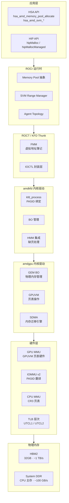

**各层职责边界**

| 层次 | 核心职责 | 向上提供 | 向下依赖 |
|------|---------|---------|---------|
| 硬件 | 地址翻译执行、TLB、IOMMU 查表 | 物理访存能力 | — |
| amdgpu | GEM BO 分配、GPUVM 页表写、SDMA 调度 | BO 句柄、页表接口 | 硬件寄存器 |
| KFD | 进程隔离、PASID 绑定、HMM 缺页 | IOCTL 接口 | amdgpu |
| Thunk | VA 区间簿记、IOCTL 封装 | C 库接口 | KFD IOCTL |
| ROCr | 内存语义抽象、Pool、SVM 策略 | HSA C API | Thunk |
| 应用 | 使用内存、触发 dispatch | — | ROCr/HIP |

---

# 第一部分：硬件层

## 二、系统物理内存拓扑

### 2.1 物理连接结构

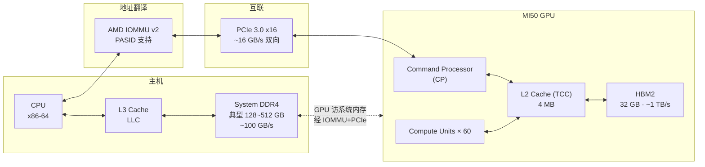

### 2.2 各路径性能参数

| 访问路径 | 峰值带宽 | 典型延迟 | 使用场景 |
|---------|---------|---------|---------|
| GPU CU → HBM2 | ~1 TB/s | ~200 ns | GPU kernel 全局内存读写 |
| GPU CU → L2 命中 | ~3 TB/s | ~100 cycles | 局部性好的访问 |
| CPU → DDR | ~100 GB/s | ~80 ns | CPU 本地访问 |
| GPU → DDR (via PCIe) | ~16 GB/s | ~1 µs+ | fine-grained 跨 PCIe 访问 |
| CPU → HBM (via PCIe) | ~16 GB/s | ~1 µs+ | CPU 访问 GPU 侧 fine-grained 内存 |
| SDMA DMA 传输 | ~16 GB/s | 启动延迟~µs | hipMemcpy / 页面迁移 |

PCIe 带宽是 CPU-GPU 内存共享的核心瓶颈，SVM 架构的大量设计决策都围绕**避免不必要的 PCIe 穿越**展开。

---

## 三、GPU 内部存储层次

### 3.1 层次结构（gfx906 / Vega20）

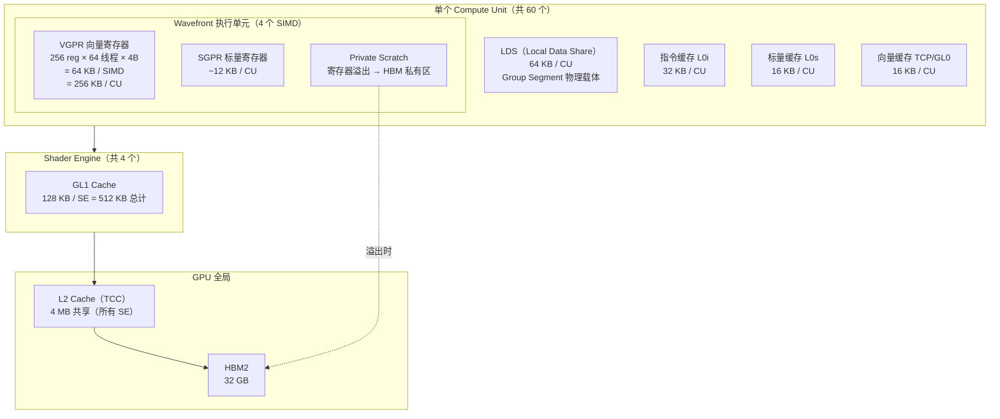

### 3.2 各级存储特性

| 存储 | 容量 | 作用域 | 延迟（估算） | HSA 对应段 |
|------|------|-------|------------|-----------|
| VGPR | 256 KB/CU | per wavefront | 1 cycle | Private（寄存器分配） |
| SGPR | 12 KB/CU | per wavefront（标量） | 1 cycle | — |
| LDS | 64 KB/CU | per work-group | 2~4 cycles | Group Segment |
| L0 (TCP) | 16 KB/CU | per CU | ~10 cycles | Global（缓存） |
| GL1 | 128 KB/SE | per SE | ~20 cycles | Global（缓存） |
| L2 (TCC) | 4 MB | 整个 GPU | ~100 cycles | Global（缓存） |
| HBM2 | 32 GB | 整个 GPU | ~200 cycles | Global（主存） |
| DDR (via PCIe) | 主机内存 | CPU + GPU | ~1000+ cycles | Global（跨 PCIe） |

**设计含义**：LDS 与 HBM2 的延迟差达 50 倍，带宽差超过 15 倍；优化 GPU kernel 的首要任务是减少全局内存访问、最大化 LDS 利用率。

---

## 四、地址翻译体系

地址翻译是 CPU-GPU 内存共享的硬件基础，MI50 上存在**三套翻译机制并行工作**。

### 4.1 三套翻译机制

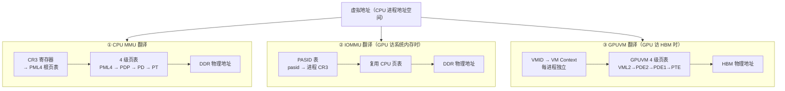

### 4.2 PASID 机制：绑定两个世界

PASID（Process Address Space ID）是 SVM 的核心基础设施，由 AMD IOMMU v2 提供支持。

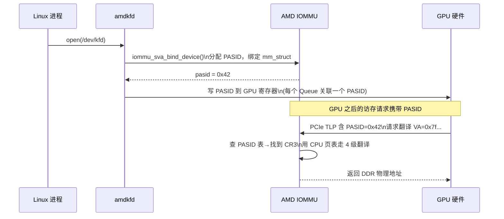

**关键结论**：通过 PASID，GPU 可以直接使用 CPU 进程的页表访问系统内存，这是 fine-grained SVM 的硬件基础。

### 4.3 TLB 层次

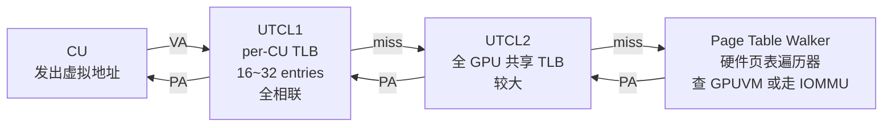

TLB Shootdown：当 KFD 修改页表（映射/解映射）时，必须向所有 CU 发送 TLB 失效信号，这是 SVM 系统开销的主要来源之一。

---

# 第二部分：内核驱动层

## 五、Buffer Object 与物理内存管理

amdgpu 驱动以 **GEM BO（Buffer Object）** 为单位管理所有 GPU 可访问内存。

### 5.1 BO 的物理位置

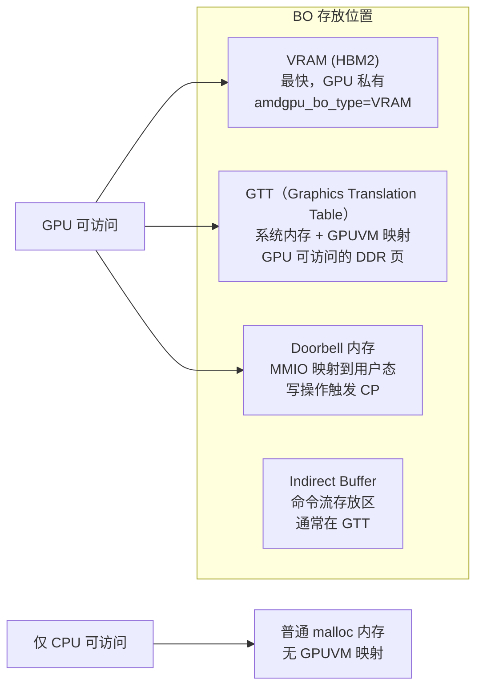

### 5.2 BO 生命周期

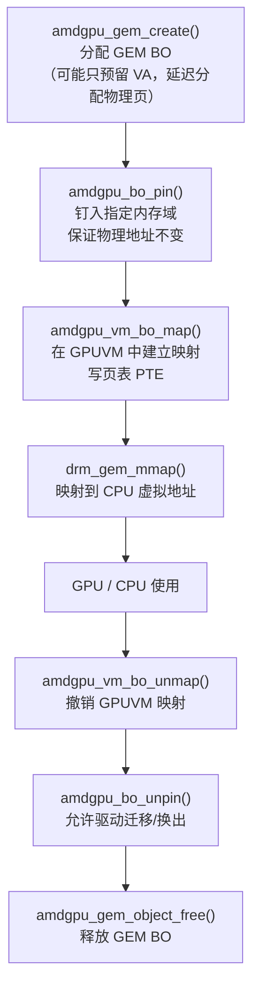

### 5.3 VRAM 与 GTT 的设计选择

| 属性 | VRAM (HBM2) | GTT (DDR) |
|------|------------|-----------|
| GPU 访问带宽 | ~1 TB/s | ~16 GB/s (PCIe 限制) |
| CPU 访问方式 | 经 PCIe，慢 | 直接，快 |
| 适用场景 | GPU 密集计算数据 | CPU-GPU 共享、小数据 |
| 一致性 | 软件屏障 | fine-grained 可硬件一致 |
| 迁移 | SDMA 引擎 | 系统内存页迁移 |

---

## 六、KFD 进程内存管理

KFD（Kernel Fusion Driver）在 amdgpu 之上提供**进程隔离与 HSA 语义**。

### 6.1 核心数据结构

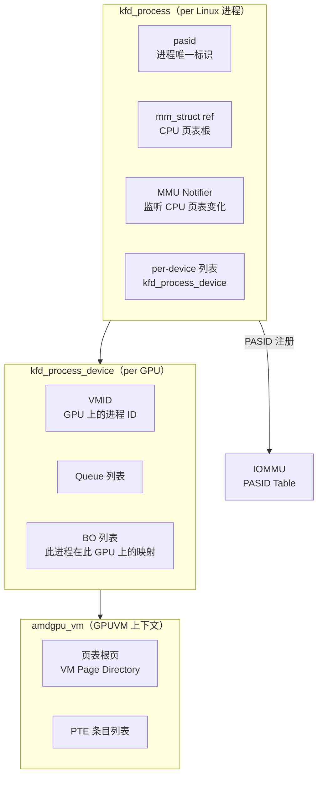

### 6.2 关键 IOCTL 及其内存操作

| IOCTL | 操作 | 内存效果 |
|-------|------|---------|
| `KFD_IOCTL_ALLOC_MEM_OF_GPU` | 分配 BO | 在指定域（VRAM/GTT）创建 GEM BO |
| `KFD_IOCTL_MAP_MEMORY_TO_GPU` | 建立 GPUVM 映射 | 为 BO 写 GPUVM 页表 PTE |
| `KFD_IOCTL_UNMAP_MEMORY_FROM_GPU` | 撤销映射 | 清除 PTE + TLB shootdown |
| `KFD_IOCTL_FREE_MEMORY_OF_GPU` | 释放 BO | 撤销映射后释放 GEM BO |
| `KFD_IOCTL_CREATE_QUEUE` | 创建队列 | 分配 MQD、Doorbell、ring buffer |
| `KFD_IOCTL_CREATE_EVENT` | 创建信号事件 | 分配 signal page（fine-grained） |

---

## 七、HMM 集成与缺页处理

HMM（Heterogeneous Memory Management）是 Linux 内核子系统，让 GPU 能够参与 CPU 的页面管理。

### 7.1 HMM 在 ROCm 中的作用

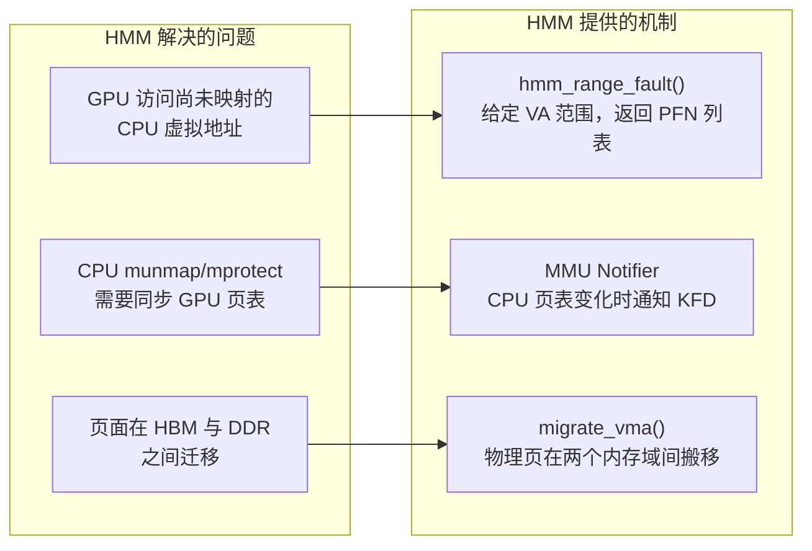

### 7.2 GPU 缺页故障处理全流程

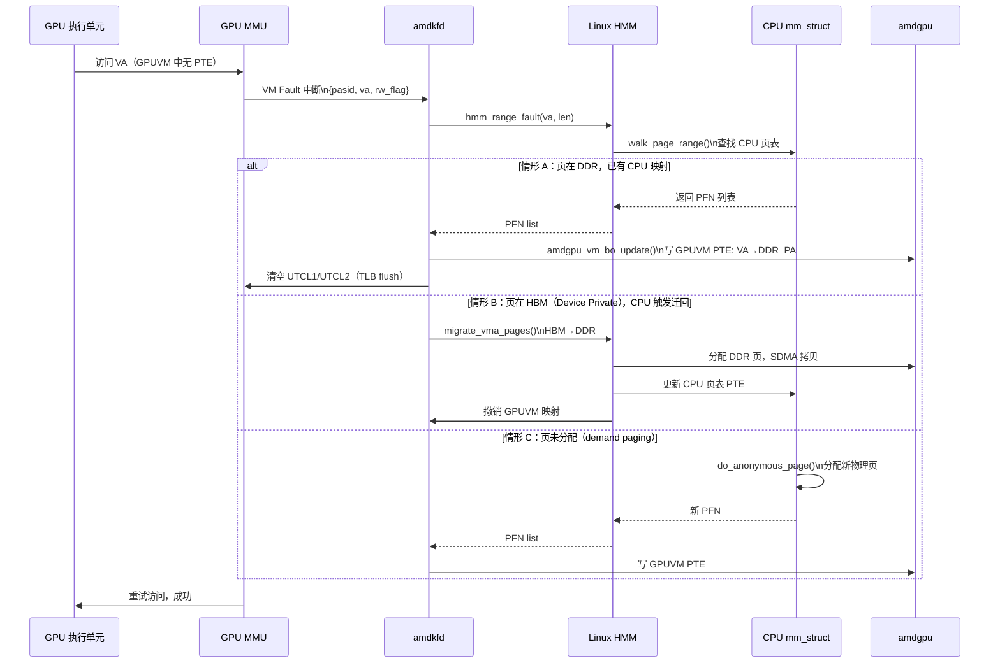

### 7.3 MMU Notifier：CPU 页表变化同步

当 CPU 进程执行 `munmap` / `mprotect` / `fork` 时，KFD 注册的 MMU Notifier 被回调：

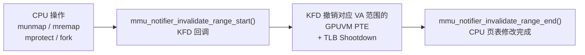

这保证了 CPU 释放内存后，GPU 不会继续持有悬空映射，是 SVM 安全性的关键。

---

# 第三部分：运行时层

## 八、ROCT / Thunk FMM：虚拟地址簿记

Thunk 是用户态与 KFD 之间的薄层，核心功能是 **FMM（Frame Memory Manager）**：维护进程内所有 GPU 相关虚拟地址区间的元数据。

### 8.1 虚拟地址空间分区（Aperture）

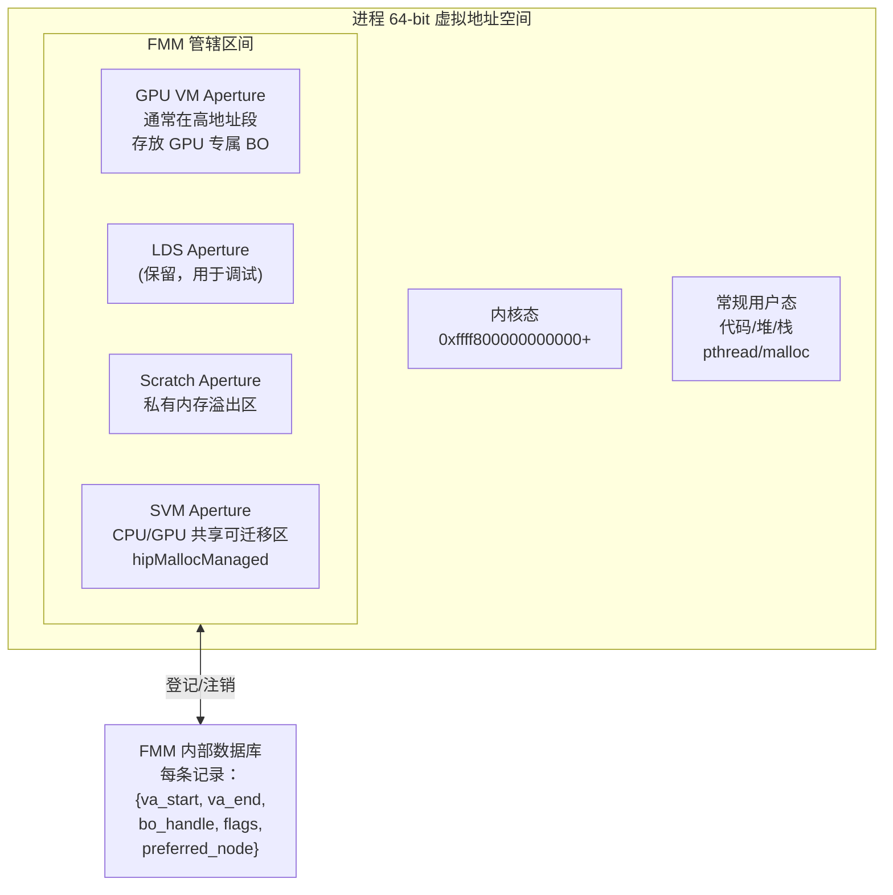

### 8.2 FMM Map Entry 关键字段

| 字段 | 含义 |
|------|------|
| `va_start / va_end` | 虚拟地址区间 |
| `bo_handle` | 对应的 KFD BO 句柄 |
| `flags` | coarse/fine-grained、是否 userptr |
| `preferred_node` | 优先放置的 GPU agent |
| `mapped_to_gpu_bitmap` | 已在哪些 GPU 建立了 GPUVM 映射 |

---

## 九、ROCr 内存抽象

ROCr 将底层 BO 和 aperture 封装为两个面向应用的抽象：**Agent** 和 **Memory Pool**。

### 9.1 Agent 与 Memory Pool 拓扑

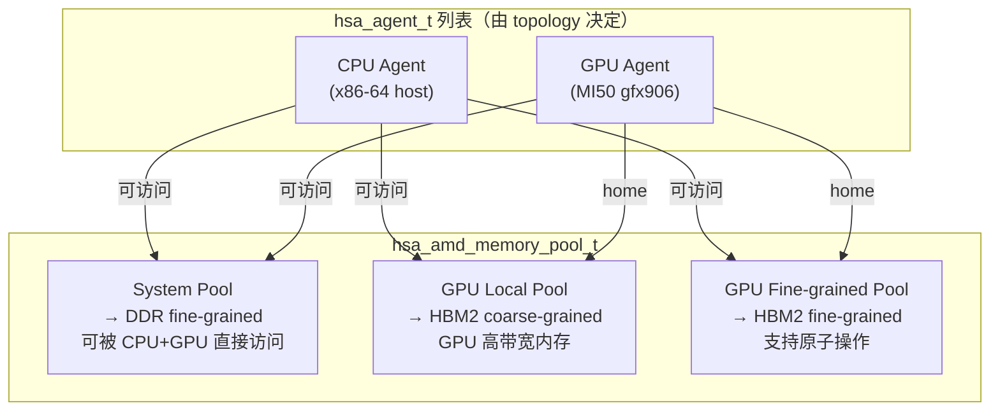

Pool 的本质是一组**内存属性的描述符**，而非真实分配的内存。调用 `hsa_amd_memory_pool_allocate` 时，ROCr 根据 Pool 属性选择分配策略，经 Thunk 向 KFD 发 IOCTL。

---

## 十、Memory Allocation 完整路径

### 10.1 端到端调用链

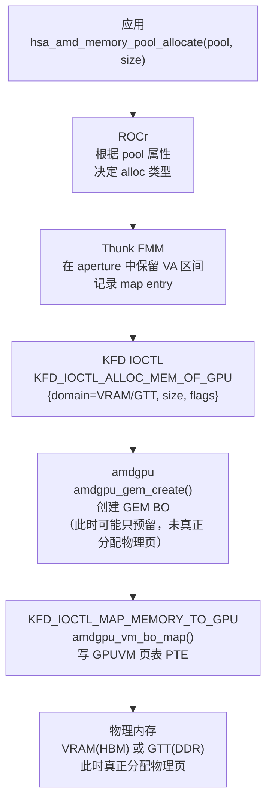

### 10.2 Userptr：零拷贝注册

若应用希望 GPU 直接访问已有的 CPU 内存（如 `malloc` 返回的区域）：

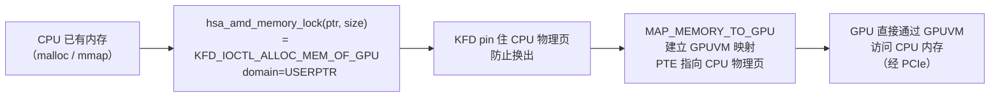

---

# 第四部分：共享虚拟内存（SVM）

## 十一、SVM 内存语义

SVM 的本质是让同一条虚拟地址在 CPU 和 GPU 两侧都合法，但**"合法"并不等于"一致"**，一致性语义分三档：

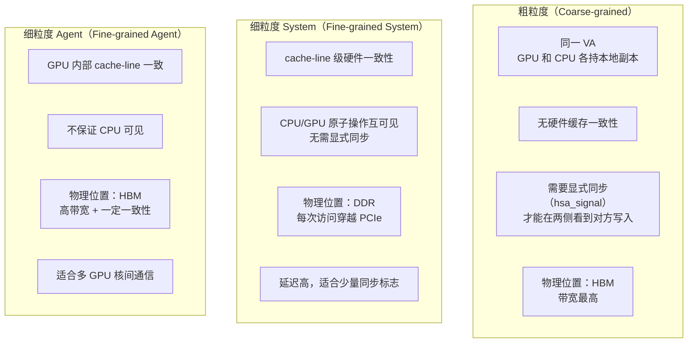

| 维度 | Coarse-grained | Fine-grained System | Fine-grained Agent |
|------|---------------|--------------------|--------------------|
| 物理位置 | HBM | DDR | HBM |
| GPU 带宽 | ~1 TB/s | ~16 GB/s | ~1 TB/s |
| 硬件一致性 | 无 | CPU+GPU 全局 | GPU 内部 |
| CPU 原子操作 | 不保证 | 保证 | 不保证 |
| 适用场景 | 大块计算数据 | 同步旗语、小数据 | GPU 内通信 |

---

## 十二、页面迁移机制

SVM 允许页面在 HBM 和 DDR 之间按需迁移，类似 NUMA 节点间的页面平衡。

### 12.1 迁移触发条件

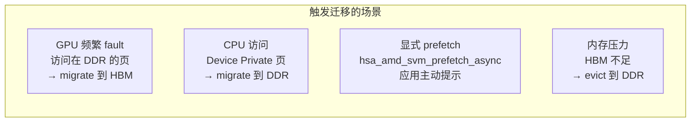

### 12.2 迁移执行流程

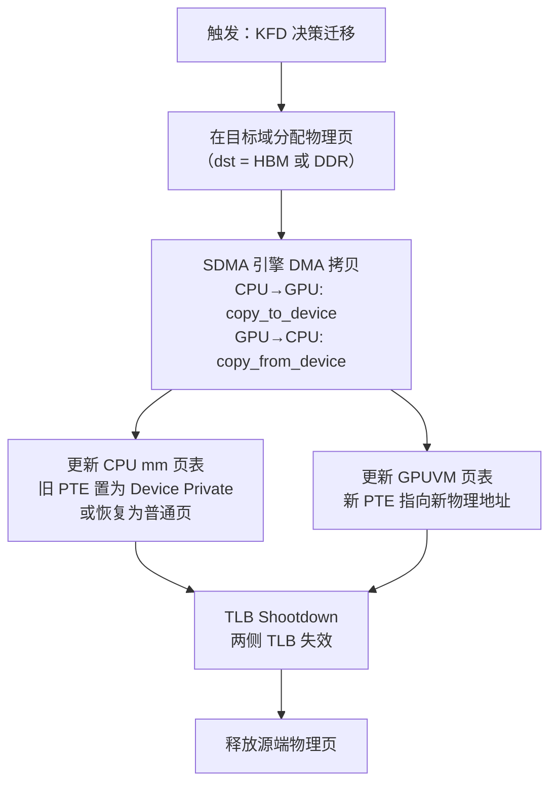

**迁移开销**：SDMA 拷贝是主要耗时，PCIe 带宽（~16 GB/s）是瓶颈。频繁迁移（thrashing）比稳定使用慢很多，需要合理使用 prefetch hint。

---

# 第五部分：执行机制中的内存

## 十三、队列内存布局与 Doorbell 机制

GPU kernel 的调度依赖队列，队列本身就是一块精心设计的内存区域。

### 13.1 队列相关内存组件

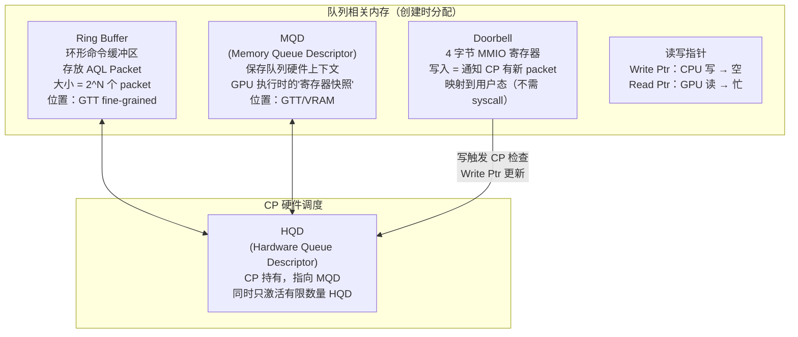

### 13.2 Dispatch 时序

```mermaid
sequenceDiagram
    participant APP as 应用
    participant RING as Ring Buffer
    participant DB as Doorbell
    participant CP as Command Processor
    participant CU as Compute Units

    APP->>APP: 填写 AQL KernelDispatch Packet\n到 Ring[wptr] 位置
    APP->>APP: 原子写 packet header\n（设置 type=KERNEL_DISPATCH）
    APP->>DB: 写 Doorbell（wptr 值）\n（用户态 MMIO Store，无 syscall）
    DB->>CP: 硬件触发：CP 发现新 packet
    CP->>CP: 读取 AQL Packet\n解析 kernarg_address\ngrid_size / block_size
    CP->>CU: 分发 wavefront\n传入 SGPR（含 kernarg ptr）
    CU->>CU: 执行 kernel
    CU->>RING: 写 completion signal\n（via 原子操作到 signal.value）
    RING-->>APP: hsa_signal_wait 返回
```

---

## 十四、AQL Packet 内存格式

AQL（Architected Queuing Language）定义了标准化的命令包格式。

### 14.1 KernelDispatch Packet（最常用）

```
 0                   1                   2                   3
 0 1 2 3 4 5 6 7 8 9 0 1 2 3 4 5 6 7 8 9 0 1 2 3 4 5 6 7 8 9 0 1
+-+-+-+-+-+-+-+-+-+-+-+-+-+-+-+-+-+-+-+-+-+-+-+-+-+-+-+-+-+-+-+-+
| header(16b)   | setup(16b)    | workgroup_size_x(16b)         |  [0x00]
+-+-+-+-+-+-+-+-+-+-+-+-+-+-+-+-+-+-+-+-+-+-+-+-+-+-+-+-+-+-+-+-+
| workgroup_size_y(16b)         | workgroup_size_z(16b)         |  [0x04]
+-+-+-+-+-+-+-+-+-+-+-+-+-+-+-+-+-+-+-+-+-+-+-+-+-+-+-+-+-+-+-+-+
|                   grid_size_x (32b)                           |  [0x08]
+-+-+-+-+-+-+-+-+-+-+-+-+-+-+-+-+-+-+-+-+-+-+-+-+-+-+-+-+-+-+-+-+
|                   grid_size_y (32b)                           |  [0x0C]
+-+-+-+-+-+-+-+-+-+-+-+-+-+-+-+-+-+-+-+-+-+-+-+-+-+-+-+-+-+-+-+-+
|                   grid_size_z (32b)                           |  [0x10]
+-+-+-+-+-+-+-+-+-+-+-+-+-+-+-+-+-+-+-+-+-+-+-+-+-+-+-+-+-+-+-+-+
|            private_segment_size (32b)                         |  [0x14]
+-+-+-+-+-+-+-+-+-+-+-+-+-+-+-+-+-+-+-+-+-+-+-+-+-+-+-+-+-+-+-+-+
|            group_segment_size  (32b)                          |  [0x18]
+-+-+-+-+-+-+-+-+-+-+-+-+-+-+-+-+-+-+-+-+-+-+-+-+-+-+-+-+-+-+-+-+
|                 kernel_object  (64b)                          |  [0x1C]
|                 （kernel ISA 在 HBM 中的地址）                |
+-+-+-+-+-+-+-+-+-+-+-+-+-+-+-+-+-+-+-+-+-+-+-+-+-+-+-+-+-+-+-+-+
|                 kernarg_address (64b)                         |  [0x24]
|                 （kernarg buffer 的虚拟地址）                  |
+-+-+-+-+-+-+-+-+-+-+-+-+-+-+-+-+-+-+-+-+-+-+-+-+-+-+-+-+-+-+-+-+
|                 completion_signal (64b)                        |  [0x2C]
|                 （完成后写入的 hsa_signal_t）                  |
+-+-+-+-+-+-+-+-+-+-+-+-+-+-+-+-+-+-+-+-+-+-+-+-+-+-+-+-+-+-+-+-+
```

### 14.2 AQL Packet 类型

| 类型 | 用途 | 内存相关 |
|------|------|---------|
| `KERNEL_DISPATCH` | 启动 GPU kernel | 指向 kernarg + completion signal |
| `BARRIER_AND` | 等待多个 signal 全部完成 | dep_signal[5] 数组 |
| `BARRIER_OR` | 等待任一 signal 完成 | dep_signal[5] 数组 |
| `AGENT_DISPATCH` | 通知 host 端回调 | return_address 指向结果缓冲区 |

---

## 十五、Kernarg 内存

Kernarg（Kernel Arguments）是 GPU kernel 参数的物理存放区，由 CPU 写入，GPU 只读。

### 15.1 内存属性要求

- **位置**：fine-grained system memory（DDR），CPU 能写、GPU 能读，无需显式同步
- **对齐**：每个参数按自然对齐（如 `uint64_t*` 对齐到 8 字节），整体 buffer 通常 64 字节对齐
- **大小**：由编译器在编译期确定（kernel 签名决定）

### 15.2 GPU 侧访问路径

```mermaid
graph LR
    AQL_PKT["AQL Packet\n.kernarg_address = 0x7f000...]"]
    CP_FETCH["CP 读取 kernarg_address\n写入波前初始 SGPR"]
    SGPR_INIT["Wavefront 启动\nSGPR0/1 = kernarg_address\n（64-bit 指针）"]
    LOAD["kernel ISA 中\ns_load_dwordx4 s[4:7], s[0:1], 0x00\n从 kernarg 地址加载参数"]
    USE["参数进入 SGPR/VGPR\nkernel 开始执行"]

    AQL_PKT --> CP_FETCH --> SGPR_INIT --> LOAD --> USE
```

### 15.3 典型 Kernarg 布局

```
offset  size  内容
0x00    8     指针参数 A（如 float* input）
0x08    8     指针参数 B（如 float* output）
0x10    4     标量参数（如 int n）
0x14    4     padding（对齐）
```

编译器（clang/amdgpu）在编译期生成 kernarg layout 的元数据，ROCr 据此分配 buffer 并填写 AQL packet。

---

## 十六、Signal 机制

Signal（`hsa_signal_t`）是 HSA 中 CPU-GPU 同步的核心原语，其背后是精心设计的内存机制。

### 16.1 Signal 的两种实现

```mermaid
graph TB
    subgraph SOFT_SIG["Software Signal（默认）"]
        SS_MEM["fine-grained system memory\n（DDR，CPU+GPU 均可原子访问）"]
        SS_VAL["64-bit 原子计数器"]
        SS_CPU["CPU: __atomic_fetch_add\n用户态自旋等待"]
        SS_GPU["GPU: s_atomic_add\n或 buffer_atomic_add"]
    end

    subgraph HW_SIG["Hardware Signal（IB/门铃触发）"]
        HS_MEM["fine-grained memory"]
        HS_INT["写特定地址\n→ 触发 GPU interrupt\n或 CP 唤醒"]
        HS_KFD["KFD 通过 wait_for_event\n阻塞等待内核中断"]
    end

    APP_USE["应用使用\nhsa_signal_wait_scacquire()\nhsa_signal_store_screlease()"]
    APP_USE --> SOFT_SIG & HW_SIG
```

### 16.2 Signal 内存布局

```
hsa_signal_t 背后的内存（fine-grained DDR）：

 offset  content
 0x00    value (int64_t, 原子操作目标)
 0x08    event_id（关联 KFD event，用于 blocking wait）
 0x10    event_mailbox_ptr（GPU 写此地址触发 KFD 事件）
 ...     （其他 runtime 内部字段）
```

### 16.3 GPU kernel 写 Signal 的路径

```mermaid
graph LR
    KERNEL["GPU kernel 完成"]
    AQL_COMP["CP 读 AQL packet.completion_signal"]
    ATOMIC_WRITE["CP 执行原子写：\nsignal.value -= 1\n（到 fine-grained DDR）"]
    MAILBOX["若 event_mailbox_ptr != 0\nCP 写 mailbox → KFD 收到中断"]
    CPU_WAKE["CPU hsa_signal_wait\n轮询或被中断唤醒\n返回"]

    KERNEL --> AQL_COMP --> ATOMIC_WRITE --> MAILBOX --> CPU_WAKE
```

Signal 必须使用 **fine-grained memory**，这样 GPU 完成后 CPU 立刻可见，无需显式缓存 flush。

---

# 第六部分：HSA 编程模型

## 十七、HSA 内存段模型

HSA 定义了五种逻辑内存段，每种对应不同的物理存储和访问语义：

```mermaid
graph LR
    subgraph SEG_MODEL["HSA 五段内存模型"]
        PRIV["Private Segment\n私有段"]
        GRP["Group Segment\n组段"]
        GLB["Global Segment\n全局段"]
        CONST["Constant Segment\n常量段"]
        KARG["Kernarg Segment\n内核参数段"]
    end

    subgraph HW_MAPPING["物理映射"]
        VGPR_S["VGPR 寄存器\n→ 超出时溢出到\nScratch Buffer (HBM)"]
        LDS_S["LDS\n64 KB/CU"]
        GLB_S["HBM2（coarse）\n或 DDR（fine）\n取决于分配时的 pool"]
        CONST_S["HBM 只读区\n可被 L2 缓存"]
        KARG_S["DDR fine-grained\ndispatch 时分配"]
    end

    PRIV --> VGPR_S
    GRP --> LDS_S
    GLB --> GLB_S
    CONST --> CONST_S
    KARG --> KARG_S
```

**各段编程特性**

| 段 | 作用域 | 生命周期 | 编译器关键字 | 大小限制（gfx906） |
|----|-------|---------|------------|-----------------|
| Private | per work-item | dispatch 内 | 自动（局部变量） | VGPR 用完后溢出 |
| Group | per work-group | dispatch 内 | `__shared__` / `LDS` | 64 KB/CU |
| Global | 全系统 | 用户管理 | 全局指针 | HBM 32 GB |
| Constant | 全系统只读 | 用户管理 | `__constant__` | 受 L2 缓存限制 |
| Kernarg | 全系统只读 | per dispatch | AQL 字段 | 通常 < 1 KB |

---

## 十八、HSA 内存一致性模型

HSA 采用**分作用域的 Release-Acquire 一致性模型**，比 C++ memory model 增加了"agent scope"这一层次。

### 18.1 内存作用域层次

```mermaid
graph TB
    S1["Work-item Scope\n仅本线程内可见\n（编译器重排限于此范围）"]
    S2["Work-group Scope\n同一 work-group 内所有线程\n需要 s_barrier + L0 writeback"]
    S3["Agent Scope\n整个 GPU（所有 CU）\n需要 L0+GL1 flush"]
    S4["System Scope\nCPU + 所有 GPU agent\n需要 L2 flush + PCIe 同步"]

    S1 -->|"扩大可见范围，代价递增"| S2 --> S3 --> S4
```

### 18.2 内存序与硬件指令对应

| HSA 内存序 | 语义 | GPU 硬件实现 | 代价 |
|-----------|------|-------------|------|
| Relaxed | 无顺序保证 | 无额外指令 | 最低 |
| Acquire | 后续 load 不能提前 | `buffer_wbinvl1_vol`（invalidate） | 低 |
| Release | 前序 store 不能推后 | `buffer_wbinvl1_vol`（writeback） | 低 |
| Seq_cst | 全序一致 | writeback + invalidate + waitcnt | 最高 |

### 18.3 典型同步场景的屏障实现

```mermaid
xxxxxxxxxx快照CPU 线程其他 CU 的线程Wavefront 1 (同 work-group)Wavefront 0CPU 线程其他 CU 的线程Wavefront 1 (同 work-group)Wavefront 0#mermaidChart26{font-family:sans-serif;font-size:16px;fill:#333;}@keyframes edge-animation-frame{from{stroke-dashoffset:0;}}@keyframes dash{to{stroke-dashoffset:0;}}#mermaidChart26 .edge-animation-slow{stroke-dasharray:9,5!important;stroke-dashoffset:900;animation:dash 50s linear infinite;stroke-linecap:round;}#mermaidChart26 .edge-animation-fast{stroke-dasharray:9,5!important;stroke-dashoffset:900;animation:dash 20s linear infinite;stroke-linecap:round;}#mermaidChart26 .error-icon{fill:#552222;}#mermaidChart26 .error-text{fill:#552222;stroke:#552222;}#mermaidChart26 .edge-thickness-normal{stroke-width:1px;}#mermaidChart26 .edge-thickness-thick{stroke-width:3.5px;}#mermaidChart26 .edge-pattern-solid{stroke-dasharray:0;}#mermaidChart26 .edge-thickness-invisible{stroke-width:0;fill:none;}#mermaidChart26 .edge-pattern-dashed{stroke-dasharray:3;}#mermaidChart26 .edge-pattern-dotted{stroke-dasharray:2;}#mermaidChart26 .marker{fill:#333333;stroke:#333333;}#mermaidChart26 .marker.cross{stroke:#333333;}#mermaidChart26 svg{font-family:sans-serif;font-size:16px;}#mermaidChart26 p{margin:0;}#mermaidChart26 .actor{stroke:hsl(259.6261682243, 59.7765363128%, 87.9019607843%);fill:#ECECFF;}#mermaidChart26 text.actor>tspan{fill:black;stroke:none;}#mermaidChart26 .actor-line{stroke:hsl(259.6261682243, 59.7765363128%, 87.9019607843%);}#mermaidChart26 .messageLine0{stroke-width:1.5;stroke-dasharray:none;stroke:#333;}#mermaidChart26 .messageLine1{stroke-width:1.5;stroke-dasharray:2,2;stroke:#333;}#mermaidChart26 #arrowhead path{fill:#333;stroke:#333;}#mermaidChart26 .sequenceNumber{fill:white;}#mermaidChart26 #sequencenumber{fill:#333;}#mermaidChart26 #crosshead path{fill:#333;stroke:#333;}#mermaidChart26 .messageText{fill:#333;stroke:none;}#mermaidChart26 .labelBox{stroke:hsl(259.6261682243, 59.7765363128%, 87.9019607843%);fill:#ECECFF;}#mermaidChart26 .labelText,#mermaidChart26 .labelText>tspan{fill:black;stroke:none;}#mermaidChart26 .loopText,#mermaidChart26 .loopText>tspan{fill:black;stroke:none;}#mermaidChart26 .loopLine{stroke-width:2px;stroke-dasharray:2,2;stroke:hsl(259.6261682243, 59.7765363128%, 87.9019607843%);fill:hsl(259.6261682243, 59.7765363128%, 87.9019607843%);}#mermaidChart26 .note{stroke:#aaaa33;fill:#fff5ad;}#mermaidChart26 .noteText,#mermaidChart26 .noteText>tspan{fill:black;stroke:none;}#mermaidChart26 .activation0{fill:#f4f4f4;stroke:#666;}#mermaidChart26 .activation1{fill:#f4f4f4;stroke:#666;}#mermaidChart26 .activation2{fill:#f4f4f4;stroke:#666;}#mermaidChart26 .actorPopupMenu{position:absolute;}#mermaidChart26 .actorPopupMenuPanel{position:absolute;fill:#ECECFF;box-shadow:0px 8px 16px 0px rgba(0,0,0,0.2);filter:drop-shadow(3px 5px 2px rgb(0 0 0 / 0.4));}#mermaidChart26 .actor-man line{stroke:hsl(259.6261682243, 59.7765363128%, 87.9019607843%);fill:#ECECFF;}#mermaidChart26 .actor-man circle,#mermaidChart26 line{stroke:hsl(259.6261682243, 59.7765363128%, 87.9019607843%);fill:#ECECFF;stroke-width:2px;}#mermaidChart26 :root{--mermaid-alt-font-family:sans-serif;}work-group 内同步（s_barrier）agent-scope 同步（跨 CU）system-scope 同步s_barrier（等所有 work-item 到达）buffer_wbinvl1_vol（L0 writeback+invalidate）LDS 写入现在对组内所有线程可见s_waitcnt vmcnt(0)（等所有 store 完成）buffer_wbinvl1_volGlobal 内存写入对整个 GPU 可见s_waitcnt vmcnt(0) lgkmcnt(0)L2 flush（写回 HBM → PCIe → DDR）fine-grained 内存写入对 CPU 可见
```

---

# 总结

## 十九、各层接口与职责边界

```mermaid
graph LR
    subgraph L6["应用层"]
        API["HSA/HIP API\nhsa_amd_memory_pool_allocate\nhipMallocManaged\nhsa_signal_*"]
    end

    subgraph L5["ROCr"]
        ROCR_IF["Pool / Agent / SVM Range\n向下透传为 Thunk 调用"]
    end

    subgraph L4["Thunk"]
        THUNK_IF["FMM VA 簿记\nIOCTL 系统调用封装"]
    end

    subgraph L3["KFD"]
        KFD_IF["kfd_process / PASID\nBO IOCTL\nHMM fault handling"]
    end

    subgraph L2["amdgpu"]
        GPU_IF["GEM BO\nGPUVM 页表\nSDMA 引擎"]
    end

    subgraph L1["硬件"]
        HW_IF["IOMMU + GPUVM MMU\nTLB + UTCL1/2\nCP + SDMA"]
    end

    L6 <-->|"C API"| L5
    L5 <-->|"C 函数调用"| L4
    L4 <-->|"ioctl(fd, KFD_IOC_...)"| L3
    L3 <-->|"内核函数调用"| L2
    L2 <-->|"MMIO / DMA"| L1
```

---

## 二十、访问路径性能模型

对 GPU kernel 来说，不同内存访问的代价差异是量级级别的：

```
寄存器 VGPR:        1 cycle        ████
LDS:                2~4 cycles     ████
L0 Cache 命中:      10 cycles      ███████████
GL1 Cache 命中:     20 cycles      ████████████████████
L2 Cache 命中:      100 cycles     ██████████ × 10
HBM2:               200 cycles     ██████████ × 20
DDR via PCIe:       1000+ cycles   ██████████ × 100
```

**Roofline 视角**：GPU 的算术强度（FLOP/byte）必须足够高，才能让计算而非内存成为瓶颈。HBM2 峰值带宽约 1 TB/s，MI50 峰值算力约 26.5 TFLOPS（FP32），因此算术强度 > 26.5 FLOP/byte 时计算受限，否则内存受限。

---

## 二十一、场景选型指南

| 场景 | 推荐内存类型 | 分配方式 | 同步方式 | 理由 |
|------|------------|---------|---------|------|
| GPU 大型计算数据 | Coarse-grained HBM | `hsa_amd_memory_pool_allocate`（local pool） | agent-scope fence | 最高带宽 |
| GPU 线程间通信 | Group (LDS) | `__shared__` | `s_barrier` | 片上零延迟 |
| CPU-GPU 同步旗语 | Fine-grained DDR | System pool | 原子操作（无需屏障） | 硬件一致，语义清晰 |
| CPU-GPU 小块数据 | Fine-grained DDR | System pool | 隐式一致 | 无需显式拷贝 |
| CPU-GPU 大块数据 | Managed（可迁移） | `hipMallocManaged` | prefetch hint | 数据跟随计算自动迁移 |
| GPU 只读常量 | Constant segment | `__constant__` | 无需同步 | L0/L2 缓存友好，广播高效 |
| 跨进程 GPU 共享 | IPC memory | `hsa_amd_ipc_memory_*` | 显式同步 | 跨进程 VA 对齐 |
| Kernel 参数 | Kernarg (fine-grained) | ROCr 自动管理 | 无需同步（只读） | CPU 写、GPU 读，一致 |
