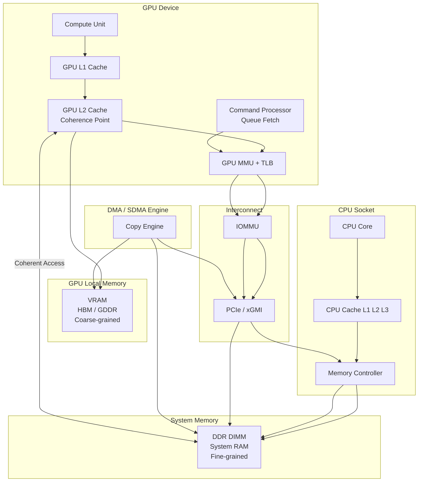
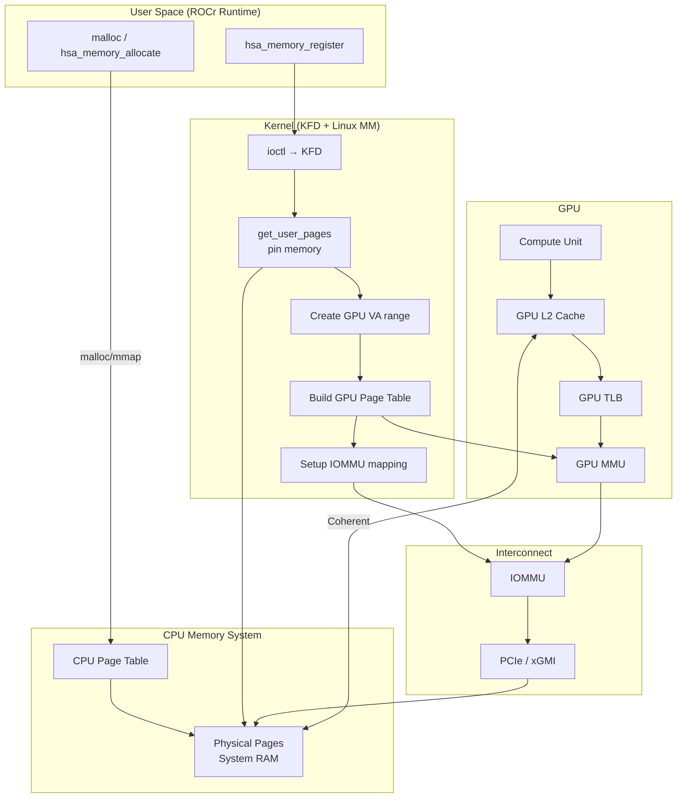

# 1. 总体设计

------

## 1.1 背景与问题

异构系统（CPU + GPU）面临的核心存储挑战：

1. CPU 与 GPU 物理内存分离（System RAM vs VRAM）
2. 两者缓存体系不同（CPU cache vs GPU cache）
3. 访问路径差异（CPU 本地 vs GPU 经 PCIe）
4. 一致性问题（谁的数据是最新的？）
5. 编程复杂性（数据搬运 + 同步）


------

## 1.2 设计目标

HSA 的核心目标：

1. ==统一虚拟地址空间（SVM）==
2. ==提供跨设备同步机制（signal / atomic）==
3. ==在性能与一致性之间权衡==
4. ==降低编程复杂度（减少显式拷贝）==

------

## 1.3 最小 HSA 程序（抽象）

```c++
#include <hsa/hsa.h>

int main() {
    hsa_init();

    // 假设已获取 gpu_agent、kernarg_region、gpu_global_region（实际需遍历枚举）
    hsa_agent_t gpu_agent = ...;
    hsa_region_t kernarg_region = ...;
    hsa_region_t gpu_global_region = ...;

    const size_t N = 1024;
    size_t size = N * sizeof(int);

    // ==================== 1. 创建信号（需硬件一致性）====================
    hsa_signal_t signal;
    hsa_signal_create(1, 0, NULL, &signal);     // 初始值 1

    // ==================== 2. 创建队列（无需硬件一致性）====================
    hsa_queue_t *queue;
    hsa_queue_create(gpu_agent, 64, HSA_QUEUE_TYPE_SINGLE, NULL, NULL, 0, 0, &queue);

    // ==================== 3. 分配 GPU 全局内存（VRAM）====================
    int *gpu_in, *gpu_out;
    hsa_memory_allocate(gpu_global_region, size, (void**)&gpu_in);   // 输入数组指针
    hsa_memory_allocate(gpu_global_region, size, (void**)&gpu_out);  // 输出数组指针

    // ==================== 4. 主机数据 → GPU 全局内存（DMA）====================
    int *host = malloc(size);
    for (int i = 0; i < N; i++) host[i] = i;         // 准备输入数据
    hsa_memory_copy(gpu_in, host, size);             // 将 host 数据拷贝到 gpu_in 指向的 VRAM

    // ==================== 5. 准备内核参数包（系统内存）====================
    struct KernArgs { int *in; int *out; int n; } args;
    args.in  = gpu_in;    // 将 GPU 全局内存指针填入参数结构体
    args.out = gpu_out;
    args.n   = N;

    void *kernarg_ptr;
    hsa_memory_allocate(kernarg_region, sizeof(args), &kernarg_ptr);  // 分配内核参数段内存
    memcpy(kernarg_ptr, &args, sizeof(args));                         // 将参数包拷贝到内核参数段

    // ==================== 6. 构建 AQL 包并提交（无需硬件一致性）====================
    uint64_t write_idx = hsa_queue_load_write_index_relaxed(queue);
    hsa_kernel_dispatch_packet_t *pkt =
        (hsa_kernel_dispatch_packet_t*)queue->base_address + write_idx % queue->size;

    // 填充 AQL 包的关键字段（这里只展示核心传递关系）
    pkt->header           = ...;              // 包类型、屏障位等
    pkt->setup            = ...;              // 维度设置
    pkt->workgroup_size_x = ...;              // 工作组大小
    pkt->grid_size_x      = ...;              // 网格大小
    pkt->kernel_object    = ...;              // 内核代码对象地址
    pkt->kernarg_address  = kernarg_ptr;      // ★ 告诉 GPU 去哪里读取参数包
    pkt->completion_signal.handle = signal.handle; // ★ 内核完成后更新此信号

    hsa_queue_store_write_index_relaxed(queue, write_idx + 1);
    hsa_signal_store_relaxed(queue->doorbell_signal, write_idx);  // 敲门铃

    // ==================== 7. 等待 GPU 完成（轮询信号）====================
    while (hsa_signal_wait_scacquire(signal, HSA_SIGNAL_CONDITION_LT, 1,
                                     UINT64_MAX, HSA_WAIT_STATE_ACTIVE) != 0);

    // ==================== 8. 结果从 GPU 全局内存回读 ====================
    hsa_memory_copy(host, gpu_out, size);   // 将 gpu_out 指向的 VRAM 数据拷回 host

    // host[0] 现在应为原 host[0] + 1
    // 清理代码已省略（hsa_memory_free, free, hsa_signal_destroy, hsa_queue_destroy, hsa_shut_down）
}
```

------
1. 运行时视角的内存类型

   ```
   1. Global Region（通用内存）
   1.1 Fine-grained Global（细粒度）
   - 标志：
     - HSA_REGION_SEGMENT_GLOBAL
     - HSA_REGION_GLOBAL_FLAG_FINE_GRAINED
   - 用途：
     - Signal
     - Queue（AQL）
     - Kernarg
     - 小数据共享
   - 物理位置：
     - System RAM（DDR）
   - CPU访问：
     - ✔ 直接访问（cache coherent）
   - GPU访问：
     - ✔ 通过 IOMMU + GPU MMU
   - 一致性：
     - ✔ 硬件/协议保证（coherent）
   - 原子操作：
     - ✔ 支持跨 CPU/GPU
   - 同步：
     - release / acquire
     - fence（sfence / lfence）
   ---
   1.2 Coarse-grained Global（粗粒度）
   - 标志：
     - HSA_REGION_SEGMENT_GLOBAL
     - （无 FINE_GRAINED）
   - 用途：
     - 大规模 buffer
     - tensor / 计算数据
   - 物理位置：
     - VRAM（HBM / GDDR）
     - 或部分 pinned RAM
   - CPU访问：
     - ⚠️ 慢 / 非一致
   - GPU访问：
     - ✔ 高带宽直接访问
   - 一致性：
     - ❌ 不保证
   - 原子操作：
     - ⚠️ 受限（设备内）
   - 同步：
     - 显式（copy / barrier / kernel boundary）
   ---
   1.3 Kernarg Region（特殊）
   - 标志：
     - HSA_REGION_GLOBAL_FLAG_KERNARG
   - 用途：
     - kernel 参数
   - 物理位置：
     - System RAM（fine-grained）
   - CPU访问：
     - ✔ 写入参数
   - GPU访问：
     - ✔ kernel 启动时读取
   - 一致性：
     - ✔ 必须保证
   - 同步：
     - dispatch 前隐式保证
   ---
   2. Group Region（LDS）
   - 标志：
     - HSA_REGION_SEGMENT_GROUP
   - 用途：
     - work-group 内共享
   - 物理位置：
     - GPU LDS（片上 SRAM）
   - CPU访问：
     - ❌
   - GPU访问：
     - ✔ 同 group
   - 一致性：
     - ✔（局部）
   - 同步：
     - barrier()
   ---
   3. Private Region
   - 标志：
     - HSA_REGION_SEGMENT_PRIVATE
   - 用途：
     - work-item 私有变量
   - 物理位置：
     - register / spill
   - CPU访问：
     - ❌
   - GPU访问：
     - ✔（私有）
   - 一致性：
     - 不涉及
   - 同步：
     - 不需要
   ```
   
   
   
2. 内核程序视角下的内存

   ```
   HSA Segment（编程模型）
   ├── Global
   │   ├── Fine-grained Region
   │   ├── Coarse-grained Region
   │   └── Kernarg Region（特殊用途）
   ├── Group
   ├── Private
   ```


## 1.4 从需求推导机制

从这个简单程序可以推导出必须具备：

------

### 🟢 1. 内存共享机制

```
CPU 和 GPU 必须访问同一块内存
→ Unified Virtual Memory（SVM）
```

------

### 🟢 2. 地址映射机制

```
CPU VA == GPU VA（或可映射）
→ CPU 页表 + GPU 页表 + IOMMU
```

------

### 🟢 3. 一致性机制

```
CPU 写 → GPU 能看到
GPU 写 → CPU 能看到
→ cache coherence + memory ordering
```

------

### 🟢 4. 同步机制

```
CPU / GPU 之间同步
→ Signal（atomic + ordering）
```

------

### 🟢 5. 高性能数据路径

```
大数据计算不能走 RAM
→ VRAM + DMA
```

------

### 🟢 6. 异常处理机制

```
GPU 访问非法内存
→ Page Fault + 修复
```

------

# 2. 存储的物理架构

------



## 2.1 硬件组成

------

### 🟢 CPU 子系统

```
CPU Core
 → L1 / L2 / L3 cache
 → Memory Controller
 → System RAM（DDR）
```

------

### 🔴 GPU 子系统

```
Compute Unit
 → L1 cache（私有）
 → L2 cache（全局共享）
 → VRAM（HBM / GDDR）
```

------

### 🔵 互联

```
PCIe / xGMI
```

------

### 🟡 关键组件

```
GPU MMU     → 地址转换
IOMMU       → 设备访问控制
DMA Engine  → 数据搬运
GPU L2      → coherence point
```

------

##  🟡 ATS (Address Translation Services)
```
为了性能，现代 GPU（如 MI50）通常不希望每次访存都被 IOMMU 拦下来翻译（因为这太慢了）。于是引入了 **ATS**。

在这种情况下，流程会发生变化，更符合你猜想的“返回物理地址”：

- **Step A (Address Request):** GPU 发现本地 TLB 没命中，它先发一个特殊的 **Address Translation Request** 给 IOMMU。
- **Step B (Translation Response):** IOMMU 查完表，把物理地址（PA）**返回给 GPU**。
- **Step C (Direct Access):** GPU 把这个 PA 存进自己的 **Device TLB**。下次访问时，直接在 TLP 包里填 PA，并标记“此包已翻译”。
- **Step D (Fast Pass):** IOMMU 看到标记，直接放行，不再查表。
```

---

## 2.2 内存层次

------

### 🟢 System RAM

```
位置：CPU 主内存
特点：
✔ cache coherent
✔ CPU/GPU 可访问
❌ 带宽较低（GPU视角）
```

------

### 🔴 VRAM

```
位置：GPU 本地显存
特点：
✔ 高带宽
❌ 不保证 CPU 一致性
```

------

## 2.3 物理访问路径

------

### GPU → VRAM

```
CU → L1 → L2 → VRAM
```

------

### GPU → RAM

```
CU → L2 → GPU MMU → IOMMU → PCIe → RAM
```

------

### DMA

```
RAM ⇄ PCIe ⇄ VRAM
```

------

------

# 3. 存储的逻辑架构（HSA 视角）

------

## 3.1 核心抽象

------

### Agent

```
CPU / GPU
```

------

### Region（核心）

```
内存资源抽象
```

------

### Segment（编程语义）

```
global / group / private
```

------

------

## 3.2 Region 分类

------

### 🟢 Global Region

------

#### Fine-grained

```
✔ coherent
✔ atomic
用途：
  signal / queue / kernarg
```

------

#### Coarse-grained

```
❌ 不保证一致性
用途：
  大规模数据（VRAM）
```

------

------

### 🟡 Group Region

```
GPU LDS（片上共享）
```

------

------

### 🔵 Private Region

```
寄存器 / 栈
```

------

------

## 3.3 Segment vs Region

```
Segment = 逻辑视角
Region  = 实际内存资源
```

------

------

# 4. 存储的详细设计

------

# 4.1 内存创建

------

## 4.1.1 System RAM（Fine-grained）

------

### 流程

```
malloc
 → Linux 分配物理页
 → hsa_memory_register
 → KFD：
    - pin memory
    - 建 GPU 页表
    - 建 IOMMU 映射
```

------

------

## 4.1.2 VRAM（Coarse-grained）

------

```
hsa_memory_allocate(vram)
 → KFD 分配显存
 → 建 GPU 页表
```

------

------

# 4.2 地址映射体系

------

## 三层映射

```
CPU VA → Physical
GPU VA → Physical
Device → Physical（IOMMU）
```

------

------

# 4.3 数据访问机制

------

## 4.3.1 GPU Load/Store

```
GPU VA
 → TLB
 → GPU MMU
 → Physical
 → RAM / VRAM
```

------

------

## 4.3.2 DMA 传输

------

### Host → Device

```
RAM → DMA → PCIe → VRAM
```

------

### Device → Host

```
VRAM → DMA → PCIe → RAM
```

------

------

## 4.3.3 Zero-copy（SVM）

```
GPU 直接访问 RAM
```

------

------

# 4.4 SVM（统一虚拟内存）

------

## 特点

```
CPU VA == GPU VA
支持 page fault
支持动态迁移
```

------

------

# 4.5 缓存与一致性

------

## 4.5.1 Coherence Domain

```
CPU cache ↔ GPU L2 ↔ System RAM
```

------

------

## 4.5.2 Memory Ordering

------

### Release

```
写数据 → 写 signal
```

------

### Acquire

```
读 signal → 读数据
```

------

------

## 4.5.3 Fence

```
CPU：mfence
GPU：cache flush
```

------

------

# 4.6 页错误（Page Fault）

------

## 触发

```
GPU 访问未映射地址
```

------

## 流程

```
GPU fault
 → 中断
 → KFD
 → 分配/映射页
 → 更新页表
 → 恢复执行
```

------

------

# 4.7 原子操作与同步

------

## Signal 实现

```
atomic + coherence + ordering
```

------

## 流程

```
GPU:
  write data
  store_release(signal)

CPU:
  load_acquire(signal)
  read data
```

------

------

# 4.8 TLB 与页表管理

------

## GPU TLB

```
缓存 VA → PA
```

------

## 更新

```
页表变化 → TLB invalidate
```

------

------

# 4.9 生命周期管理

------

## 分配

```
allocate / register
```

------

## 使用

```
GPU/CPU 访问
```

------

## 释放

```
unmap → unpin → free
```

------

------

# 4.10 性能设计

------

## 核心原则

```
小数据 → fine-grained
大数据 → VRAM + DMA
```

------

------

## 瓶颈

```
PCIe 带宽 / 延迟
TLB miss
cache coherence 开销
```

------

------

# 5. 总结

------

## 5.1 核心设计

```
SVM + GPU MMU + IOMMU + DMA + Coherence
```

------

## 5.2 两套体系

```
一致性系统（RAM）
高性能系统（VRAM）
```


## 附录1：内存分配及页表管理



