# 异构计算存储系统设计文档

| 属性 | 内容 |
|------|------|
| 文档编号 | ROCm-MEM-ARCH-001 |
| 版本 | v1.0 |
| 状态 | 草稿 |
| 日期 | 2026-04-17 |
| 适用平台 | ROCm 5.6 · AMD MI50 (gfx906 / Vega20) |

---

## 目录

1. [总体设计](#1-总体设计)
   - 1.1 背景与核心挑战
   - 1.2 需求分析
   - 1.3 设计目标
   - 1.4 整体解决方案
   - 1.5 设计约束与边界
2. [存储的物理架构](#2-存储的物理架构)
   - 2.1 系统物理拓扑
   - 2.2 GPU 内部存储层次
   - 2.3 地址翻译硬件体系
   - 2.4 互联总线
3. [存储的逻辑架构](#3-存储的逻辑架构)
   - 3.1 HSA 内存段模型
   - 3.2 内存池（Memory Pool）模型
   - 3.3 Agent 与可访问性
   - 3.4 内存一致性分类
   - 3.5 软件层次逻辑视图
4. [存储的详细设计](#4-存储的详细设计)
   - 4.1 存储的创建
   - 4.2 存储的访问
   - 4.3 DMA 访问
   - 4.4 共享虚拟内存（SVM）
   - 4.5 缓存与一致性
   - 4.6 页错误处理
   - 4.7 页面迁移
   - 4.8 原子操作与同步机制
   - 4.9 存储的释放
5. [关键场景端到端流程](#5-关键场景端到端流程)
6. [性能模型与选型指南](#6-性能模型与选型指南)

---

## 术语表

| 术语 | 全称 | 说明 |
|------|------|------|
| HSA | Heterogeneous System Architecture | 异构系统架构规范 |
| SVM | Shared Virtual Memory | 共享虚拟内存 |
| BO | Buffer Object | GPU 内存分配单元（GEM） |
| FMM | Frame Memory Manager | Thunk 层虚拟地址簿记模块 |
| PASID | Process Address Space ID | 进程地址空间标识符 |
| GPUVM | GPU Virtual Memory | GPU 侧虚拟内存管理 |
| HMM | Heterogeneous Memory Management | Linux 异构内存管理子系统 |
| TLB | Translation Lookaside Buffer | 地址翻译缓冲 |
| IOMMU | I/O Memory Management Unit | I/O 内存管理单元 |
| AQL | Architected Queuing Language | 标准化命令队列语言 |
| MQD | Memory Queue Descriptor | 队列内存描述符 |
| HQD | Hardware Queue Descriptor | 硬件队列描述符 |
| CP | Command Processor | GPU 命令处理器 |
| SDMA | System DMA | GPU 侧 DMA 引擎 |
| LDS | Local Data Share | GPU CU 内共享存储 |
| CU | Compute Unit | GPU 计算单元 |
| GTT | Graphics Translation Table | 系统内存的 GPU 映射区 |

---

# 1. 总体设计

## 1.1 背景与核心挑战

现代异构计算系统由 CPU 与 GPU 共同组成，两者分别针对各自的计算模式高度优化，其存储系统在设计哲学上存在根本差异：

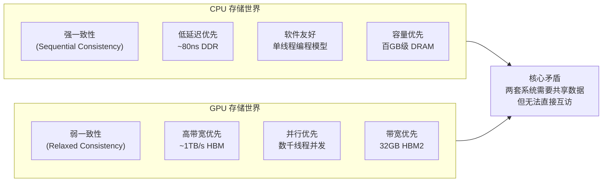

这一矛盾带来以下具体工程挑战：

| 挑战 | 描述 | 影响 |
|------|------|------|
| **双重地址空间** | CPU 和 GPU 各有独立虚拟地址空间，指针不能跨域使用 | 应用代码需要维护两套指针，编程复杂 |
| **显式数据搬运** | 两侧内存无法直接互访，必须通过 PCIe DMA 拷贝 | PCIe 带宽瓶颈（~16 GB/s），latency 高 |
| **一致性缺失** | GPU 写入对 CPU 不立即可见，反之亦然 | 需要显式同步，容易出错 |
| **内存管理割裂** | GPU 内存由驱动管理，脱离 Linux 内存体系 | 无法使用标准内存原语，资源泄漏风险 |
| **同步原语异构** | CPU 用 pthread mutex，GPU 用 atomics，两者无法互操作 | 跨域同步必须借助特殊机制 |

## 1.2 需求分析

以下是一个最小化的 HSA 异构程序骨架，涵盖了存储系统需要支持的全部核心操作：

```c
/* ============================================================
 * 最小化 HSA 向量加法程序（仅保留存储相关核心路径）
 * ============================================================ */

// --- 阶段 1：初始化与拓扑发现 ---
hsa_init();
hsa_agent_t cpu_agent, gpu_agent;
hsa_iterate_agents(pick_agents_callback, &agents);       // 发现 CPU/GPU agent

// --- 阶段 2：内存分配（GPU 本地内存） ---
hsa_amd_memory_pool_t gpu_pool, system_pool;
hsa_amd_agent_iterate_memory_pools(gpu_agent, pick_pool_callback, &gpu_pool);

float *d_input, *d_output;
hsa_amd_memory_pool_allocate(gpu_pool, N * sizeof(float), 0, (void**)&d_input);
hsa_amd_memory_pool_allocate(gpu_pool, N * sizeof(float), 0, (void**)&d_output);

// --- 阶段 3：CPU-GPU 共享访问授权 ---
hsa_amd_agents_allow_access(1, &cpu_agent, NULL, d_input);   // 允许 CPU 访问
memcpy(d_input, h_input, N * sizeof(float));                 // CPU 写数据

// --- 阶段 4：队列创建（命令队列是一块内存） ---
hsa_queue_t *queue;
hsa_queue_create(gpu_agent, 64, HSA_QUEUE_TYPE_MULTI, NULL, NULL, 0, 0, &queue);

// --- 阶段 5：内核参数内存（kernarg）---
void *kernarg_ptr;
hsa_amd_memory_pool_allocate(kernarg_pool, kernarg_size, 0, &kernarg_ptr);
memcpy(kernarg_ptr, &kernel_args, kernarg_size);

// --- 阶段 6：完成信号（同步原语，fine-grained 内存） ---
hsa_signal_t completion_signal;
hsa_signal_create(1, 0, NULL, &completion_signal);

// --- 阶段 7：构造 AQL Packet 并提交 ---
hsa_kernel_dispatch_packet_t *pkt = get_next_aql_slot(queue);
pkt->kernarg_address    = kernarg_ptr;         // 参数内存地址
pkt->completion_signal  = completion_signal;   // 完成信号
pkt->kernel_object      = kernel_code_handle;  // ISA 代码地址
// ... 填写 grid/block size ...
hsa_signal_store_relaxed(queue->doorbell_signal, wptr);  // 敲 doorbell 触发执行

// --- 阶段 8：等待完成 ---
hsa_signal_wait_scacquire(completion_signal,
    HSA_SIGNAL_CONDITION_EQ, 0, UINT64_MAX, HSA_WAIT_STATE_BLOCKED);

// --- 阶段 9：结果读取与释放 ---
memcpy(h_output, d_output, N * sizeof(float));
hsa_memory_free(d_input);
hsa_memory_free(d_output);
hsa_memory_free(kernarg_ptr);
hsa_signal_destroy(completion_signal);
hsa_queue_destroy(queue);
hsa_shut_down();
```

从上述程序逐行提取存储系统的**功能需求**：

| 代码位置 | 存储需求 | 需要实现的机制 |
|---------|---------|--------------|
| `iterate_agents` | 发现内存拓扑 | Agent/Pool 拓扑枚举 |
| `pool_allocate(gpu_pool)` | GPU 本地内存分配 | HBM BO 创建、GPUVM 映射 |
| `agents_allow_access` | CPU 跨域访问 GPU 内存 | PCIe 映射、细粒度一致性 |
| `queue_create` | 命令队列（是一块内存） | Ring buffer、MQD、Doorbell 分配 |
| `pool_allocate(kernarg)` | 参数传递内存 | Fine-grained DDR 分配 |
| `signal_create` | 同步原语 | Fine-grained atomic 内存 |
| `kernarg_address` | GPU 读取参数 | SGPR 传递、kernarg 地址翻译 |
| `doorbell_signal` | 触发 GPU 执行 | MMIO Doorbell 映射到用户态 |
| `signal_wait` | CPU 阻塞等待 GPU | KFD event、细粒度内存原子操作 |
| `hsa_memory_free` | 内存释放 | BO 释放、页表撤销、TLB 失效 |

## 1.3 设计目标

基于上述需求，存储系统的设计目标如下：

**G1. 统一地址空间**：CPU 和 GPU 使用相同虚拟地址访问同一块内存，消除双重指针问题。

**G2. 透明数据共享**：细粒度内存无需显式拷贝，CPU/GPU 修改对方立即可见。

**G3. 高性能访问**：GPU 本地计算数据必须能充分利用 HBM2 的 ~1 TB/s 带宽。

**G4. 正确的一致性语义**：为不同使用场景提供恰当的一致性级别，避免过度同步。

**G5. 按需迁移**：数据能在 HBM 和 DDR 之间自动迁移，跟随计算位置。

**G6. 资源安全隔离**：不同进程的 GPU 内存严格隔离，进程退出后自动回收。

**G7. 低开销同步**：CPU-GPU 同步原语的 fast path 不经过内核（用户态 MMIO）。

## 1.4 整体解决方案概览

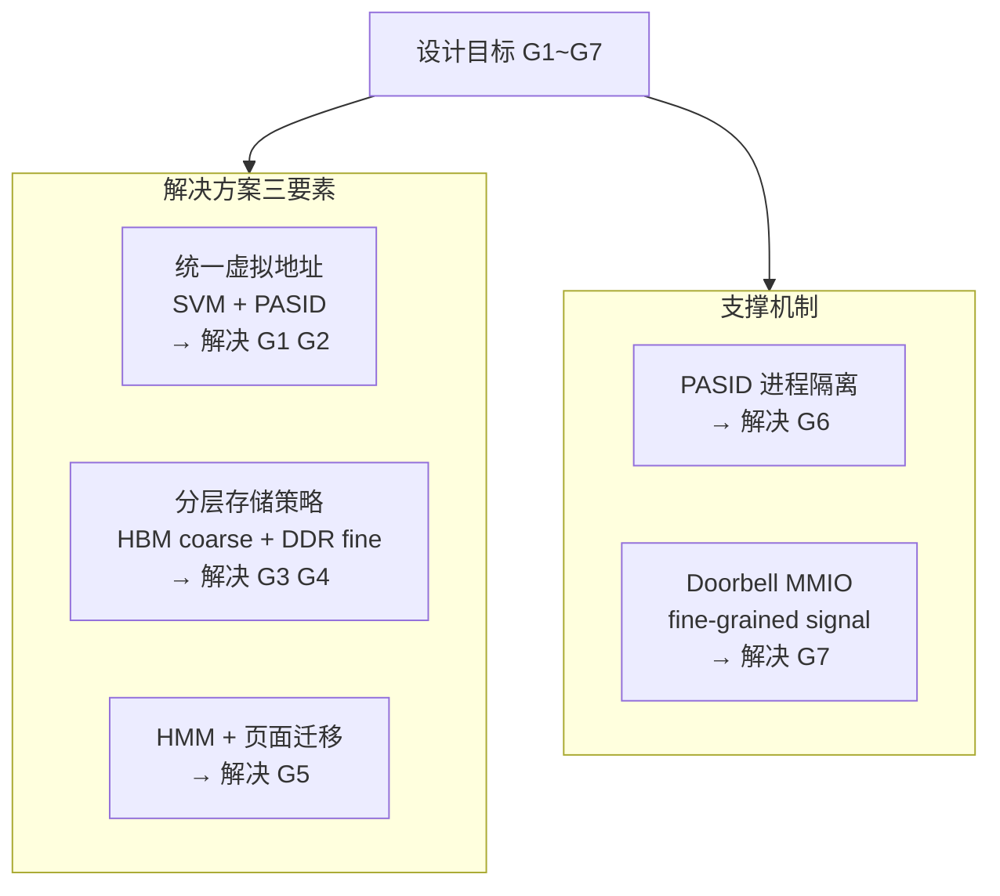

## 1.5 设计约束与边界

| 约束类别 | 约束内容 |
|---------|---------|
| **硬件约束** | PCIe 3.0 x16 双向带宽上限 ~16 GB/s，是 CPU-GPU 数据路径的硬性瓶颈 |
| **一致性代价** | Fine-grained 一致性通过 PCIe 实现，每次访问经过 IOMMU，延迟显著高于本地访问 |
| **TLB 开销** | 修改任意页表项必须触发 TLB Shootdown，涉及所有 CU，是 SVM 场景的主要开销来源 |
| **进程模型** | 一个 KFD 进程对应一个 Linux 进程，PASID 是进程级别概念，线程共享 GPUVM |
| **VRAM 容量** | HBM2 32 GB，超出后必须迁移到 DDR 或触发 OOM |
| **内核版本** | ROCm 5.6 依赖 Linux >= 5.15 的 HMM 完整实现 |

## 1.6 HIP 与 HSA 内存函数对照表

| 功能         | HIP 函数                            | HSA 函数                                        | 硬件缓存一致性 |
| :----------- | :---------------------------------- | :---------------------------------------------- | :------------- |
| 设备内存分配 | `hipMalloc`                         | `hsa_memory_allocate`（GLOBAL region）          | ❌ 不需要       |
| 固定主机内存 | `hipHostMalloc`                     | `hsa_memory_register` + GTT 分配                | 可选           |
| 托管内存     | `hipMallocManaged`                  | `hsa_memory_allocate` + SVM 属性                | 自动按需处理   |
| 内存拷贝     | `hipMemcpy`                         | `hsa_memory_copy`                               | ❌ 不需要       |
| 内存释放     | `hipFree` / `hipHostFree`           | `hsa_memory_free`                               | N/A            |
| 信号同步     | `hipStreamSynchronize` / `hipEvent` | `hsa_signal_create` / `hsa_signal_wait_acquire` | ✅ 必须硬件一致 |
| 队列/流      | `hipStreamCreate`                   | `hsa_queue_create`                              | ❌ 不需要       |

---

# 2. 存储的物理架构

## 2.1 系统物理拓扑

### 2.1.1 整体连接结构

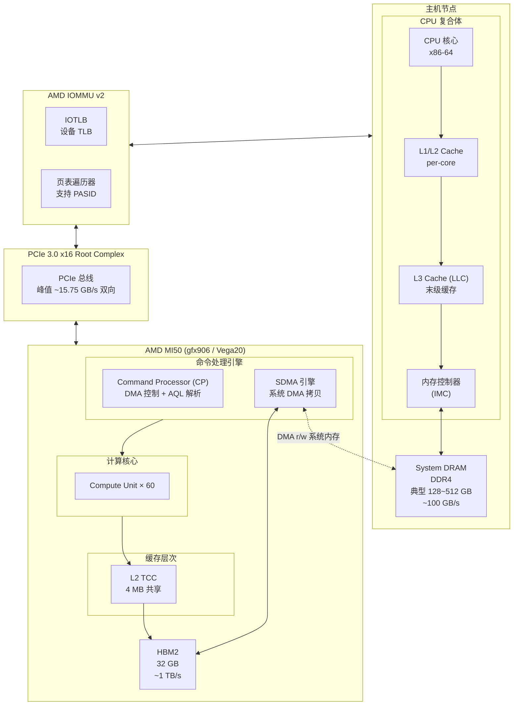

### 2.1.2 各路径性能参数

| 访问路径 | 峰值带宽 | 典型延迟 | 瓶颈所在 |
|---------|---------|---------|---------|
| GPU CU → HBM2 | ~1,000 GB/s | ~200 ns | HBM2 行缓冲 |
| GPU CU → L2 命中 | ~3,000 GB/s | ~100 cycles | L2 端口数量 |
| CPU → DDR | ~100 GB/s | ~80 ns | 内存带宽 |
| GPU → DDR (PCIe) | ~16 GB/s | ~1 µs+ | PCIe 带宽 |
| CPU → HBM (PCIe) | ~16 GB/s | ~1 µs+ | PCIe 带宽 |
| SDMA 迁移 (HBM↔DDR) | ~16 GB/s | 启动延迟 ~µs | PCIe 带宽 |

**关键结论**：PCIe 带宽（~16 GB/s）是 CPU-GPU 数据共享的硬性天花板，是所有 SVM 和细粒度内存设计的核心约束。

---

## 2.2 GPU 内部存储层次

### 2.2.1 层次结构（gfx906 / Vega20）

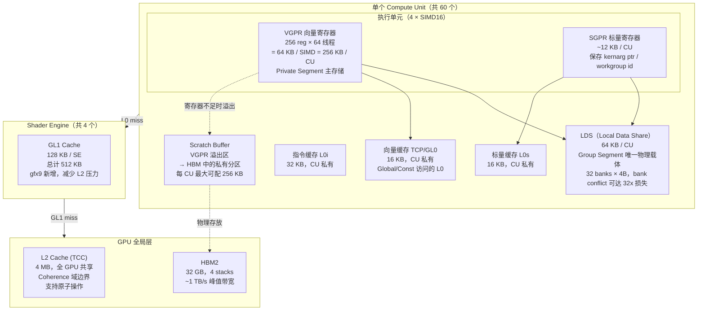

### 2.2.2 存储层次特性汇总

| 层次 | 容量 | 作用域 | 延迟 | 带宽 | HSA 映射 |
|------|------|-------|------|------|---------|
| VGPR | 256 KB / CU | per wavefront | 1 cycle | 极高 | Private |
| SGPR | 12 KB / CU | per wavefront（scalar） | 1 cycle | 高 | — |
| LDS | 64 KB / CU | per work-group | 2~4 cycles | ~128 TB/s (理论) | Group |
| L0V (TCP) | 16 KB / CU | per CU | ~10 cycles | 高 | Global 缓存 |
| GL1 | 128 KB / SE | per SE | ~20 cycles | 中高 | Global 缓存 |
| L2 (TCC) | 4 MB | 全 GPU | ~100 cycles | ~3 TB/s | Global 缓存 |
| HBM2 | 32 GB | 全 GPU | ~200 cycles | ~1 TB/s | Global 主存 |
| Scratch | 可配 | per CU | ~200 cycles | ~1 TB/s | Private 溢出 |
| DDR (PCIe) | 主机 | CPU+GPU | ~1000+ cycles | ~16 GB/s | Fine-grained Global |

---

## 2.3 地址翻译硬件体系

地址翻译是 SVM 的硬件基础。MI50 系统中存在**三套并行翻译机制**，分别服务于不同的访问路径。

### 2.3.1 三套翻译机制并行

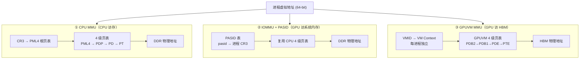

> 页表是CPU统一管理的。
>
> VMID（Virtual Memory ID）= GPU 用来区分不同虚拟地址空间（进程/上下文）的“地址空间标签”

### 2.3.2 PASID 机制详解

PASID（Process Address Space ID）是连接 CPU 进程与 GPU GPUVM 的关键桥梁：

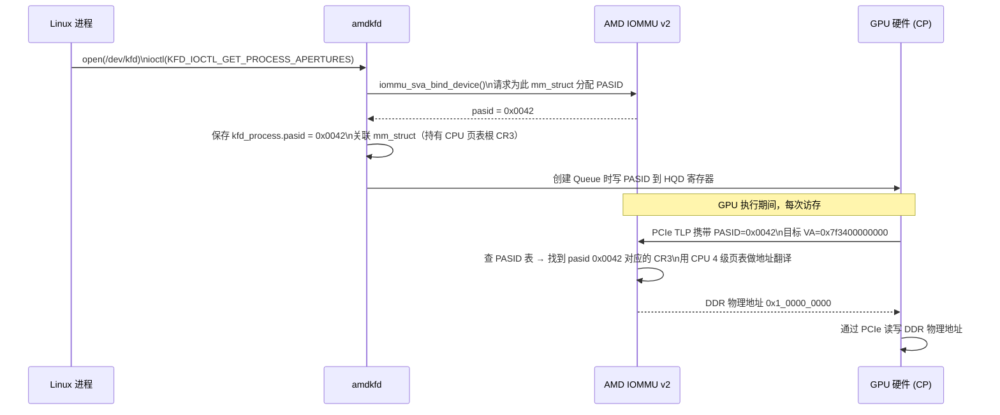

> PASID = 设备侧标识“进程地址空间”的 ID，使设备（GPU）可以在同一时间安全访问多个进程的虚拟地址空间。
>
> GPU:
>   (VMID, VA)
>    ↓
> GPU MMU:
>   → Physical Address（或中间地址）
>    ↓
> PCIe（带 PASID）
>    ↓
> IOMMU:
>   (PASID, VA) → Physical Address
>    ↓
> System RAM

### 2.3.3 TLB 层次

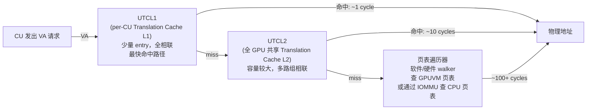

**TLB Shootdown**：当 KFD 修改任一 PTE（映射/解映射/迁移），必须向所有 60 个 CU 发送 UTCL1/UTCL2 失效请求，待所有 CU 确认后才能继续。这是 SVM 动态映射的主要延迟开销。

---

## 2.4 互联总线

### 2.4.1 PCIe 3.0 x16

- **带宽**：每方向 ~7.9 GB/s，双向理论峰值 ~15.75 GB/s
- **延迟**：端到端 ~1 µs（含 IOMMU 翻译）
- **传输模式**：
  - **Read**：GPU 通过 PCIe 读 DDR（CPU-initiated 或 PASID-initiated）
  - **Write**：GPU 通过 PCIe 写 DDR（SDMA DMA write）
  - **P2P**：两卡 HBM 间直接传输，无需过 CPU（需 PCIe P2P 或 XGMI）

### 2.4.2 XGMI / Infinity Fabric（多卡互联）

MI50 支持通过 XGMI 形成多卡 Peer-to-Peer 拓扑，使不同卡的 HBM 可以直接互访：

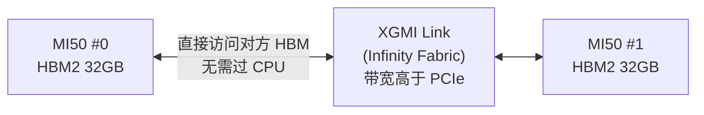

XGMI 场景下，两卡共享同一 SVM 地址空间，KFD 负责在两个设备的 GPUVM 中建立相同 VA 的映射。

---

# 3. 存储的逻辑架构

## 3.1 HSA 内存段模型

HSA 规范定义了**五种逻辑内存段**，每种有独立的访问语义和生命周期，与硬件存储形成固定映射：

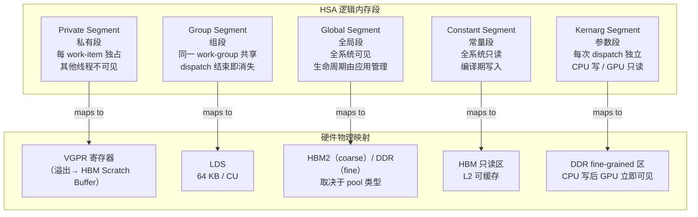

**各段编程特性对比**

| 段 | 声明方式 | 作用域 | 生命周期 | 最大容量 (gfx906) |
|----|---------|-------|---------|-----------------|
| Private | 局部变量（自动） | per work-item | kernel dispatch | VGPR 256 reg/thread；溢出无限制 |
| Group | `__shared__` / LDS | per work-group | kernel dispatch | 64 KB / CU |
| Global | 全局/设备指针 | 全系统 | 用户管理 | HBM 32 GB |
| Constant | `__constant__` | 全系统只读 | 程序生命期 | 受 L2 缓存容量制约 |
| Kernarg | AQL packet 字段 | 全系统只读 | per dispatch | 通常 < 4 KB |

> 1. Global Region（通用内存）
> 1.1 Fine-grained Global（细粒度）
> - 标志：
>   - HSA_REGION_SEGMENT_GLOBAL
>   - HSA_REGION_GLOBAL_FLAG_FINE_GRAINED
> - 用途：
>   - Signal
>   - Queue（AQL）
>   - Kernarg
>   - 小数据共享
> - 物理位置：
>   - System RAM（DDR）
> - CPU访问：
>   - ✔ 直接访问（cache coherent）
> - GPU访问：
>   - ✔ 通过 IOMMU + GPU MMU
> - 一致性：
>   - ✔ 硬件/协议保证（coherent）
> - 原子操作：
>   - ✔ 支持跨 CPU/GPU
> - 同步：
>   - release / acquire
>   - fence（sfence / lfence）
> ---
> 1.2 Coarse-grained Global（粗粒度）
> - 标志：
>   - HSA_REGION_SEGMENT_GLOBAL
>   - （无 FINE_GRAINED）
> - 用途：
>   - 大规模 buffer
>   - tensor / 计算数据
> - 物理位置：
>   - VRAM（HBM / GDDR）
>   - 或部分 pinned RAM
> - CPU访问：
>   - ⚠️ 慢 / 非一致
> - GPU访问：
>   - ✔ 高带宽直接访问
> - 一致性：
>   - ❌ 不保证
> - 原子操作：
>   - ⚠️ 受限（设备内）
> - 同步：
>   - 显式（copy / barrier / kernel boundary）
>
> ---

---

## 3.2 内存池（Memory Pool）模型

ROCr 将物理内存资源抽象为 **Memory Pool**，每个 Pool 代表一种具备特定属性的内存区域：

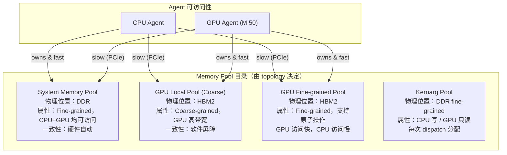

Pool 不分配实际内存，仅描述内存属性。通过以下 API 使用：

```c
// 枚举 GPU agent 的所有 pool
hsa_amd_agent_iterate_memory_pools(gpu_agent, callback, &pools);

// 查询 pool 属性
hsa_amd_memory_pool_get_info(pool, HSA_AMD_MEMORY_POOL_INFO_SEGMENT, &seg);
hsa_amd_memory_pool_get_info(pool, HSA_AMD_MEMORY_POOL_INFO_GLOBAL_FLAGS, &flags);

// 实际分配
hsa_amd_memory_pool_allocate(pool, size, flags, &ptr);
```

---

## 3.3 Agent 与内存可访问性

**可访问性矩阵（MI50 单卡场景）**

| 内存类型 | CPU Agent 读写 | GPU Agent 读写 | 一致性保证 |
|---------|--------------|--------------|---------|
| System Pool (DDR fine) | 原生，快 | 经 IOMMU+PCIe，慢 | 硬件 cache-line 一致 |
| GPU Local Pool (HBM coarse) | 需 `allow_access`，慢 | 原生，~1 TB/s | 无硬件一致，需软件屏障 |
| GPU Fine-grained Pool (HBM fine) | 需 `allow_access`，极慢 | 原生，但受一致性约束 | 硬件 cache-line 一致 |
| Kernarg Pool | 读写 | 只读 | 隐式（dispatch 前写入） |

```c
// 赋予 CPU agent 对 GPU 内存的访问权限
hsa_agent_t agents[] = {cpu_agent};
hsa_amd_agents_allow_access(1, agents, NULL, gpu_ptr);
// 此调用会在 CPU 侧建立 PCIe 映射（BAR 映射或 IOMMU 映射）
```

---

## 3.4 内存一致性分类

一致性是存储系统设计中最复杂的维度，HSA 提供三档：

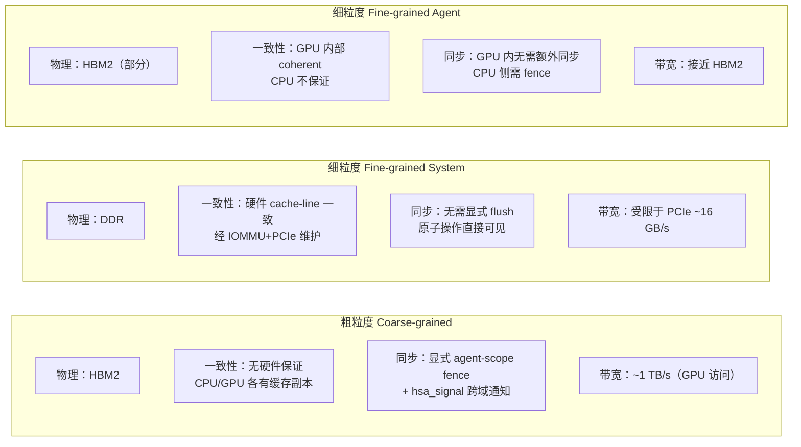

**选型决策树**

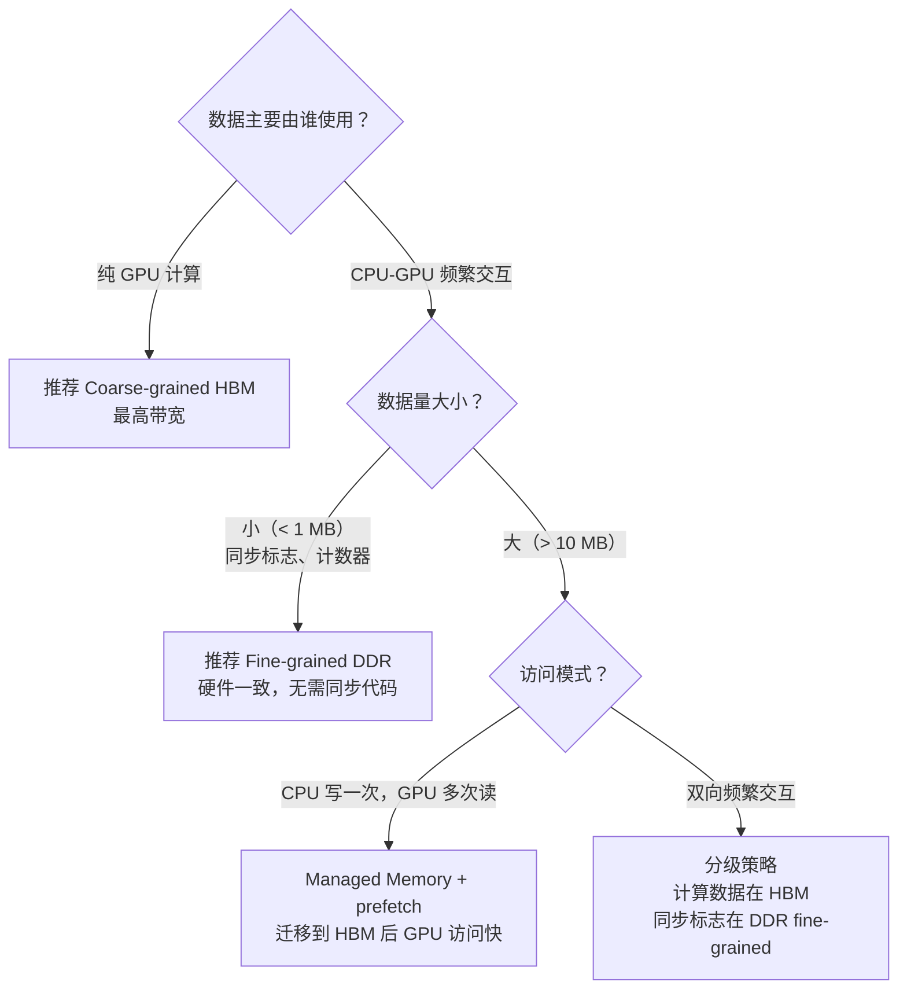

---

## 3.5 软件层次逻辑视图

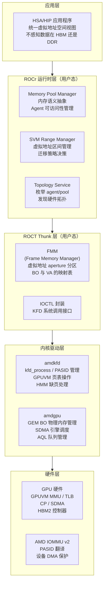

---

# 4. 存储的详细设计

## 4.1 存储的创建

### 4.1.1 标准分配路径（GPU Local Memory）

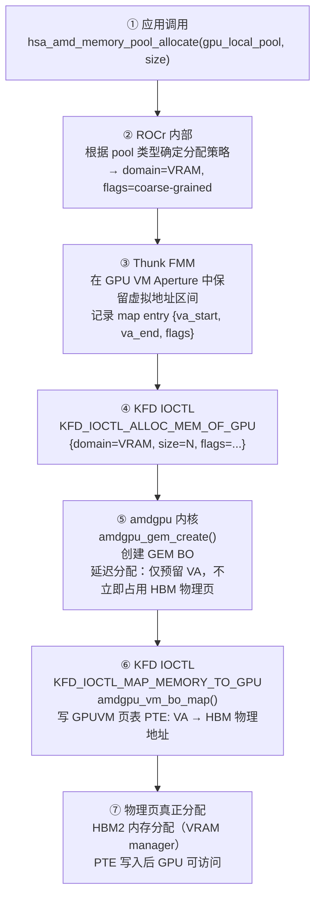

### 4.1.2 Userptr 注册路径（零拷贝共享）

Userptr 允许将已有 CPU 内存注册给 GPU 使用，无需数据拷贝：

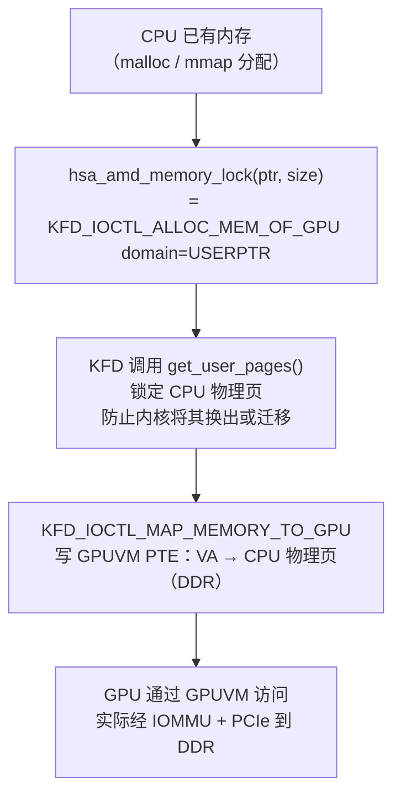

### 4.1.3 Scratch Buffer 创建（私有段溢出）

当 kernel 使用的 VGPR 超过 CU 寄存器文件容量时，编译器自动插入 scratch 访存指令：

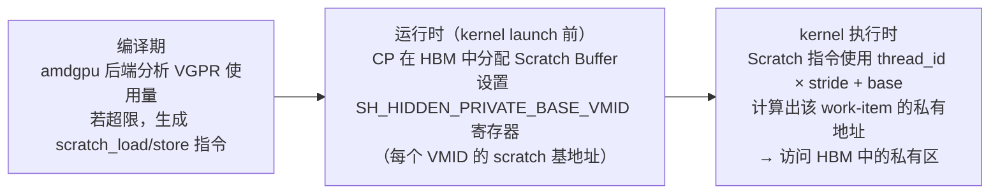

### 4.1.4 队列与信号的内存分配

队列创建时一次性分配以下内存区域：

| 组件 | 大小 | 位置 | 说明 |
|------|------|------|------|
| Ring Buffer | 2^N × 64B | GTT fine-grained | AQL packet 存放区，CPU 写 / CP 读 |
| MQD | ~256 B | GTT 或 VRAM | 队列上下文快照，CP 抢占时保存 |
| Doorbell | 4 B | MMIO BAR（用户态映射） | 写操作触发 CP 唤醒，无需 syscall |
| Read/Write Pointer | 各 8 B | Fine-grained DDR | CPU/GPU 各自更新，原子读写 |

---

## 4.2 存储的访问

### 4.2.1 GPU Kernel 访问路径

GPU kernel 执行时，不同内存段对应完全不同的硬件访问路径：

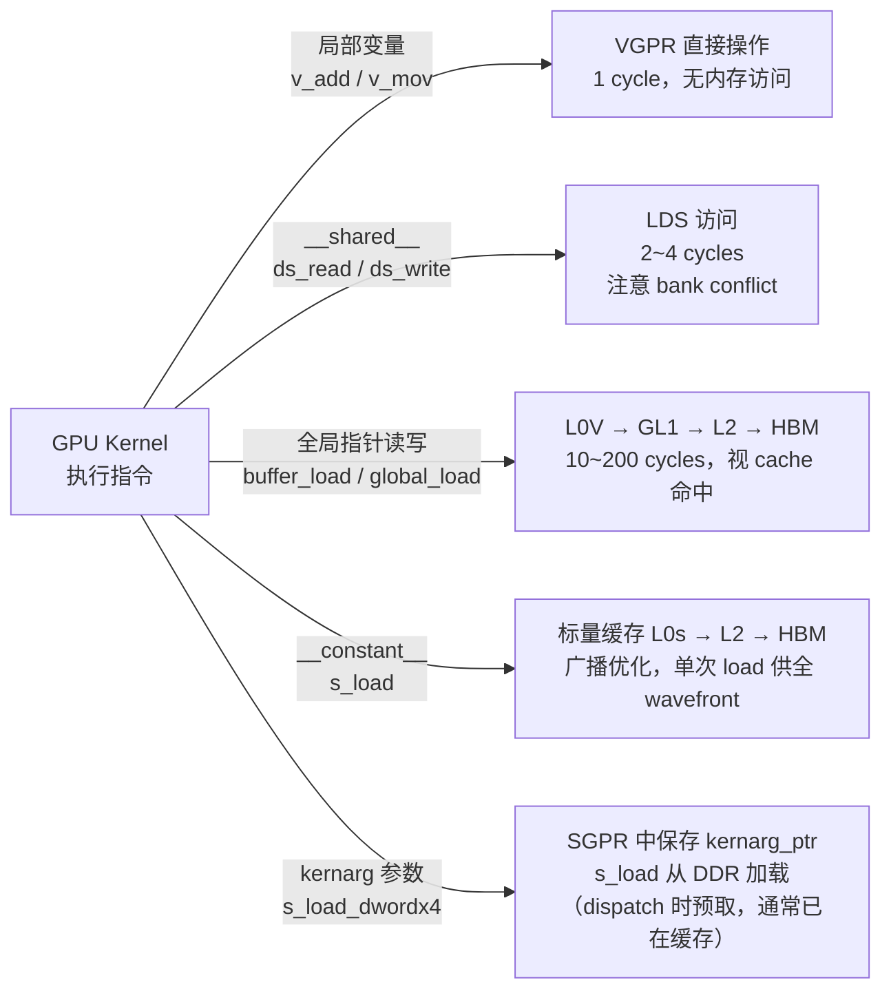

### 4.2.2 CPU 访问 GPU 内存路径

CPU 访问 GPU 内存依赖 PCIe BAR 映射或 IOMMU 反向映射：

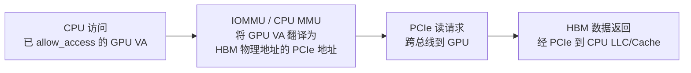

**注意**：CPU 访问 HBM 的延迟约为 ~1 µs，是 CPU 访问本地 DDR 的 10 倍以上。应尽量避免在 GPU 计算期间 CPU 频繁访问 HBM。

---

## 4.3 DMA 访问（SDMA 引擎）

SDMA（System DMA）是 GPU 内置的异步 DMA 引擎，用于大块数据搬运和页面迁移。

### 4.3.1 SDMA 架构

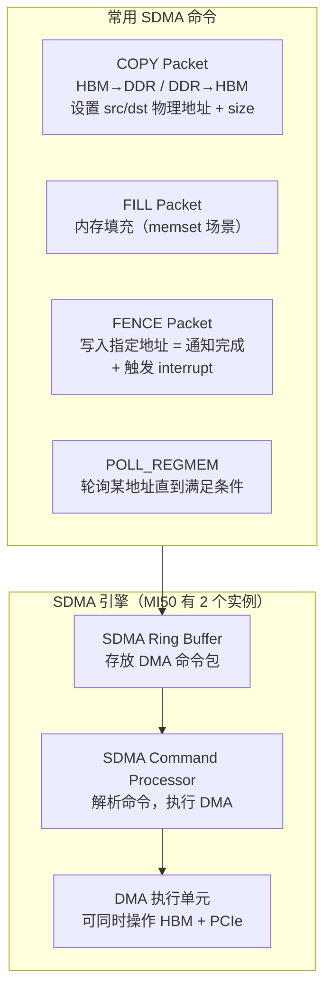

### 4.3.2 典型 DMA 传输流程（H2D 数据拷贝）

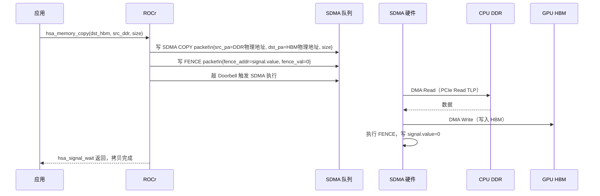

---

## 4.4 共享虚拟内存（SVM）

SVM 是异构存储系统的核心设计，让 CPU 和 GPU 共享同一虚拟地址空间。

### 4.4.1 SVM 地址空间管理（FMM Aperture）

Thunk 层的 FMM 将进程虚拟地址空间划分为若干固定用途的区间（Aperture）：

```mermaid
graph TB
    subgraph VAS["进程 64-bit 虚拟地址空间（示意，非精确地址）"]
        KERN_SPACE["内核态空间\n0xFFFF800000000000+"]

        subgraph FMM_ZONE["FMM 管辖区间"]
            AP_GPU["GPU VM Aperture\n高地址区段\nGPU 专属 BO 的 VA 归属地\n（Coarse-grained HBM 分配落在此）"]
            AP_SCRATCH["Scratch Aperture\nPrivate Segment 溢出 VA 区\n编译器/CP 写固定范围"]
            AP_SVM["SVM Aperture\n可迁移共享区\nhipMallocManaged / demand paging\n物理页可在 HBM ↔ DDR 间移动"]
        end

        USERSPACE["普通用户态\n代码 / 堆 / 栈\nmalloc / mmap"]
    end

    FMM_DB["FMM 虚拟地址数据库\n每条记录包含：\n· va_start / va_end\n· bo_handle（KFD BO）\n· flags（coarse/fine, userptr...）\n· preferred_node（优选 GPU）\n· mapped_to_gpu_bitmap"]

    FMM_ZONE <-->|"分配时写入 / 释放时删除"| FMM_DB
```

### 4.4.2 双侧页表同步策略

SVM 的核心难点是 CPU 页表（由内核管理）与 GPUVM 页表（由 KFD 管理）的一致性：

```mermaid
graph LR
    subgraph CPU_PT_SIDE["CPU 侧页表（内核管理）"]
        CPU_PTE["CPU PTE: VA → DDR PFN\n当 fork/munmap/mprotect 时\n内核会修改"]
    end

    subgraph GPU_PT_SIDE["GPU VM 页表（KFD 管理）"]
        GPU_PTE["GPUVM PTE: VA → HBM/DDR PA\nKFD 负责更新\n与 CPU 侧保持对应关系"]
    end

    subgraph SYNC_MECH["同步机制"]
        MMU_NOTIF["MMU Notifier\nCPU 页表修改前通知 KFD"]
        TLB_SD["TLB Shootdown\nKFD 修改 GPUVM 后\n使 GPU TLB 失效"]
    end

    CPU_PT_SIDE -->|"CPU 修改 → 触发 notifier"| MMU_NOTIF
    MMU_NOTIF -->|"KFD 撤销对应 GPUVM PTE"| GPU_PT_SIDE
    GPU_PT_SIDE -->|"KFD 修改 → 触发 shootdown"| TLB_SD
```

---

## 4.5 缓存与一致性

### 4.5.1 一致性域边界

```mermaid
graph TB
    subgraph COHERENCE_DOMAIN["一致性域层次"]
        WI_DOMAIN["Work-item 域\n单线程内：编译器保证一致\n无需任何指令"]
        WG_DOMAIN["Work-group 域\n同 CU 内所有线程\ns_barrier 后 LDS 写入对组内可见\nbuffer_wbinvl1_vol 后 L0 writeback"]
        AGENT_DOMAIN["Agent 域（全 GPU）\n所有 CU 之间\nL0 + GL1 flush 后 L2 中可见\nL2 是 GPU 侧 coherence 边界"]
        SYSTEM_DOMAIN["System 域（CPU + GPU）\nL2 flush + PCIe 同步后\nCPU cache 可见\n仅 fine-grained 内存保证"]
    end

    WI_DOMAIN -->|"scope 扩大，代价增加"| WG_DOMAIN --> AGENT_DOMAIN --> SYSTEM_DOMAIN
```

### 4.5.2 缓存层次与 Flush 指令

| 操作 | 影响范围 | GPU 指令 | 代价 |
|------|---------|---------|------|
| 无 | work-item 内 | — | 0 |
| L0 invalidate | 同 CU work-items | `buffer_wbinvl1_vol` | 低 |
| L0+GL1 flush | 同 SE 所有 CU | `buffer_gl1_inv` + `buffer_wbinvl1` | 中 |
| L2 flush（写回） | 全 GPU → HBM | `buffer_wbl2` | 较高 |
| L2 invalidate | 全 GPU | `buffer_invl2` | 较高 |
| System fence | CPU 可见 | L2 flush + s_waitcnt + PCIe | 最高 |

### 4.5.3 Fine-grained 内存的硬件一致性实现

Fine-grained 内存之所以无需显式 flush，是因为其 L2 cache policy 被配置为 **coherent with system**：

```mermaid
graph LR
    GPU_WRITE["GPU 写 fine-grained 地址"]
    L2_BYPASS["L2 Cache Policy = UC (Uncached)\n或 CC (Cache Coherent)\n写操作直接穿透 L2 → PCIe → DDR"]
    DDR_UPDATE["DDR 物理页立即更新"]
    CPU_READ["CPU 读同一地址\n命中 LLC 无效 → 从 DDR 读\n得到 GPU 最新写入值"]

    GPU_WRITE --> L2_BYPASS --> DDR_UPDATE --> CPU_READ
```

---

## 4.6 页错误处理

GPU 缺页（VM Fault）是 SVM demand paging 的核心机制，允许 GPU 访问尚未建立 GPUVM 映射的虚拟地址。

### 4.6.1 缺页处理完整流程

```mermaid
sequenceDiagram
    participant GPU as GPU 执行单元
    participant GMMU as GPU MMU (UTCL2)
    participant CP as Command Processor
    participant KFD as amdkfd 驱动
    participant HMM as Linux HMM
    participant MM as CPU mm_struct
    participant AMDGPU as amdgpu 驱动

    GPU->>GMMU: 访问 VA=0x7f34_0000（GPUVM 无 PTE）
    GMMU->>GMMU: 页表遍历失败
    GMMU->>CP: 上报 VM Fault\n{pasid=0x42, va=0x7f34_0000, rw=READ}
    CP->>KFD: 触发 VM Fault 中断\n（amdgpu_vm_fault 中断处理）
    KFD->>HMM: hmm_range_fault(mm, va, len, flags)

    alt 情形 A：CPU 页表中有映射（页在 DDR）
        HMM->>MM: walk_page_range()\n找到 DDR 物理页 PFN
        HMM-->>KFD: 返回 PFN 列表 + 权限
        KFD->>AMDGPU: amdgpu_vm_bo_update()\n写 GPUVM PTE: VA→DDR_PA
        KFD->>GMMU: TLB 失效（使新 PTE 生效）
    else 情形 B：页尚未分配（Demand Paging）
        HMM->>MM: __handle_mm_fault()\n分配新 DDR 物理页
        MM-->>HMM: 新 PFN
        HMM-->>KFD: 返回新 PFN
        KFD->>AMDGPU: 写 GPUVM PTE
    else 情形 C：页在 HBM（Device Private），CPU 触发迁回
        KFD->>HMM: migrate_vma_pages() HBM→DDR
        HMM->>AMDGPU: SDMA 拷贝 HBM→DDR
        HMM->>MM: 更新 CPU PTE
        KFD->>AMDGPU: 撤销旧 GPUVM PTE，建立新 PTE
    end

    KFD->>CP: 通知 VM Fault 已处理
    CP->>GPU: 重新执行被中断的内存指令
```

### 4.6.2 MMU Notifier：CPU 修改同步到 GPU

```mermaid
sequenceDiagram
    participant PROC as CPU 进程
    participant MM as Linux MM
    participant NOTIF as KFD MMU Notifier
    participant KFD as amdkfd
    participant AMDGPU as amdgpu

    PROC->>MM: munmap(va, len)\n或 mprotect(va, len, PROT_NONE)
    MM->>NOTIF: mmu_notifier_invalidate_range_start(va, len)
    NOTIF->>KFD: kfd_invalidate_tlbs(pasid, va, len)
    KFD->>AMDGPU: amdgpu_vm_bo_unmap(va, len)\n撤销 GPUVM PTE
    KFD->>KFD: TLB Shootdown（所有 CU）
    KFD-->>NOTIF: 完成撤销
    NOTIF-->>MM: invalidate_range_start 回调返回
    MM->>MM: 执行实际 CPU 页表修改
    MM->>NOTIF: mmu_notifier_invalidate_range_end()
    Note over PROC,AMDGPU: GPU 侧不再持有悬空映射，内存安全
```

---

## 4.7 页面迁移

页面迁移允许物理内存在 HBM 和 DDR 之间流动，使数据尽量靠近计算单元。

### 4.7.1 迁移触发条件

| 触发条件 | 方向 | 触发方式 |
|---------|------|---------|
| GPU 频繁 fault 访问 DDR 页 | DDR → HBM | KFD 策略自动迁移 |
| CPU 访问 Device Private 页 | HBM → DDR | HMM CPU fault 处理 |
| 显式 prefetch | 由应用指定 | `hsa_amd_svm_prefetch_async` |
| HBM 内存压力/OOM | HBM → DDR | amdgpu VRAM 驱逐（eviction） |

### 4.7.2 迁移执行流程

```mermaid
graph TD
    TRIGGER["触发迁移决策"]
    ALLOC_DST["在目标域分配物理页\n（HBM: amdgpu gem alloc\n DDR: alloc_page）"]
    FREEZE["冻结 CPU 侧映射\n（mmu_notifier_invalidate）\n防止迁移期间 CPU 访问"]
    COPY["SDMA DMA 拷贝\n（HBM→DDR: SDMA copy_from_device\n DDR→HBM: SDMA copy_to_device）"]
    UPD_CPU["更新 CPU 页表 PTE\n（DDR→HBM: PTE 改为 Device Private\n HBM→DDR: PTE 恢复普通物理页）"]
    UPD_GPU["更新 GPUVM PTE\n（指向新物理地址）"]
    TLB_SD["TLB Shootdown\n两侧 TLB 失效"]
    FREE_SRC["释放源端物理页"]

    TRIGGER --> ALLOC_DST --> FREEZE --> COPY --> UPD_CPU & UPD_GPU --> TLB_SD --> FREE_SRC
```

### 4.7.3 VRAM 驱逐（Eviction）

当 HBM 内存不足时，amdgpu 驱动主动将低优先级 BO 驱逐到 DDR：

```mermaid
graph LR
    OOM["HBM 分配失败\n（VRAM OOM）"]
    EVICT_POLICY["驱逐策略\nLRU + 优先级\n选择最近最少使用的 BO"]
    UNMAP_GPU["撤销被驱逐 BO 的 GPUVM 映射"]
    EVICT_TO_GTT["将 BO 内容通过 SDMA\n拷贝到 GTT（DDR）"]
    REALLOC["在 DDR 重新建立映射\n（GTT 映射）"]
    RESTORE["当 BO 再次被 GPU 访问时\n触发 fault → 迁移回 HBM"]

    OOM --> EVICT_POLICY --> UNMAP_GPU --> EVICT_TO_GTT --> REALLOC --> RESTORE
```

---

## 4.8 原子操作与同步机制

### 4.8.1 Signal 机制详细设计

`hsa_signal_t` 是 HSA 中 CPU-GPU 同步的统一原语，底层是 **fine-grained 内存上的 64-bit 原子变量**：

```mermaid
graph TB
    subgraph SIGNAL_MEM["Signal 内存布局（fine-grained DDR）"]
        SIG_VAL["offset 0x00: value (int64_t)\n原子操作的目标变量\nCPU/GPU 均可原子读写"]
        SIG_EID["offset 0x08: event_id\n关联 KFD 事件 ID\n用于 blocking wait 场景"]
        SIG_MBOX["offset 0x10: event_mailbox_ptr\nGPU 写此地址触发 KFD 事件\n唤醒阻塞的 CPU 线程"]
    end

    subgraph CPU_OPS["CPU 侧操作"]
        CPU_STORE["hsa_signal_store_screlease(sig, val)\n→ __atomic_store_n(&sig.value, val, __ATOMIC_RELEASE)"]
        CPU_WAIT_SPIN["hsa_signal_wait_scacquire(..., ACTIVE)\n→ 自旋轮询 sig.value（用户态）"]
        CPU_WAIT_BLOCK["hsa_signal_wait_scacquire(..., BLOCKED)\n→ ioctl(KFD_WAIT_EVENTS)\n→ 内核阻塞等待 mailbox 写入中断"]
    end

    subgraph GPU_OPS["GPU 侧操作（CP 自动执行）"]
        GPU_ATOMIC["AQL packet 执行完后\nCP: s_atomic_add sig.value, -1\n（到 fine-grained DDR）"]
        GPU_MAILBOX["若 event_mailbox_ptr != 0\nCP 写 mailbox → 触发 MSI 中断\n唤醒 CPU 阻塞 wait"]
    end

    SIGNAL_MEM --> CPU_OPS
    SIGNAL_MEM --> GPU_OPS
```

### 4.8.2 GPU 原子操作类型

| 原子操作 | GPU 指令 | 适用场景 |
|---------|---------|---------|
| 原子加 | `buffer_atomic_add` | 计数器、直方图 |
| 原子比较交换 | `buffer_atomic_cmpswap` | 锁、链表操作 |
| 原子最大/最小 | `buffer_atomic_smax/umax` | 归约操作 |
| 原子与/或 | `buffer_atomic_and/or` | 位掩码操作 |
| 原子交换 | `buffer_atomic_swap` | 生产者消费者 |

**作用域**：粗粒度内存上的原子操作仅保证 GPU 内部可见（agent scope）；细粒度内存上的原子操作保证 CPU+GPU 全局可见（system scope）。

### 4.8.3 AQL Barrier Packet 同步

多个 kernel 之间的依赖通过 Barrier Packet 实现，避免 CPU 介入：

```mermaid
sequenceDiagram
    participant APP as 应用（CPU）
    participant RING as AQL Ring Buffer
    participant CP as Command Processor

    APP->>RING: 写 KernelDispatch Packet #1\ncompletion_signal = sig1
    APP->>RING: 写 BarrierAND Packet\ndep_signal[0] = sig1\ncompletion_signal = barrier_sig
    APP->>RING: 写 KernelDispatch Packet #2\n（依赖 barrier_sig）
    APP->>CP: 敲 Doorbell，批量提交

    CP->>CP: 执行 Kernel #1
    CP->>CP: Kernel #1 完成，写 sig1 = 0
    CP->>CP: 检查 BarrierAND\nsig1 == 0，条件满足
    CP->>CP: 写 barrier_sig = 0
    CP->>CP: 执行 Kernel #2
    Note over APP,CP: 整个依赖链在 GPU 侧完成\nCPU 无需参与中间同步
```

### 4.8.4 Queue（队列）机制

队列是 CPU 提交工作到 GPU 的通道，其 Ring Buffer 本身是内存中精确设计的环形结构：

```mermaid
graph LR
    subgraph RING_LAYOUT["Ring Buffer 内存布局"]
        PKT0["slot 0\nAQL Packet"]
        PKT1["slot 1\nAQL Packet"]
        PKTN["slot N-1\n..."]
        PKT0 --> PKT1 --> PKTN --> PKT0
        WPTR["Write Ptr\nCPU 写：指向下一个空 slot"]
        RPTR["Read Ptr\nGPU(CP) 读：已消费到此处"]
    end

    subgraph DISPATCH_FLOW["提交流程"]
        CALC_SLOT["CPU 计算 slot 位置\nslot = wptr % ring_size"]
        WRITE_PKT["CPU 写 packet 内容\n（最后写 header 字段\n设置 type=KERNEL_DISPATCH）"]
        INC_WPTR["CPU 原子递增 wptr"]
        WRITE_DB["CPU 写 Doorbell = new_wptr\n（用户态 MMIO store，无 syscall）"]
        CP_WAKEUP["CP 检测到 Doorbell 更新\n读取新 packet，开始调度"]
    end

    RING_LAYOUT --> DISPATCH_FLOW
```

---

## 4.9 存储的释放

### 4.9.1 标准释放路径

```mermaid
graph TD
    FREE_API["应用调用\nhsa_memory_free(ptr)\n或 hsa_amd_memory_pool allocate 对应释放"]
    THUNK_LOOKUP["Thunk FMM\n根据 ptr 查找 map entry\n获取 bo_handle"]
    UNMAP_GPU["KFD_IOCTL_UNMAP_MEMORY_FROM_GPU\namdgpu_vm_bo_unmap()\n清除所有 GPU 上的 GPUVM PTE"]
    TLB_INVAL["TLB Shootdown\n向所有 CU 发送失效\n等待全部 CU 确认"]
    FREE_BO["KFD_IOCTL_FREE_MEMORY_OF_GPU\namdgpu_gem_object_put()\nGEM BO 引用计数-1\n→ 归零时真正释放 HBM 物理页"]
    FMM_REMOVE["Thunk FMM\n从虚拟地址数据库删除 map entry\n释放预留的 VA 区间"]

    FREE_API --> THUNK_LOOKUP --> UNMAP_GPU --> TLB_INVAL --> FREE_BO --> FMM_REMOVE
```

### 4.9.2 进程退出时的资源回收

当持有 GPU 内存的进程退出时，KFD 负责全面清理：

```mermaid
graph LR
    PROC_EXIT["进程退出\n（正常 / crash / kill）"]
    NOTIF_KFD["Linux 通知 KFD\n（kfd_process_notifier_release）"]
    EVICT_ALL["强制驱逐所有正在执行的 Queue\n（GPU 停止使用此 VMID）"]
    UNMAP_ALL["撤销所有 GPUVM 映射\n（遍历 kfd_process 的所有 BO）"]
    FREE_ALL["释放所有 GEM BO\n（HBM + GTT 物理页全部归还）"]
    PASID_FREE["IOMMU 解绑 PASID\n（iommu_sva_unbind_device）\n释放 PASID 供他进程使用"]

    PROC_EXIT --> NOTIF_KFD --> EVICT_ALL --> UNMAP_ALL --> FREE_ALL --> PASID_FREE
```

---

# 5. 关键场景端到端流程

## 5.1 完整 Dispatch 中的内存操作全景

```mermaid
sequenceDiagram
    participant APP as 应用
    participant ROCR as ROCr
    participant THUNK as Thunk
    participant KFD as KFD
    participant CP as GPU CP
    participant CU as GPU CU

    Note over APP,CU: 阶段 1：内存准备
    APP->>ROCR: pool_allocate(gpu_pool, size) 分配输入数据
    ROCR->>THUNK: FMM 保留 VA
    THUNK->>KFD: IOCTL_ALLOC_MEM(VRAM)
    KFD-->>APP: gpu_ptr（GPUVM 中的 VA）

    APP->>APP: CPU 写数据到 gpu_ptr\n（经 PCIe，fine-grained 场景）

    Note over APP,CU: 阶段 2：队列与参数准备
    APP->>ROCR: queue_create()
    ROCR->>KFD: IOCTL_CREATE_QUEUE\n分配 Ring/MQD/Doorbell
    APP->>APP: 分配 kernarg buffer\n填写 kernel 参数（包含 gpu_ptr）
    APP->>ROCR: signal_create() → fine-grained signal 内存

    Note over APP,CU: 阶段 3：提交
    APP->>APP: 填写 AQL KernelDispatch packet\nkernarg_address = kernarg_ptr\ncompletion_signal = sig
    APP->>CP: 写 Doorbell（用户态 MMIO）
    CP->>CP: 读 AQL packet
    CP->>CP: 解析 kernarg_address / kernel_object

    Note over APP,CU: 阶段 4：执行
    CP->>CU: 分发 wavefront\nSGPR0/1 = kernarg_ptr
    CU->>CU: s_load 加载 kernel 参数
    CU->>CU: 执行计算\nbuffer_load 读 HBM
    CU->>CU: buffer_store 写结果

    Note over APP,CU: 阶段 5：完成同步
    CP->>CP: AQL packet 完成\n对 completion_signal 执行原子减 1
    CP->>CP: 写 signal.event_mailbox → MSI 中断
    APP->>APP: hsa_signal_wait 被唤醒\n读取结果数据

    Note over APP,CU: 阶段 6：释放
    APP->>ROCR: hsa_memory_free(gpu_ptr)
    ROCR->>KFD: IOCTL_UNMAP + IOCTL_FREE
```

## 5.2 跨进程 GPU 内存共享（IPC）

```mermaid
sequenceDiagram
    participant PROC_A as 进程 A（生产者）
    participant KFD as KFD
    participant PROC_B as 进程 B（消费者）

    PROC_A->>KFD: hsa_amd_ipc_memory_create(ptr, size)\n= IOCTL_GET_DMABUF_INFO → 导出 dmabuf fd
    KFD-->>PROC_A: ipc_handle（包含 dmabuf fd）
    PROC_A->>PROC_B: 通过 Unix Socket 传递 ipc_handle
    PROC_B->>KFD: hsa_amd_ipc_memory_attach(ipc_handle)\n= IOCTL_IMPORT_DMABUF → 在进程 B 的 GPUVM 建立映射
    KFD-->>PROC_B: 进程 B 侧的虚拟地址 ptr_b
    PROC_B->>PROC_B: GPU kernel 使用 ptr_b 访问共享 HBM
    PROC_B->>KFD: hsa_amd_ipc_memory_detach(ptr_b)\n撤销进程 B 的 GPUVM 映射
```

---

# 6. 性能模型与选型指南

## 6.1 访问延迟模型

GPU kernel 不同内存访问的延迟差异跨越 3 个数量级：

```
VGPR 寄存器        1 cycle      |
LDS               2-4 cycles   ||
L0 Cache 命中     ~10 cycles   |||||||||||
GL1 Cache 命中    ~20 cycles   ||||||||||||||||||||
L2 Cache 命中     ~100 cycles  ||||||||||||||||||||||||||||||||||||||||
HBM2              ~200 cycles  ||||||||||||||||||||||||||||||||||||||||||||||||||||||||||||||||||||||||||||||||||||||||
DDR via PCIe      ~1000 cycles ↑以上 × 5
```

## 6.2 带宽 Roofline 参考

| 内存层次 | 带宽 | 对应 GPU 算力 26.5 TFLOPS 下的算术强度阈值 |
|---------|------|----------------------------------------|
| HBM2 | ~1,000 GB/s | 26.5 FLOP/B（高于此值为计算瓶颈） |
| L2 Cache | ~3,000 GB/s | 8.8 FLOP/B |
| DDR via PCIe | ~16 GB/s | 1,656 FLOP/B（几乎所有 kernel 均内存瓶颈） |

## 6.3 场景选型指南

| 场景 | 推荐内存类型 | 分配 API | 同步方式 | 核心原因 |
|------|------------|---------|---------|---------|
| GPU 大规模并行计算（主数据） | Coarse-grained HBM | `pool_allocate(gpu_local_pool)` | Agent-scope fence + signal | 最高带宽，软件控制一致性 |
| Work-group 线程间通信 | Group（LDS） | `__shared__` | `s_barrier` | 片上无延迟，64KB 足够 tile |
| CPU-GPU 完成通知 / 旗语 | Fine-grained DDR（signal） | `hsa_signal_create` | 原子操作（无需 fence） | 硬件一致，CPU 用户态可轮询 |
| 少量 CPU-GPU 共享数据（< 1 MB） | Fine-grained DDR | `pool_allocate(system_pool)` | 隐式（硬件保证） | 避免显式拷贝，代码简单 |
| 大块数据 CPU→GPU | Coarse-grained HBM + DMA | `pool_allocate` + `hsa_memory_copy` | DMA 完成 signal | 利用 SDMA 异步搬运，计算与拷贝 overlap |
| 计算/访问模式不确定 | Managed（SVM 可迁移） | `hipMallocManaged` | prefetch + 自动 fault | 数据自动跟随计算迁移 |
| GPU 只读常量参数 | Constant Segment | `__constant__` | 无需同步 | L0s/L2 广播，单次加载供全 wavefront |
| 跨 GPU 进程共享 | IPC Memory | `hsa_amd_ipc_memory_*` | 应用层协议 | dmabuf 跨进程 GPUVM 映射 |
| GPU 本地变量（超 VGPR 容量） | Private（Scratch） | 编译器自动 | 无需同步 | 编译器自动处理溢出，透明到程序员 |
