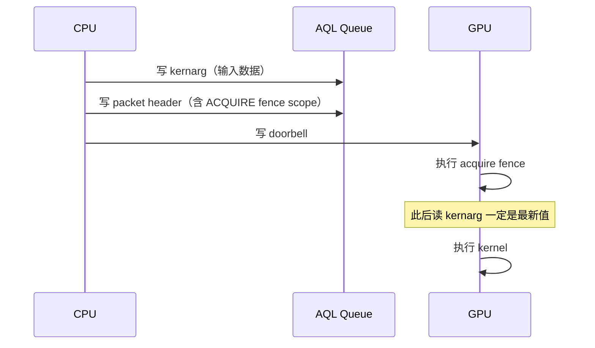
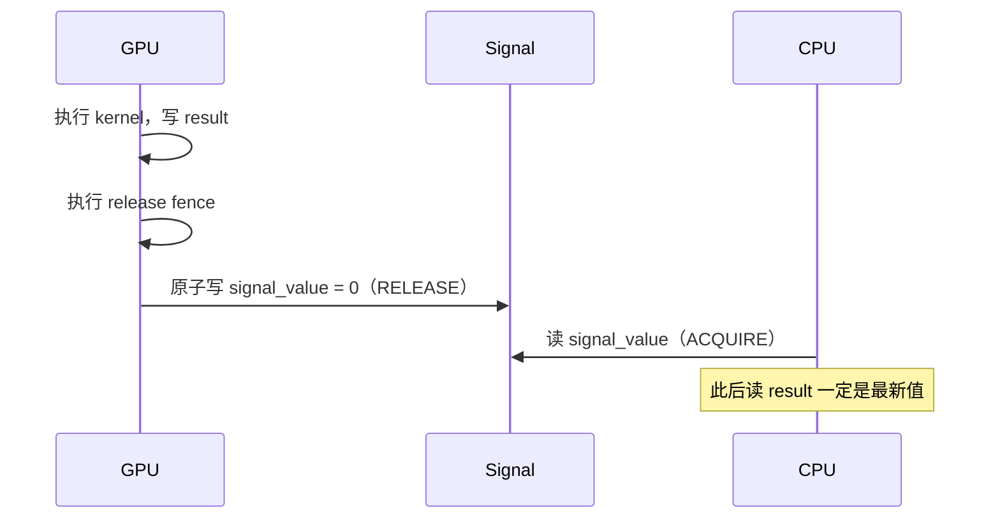
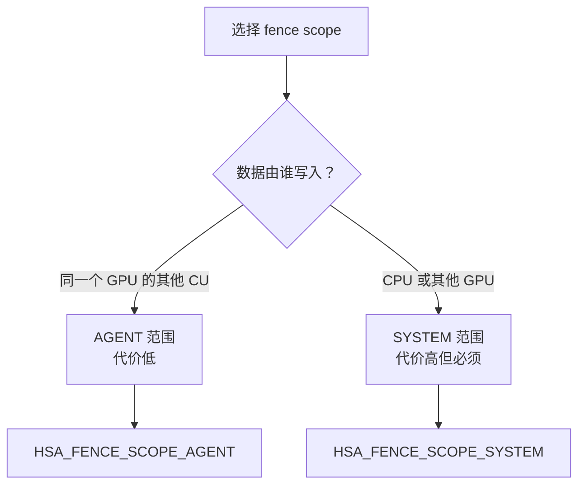
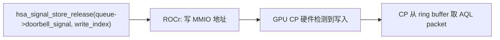
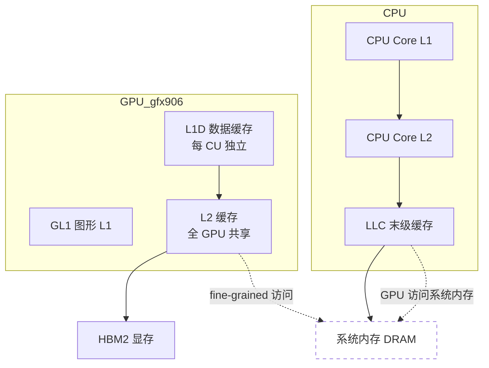
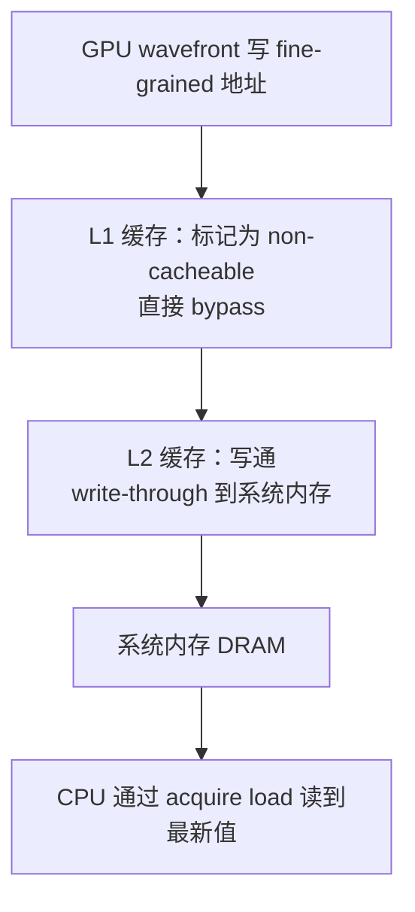
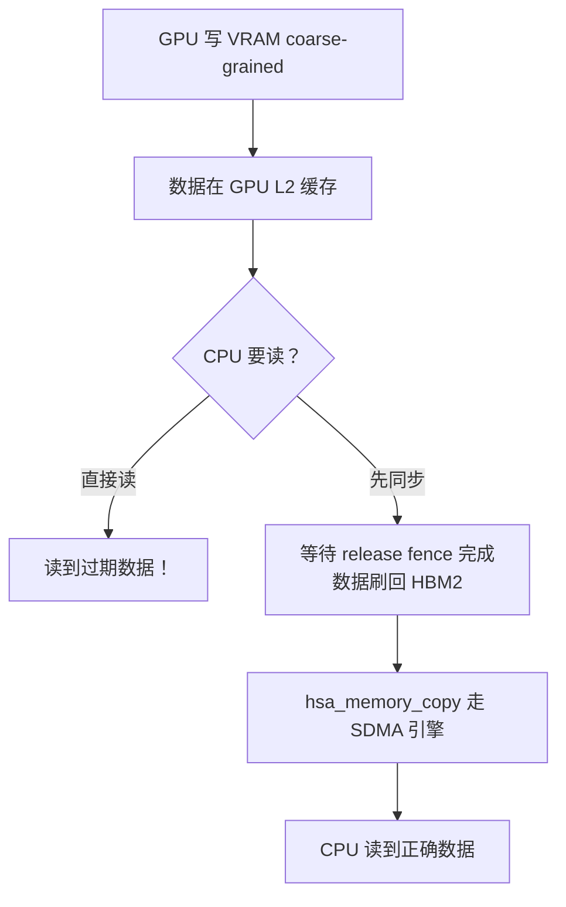
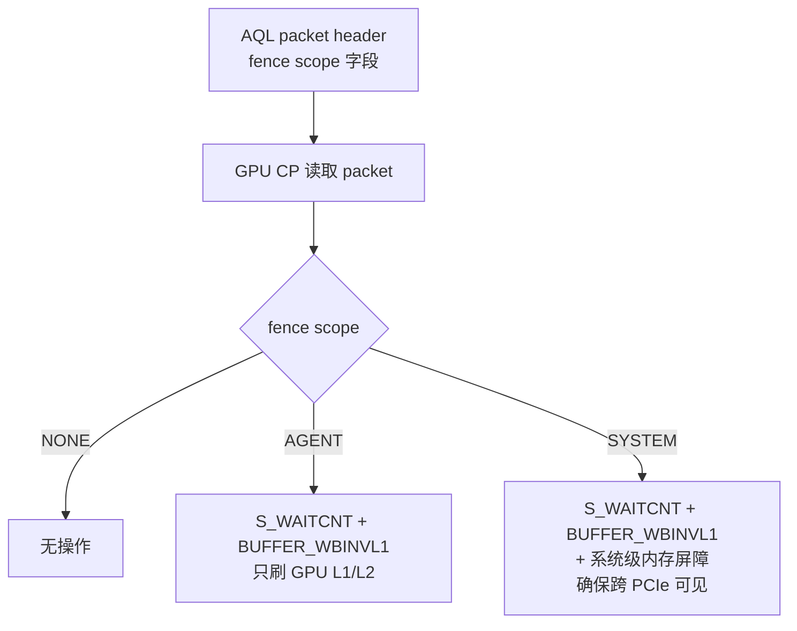
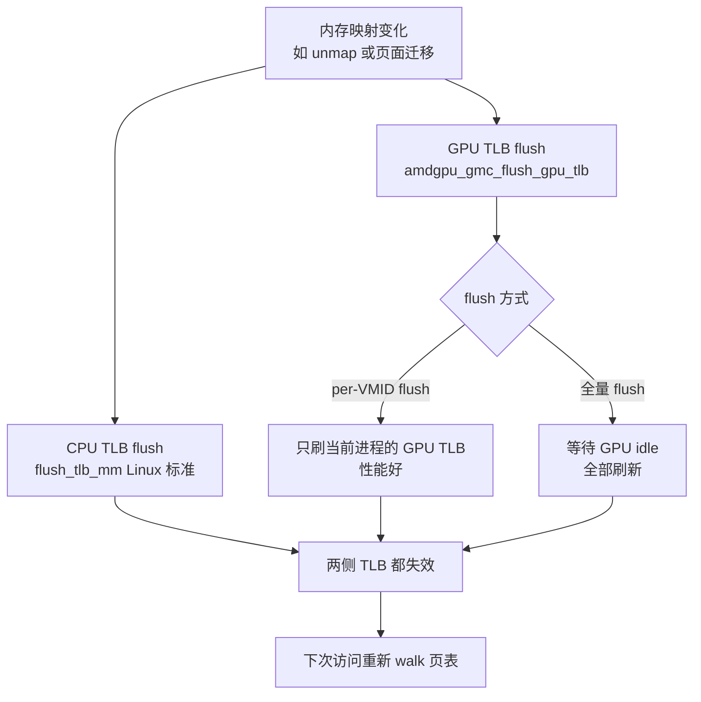

# HSA 内存一致性机制

> 参考规范：HSA System Architecture Specification 1.1.1  
> 硬件平台：AMD MI50 (gfx906 / Vega20)  
> 适用范围：ROCm 5.6 运行时

---

## 目录

1. [为什么需要内存一致性](#1-为什么需要内存一致性)
2. [HSA 内存模型基础概念](#2-hsa-内存模型基础概念)
3. [内存序（Memory Order）](#3-内存序memory-order)
4. [Fence 机制](#4-fence-机制)
5. [信号与一致性](#5-信号与一致性)
6. [硬件实现机制](#6-硬件实现机制)
7. [软件层实现](#7-软件层实现)
8. [常见陷阱与最佳实践](#8-常见陷阱与最佳实践)

---

## 1. 为什么需要内存一致性

在 HSA 系统中，CPU 和 GPU 是独立的计算单元，各自有独立的缓存层次。当两个 agent 同时访问同一块内存时，会出现以下问题：

**问题一：写操作不可见**

CPU 写入数据后，数据可能还在 CPU 的 L1/L2 缓存中，尚未写回主存。GPU 此时读取同一地址，可能读到过期的旧值。

**问题二：操作重排**

编译器和硬件都会对内存操作进行重排以提高性能。例如 CPU 可能把后面的读操作提前执行，这在单线程下没问题，但在多 agent 场景下会导致错误。

**问题三：缓存一致性边界**

MI50 的 GPU 缓存（L1/L2）和 CPU 缓存是独立的，没有硬件缓存一致性协议连接两者（不像多核 CPU 之间有 MESI 协议）。这意味着软件必须显式管理跨设备的可见性。

HSA 内存一致性模型就是为了解决上述三个问题，定义了一套规则，让程序员能够推断多 agent 场景下内存操作的可见性和顺序。

---

## 2. HSA 内存模型基础概念

### 2.1 Agent

HSA 中能够执行计算或内存操作的实体，包括：
- CPU core（每个核是一个 agent）
- GPU Compute Unit（CU，以 wavefront 为粒度）
- DMA 引擎

不同 agent 之间没有自动的缓存一致性，必须通过 HSA 定义的机制显式同步。

### 2.2 内存范围（Memory Scope）

HSA 定义了三个内存范围，决定一致性保证的边界：

| 范围 | 含义 | 对应 HSA 常量 |
|------|------|--------------|
| Wavefront | 只在同一个 wavefront 内可见 | 无对应，最小粒度 |
| Agent | 在同一个 agent（如整个 GPU）内可见 | `HSA_FENCE_SCOPE_AGENT` |
| System | 在整个 HSA 系统所有 agent 间可见 | `HSA_FENCE_SCOPE_SYSTEM` |

**范围越大，代价越高**。System 范围需要跨 PCIe 的一致性操作，延迟显著高于 Agent 范围。

### 2.3 内存类型与一致性关系

| 内存类型 | 物理位置 | 跨 agent 一致性 | 访问方式 |
|---------|---------|----------------|---------|
| fine-grained system | 系统内存 | 硬件保证，无需 flush | CPU/GPU 均可直接访问 |
| coarse-grained | VRAM 或系统内存 | 需显式同步 | 需要 barrier 或 hsa_memory_copy |
| LDS（Group segment） | GPU 片上 | 仅 workgroup 内 | 只有 GPU kernel 访问 |
| Scratch（Private） | VRAM | 无 | 只有单个 wavefront |

### 2.4 Happens-Before 关系

HSA 借鉴 C++11 内存模型，用 **happens-before** 关系描述操作间的顺序保证：

如果操作 A happens-before 操作 B，则 A 的所有内存效果在 B 执行时都已对 B 可见。

建立 happens-before 的方式：
- release 写 → acquire 读（同一地址）
- signal 操作（见第 5 节）
- AQL packet 的 fence（见第 4 节）

---

## 3. 内存序（Memory Order）

HSA 定义了四种内存序，从弱到强：

### 3.1 Relaxed（松弛序）

```
hsa_signal_store_relaxed(signal, value)
hsa_signal_load_relaxed(signal)
```

**保证**：操作本身是原子的（不会读到中间态），但不保证与其他内存操作的顺序。

**适用**：统计计数器、不需要同步的状态更新。

**不适用**：作为同步点传递数据，因为其他内存写操作的可见性无法保证。

### 3.2 Acquire（获取序）

```
hsa_signal_load_acquire(signal)
```

**保证**：此操作之后的所有内存读写，不会被重排到此操作之前执行。换句话说，"获取"一个值之后，能看到写这个值的一方在 release 之前做的所有写操作。

**类比**：拿到一把锁之后，能看到上一个持锁者做的所有修改。

### 3.3 Release（释放序）

```
hsa_signal_store_release(signal, value)
```

**保证**：此操作之前的所有内存读写，不会被重排到此操作之后执行。换句话说，在"释放"之前做的所有写操作，对执行对应 acquire 的一方都可见。

**类比**：释放锁之前，把所有修改都刷出去。

### 3.4 Acquire-Release 配对使用

正确的同步模式必须成对使用：

```
GPU（写方）                    CPU（读方）
result = compute()
signal.store(0, RELEASE)  →  while(signal.load(ACQUIRE) != 0);
                              // 此时 result 一定可见
```

**常见错误**：写方用 release，读方用 relaxed，则 result 的可见性无法保证。

### 3.5 Sequential Consistent（顺序一致）

```
__atomic_store_n(&pkt->header, header, __ATOMIC_SEQ_CST)
```

**保证**：全局所有 agent 看到的操作顺序完全一致，最强保证。

**代价**：需要完整的内存屏障指令，在 x86 是 `MFENCE`，在 GPU 是额外的 `S_WAITCNT` 指令。

**使用场景**：AQL packet header 的原子写入，因为 GPU CP 必须在看到有效 header 的同时，看到 packet 其他字段已就绪。

---

## 4. Fence 机制

Fence 是 HSA 中控制 kernel 执行前后内存可见性的机制，编码在 AQL packet 的 header 字段里。

### 4.1 两个 Fence 字段

每个 AQL dispatch packet 的 header 包含两个 fence：

```
header[15:14] = RELEASE_FENCE_SCOPE  ← kernel 完成后
header[13:12] = ACQUIRE_FENCE_SCOPE  ← kernel 开始前
```

### 4.2 Acquire Fence（执行前）

kernel 开始执行前，GPU 执行 acquire fence，确保 kernel 能看到 dispatch 之前 CPU/其他 agent 写入的数据。



### 4.3 Release Fence（执行后）

kernel 完成后，GPU 执行 release fence，确保 kernel 写的结果对后续操作（CPU 或下一个 kernel）可见。



### 4.4 Fence Scope 选择指南



**实践原则**：
- kernarg 由 CPU 写 → ACQUIRE fence 用 SYSTEM
- kernel 结果给 CPU 读 → RELEASE fence 用 SYSTEM
- kernel 结果只给下一个 GPU kernel 读 → RELEASE fence 用 AGENT

---

## 5. 信号与一致性

### 5.1 信号的一致性角色

信号（`hsa_signal_t`）不只是一个计数器，它是 HSA 系统中建立 happens-before 关系的核心原语。

正确使用信号可以替代显式的 flush 操作：

```
GPU: 写 result → signal.store(0, RELEASE)
CPU: signal.load(ACQUIRE) → 读 result（保证看到最新值）
```

### 5.2 信号操作的内存序总结

| 操作 | 推荐内存序 | 原因 |
|------|-----------|------|
| `hsa_signal_store_release` | release | 写方：把之前的写操作都刷出去 |
| `hsa_signal_load_acquire` | acquire | 读方：之后的读操作能看到对方的写 |
| `hsa_signal_wait_acquire` | acquire | 等待返回后能安全读取共享数据 |
| `hsa_signal_add_relaxed` | relaxed | 纯计数，不用于数据同步 |
| `hsa_signal_cas_acq_rel` | acq_rel | 用于实现锁或 barrier |

### 5.3 Doorbell Signal 的特殊性

Doorbell signal 是 queue 创建时由 ROCr 自动创建的特殊信号，映射到 GPU 的 MMIO 寄存器：



Doorbell 写操作是单向的（CPU → GPU），写入的值是 write index，告诉 GPU CP 可以消费到哪个位置。它不是普通的内存写，而是直接触发硬件行为。

---

## 6. 硬件实现机制

### 6.1 MI50 缓存层次与一致性边界



**关键点**：CPU 缓存和 GPU 缓存之间没有硬件一致性协议。fine-grained 内存通过绕过 GPU L2 缓存（或标记为 non-cacheable）来实现跨设备可见性。

### 6.2 GPU 内存屏障指令（gfx906）

GPU 端的内存屏障通过 GCN 指令实现：

| 指令 | 作用 |
|------|------|
| `S_WAITCNT vmcnt(0)` | 等待所有向量内存操作完成 |
| `S_WAITCNT lgkmcnt(0)` | 等待所有 LDS/GDS/标量内存操作完成 |
| `BUFFER_WBINVL1` | 写回并无效化 L1 缓存 |
| `flat_atomic_*` | flat 地址空间原子操作，bypass L1 直达 L2 |

release fence 实现：先 `S_WAITCNT vmcnt(0)` 等所有写完成，再 `BUFFER_WBINVL1` 刷 L1，确保数据到达 L2 或系统内存。

### 6.3 fine-grained 内存的硬件路径



fine-grained 内存的核心是 **GPU L1/L2 不缓存该内存**，每次访问直接到系统内存，确保 CPU 侧始终看到最新值。代价是 GPU 访问延迟从 ~200 cycle 增加到 ~700 cycle。

### 6.4 coarse-grained 内存的同步要求

coarse-grained 内存（如 VRAM）GPU 访问走正常缓存路径，性能好，但跨 agent 访问需要显式同步：



---

## 7. 软件层实现

### 7.1 ROCr 中的内存序映射

ROCr 把 HSA 内存序映射到 C++ 原子操作：

```
HSA_SIGNAL_RELAXED   → std::memory_order_relaxed
HSA_SIGNAL_ACQUIRE   → std::memory_order_acquire
HSA_SIGNAL_RELEASE   → std::memory_order_release
HSA_SIGNAL_ACQ_REL   → std::memory_order_acq_rel
```

对应源码：`ROCR-Runtime/src/core/runtime/default_signal.cpp`

### 7.2 Fence 的软件实现路径



SYSTEM fence 比 AGENT fence 多一步跨 PCIe 的同步操作，这是两者性能差异的根源。

### 7.3 KFD 层的 TLB 一致性

页表修改后必须同时刷新 CPU 和 GPU 的 TLB：



---

## 8. 常见陷阱与最佳实践

### 8.1 四个常见错误

**错误一：release 写，relaxed 读**
```cpp
// GPU 写方
hsa_signal_store_release(signal, 0);

// CPU 读方（错误！）
while (hsa_signal_load_relaxed(signal) != 0);
// result 的可见性无法保证
```
修复：读方改用 `hsa_signal_wait_acquire`。

**错误二：coarse-grained 内存不同步直接读**
```cpp
// GPU kernel 写 out_gpu（VRAM coarse-grained）
// 等待 signal 后直接读（错误！）
while (hsa_signal_wait_acquire(signal, ...) != 0);
int val = *out_gpu;  // 可能读到旧值
```
修复：先 `hsa_memory_copy` 把数据从 GPU 拷回 CPU 侧。

**错误三：packet header 用 relaxed 写**
```cpp
// 错误：relaxed 不能保证 packet 其他字段先可见
pkt->header = header;  // 普通赋值，无原子性保证

// 正确：必须用 release 或 seq_cst
__atomic_store_n(&pkt->header, header, __ATOMIC_SEQ_CST);
```

**错误四：fence scope 选择过窄**
```cpp
// GPU kernel 读 CPU 写入的 kernarg
// 但 ACQUIRE fence 用了 AGENT，kernarg 对 GPU 不可见
uint16_t header =
    (HSA_FENCE_SCOPE_AGENT << HSA_PACKET_HEADER_ACQUIRE_FENCE_SCOPE);
// 应该用 HSA_FENCE_SCOPE_SYSTEM
```

### 8.2 最佳实践总结

| 场景 | 推荐做法 |
|------|---------|
| CPU 写数据，GPU kernel 读 | kernarg 用 fine-grained 或配合 SYSTEM acquire fence |
| GPU kernel 写结果，CPU 读 | SYSTEM release fence + `hsa_signal_wait_acquire` |
| GPU kernel 间依赖 | barrier packet + AGENT fence，不需要 SYSTEM |
| 同步原语（flag/counter） | fine-grained 内存 + 合适的内存序 |
| 大块数据传输 | coarse-grained + `hsa_memory_copy`（走 SDMA） |
| signal 通知 | store_release / wait_acquire 成对使用 |

### 8.3 性能代价参考（MI50 实测）

| 操作 | 额外延迟 |
|------|---------|
| AGENT fence | ~1-5μs |
| SYSTEM fence | ~10-20μs |
| fine-grained 内存 GPU 访问 vs coarse | 3-4x 延迟 |
| BusyWait signal vs Interrupt signal | Interrupt 多 5-20μs |

---

*文档版本：2026-04*  
*参考：HSA System Architecture 1.1.1 §2.4, §2.7, §4*  
*对应源码：ROCR-Runtime/src/core/runtime/default_signal.cpp, amd_aql_queue.cpp*
