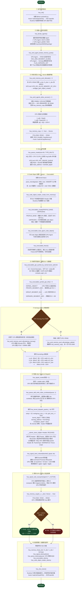

# HSA 向量加法程序流程图

对应源码：`experiments/hsa_vector_add/hsa_vector_add.cpp`

```mermaid
flowchart TD

    START([程序启动]) --> INIT_NODE

    subgraph SG_INIT ["① 运行时初始化"]
        INIT_NODE["hsa_init()<br/>────────────────────────────────<br/>加载 libhsa-runtime64.so<br/>thunk: hsaKmtOpenKFD() → 打开 /dev/kfd<br/>Runtime 内部枚举系统 GPU 拓扑节点"]
    end

    INIT_NODE --> AGENT_NODE

    subgraph SG_DISCOVER ["② 设备 & 内存池发现"]
        AGENT_NODE["hsa_iterate_agents()<br/>────────────────────────────────<br/>遍历系统所有处理器 Agent<br/>✔ CPU Agent: Intel i5-14600<br/>✔ GPU Agent: gfx906 / MI50<br/>底层读取 /sys/class/kfd/kfd/topology/"]
        POOL_NODE["hsa_amd_agent_iterate_memory_pools()<br/>────────────────────────────────<br/>GPU Agent → VRAM 全局内存池 HSA_AMD_SEGMENT_GLOBAL<br/>CPU Agent → Kernarg 细粒度内存池 FLAG_KERNARG_INIT<br/>每个 Pool 有独立的分配器和访问权限"]
        AGENT_NODE --> POOL_NODE
    end

    POOL_NODE --> ALLOC_NODE

    subgraph SG_MEM ["③ 内存分配 & Host→Device 数据传输"]
        ALLOC_NODE["hsa_amd_memory_pool_allocate() × 3<br/>────────────────────────────────<br/>在 GPU VRAM 分配: a_dev / b_dev / c_dev 各 4096 B<br/>KFD ioctl: KFD_IOC_ALLOC_MEMORY_OF_GPU<br/>→ amdgpu_gem_object_create()"]
        ACCESS_NODE["hsa_amd_agents_allow_access() × 3<br/>────────────────────────────────<br/>建立 IOMMU / GPUVM 页表映射<br/>授权 CPU ↔ GPU 双向访问同一块 VRAM<br/>否则 hsa_memory_copy 会权限报错"]
        INIT_DATA["CPU 初始化主机数组<br/>────────────────────────────────<br/>h_a[i] = float(i)<br/>h_b[i] = float(1024 - i)<br/>期望结果: a[i] + b[i] = 1024.0"]
        COPY_H2D["hsa_memory_copy × 2  Host → Device<br/>────────────────────────────────<br/>PCIe DMA: DRAM → VRAM<br/>底层: ROCr DmaBlit::CopyMemory()<br/>→ thunk: hsaKmtCopyMemory()"]
        ALLOC_NODE --> ACCESS_NODE --> INIT_DATA --> COPY_H2D
    end

    COPY_H2D --> QUEUE_NODE

    subgraph SG_QUEUE ["④ AQL 队列创建"]
        QUEUE_NODE["hsa_queue_create(size=64, TYPE_MULTI)<br/>────────────────────────────────<br/>AQL 队列 = CPU 与 GPU 之间的 ring buffer 命令通道<br/>KFD ioctl: KFD_IOC_CREATE_QUEUE<br/>分配 MQD + doorbell 寄存器内存映射<br/>返回: base_address + doorbell_signal"]
    end

    QUEUE_NODE --> READ_FILE

    subgraph SG_LOAD ["⑤ Code Object 加载（.hsaco → Executable）"]
        READ_FILE["读取 kernel.hsaco<br/>────────────────────────────────<br/>posix_memalign(buf, 4096, size)  4096对齐: ELF映射要求<br/>含: .text 机器码 / .rodata KD / .note YAML 元数据"]
        READER_NODE["hsa_code_object_reader_create_from_memory()<br/>────────────────────────────────<br/>将 ELF 内存缓冲包装为 Reader 对象<br/>Runtime 内部解析 ELF 段表"]
        EXE_CREATE["hsa_executable_create(PROFILE_BASE, UNFROZEN)<br/>────────────────────────────────<br/>PROFILE_BASE = 离散 GPU 模式，区别于 APU 的 FULL<br/>UNFROZEN = 允许继续加载 code object<br/>类比: 创建一个待链接的进程映像"]
        EXE_LOAD["hsa_executable_load_agent_code_object()<br/>────────────────────────────────<br/>将 Code Object 绑定到目标 GPU Agent<br/>可多次调用以支持多 GPU"]
        EXE_FREEZE["hsa_executable_freeze()<br/>────────────────────────────────<br/>完成符号解析 & 重定位，类比 ld.so 链接步骤<br/>Freeze 后不可再修改，可并发读取"]
        READ_FILE --> READER_NODE --> EXE_CREATE --> EXE_LOAD --> EXE_FREEZE
    end

    EXE_FREEZE --> SYM_NODE

    subgraph SG_SYM ["⑥ 内核符号查询（读取 ELF 元数据）"]
        SYM_NODE["hsa_executable_get_symbol_by_name('vector_add.kd')<br/>────────────────────────────────<br/>.kd = Kernel Descriptor，位于 ELF .rodata 段<br/>含: 代码入口偏移 / VGPR-SGPR 数量 / compute_pgm_rsrc"]
        META_NODE["hsa_executable_symbol_get_info() × 4<br/>────────────────────────────────<br/>KERNEL_OBJECT        → GPU 代码入口虚拟地址<br/>PRIVATE_SEGMENT_SIZE → 每线程 spill 大小 = 0<br/>GROUP_SEGMENT_SIZE   → LDS 共享内存大小 = 0<br/>KERNARG_SEGMENT_SIZE → 参数区大小 = 88 B"]
        SYM_NODE --> META_NODE
    end

    META_NODE --> KARG_DECISION

    subgraph SG_KARG ["⑦ Kernarg 分配 & 参数填写"]
        KARG_DECISION{CPU Kernarg Pool 可用?}
        KARG_CPU["分配于 CPU 细粒度系统内存  本机走此路径<br/>────────────────────────────────<br/>hsa_amd_memory_pool_allocate(cpu_kernarg)<br/>CPU 直接 memcpy 写入，零拷贝<br/>GPU 通过 PCIe + IOMMU 读取"]
        KARG_GPU["降级: 分配于 GPU VRAM<br/>────────────────────────────────<br/>hsa_amd_memory_pool_allocate(gpu_global)<br/>需额外 hsa_memory_copy，多一次 PCIe DMA"]
        KARG_FILL["填写 KernelArgs 结构体<br/>────────────────────────────────<br/>a_ptr  offset 0  8B = GPU vaddr of a_dev<br/>b_ptr  offset 8  8B = GPU vaddr of b_dev<br/>c_ptr  offset 16 8B = GPU vaddr of c_dev<br/>n      offset 24 4B = 1024"]
        KARG_DECISION -->|是| KARG_CPU --> KARG_FILL
        KARG_DECISION -->|否| KARG_GPU --> KARG_FILL
    end

    KARG_FILL --> SIGNAL_NODE

    subgraph SG_DISPATCH ["⑧ 构造 AQL Packet & Dispatch"]
        SIGNAL_NODE["hsa_signal_create(初值 = 1)<br/>────────────────────────────────<br/>信号 = volatile int64_t 原语<br/>GPU 执行完内核后自动将其从 1 原子递减为 0"]
        WRITE_IDX["hsa_queue_add_write_index_screlease(queue, 1)<br/>────────────────────────────────<br/>原子递增写指针，返回独占槽位 idx<br/>screlease: 保证 packet 写入在 idx 更新前对 GPU 可见"]
        FILL_PKT["填写 hsa_kernel_dispatch_packet_t  64 字节<br/>────────────────────────────────<br/>setup = 1D, workgroup_size_x = 64, grid_size_x = 1024<br/>kernel_object = 代码入口地址<br/>kernarg_address = KernelArgs,  completion_signal = done<br/>先 memset 清零，header 字段最后写"]
        ATOMIC_HDR["__atomic_store_n(&pkt->header, RELEASE)<br/>────────────────────────────────<br/>原子写 Header = 激活 Packet，使其对 GPU 可见<br/>RELEASE: 保证所有字段写完后才激活<br/>必须最后写！防止 GPU 读到半成品 packet<br/>Header 含: PacketType / BARRIER bit / Fence scope"]
        DOORBELL["hsa_signal_store_relaxed(doorbell_signal, idx)<br/>────────────────────────────────<br/>敲响 Doorbell 寄存器<br/>通知 Command Processor 取 packet<br/>GPU 调度: 16 wavefront × 64 lane = 1024 线程<br/>每线程执行: c[gid] = a[gid] + b[gid]"]
        SIGNAL_NODE --> WRITE_IDX --> FILL_PKT --> ATOMIC_HDR --> DOORBELL
    end

    DOORBELL --> WAIT_NODE

    subgraph SG_WAIT ["⑨ 等待 GPU 完成 & 验证结果"]
        WAIT_NODE["hsa_signal_wait_scacquire(signal LT 1, ACTIVE)<br/>────────────────────────────────<br/>CPU 自旋等待信号值从 1 降为 0<br/>scacquire: 建立 happens-before，保证 CPU 看到 GPU 所有写操作"]
        COPY_D2H["hsa_memory_copy(h_c, c_dev)  Device → Host<br/>────────────────────────────────<br/>PCIe DMA: VRAM → DRAM<br/>GPU 计算结果回传至 Host 缓冲"]
        VERIFY{"c[i] == 1024.0<br/>对所有 i?"}
        PASS(["✔ PASS  1024 个元素全部正确<br/>c[i] = i + 1024 - i = 1024"])
        FAIL(["✘ FAIL  打印错误元素索引与实际值"])
        WAIT_NODE --> COPY_D2H --> VERIFY
        VERIFY -->|Yes| PASS
        VERIFY -->|No| FAIL
    end

    PASS --> CLEAN_NODE
    FAIL --> CLEAN_NODE

    subgraph SG_CLEAN ["⑩ 资源清理（创建的逆序）"]
        CLEAN_NODE["释放所有 HSA 对象<br/>────────────────────────────────<br/>hsa_memory_free(a_dev / b_dev / c_dev / kernarg)<br/>hsa_signal_destroy(done)<br/>hsa_queue_destroy(queue)  KFD 销毁 MQD<br/>hsa_executable_destroy  hsa_code_object_reader_destroy"]
        SHUTDOWN["hsa_shut_down()<br/>────────────────────────────────<br/>Runtime 引用计数递减至 0，析构所有内部对象<br/>thunk: hsaKmtCloseKFD() → 关闭 /dev/kfd"]
        CLEAN_NODE --> SHUTDOWN
    end

    SHUTDOWN --> END([程序结束])

    classDef decision fill:#5c3317,stroke:#e08030,color:#fde8cc
    classDef terminal fill:#1a4a2e,stroke:#4caf78,color:#d4f5e2
    classDef failNode fill:#5c1a1a,stroke:#e05050,color:#fde8e8

    class KARG_DECISION,VERIFY decision
    class START,END,PASS terminal
    class FAIL failNode
```
