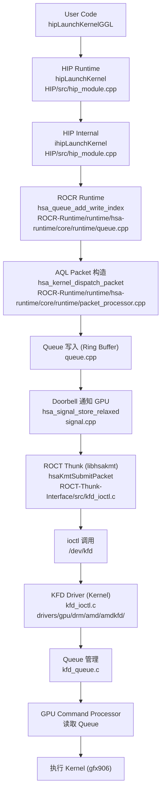
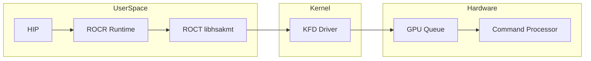
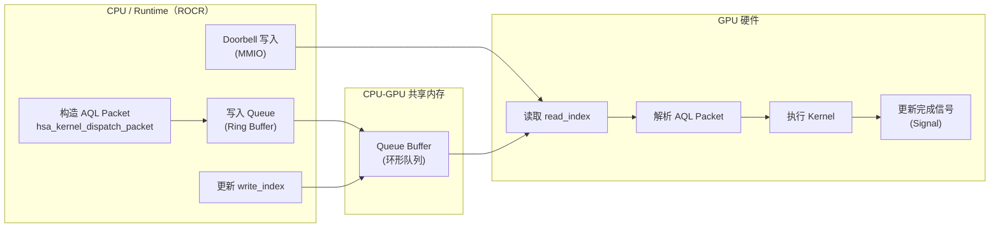
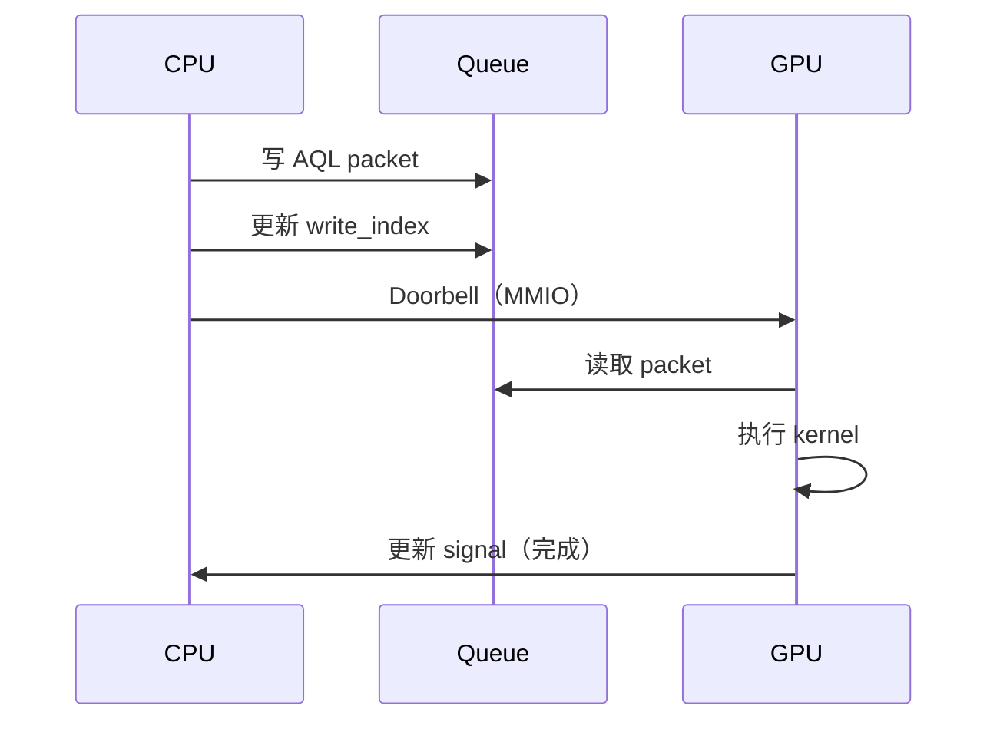

绘画和# ROCm环境搭建过程

> 记录ROCm环境搭建过程，加速以后再次搭建。

---

## 1. ROCm 5.6 源码获取

```bash
mkdir ~/rocm-5.6 && cd ~/rocm-5.6

git clone -b rocm-5.6.0 https://github.com/ROCm/llvm-project.git
git clone -b rocm-5.6.0 https://github.com/RadeonOpenCompute/rocm-device-libs.git
git clone -b rocm-5.6.0 https://github.com/ROCm/ROCR-Runtime.git
git clone -b rocm-5.6.0 https://github.com/ROCm/HIP.git
git clone -b rocm-5.6.0 https://github.com/ROCm/hipamd.git
git clone -b rocm-5.6.0 https://github.com/ROCm/rocminfo.git


git clone -b rocm-5.6.0 https://github.com/ROCm/ROCT-Thunk-Interface.git
git clone -b rocm-5.6.0 https://github.com/RadeonOpenCompute/ROCm-OpenCL-Runtime.git
git clone -b rocm-5.6.0 https://github.com/ROCm/rocclr.git
```

---

## 2. 构建LLVM

```bash
cd llvm-project
mkdir build && cd build

cmake -G Ninja \
  -DCMAKE_BUILD_TYPE=Release \
  -DLLVM_ENABLE_PROJECTS="clang;lld" \
  -DLLVM_TARGETS_TO_BUILD="AMDGPU;X86" \
  -DAMDGPU_TARGETS="gfx906" \
  -DLLVM_ENABLE_RUNTIMES="libcxx;libcxxabi;compiler-rt" \
  -DCOMPILER_RT_BUILD_CRT=ON \
  -DCOMPILER_RT_BUILD_LIBFUZZER=OFF \
  -DCOMPILER_RT_BUILD_SANITIZERS=OFF \
  -DCOMPILER_RT_BUILD_XRAY=OFF \
  -DCMAKE_INSTALL_PREFIX=/opt/rocm-5.6 \
  ../llvm

ninja -j$(nproc)
sudo ninja install
```

注意不要启用

```
-DLLVM_ENABLE_RUNTIMES="openmp"
```

---

## 3. 构建 rocm-device-libs

```bash
cd rocm-device-libs
mkdir build && cd build

cmake -G Ninja \
  -DCMAKE_BUILD_TYPE=Release \
  -DCMAKE_INSTALL_PREFIX=/opt/rocm-5.6 \
  -DLLVM_DIR=/opt/rocm-5.6/lib/cmake/llvm \
  ..

ninja -j$(nproc)
sudo ninja install
```

---

## 4. 构建 ROCT-Thunk-Interface（libhsakmt）

```bash
cd ~/rocm-5.6/ROCT-Thunk-Interface
mkdir build && cd build

cmake -G Ninja \
  -DCMAKE_BUILD_TYPE=Debug \
  -DCMAKE_INSTALL_PREFIX=/opt/rocm-5.6 \
  .. 
ninja
sudo ninja install 
```

---

## 5. 构建 ROCR Runtime

```bash
cd ~/rocm-5.6/ROCR-Runtime/src
mkdir build && cd build

cmake -G Ninja \
  -DCMAKE_BUILD_TYPE=Debug \
  -DCMAKE_INSTALL_PREFIX=/opt/rocm-5.6 \
  -DLLVM_DIR=/opt/rocm-5.6/lib/cmake/llvm \
  -DClang_DIR=/opt/rocm-5.6/lib/cmake/clang \
  ..

ninja
sudo ninja install
```

---

## 6. 拉取并编译 `ROCm-CompilerSupport` (comgr)

```bash
cd ~/rocm-5.6
git clone -b rocm-5.6.0 https://github.com/RadeonOpenCompute/ROCm-CompilerSupport.git
cd ROCm-CompilerSupport/lib/comgr
mkdir build && cd build

# 必须指向你编译的 llvm 路径
cmake -G Ninja \
  -DCMAKE_BUILD_TYPE=Release \
  -DCMAKE_INSTALL_PREFIX=/opt/rocm-5.6 \
  -DLLVM_DIR=/opt/rocm-5.6/lib/cmake/llvm \
  -DClang_DIR=/opt/rocm-5.6/lib/cmake/clang \
  -DCMAKE_PREFIX_PATH=/opt/rocm-5.6 \
  ..

ninja
sudo ninja install
```

---

## 7. 构建 rocclr

```bash
cd ~/rocm-5.6/rocclr
mkdir build &&cd build

cmake -G Ninja \
  -DCMAKE_BUILD_TYPE=Release \
  -DCMAKE_INSTALL_PREFIX=/opt/rocm-5.6 \
  -DCMAKE_PREFIX_PATH=/opt/rocm-5.6 \
  -DROCM_PATH=/opt/rocm-5.6 \
  -DHSA_PATH=/opt/rocm-5.6 \
  -DOPENCL_DIR=/home/wangyancheng/rocm-5.6/ROCm-OpenCL-Runtime \
  ..

ninja
```

## 8. 构建hipamd

```bash
cd ~/rocm-5.6/hipamd/build
mkdir build && cd build

cmake -G Ninja \
  -DCMAKE_BUILD_TYPE=Release \
  -DCMAKE_INSTALL_PREFIX=/opt/rocm-5.6 \
  -DHIP_PLATFORM=amd \
  -DHIP_COMPILER=clang \
  -DCMAKE_C_COMPILER=/opt/rocm-5.6/bin/clang \
  -DCMAKE_CXX_COMPILER=/opt/rocm-5.6/bin/clang++ \
  -DHIP_COMMON_DIR=/home/wangyancheng/rocm-5.6/HIP \
  -DROCCLR_PATH=/home/wangyancheng/rocm-5.6/rocclr \
  -DROCCLR_BUILD_DIR=/home/wangyancheng/rocm-5.6/rocclr/build \
  -DAMD_COMGR_DIR=/opt/rocm-5.6 \
  -DGPU_TARGETS=gfx906 \
  -DBUILD_HIPCC=ON \
  ..

ninja
sudo ninja install
```

---

## 9. 拉取并构建hipcc

```bash
cd ~/rocm-5.6
# 拉取 5.6.0 对应的 hipcc 源码
git clone -b rocm-5.6.0 https://github.com/ROCm/hipcc.git

cd hipcc
mkdir build && cd build

# 构建 hipcc 二进制工具
cmake -G Ninja \
  -DCMAKE_INSTALL_PREFIX=/opt/rocm-5.6 \
  -DCMAKE_PREFIX_PATH=/opt/rocm-5.6 \
  ..

ninja
sudo ninja install
```

---

## 10. 构建rocminfo

```bash
cd ~/rocm-5.6
# 如果之前没拉取过 rocminfo
git clone -b rocm-5.6.0 https://github.com/RadeonOpenCompute/rocminfo.git

cd rocminfo
mkdir -p build && cd build

cmake -G Ninja \
  -DCMAKE_INSTALL_PREFIX=/opt/rocm-5.6 \
  -DCMAKE_PREFIX_PATH=/opt/rocm-5.6 \
  ..

ninja
sudo ninja install
```

## 11. 环境变量

```bash
# ROCm 5.6 Manual Build Paths
export ROCM_PATH=/opt/rocm-5.6
export HIP_PATH=/opt/rocm-5.6
export PATH=$ROCM_PATH/bin:$PATH
export LD_LIBRARY_PATH=$ROCM_PATH/lib:$LD_LIBRARY_PATH
export HIP_CLANG_PATH=$ROCM_PATH/bin
export DEVICE_LIB_PATH=$ROCM_PATH/amdgcn/bitcode
```

验证

```bash
rocminfo | grep gfx
```

---

## 12. KFD 的源码

```bash
apt source linux-image-$(uname -r)
cd linux-*/drivers/gpu/drm/amd/amdkfd/
```

---

## 13. 验证

```cpp
#include <hip/hip_runtime.h>
#include <iostream>

__global__ void vector_add(int* a, int* b, int* c, int n) {
    int idx = blockIdx.x * blockDim.x + threadIdx.x;
    if (idx < n) {
        c[idx] = a[idx] + b[idx];
    }
}

int main() {
    const int N = 16;
    int a[N], b[N], c[N];

    for (int i = 0; i < N; i++) {
        a[i] = i;
        b[i] = i * 2;
    }

    int *d_a, *d_b, *d_c;

    hipMalloc(&d_a, N * sizeof(int));
    hipMalloc(&d_b, N * sizeof(int));
    hipMalloc(&d_c, N * sizeof(int));

    hipMemcpy(d_a, a, N * sizeof(int), hipMemcpyHostToDevice);
    hipMemcpy(d_b, b, N * sizeof(int), hipMemcpyHostToDevice);

    hipLaunchKernelGGL(vector_add, dim3(1), dim3(16), 0, 0, d_a, d_b, d_c, N);

    hipMemcpy(c, d_c, N * sizeof(int), hipMemcpyDeviceToHost);

    for (int i = 0; i < N; i++) {
        std::cout << a[i] << " + " << b[i] << " = " << c[i] << std::endl;
    }

    hipFree(d_a);
    hipFree(d_b);
    hipFree(d_c);

    return 0;
}
```

编译运行

```bash
# 编译
/opt/rocm-5.6/bin/hipcc vector_add.cpp -o vector_add

# 运行 (确保 LD_LIBRARY_PATH 已设置)
./vector_add
```

## 14. 调试

### 14.1 查看HIP运行信息

```bash
export HIP_TRACE_API=1
export AMD_LOG_LEVEL=3
export HIP_TRACE_API_VERBOSE=1
./vector_add
```

---

### 14.2 使用 ROCm 调试工具

构建ROCgdb

```bash
git clone -b rocm-5.6.0 https://github.com/ROCm-Developer-Tools/ROCgdb.git
cd ROCgdb
# 建议在源码外构建，但不用 CMake
mkdir -p build && cd build

# 运行 configure 脚本
# 注意：ROCgdb 需要开启一些特定的开关来支持 GPU 调试
../configure \
  --program-prefix=roc \
  --enable-64-bit-bfd \
  --with-python=python3 \
  --with-rocm-dbgapi=/opt/rocm-5.6 \
  --prefix=/opt/rocm-5.6

# 使用 make 编译（由于它是老牌项目，不支持 Ninja）
make -j$(nproc)
vim ROCR-Runtime/src/core/runtime/amd_aql_queue.cpp
```

使用：

```bash
rocgdb ./vector_add
```

然后：

```bash
gdb
break vector_add  
run
```

👉 可以断点进入 GPU kernel（部分支持）

---

### 14.3 用环境变量查看底层行为

```bash
export HSA_ENABLE_SDMA=0  
export HSA_TOOLS_LIB=1  
export AMD_LOG_LEVEL=3  
./vector_add
```

👉 会看到更底层的：

- HSA runtime
- kernel dispatch
- 内存管理

---

### 14.4 查看编译生成的 LLVM IR

```bash
/opt/rocm-5.6/bin/hipcc -S -emit-llvm vector_add.cpp
```

---

### 14.5 查看 GPU ISA

```bash
/opt/rocm-5.6/bin/hipcc -S vector_add.cpp
```

然后找：

```
.s
```

---

### 14.6 查看 kernel binary

```bash
objdump -d vector_add
```

kernel.cl代码

```c
__kernel void my_kernel(__global int* out) {
    // 0x7ea = 2026
    out[0] = 2026;
    // 硬件级同步：确保数据刷出 L2 缓存
    __builtin_amdgcn_s_waitcnt(0);
}
```

aql_run.cpp

```cpp
#include <hsa/hsa.h>
#include <hsa/hsa_ext_amd.h>
#include <iostream>
#include <fstream>
#include <cstring>
#include <malloc.h>
#include <atomic>

#define CHECK(x) if ((x) != HSA_STATUS_SUCCESS) { \
    const char* err; hsa_status_string(x, &err); \
    std::cout << "HSA Error at line " << __LINE__ << ": " << err << std::endl; \
    exit(1); }

hsa_agent_t gpu_agent;
hsa_amd_memory_pool_t global_pool; // VRAM 显存池

hsa_status_t find_gpu(hsa_agent_t agent, void*) {
    hsa_device_type_t type;
    hsa_agent_get_info(agent, HSA_AGENT_INFO_DEVICE, &type);
    if (type == HSA_DEVICE_TYPE_GPU) gpu_agent = agent;
    return HSA_STATUS_SUCCESS;
}

hsa_status_t find_pool(hsa_amd_memory_pool_t pool, void*) {
    hsa_amd_segment_t segment;
    hsa_amd_memory_pool_get_info(pool, HSA_AMD_MEMORY_POOL_INFO_SEGMENT, &segment);
    if (segment == HSA_AMD_SEGMENT_GLOBAL) {
        global_pool = pool;
    }
    return HSA_STATUS_SUCCESS;
}

int main() {
    CHECK(hsa_init());
    CHECK(hsa_iterate_agents(find_gpu, nullptr));
    CHECK(hsa_amd_agent_iterate_memory_pools(gpu_agent, find_pool, nullptr));

    hsa_queue_t* queue;
    CHECK(hsa_queue_create(gpu_agent, 64, HSA_QUEUE_TYPE_SINGLE, nullptr, nullptr, UINT32_MAX, UINT32_MAX, &queue));

    hsa_signal_t signal;
    CHECK(hsa_signal_create(1, 0, nullptr, &signal));

    // 1. 加载 Code Object (需 4096 对齐)
    std::ifstream f("kernel.hsaco", std::ios::binary | std::ios::ate);
    size_t size = f.tellg();
    f.seekg(0);
    void* code_buf;
    posix_memalign(&code_buf, 4096, size);
    f.read((char*)code_buf, size);
    f.close();

    hsa_code_object_reader_t reader;
    CHECK(hsa_code_object_reader_create_from_memory(code_buf, size, &reader));

    hsa_executable_t exe;
    CHECK(hsa_executable_create(HSA_PROFILE_BASE, HSA_EXECUTABLE_STATE_UNFROZEN, nullptr, &exe));
    CHECK(hsa_executable_load_agent_code_object(exe, gpu_agent, reader, nullptr, nullptr));
    CHECK(hsa_executable_freeze(exe, nullptr));

    hsa_executable_symbol_t symbol;
    CHECK(hsa_executable_get_symbol_by_name(exe, "my_kernel.kd", &gpu_agent, &symbol));

    uint64_t kernel_object;
    CHECK(hsa_executable_symbol_get_info(symbol, HSA_EXECUTABLE_SYMBOL_INFO_KERNEL_OBJECT, &kernel_object));

    // 2. 分配输出地址 (out)
    int* out_gpu;
    CHECK(hsa_amd_memory_pool_allocate(global_pool, sizeof(int), 0, (void**)&out_gpu));
    CHECK(hsa_amd_agents_allow_access(1, &gpu_agent, nullptr, out_gpu));

    // 3. 分配参数段 (kernarg) - 关键修复点！
    // 必须分配在 GPU 可访问的内存池中
    void* kernarg_gpu;
    CHECK(hsa_amd_memory_pool_allocate(global_pool, 64, 0, &kernarg_gpu));
    CHECK(hsa_amd_agents_allow_access(1, &gpu_agent, nullptr, kernarg_gpu));

    // 在 Host 侧准备数据，然后拷贝过去
    uint64_t host_args = (uint64_t)out_gpu;
    CHECK(hsa_memory_copy(kernarg_gpu, &host_args, sizeof(uint64_t)));

    // 4. 写 AQL Packet
    uint64_t index = hsa_queue_add_write_index_relaxed(queue, 1);
    hsa_kernel_dispatch_packet_t* pkt = &((hsa_kernel_dispatch_packet_t*)queue->base_address)[index % queue->size];

    memset(pkt, 0, sizeof(*pkt));
    pkt->setup = 1 << HSA_KERNEL_DISPATCH_PACKET_SETUP_DIMENSIONS;
    pkt->workgroup_size_x = 1; pkt->workgroup_size_y = 1; pkt->workgroup_size_z = 1;
    pkt->grid_size_x = 1;      pkt->grid_size_y = 1;      pkt->grid_size_z = 1;
    pkt->kernel_object = kernel_object;
    pkt->kernarg_address = kernarg_gpu; // 指向 GPU 可视的参数地址
    pkt->completion_signal = signal;

    // 原子写入 Header 激活任务
    uint16_t header = (HSA_PACKET_TYPE_KERNEL_DISPATCH << HSA_PACKET_HEADER_TYPE) |
                     (HSA_FENCE_SCOPE_SYSTEM << HSA_PACKET_HEADER_ACQUIRE_FENCE_SCOPE) |
                     (HSA_FENCE_SCOPE_SYSTEM << HSA_PACKET_HEADER_RELEASE_FENCE_SCOPE);
    __atomic_store_n(&(pkt->header), header, 3); // __ATOMIC_RELEASE

    // 5. 敲门并等待结果
    hsa_signal_store_release(queue->doorbell_signal, index);
    while (hsa_signal_wait_acquire(signal, HSA_SIGNAL_CONDITION_LT, 1, UINT64_MAX, HSA_WAIT_STATE_ACTIVE) != 0);

    // 将结果拷回 CPU 打印
    int result = 0;
    CHECK(hsa_memory_copy(&result, out_gpu, sizeof(int)));
    std::cout << "MI50 Success! GPU wrote: " << result << std::endl;

    hsa_signal_destroy(signal);
    hsa_queue_destroy(queue);
    hsa_executable_destroy(exe);
    hsa_code_object_reader_destroy(reader);
    hsa_shut_down();
    return 0;
}
```

编译运行

```bash
#!/bin/bash
set -e

# 1. 编译 Kernel (确保针对 gfx906)
/opt/rocm-5.6/bin/clang -target amdgcn-amd-amdhsa -mcpu=gfx906 -mcode-object-version=4 \
    -fPIC -shared kernel.cl -o kernel.hsaco

# 2. 强制修正二进制 Flags (从 Wave32 修正为 Wave64)
python3 -c "
import struct
with open('kernel.hsaco', 'r+b') as f:
    f.seek(48)
    f.write(struct.pack('<I', 0x02F))
"
echo "ELF Flags patched to 0x02F."

# 3. 编译 Host
g++ aql_run.cpp -o aql_run -I/opt/rocm-5.6/include -L/opt/rocm-5.6/lib -lhsa-runtime64

# 4. 运行 (加载 ROCm 库)
export LD_LIBRARY_PATH=/opt/rocm-5.6/lib:$LD_LIBRARY_PATH
./aql_run
```

---

## 15. sql代码

## 附录1 研究重点# 编译

/opt/rocm-5.6/bin/hipcc --offload-arch=gfx906 vector_add.cpp -o vector_add_mi50

# 运行 (确保 LD_LIBRARY_PATH 已设置)

./vector_add_mi50

### KFD（Kernel Driver）——最关键

路径：

```
/drivers/gpu/drm/amd/amdkfd/
```

这里面是：

- queue 创建（核心）
- 用户态 → GPU 提交路径
- 内存映射（HMM / VRAM）
- doorbell 机制
- 调度（很 primitive）

### ROCR Runtime（用户态核心）

核心内容：

- HSA queue 抽象
- AQL packet（GPU任务描述）
- memory region 管理
- signal（同步机制）

关键文件

```
runtime/hsa-runtime/core/runtime/queue.cpp
runtime/hsa-runtime/core/runtime/packet_processor.cpp
```

### HIP（API层）

👉 其实它只是：

> **CUDA → HSA 的翻译层**

---

## 附录2 关键机制

### AQL Packet（最重要）

GPU执行的不是“kernel”，而是：

👉 **packet（任务描述符）**

结构：

struct hsa_kernel_dispatch_packet

包含：

- kernel object
- grid size
- workgroup size
- kernarg 地址

👉 你可以理解为：

> CUDA kernel launch → AQL packet → GPU执行

---

### Queue（核心中的核心）

每个进程：

- 有一个或多个 queue
- 本质是：  
  👉 **ring buffer**

流程：

CPU写packet → 写doorbell → GPU取执行

👉 重点机制：

- lock-free
- 用户态直接写 GPU 队列

---

### Doorbell（非常关键）

👉 CPU 通知 GPU：

“我写完任务了，你可以干活了”

实现：

- MMIO 写寄存器
- 每个 queue 一个 doorbell

👉 这就是：

> **用户态驱动 GPU 的关键桥梁**

---

### Memory Model（难点）

ROCm 用的是：

👉 HSA memory model

包括：

- fine-grained memory（CPU/GPU共享）
- coarse-grained（显存）

👉 重点：

- `hsa_signal`
- memory fence

---

## 附录3 研究路径（非常关键）

不要“从源码编译开始”，而是：

---

### Step 1：跑通系统（黑盒）

```bash
rocminfo  
hipcc sample.cpp
```

---

### Step 2：抓执行路径（核心）

用：

strace  
rocprof

看：

👉 kernel launch 到底调用了什么

---

### Step 3：直接打断点（关键）

```bash
gdb ./your_program
```

断在：

- `hipLaunchKernel`
- `hsa_queue_add_write_index`

---

### Step 4：看 KFD（最关键）

dmesg | grep kfd

- debugfs：

/sys/kernel/debug/kfd/

---

## 附录4 主要流程



---

结构抽象层



---

## 附录5 核心机制



---

时许图



---

**AQL Packet 在哪里生成？**

核心路径（你日志里其实已经出现了）：

```
hipLaunchKernel  
 ↓  
ROCclr (hip_module.cpp)  
 ↓  
devprogram.cpp  
 ↓  
rocvirtual.cpp   ⭐（关键）  
 ↓  
ROCR (hsa_queue_write)  
 ↓  
KFD → GPU
```

👉 **真正构造 AQL packet 的地方就在：**

```
ROCR-Runtime/src/core/runtime/amd_aql_queue.cpp
```

和：

```
ROCR-Runtime/src/core/runtime/amd_kernel_code.cpp
```

---

**AQL Packet**

```cpp
struct hsa_kernel_dispatch_packet {

    // ===============================
    // 1️⃣ 控制字段（执行语义）
    // ===============================
    uint16_t header;
    /*
    核心作用：
    - 指明 packet 类型（kernel / barrier / vendor）
    - 定义 memory fence（最关键）

    GPU行为：
    1. 判断 packet 类型（是否执行 kernel）
    2. 执行 memory fence（保证数据可见性）

    关键内容：
    - HSA_PACKET_TYPE_KERNEL_DISPATCH
    - acquire_fence_scope（GPU读前同步）
    - release_fence_scope（CPU写后同步）

    👉 本质：
    “这个packet是什么 + 执行前后如何保证内存一致性”
    */


    uint16_t setup;
    /*
    作用：
    - 指定维度（1D / 2D / 3D）

    GPU行为：
    - 决定如何展开 grid

    👉 本质：
    “线程空间的维度定义”
    */


    // ===============================
    // 2️⃣ 执行配置（线程结构）
    // ===============================
    uint16_t workgroup_size_x;
    uint16_t workgroup_size_y;
    uint16_t workgroup_size_z;
    /*
    对应 CUDA：
    - blockDim.x/y/z

    GPU行为：
    - 决定一个 workgroup 的线程数
    - 决定 wavefront 划分（AMD通常64线程）

    👉 本质：
    “线程块大小（调度基本单位）”
    */


    uint16_t reserved0;


    uint32_t grid_size_x;
    uint32_t grid_size_y;
    uint32_t grid_size_z;
    /*
    对应 CUDA：
    - gridDim * blockDim

    GPU行为：
    - 决定总共要执行多少线程

    👉 本质：
    “任务规模（总线程数）”
    */


    // ===============================
    // 3️⃣ 内存资源（运行环境）
    // ===============================
    uint32_t private_segment_size;
    /*
    每个线程私有内存（stack / spill）

    GPU行为：
    - 分配 VGPR spill / local memory

    👉 本质：
    “每个线程的私有内存大小”
    */


    uint32_t group_segment_size;
    /*
    对应 CUDA：
    - __shared__ memory

    GPU行为：
    - 分配 LDS（Local Data Share）

    👉 本质：
    “block级共享内存”
    */


    // ===============================
    // 4️⃣ 执行入口（最核心）
    // ===============================
    uint64_t kernel_object;
    /*
    最关键字段之一！！！

    指向：
    - GPU kernel binary（HSACO）

    GPU行为：
    - 设置 PC（程序计数器）
    - 从这里开始执行

    👉 本质：
    “GPU程序入口地址”
    */


    uint64_t kernarg_address;
    /*
    指向：
    - kernel 参数内存

    例如：
    kernel(a, b, c)

    实际：
    [a, b, c] → 写入内存 → 这个地址

    GPU行为：
    - 从该地址读取参数

    👉 本质：
    “kernel参数指针”
    */


    uint64_t reserved2;


    // ===============================
    // 5️⃣ 同步机制（执行完成）
    // ===============================
    uint64_t completion_signal;
    /*
    GPU执行完成后操作的信号

    GPU行为：
    - 执行完成 → signal减1

    CPU行为：
    - 可以 wait / poll

    👉 本质：
    “GPU → CPU 的完成通知机制”
    */
};
```

---

## 附录6. github

**初始化仓库**

```bash
# 1. 进入你的研究目录
cd ~/rocm-5.6/rocm-research

# 2. 初始化 Git 并关联你的主仓库
git init
git remote add origin https://github.com/你的用户名/rocm-research.git

# 3. 创建 .gitignore 避免上传垃圾文件
cat <<EOF > .gitignore
# 编译产物
*.o
*.hsaco
*.kd
bin/
build/
aql_run

# 系统/隐藏文件
.DS_Store
.vscode/
EOF
```

**添加子模块**

```bash
# 添加 ROCR-Runtime
git submodule add https://github.com/你的用户名/ROCR-Runtime.git ROCR-Runtime

# 添加 ROCT-Thunk-Interface
git submodule add https://github.com/你的用户名/ROCT-Thunk-Interface.git ROCT-Thunk-Interface
```

**提交并推送所有内容**

```bash
# 1. 添加所有文件（experiments, kfd, kfd_amdgpu, notes）
git add experiments kfd kfd_amdgpu notes .gitignore .gitmodules

# 2. 提交
git commit -m "Initial commit: MI50 research environment with submodules"

# 3. 推送到 GitHub
git push -u origin main
```

**统一更新脚本 (`pull_all.sh`)**

```bash
#!/bin/bash
git pull origin main
git submodule update --init --recursive --remote
```

**统一提交脚本 (`push_all.sh`)**

```bash
#!/bin/bash
# 1. 先处理子模块的改动
git submodule foreach 'git add . && git commit -m "update submodule" || true'

# 2. 再处理主项目的改动
git add .
git commit -m "Update research notes and experiments"

# 3. 推送（包含子模块内容）
git push --recurse-submodules=on-demand
```
