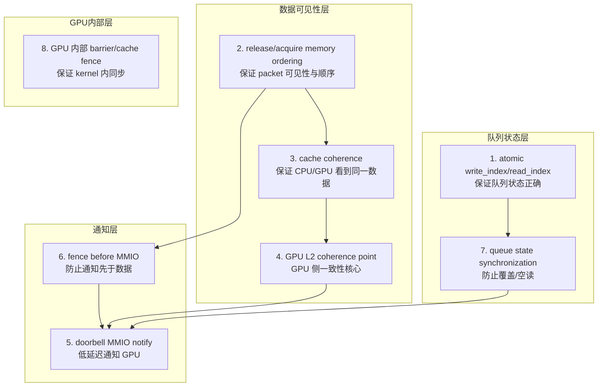
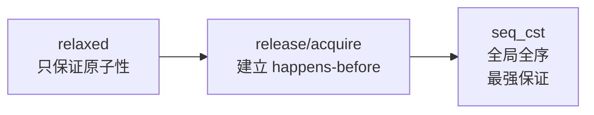
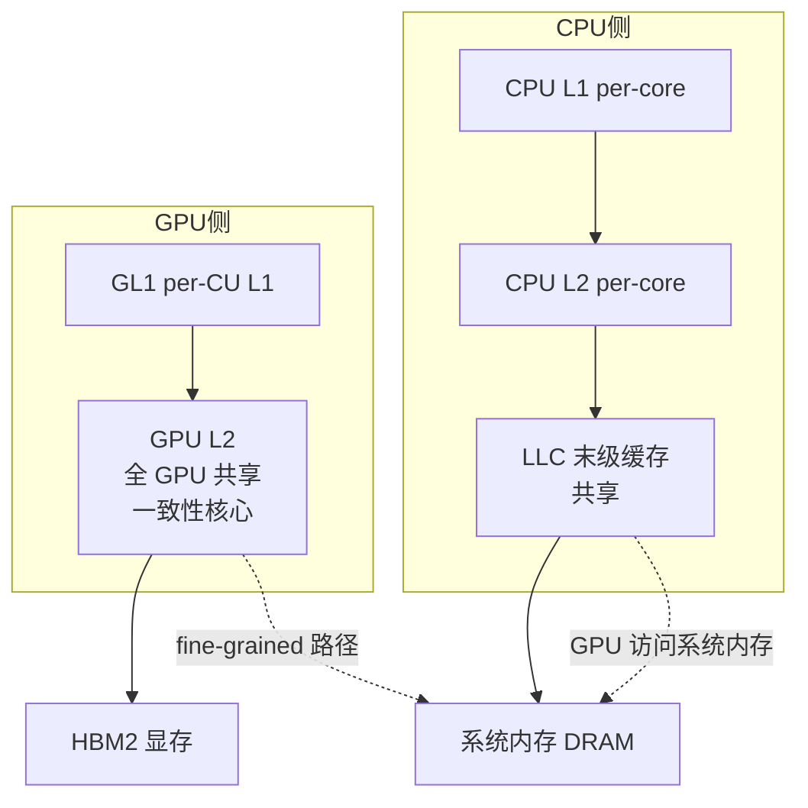
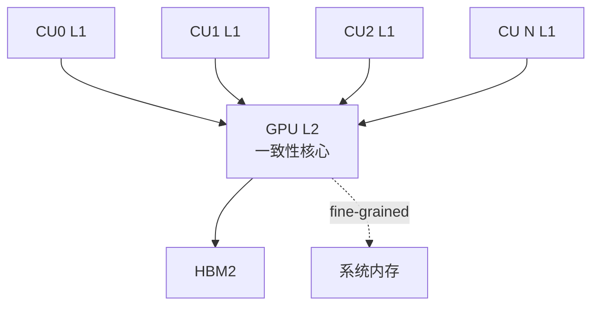
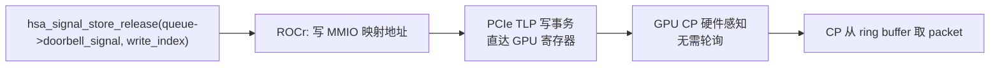
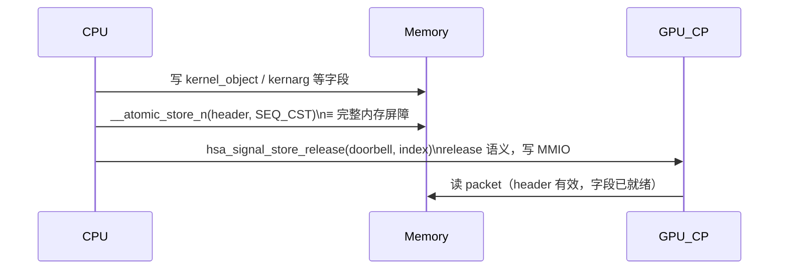
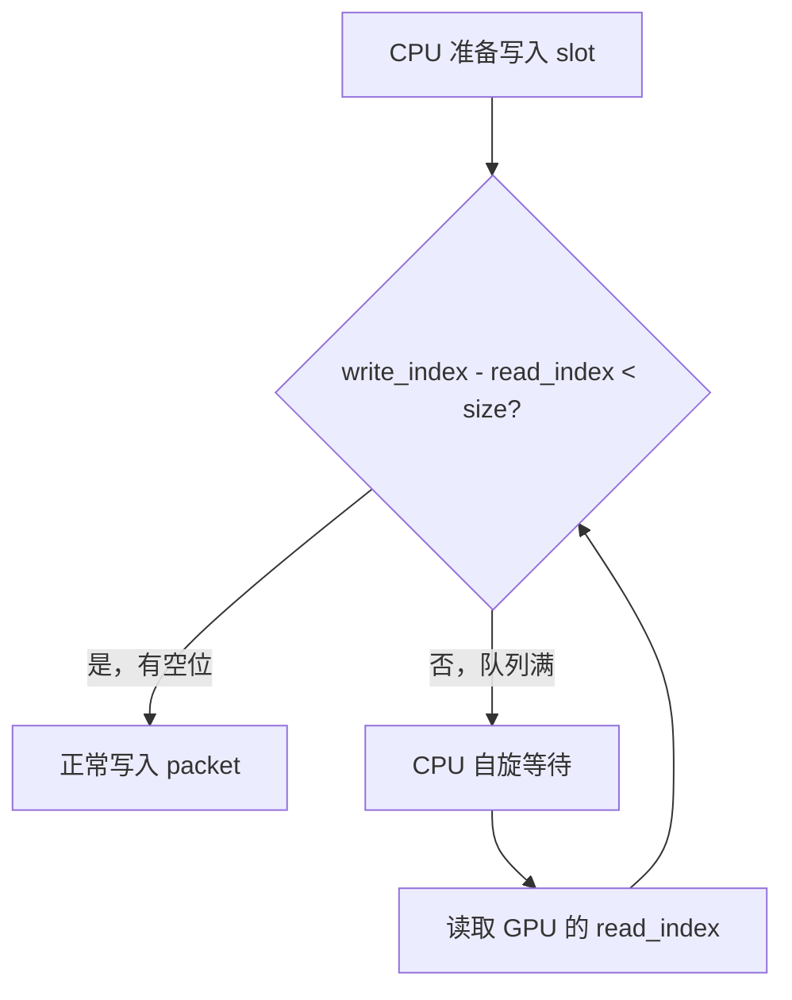
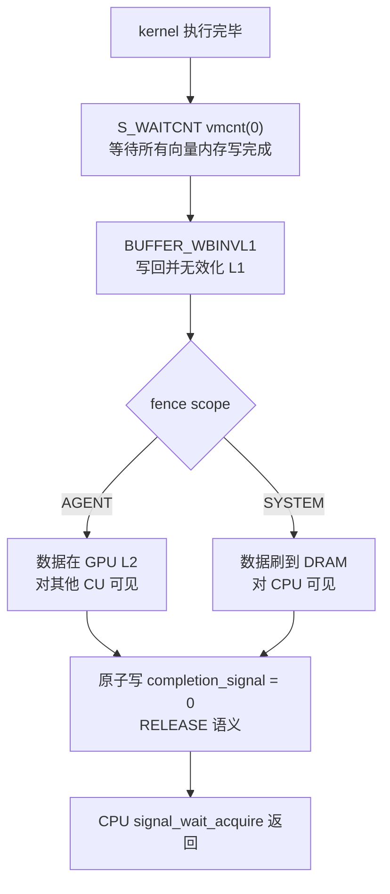

# HSA Queue 同步机制

> 硬件平台：AMD MI50 (gfx906 / Vega20)  
> 适用范围：ROCm 5.6 / HSA 1.1

---

## 总览：8个机制的层次关系



**依赖关系**：队列状态层保证"写到哪里"，数据可见性层保证"写的数据能被看到"，通知层保证"GPU 知道有新数据"，GPU 内部层保证"kernel 执行内部正确"。

---

## 机制 1：atomic write_index / read_index

### 职责

保证多个 CPU 线程同时提交 packet 时，每个线程拿到唯一的 slot，不会互相覆盖。

### 实现

```
write_index：CPU 维护，每次提交 packet 原子递增
read_index ：GPU 维护，每消费一个 packet 递增
```

```cpp
// ROCr 内部实现
uint64_t slot = __atomic_fetch_add(
    &queue->write_dispatch_id,
    1,
    __ATOMIC_RELAXED   // 只需原子性，不需要建立 happens-before
);
pkt = base_address[slot % queue->size];
```

用 **relaxed** 语义：这里只需要保证 fetch_add 本身不被打断，不需要约束其他内存操作的顺序。happens-before 由后续的 header release 写建立。

### 边界条件

```
write_index - read_index == 0     → 队列空，GPU 无事可做
write_index - read_index == size  → 队列满，CPU 必须等待
write_index - read_index < size   → 正常，可继续写入
```

write_index 和 read_index 是单调递增的 64 位整数，永不回绕，取模运算定位实际 slot：

```cpp
actual_slot = index % queue->size;
// size 为 2 的幂次时优化为：
actual_slot = index & (queue->size - 1);
```

---

## 机制 2：release / acquire memory ordering

### 职责

保证 CPU 写入 packet 的所有字段，在 GPU CP 读取 header 时已经全局可见。防止编译器或硬件重排导致 GPU 读到半初始化的 packet。

### 关键规则

**写方（CPU）必须最后写 header，且用 release 或 seq_cst 语义：**

```cpp
// 填写所有字段（顺序无要求）
pkt->kernel_object   = kernel_object;
pkt->kernarg_address = kernarg_gpu;
pkt->grid_size_x     = 1;
pkt->completion_signal = signal;
// ...

// 最后写 header，触发 GPU CP 消费
// SEQ_CST 保证：此写对所有观察者可见时，上面所有写也已可见
__atomic_store_n(&pkt->header, header, __ATOMIC_SEQ_CST);
```

**读方（GPU CP）用 acquire 语义读 header：**

GPU CP 硬件实现了对应的 acquire load，读到有效 header 后，packet 其他字段一定已经可见。

### 内存序层次



| 位置 | 内存序 | 原因 |
|------|--------|------|
| write_index 递增 | relaxed | 只需原子性 |
| packet 字段写入 | 普通写 | 被 header release 覆盖保证 |
| packet header 写入 | seq_cst | 激活 packet，需最强保证 |
| doorbell 写入 | release | 保证 packet 在通知前可见 |
| signal wait | acquire | 保证结果在 wait 返回后可见 |

---

## 机制 3：cache coherence

### 职责

CPU 和 GPU 各有独立的缓存层次，没有硬件 MESI 协议连接两者。必须通过软件机制保证双方看到同一份数据。

### MI50 的缓存拓扑



**关键**：CPU L2/LLC 和 GPU L2 之间没有硬件一致性协议，数据必须经过 DRAM 中转，或使用 fine-grained 内存绕过 GPU 缓存。

### 两种一致性路径

**fine-grained 内存**（signal value、doorbell）：
- GPU 访问时 bypass L1，直达 L2 再到 DRAM
- CPU 和 GPU 始终从 DRAM 读，天然一致
- 代价：GPU 访问延迟 ~700 cycle

**coarse-grained 内存**（VRAM 数据）：
- GPU 访问走正常 L1→L2 缓存路径
- GPU 写完后数据可能还在 L2，CPU 看不到
- 需要 release fence 显式刷出，或 `hsa_memory_copy` 走 SDMA

---

## 机制 4：GPU L2 coherence point

### 职责

GPU L2 是 GPU 侧所有缓存操作的一致性汇聚点，所有 GPU CU 的 L1 缓存都通过 L2 访问内存，L2 是 GPU 内部缓存一致性的核心。

### 为什么 L2 是核心



多个 CU 的 L1 缓存不互相通信，它们通过 L2 实现一致性：某个 CU 写入的数据，其他 CU 通过 L2 读取时能看到最新值。

### flat_atomic 指令绕过 L1

GPU kernel 对 fine-grained 内存（如 signal）的原子操作直接到 L2：

```
flat_atomic_swap  → bypass L1 → GPU L2 → DRAM
```

这保证了原子操作的全局可见性，不会被 L1 缓存隔离。

### release fence 的 L2 操作

kernel 结束时的 release fence 执行两步：

```
S_WAITCNT vmcnt(0)    → 等待所有向量内存写操作完成
BUFFER_WBINVL1        → 把 L1 的脏数据写回 L2（write-back）
                        并使 L1 失效（invalidate）
```

执行完后，kernel 写的所有数据都在 L2 中，对其他 CU 可见。若需要 CPU 看到，还需要 L2 → DRAM 的刷出（SYSTEM fence）。

---

## 机制 5：doorbell MMIO notify

### 职责

CPU 用最低延迟的方式通知 GPU CP 有新 packet 可以消费，避免 GPU CP 持续轮询 ring buffer 浪费功耗。

### 实现原理



**Doorbell 不是普通内存**，它是通过 `mmap` 映射的 GPU MMIO 寄存器：

```
KFD 创建 queue 时：
  ioctl(AMDKFD_IOC_CREATE_QUEUE) → 返回 doorbell_page_offset
  mmap(fd, doorbell_page_offset) → 映射到用户态地址空间

写这个地址 = 写 GPU 硬件寄存器 = 直接触发 CP
```

写入的值是 **write_index**，CP 读到后知道可以消费到哪个位置。

### 低延迟来源

普通 GPU 通知方式需要 CPU → 内核 → 驱动 → GPU，延迟数十微秒。

Doorbell 是用户态直写 MMIO，延迟约 1-3μs（PCIe 写延迟），无需 syscall。

---

## 机制 6：fence before MMIO（doorbell 前的内存屏障）

### 职责

防止 doorbell 写操作被处理器重排到 packet 写操作之前，导致 GPU CP 收到通知时 packet 数据还未就绪。

### 问题场景

```
// 处理器可能的重排（危险！）
hsa_signal_store(doorbell, index)   ← 被提前
pkt->kernel_object = kernel_object  ← 被推后
__atomic_store_n(&pkt->header, ...) ← 被推后

GPU CP 收到 doorbell → 读 packet → header 还是 INVALID → 等待或错误
```

### 解决：header 的 seq_cst 写充当屏障

```cpp
// header 的 seq_cst 写 = 完整内存屏障
// 保证：header 写之前的所有写操作，对所有观察者可见
__atomic_store_n(&pkt->header, header, __ATOMIC_SEQ_CST);

// doorbell 的 release 写
// 保证：doorbell 写之前（包括 header 写）的所有操作可见
hsa_signal_store_release(queue->doorbell_signal, index);
```

两层保护：
- seq_cst header 确保 packet 内容可见
- release doorbell 确保通知时 packet 已就绪



---

## 机制 7：queue state synchronization

### 职责

防止两种错误：
- **覆盖**：CPU 写入的 slot GPU 还没消费，被新 packet 覆盖
- **空读**：GPU 消费了超过 CPU 写入范围的 slot

### 队列满时的等待



ROCr 在 `AqlQueue` 里封装了这个等待逻辑，`hsa_queue_add_write_index` 在队列满时会阻塞。

### read_index 的可见性

GPU 更新 read_index 后，CPU 读到更新值需要正确的内存序：

```
GPU: read_index.store(new_val, RELEASE)
CPU: read_index.load(ACQUIRE)
```

这保证 CPU 看到 GPU 确实消费了 packet，不是假象。

### 双指针不回绕设计

write_index 和 read_index 是 64 位单调递增，不会在正常使用中溢出（写满 2^64 个 packet 需要数千年）。这简化了边界判断，不需要处理绕回时的比较歧义。

---

## 机制 8：GPU 内部 barrier / cache fence

### 职责

kernel 执行过程中，同一 workgroup 内的 wavefront 之间，以及 kernel 结束时向外部的同步。

### LDS barrier（workgroup 内）

```
// kernel 代码中
__syncthreads()   ← HIP/CUDA 写法
// 编译为 GCN 指令：
S_BARRIER         ← 等待 workgroup 内所有 wavefront 到达同一点
S_WAITCNT lgkmcnt(0) ← 等待所有 LDS 操作完成
```

**范围**：只在同一 workgroup 内有效，不同 workgroup 之间不能用 barrier 同步。

### kernel 结束时的 release fence



### 两种 fence scope 的硬件代价

| fence scope | 指令序列 | 额外延迟 |
|------------|---------|---------|
| NONE | 无 | 0 |
| AGENT | S_WAITCNT + BUFFER_WBINVL1 | ~1-5μs |
| SYSTEM | AGENT 操作 + 系统级内存屏障 | ~10-20μs |

---

## 完整同步时序：一次 dispatch 的8个机制协作

```mermaid
xxxxxxxxxxflowchart TD
    A["CPU 计算 slot = wptr % size"]
    B{"slot 是否已被 GPU 消费？<br/>wptr - rptr < size?"}
    C["写入 packet"]
    D["队列满，CPU 自旋等待"]
    E["等待 GPU rptr 推进"]

    A --> B
    B -- 是 --> C
    B -- 否 --> D
    D --> E
    E --> BSignalGPU_CUGPU_CPDoorbellRingBufferCPUSignalGPU_CUGPU_CPDoorbellRingBufferCPU#mermaidChart8{font-family:sans-serif;font-size:16px;fill:#333;}@keyframes edge-animation-frame{from{stroke-dashoffset:0;}}@keyframes dash{to{stroke-dashoffset:0;}}#mermaidChart8 .edge-animation-slow{stroke-dasharray:9,5!important;stroke-dashoffset:900;animation:dash 50s linear infinite;stroke-linecap:round;}#mermaidChart8 .edge-animation-fast{stroke-dasharray:9,5!important;stroke-dashoffset:900;animation:dash 20s linear infinite;stroke-linecap:round;}#mermaidChart8 .error-icon{fill:#552222;}#mermaidChart8 .error-text{fill:#552222;stroke:#552222;}#mermaidChart8 .edge-thickness-normal{stroke-width:1px;}#mermaidChart8 .edge-thickness-thick{stroke-width:3.5px;}#mermaidChart8 .edge-pattern-solid{stroke-dasharray:0;}#mermaidChart8 .edge-thickness-invisible{stroke-width:0;fill:none;}#mermaidChart8 .edge-pattern-dashed{stroke-dasharray:3;}#mermaidChart8 .edge-pattern-dotted{stroke-dasharray:2;}#mermaidChart8 .marker{fill:#333333;stroke:#333333;}#mermaidChart8 .marker.cross{stroke:#333333;}#mermaidChart8 svg{font-family:sans-serif;font-size:16px;}#mermaidChart8 p{margin:0;}#mermaidChart8 .actor{stroke:hsl(259.6261682243, 59.7765363128%, 87.9019607843%);fill:#ECECFF;}#mermaidChart8 text.actor>tspan{fill:black;stroke:none;}#mermaidChart8 .actor-line{stroke:hsl(259.6261682243, 59.7765363128%, 87.9019607843%);}#mermaidChart8 .messageLine0{stroke-width:1.5;stroke-dasharray:none;stroke:#333;}#mermaidChart8 .messageLine1{stroke-width:1.5;stroke-dasharray:2,2;stroke:#333;}#mermaidChart8 #arrowhead path{fill:#333;stroke:#333;}#mermaidChart8 .sequenceNumber{fill:white;}#mermaidChart8 #sequencenumber{fill:#333;}#mermaidChart8 #crosshead path{fill:#333;stroke:#333;}#mermaidChart8 .messageText{fill:#333;stroke:none;}#mermaidChart8 .labelBox{stroke:hsl(259.6261682243, 59.7765363128%, 87.9019607843%);fill:#ECECFF;}#mermaidChart8 .labelText,#mermaidChart8 .labelText>tspan{fill:black;stroke:none;}#mermaidChart8 .loopText,#mermaidChart8 .loopText>tspan{fill:black;stroke:none;}#mermaidChart8 .loopLine{stroke-width:2px;stroke-dasharray:2,2;stroke:hsl(259.6261682243, 59.7765363128%, 87.9019607843%);fill:hsl(259.6261682243, 59.7765363128%, 87.9019607843%);}#mermaidChart8 .note{stroke:#aaaa33;fill:#fff5ad;}#mermaidChart8 .noteText,#mermaidChart8 .noteText>tspan{fill:black;stroke:none;}#mermaidChart8 .activation0{fill:#f4f4f4;stroke:#666;}#mermaidChart8 .activation1{fill:#f4f4f4;stroke:#666;}#mermaidChart8 .activation2{fill:#f4f4f4;stroke:#666;}#mermaidChart8 .actorPopupMenu{position:absolute;}#mermaidChart8 .actorPopupMenuPanel{position:absolute;fill:#ECECFF;box-shadow:0px 8px 16px 0px rgba(0,0,0,0.2);filter:drop-shadow(3px 5px 2px rgb(0 0 0 / 0.4));}#mermaidChart8 .actor-man line{stroke:hsl(259.6261682243, 59.7765363128%, 87.9019607843%);fill:#ECECFF;}#mermaidChart8 .actor-man circle,#mermaidChart8 line{stroke:hsl(259.6261682243, 59.7765363128%, 87.9019607843%);fill:#ECECFF;stroke-width:2px;}#mermaidChart8 :root{--mermaid-alt-font-family:sans-serif;}机制1: 原子递增 write_index机制7: 检查队列未满机制2+3: 写 packet 字段机制2: release 写 header（完整屏障）机制6: fence 已建立，安全写 doorbell机制5: 写 MMIO，低延迟通知机制4: 通过 GPU L2 读 packet调度 wavefront 执行机制8: kernel 内部 barrier（如需要）机制8: kernel 结束 release fence机制2: release 写 signal机制2: acquire 读 signal机制7: GPU 更新 read_index原子 fetch_add(write_index, 1, relaxed)assert(write_index - read_index < size)写 kernel_object / kernarg / grid_size 等__atomic_store_n(header, SEQ_CST)signal_store_release(doorbell, write_index)acquire 读 header（有效）读其他字段（均已就绪）dispatch kernelS_BARRIER（workgroup 内同步）S_WAITCNT + BUFFER_WBINVL1atomic_store(0, RELEASE)signal_wait_acquire() 返回read_index.store(new_val, RELEASE)
```

---

## 各机制解决的核心问题总结

| 机制 | 解决的问题 | 如果缺失 |
|------|-----------|---------|
| 1. atomic write_index | 多线程 slot 冲突 | 两个线程写同一 slot，互相覆盖 |
| 2. release/acquire | 内存操作重排 | GPU 读到半初始化 packet |
| 3. cache coherence | CPU/GPU 缓存隔离 | GPU 读到 CPU 缓存里的过期数据 |
| 4. GPU L2 coherence | GPU 内部 CU 间不一致 | 不同 CU 看到不同的内存状态 |
| 5. doorbell MMIO | GPU 无法及时感知新 packet | GPU CP 延迟响应或不响应 |
| 6. fence before MMIO | 通知早于数据 | GPU 收到通知但 packet 还未就绪 |
| 7. queue state sync | 队列满覆盖 / 空读 | 新 packet 覆盖未消费的旧 packet |
| 8. GPU 内部 barrier | wavefront 间竞争 | LDS 数据竞争，kernel 结果错误 |

---

*文档版本：2026-04*  


*参考：HSA System Architecture 1.1.1, ring-buffer.rst, amd_aql_queue.cpp*
