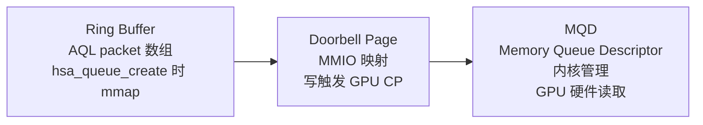
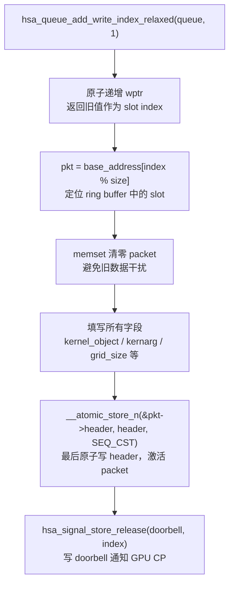
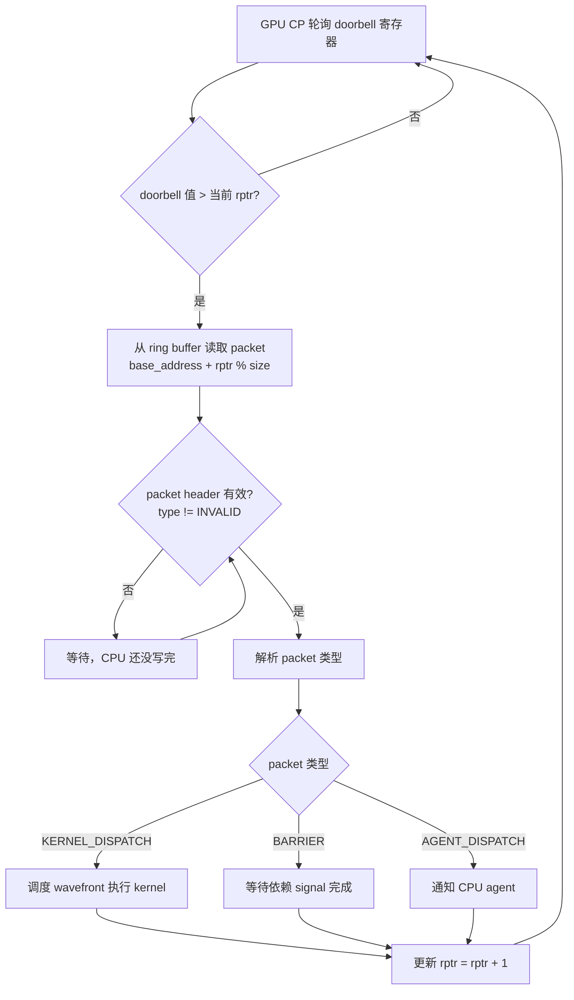
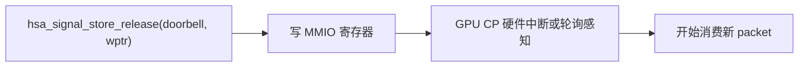
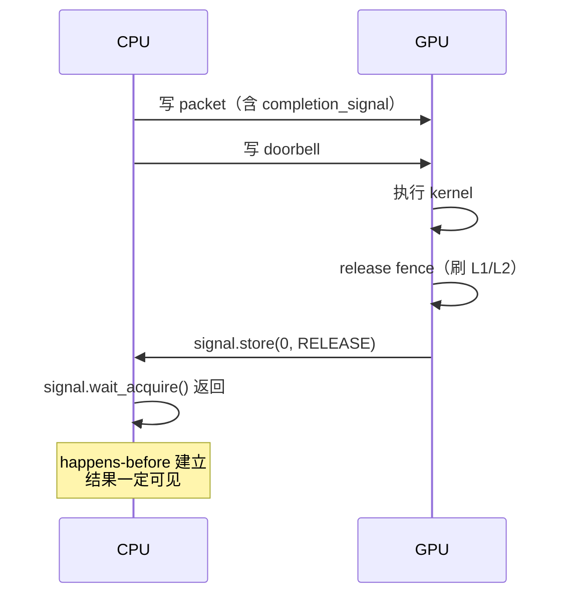
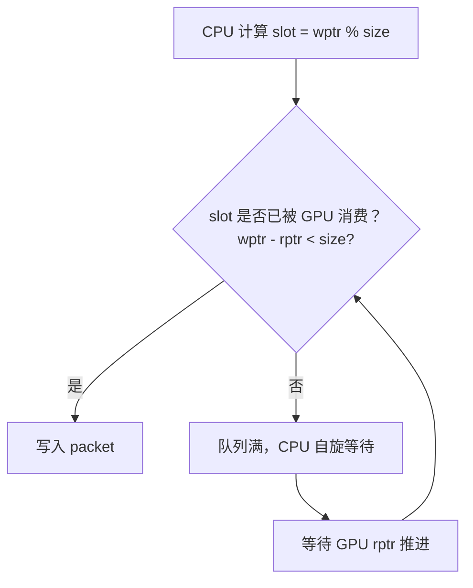

### Ring Buffer 主要机制

#### 一、核心概念

Ring buffer 是 CPU 和 GPU 之间传递命令的循环队列。本质是一段固定大小的内存，CPU 往里写 AQL packet，GPU 从里面读并执行。

```
base_address[0]
base_address[1]
base_address[2]   ← rptr（GPU 读到这里）
base_address[3]
base_address[4]   ← wptr（CPU 写到这里）
base_address[5]
...
base_address[N-1]
↓ 回到 base_address[0]（循环）
```

两个指针控制状态：

- **wptr（write pointer）**：CPU 维护，指向下一个可写位置
- **rptr（read pointer）**：GPU 维护，指向下一个待读位置
- `wptr == rptr`：队列空
- `wptr - rptr == size`：队列满

------

#### 二、内存布局

你代码里的 queue 创建后，内存里有三块区域：



**Ring Buffer**：`queue->base_address` 指向这里，大小 = `queue->size × sizeof(hsa_kernel_dispatch_packet_t)`（每个 packet 64 字节）。

**Doorbell Page**：`queue->doorbell_signal` 映射到这里，写操作直接触发 GPU CP 检查新 packet。

**MQD（Memory Queue Descriptor）**：GPU 硬件直接读取的队列描述符，存放 ring buffer 地址、rptr/wptr 地址、doorbell 偏移等。由 KFD 在 `AMDKFD_IOC_CREATE_QUEUE` 时分配和初始化。

------

#### 三、写入流程（CPU 侧）

你代码里这几行对应完整的写入流程：




**关键顺序**：必须先写完所有字段，再写 header，最后写 doorbell。任何一步顺序错误都会导致 GPU CP 读到不完整的 packet。

------

#### 四、读取流程（GPU CP 侧）

GPU Command Processor 持续轮询 doorbell：




------

#### 五、同步机制（核心）

Ring buffer 涉及四层同步，每层解决不同的问题：

**第一层：wptr 的原子递增**

多个 CPU 线程可能同时提交 packet，wptr 必须原子递增保证每个线程拿到唯一的 slot：

cpp

```cpp
// hsa_queue_add_write_index_relaxed 内部
uint64_t slot = __atomic_fetch_add(&queue->write_dispatch_id, 1, __ATOMIC_RELAXED);
```

用 relaxed 语义是因为这里只需要原子性，不需要建立 happens-before 关系。

**第二层：packet header 的 release 写**

这是最关键的同步点：

cpp

```cpp
// 错误：GPU CP 可能看到 header 有效但其他字段还是旧值
pkt->kernel_object = kernel_object;
pkt->header = header;  // 普通写，可能被重排到前面

// 正确：SEQ_CST 保证 header 写入时其他字段已全局可见
pkt->kernel_object = kernel_object;
__atomic_store_n(&pkt->header, header, __ATOMIC_SEQ_CST);
```

GPU CP 用 header 字段作为"packet 就绪"的标志，这个写必须在所有其他字段写完之后，且对 GPU 可见。

**第三层：doorbell 写触发硬件**



doorbell 写用 release 语义，保证 packet 内容的写操作在 doorbell 写之前对 GPU 可见。

**第四层：completion signal 的 acquire/release 配对**

GPUCPUGPUCPUhappens-before 建立\n结果一定可见写 packet（含 completion_signal）写 doorbell执行 kernelrelease fence（刷 L1/L2）signal.store(0, RELEASE)signal.wait_acquire() 返回




------

#### 六、队列满的处理

你代码创建的 queue size = 64，如果连续提交超过 64 个 packet 而 GPU 还没消费完：




ROCr 内部在 `AqlQueue::StoreRelaxed` 里处理这个等待逻辑，用户态看不到，`hsa_queue_add_write_index` 会阻塞直到有空位。

------

#### 七、对应你代码里的实际内存

```
queue->base_address    → ring buffer 起始地址（mmap 返回）
queue->size            → 64（你创建时指定）
queue->write_dispatch_id → wptr，CPU 原子递增
queue->read_dispatch_id  → rptr，GPU 更新后 CPU 可读

slot 计算：
index = hsa_queue_add_write_index_relaxed(queue, 1)  // 返回旧 wptr
pkt   = base_address[index % 64]                      // 定位 slot

实际内存大小：
64 × 64 bytes = 4096 bytes（正好一个内存页）
```

这也解释了为什么 queue size 通常选 2 的幂次，取模操作可以用位与代替：`index & (size-1)`，性能更好。