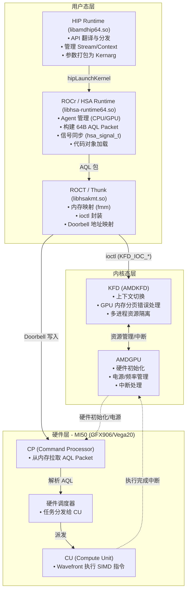
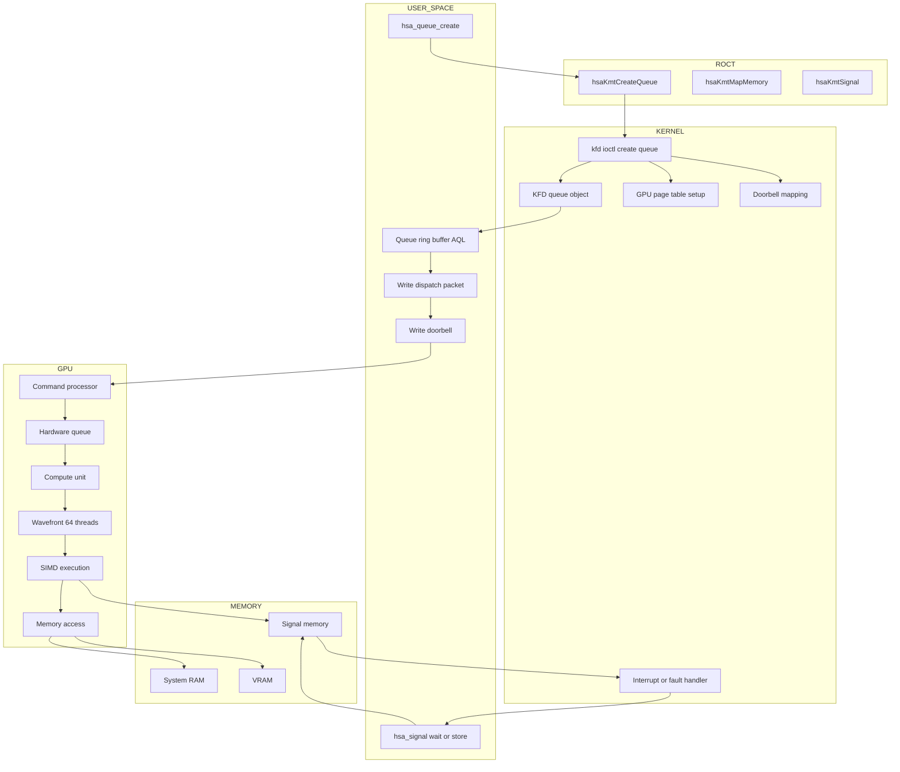
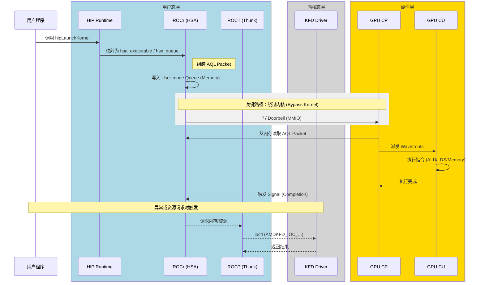
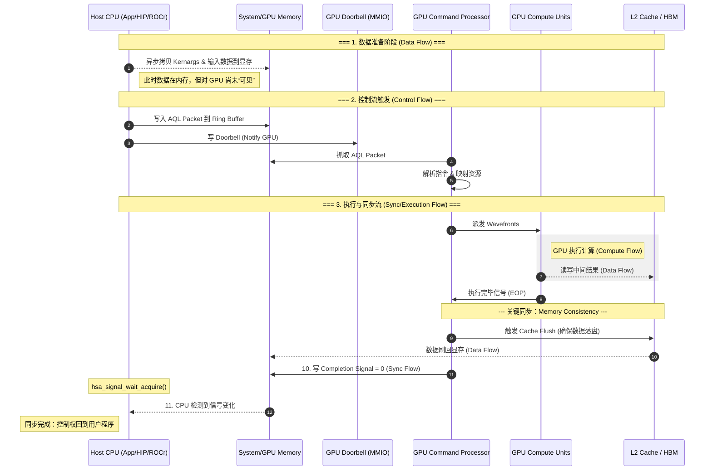

# ROCm 5.6 运行时与驱动架构研究指南

> 目标硬件：AMD MI50 (gfx906 / Vega20)  
> 研究范围：ROCr → ROCT/thunk → KFD 内核驱动  
> 前提：环境已搭建，HIP/HSA 程序可正常运行

---

## 目录

1. [软件栈全貌](#1-软件栈全貌)
2. [必读文档清单](#2-必读文档清单)
3. [源码仓库与关键路径](#3-源码仓库与关键路径)
4. [工具链](#4-工具链)
5. [研究步骤（逐步执行）](#5-研究步骤逐步执行)
6. [关键机制深入点](#6-关键机制深入点)
7. [实验验证清单](#7-实验验证清单)
8. [参考资料索引](#8-参考资料索引)

---

## 1. 软件栈全貌

```
┌─────────────────────────────────────────────┐
│  用户程序 (HIP / OpenCL / 裸 HSA)            │
├─────────────────────────────────────────────┤
│  HIP Runtime  (libamdhip64.so)              │  ← HIP API 入口，薄封装层
├─────────────────────────────────────────────┤
│  ROCr / HSA Runtime (libhsa-runtime64.so)   │  ← 核心运行时，本研究起点
│    core/runtime/   → Agent / Queue / Signal  │
│    core/inc/       → AQL 数据结构定义         │
├─────────────────────────────────────────────┤
│  ROCT / thunk (libhsakmt.so)                │  ← 用户态 KFD 代理
│    fmm.c           → GPU 虚拟内存管理         │
│    hsakmt.h        → ioctl 封装 API          │
├─────────────────────────────────────────────┤
│  Linux Kernel                               │
│    amdkfd/         → KFD：调度/内存/事件      │
│    amdgpu/         → GFX：渲染/计算引擎       │
├─────────────────────────────────────────────┤
│  MI50 硬件 (gfx906 / Vega20)                │
│    Command Processor (CP)                   │
│    SDMA Engine                              │
│    System DMA / XGMI                        │
└─────────────────────────────────────────────┘
```

分工图



**ROCm 执行全链路（核心图）**



**核心数据流（一次 kernel dispatch）：**

```
hipLaunchKernel()
  → HIP: 组装 AQL packet
  → ROCr: hsa_queue_add_write_index → 写 ring buffer
  → 原子写 packet.header (RELEASE 语义) → packet 激活
  → hsa_signal_store_release(doorbell) → 写 MMIO doorbell
  → GPU CP 轮询 doorbell → 取 AQL packet → 调度 wavefront
  → 执行完毕 → 写 completion signal value = 0
  → CPU hsa_signal_wait_acquire() 返回
```

---

调用图






## 2. 必读文档清单

### 2.1 规范文档（最优先，建立概念框架）

| 优先级 | 文档                                                                                                           | 重点章节                               | 用途          |
| --- | ------------------------------------------------------------------------------------------------------------ | ---------------------------------- | ----------- |
| ★★★ | [HSA Runtime Spec 1.1](https://hsafoundation.com/wp-content/uploads/2021/02/HSA-Runtime-1-1.pdf)             | §4 内存模型, §5 Signal, §6 Queue & AQL | ROCr 的规范基础  |
| ★★★ | [HSA Platform System Architecture 1.1](https://hsafoundation.com/wp-content/uploads/2021/02/HSA-PRM-1-1.pdf) | §2.8 AQL Packet 格式                 | packet 字段语义 |
| ★★☆ | [AMDGPU 驱动文档](https://www.kernel.org/doc/html/latest/gpu/amdgpu/)                                            | amdkfd-glossary, memory-model      | KFD 术语与内存拓扑 |
| ★★☆ | [ROCm 5.6 官方文档](https://rocm.docs.amd.com/en/docs-5.6.0/)                                                    | ROCm stack 页, Glossary             | 分层架构确认      |

**阅读判断标准**：读完 HSA Spec §6 后，能独立画出从 `hsa_queue_create` 到 GPU 取包的完整时序图，则文档阶段过关。

### 2.2 内核源码内文档

```bash
# Linux kernel tree 内，直接阅读：
Documentation/gpu/amdgpu/amdgpu-glossary.rst      # GPU 术语表
Documentation/gpu/amdgpu/amdkfd-glossary.rst      # KFD 专项术语
Documentation/gpu/amdgpu/amdgpu-memory-model.rst  # GPU 内存拓扑模型
```

### 2.3 源码内"活的规范"（比 PDF 更贴近实现）

```
ROCR-Runtime/src/core/inc/
    hsa.h                   # 全部公开 API，当规范补充读
    amd_hsa_queue.h         # AQL Queue 内存布局
    amd_hsa_signal.h        # Signal 硬件实现细节
    hsa_ven_amd_loader.h    # AMD vendor 扩展：可执行文件加载
    hsa_ven_amd_aqlprofile.h # AMD vendor 扩展：性能分析

ROCT-Thunk-Interface/include/hsakmt/
    hsakmt.h                # 全部 thunk API（与 kfd_ioctl.h 对照读）
    hsakmttypes.h           # 核心数据结构

linux/drivers/gpu/drm/amd/amdkfd/
    kfd_ioctl.h             # IOCTL 命令表（与 hsakmt.h 一一对应）
```

### 2.4 GCN3 / GCN5 ISA（MI50 属于 Vega → GCN5）

| 章节                   | 重点           |
| ---------------------- | -------------- |
| Kernel Dispatch Packet | AQL → 硬件解释 |
| Wavefront / SIMD       | GPU执行模型    |
| SGPR / VGPR            | 寄存器模型     |
| Barrier / Waitcnt      | 同步机制       |

### 2.5 补充

**硬件指令集 (ISA) 文档**

**文档名称：** [AMD Vega 7nm Instruction Set Architecture](https://www.google.com/search?q=https://www.amd.com/content/dam/amd/en/documents/radeon-tech-docs/instruction-set-architectures/vega-7nm-instruction-set-architecture.pdf)

**Chapter 4. Occupancy:** 理解 Workgroup 是如何映射到 CU 的物理资源（VGPR/SGPR）上的。

**Chapter 13. Vector Memory Operations:** 配合你清单里的 `amdgpu-memory-model.rst` 阅读，理解指令级是如何处理 **Flat/Global/LDS** 内存访问的。

**编译器后端视角（连接源码与二进制）**

**文档/资源：** [LLVM Target Description for AMDGPU](https://llvm.org/docs/AMDGPUUsage.html)

**用途：** * 这里记录了针对 **gfx906 (MI50)** 的具体后端限制。

- 它详细说明了 **Kernel Descriptor**（内核描述符）的每一个 Bit 位，这正是 ROCR 加载 Code Object 时必须解析的数据结构。

**SDMA 机制文档（异步内存拷贝的核心）**

你清单中的 AQL 主要是计算队列，但研究架构绕不开数据搬运。

- **推荐搜索关键词：** `SDMA (System Direct Memory Access)` in `amdgpu` kernel documentation.
- **核心逻辑：** * SDMA 有自己独立的 Ring Buffer 和 Packet 格式（非 AQL 格式）。
  - 了解 SDMA 如何处理 **Page Migration**（分级内存管理）以及它是如何与 HMM (Heterogeneous Memory Management) 协作的。

## 3. 源码仓库与关键路径

### 3.1 ROCr（ROCR-Runtime）

```
ROCR-Runtime/
├── src/core/
│   ├── runtime/
│   │   ├── runtime.cpp              # 初始化入口：hsa_init()
│   │   ├── amd_gpu_agent.cpp        # GPU Agent：设备抽象核心
│   │   ├── amd_aql_queue.cpp        # AQL Queue：dispatch 核心
│   │   ├── amd_hw_aql_command_processor.cpp  # HW queue 实现
│   │   ├── default_signal.cpp       # BusyWaitSignal 实现
│   │   ├── interrupt_signal.cpp     # InterruptSignal 实现
│   │   ├── memory_region.cpp        # 内存区域管理
│   │   ├── hsa_memory_copy.cpp      # 内存拷贝路由
│   │   └── amd_loader_context.cpp   # 可执行文件加载
│   ├── inc/
│   │   ├── hsa.h                    # 公开 API 声明
│   │   ├── amd_hsa_queue.h          # Queue 内存布局（对应 HSA spec §6）
│   │   └── amd_hsa_signal.h         # Signal 布局
│   └── util/
│       └── lnx/os_linux.cpp         # OS 抽象：mmap/ioctl 封装
```

**研究切入顺序**：

```
runtime.cpp (hsa_init)
  └─ amd_gpu_agent.cpp (设备枚举与初始化)
       └─ amd_aql_queue.cpp (queue 创建与 doorbell)
            └─ default_signal.cpp / interrupt_signal.cpp
```

### 3.2 ROCT（thunk）

```
ROCT-Thunk-Interface/src/
    fmm.c           # Flat Memory Model：GPU 虚拟地址管理（核心）
    libhsakmt.c     # 顶层 API 实现
    pmc_table.c     # 性能计数器映射
    topology.c      # 拓扑发现（NUMA/GPU 节点）
    events.c        # KFD 事件机制（interrupt signal 依赖）
    queues.c        # Queue 创建的 ioctl 封装
```

### 3.3 KFD 内核驱动

```
drivers/gpu/drm/amd/amdkfd/
    kfd_ioctl.h         # IOCTL 接口定义（最重要）
    kfd_chardev.c       # /dev/kfd 字符设备，ioctl dispatch
    kfd_process.c       # 进程级资源管理
    kfd_queue.c         # Queue 管理
    kfd_mqd_manager*.c  # MQD（队列描述符）管理，按 GPU 代际分文件
    kfd_bo_list.c       # Buffer Object 列表（内存提交）
    kfd_events.c        # 事件/中断机制
    kfd_topology.c      # 硬件拓扑枚举

drivers/gpu/drm/amd/amdgpu/
    amdgpu_amdkfd.c     # KFD ↔ GFX 驱动接口桥
    amdgpu_vm.c         # GPUVM 页表管理
```

### 3.4 IOCTL 对照表（hsakmt.h ↔ kfd_ioctl.h）

| thunk 函数                    | IOCTL 命令                         | 内核处理函数                          |
| --------------------------- | -------------------------------- | ------------------------------- |
| `hsaKmtOpenKFD()`           | open("/dev/kfd")                 | `kfd_open()`                    |
| `hsaKmtGetNodeProperties()` | `AMDKFD_IOC_GET_NODE_PROPERTIES` | `kfd_ioctl_get_nodeprops`       |
| `hsaKmtCreateQueue()`       | `AMDKFD_IOC_CREATE_QUEUE`        | `kfd_ioctl_create_queue`        |
| `hsaKmtAllocMemory()`       | `AMDKFD_IOC_ALLOC_MEMORY_OF_GPU` | `kfd_ioctl_alloc_memory_of_gpu` |
| `hsaKmtMapMemoryToGPU()`    | `AMDKFD_IOC_MAP_MEMORY_TO_GPU`   | `kfd_ioctl_map_memory_to_gpu`   |
| `hsaKmtWaitOnEvent()`       | `AMDKFD_IOC_WAIT_EVENTS`         | `kfd_ioctl_wait_events`         |

---

## 4. 工具链

### 4.1 静态分析

```bash
# bear + clangd：最准确的跨文件跳转（处理宏展开/模板）
cd ROCR-Runtime
bear -- cmake --build build/
# 生成 compile_commands.json，VSCode/Neovim 接 clangd LSP

# gtags：命令行快速跳转
gtags                              # 在源码根目录生成索引
global -r hsa_queue_create        # 找所有调用点
global -d HsaQueueCreate          # 找定义
global -s AqlQueue                # 符号搜索

# Doxygen：生成调用图和类继承图
# 配置 CALL_GRAPH=YES, HAVE_DOT=YES
doxygen Doxyfile
```

### 4.2 动态追踪（最重要）

```bash
# ── roctracer：HSA API 级别追踪 ──
export HSA_TOOLS_LIB=libroctracer64.so
export ROCTRACER_DOMAIN=hsa        # 追踪 HSA 层
# export ROCTRACER_DOMAIN=hip      # 追踪 HIP 层
# export ROCTRACER_DOMAIN=kfd      # 追踪 KFD 层
./your_hsa_app
# 输出每个 API 调用的时间戳、参数、返回值

# ── rocprofiler：完整时序 + 硬件计数器 ──
rocprof --hsa-trace --hip-trace -o trace_out ./your_hip_app
# 生成 trace_out.json → 用 chrome://tracing 或 Perfetto 可视化

# ── strace：IOCTL 边界观察 ──
strace -e trace=ioctl -T -v ./your_hsa_app 2>&1 | grep -E 'KFD|AMDGPU'
# -T 显示每次 ioctl 耗时，-v 显示完整参数结构

# ── bpftrace：精确追踪特定内核函数 ──
sudo bpftrace -e '
  kprobe:kfd_ioctl_create_queue {
    printf("pid=%d queue创建\n", pid)
  }
  kprobe:kfd_ioctl_alloc_memory_of_gpu {
    printf("pid=%d 分配GPU内存 size=%lu\n", pid, arg2)
  }'

# ── ftrace：KFD 事件追踪 ──
sudo bash -c "echo 'amdgpu:*' > /sys/kernel/debug/tracing/set_event"
sudo cat /sys/kernel/debug/tracing/trace_pipe &
./your_hsa_app
```

### 4.3 内存与地址空间分析

```bash
# KFD sysfs：MI50 硬件拓扑
ls /sys/class/kfd/kfd/topology/nodes/
cat /sys/class/kfd/kfd/topology/nodes/1/properties  # GPU 属性（simd_count, wave_front_size 等）
cat /sys/class/kfd/kfd/topology/nodes/1/mem_banks   # 显存信息

# 进程内存映射（需在程序内加 sleep 后执行）
cat /proc/$(pgrep your_app)/maps
# 关注：
#   小段 rw 映射 → doorbell page（MMIO）
#   大段 rw 映射 → ring buffer（AQL queue）
#   signal 共享内存映射

# rocminfo：HSA Agent 完整拓扑
rocminfo
rocminfo | grep -E 'Agent|ISA|Cache|Pool'

# rocm-smi：实时显存状态
rocm-smi --showmeminfo vram
rocm-smi --showallinfo
```

### 4.4 调试器

```bash
# rocgdb：CPU/GPU 交叉调试
HSA_ENABLE_DEBUG=1 rocgdb ./your_hsa_app

# 常用 rocgdb 命令
(rocgdb) break hsa_queue_create        # 在 ROCr 函数打断点
(rocgdb) break kfd_ioctl_create_queue  # 在内核函数打断点（需 sudo）
(rocgdb) info agents                   # 列出所有 HSA agent
(rocgdb) info threads                  # 含 GPU wavefront 线程
(rocgdb) x/16xw queue->base_address    # 查看 ring buffer 内容

# 环境变量（运行时调试辅助）
export AMD_LOG_LEVEL=4          # ROCr 详细日志
export HSA_ENABLE_INTERRUPT=0   # 强制 busy-wait signal（便于调试）
export GPU_ENABLE_HW_DEBUG=1    # 启用 GPU 硬件调试模式
```

### 4.5 性能分析

```bash
# perf 火焰图：定位 CPU 侧热路径
perf record -g -F 999 ./your_hsa_app
perf script | stackcollapse-perf.pl | flamegraph.pl > flame.svg

# rocprof 硬件计数器（MI50 / gfx906）
rocprof --list-basic      # 列出可用计数器
rocprof -i counters.txt ./your_app   # counters.txt 指定要采集的计数器
```

---

## 5. 研究步骤（逐步执行）

### Phase 0：环境确认（30 分钟）

```bash
# Step 0.1：确认 MI50 的 ISA 和拓扑
rocminfo | grep -E 'Agent|Name|ISA'
# 预期：gfx906

# Step 0.2：确认 ROCm 版本和库路径
cat /opt/rocm/.info/version
find /opt/rocm -name "libhsa-runtime64.so*"
find /opt/rocm -name "libhsakmt.so*"
find /opt/rocm -name "libroctracer64.so*"

# Step 0.3：确认 KFD 节点
ls /sys/class/kfd/kfd/topology/nodes/
cat /sys/class/kfd/kfd/topology/nodes/1/properties

# Step 0.4：用你的 HSA 程序验证基线
./your_hsa_app
# 预期：MI50 Success! GPU wrote: <value>
```

---

### Phase 1：动态追踪建立行为基线（1-2 天）

**目标：不读源码，先知道程序运行时发生了什么。**

```bash
# Step 1.1：roctracer 追踪 HSA API 调用链
export HSA_TOOLS_LIB=libroctracer64.so
export ROCTRACER_DOMAIN=hsa
./your_hsa_app 2>&1 | tee hsa_trace.log

# 预期看到的调用顺序：
# hsa_init
# hsa_iterate_agents
# hsa_amd_agent_iterate_memory_pools
# hsa_queue_create
# hsa_signal_create
# hsa_code_object_reader_create_from_memory
# hsa_executable_create / load / freeze
# hsa_executable_get_symbol_by_name
# hsa_amd_memory_pool_allocate  (×2)
# hsa_amd_agents_allow_access   (×2)
# hsa_memory_copy
# hsa_queue_add_write_index
# hsa_signal_store_release       (doorbell)
# hsa_signal_wait_acquire
# hsa_memory_copy
# hsa_signal_destroy / hsa_queue_destroy / hsa_shut_down

# Step 1.2：strace 观察 IOCTL 边界
strace -e trace=ioctl -T -o ioctl_trace.log ./your_hsa_app
grep -E 'KFD|ioctl' ioctl_trace.log

# 记录每个 IOCTL 的：命令号、耗时、是否有 mmap 调用

# Step 1.3：观察内存映射
# 在你的 hsa_queue_create 后加 sleep(60)，重新编译
cat /proc/$(pgrep your_app)/maps > maps_after_queue_create.txt
# 分析各段的用途（ring buffer / doorbell / signal）

# Step 1.4：rocprofiler 时序可视化
rocprof --hsa-trace -o rocprof_out ./your_hsa_app
# 用 chrome://tracing 打开 rocprof_out.json
```

**Phase 1 产出**：一张手绘的调用时序图，标注每个 API 调用对应哪个 IOCTL。

---

### Phase 2：ROCr 源码对照（3-5 天）

**目标：把 Phase 1 的动态行为映射到源码，理解每个函数的实现。**

#### 2.1 初始化链路

```
入口：hsa_init()
  → src/core/runtime/runtime.cpp: Runtime::Load()
     ├─ 读取 /sys/class/kfd/kfd/topology/  (拓扑发现)
     ├─ GpuAgent::Initialize()
     └─ KfdDriver::Open()  → open("/dev/kfd")
```

**阅读任务**：

- `runtime.cpp` 的 `Load()` 函数全文
- `amd_gpu_agent.cpp` 的构造函数和 `Initialize()`
- 理解 `hsa_agent_t` 是怎么从 `/dev/kfd` 的节点映射来的

#### 2.2 Queue 创建与 Doorbell

```
入口：hsa_queue_create()
  → amd_gpu_agent.cpp: GpuAgent::QueueCreate()
     → amd_aql_queue.cpp: AqlQueue::Create()
        ├─ mmap()  → 分配 ring buffer（AQL packet 数组）
        ├─ AMDKFD_IOC_CREATE_QUEUE  → 注册到内核
        └─ mmap(doorbell_page_offset)  → 映射 doorbell MMIO
```

**阅读任务**：

- `amd_aql_queue.cpp` 全文，重点：`Create()`, `StoreRelaxed()`, `StoreRelease()`
- `amd_hsa_queue.h`：理解 `hsa_queue_t` 的内存布局
- 搞清楚 `queue->base_address`、`queue->size`、`doorbell_signal` 三者的关系

**实验验证**：

```bash
# 在 hsa_queue_create 后 sleep，查看 doorbell 映射
cat /proc/$(pgrep your_app)/maps | grep -v '\.so'
# doorbell page 通常是 4KB 的 rw 映射，地址高位
```

#### 2.3 AQL Packet 激活机制

你的代码中这一行是整个 dispatch 的核心：

```cpp
__atomic_store_n(&(pkt->header), header, 3);  // 注意：3 = __ATOMIC_SEQ_CST
```

**研究任务**：

- HSA Spec §6.6：packet 头部的原子写入要求
- 对比 ROCr 的封装：`src/core/inc/amd_hsa_queue.h` 中的 `StoreRelease`
- 理解为什么必须最后写 header：防止 GPU CP 读到半初始化的 packet

#### 2.4 Signal 两种实现

```cpp
// 你的代码：num_consumers=0 → BusyWaitSignal
hsa_signal_create(1, 0, nullptr, &signal);
```

**对比研究**：

| 实现              | 源码文件                 | CPU 等待方式                   | 内核路径         |
| --------------- | -------------------- | -------------------------- | ------------ |
| BusyWaitSignal  | default_signal.cpp   | CPU 自旋读内存                  | 无 syscall    |
| InterruptSignal | interrupt_signal.cpp | KFD_IOCTL_WAIT_EVENTS → 睡眠 | kfd_events.c |

**实验**：

```cpp
// 修改你的代码，改用 interrupt signal
hsa_signal_create(1, 1, &gpu_agent, &signal);  // num_consumers=1
// 用 strace 对比两种情况下的 syscall 差异
// 用 roctracer 测量延迟差异（预期 MI50 上相差 5-20μs）
```

#### 2.5 内存池与 GPUVM

```
hsa_amd_memory_pool_allocate(global_pool, size, 0, &ptr)
  → MemoryRegion::Allocate()
     → AMDKFD_IOC_ALLOC_MEMORY_OF_GPU
        → thunk fmm.c: fmm_allocate_device_mem()
           → 分配 GPUVM VA + 创建 BO（Buffer Object）
  → hsa_amd_agents_allow_access()
     → AMDKFD_IOC_MAP_MEMORY_TO_GPU
        → 建立 GPU 页表映射
```

**研究任务**：

- `fmm.c` 的 `fmm_allocate_device_mem()` 和 `fmm_map_to_gpu()`
- 理解 MI50 的内存孔径（aperture）概念：GPUVM 地址空间布局
- 你的 kernarg 为什么必须在 GPU 可见的内存池

---

### Phase 3：thunk 层深入（2-3 天）

**目标：理解 thunk 作为 ROCr 和内核之间的语义转换层。**

```bash
# Step 3.1：建立 IOCTL 对照表
# 左边：hsakmt.h 的函数声明
# 右边：kfd_ioctl.h 的命令定义
# 逐一对应，重点看参数结构的字段语义
```

**重点研究 fmm.c（Flat Memory Model）**：

```
MI50 的 GPUVM 地址空间（gfx906）：
┌──────────────────┐ 0xFFFF_FFFF_FFFF
│  保留             │
├──────────────────┤
│  Scratch 孔径    │ ← GPU private memory（寄存器溢出）
├──────────────────┤
│  LDS 孔径        │ ← Local Data Share
├──────────────────┤
│  GPUVM 用户空间  │ ← hsa_amd_memory_pool_allocate 分配在此
├──────────────────┤ 0x0000_0000_0000
```

**实验**：

```bash
# 打印你分配的 out_gpu 和 kernarg_gpu 地址
printf("out_gpu VA: %p\n", out_gpu);
printf("kernarg VA: %p\n", kernarg_gpu);
# 对比地址范围，确认在哪个孔径内
```

---

### Phase 4：KFD 内核驱动（3-5 天）

**目标：理解内核如何管理 GPU 队列和内存，完成端到端的全栈理解。**

#### 4.1 /dev/kfd 字符设备

```
kfd_chardev.c:
  kfd_open()          → 进程注册，创建 kfd_process 结构
  kfd_ioctl()         → 根据命令号 dispatch 到各处理函数
  kfd_mmap()          → doorbell / signal 的 mmap 实现
```

#### 4.2 Queue 管理（核心）

```
kfd_ioctl_create_queue()
  → kfd_queue.c: pqm_create_queue()
     → mqd_manager (gfx906 专用): init_mqd()
        → 填写 MQD（Memory Queue Descriptor）：
           ring_base_address、rptr/wptr 地址、doorbell 偏移
     → amdgpu_amdkfd_alloc_gtt_mem()  → 分配 GTT 内存给 MQD
     → 写入 GPU 调度器（HWS 或 DIQ）
```

**MQD 是什么**：GPU 硬件用来描述一个 compute queue 的数据结构，存在 GTT 内存，CP 直接读取。相当于 CPU 的 task_struct 对应 GPU 的 MQD。

#### 4.3 内存管理

```
kfd_ioctl_alloc_memory_of_gpu()
  → kfd_process.c: kfd_process_device_create_obj()
  → amdgpu_amdkfd.c: amdgpu_amdkfd_gpuvm_alloc_memory_of_gpu()
     → amdgpu_vm.c: amdgpu_vm_bo_add()  → 加入 GPUVM

kfd_ioctl_map_memory_to_gpu()
  → amdgpu_amdkfd_gpuvm_map_memory_to_gpu()
     → amdgpu_vm_bo_update()  → 更新 GPU 页表
     → amdgpu_vm_update_ptes() → 刷新 TLB
```

#### 4.4 中断与事件

```
GPU 执行完成 → 写 completion signal → 触发中断 → amdgpu_irq_handler()
  → kfd_signal_event_interrupt()
     → kfd_events.c: signal_event_interrupt()
        → 唤醒等待 AMDKFD_IOC_WAIT_EVENTS 的进程
```

---

### Phase 5：端到端整合（1-2 天）

**目标：能独立绘制从 `hipLaunchKernel` 到 GPU 执行完毕的完整调用链，标注每层的关键函数和数据结构。**

```
完整链路检查清单：
□ hsa_init → /dev/kfd open → kfd_process 创建
□ hsa_queue_create → AqlQueue::Create → MQD 初始化 → doorbell mmap
□ hsa_amd_memory_pool_allocate → GPUVM 分配 → GPU 页表建立
□ AQL packet 写入 → header 原子激活
□ doorbell 写入 → GPU CP 感知 → MQD 调度 → wavefront 执行
□ completion signal 写入 → 中断（或 busy-wait）→ CPU 返回
```

---

## 6. 关键机制深入点

### 6.1 AQL Packet 格式（你的代码直接操作此结构）

```c
// hsa_kernel_dispatch_packet_t 内存布局（64 字节）
// 偏移  字段                  说明
// 0     header (16bit)        最后原子写入，激活 packet
// 2     setup (16bit)         dimensions
// 4     workgroup_size_x/y/z
// 10    grid_size_x/y/z
// 22    private_segment_size  scratch memory 大小
// 26    group_segment_size    LDS 大小
// 32    kernel_object         .kd 符号地址（GPU 代码入口）
// 40    kernarg_address       参数指针
// 56    completion_signal     完成信号
```

**关键**：header 字段的 acquire/release fence scope 决定了内存一致性范围。你的代码使用 `HSA_FENCE_SCOPE_SYSTEM`，代价最高但最安全。

### 6.2 Doorbell 机制

```
doorbell_signal 本质：一个 MMIO 寄存器的用户态映射
写 doorbell = 告诉 GPU CP "write index 已更新，来取包"

地址来源：AMDKFD_IOC_CREATE_QUEUE 返回 doorbell_offset
映射方式：mmap(/dev/kfd, offset=doorbell_offset, size=4KB)

MI50 (gfx906) doorbell 地址范围：
  0x2000_0000 ~ 0x2100_0000（物理地址空间，驱动映射）
```

### 6.3 BusyWait vs Interrupt Signal 延迟模型

```
BusyWaitSignal：
  CPU: while(signal.value != 0) { cpu_relax(); }
  延迟 = GPU 执行时间 + 写 signal 时间 + CPU 读到更新的时间
  优点：低延迟（纳秒级响应）
  缺点：CPU 核心占用 100%

InterruptSignal：
  CPU: syscall(WAIT_EVENTS) → 睡眠
  延迟 = GPU 执行时间 + 中断 → 内核处理 → 唤醒进程
  额外延迟：5~20μs（MI50 实测）
  优点：不占 CPU
  选择依据：kernel 执行时间 < 50μs 用 BusyWait，否则用 Interrupt
```

### 6.4 kernarg 内存要求

```
你的代码：kernarg 在 global_pool（VRAM）
ROCr 的实际处理（gfx906）：
  - kernarg 地址写入 AQL packet 的 kernarg_address 字段
  - GPU CP 在 dispatch 前把 kernarg 数据加载到 SGPRs
  - 必须是 GPU 可见地址（GPUVM 范围内）
  - 对齐要求：64 字节对齐（你用了 64 字节分配，满足）

替代方案：fine-grained system memory（CPU+GPU 共享）
  优点：不需要 hsa_memory_copy，CPU 直接写
  代价：访问走 PCIe，有延迟
```

---

## 7. 实验验证清单

每个实验验证一个具体机制，建议按顺序执行：

```
□ Exp-01: roctracer 跑你的 HSA 程序，记录完整 API 调用时序
□ Exp-02: strace 观察所有 IOCTL，建立 HSA API → IOCTL 映射表
□ Exp-03: /proc/maps 分析各内存段用途（doorbell/ring buffer/signal）
□ Exp-04: 对比 BusyWait vs Interrupt signal 的延迟和 CPU 占用
□ Exp-05: 修改 fence scope（AGENT vs SYSTEM），验证对正确性的影响
□ Exp-06: 打印 out_gpu 和 kernarg_gpu 的 VA，确认地址空间位置
□ Exp-07: 用 rocgdb 在 hsa_queue_create 打断点，单步追踪到 ioctl
□ Exp-08: bpftrace 追踪 kfd_ioctl_alloc_memory_of_gpu 的参数
□ Exp-09: 用 rocprof 生成时序 JSON，chrome://tracing 可视化
□ Exp-10: 修改 workgroup/grid size，验证 AQL packet 字段语义
```

---

## 8. 参考资料索引

### 规范与标准

- [HSA Runtime Spec 1.1 PDF](https://hsafoundation.com/wp-content/uploads/2021/02/HSA-Runtime-1-1.pdf)
- [HSA Platform System Architecture 1.1 PDF](https://hsafoundation.com/wp-content/uploads/2021/02/HSA-PRM-1-1.pdf)
- [AMDGPU Linux 驱动文档](https://www.kernel.org/doc/html/latest/gpu/amdgpu/)

### 源码仓库

- [ROCR-Runtime](https://github.com/RadeonOpenCompute/ROCR-Runtime) — tag: rocm-5.6.0
- [ROCT-Thunk-Interface](https://github.com/RadeonOpenCompute/ROCT-Thunk-Interface) — tag: rocm-5.6.0
- [Linux kernel amdkfd](https://github.com/torvalds/linux/tree/master/drivers/gpu/drm/amd/amdkfd)

### 官方文档

- [ROCm 5.6 文档站](https://rocm.docs.amd.com/en/docs-5.6.0/)
- [ROCm 工具文档：roctracer](https://rocm.docs.amd.com/projects/roctracer/en/docs-5.6.0/)
- [ROCm 工具文档：rocprofiler](https://rocm.docs.amd.com/projects/rocprofiler/en/docs-5.6.0/)

### 工具

- [Perfetto 时序分析](https://ui.perfetto.dev/) — 打开 rocprof 生成的 JSON
- [Flamegraph](https://github.com/brendangregg/FlameGraph) — perf 火焰图

---

*文档版本：2026-04  目标：ROCm 5.6 / MI50 (gfx906)*< Empty Mermaid Block >
