# ROCr (ROCR-Runtime) 源码概览

## 一、总体

### 1. 目录结构

```
ROCR-Runtime/src/
├── core/
│   ├── runtime/        ← 核心实现，重点研究区
│   │   ├── runtime.cpp           # hsa_init 入口，全局状态管理
│   │   ├── amd_cpu_agent.cpp     # CPU agent 抽象
│   │   ├── amd_gpu_agent.cpp     # GPU agent 抽象（最重要）
│   │   ├── amd_aql_queue.cpp     # AQL queue 实现（dispatch 核心）
│   │   ├── amd_loader_context.cpp # 可执行文件加载
│   │   ├── memory_region.cpp     # 内存池管理
│   │   ├── default_signal.cpp    # BusyWaitSignal
│   │   ├── interrupt_signal.cpp  # InterruptSignal
│   │   ├── signal.cpp            # signal 基类
│   │   └── hsa.cpp / hsa_ext_amd.cpp  # C API 入口，对外接口
│   ├── inc/             ← 头文件，类声明
│   │   ├── agent.h / queue.h / signal.h  # 抽象基类
│   │   ├── amd_gpu_agent.h
│   │   ├── amd_hsa_queue.h       # AQL queue 内存布局（C ABI）
│   │   └── amd_hsa_signal.h      # signal 内存布局
│   └── util/             ← OS 抽象层
│       └── lnx/os_linux.cpp      # mmap/ioctl/线程封装
└── libamdhsacode/         ← Code Object 解析（ELF格式的GPU可执行文件）
```

### 2. 整体架构

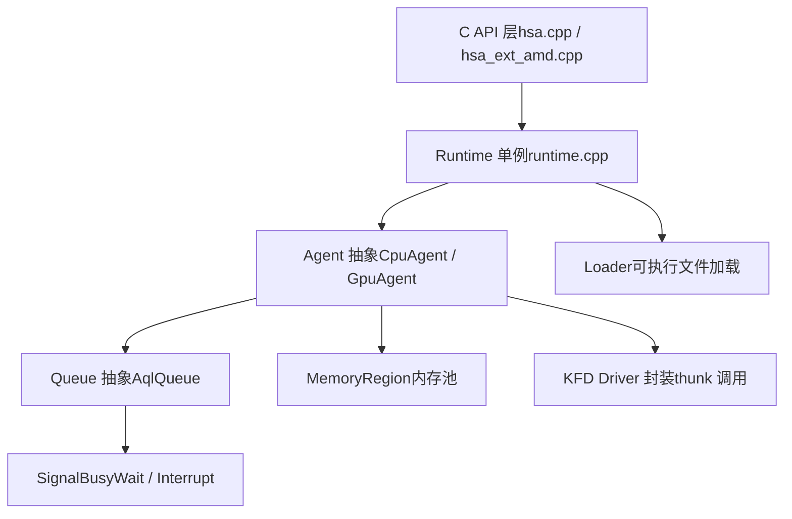

**分层逻辑**：C API 是对外接口，内部都是 C++ 类实现，`Runtime` 是全局单例，持有所有 `Agent` 列表，每个 `Agent` 持有自己的 `Queue` 和 `MemoryRegion` 列表。

### 3. 核心类与继承关系

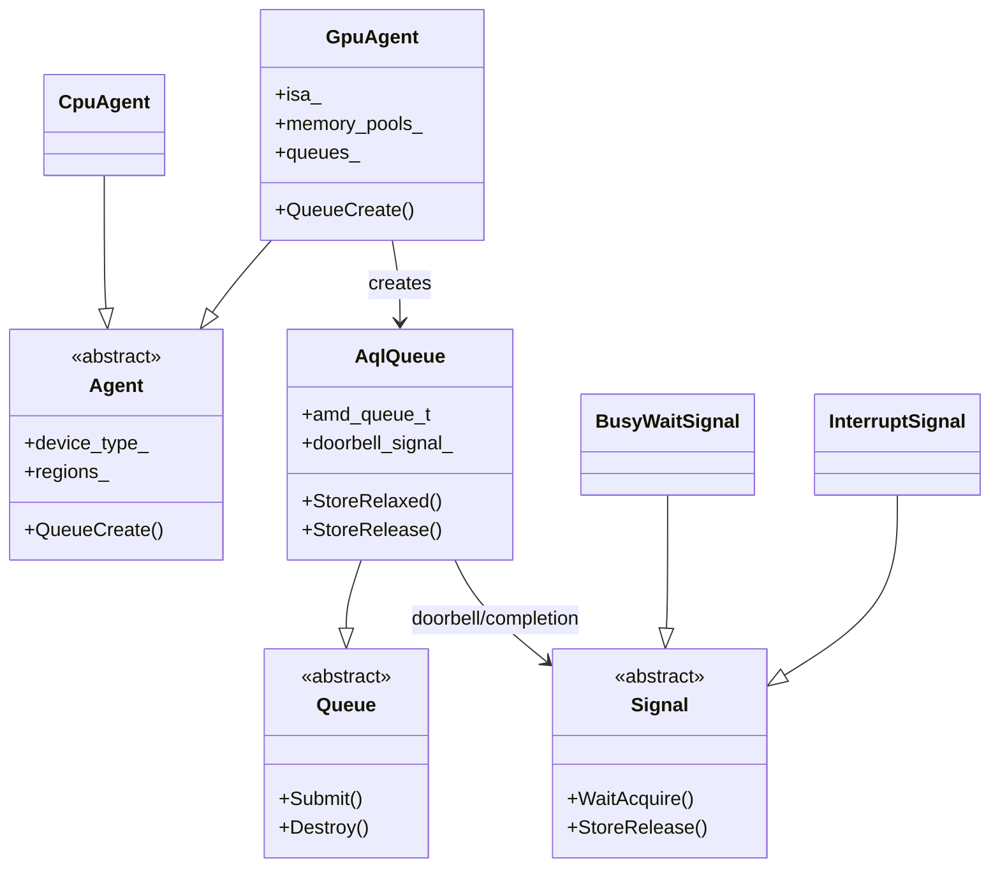

**关键点**：

- `Agent`、`Queue`、`Signal` 都是抽象基类，C API 看到的是 `hsa_agent_t` 等 opaque handle，内部转换成对应的 C++ 对象指针
- `GpuAgent` 是研究重点，包含 ISA 信息、内存池列表、队列管理

### 4. 主要数据结构

**hsa_agent_t / hsa_queue_t / hsa_signal_t**

这些是 C ABI 暴露的 opaque handle，本质是指针包装：

```c++
// 用户看到的是 64-bit handle
typedef struct hsa_agent_s { uint64_t handle; } hsa_agent_t;

// 内部转换
core::Agent* agent = reinterpret_cast<core::Agent*>(handle.handle);
```

**amd_queue_t**（`amd_hsa_queue.h`）

GPU 硬件直接读取的队列描述符，C ABI 兼容：

```c++
struct amd_queue_t {
    hsa_queue_t hsa_queue;        // 公开字段：base_address, size, doorbell_signal
    uint32_t    write_dispatch_id; // wptr
    uint32_t    read_dispatch_id;  // rptr
    // ... MQD 相关字段
};
```

**hsa_kernel_dispatch_packet_t**（AQL packet，64字节）

你代码里直接操作的结构，字段在第六节有详细布局。

### 5. 关键流程

#### 初始化流程

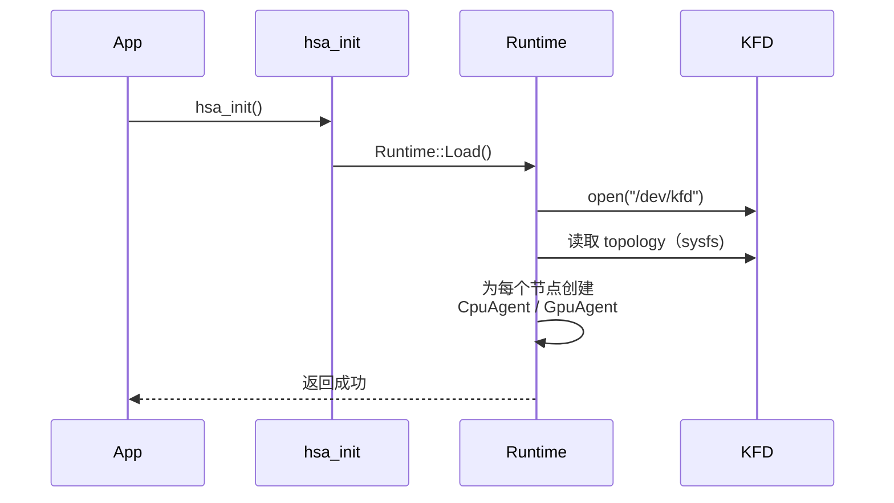

#### Queue 创建流程

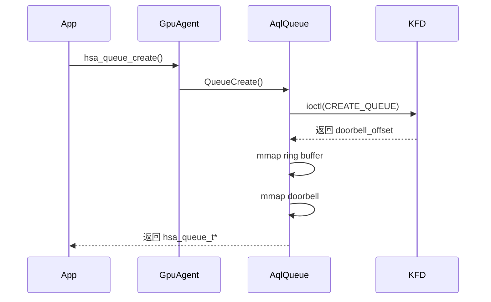

#### Dispatch 流程

CPU 写 packet → 原子写 header → 写 doorbell → GPU CP 消费 → kernel 执行 → signal 通知完成

### 6. 对外API分类

| 类别        | 代表 API                                                     | 实现文件                                |
| :---------- | :----------------------------------------------------------- | :-------------------------------------- |
| 初始化      | `hsa_init` / `hsa_shut_down`                                 | `runtime.cpp`                           |
| Agent 查询  | `hsa_iterate_agents` / `hsa_agent_get_info`                  | `hsa.cpp`                               |
| Queue 管理  | `hsa_queue_create` / `hsa_queue_destroy`                     | `hsa.cpp` → `amd_gpu_agent.cpp`         |
| 内存管理    | `hsa_amd_memory_pool_allocate`                               | `hsa_ext_amd.cpp` → `memory_region.cpp` |
| Signal      | `hsa_signal_create` / `hsa_signal_wait_acquire`              | `hsa.cpp` → `default_signal.cpp`        |
| 可执行文件  | `hsa_executable_create` / `hsa_executable_load_agent_code_object` | `hsa_ext_amd.cpp` → `loader`            |
| Code Object | `hsa_code_object_reader_create_from_memory`                  | `libamdhsacod`                          |

### 7. 阅读顺序

```
第一步：hsa.cpp 的 hsa_init 实现           ← 看整体启动流程
第二步：runtime.cpp 的 Runtime::Load        ← 看 agent 怎么发现的
第三步：amd_gpu_agent.cpp 的构造函数        ← 看 GPU agent 初始化细节
第四步：amd_aql_queue.cpp 的 Create()       ← 你已经分析过，对照看
第五步：memory_region.cpp 的 Allocate()    ← 内存分配实现
第六步：default_signal.cpp / interrupt_signal.cpp  ← signal 两种实现
```

## 二、初始化代码和代理

## 1. 四层架构总览

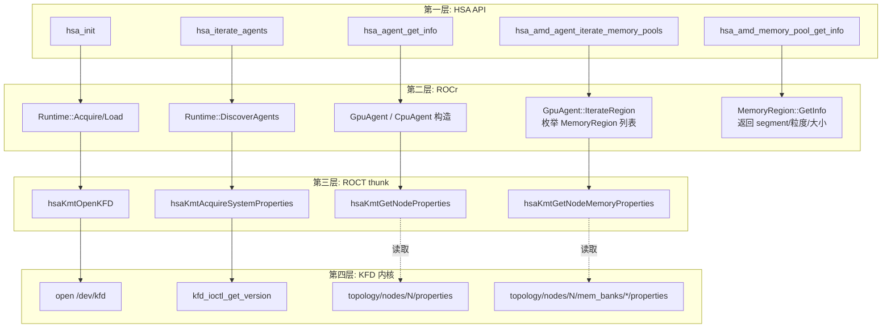

## 两条平行的发现路径

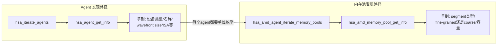

**关键点**：内存池发现是依附在 agent 之上的二级枚举。先有 agent，再对每个 agent 单独调用 `hsa_amd_agent_iterate_memory_pools`，不存在"全局内存池列表"这种东西。

---

## 完整调用序列

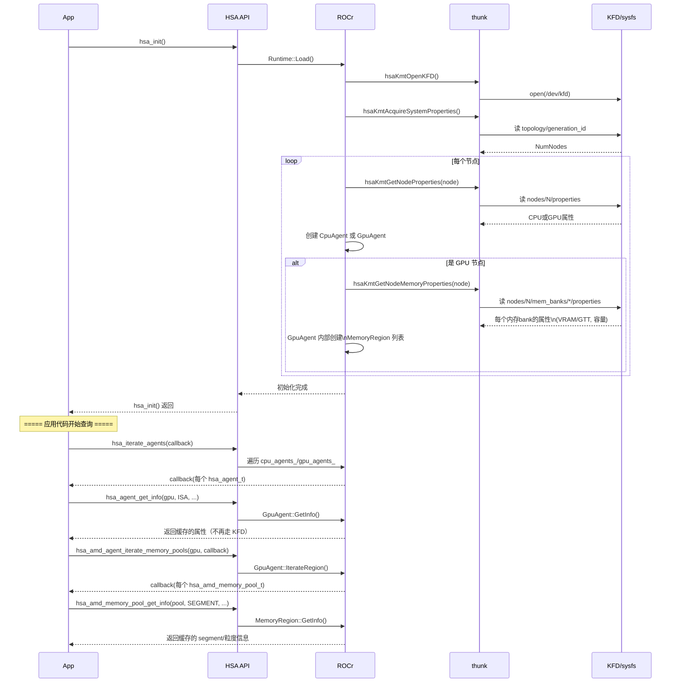

---

## 一个重要细节：初始化时查 vs 运行时查

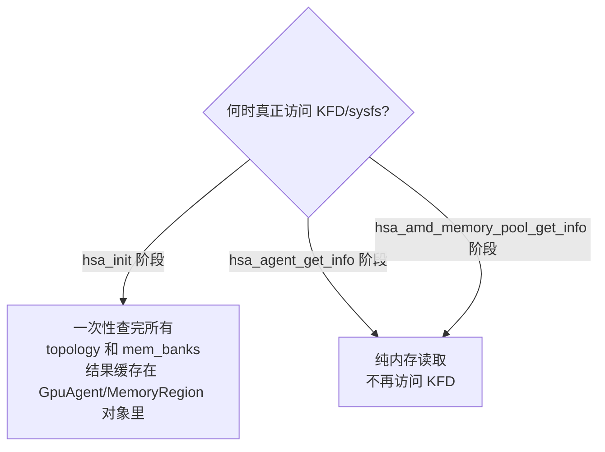

这解释了为什么程序运行起来后，`hsa_agent_get_info` 和 `hsa_amd_memory_pool_get_info` 调用很快——它们读的是 ROCr 在 `hsa_init()` 时缓存好的数据，不会每次都重新查 KFD。strace 看到的 ioctl/sysfs 读取，应该集中在 `hsa_init()` 那一段时间窗口里。

## 2. 第一层：HSA API（应用编程接口）

### 2.1 主要 API

```c
// 初始化/关闭
hsa_status_t hsa_init(void);
hsa_status_t hsa_shut_down(void);

// Agent 发现
hsa_status_t hsa_iterate_agents(
    hsa_status_t (*callback)(hsa_agent_t agent, void* data),
    void* data);

hsa_status_t hsa_agent_get_info(
    hsa_agent_t agent,
    hsa_agent_info_t attribute,
    void* value);

// AMD 扩展：内存池发现（HSA 标准之外）
hsa_status_t hsa_amd_agent_iterate_memory_pools(
    hsa_agent_t agent,
    hsa_status_t (*callback)(hsa_amd_memory_pool_t pool, void* data),
    void* data);
hsa_status_t hsa_amd_memory_pool_get_info(hsa_amd_memory_pool_t memory_pool,
                                 hsa_amd_memory_pool_info_t attribute,
                                 void* value);
```

### 2.2 数据模型

```c
// 所有 handle 都是 opaque（不透明），用户不能假设内部结构
typedef struct hsa_agent_s {
    uint64_t handle;   // 实际是 core::Agent* 指针
} hsa_agent_t;
```

**编程模型核心规则**：HSA API 全部用 **callback 模式**枚举资源，不提供"获取数组"的接口。这是为了让 ROCr 内部不暴露具体存储结构（可能是 vector，也可能是其他容器）。

### 2.3 编程模型：如何用这一层 API 组合实现"找到 GPU 并查询其属性"

```c
#include <hsa/hsa.h>
#include <hsa/hsa_ext_amd.h>
#include <iostream>
#include <cstring>

hsa_agent_t gpu_agent;
hsa_amd_memory_pool_t global_pool;      // VRAM coarse-grained
hsa_amd_memory_pool_t fine_grained_pool; // 系统内存 fine-grained

// ===== 步骤1：枚举所有 agent，用回调筛选出 GPU =====
hsa_status_t find_gpu(hsa_agent_t agent, void* data) {
    hsa_device_type_t type;
    hsa_agent_get_info(agent, HSA_AGENT_INFO_DEVICE, &type);
    if (type == HSA_DEVICE_TYPE_GPU) {
        *(hsa_agent_t*)data = agent;
    }
    return HSA_STATUS_SUCCESS;  // 返回 SUCCESS 继续枚举，其他值会提前终止
}

// ===== 步骤3：枚举该 agent 的所有内存池，按 segment+粒度筛选 =====
hsa_status_t find_pools(hsa_amd_memory_pool_t pool, void* data) {
    hsa_amd_segment_t segment;
    hsa_amd_memory_pool_get_info(pool, HSA_AMD_MEMORY_POOL_INFO_SEGMENT, &segment);

    if (segment != HSA_AMD_SEGMENT_GLOBAL) {
        return HSA_STATUS_SUCCESS;  // 跳过 group/private 段，只关心 global
    }

    uint32_t flags;
    hsa_amd_memory_pool_get_info(pool,
        HSA_AMD_MEMORY_POOL_INFO_GLOBAL_FLAGS, &flags);

    if (flags & HSA_AMD_MEMORY_POOL_GLOBAL_FLAG_FINE_GRAINED) {
        fine_grained_pool = pool;   // 系统内存，CPU/GPU 都直接可见
    } else {
        global_pool = pool;         // VRAM，GPU 访问快，CPU 需要显式同步
    }

    return HSA_STATUS_SUCCESS;
}

int main() {
    hsa_init();

    // 步骤1：找到 GPU agent
    hsa_iterate_agents(find_gpu, &gpu_agent);

    // 步骤2：用 agent handle 查询设备属性
    char name[64];
    hsa_agent_get_info(gpu_agent, HSA_AGENT_INFO_NAME, name);

    uint32_t wavefront_size;
    hsa_agent_get_info(gpu_agent, HSA_AGENT_INFO_WAVEFRONT_SIZE, &wavefront_size);

    // 步骤3：枚举这个 agent 下的所有内存池
    hsa_amd_agent_iterate_memory_pools(gpu_agent, find_pools, nullptr);

    // 步骤4：查询内存池的详细属性
    size_t pool_size;
    hsa_amd_memory_pool_get_info(global_pool,
        HSA_AMD_MEMORY_POOL_INFO_SIZE, &pool_size);

    bool allow_alloc;
    hsa_amd_memory_pool_get_info(global_pool,
        HSA_AMD_MEMORY_POOL_INFO_RUNTIME_ALLOC_ALLOWED, &allow_alloc);

    std::cout << "GPU: " << name
              << "  wavefront=" << wavefront_size
              << "  VRAM pool size=" << pool_size / (1024*1024) << " MB"
              << "  可分配=" << allow_alloc << std::endl;

    hsa_shut_down();
    return 0;
}
```

## 3. 第二层：ROCr（运行时实现）

### 3.1 主要类与函数

```cpp
namespace rocr {
namespace core {

//runtime.h
class Runtime {
public:
    static hsa_status_t Acquire();         // 初始化
    static hsa_status_t Release();
private:
    hsa_status_t Load();                   // 真正的初始化逻辑
    void LoadTools();                      // 加载 HSA_TOOLS_LIB
    std::vector<Agent*> cpu_agents_;
    std::vector<Agent*> gpu_agents_;
    uint32_t ref_count_;                   // 引用计数
    KernelMutex bootstrap_lock_;           // 防止并发初始化
};
//amd_topology.h
namespace AMD {
bool Load();
bool Unload();
}

class GpuAgent : public GpuAgentInt {
public:
    GpuAgent(HSAuint32 node, const HsaNodeProperties& node_props, bool xnack_mode, uint32_t index);							  
    hsa_status_t QueueCreate(size_t size, hsa_queue_type32_t queue_type,
                           core::HsaEventCallback event_callback, void* data,
                           uint32_t private_segment_size,
                           uint32_t group_segment_size,
                           core::Queue** queue) override;
    hsa_status_t IterateRegion(hsa_status_t (*callback)(hsa_region_t region,
                                                      void* data),
                             void* data) const override;       // 内存池枚举
private:
    hsa_isa_t isa_;                        // 如 gfx906
    std::vector<MemoryRegion*> regions_;
    std::vector<AqlQueue*> queues_;
};

} // core
} // rocr
```

### 3.2 数据模型

```cpp
// Agent 基类，CpuAgent/GpuAgent 继承
class Agent {
protected:
    HSAuint32 node_id_;          // 对应 KFD 的 node id
    hsa_device_type_t device_type_;
    BaseShared shared_;           // 跨 agent 共享的状态
};
```

**编程模型核心规则**：ROCr 用 **C++ 对象 + handle 转换**桥接 C API。每个 `hsa_agent_t.handle` 实际就是 `reinterpret_cast<uint64_t>(core::Agent*)`。这是典型的"C ABI 包装 C++ 实现"模式。

### 3.3 编程模型：Runtime::Load() 如何组合调用 ROCT 完成 agent 发现

```cpp
// 伪代码，体现 ROCr 内部的编程模型
hsa_status_t Runtime::Load() {
    // 1. 调用 thunk 打开 KFD（第三层）
    HSAKMT_STATUS kfd_status = hsaKmtOpenKFD();
    if (kfd_status != HSAKMT_STATUS_SUCCESS) return HSA_STATUS_ERROR;

    // 2. 获取系统属性（节点数量）
    HsaSystemProperties sys_props;
    hsaKmtAcquireSystemProperties(&sys_props);

    // 3. 遍历每个节点，查询属性，创建对应 Agent
    for (uint32_t node = 0; node < sys_props.NumNodes; node++) {
        HsaNodeProperties node_props;
        hsaKmtGetNodeProperties(node, &node_props);

        if (node_props.NumCPUCores > 0) {
            cpu_agents_.push_back(new CpuAgent(node, node_props));
        }
        if (node_props.NumFComputeCores > 0) {
            gpu_agents_.push_back(new GpuAgent(node, node_props));
            // GpuAgent 构造函数内部继续查询：
            //   - ISA (hsaKmtGetNodeProperties 里的 EngineId)
            //   - 内存池 (hsaKmtGetNodeMemoryProperties)
        }
    }

    // 4. 加载 tools（roctracer 等）
    LoadTools();

    return HSA_STATUS_SUCCESS;
}
```

### 3.4 这一层的主要流程

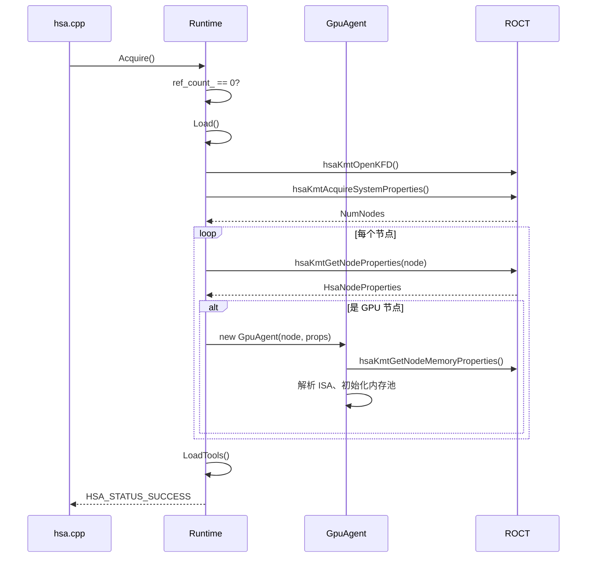

---

## 4. 第三层：ROCT / thunk（用户态驱动代理）

### 4.1 主要 API

```c
// 来自 hsakmt.h
HSAKMT_STATUS hsaKmtOpenKFD(void);
HSAKMT_STATUS hsaKmtCloseKFD(void);

HSAKMT_STATUS hsaKmtAcquireSystemProperties(		//获得系统属性
    HsaSystemProperties* SystemProperties);

HSAKMT_STATUS hsaKmtGetNodeProperties(			//获取单个节点的详细属性
    HSAuint32 NodeId,
    HsaNodeProperties* NodeProperties);

HSAKMT_STATUS hsaKmtGetNodeMemoryProperties(	//节点内存域列表及属性
    HSAuint32 NodeId,
    HSAuint32 NumBanks,
    HsaMemoryProperties* MemoryProperties);

// Queue 相关（dispatch 阶段用）
HSAKMT_STATUS hsaKmtCreateQueue(...);
HSAKMT_STATUS hsaKmtAllocMemory(...);
```

### 4.2 数据模型

```c
// thunk 的数据结构直接对应 ioctl 参数结构，没有额外抽象
typedef struct _HsaNodeProperties {
    HSAuint32 NumCPUCores;
    HSAuint32 NumFComputeCores;   // GPU compute core 数量
    HSAuint32 NumMemoryBanks;
    HSAuint32 EngineId;            // 编码了 GPU 架构版本（如 gfx906）
    // ... 等价于内核 kfd_ioctl.h 里 node properties 的用户态镜像
} HsaNodeProperties;
```

**编程模型核心规则**：thunk 是**最薄的一层**，几乎每个函数就是"打包参数 → 调用 ioctl → 解包返回值"，没有状态管理，没有缓存（部分函数除外，如 topology 有缓存）。

### 4.3 编程模型：thunk 函数内部如何组合 ioctl

```c
// hsaKmtGetNodeProperties 的简化逻辑
HSAKMT_STATUS hsaKmtGetNodeProperties(
    HSAuint32 NodeId, HsaNodeProperties* NodeProperties)
{
    // 方式一（旧）：通过 ioctl 直接查询内核
    struct kfd_ioctl_get_node_properties_args args = {0};
    args.gpu_id = NodeId;
    int ret = ioctl(kfd_fd, AMDKFD_IOC_GET_NODE_PROPERTIES, &args);
    
    // 方式二（topology.c 实际采用）：读取 sysfs
    // 因为 sysfs 路径更稳定，性能也够用
    char path[256];
    snprintf(path, sizeof(path),
        "/sys/class/kfd/kfd/topology/nodes/%d/properties", NodeId);
    FILE* f = fopen(path, "r");
    // 解析文本内容填充 NodeProperties
    fclose(f);

    return HSAKMT_STATUS_SUCCESS;
}
```

**关键发现**：很多 thunk 函数（特别是 topology 相关）**不走 ioctl，走 sysfs 文本解析**。ioctl 用于真正需要内核执行操作的场景（创建 queue、分配内存），查询类信息走 sysfs 更简单。

### 4.4 这一层的主要流程

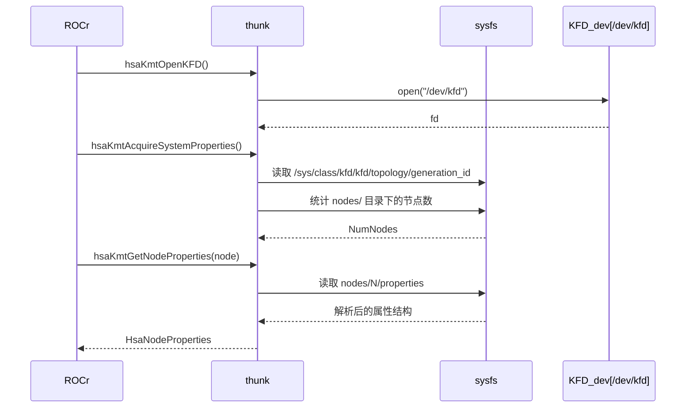

---

## 5. 第四层：KFD（内核驱动）

### 5.1 主要接口（不是函数调用，是 ioctl 命令 + sysfs 文件）

```c
// kfd_ioctl.h 定义的命令（部分）
#define AMDKFD_IOC_GET_VERSION              ...
#define AMDKFD_IOC_CREATE_QUEUE             ...
#define AMDKFD_IOC_ALLOC_MEMORY_OF_GPU      ...
#define AMDKFD_IOC_MAP_MEMORY_TO_GPU        ...
#define AMDKFD_IOC_ACQUIRE_VM               ...

// sysfs 暴露的拓扑信息（只读文件，文本格式）
/sys/class/kfd/kfd/topology/
    generation_id
    nodes/0/properties
    nodes/0/mem_banks/0/properties
    nodes/1/properties      ← 通常 GPU 节点
```

### 5.2 数据模型

```c
// 内核侧 kfd_process 结构（每个使用 KFD 的进程对应一个实例）
struct kfd_process {
    struct mutex mutex;
    struct hlist_node kfd_processes;
    struct kfd_process_device *pdds[MAX_GPU_INSTANCE];  // 每个 GPU 一个
    // ...
};

// 每个 GPU 节点的内核内部表示
struct kfd_dev {
    struct kfd_topology_device *node_props;
    struct amdgpu_device *adev;   // 关联到 amdgpu 驱动
};
```

**编程模型核心规则**：KFD 是**资源管理者**，核心职责是管理进程级的 GPU 资源（queue、内存、事件），把硬件操作委托给 `amdgpu` 驱动（通过 `amdgpu_amdkfd.c` 桥接）。topology 信息在驱动加载时枚举好，之后只读，不需要每次查询都走 ioctl。

### 5.3 编程模型：内核如何组合驱动子系统提供 topology

```c
// kfd_topology.c 简化逻辑（驱动初始化时执行一次）
void kfd_topology_init(void) {
    // 1. 枚举系统里所有支持 KFD 的 GPU（amdgpu 驱动注册时回调进来）
    for_each_amdgpu_device(adev) {
        struct kfd_topology_device *dev = kfd_create_topology_device();
        
        // 2. 从 amdgpu_device 读取硬件信息填充
        dev->gpu_id = adev->kfd.dev->id;
        dev->node_props.EngineId = adev->ip_versions[GC_HWIP][0]; // 如 gfx906
        dev->node_props.NumFComputeCores = adev->gfx.cu_info.number;
        
        // 3. 注册到全局 topology 列表
        kfd_topology_add_device(dev);
    }

    // 4. 创建对应的 sysfs 文件节点
    kfd_topology_sysfs_init();  // 生成 /sys/class/kfd/kfd/topology/nodes/N/
}
```

### 5.4 这一层的主要流程

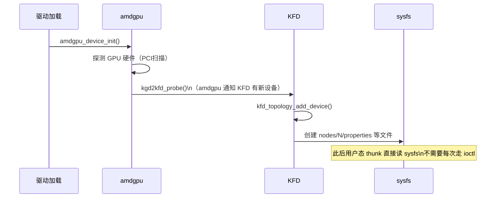

---

## 6. 完整端到端调用链

把四层串联起来，对应你 gdb 跟踪的完整路径：

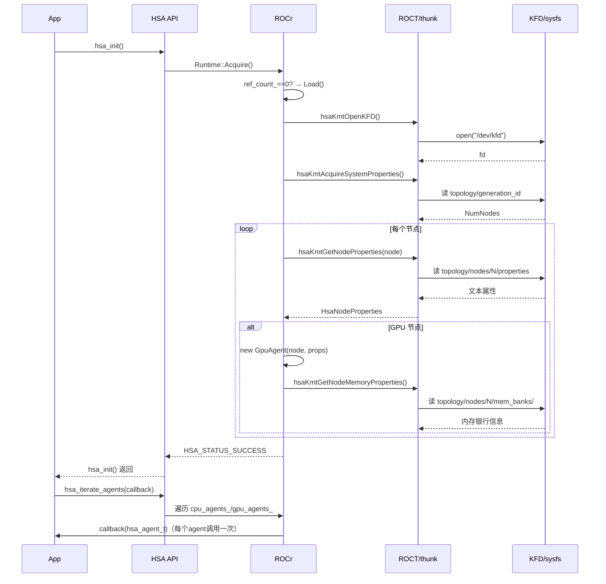

---

## 7. 四层编程模型对比

### 7.1 抽象程度

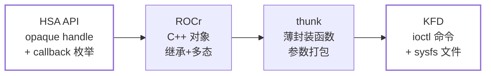

抽象程度从左到右递减：HSA API 完全隐藏实现细节，KFD 层直接暴露内核数据结构（通过 ioctl 参数）。

### 7.2 状态管理方式

| 层      | 状态存在哪里                   | 生命周期                |
| ------- | ------------------------------ | ----------------------- |
| HSA API | 无状态，纯转发                 | 无                      |
| ROCr    | `Runtime` 单例的成员变量       | 进程级（ref_count管理） |
| thunk   | 几乎无状态（除 topology 缓存） | 调用级                  |
| KFD     | `kfd_process` 内核结构         | 进程级（内核管理）      |

### 7.3 错误处理风格

```c
// HSA API：枚举类型错误码
hsa_status_t status = hsa_init();
if (status != HSA_STATUS_SUCCESS) { ... }

// ROCr 内部：C++ 异常 + 错误码混用
// （对外永远转换成 hsa_status_t，内部实现可能用 assert/throw）

// thunk：HSAKMT_STATUS（类似 hsa_status_t 但是独立的枚举）
HSAKMT_STATUS kstatus = hsaKmtOpenKFD();

// KFD：标准 Linux 错误码（负数 errno）
int ret = ioctl(fd, AMDKFD_IOC_CREATE_QUEUE, &args);
if (ret < 0) { /* errno 已设置 */ }
```

四层有**四套不同的错误码体系**，每跨一层都有一次转换。这是研究代码时容易迷惑的点——同一个失败原因在不同层可能显示完全不同的错误码。

## 8. 总调用过程

### 8.1 初始化hsa_init()

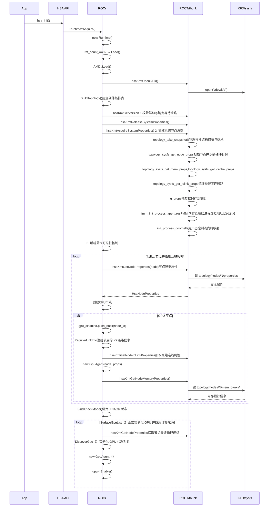

### 8.2 代理发现hsa_iterate_agents

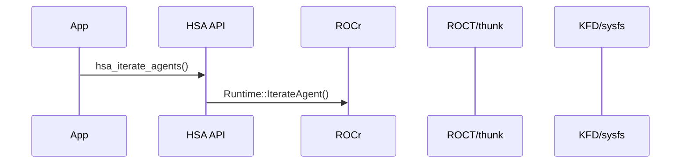

在hsa_init()时，就创建了cpu_agents_和gpu_agents_，这时直接遍历整个代理列表

### 8.3 获取代理的属性hsa_agent_get_info

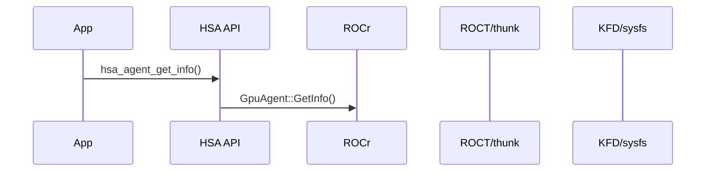

也是在hsa_init()时，创建cpu_agents_和gpu_agents_时已经把相应属性从系统抓取了。

### 8.4 内存池发现hsa_amd_agent_iterate_memory_pools


